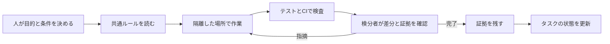
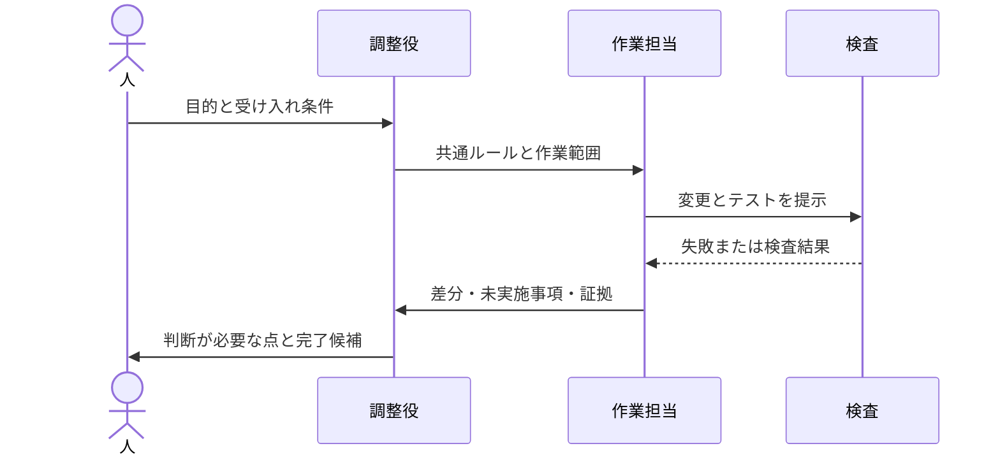
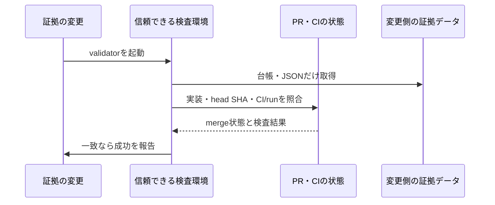
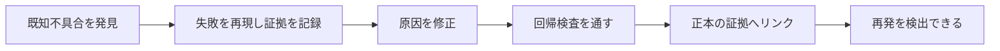

# ハーネスエンジニアリングができているかどうか振り返ってみた

今開発中のプロジェクトには、AIエージェントの作業環境や検査、完了証拠を整える仕組みがあります。一方で、開発速度や品質への効果、他の環境での再現性はまだ測れていません。この記事では、実装とCIで確認した範囲を振り返り、別のプロジェクトへ移せる形に整理します。

## ハーネスをモデルの外側に置く

OpenAIのHarness Engineeringの記事では、エージェントに与える環境や文脈、機械で確かめられる境界、フィードバックの流れを設計対象として扱っています。私はこれを、モデルに「気をつけて」と頼むだけでなく、作業が迷いにくく、失敗を検出でき、結果を後から確かめられる環境を整えることだと受け取りました。[Harness engineering: leveraging Codex in an agent-first world](https://openai.com/index/harness-engineering/)

開発の流れを大づかみに描くと、こうなります。



検分者は別のAIエージェントでも構いません。ただし、要件や権限を決め、証拠の妥当性を判断して最終責任を持つのは人です。コード形式は機械で調べられても、要件や実機試験の妥当性は人が確認します。

## 正本と一時メモを分ける

今開発中のプロジェクトでは、エージェント向けの入口を共通ルールへ案内する形にしています。同じ規約を複数の入口へ複製すると、一方だけ直って古い指示が残りやすいためです。

長く残す横断タスクは永続タスク台帳へ、一つの作業期間だけ使う細かな進捗は一時作業メモへ分けます。台帳には固定の列構成を持たせ、列数やIDの重複を自動検査します。置き場所は「次の担当者にも必要か」で決め、重要な約束は差分から違反を見つけられる形にします。

規約だけでなく、既存コードにも番人があります。あるアーキテクチャ検査は別領域のRepositoryへの直接依存を調べ、既存違反を凍結管理する方式で、新しい直接依存違反を検出します。したがって、検査がgreenでも、過去の違反がすべて解消済みとは限りません。別の台帳検査はIDの重複を、API仕様のCI検査はAPI変更後の仕様書との差分を検出します。巨大な規約文書を読むだけでなく、守りたいルールを実行時に検査する例です。

## 隔離とフィードバックをひと続きにする

変更は専用の作業場所で行います。作業木を分けることで、別の担当者やセッションの編集と混ざるのを減らせます。タスク台帳の更新も同じ流れでレビューを通し、記録だけを例外扱いしません。並行編集で完了記録が失われるのを防ぐためです。

担当名やモデル名はそのまま移植せず、責務で考えます。

| 一般的な役割 | 主な責務 |
| --- | --- |
| 要件責任者 | 目的、受け入れ条件、権限、最終判断を決める |
| 調整役 | 作業の範囲を整理し、担当を割り当て、結果を統合する |
| 調査・設計担当 | 既存仕様を調べ、設計と検査条件を具体化する |
| 実装担当 | 隔離された場所で変更し、検査結果と未実施事項を報告する |
| 検分者 | 差分、テスト、証拠を独立した視点で確かめる |



## 今回整えた五つの仕組み

今回の改善は、環境診断、検査範囲の可視化、完了証拠ゲート、再現性計測、既知不具合をredからgreenまで記録する流れの五つです。ここで説明するのは主に開発用toolingです。アプリの画面や認可を変更する場合は、CLIの成功だけでは足りず、画面を操作し権限あり・なしや別ロールをまたいだ実機確認も必要です。

### 1. 環境を診断する

環境診断ツールは、必要な言語処理系や開発ツールの有無、期待する版との違い、設定ファイルを調べます。既定では読み取りだけを行い、外部接続、認証確認、データベース操作、サービスの起動・停止はしません。環境変数は値を出さず、設定されているかだけを表示します。Git hookの導入など環境を変更する操作は明示した場合に限ります。

実際の診断では、Node.jsやnpmの版の不一致、必要なコマンドの不足が見つかりました。設定自体は変更していません。診断対象は実行したシェルの環境だけなので、Windows側の結果からWSL側の状態までは分かりません。

### 2. 検査範囲を可視化する

画面台帳の宣言とVueファイルから得たrouteを照合した実測は、521ファイル、unique route 519、追跡対象26、対象外493、台帳違反0でした。この数値は「どこを追跡対象として宣言したか」を表します。

画面からリンクをたどれること、認可、機能の正しさは証明しません。521ファイルすべてを画面操作で確認したわけではなく、追跡対象数と検査が保証する性質は分けて読みます。

### 3. 完了証拠ゲートで記録を照合する

タスクを完了にする変更には、受け入れ条件、対応するテスト、CI実行などを記録した証拠を求めます。さらに、実装のレビュー結果と証拠が対応しているかを検査します。

GitHub Actionsの `pull_request_target` で動く検査では、信頼できるbase側のvalidatorを実行し、変更側からは台帳や証拠JSONのデータだけを読みます。変更側のコードを実行する設計にはしません。この境界を設けても、記録された内容が真実か、実機確認が説明どおり行われたかまでは自動で判断できず、検分者が証拠の中身を確かめます。

この仕組みを導入した後、実際の完了証拠1件について新ゲートのデータ照合が成功しました。実装のmerge状態、head SHA、CI/run、証拠ファイルの存在と変更範囲が確認対象です。



### 4. 反復計測の型を用意する

計測器は、事前に記録した試行をcaseごとに集計します。モデル呼び出しや外部接続はしません。比較条件、開始SHA、モデル、環境、受け入れ条件を固定し、各caseを独立した作業場所で最低3回試す計画です。

成功率の分母は全試行です。途中で止まった試行も失敗として含めます。試行数が0の率と未測定費用は `null` とし、測定済みの0費用と区別します。

次は集計器にそのまま渡せる架空のJSON記入例です。測定した成功runの形式を示すだけで、実測結果ではありません。

```json
{
  "schemaVersion": 1,
  "cases": [
    {
      "id": "guard-fix",
      "startSha": "0123456789abcdef0123456789abcdef01234567",
      "model": "example-model",
      "effort": "medium",
      "environment": "架空例; Node 24; Linux; fixture-v1",
      "costUnit": "USD",
      "acceptanceCriteria": [
        { "id": "AC-1", "description": "違反を再現できる" },
        { "id": "AC-2", "description": "修正後に検査が通る" }
      ],
      "runs": [
        {
          "id": "run-1",
          "completed": true,
          "passedCriteria": ["AC-1", "AC-2"],
          "defects": 0,
          "interventions": 1,
          "durationSeconds": 900,
          "cost": null
        }
      ]
    }
  ]
}
```

集計結果には全run数、完全成功率、条件達成率、欠陥数、介入回数、所要時間が出ます。費用が未測定なので、この例の総費用は `null` です。未完了runや条件未達runも記録から外さず、成功率の分母へ含めます。

### 5. 既知の不具合をredからgreenまで記録する

既知の不具合を再現して失敗する状態（red）を残し、原因を修正した後に回帰検査が通る状態（green）を確認して、証拠を正本へ結びます。今回は共有されたGit hookの権限を書き換えてしまう経路を再現し、作業場所から共有領域へ書き込まない修正をテストで確認しました。



### 実装とCIの検証

ハーネス関連の4つのテスト群、計25件が成功し、CIは全項目が成功または明示的skipでした。失敗・未完了はありません。完了証拠ゲートも、実データ1件の照合に成功しました。

ただし、AIを使った反復実験はまだ0回です。仕組みのテストが通ったことは、作業時間や費用が下がった証拠ではありません。測定の器を作った段階で、効果比較は今後の課題です。

## 他のプロジェクトへ移す最小構成

ここからは移植用の概念例です。実際のファイル名や配置は、チームの道具に合わせてください。

```text
開発プロジェクト/
├── 規約の入口
├── 共通ルール
├── 設計と完了証拠/
├── 永続タスク台帳
├── 一時作業メモ/
├── 検査の入口
└── CI設定
```

Node.jsを使う場合のpackage.jsonのscript定義例です。下記は一般化した雛形で、前提となる各scriptはプロジェクトごとに用意します。

```json
{
  "scripts": {
    "lint": "eslint .",
    "test": "vitest run",
    "build": "tsc -p tsconfig.json",
    "verify": "npm run lint && npm test && npm run build"
  }
}
```

ローカルとCIの両方から `npm run verify` を呼べば、別々の検査手順がずれるのを防ぎやすくなります。WindowsではWSLやGit Bashなど、POSIX shellを使う環境を選ぶか、プロジェクトに合ったWindows用scriptを定義します。

エージェント向け入口は、共通ルール、隔離方法、検査コマンド、完了報告の要件を短く案内します。受け入れ条件と証拠は、たとえば次のように対応づけられます。

```text
AC-1: 空の入力は拒否される
  実装: 入力検証機能
  テスト: 空入力を拒否する検査
  実行: npm test -- --run
結果: pass / CI run 123456
```

これはVitestを使う架空のNode.jsプロジェクト例です。テスト名だけで達成と判断せず、検査が受け入れ条件を本当に確認しているかも見ます。

### 導入を小さく始める

1. **入口を決める**: エージェントが読む入口と、共通ルールの正本を一つ決める。
2. **作業を隔離する**: branchやworktreeなど、並行作業で上書きしない単位を選ぶ。
3. **検査コマンドを一本化する**: lint、テスト、ビルドを共通scriptから実行できるようにする。
4. **条件を検査へ結ぶ**: 重要な受け入れ条件にテストや機械的な番人を対応させる。
5. **未実施を記録する**: 実機確認や費用の未測定を成功や0として扱わない。
6. **必要な範囲を計測する**: 固定条件で複数回試し、成功、介入、時間、費用を残す。
7. **CIも同じ入口を使う**: ローカルとCIの検査内容をそろえる。
8. **秘密と権限の境界を決める**: ログへ値を出さず、変更側コードを実行するjobの権限を絞る。

移植時には、次の項目もチェックできます。

- [ ] 共通ルールの正本が一つに決まっている
- [ ] 各作業が専用branchやworktreeに隔離される
- [ ] ローカルとCIが同じ検査入口を使う
- [ ] 重要な受け入れ条件がテストや番人に対応している
- [ ] 未実施の確認を成功扱いしない
- [ ] 失敗・中断した試行も成功率の分母に含める

最初から完了証拠ゲートや複雑なCIを作る必要はありません。小規模ならPR本文のチェック欄とCIから始め、後で完了根拠をたどれなくなった段階で証拠形式やvalidatorを検討できます。

## 移植時に決め直すこと

| 仕組み | 移植先で決めること |
| --- | --- |
| 規約の入口 | エージェントごとの入口と共通ルールの正本 |
| 作業の隔離 | 同時作業が衝突しにくい単位 |
| 環境診断 | 言語や開発環境に必要なツールと診断範囲 |
| 対象範囲の検査 | 追跡対象の宣言と実体を照合する方法 |
| 完了証拠 | 受け入れ条件、テスト、PR、CIを結ぶ形式 |
| 担当の役割 | 要件、調整、調査、実装、検分の責務 |
| 反復計測 | 比較する課題、条件、単位、集計方法 |

既存の仕組みを丸ごと移すのではなく、自分たちが守りたい性質を先に決めます。画面台帳のないアプリに画面route検査を導入しても役に立ちません。DB変更やAPI契約が壊れやすいなら、その差分を検出する番人から始める方法があります。

## これから確かめたいこと

今後は、番人違反の修正、API契約の不具合、画面導線の欠落など、異なる課題をcaseに分けて試す計画です。それぞれ同じ開始状態、モデル、実行環境、受け入れ条件を固定して最低3回実施し、成功率、欠陥数、介入回数、時間、費用を比較します。モデルや環境が変わった試行は同じcaseに混ぜません。

課題選びや実験者による差は残り、3回だけで強い統計的結論は出せません。再現可能な比較の出発点として使い、結果が出るまでは成功率や費用が改善したとは主張しません。

私の評価は「検査と証拠を備える構造はあるが、AI開発への効果の再現性はこれから確かめる」です。受け入れ条件や証拠の妥当性、アプリの実機確認には人の判断も引き続き必要です。

図はQiitaが案内するMermaid記法で記述しています（[Qiita公式ガイド](https://qiita.com/Qiita/items/c686397e4a0f4f11683d)）。タグ候補: `AI` `開発` `エージェント` `テスト` `効率化`
