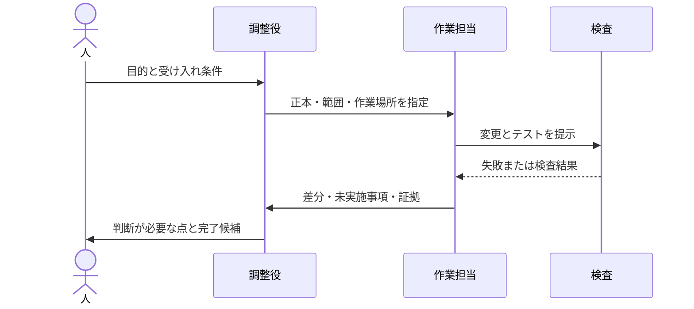

# ハーネスエンジニアリングができているかどうか振り返ってみた

AIエージェントにコードを書いてもらうとき、モデルの賢さだけでなく、作業場所、渡す文脈、実行できる検査、失敗を見つけて戻す流れが結果を左右します。これらをまとめて「ハーネス」と呼び、今回は自分が開発している Mannschaft の仕組みを棚卸ししました。

先に断っておくと、これは「ハーネスエンジニアリング認定」のような評価ではありません。実装とCIの記録を材料にした、筆者個人の振り返りです。また、ハーネスを入れれば開発が何倍速くなる、といった効果測定もまだしていません。ここで紹介するのは、別のプロジェクトでも試せる構造と、今確認できている範囲です。

## ハーネスをモデルの外側に置く

OpenAIのHarness Engineeringの記事では、エージェントに渡す環境や文脈、機械で判定できる境界、フィードバックループを設計対象として扱っています。私はこれを、モデルに「気をつけて」と頼むだけでなく、作業が迷いにくく、失敗を検出でき、結果を後から確かめられる環境を整えることだと受け取りました。[Harness engineering: leveraging Codex in an agent-first world](https://openai.com/index/harness-engineering/)

私たちの仕組みを大づかみに描くと、こうなります。


この流れの肝は、エージェントに任せる範囲と、人が判断する範囲を分けることです。コードの形式や必須ファイルの存在は機械で確かめやすい一方、「この要件でよいか」「記録された実機試験は本当に要件を満たすか」は人の判断が要ります。自動化の量だけを増やすのではなく、どこまでを機械が保証するかを明示するようにしています。

## まず、プロジェクトの正本を一つにする

Mannschaftでは [`CLAUDE.md`](https://github.com/kenta-0420/mannschaft/blob/main/CLAUDE.md) に開発の入口や大きな規約を置き、Codex向けの [`AGENTS.md`](https://github.com/kenta-0420/mannschaft/blob/main/AGENTS.md) はその正本へ案内する役にとどめています。ツールごとに同じ規約を複製すると、片方だけ直って古い指示が残るからです。

長く残す横断タスクは [`docs/task-list.md`](https://github.com/kenta-0420/mannschaft/blob/main/docs/task-list.md) に置きます。一つの作業期間だけ使う詳細な進捗地図は `.claude/campaigns/` に分け、完了後に捨てます。前者はGitで追跡する永続情報、後者は作業中だけの情報です。全情報を永久保存するのではなく、「次の担当者にも必要か」で置き場所を決めています。

台帳の行は7列に固定し、列数やIDの重複は既存の番人で検出します。ここでは、文章上の約束を「人が覚えている」状態から、差分で違反を見つけられる状態へ移せました。新しいプロジェクトでは、最初から巨大な規約集を作る必要はありません。まず入口文書を一つ決め、詳細規約や一時メモの置き先を分け、重要な形式制約を一つ自動検査するところから始められます。

## 隔離とフィードバックをひと続きにする

変更は専用のworktreeで行います。作業ディレクトリを分けることで、別セッションの編集や共有作業木との混線を減らせます。加えて、台帳更新も同じくworktreeとPRを通します。記録だけだから安全、と例外扱いすると、並行編集で完了記録が失われることがあったためです。

開発の基本ループは、受け入れ条件を決め、検査で失敗を再現し、実装で通し、差分を検分して証拠と一緒に閉じることです。Mannschaftの運用文書では大名の役職名を使っていますが、これはプロジェクト固有の呼び方です。他へ移すなら、名前ではなく責務に置き換えます。

| Mannschaftでの呼び名 | 一般化した役割 |
| --- | --- |
| マスター | 要件と最終判断を担う人 |
| 殿 | 全体の整理と成果の統合を担う担当 |
| 家老 | 調査や設計を担当する人またはエージェント |
| 足軽 | 隔離環境で一つの変更を実装する担当 |



役割名やモデル名、コマンド名をそのままコピーする必要はありません。大切なのは、誰が要件を決め、誰が作業し、誰が別の目で結果を確かめるかを曖昧にしないことです。

## 今回追加した五つの確認

今回のハーネス整備では、環境診断、検査範囲の可視化、反復計測、完了証拠、台帳との接続を整えました。仕組みの入口は [`docs/development/harness-engineering.md`](https://github.com/kenta-0420/mannschaft/blob/main/docs/development/harness-engineering.md) にまとめています。

### 1. 作業環境の診断

`node scripts/harness-doctor.mjs` はNode.js、npm、Java、Git、GitHub CLI、Docker CLIや設定ファイルを調べます。既定は診断だけで、ネットワーク接続、認証確認、DB操作、サービス起動はしません。値そのものを表示せず、環境変数は設定有無だけを出します。hookの導入は `--install-hooks` を付けた明示操作に分けています。

この設計で「足りないツールがあった」「秘密の値を診断ログに出した」といった問題を分けやすくなります。実際の診断では期待するNode/npmの版との不一致やDocker CLI不在などが見つかりましたが、環境設定は変更していません。環境doctorはコマンドを実行したシェルだけを見るため、Windows側で見つからないツールがWSL側にもないとは限りません。これは診断結果を読む際の注意点です。

### 2. 検査範囲の可視化

`node scripts/guard-coverage.mjs` は画面台帳の宣言とVueファイルから得たrouteを照合します。記録した実測はVue 521ファイル、unique route 519、追跡対象26、対象外493、台帳違反0でした。数値は「どこを追跡対象として宣言したか」を示します。

これは画面からリンクをたどれることや、権限によって正しく表示されることを証明しません。521件すべての到達性や機能の正しさを確認した、と読める書き方は避ける必要があります。検査対象の数と、検査が保証する性質をセットで説明するのが大切です。

### 3. 完了証拠と台帳を結ぶ

完了証拠ゲートは、台帳の状態を「完了」に変えるPRに証拠JSONを求め、実装PRのmerge状態、head SHA、CI状態を照合します。完了行、証拠ファイル、受け入れ条件とテスト参照を後から確認できます。

PRから実行コードを取得する仕組みに権限を与えるのは危険なので、GitHubの `pull_request_target` ではbase側の信頼できるvalidatorを実行します。PR headのファイルはデータとして読むだけです。この境界を置いても、証拠JSONに書かれた内容が真実か、実機確認が説明どおり行われたかまでは自動判定できません。そこは検分者が証拠の中身を見る必要があります。

### 4. 反復計測の型を用意する

`node scripts/harness-benchmark.mjs <記録.json>` は、事前に記録された試行をcaseごとに集計します。モデル呼び出しや外部接続をするCLIではありません。比較する条件、開始SHA、モデル、環境、受け入れ条件を固定し、各caseを独立worktreeで最低3回試す計画です。

成功率の分母は完了した試行だけではなく全runです。途中で止まったrunも失敗として残し、0 runの率は `null`、未測定の費用も `null` にします。測定済みの0費用とは区別します。こうして都合の悪い失敗を消したり、測っていない値を0として扱ったりしにくくします。

たとえば、次の記録は形式の例です。実測値ではありません。

```json
{
  "id": "guard-fix",
  "startSha": "0123456789abcdef0123456789abcdef01234567",
  "model": "固定したモデル名",
  "effort": "medium",
  "environment": "OS・Node版・fixture識別子",
  "acceptanceCriteria": [
    { "id": "AC-1", "description": "違反を再現できる" },
    { "id": "AC-2", "description": "修正後に番人が通る" }
  ],
  "runs": [
    {
      "id": "run-1",
      "completed": true,
      "passedCriteria": ["AC-1", "AC-2"],
      "defects": 0,
      "interventions": 1,
      "durationSeconds": 900,
      "cost": null
    }
  ]
}
```

実際のCLI用JSONはcase一覧や費用単位などを含むschemaに従います。上の抜粋だけを保存してCLIが受理すると誤解しないでください。具体的な形式は[計測手順](https://github.com/kenta-0420/mannschaft/blob/main/docs/development/harness-benchmark.md)を参照してください。

### 5. 改善をPRとテストで確かめる

実装PR #3746 はマージ済みで、ハーネス関連の4テストファイル、計25件が成功しました。実装PRのCIは全check成功または明示skipで、失敗・未完了はありません。doctor、coverage、benchmark、完了証拠の正負例や、既知のhook共有書込の回帰を確認しています。詳細は[完了証拠](https://github.com/kenta-0420/mannschaft/blob/main/docs/evidence/CMP-261010-0006.md)に記録しました。台帳と証拠JSONを新しいゲートで検証する証拠PR [#3747](https://github.com/kenta-0420/mannschaft/pull/3747) は作成済みで、記事執筆時点ではCI待ちです。

ただし、AIを使った反復実験はまだ0回です。仕組みのテストが通ったことは、作業時間や費用が下がった証拠ではありません。測定の器を作った段階であり、効果の比較は今後の課題です。

## 他プロジェクトへ移す最小構成

ここからはMannschaftの既存CLIとは別に、移植の出発点として使える雛形です。以下をコピーすれば同じツールが動く、という意味ではありません。`verify`、`test`、`build`などを自分のプロジェクトの実コマンドへ置き換えてください。

```text
project/
├── AGENTS.md                 # エージェント向け入口と正本への案内
├── CONTRIBUTING.md           # 人にも共有する開発ルール
├── docs/
│   ├── task-list.md          # 横断タスクの正本
│   └── evidence/             # 完了根拠（必要な場合）
├── scripts/
│   └── verify.sh             # 検査を一つの入口にまとめる
└── .github/workflows/ci.yml  # verifyをCIでも実行
```

入口文書は短く保ちます。たとえば次のように、正本、作業隔離、検査コマンド、完了報告に必要なものだけを書く方法があります。

```markdown
# AGENTS.md

- 開発ルールの正本: [CONTRIBUTING.md](CONTRIBUTING.md)
- 作業は専用branchまたはworktreeで行う
- 変更後は `./scripts/verify.sh` を実行する
- 完了報告には変更、実行した検査、未実施事項を記載する
```

要件から証拠までの対応は、小さくても残しておくと便利です。

```text
AC-1: 入力が空ならエラーになる
  実装: src/validate.ts
  テスト: test/validate.test.ts / "空入力を拒否する"
  実行: npm test -- --run test/validate.test.ts
結果: pass / CI run 123456
```

これだけでも、「何を満たすつもりだったか」「どの検査がそれを見たか」「どこで実行されたか」を結べます。テスト名を並べるだけで要件を満たした扱いにせず、テストが実際に条件を確かめているかは人が確認します。

### 導入を小さく始める

1. **入口を決める**: エージェントが最初に読むファイルと、詳細規約の正本を一つ決める。
2. **作業を隔離する**: branchやworktreeなど、同時作業が上書きしない単位を選ぶ。
3. **実行コマンドを一本化する**: lint、テスト、ビルドのうち、最初に必要なものをスクリプト経由で実行できるようにする。
4. **受け入れ条件を検査へ結ぶ**: 重要な条件からテストまたは機械的な番人を対応づける。
5. **未実施を記録する**: 動かしていない実機確認や測れていない費用を、成功や0として扱わない。
6. **必要な範囲だけ計測する**: 代表課題を固定条件で複数回解き、成功、介入、時間、費用を残す。

最初から完了証拠ゲートや複雑なCIを移植する必要はありません。変更が小さなうちは、PR本文のチェック欄とCIだけで十分かもしれません。完了状態が複数人に影響し、後で根拠をたどれなくなった段階で、証拠JSONやvalidatorを検討できます。

## 移植時に置き換えるもの

| Mannschaftの例 | 移植先で決めること |
| --- | --- |
| `CLAUDE.md` / `AGENTS.md` | 利用エージェントごとの入口と、共通規約の正本 |
| worktree | チームで衝突を避けられる隔離単位 |
| `node scripts/harness-doctor.mjs` | 言語・実行環境・必要ツールに合うread-only診断 |
| `node scripts/guard-coverage.mjs` | 重要な対象の宣言と実体を照合する番人 |
| AC・テスト参照・CI runの証拠 | 自分たちのPR、CI、テスト管理に対応する記録 |
| 大名の役職・スラッシュコマンド | 実際の担当者・エージェント・CI job名 |
| benchmark JSON | 比較する課題、モデル、条件、単位に合った記録形式 |

値やschemaを丸ごと持ってくるより、まず自分たちが守りたい性質を言葉にし、その性質を検査する方法を選ぶ方が安全です。たとえば画面台帳を持たないアプリにroute coverage CLIを移しても、役に立ちません。逆に、DB migrationやAPI契約が壊れやすいサービスなら、その領域の差分を検出する番人を先に作る方が効果的です。

## これから確かめたいこと

次は同程度の課題を3種類選び、それぞれ同じ開始SHA、モデル、effort、fixture、受け入れ条件で最低3回実行します。例は番人違反の修正、API契約の不具合、UI導線の欠落です。課題同士は混ぜず、case別に成功率、欠陥数、介入回数、所要時間、費用を比較します。モデルや環境が変わった試行は、同じ条件のrunに混ぜません。

この方法でも課題の選び方や実験者の差は残りますし、3回は強い統計的結論を出すには少ない回数です。まず再現可能な比較の型を作り、結果を見て回数や課題を見直すための小さな開始点です。結果が出るまでは「成功率が上がった」「費用を削減した」と主張しません。

Mannschaftでは、環境の診断、検査範囲の表示、条件とテストの紐づけ、完了証拠の保存を機械に担わせるところまでは用意できました。受け入れ条件の妥当性、証拠の真実性、実画面での使いやすさは人の確認として残っています。ハーネスを「できている」と言えるかは、目的と対象範囲を決めて初めて評価できるものだと思います。今回の私の評価は、再現性を意識した構造はできつつあるが、効果の実測と人間の確認を含めて完成とはまだ言えない、です。

参照した実装文書: [ハーネス入口](https://github.com/kenta-0420/mannschaft/blob/main/docs/development/harness-engineering.md)、[環境診断とcoverage](https://github.com/kenta-0420/mannschaft/blob/main/docs/development/harness-environment.md)、[再現性計測](https://github.com/kenta-0420/mannschaft/blob/main/docs/development/harness-benchmark.md)、[完了証拠ゲート](https://github.com/kenta-0420/mannschaft/blob/main/docs/development/completion-evidence.md)。

図はQiitaが案内するMermaid記法で記述しています（[Qiita公式ガイド](https://qiita.com/Qiita/items/c686397e4a0f4f11683e)）。タグ候補: `AI` `開発` `エージェント` `テスト` `効率化`
