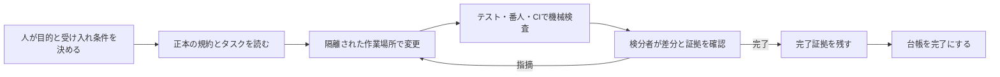
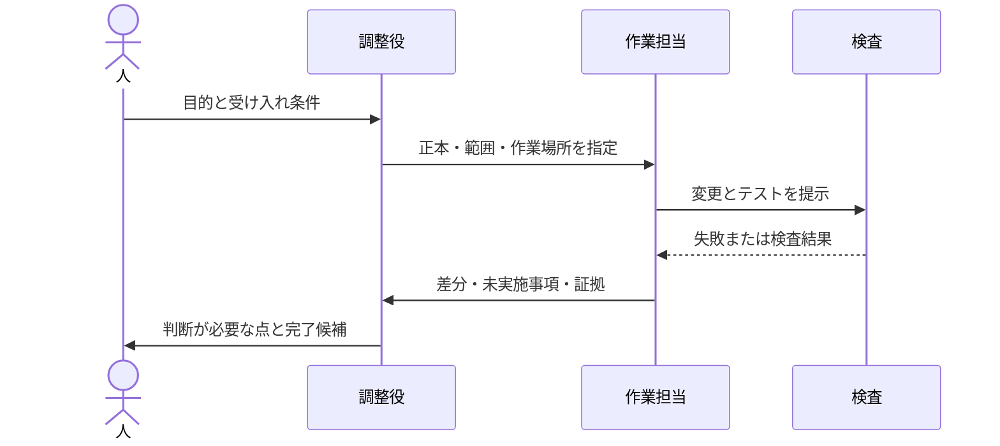
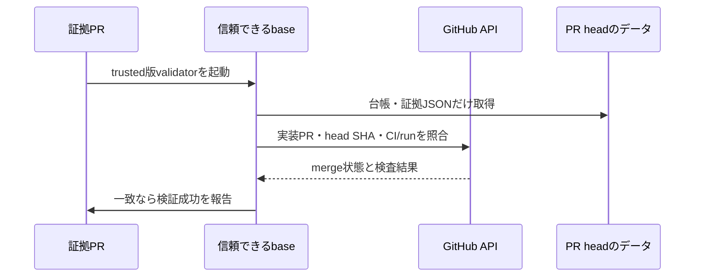
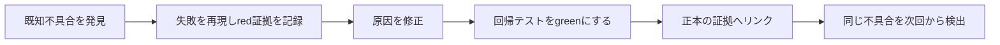

# ハーネスエンジニアリングができているかどうか振り返ってみた

Mannschaftには、ハーネスを設計・検証する仕組みがあります。ただし、開発成果への効果や再現性はまだ実測していません。今回はモデルの賢さだけでなく、作業場所、渡す文脈、検査、失敗から戻す流れをどう整えたか振り返ります。

実装とCI記録に基づく筆者個人の評価として、別プロジェクトへ移せる構造と確認できた範囲を紹介します。

## ハーネスをモデルの外側に置く

OpenAIのHarness Engineeringの記事では、エージェントに渡す環境や文脈、機械で判定できる境界、フィードバックループを設計対象として扱っています。私はこれを、モデルに「気をつけて」と頼むだけでなく、作業が迷いにくく、失敗を検出でき、結果を後から確かめられる環境を整えることだと受け取りました。[Harness engineering: leveraging Codex in an agent-first world](https://openai.com/index/harness-engineering/)

私たちの仕組みを大づかみに描くと、こうなります。



検分者は別のAIエージェントでも構いませんが、要件や権限、証拠の妥当性を判断し、最終責任を持つのは人です。コード形式は機械で調べられても、要件や実機試験の妥当性は人が確認します。

## まず、プロジェクトの正本を一つにする

Mannschaftでは [`CLAUDE.md`](https://github.com/kenta-0420/mannschaft/blob/main/CLAUDE.md) に開発の規約を置き、Codex向けの [`AGENTS.md`](https://github.com/kenta-0420/mannschaft/blob/main/AGENTS.md) は正本への案内役にしています。同じ規約を複製すると、片方だけ直って古い指示が残るためです。

横断タスクはGit追跡する [`docs/task-list.md`](https://github.com/kenta-0420/mannschaft/blob/main/docs/task-list.md) に置き、一時的な進捗地図は `.claude/campaigns/` に分けて完了後に捨てます。次の担当者にも必要かで保存先を決めています。

台帳は7列に固定し、列数とID重複を番人が検出します。重要な約束を、差分から違反を見つけられる形にしました。移植先も入口文書と詳細規約、一時メモの置き場を決め、重要な形式制約を一つ自動検査するところから始められます。

規約だけでなく、既存コードにも番人があります。[`CrossDomainRepositoryDependencyArchTest`](https://github.com/kenta-0420/mannschaft/blob/main/backend/src/test/java/com/mannschaft/app/common/architecture/CrossDomainRepositoryDependencyArchTest.java) は別ドメインRepositoryへの直接依存を検出します。`FreezingArchRule`で既存違反を凍結しているため、新しい直接依存違反が失敗します。greenでも過去の違反がすべて解消済みとは限りません。[`TaskListCmpIdDuplicateGuardTest`](https://github.com/kenta-0420/mannschaft/blob/main/backend/src/test/java/com/mannschaft/app/common/architecture/TaskListCmpIdDuplicateGuardTest.java) は台帳のID重複を、[OpenAPI Drift Check](https://github.com/kenta-0420/mannschaft/blob/main/.github/workflows/openapi-drift-check.yml) はAPI関連変更後に仕様を再生成し、`docs/openapi.json`との差分をCIで失敗させます。

## 隔離とフィードバックをひと続きにする

変更は専用のworktreeで行います。作業ディレクトリを分けることで、別セッションの編集や共有作業木との混線を減らせます。加えて、台帳更新も同じくworktreeとPRを通します。記録だけだから安全、と例外扱いすると、並行編集で完了記録が失われることがあったためです。

開発の基本ループは、受け入れ条件を決め、検査で失敗を再現し、実装で通し、差分を検分して証拠と一緒に閉じることです。Mannschaftの運用文書では大名の役職名を使っていますが、これはプロジェクト固有の呼び方です。他へ移すなら、名前ではなく責務に置き換えます。

| Mannschaftでの呼び名 | 一般化した役割 |
| --- | --- |
| マスター | 要件と最終判断を担う人 |
| 殿 | 全体の整理と成果の統合を担う担当 |
| 家老 | 調査や設計を担当する人またはエージェント |
| 足軽 | 隔離環境で一つの変更を実装する担当 |



役割名やモデル名、コマンド名をそのままコピーする必要はありません。大切なのは、誰が要件を決め、誰が作業し、誰が別の目で結果を確かめるかを曖昧にしないことです。

## 今回追加した五つの確認

今回整えたのは、完了証拠ゲート、既知不具合をredからgreenまで記録する流れ、環境診断、検査範囲の可視化、反復計測の五つです。仕組みの入口は [`docs/development/harness-engineering.md`](https://github.com/kenta-0420/mannschaft/blob/main/docs/development/harness-engineering.md) にあります。

これは主に開発toolingの確認です。アプリの画面や認可を変更するPRでは、CLIの成功だけで終えず、画面を実際に操作し、権限あり・なしや別ロールをまたぐ実機確認が必要です。

### 1. 作業環境の診断

`node scripts/harness-doctor.mjs` はNode.js、npm、Java、Git、GitHub CLI、Docker CLIや設定ファイルを調べます。既定は診断だけで、ネットワーク接続、認証確認、DB操作、サービス起動はしません。値そのものを表示せず、環境変数は設定有無だけを出します。hookの導入は `--install-hooks` を付けた明示操作に分けています。

診断ではNode/npmの版不一致やDocker CLI不在などを見つけましたが、設定は変更していません。対象は実行したシェルの環境だけなので、Windows側の結果からWSL側の状態までは分かりません。

### 2. 検査範囲の可視化

`node scripts/guard-coverage.mjs` は画面台帳の宣言とVueファイルから得たrouteを照合します。記録した実測はVue 521ファイル、unique route 519、追跡対象26、対象外493、台帳違反0でした。数値は「どこを追跡対象として宣言したか」を示します。

この結果はリンク到達性、認可、機能の正しさを証明しません。521ファイルすべての画面を確認したとは言えず、追跡対象数と保証範囲は分けて読みます。

### 3. 完了証拠と台帳を結ぶ

完了証拠ゲートは、台帳を「完了」に変えるPRへ証拠JSONを求め、実装PRのmerge状態、head SHA、CIを照合します。完了行と証拠、受け入れ条件、テスト参照を後からたどれます。

`pull_request_target` ではbase側のvalidatorを実行し、PR headからは台帳とJSONのデータだけを読みます。これでPR由来コードの実行を避けますが、証拠の真実性や実機確認の妥当性までは自動で判断できず、検分者が中身を確認します。

実際に証拠PR #3747 で新ゲートを走らせ、完了証拠1件についてvalidatorが変更内容を検査した結果、成功しました。PR #3746 のmerge状態・head SHA・CI/run、証拠ファイルの存在と変更範囲を照合しています。[Task List PR Gateの実装](https://github.com/kenta-0420/mannschaft/blob/main/.github/workflows/task-list-pr-gate.yml) と[証拠validator](https://github.com/kenta-0420/mannschaft/blob/main/scripts/completion-evidence.mjs)がこの経路を担います。



### 4. 反復計測の型を用意する

`node scripts/harness-benchmark.mjs <記録.json>` は、事前に記録された試行をcaseごとに集計します。モデル呼び出しや外部接続をするCLIではありません。比較する条件、開始SHA、モデル、環境、受け入れ条件を固定し、各caseを独立worktreeで最低3回試す計画です。

成功率の分母は全runで、途中中断も失敗として含めます。0 runの率と未測定費用は `null` にし、測定済みの0費用と区別します。

次は `node scripts/harness-benchmark.mjs <記録.json>` にそのまま渡せる、架空の記入例です。成功した試行の観測値を入れていますが、実測結果ではありません。

```json
{
  "schemaVersion": 1,
  "cases": [
    {
      "id": "guard-fix",
      "startSha": "0123456789abcdef0123456789abcdef01234567",
      "model": "example-model",
      "effort": "medium",
      "environment": "架空例; Node 24; Linux; fixture-v1",
      "costUnit": "USD",
      "acceptanceCriteria": [
        { "id": "AC-1", "description": "違反を再現できる" },
        { "id": "AC-2", "description": "修正後に番人が通る" }
      ],
      "runs": [
        {
          "id": "run-1",
          "completed": true,
          "passedCriteria": ["AC-1", "AC-2"],
          "defects": 0,
          "interventions": 1,
          "durationSeconds": 900,
          "cost": null
        }
      ]
    }
  ]
}
```

費用が未測定なので、この例の集計結果でも総費用は `null` です。具体的な計測手順は[計測文書](https://github.com/kenta-0420/mannschaft/blob/main/docs/development/harness-benchmark.md)を参照してください。

### 5. 既知の不具合をredからgreenまで記録する

既知の不具合があると分かったら、まず現象を再現して失敗する状態（red）を記録し、修正後に通る状態（green）をテストと証拠へ残します。今回はlinked worktreeから共有Git hookの実行権限を書き換えてしまう経路をredとして記録し、doctorが共有領域へ書き込まない修正をテストで確認しました。[redの再現記録](https://github.com/kenta-0420/mannschaft/blob/main/docs/evidence/CMP-261010-0006-hook-regression.md) と[完了証拠](https://github.com/kenta-0420/mannschaft/blob/main/docs/evidence/CMP-261010-0006.md)に経緯があります。



### 実装とCIの検証

実装PR #3746 はマージ済みで、ハーネス関連の4テストファイル、計25件が成功しました。実装PRのCIは全check成功または明示skipで、失敗・未完了はありません。証拠PR [#3747](https://github.com/kenta-0420/mannschaft/pull/3747) でも新しい完了ゲートの実データ照合に成功しました。詳細は[完了証拠](https://github.com/kenta-0420/mannschaft/blob/main/docs/evidence/CMP-261010-0006.md)に記録しています。

ただし、AIを使った反復実験はまだ0回です。仕組みのテストが通ったことは、作業時間や費用が下がった証拠ではありません。測定の器を作った段階であり、効果の比較は今後の課題です。

## 他プロジェクトへ移す最小構成

ここからはMannschaftの既存CLIとは別に、移植の出発点として使える雛形です。以下をコピーすれば同じツールが動く、という意味ではありません。`verify`、`test`、`build`などを自分のプロジェクトの実コマンドへ置き換えてください。

```text
project/
├── AGENTS.md                 # エージェント向け入口と正本への案内
├── CONTRIBUTING.md           # 人にも共有する開発ルール
├── docs/
│   ├── task-list.md          # 横断タスクの正本
│   └── evidence/             # 完了根拠（必要な場合）
├── scripts/
│   └── verify.sh             # 検査を一つの入口にまとめる
└── .github/workflows/ci.yml  # verifyをCIでも実行
```

Node.jsプロジェクトなら、たとえば次のように実コマンドを一つの入口へまとめられます。この例は `package.json` に `lint`、`test`、`build` の各scriptがある前提です。

```sh
#!/usr/bin/env sh
set -eu
npm run lint
npm test
npm run build
```

この内容を `scripts/verify.sh` に置き、CIからも同じスクリプトを呼びます。新規ファイルの実行bitに依存しないよう、ローカルとCIの両方で `sh scripts/verify.sh` と実行します。WindowsではWSLやGit BashなどPOSIX shellを使う例です。

```yaml
- name: Verify
  run: sh scripts/verify.sh
```

ローカルとCIで別々の検査コマンドを持つと、片方だけ直して結果が食い違いやすくなります。CIの実行環境、認証情報、テスト用データはプロジェクトに合わせて別途設定してください。

入口文書は短く保ちます。たとえば次のように、正本、作業隔離、検査コマンド、完了報告に必要なものだけを書く方法があります。

```markdown
# AGENTS.md

- 開発ルールの正本: [CONTRIBUTING.md](CONTRIBUTING.md)
- 作業は専用branchまたはworktreeで行う
- 変更後は `sh scripts/verify.sh` を実行する
- 完了報告には変更、実行した検査、未実施事項を記載する
```

要件から証拠までの対応は、小さくても残しておくと便利です。

```text
AC-1: 入力が空ならエラーになる
  実装: src/validate.ts
  テスト: test/validate.test.ts / "空入力を拒否する"
  実行: npm test -- --run test/validate.test.ts
結果: pass / CI run 123456
```

実行コマンドはVitestを使う架空のNode.jsプロジェクト例です。これだけでも「何を満たすか」「どの検査で確認するか」「どこで実行したか」を結べます。テスト名だけで要件達成とせず、テスト内容も確認します。

### 導入を小さく始める

1. **入口を決める**: エージェントが最初に読むファイルと、詳細規約の正本を一つ決める。
2. **作業を隔離する**: branchやworktreeなど、同時作業が上書きしない単位を選ぶ。
3. **実行コマンドを一本化する**: lint、テスト、ビルドのうち、最初に必要なものをスクリプト経由で実行できるようにする。
4. **受け入れ条件を検査へ結ぶ**: 重要な条件からテストまたは機械的な番人を対応づける。
5. **未実施を記録する**: 動かしていない実機確認や測れていない費用を、成功や0として扱わない。
6. **必要な範囲だけ計測する**: 代表課題を固定条件で複数回解き、成功、介入、時間、費用を残す。
7. **CIでも同じ入口を使う**: ローカルとCIが異なる検査を実行していないか確認する。
8. **秘密と権限の境界を決める**: 診断やログへ値を出さず、PR由来コードを実行するjobの権限を絞る。

移植時には、まず次の項目をチェックします。

- [ ] 規約の正本が一つに決まっている
- [ ] 各作業が専用branchやworktreeに隔離される
- [ ] ローカルとCIが同じ検査入口を呼ぶ
- [ ] 重要な受け入れ条件がテストや番人に対応している
- [ ] 未実施の確認を成功扱いしない
- [ ] 失敗・中断した試行も成功率の分母に含める

最初から完了証拠ゲートや複雑なCIを移植する必要はありません。変更が小さなうちは、PR本文のチェック欄とCIだけで十分かもしれません。完了状態が複数人に影響し、後で根拠をたどれなくなった段階で、証拠JSONやvalidatorを検討できます。

## 移植時に置き換えるもの

| Mannschaftの例 | 移植先で決めること |
| --- | --- |
| `CLAUDE.md` / `AGENTS.md` | 利用エージェントごとの入口と、共通規約の正本 |
| worktree | チームで衝突を避けられる隔離単位 |
| `node scripts/harness-doctor.mjs` | 言語・実行環境・必要ツールに合うread-only診断 |
| `node scripts/guard-coverage.mjs` | 重要な対象の宣言と実体を照合する番人 |
| AC・テスト参照・CI runの証拠 | 自分たちのPR、CI、テスト管理に対応する記録 |
| 大名の役職・スラッシュコマンド | 実際の担当者・エージェント・CI job名 |
| benchmark JSON | 比較する課題、モデル、条件、単位に合った記録形式 |

値やschemaを丸ごと持ってくるより、まず自分たちが守りたい性質を言葉にし、その性質を検査する方法を選ぶ方が安全です。たとえば画面台帳を持たないアプリにroute coverage CLIを移しても、役に立ちません。逆に、DB migrationやAPI契約が壊れやすいサービスなら、その領域の差分を検出する番人を先に作る方が効果的です。

## これから確かめたいこと

次は同程度の課題を3種類選び、それぞれ同じ開始SHA、モデル、effort、fixture、受け入れ条件で最低3回実行します。例は番人違反の修正、API契約の不具合、UI導線の欠落です。課題同士は混ぜず、case別に成功率、欠陥数、介入回数、所要時間、費用を比較します。モデルや環境が変わった試行は、同じ条件のrunに混ぜません。

課題選びや実験者による差は残り、3回だけでは強い統計的結論を出せません。再現可能な比較の出発点として使い、結果が出るまでは成功率や費用が改善したとは主張しません。

環境や検査範囲の診断、条件とテストの対応、完了証拠を機械で確認する構造はできました。一方、要件や証拠の妥当性は人が判断し、AI開発への効果も未計測です。私の評価は「仕組みはあるが、効果の再現性はこれから確かめる」です。

参照した実装文書: [ハーネス入口](https://github.com/kenta-0420/mannschaft/blob/main/docs/development/harness-engineering.md)、[環境診断とcoverage](https://github.com/kenta-0420/mannschaft/blob/main/docs/development/harness-environment.md)、[再現性計測](https://github.com/kenta-0420/mannschaft/blob/main/docs/development/harness-benchmark.md)、[完了証拠ゲート](https://github.com/kenta-0420/mannschaft/blob/main/docs/development/completion-evidence.md)。

図はQiitaが案内するMermaid記法で記述しています（[Qiita公式ガイド](https://qiita.com/Qiita/items/c686397e4a0f4f11683d)）。タグ候補: `AI` `開発` `エージェント` `テスト` `効率化`
