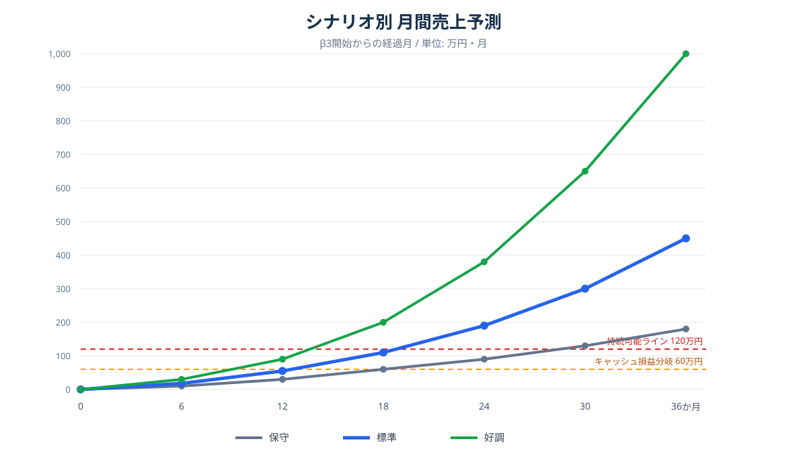
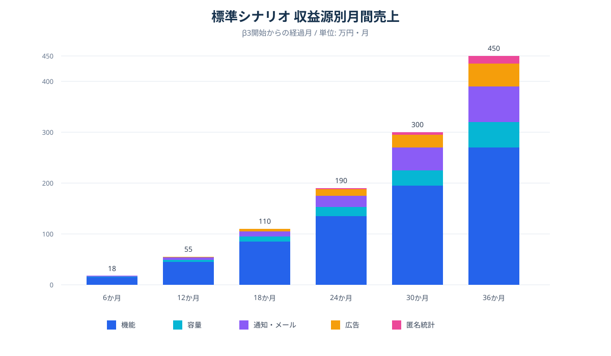

# Mannschaft 収益化方針・収益予測

> 作成日: 2026-08-24
> 文書種別: 経営判断用の仮説報告
> 判断時点: ベータテスト3で単価検証を本格化する前提
> 注意: 本書の金額は予算・売上保証ではなく、検証すべき仮説である。

## 1. 結論

Mannschaft は、現段階では単価最適化よりも、アカウント獲得と主要機能の完成にリソースを集中する。

ベータテスト3までは、次の順序を採る。

1. 利用者と団体アカウントを獲得する。
2. 継続利用される中核機能を完成させる。
3. 利用状況と原価を計測できる状態にする。
4. ベータテスト3で支払意思・価格弾力性・有料化による離脱を検証する。
5. 検証結果に基づき、機能、容量、通知、広告の価格を確定する。

収益化の主軸は機能課金とし、容量・通知を積み上げ型の従量収益、ターゲット広告を利用者規模獲得後の追加収益と位置付ける。匿名統計インサイトは十分な母数とデータガバナンスが成立した後の選択肢であり、初期の事業計画には算入しない。

## 2. 現段階の優先順位

### 2.1 優先すること

- 団体アカウントとアクティブ利用者の獲得
- タイムライン、チャット、予定、通知など日常利用の中核体験
- 管理者が導入効果を実感できる業務機能
- 継続率、機能利用率、団体人数、容量、通知数、広告在庫の計測
- ベータ参加者へのヒアリングと支払意思の記録
- 本番運用、監視、問い合わせ対応の成立

### 2.2 ベータテスト3まで確定を急がないこと

- 個別機能の最終単価
- 有料プランの最終構成
- 広告の CPM / CPC / 固定単価
- 通知・メールの無料枠と超過単価
- 容量の無料枠、プラン容量、超過単価
- 匿名統計インサイトの製品化

単価を未確定にしても、価格を変更可能なマスタ構造、利用量の計測、請求境界、監査証跡は先に完成させる。これにより、ベータテスト3ではコード変更ではなく運用設定と限定実験で価格を検証できる。

## 3. 収益源の位置付け

| 収益源 | 役割 | 収益化時期 | 初期の重要度 | 主な成立条件 |
|---|---|---|---:|---|
| 機能・プラン課金 | 固定費を支える主力 | ベータ3以降 | 最重要 | 管理工数削減、売上増加、事故防止など明確な価値 |
| 容量課金 | 解約されにくい積み上げ収益 | ベータ3以降 | 中 | 写真・動画・ファイルの継続蓄積 |
| 通知・メール課金 | 大規模団体・販促利用の従量収益 | ベータ3以降 | 中〜高 | 十分な配信母数と効果測定 |
| ターゲット広告 | 無料利用者からの追加収益 | 利用密度獲得後 | 中 | 地域・属性ごとの広告在庫と広告主営業 |
| 匿名統計インサイト | 高単価の法人・自治体向け収益 | 成熟期 | 初期算入外 | 十分な母数、匿名性、契約、ガバナンス |

### 3.1 機能課金

機能課金を事業の中心に置く。タイムラインや基本通知など利用密度を作る機能は無料側に残し、次のような価値の高い機能を有料候補とする。

- 予約、決済、回数券、会費徴収
- 会計、領収書、未払い管理
- 高度な権限、監査、承認ワークフロー
- 分析、CSV、定期レポート、自動化
- 販促、クーポン、広告出稿
- 外部 API、Webhook、外部サービス連携

現行設計の `FULL=月額2,000円想定`、`アドオン=月額300円想定` は検証用の仮置きである。全機能を含むプランが低価格だと顧客単価の上限が早期に固定されるため、ベータテスト3では団体規模と機能価値に応じた価格帯を検証する。

### 3.2 容量課金

Cloudflare R2 はエグレス無料でストレージ原価が低いため、容量課金は高い粗利を期待できる。ただし、容量そのものではなく、動画保存、世代管理、復元、長期保管、検索などの便益と一緒に提示する。

検証開始時の価格仮説例:

| 仮説プラン | 追加容量 | 月額仮説 |
|---|---:|---:|
| Storage S | 50 GB | 500円 |
| Storage M | 200 GB | 1,500円 |
| Storage L | 1 TB | 5,000〜7,000円 |
| 超過従量 | 1 GB | 15〜30円 |

無料枠を狭めること自体を目的にしない。80%・90%・100%の段階通知、アップロード前の見積り、従量課金の明示的な有効化を前提とし、意図しない請求を発生させない。

### 3.3 通知・広告

通知は一般バナーより高い単価を成立させやすい一方、過剰配信はサービス全体の継続率を毀損する。収益最大化ではなく、受信上限、配信停止、審査、到達・開封・成果計測を含む品質管理を優先する。

通常のタイムライン広告は、利用者規模が小さい段階では売上寄与が限定的である。地域・競技・業種ごとの利用密度を獲得し、広告主に到達数と成果を説明できる段階から本格化する。

### 3.4 匿名統計インサイト

個人単位のメタデータ、仮名 ID 付き行動履歴、子ども・健康・宗教・支払情報は販売しない。将来扱う場合も、十分な集計単位に丸めた統計レポート、ダッシュボード、APIに限定する。

現在のプライバシーポリシーが定める「個人情報と行動プロファイルを販売しない」という信頼を維持する。匿名統計の外部提供は、最低集計人数、少数セル抑制、再識別禁止契約、提供項目の公表、法務確認を前提とする。

## 4. ベータテスト3で検証する指標

### 4.1 獲得・定着

| 指標 | 観測目的 |
|---|---|
| 新規団体数 / 月 | 獲得速度とチャネル比較 |
| 招待完了率 | 団体内展開の摩擦確認 |
| 7日・30日・90日継続率 | 日常利用への定着確認 |
| 団体当たり WAU / MAU | 名目登録ではなく実利用を確認 |
| 管理者の週次利用率 | 課金主体の継続価値を確認 |

### 4.2 機能課金

| 指標 | 観測目的 |
|---|---|
| 有料候補機能の団体利用率 | ペイウォール候補の選定 |
| 機能別の継続利用率 | 一度試す機能と定着機能の分離 |
| 価格提示から購入までの転換率 | 支払意思の測定 |
| ペイウォール到達後の離脱率 | 無料体験への悪影響確認 |
| 団体規模別の支払意思 | 人数バンド価格の設計 |

### 4.3 従量課金・広告

| 指標 | 観測目的 |
|---|---|
| 容量分布と月次増加量 | 無料枠・容量プランの設計 |
| 通知・メール送信数と到達率 | 無料枠・原価・単価の設計 |
| 広告掲載可能 imp | 広告在庫の把握 |
| 地域・属性別の到達人数 | ターゲティング商品の成立確認 |
| CTR・開封率・成果率 | 広告主へ説明できる価値の確認 |
| 配信停止率・通報率 | 収益化による信頼毀損の監視 |

## 5. 収益予測

### 5.1 共通前提

- 横軸はベータテスト3開始からの経過月とする。
- ベータテスト3の前半は計測と限定価格テストを行い、全面課金を前提としない。
- 標準シナリオの平均団体売上は、機能課金を中心に徐々に上昇する。
- 匿名統計インサイトは36か月時点でも小さく置き、初期黒字化へ算入しない。
- 月60万円を最小運営費込みのキャッシュ損益分岐、月120万円を開発者報酬等を含む持続可能ラインの暫定値とする。
- 税、返金、貸倒れ、大規模な採用、過去の開発投資回収は含めない。

### 5.2 シナリオ別月間売上

| β3からの経過 | 保守 | 標準 | 好調 |
|---:|---:|---:|---:|
| 0か月 | 0万円 | 0万円 | 0万円 |
| 6か月 | 10万円 | 18万円 | 30万円 |
| 12か月 | 30万円 | 55万円 | 90万円 |
| 18か月 | 60万円 | 110万円 | 200万円 |
| 24か月 | 90万円 | 190万円 | 380万円 |
| 30か月 | 130万円 | 300万円 | 650万円 |
| 36か月 | 180万円 | 450万円 | 1,000万円 |

標準シナリオでは、キャッシュ損益分岐はベータテスト3開始後13〜15か月、持続可能ラインは19〜21か月が目安となる。これは、獲得と定着が先行し、ベータテスト3で価格検証を開始できた場合の予測である。

### 5.3 標準シナリオの売上構成

| β3からの経過 | 機能 | 容量 | 通知・メール | 広告 | 匿名統計 | 合計 |
|---:|---:|---:|---:|---:|---:|---:|
| 6か月 | 15万円 | 1万円 | 2万円 | 0万円 | 0万円 | 18万円 |
| 12か月 | 45万円 | 4万円 | 5万円 | 1万円 | 0万円 | 55万円 |
| 18か月 | 85万円 | 10万円 | 10万円 | 5万円 | 0万円 | 110万円 |
| 24か月 | 135万円 | 18万円 | 22万円 | 13万円 | 2万円 | 190万円 |
| 30か月 | 195万円 | 30万円 | 45万円 | 25万円 | 5万円 | 300万円 |
| 36か月 | 270万円 | 50万円 | 70万円 | 45万円 | 15万円 | 450万円 |

機能課金が固定費を支え、容量と通知が積み上がり、広告は利用密度を獲得した後から寄与する構造を想定する。

## 6. ベータテスト3の価格検証案

### 6.1 検証順序

1. 支払意思インタビューを団体種別・人数帯別に実施する。
2. 価格を表示するだけのテストで、選択率と離脱を測る。
3. 少数団体に月額固定のパイロット契約を提案する。
4. 機能単品、プラン、人数バンドを比較する。
5. 容量・通知の無料枠と超過価格を限定適用する。
6. 広告主候補へ想定到達数と成果指標を提示し、予算感を確認する。
7. 継続率とサポート負荷を含めて最終価格を決める。

### 6.2 判断ゲート

価格を確定する前に、最低限次を満たす。

- 課金候補機能の利用団体数が統計的に極端に少なくない。
- 30日・90日の継続率を計測できる。
- 団体規模別の利用量と原価を集計できる。
- 無料から有料へ移した場合の影響を説明できる。
- 解約、返金、請求失敗、容量超過、通知停止の運用が成立する。
- 広告については到達、重複排除、通報、配信停止、課金の証跡が閉じている。

## 7. リスクと対策

| リスク | 影響 | 対策 |
|---|---|---|
| 無料枠が広すぎる | 有料転換しない | 管理者価値・収益機能・高負荷機能へ課金軸を置く |
| 価格が安すぎる | 団体数が増えても運営赤字 | 団体人数バンドと価値ベース価格を検証する |
| 価格決定を急ぐ | 獲得と学習を阻害 | ベータ3までは仮説・計測基盤に留める |
| 通知・広告の過剰配信 | 継続率と信頼を毀損 | 受信上限、オプトアウト、審査、通報を必須化する |
| 容量の意図しない請求 | 問い合わせ・返金増加 | 段階通知と明示的な従量課金同意を要求する |
| データ販売と受け取られる | 学校・医療・地域団体の導入阻害 | 個人データ非販売を維持し、匿名統計に限定する |
| 多機能ゆえ価値が伝わらない | 導入率が伸びない | 最初の対象業種と主要ジョブを絞って訴求する |

## 8. 当面の意思決定

1. ベータテスト3まではアカウント獲得と機能実装を優先する。
2. 価格は確定せず、設定可能な機構と計測を完成させる。
3. 黒字化は機能課金単独で成立する計画を基準にする。
4. 容量・通知・広告は上振れではなく、段階的に検証する追加収益とする。
5. 匿名統計インサイトは初期計画から外し、十分な母数と法務・ガバナンスが整った後に再判断する。
6. ベータテスト3開始時に本書の仮説値を実測値へ更新する。

## 9. 参照

- [Mannschaft 課金・エンタイトルメント設計](../features/F20.1_entitlement_billing/README.md)
- [統合ストレージクォータ](../cross-cutting/storage_quota.md)
- [プロモーション配信](../features/F09.2_promotion_targeting.md)
- [広告主ターゲット配信](../features/F09.17_advertiser_targeted_campaign.md)
- [広告枠サービング](../features/F09.19_ad_slot_serving.md)
- [プライバシーポリシー日本語原稿](../../frontend/app/locales/ja/landing.json)
