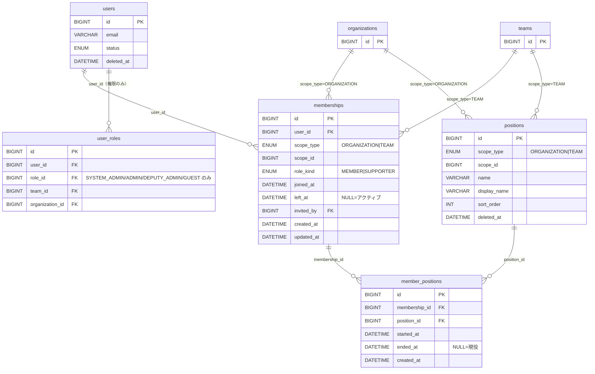
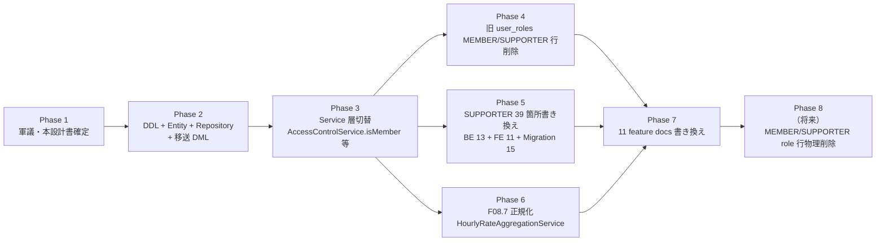

# F00.5: メンバーシップ基盤再設計

> **ステータス**: 🟢 Phase 7 完了（Phase 2〜7 全完了）（v1.5）
> **実装フェーズ**: Phase 7 完了（Phase 8 は OoS・将来検討）
> **最終更新**: 2026-05-05
> **モジュール種別**: コア機能（メンバーシップ基盤）
> **関連ドキュメント**: F01.2 / F00 / F08.7 / F13.1 / F02.2 / F03.5 / F02.5
> **旧称**: なし（新規）

---

## 目次

1. [概要](#1-概要)
2. [スコープ](#2-スコープ)
3. [要件](#3-要件)
4. [ER 図](#4-er-図)
5. [DB 設計](#5-db-設計)
6. [API 設計](#6-api-設計)
7. [ビジネスロジック](#7-ビジネスロジック)
8. [権限・認可](#8-権限認可)
9. [セキュリティ考慮事項](#9-セキュリティ考慮事項)
10. [i18n](#10-i18n)
11. [エッジケース](#11-エッジケース)
12. [段階的実装プラン](#12-段階的実装プラン)
13. [既存連携・マイグレーション戦略](#13-既存連携マイグレーション戦略)
14. [テスト方針](#14-テスト方針)
15. [未解決事項](#15-未解決事項)
16. [改訂履歴](#16-改訂履歴)

---

## 1. 概要

### 1.1 背景

Mannschaft は組織（organization）・チーム（team）・個人（user）の三層構造を採用しており、ユーザーがどのスコープに所属しているかは、これまで **`user_roles` テーブル一本** で表現してきた。`user_roles` は「誰がどのスコープでどのロールを持つか」を表す **権限割当（RBAC）** のテーブルとしては正しく機能しているが、現実の運用が進むにつれ、**「メンバーシップそのものの履歴・状態管理」** に同一テーブルを兼用していることが、構造的な歪みとして表出してきた。

主な歪みは以下の 6 点である:

1. **入会日（joined_at）が存在しない** — 現状は `created_at` を流用（TeamService.getMembers() 等）。「いつ入ったか」と「いつレコードが作られたか」が同義扱いになっており、後から手動で入会日を直すと監査ログまで巻き添えで書き換わる
2. **退会日（left_at）が存在しない** — 退会は `user_roles` 行を物理削除する運用のため、「過去にこのチームに所属していた人」の履歴が残らず、過去シフトや過去 TODO の担当者が users への外部キーで宙ぶらりんになる
3. **再加入が表現できない** — UNIQUE (user_id, scope_key) のため、一度退会して再度加入する場合、過去行を消してから新規 INSERT するしかなく、累計所属期間が再構築できない
4. **役職複数兼任ができない** — チーム内で「会計係」「広報係」を同一ユーザーが兼任するケースを表現する場所がない（roles は権限ロール 6 種固定。役職とは別概念）
5. **SUPPORTER の特殊扱いが分散** — supporter_applications / supporter_settings / user_roles の SUPPORTER 行 / supporter_enabled フラグが各所に散在し、「サポーターはメンバーか？」の問いに一貫した答えが出せない
6. **GDPR 削除対応が不完全** — 退会者を物理削除すると過去履歴の参照が壊れるため、現状は users.deleted_at + masked_email で誤魔化しているが、user_roles 側は SUPPORTER を残したり残さなかったりと運用がぶれる

これらは個別に対処療法を入れるのではなく、**メンバーシップを user_roles から完全に分離し、専用の正規化された 3 表（memberships / member_positions / positions）に置き換える** ことで根治する。これが本案件 F00.5 の主旨である。

### 1.2 F00.5 が解決する価値

| 価値 | 解決される課題 |
|---|---|
| **入会・退会の正確な記録** | joined_at / left_at による期間管理。出入りの履歴を時系列で追える |
| **再加入のクリーンな表現** | 退会行を残し、新規行を追加するだけ。累計所属期間の集計が SUM(left_at-joined_at) で書ける |
| **役職複数兼任** | member_positions 中間表で N:N。期間付きで履歴も保持 |
| **SUPPORTER の単一定義** | memberships.role_kind ENUM('MEMBER','SUPPORTER') カラム 1 個に集約。supporter_applications は申請ワークフローの責務に縮退 |
| **GDPR 完全対応** | 退会＝left_at セット / GDPR 削除＝user_id NULL マスキング / 14 日後物理削除バッチ。履歴は壊さない |
| **F08.7 シフト平均時給の正規化** | `users.status='ACTIVE'` 代替を `memberships.left_at IS NULL AND member_positions.position_id = ?` に置換できる |
| **権限と所属の分離** | user_roles は SYSTEM_ADMIN/ADMIN/DEPUTY_ADMIN/GUEST の **権限ロール専用** に縮退。MEMBER/SUPPORTER 行は memberships に移行し、user_roles から削除 |

### 1.3 関連ドキュメントとの位置付け

- **F01.2 組織・チーム・メンバー・ロール管理** — 本案件の親領域。F01.2 の §3 DB 設計から `user_roles` の MEMBER/SUPPORTER 分を抽出して F00.5 に切り出す関係
- **F00 ContentVisibilityResolver** — 別レイヤ（コンテンツ可視性判定基盤）。本案件のメンバーシップ基盤確定後、ContentVisibilityChecker の MembershipQueryCache が memberships.left_at を参照する形に進化する見通し（§13.6 参照）
- **F08.7 シフト予算統合** — HourlyRateAggregationService.findTeamAverageRate() が users.status 代替で動いている部分を memberships ベースに正規化する（Phase 6 で実施）
- **F13.1 短期ジョブマッチング** — JobPolicy.canApply 系の判定が user_roles を直接参照しており、Phase 5 で memberships 参照に書き換える対象
- **F02.2 ダッシュボード** — MembershipChangedEvent の発火元が RoleService から MembershipService に移管される。ダッシュボードキャッシュ無効化の購読側は無変更

---

## 2. スコープ

### 2.1 含むもの

- `memberships` テーブル新設（多態 1 表 + ロール種別カラム + joined_at/left_at の履歴管理）
- `member_positions` 中間表新設（N:N + 期間付き役職兼任）
- `positions` マスタテーブル新設（チーム/組織ごとの役職カタログ）
- 既存 `user_roles` の責務縮退仕様（§5.4）
- 旧 → 新 への移送 DML（INSERT INTO memberships SELECT FROM user_roles WHERE role IN (MEMBER, SUPPORTER)）
- 移行期間中の二重書き込み戦略（Phase 2-3、§13.4）
- 退会・再加入・GDPR 削除フロー（§7）
- API: 既存 `GET /teams/{id}/members` の DTO 互換維持 + 新規 `POST /memberships` / `POST /memberships/{id}/leave` / `POST /memberships/{id}/positions`
- 11 feature docs の team_members / team_memberships 暗黙参照を memberships に書き換える計画（Phase 7）
- SUPPORTER 39 箇所（Backend 13 / Frontend 11 / Migration 15）の書き換え計画（Phase 5）

### 2.2 含まないもの

- **users / organizations / teams 基本マスター** — 触らない。これらは別管理
- **roles / permissions / role_permissions / permission_groups** — RBAC 部分は user_roles と一体で残す
- **supporter_applications / supporter_settings** — サポーター申請ワークフローの責務に集中する。本案件では「APPROVED 時に user_roles.SUPPORTER 行を作る」処理を「APPROVED 時に memberships(role_kind=SUPPORTER) 行を作る」に書き換える 1 箇所のみ
- **team_org_memberships** — チーム⇔組織の多対多所属。メンバーシップとは別概念
- **team_blocks / organization_blocks** — ブロック管理。SUPPORTER 自己登録の前段チェックなので独立
- **team_officers / organization_officers** — 役員「名簿」（ユーザー紐付なしの表示用）。member_positions とは別概念。両者を統合する案は OoS（§15 未解決事項 OQ-7）
- **platform スコープのロール** — SYSTEM_ADMIN / プラットフォーム GUEST は user_roles に残す（scope_type 不適用）

### 2.3 設計上の判断（殿確定済）

| 論点 | 確定内容 | 補足 |
|---|---|---|
| ファイル名 | `F00.5_membership_basis.md` | F00 と衝突回避 |
| テーブル構成 | 案 C+: memberships 多態 1 表 + member_positions 中間表 + positions マスタ | 案 A（個別 team_members / org_members 2 表）と案 B（user_roles 拡張）を否決 |
| SUPPORTER 表現 | memberships.role_kind ENUM('MEMBER','SUPPORTER') | 別表化しない |
| scope_type | `'ORGANIZATION'` または `'TEAM'` の 2 値。platform は user_roles に残す | scope_id は CHECK 制約で必ず 1 つに紐付く |
| 再加入 | left_at セット → 新行追加。UNIQUE (user_id, scope_type, scope_id, joined_at) | left_at IS NULL 行は最大 1 つ（部分 UNIQUE） |
| 役職複数兼任 | member_positions(membership_id, position_id, started_at, ended_at?) で時系列管理 | UNIQUE (membership_id, position_id, started_at) |
| GDPR | 退会 = left_at セット / GDPR 削除 = user_id NULL マスキング / 14 日後物理削除バッチ | 履歴は壊さない |
| 移行戦略 | 旧 user_roles の MEMBER/SUPPORTER 行を DML で memberships に移送、Phase 4 で旧行削除 | 観測 KPI: API レスポンス比較で差分 0 を 7 日連続 |

### 2.4 軍議で追加決着した論点（v1.0 で確定）

§15 で当初 v0.9 段階に未解決として残した OQ-1〜10 を、Phase 1 軍議で全件決着させた。各決着は本設計書本体に反映済み。

| ID | 確定内容 | 反映先章 |
|---|---|---|
| OQ-1 | MembershipChangedEvent の発火元は **MembershipService に完全移管** する。RoleService 残置案は不採用。購読側の EventListener メソッドシグネチャは不変で 8 箇所影響なし | §3.1 FR-12 / §7 / §13.4 |
| OQ-2 | `members[].roleName` は **権限ロール（ADMIN/DEPUTY_ADMIN/GUEST）優先**。memberships は MEMBER/SUPPORTER の補助情報として将来 `membershipRoleKind` field を追加する余地のみ確保 | §6.1 / §13.6.4 |
| OQ-3 | 既存 `team_org_memberships`（チーム⇔組織所属）と本案件 `memberships` の **命名衝突は許容**。意味（接続関係 vs ユーザー所属）が明確に異なり、ER 図と命名規約で区別する | §4 / §13.0 |
| OQ-4 | `positions` マスタの seed は **`is_system=TRUE` の予約名のみ**（最小限の「代表」「副代表」程度）。組織種別ごとのテンプレ表は将来案件で別途検討 | §5.3 / §12.3 |
| OQ-5 | `role_kind` の MEMBER/SUPPORTER 以外の追加（PROVISIONAL_MEMBER 等）は **Phase 8 以降検討で closed** | §5.1 / §15 |
| OQ-6 | `member_positions` のスコープ越境チェックは **アプリ層検証 + 日次監査バッチ**（MySQL Trigger は運用負債が大きい） | §7.4 / §14.5 |
| OQ-7 | `team_officers` / `organization_officers` と `member_positions` の統合は **OoS（別案件）。並存維持** | §2.2 / §15 |
| OQ-8 | GDPR 物理削除バッチの猶予期間は **14 日**（GDPR 合理的期間。法務確認は別ルートで後追い） | §3.2 NFR-05 / §7.5 / §9.4 |
| OQ-9 | 整合性チェックバッチの比較対象は **`(user_id, scope_type, scope_id, role_kind, left_at IS NULL)` ペア集合の対称差のみ**。`created_at` は比較対象外 | §13.5 / §14.5 |
| OQ-10 | `GET /teams/{id}/members?role=ADMIN` 等の権限ロール絞り込みは **`MemberQueryDispatcher` で 1 段ディスパッチ**（roleName が ADMIN/DEPUTY_ADMIN/GUEST のとき user_roles 参照、MEMBER/SUPPORTER のとき memberships 参照） | §6.1 / §13.6.4 |

---

## 3. 要件

### 3.1 機能要件

| ID | 要件 | 優先度 |
|---|---|---|
| FR-01 | ユーザーは組織・チームに「入会」できる。入会時刻 (joined_at) が記録される | MUST |
| FR-02 | ユーザーは組織・チームを「退会」できる。退会時刻 (left_at) が記録される。物理削除はしない | MUST |
| FR-03 | 退会済ユーザーは同一スコープに「再加入」できる。再加入は新行 INSERT（旧行は left_at 付きで残る） | MUST |
| FR-04 | アクティブメンバー（left_at IS NULL）は (user_id, scope_type, scope_id) ごとに最大 1 行 | MUST |
| FR-05 | role_kind は MEMBER / SUPPORTER の 2 値。SUPPORTER は招待コード不要のフォローモード（F01.2 §2 と整合） | MUST |
| FR-06 | チーム/組織は独自の「役職」カタログ（positions）を持てる。MEMBER は 0〜N 個の役職を兼任できる | MUST |
| FR-07 | 役職は期間付きで履歴保持される（started_at + 任意の ended_at） | MUST |
| FR-08 | 退会時、当該 membership に紐付く現役役職（ended_at IS NULL）はすべて自動 ended_at セット | MUST |
| FR-09 | GDPR 削除時、user_id を NULL マスキングし、14 日後の物理削除バッチでレコード削除 | MUST |
| FR-10 | 既存 API `GET /teams/{id}/members` の DTO 形（id / userId / roleName / joinedAt 等）は維持。内部実装のみ memberships 参照に切替 | MUST |
| FR-11 | 最後の ADMIN 保護は user_roles 側に保持（memberships とは独立）。MEMBER/SUPPORTER の数は退会判定に影響しない | MUST |
| FR-12 | MembershipChangedEvent の発火元を RoleService から MembershipService に移管。購読側は無変更 | SHOULD |

### 3.2 非機能要件

| ID | 要件 | 目標値 |
|---|---|---|
| NFR-01 | `GET /teams/{id}/members` レイテンシ | p95 < 150ms（10 万 memberships で member_positions JOIN 含む） |
| NFR-02 | アクティブメンバー数集計 | p95 < 50ms（部分インデックス利用） |
| NFR-03 | 入会・退会 API のレートリミット | 1 ユーザー / scope につき 60 回/時 |
| NFR-04 | 履歴保全 | left_at セット後の行は 7 年間物理削除しない（GDPR 削除以外） |
| NFR-05 | GDPR 削除完了時間 | マスキング即時、物理削除は 14 日後の日次バッチ |
| NFR-06 | DDL 適用時間 | 移行 DML を含めて 1 組織あたり 30 秒以内 |
| NFR-07 | 二重書き込み期間中のずれ検知 | 観測 KPI: API レスポンス比較バッチを日次実行 |
| NFR-08 | 監査ログ保全 | MembershipChangedEvent の旧 RoleService 経路と新 MembershipService 経路で同一 changeType を発火 |

---

## 4. ER 図



**説明**:

- `memberships` は組織・チーム両対応の **多態 1 表**。`scope_type` + `scope_id` の組で参照先を識別する
- `user_roles` は本案件後、**権限ロール専用**（SYSTEM_ADMIN / ADMIN / DEPUTY_ADMIN / GUEST）に縮退
- `member_positions` は memberships と positions の N:N 中間表。期間付き
- `positions` は scope ごとに独自定義（例: チーム X の「会計係」、組織 Y の「理事」）

---

## 5. DB 設計

### 5.1 `memberships` テーブル

#### カラム定義

| カラム名 | 型 | NULL | デフォルト | 説明 |
|---------|----|------|----------|------|
| `id` | BIGINT UNSIGNED | NO | AUTO_INCREMENT | PK |
| `user_id` | BIGINT UNSIGNED | YES | NULL | FK → users.id。GDPR マスキング時に NULL 化されうる |
| `scope_type` | ENUM('ORGANIZATION','TEAM') | NO | — | 所属先の種別 |
| `scope_id` | BIGINT UNSIGNED | NO | — | 所属先 ID。scope_type に応じて organizations.id または teams.id を参照（FK は張らず、CHECK + アプリ層で整合性確保） |
| `role_kind` | ENUM('MEMBER','SUPPORTER') | NO | 'MEMBER' | メンバー区分。SUPPORTER は招待コード不要のフォローモード |
| `joined_at` | DATETIME | NO | CURRENT_TIMESTAMP | 入会日時 |
| `left_at` | DATETIME | YES | NULL | 退会日時。NULL = アクティブ |
| `leave_reason` | ENUM('SELF','REMOVED','GDPR','TRANSFER','OTHER') | YES | NULL | 退会理由。left_at と同時に必須 |
| `invited_by` | BIGINT UNSIGNED | YES | NULL | 招待者の user_id（FK → users.id, ON DELETE SET NULL）。SUPPORTER 自己登録時は NULL |
| `gdpr_masked_at` | DATETIME | YES | NULL | GDPR 削除によるマスキング日時。NOT NULL のとき user_id IS NULL でなければならない |
| `created_at` | DATETIME | NO | CURRENT_TIMESTAMP | レコード作成日時 |
| `updated_at` | DATETIME | NO | CURRENT_TIMESTAMP ON UPDATE | レコード更新日時 |

#### DDL

```sql
CREATE TABLE memberships (
    id BIGINT UNSIGNED NOT NULL AUTO_INCREMENT,
    user_id BIGINT UNSIGNED NULL,
    scope_type ENUM('ORGANIZATION','TEAM') NOT NULL,
    scope_id BIGINT UNSIGNED NOT NULL,
    role_kind ENUM('MEMBER','SUPPORTER') NOT NULL DEFAULT 'MEMBER',
    joined_at DATETIME NOT NULL DEFAULT CURRENT_TIMESTAMP,
    left_at DATETIME NULL,
    leave_reason ENUM('SELF','REMOVED','GDPR','TRANSFER','OTHER') NULL,
    invited_by BIGINT UNSIGNED NULL,
    gdpr_masked_at DATETIME NULL,
    created_at DATETIME NOT NULL DEFAULT CURRENT_TIMESTAMP,
    updated_at DATETIME NOT NULL DEFAULT CURRENT_TIMESTAMP ON UPDATE CURRENT_TIMESTAMP,
    PRIMARY KEY (id),
    CONSTRAINT fk_memberships_user FOREIGN KEY (user_id) REFERENCES users (id) ON DELETE SET NULL,
    CONSTRAINT fk_memberships_invited_by FOREIGN KEY (invited_by) REFERENCES users (id) ON DELETE SET NULL,
    CONSTRAINT chk_memberships_left_reason CHECK (
        (left_at IS NULL AND leave_reason IS NULL)
        OR (left_at IS NOT NULL AND leave_reason IS NOT NULL)
    ),
    CONSTRAINT chk_memberships_gdpr_masked CHECK (
        gdpr_masked_at IS NULL OR user_id IS NULL
    ),
    CONSTRAINT chk_memberships_period CHECK (
        left_at IS NULL OR left_at >= joined_at
    )
) ENGINE=InnoDB DEFAULT CHARSET=utf8mb4;
```

**備考**:

- `scope_id` への FK は **張らない**（多態。MySQL 8.0 は「条件付き FK」をサポートしないため、scope_type に応じて organizations または teams を参照する形は SQL 的に表現できない）。整合性はアプリ層 + 監査バッチで担保
- `user_id` は `ON DELETE SET NULL` を採用。物理削除前のマスキングが先に走る運用前提だが、万一外部から users が直接削除されてもメンバーシップ履歴は壊さない
- `gdpr_masked_at IS NOT NULL` のとき必ず `user_id IS NULL`（CHECK 制約で保証）
- `chk_memberships_period` で `left_at IS NULL OR left_at >= joined_at` を保証。逆転事故を DB 側で完全防止

### 5.2 `member_positions` テーブル

#### カラム定義

| カラム名 | 型 | NULL | デフォルト | 説明 |
|---------|----|------|----------|------|
| `id` | BIGINT UNSIGNED | NO | AUTO_INCREMENT | PK |
| `membership_id` | BIGINT UNSIGNED | NO | — | FK → memberships.id |
| `position_id` | BIGINT UNSIGNED | NO | — | FK → positions.id |
| `started_at` | DATETIME | NO | CURRENT_TIMESTAMP | 役職就任日時 |
| `ended_at` | DATETIME | YES | NULL | 役職離任日時。NULL = 現役 |
| `assigned_by` | BIGINT UNSIGNED | YES | NULL | 役職を付与した管理者の user_id |
| `created_at` | DATETIME | NO | CURRENT_TIMESTAMP | |

#### DDL

```sql
CREATE TABLE member_positions (
    id BIGINT UNSIGNED NOT NULL AUTO_INCREMENT,
    membership_id BIGINT UNSIGNED NOT NULL,
    position_id BIGINT UNSIGNED NOT NULL,
    started_at DATETIME NOT NULL DEFAULT CURRENT_TIMESTAMP,
    ended_at DATETIME NULL,
    assigned_by BIGINT UNSIGNED NULL,
    created_at DATETIME NOT NULL DEFAULT CURRENT_TIMESTAMP,
    PRIMARY KEY (id),
    CONSTRAINT fk_member_positions_membership FOREIGN KEY (membership_id) REFERENCES memberships (id) ON DELETE CASCADE,
    CONSTRAINT fk_member_positions_position FOREIGN KEY (position_id) REFERENCES positions (id) ON DELETE RESTRICT,
    CONSTRAINT fk_member_positions_assigned_by FOREIGN KEY (assigned_by) REFERENCES users (id) ON DELETE SET NULL,
    CONSTRAINT chk_member_positions_period CHECK (
        ended_at IS NULL OR ended_at >= started_at
    )
) ENGINE=InnoDB DEFAULT CHARSET=utf8mb4;
```

**備考**:

- `ON DELETE CASCADE` for membership_id: メンバーシップが GDPR 物理削除されると役職履歴も削除される（個人情報のため）
- `ON DELETE RESTRICT` for position_id: 役職マスタは履歴参照中のため削除不可。論理削除（positions.deleted_at）で対応
- 同一 position の二重就任（重複 INSERT）は §5.5 の UNIQUE で防ぐ

### 5.3 `positions` テーブル

#### カラム定義

| カラム名 | 型 | NULL | デフォルト | 説明 |
|---------|----|------|----------|------|
| `id` | BIGINT UNSIGNED | NO | AUTO_INCREMENT | PK |
| `scope_type` | ENUM('ORGANIZATION','TEAM') | NO | — | 役職カタログの所属先種別 |
| `scope_id` | BIGINT UNSIGNED | NO | — | 役職カタログの所属先 ID |
| `name` | VARCHAR(50) | NO | — | システム名（英数字 + アンダースコア） |
| `display_name` | VARCHAR(100) | NO | — | 表示名（i18n キーまたは生文字列） |
| `description` | VARCHAR(500) | YES | NULL | 役職の説明 |
| `sort_order` | INT | NO | 0 | 表示順 |
| `is_system` | BOOLEAN | NO | FALSE | システム予約役職フラグ（削除不可） |
| `deleted_at` | DATETIME | YES | NULL | 論理削除 |
| `created_at` | DATETIME | NO | CURRENT_TIMESTAMP | |
| `updated_at` | DATETIME | NO | CURRENT_TIMESTAMP ON UPDATE | |

#### DDL

```sql
CREATE TABLE positions (
    id BIGINT UNSIGNED NOT NULL AUTO_INCREMENT,
    scope_type ENUM('ORGANIZATION','TEAM') NOT NULL,
    scope_id BIGINT UNSIGNED NOT NULL,
    name VARCHAR(50) NOT NULL,
    display_name VARCHAR(100) NOT NULL,
    description VARCHAR(500) NULL,
    sort_order INT NOT NULL DEFAULT 0,
    is_system BOOLEAN NOT NULL DEFAULT FALSE,
    deleted_at DATETIME NULL,
    created_at DATETIME NOT NULL DEFAULT CURRENT_TIMESTAMP,
    updated_at DATETIME NOT NULL DEFAULT CURRENT_TIMESTAMP ON UPDATE CURRENT_TIMESTAMP,
    PRIMARY KEY (id),
    CONSTRAINT uq_positions_scope_name UNIQUE (scope_type, scope_id, name)
) ENGINE=InnoDB DEFAULT CHARSET=utf8mb4;
```

**備考**:

- `name` は scope 内で一意（UNIQUE 制約）。スコープ間では重複可
- 例: チーム 1 の「会計」、チーム 2 の「会計」は別レコード
- `is_system = TRUE` のレコードは UI から削除不可（例: シード「代表」「副代表」など、組織種別ごとのテンプレ。Phase 3 で seed 投入予定）
- 既存 `team_officers` / `organization_officers` とは別概念。役員「名簿」は名前文字列ベースで誰でも記載でき、メンバーシップ非依存

### 5.4 `user_roles` 縮退仕様

本案件 Phase 4 完了後、`user_roles` は **権限ロール専用** に責務縮退する。

| 項目 | Phase 4 完了前 | Phase 4 完了後 |
|---|---|---|
| 格納される role_id | SYSTEM_ADMIN / ADMIN / DEPUTY_ADMIN / MEMBER / SUPPORTER / GUEST 全 6 種 | SYSTEM_ADMIN / ADMIN / DEPUTY_ADMIN / GUEST のみ |
| MEMBER 行 | 残存 | 削除（memberships に移送済） |
| SUPPORTER 行 | 残存 | 削除（memberships に移送済、role_kind=SUPPORTER） |
| カラム構造 | 既存維持 | 既存維持（DDL 変更なし） |
| アプリ層から見た意味 | 「権限と所属の混在」 | 「権限のみ」（所属は memberships が真実） |

**重要**: Phase 4 では DDL の変更（カラム追加・削除）を一切行わない。**DML による行削除のみ**。これは V2.x 系マイグレーションを後追いで触らないという基本方針（既存マイグレーションの不変性）に準拠する。Phase 4 で投入するのは V60.x 系の新規マイグレーション 1 本（DML: MEMBER/SUPPORTER 行の DELETE）と監査ログ追記のみ。

Phase 5 完了後（SUPPORTER 39 箇所書換 + コードからの参照消滅）も、roles マスタの MEMBER / SUPPORTER 行は **当面残置** する。理由は (1) 既存マイグレーション seed (V2.014) の不変性確保 (2) コードからの参照漏れ検知のための「最後の砦」。物理削除は 1 年後の Phase 8 以降で別途検討（OoS）。

### 5.5 インデックス・UNIQUE 設計

#### `memberships` インデックス

```sql
-- アクティブメンバーは (user_id, scope_type, scope_id) で一意（部分 UNIQUE）
-- MySQL 8.0 は WHERE 条件付き UNIQUE をネイティブサポートしないため、生成列で実現する
ALTER TABLE memberships
    ADD COLUMN active_key VARCHAR(64) GENERATED ALWAYS AS (
        CASE WHEN left_at IS NULL
             THEN CONCAT(IFNULL(user_id,''), ':', scope_type, ':', scope_id)
             ELSE NULL
        END
    ) STORED,
    ADD CONSTRAINT uq_memberships_active UNIQUE (active_key);

-- 履歴行も含めた強い UNIQUE（再加入で joined_at が異なる行を許容）
ALTER TABLE memberships
    ADD CONSTRAINT uq_memberships_history UNIQUE (user_id, scope_type, scope_id, joined_at);

-- 検索用インデックス
CREATE INDEX idx_memberships_scope ON memberships (scope_type, scope_id, left_at);
CREATE INDEX idx_memberships_user ON memberships (user_id, left_at);
CREATE INDEX idx_memberships_role_kind ON memberships (scope_type, scope_id, role_kind, left_at);

-- joined_at と left_at の整合性は §5.1 の DDL 内 chk_memberships_period に統合済（再掲不要）
```

**設計意図**:

- `uq_memberships_active`: 同一ユーザーが同一スコープに **アクティブな状態で 2 行存在しない** ことを DB 制約で保証。生成列で left_at IS NULL のときだけキーが立つ
- `uq_memberships_history`: 履歴行も含めた一意性。再加入時は joined_at が必ず異なるため、新行 INSERT を許容しつつ、ミリ秒単位の同時 INSERT による重複は防ぐ（並行制御は §9.6）
- `idx_memberships_scope`: `WHERE scope_type=? AND scope_id=? AND left_at IS NULL` が最頻出クエリ
- `idx_memberships_user`: マイページの「私が所属するスコープ一覧」で利用

#### `member_positions` インデックス

```sql
-- 同一 membership × 同一 position で同一 started_at の重複を防ぐ
ALTER TABLE member_positions
    ADD CONSTRAINT uq_member_positions_period UNIQUE (membership_id, position_id, started_at);

-- 現役役職は (membership, position) ペアごとに最大 1 行（部分 UNIQUE を生成列で表現）
ALTER TABLE member_positions
    ADD COLUMN active_position_key VARCHAR(64) GENERATED ALWAYS AS (
        CASE WHEN ended_at IS NULL
             THEN CONCAT(membership_id, ':', position_id)
             ELSE NULL
        END
    ) STORED,
    ADD CONSTRAINT uq_member_positions_active UNIQUE (active_position_key);

CREATE INDEX idx_member_positions_membership ON member_positions (membership_id, ended_at);
CREATE INDEX idx_member_positions_position ON member_positions (position_id, ended_at);
```

#### `positions` インデックス

```sql
-- §5.3 DDL の uq_positions_scope_name に加えて
CREATE INDEX idx_positions_scope ON positions (scope_type, scope_id, deleted_at, sort_order);
```

#### 再加入時の制約挙動の例

```
時刻 T1: ユーザー A がチーム 100 に入会 → INSERT (user_id=A, scope=TEAM:100, joined_at=T1, left_at=NULL)
時刻 T2: ユーザー A が退会 → UPDATE SET left_at=T2 WHERE id=...（active_key が NULL になる）
時刻 T3: ユーザー A が再加入 → INSERT (user_id=A, scope=TEAM:100, joined_at=T3, left_at=NULL) ← OK
時刻 T4: 二重 INSERT 試行 → INSERT (user_id=A, scope=TEAM:100, joined_at=T4) ← uq_memberships_active で拒否
```

---

## 6. API 設計

### 6.1 既存 API 互換性維持方針

`GET /teams/{id}/members`、`GET /organizations/{id}/members`、`GET /users/me/scopes` 等、既存のメンバー一覧系 API の **DTO 形は維持する**。フロントエンド・モバイルアプリ・外部連携を一切壊さないことが Phase 2-4 の最低保証ライン。

| 既存 API | DTO（変更なし） | 内部実装 Phase 2 後 |
|---|---|---|
| `GET /teams/{id}/members` | `[{id, userId, displayName, roleName, joinedAt}]` | memberships JOIN users で生成。roleName は user_roles 由来（権限ロール）または `MEMBER`/`SUPPORTER`（memberships.role_kind） |
| `GET /teams/{id}/members?role=SUPPORTER` | 既存と同じ | 内部で `WHERE memberships.role_kind = 'SUPPORTER'` に書き換え |
| `GET /organizations/{id}/members` | 既存と同じ | 同上 |
| `GET /users/me/scopes` | `[{scopeType, scopeId, roleName, joinedAt}]` | memberships の left_at IS NULL 行を返す |
| `DELETE /teams/{id}/members/{userId}` | 既存と同じ | 内部で memberships UPDATE SET left_at=NOW() に切替（旧: user_roles DELETE） |

`joinedAt` は Phase 2 以降、`memberships.joined_at` を真値とする。Phase 2 完了前は `created_at` 流用のままなので、Phase 2 リリースで「正しい入会日が表示されるようになりました」のチェンジログを掲載する。

### 6.2 新規 API

#### POST `/api/v1/memberships`

入会 API。招待トークン受理・SUPPORTER 自己登録・supporter_applications 承認の各ルートから呼ばれる内部 API でもあり、ADMIN による直接付与にも使う。

**リクエスト**:

```http
POST /api/v1/memberships
Content-Type: application/json
Authorization: Bearer <jwt>

{
  "userId": 12345,
  "scopeType": "TEAM",
  "scopeId": 100,
  "roleKind": "MEMBER",
  "invitedBy": 67,
  "source": "INVITE_TOKEN"
}
```

| フィールド | 必須 | 説明 |
|---|---|---|
| `userId` | YES | 対象ユーザー。SYSTEM_ADMIN / 当該スコープの ADMIN / DEPUTY_ADMIN(INVITE_MEMBERS 権限) のみ自分以外の userId 指定可 |
| `scopeType` | YES | `ORGANIZATION` または `TEAM` |
| `scopeId` | YES | 対象スコープ ID |
| `roleKind` | NO | 既定 `MEMBER`。SUPPORTER 自己登録時のみ `SUPPORTER` |
| `invitedBy` | NO | 招待者の userId。INVITE_TOKEN ルートでは必須 |
| `source` | YES | `INVITE_TOKEN` / `SUPPORTER_APPLICATION` / `SELF_SUPPORTER_REGISTRATION` / `ADMIN_DIRECT` |

**レスポンス（201 Created）**:

```json
{
  "id": 9876,
  "userId": 12345,
  "scopeType": "TEAM",
  "scopeId": 100,
  "roleKind": "MEMBER",
  "joinedAt": "2026-05-04T10:30:00",
  "leftAt": null,
  "invitedBy": 67
}
```

**エラー**:

- 400: バリデーションエラー、scope_type と scope_id の不整合
- 403: 権限不足（INVITE_MEMBERS / 自分の userId 以外への付与権限）
- 409: 既にアクティブなメンバーシップが存在（uq_memberships_active 衝突）
- 422: SUPPORTER 自己登録だが対象スコープが `supporter_enabled = FALSE`、またはブロックリストに登録あり

#### POST `/api/v1/memberships/{id}/leave`

退会 API。

**リクエスト**:

```http
POST /api/v1/memberships/9876/leave
Content-Type: application/json
Authorization: Bearer <jwt>

{
  "leaveReason": "SELF",
  "removedBy": null
}
```

| フィールド | 必須 | 説明 |
|---|---|---|
| `leaveReason` | YES | `SELF`（自主退会）/ `REMOVED`（除名）/ `TRANSFER`（組織異動）/ `OTHER` |
| `removedBy` | NO | 除名時に必須。除名を実行した管理者の userId |

**レスポンス（200 OK）**:

```json
{
  "id": 9876,
  "leftAt": "2026-05-04T11:00:00",
  "leaveReason": "SELF"
}
```

**エラー**:

- 403: 自分自身の SELF 退会、または除名権限がない
- 404: メンバーシップが存在しないまたは既に退会済
- 409: 「最後の MEMBER でも構わないが、最後の ADMIN を兼任しているため退会不可」（user_roles の最後 ADMIN 保護に引っかかった場合）

#### POST `/api/v1/memberships/{id}/positions`

役職割当 API。

**リクエスト**:

```http
POST /api/v1/memberships/9876/positions
Content-Type: application/json

{
  "positionId": 31,
  "startedAt": "2026-05-04T00:00:00",
  "assignedBy": 67
}
```

**レスポンス（201 Created）**:

```json
{
  "id": 12001,
  "membershipId": 9876,
  "positionId": 31,
  "positionName": "TREASURER",
  "positionDisplayName": "会計係",
  "startedAt": "2026-05-04T00:00:00",
  "endedAt": null
}
```

**エラー**:

- 400: positionId が当該 membership の scope と一致しない（スコープ越境）
- 403: ADMIN/DEPUTY_ADMIN(MANAGE_POSITIONS 権限) 以外
- 409: 同一 membership × position で現役の役職が既に存在

#### POST `/api/v1/member-positions/{id}/end`

役職終了 API。

```http
POST /api/v1/member-positions/12001/end
{
  "endedAt": "2026-12-31T23:59:59"
}
```

レスポンス: 200 OK で更新後の member_positions レコード。

#### GET `/api/v1/memberships?scopeType=&scopeId=&active=true&roleKind=`

メンバーシップ検索 API。Phase 2 で新設。`GET /teams/{id}/members` を内部的に呼ぶ汎用 API。

#### GET `/api/v1/memberships/{id}/history`

ある membership の履歴（同一 user × 同一 scope の過去行を joined_at 昇順で返す）。再加入歴を画面表示するための API。

### 6.3 リクエスト/レスポンス JSON 例の補足

#### 入会時の SUPPORTER 自己登録

```http
POST /api/v1/memberships
Content-Type: application/json
Authorization: Bearer <jwt-of-user-99>

{
  "userId": 99,
  "scopeType": "TEAM",
  "scopeId": 100,
  "roleKind": "SUPPORTER",
  "source": "SELF_SUPPORTER_REGISTRATION"
}
```

レスポンス（201 Created）:

```json
{
  "id": 9999,
  "userId": 99,
  "scopeType": "TEAM",
  "scopeId": 100,
  "roleKind": "SUPPORTER",
  "joinedAt": "2026-05-04T12:00:00",
  "leftAt": null,
  "invitedBy": null,
  "isRejoin": false
}
```

エラー例（422 Unprocessable Entity — supporter_enabled=FALSE）:

```json
{
  "code": "MEMBERSHIP_SUPPORTER_DISABLED",
  "message": "このチームはサポーター機能を有効化していません",
  "i18nKey": "error.membership.supporterDisabled"
}
```

#### 履歴取得 API

```http
GET /api/v1/memberships?userId=99&scopeType=TEAM&scopeId=100&includeHistory=true
```

レスポンス（200 OK — 過去に 2 回所属、現在は退会中）:

```json
{
  "items": [
    {
      "id": 9999,
      "joinedAt": "2026-05-04T12:00:00",
      "leftAt": "2026-05-15T10:00:00",
      "leaveReason": "SELF",
      "roleKind": "SUPPORTER"
    },
    {
      "id": 8888,
      "joinedAt": "2026-03-01T09:00:00",
      "leftAt": "2026-04-30T18:00:00",
      "leaveReason": "REMOVED",
      "roleKind": "MEMBER"
    }
  ],
  "currentlyActive": false
}
```

### 6.4 エラーレスポンス表

| HTTP | code | message i18n key | 発生条件 |
|---|---|---|---|
| 400 | `MEMBERSHIP_INVALID_SCOPE` | `error.membership.invalidScope` | scope_type と scope_id の組み合わせが不整合 |
| 400 | `MEMBERSHIP_INVALID_ROLE_KIND` | `error.membership.invalidRoleKind` | role_kind が ENUM 範囲外 |
| 400 | `MEMBERSHIP_PERIOD_INVERTED` | `error.membership.periodInverted` | started_at > ended_at |
| 403 | `MEMBERSHIP_NO_PERMISSION` | `error.membership.noPermission` | 権限不足 |
| 403 | `MEMBERSHIP_LAST_ADMIN_BLOCKED` | `error.membership.lastAdminBlocked` | 最後の ADMIN を兼任している |
| 404 | `MEMBERSHIP_NOT_FOUND` | `error.membership.notFound` | 該当レコード無し |
| 409 | `MEMBERSHIP_ACTIVE_EXISTS` | `error.membership.activeExists` | アクティブメンバーシップが既存 |
| 409 | `MEMBERSHIP_ALREADY_LEFT` | `error.membership.alreadyLeft` | 既に退会済 |
| 422 | `MEMBERSHIP_SUPPORTER_DISABLED` | `error.membership.supporterDisabled` | supporter_enabled=FALSE |
| 422 | `MEMBERSHIP_BLOCKED` | `error.membership.blocked` | ブロックリストに登録あり |
| 429 | `MEMBERSHIP_RATE_LIMITED` | `error.membership.rateLimited` | レートリミット超過 |

---

## 7. ビジネスロジック

### 7.1 入会フロー

入会経路は次の 4 種類。すべて `MembershipService.join(...)` の単一エントリポイントに収斂させる。

#### 7.1.1 招待トークン受理

1. ユーザーが招待 URL（`invite_tokens`）を踏む
2. F01.2 既存の `InviteTokenService.accept()` が呼ばれ、検証成功で `MembershipService.join(scope, userId, roleKind=MEMBER, source=INVITE_TOKEN, invitedBy=invite_tokens.created_by)` を呼ぶ
3. MembershipService は内部で:
   - 既存の active membership を確認 → あれば 409
   - INSERT memberships
   - INSERT user_roles（Phase 4 完了前のみ。二重書き込み）
   - MembershipChangedEvent(ASSIGNED) を発火
4. 監査ログに `MEMBERSHIP_JOINED` 記録

#### 7.1.2 supporter_applications 承認

1. ADMIN が supporter_applications.APPROVED に遷移させる
2. SupporterApplicationService の承認後フックが `MembershipService.join(scope, userId, roleKind=SUPPORTER, source=SUPPORTER_APPLICATION, invitedBy=ADMIN.userId)` を呼ぶ
3. 以降同じ

#### 7.1.3 SUPPORTER 自己登録

1. ユーザーが公開チームページの「フォロー」ボタンを押す
2. フロントが `POST /api/v1/memberships` を `roleKind=SUPPORTER`, `source=SELF_SUPPORTER_REGISTRATION` で送る
3. MembershipService は:
   - 当該 scope の `supporter_enabled = TRUE` を確認 → FALSE なら 422
   - team_blocks / organization_blocks にユーザーが登録されていないか確認 → あれば 422
   - 既存の active membership を確認 → あれば 409（既にメンバーまたは既にサポーター）
   - 以降同じ

#### 7.1.4 ADMIN 直接付与

ADMIN が「メンバー追加」UI から直接 userId を指定して追加する経路。`source=ADMIN_DIRECT`。INVITE_MEMBERS 権限が必要。

### 7.2 退会フロー

退会経路は次の 3 種類。すべて `MembershipService.leave(...)` に収斂。

#### 7.2.1 自主退会（SELF）

1. ユーザーが「退会する」ボタンを押す
2. フロントが `POST /api/v1/memberships/{id}/leave` を `leaveReason=SELF` で送る
3. MembershipService は:
   - **最後の ADMIN 保護チェック** — user_roles 側で当該 user × scope に ADMIN 行がある場合、その scope の他 ADMIN 数を確認。0 なら 409 LAST_ADMIN_BLOCKED
   - memberships UPDATE SET left_at=NOW(), leave_reason='SELF'
   - 紐付く現役 member_positions を UPDATE SET ended_at=NOW()（自動離任）
   - user_roles から MEMBER/SUPPORTER 行も DELETE（Phase 4 完了前のみの二重書き込み）
   - MembershipChangedEvent(REMOVED) 発火
4. 監査ログに `MEMBERSHIP_LEFT_SELF` 記録

#### 7.2.2 除名（REMOVED）

1. ADMIN が「メンバー除名」ボタンを押す
2. フロントが `POST /api/v1/memberships/{id}/leave` を `leaveReason=REMOVED, removedBy=ADMIN.userId` で送る
3. MembershipService は ADMIN 権限を確認した上で同じ処理を実行
4. 監査ログに `MEMBERSHIP_LEFT_REMOVED` 記録

#### 7.2.3 組織異動（TRANSFER）

組織内の異動で旧チームから外す場合。F03.x 系の人事異動機能と連携する将来拡張のため、Phase 2 では API 受け口のみ用意。

### 7.3 再加入フロー

「過去に退会したスコープに再度入会する」ケース。

1. 退会済（left_at IS NOT NULL）の memberships 行は **そのまま残す**
2. 新規 INSERT で `joined_at = 新しい時刻, left_at = NULL` の行を追加する
3. UNIQUE 制約 `uq_memberships_active` は古い行が NULL キー、新規行が立ったキーになるため衝突しない
4. UNIQUE 制約 `uq_memberships_history` は (user_id, scope_type, scope_id, joined_at) なので joined_at が異なる新規行を許容する

API としては §7.1 と同じ `POST /api/v1/memberships`。サーバ側で「過去に同 scope の履歴がある」ことを検知して、レスポンスに `isRejoin: true` フラグを返してフロント側で「お帰りなさい」表示するなどの拡張余地あり（Phase 5 以降）。

### 7.4 役職割当フロー

#### 7.4.1 役職カタログ作成

ADMIN が `POST /api/v1/positions` で scope ごとの役職を登録する（例: チーム X の「会計係」「広報係」「副キャプテン」）。

#### 7.4.2 役職を membership に紐付ける

ADMIN が `POST /api/v1/memberships/{id}/positions` で役職を割り当てる。

- 当該 position の scope と membership の scope が一致することをサーバ側で検証（スコープ越境防止）
- `uq_member_positions_active` で同一 (membership, position) ペアの現役行が 1 つに制限される
- 同じ役職を 2 度目に割り当てる場合は、先に既存行を `POST /api/v1/member-positions/{id}/end` で終了させる

#### 7.4.3 役職離任

`POST /api/v1/member-positions/{id}/end` で `ended_at` をセット。離任後の役職履歴は読み取り専用で残る。

### 7.4.4 役職と権限の関係

`positions` は **権限を持たない**。「会計係」という役職を持っているからといって、自動的に「BUDGET_VIEW」権限が付与されるわけではない。権限は引き続き `user_roles` の権限ロール（ADMIN/DEPUTY_ADMIN）と `permission_groups` で制御する。

これは設計上の重要な分離である:

- **役職（positions）**: 表示・社会的役割の表現。例: 名簿・名刺・通知の差出人欄
- **権限（user_roles + permissions）**: システム操作の可否。例: シフト編成可、予算閲覧可

将来「役職に基づいて権限を自動付与する」拡張をする場合は、別テーブル `position_permission_mappings` を追加する形で疎結合を保つ（Phase 8 以降の検討事項）。

### 7.4.5 役職による表示順制御

UI で役職を表示する際の並び順は:

1. positions.sort_order 昇順
2. 同一 sort_order 内では positions.name アルファベット昇順
3. member_positions の表示は started_at 降順（最新の役職を先頭）

例: 「会長」(sort_order=10) → 「副会長」(sort_order=20) → 「会計係」(sort_order=30) → 「広報係」(sort_order=30, name='PR')。

### 7.5 GDPR 削除フロー

ユーザー本人の「アカウント削除」要求が来たとき:

1. **Day 0**: `UserAccountDeletionService.requestDeletion(userId)` を呼ぶ
   - users.deleted_at をセット（既存処理）
   - users のメール等個人情報をマスキング（既存処理）
   - **新規**: 全 memberships に対して `UPDATE memberships SET user_id = NULL, gdpr_masked_at = NOW() WHERE user_id = ?`
   - **新規**: 全 invited_by 参照を `UPDATE memberships SET invited_by = NULL WHERE invited_by = ?`
   - 全 user_roles に対して既存の物理削除（権限ロールは個人情報を含むため即時削除）
2. **Day 0〜14**: マスキング状態。memberships 行は user_id NULL で残るが、scope_type / scope_id / joined_at / left_at / role_kind 等の「組織側統計に必要な情報」は保持される
3. **Day 14**: 日次バッチ `MembershipPurgeBatch` が `WHERE gdpr_masked_at < NOW() - INTERVAL 14 DAY` を物理削除
   - 関連 member_positions は ON DELETE CASCADE で自動削除
   - 監査ログに `MEMBERSHIP_PURGED` 記録（個人特定不可な集計値のみ）

#### マスキング期間中の表示

- `user_id IS NULL` の memberships は、フロントエンドの一覧 API では「退会済ユーザー」または「削除されたユーザー」と表示
- 統計集計（メンバー数等）からは除外する設計とする
- F08.7 の「アクティブメンバー数」もマスキング済を除外（`WHERE user_id IS NOT NULL AND left_at IS NULL`）

---

## 8. 権限・認可

### 8.1 権限チェックロジックの修正

現状 `AccessControlService.isMember(userId, teamId)` 等は `user_roles` を直接参照している。Phase 3 で memberships 参照に切り替える。

#### isMember の意味再定義

```java
// Phase 3 以降の実装イメージ
public boolean isMember(Long userId, Long teamId) {
    return membershipRepository.existsActiveByUserAndScope(userId, "TEAM", teamId);
}

public boolean isMemberOrSupporter(Long userId, Long teamId) {
    return isMember(userId, teamId);  // memberships は MEMBER/SUPPORTER 両方を含む
}

public boolean isMemberStrict(Long userId, Long teamId) {
    return membershipRepository.existsActiveByUserAndScopeAndRoleKind(userId, "TEAM", teamId, "MEMBER");
}
```

#### 権限ロール参照は user_roles のまま

| メソッド | 参照テーブル | 備考 |
|---|---|---|
| `isSystemAdmin(userId)` | user_roles | 不変 |
| `isAdmin(userId, scope)` | user_roles | 不変 |
| `isDeputyAdmin(userId, scope)` | user_roles | 不変 |
| `isMember(userId, scope)` | **memberships** | Phase 3 で切替 |
| `isSupporter(userId, scope)` | **memberships** | Phase 3 で切替 |
| `isGuest(userId, scope)` | user_roles | 不変 |
| `hasMembership(userId, scope)` | **memberships** | 新規。MEMBER または SUPPORTER のいずれか |

### 8.2 最後の ADMIN 保護の保持

既存 RoleService.checkLastAdmin() のロジックは **本案件では一切変更しない**。

- ADMIN ロールは user_roles に残る
- ADMIN が退会する場合は user_roles 側の最後 ADMIN 保護に引っかかって 409 を返す
- MEMBER/SUPPORTER の退会は last admin チェックの対象外

### 8.3 SUPPORTER 階層

`hasRoleOrAbove("SUPPORTER")` 系のチェックを再定義する:

```
旧: user_roles.role.priority <= roles[name=SUPPORTER].priority
新: user_roles に何らかの権限ロール行がある OR memberships に role_kind=MEMBER OR role_kind=SUPPORTER の active 行がある
```

優先度（priority）の概念は SUPPORTER の memberships への移行に伴い、user_roles 内では適用されなくなる。代わりに `MembershipQueryCache` で「ユーザー X は scope Y に対してメンバー（MEMBER 含む）か？サポーターか？」のフラグを保持する。

`hasRoleOrAbove` の利用箇所を Phase 3 で全件見直し、上記の新しい意味論に書き換える。詳細は Phase 3 の足軽タスクで実施。

---

## 9. セキュリティ考慮事項

### 9.1 IDOR 対策

`POST /api/v1/memberships/{id}/leave` の `{id}` は memberships.id 直参照のため、IDOR（Insecure Direct Object Reference）リスクがある。

- 認可チェック: 自分の memberships か、または scope の ADMIN 権限を持つユーザーのみ操作可能
- アプリ層で `membership.userId == authUserId || isAdmin(authUserId, membership.scope)` を必ず検証
- 攻撃ベクタ: 連番 ID を試行 → 他人を退会させる、というシナリオを E2E テストで検証する

### 9.2 レートリミット

| API | 制限 | 適用範囲 |
|---|---|---|
| POST /api/v1/memberships | 60 req/h | 1 ユーザー × 1 scope |
| POST /api/v1/memberships/{id}/leave | 10 req/h | 1 ユーザー |
| POST /api/v1/memberships/{id}/positions | 30 req/h | 1 ADMIN |

実装は既存の F01.1 RateLimitFilter の機構に乗せる。bucket key は `f005:join:{scopeType}:{scopeId}:{userId}` 等。

### 9.3 監査ログ

MembershipChangedEvent はそのまま維持し、加えて以下を AuditLogService に記録:

| イベント | 記録項目 |
|---|---|
| `MEMBERSHIP_JOINED` | userId, scopeType, scopeId, roleKind, source, invitedBy |
| `MEMBERSHIP_LEFT_SELF` | userId, scopeType, scopeId, leftAt |
| `MEMBERSHIP_LEFT_REMOVED` | userId, scopeType, scopeId, leftAt, removedBy |
| `MEMBERSHIP_REJOINED` | userId, scopeType, scopeId, previousMembershipId |
| `MEMBERSHIP_GDPR_MASKED` | scopeType, scopeId, originalUserIdHash（HMAC-SHA256 不可逆ハッシュ。`§9.4` の「逆引き不能」原則に整合）|
| `MEMBERSHIP_PURGED` | scopeType, scopeId のみ（個人特定不可） |
| `POSITION_ASSIGNED` | membershipId, positionId, assignedBy |
| `POSITION_ENDED` | memberPositionId, endedAt, endedBy |

### 9.4 GDPR 完全準拠

- マスキング: user_id NULL + gdpr_masked_at セット
- 物理削除: **14 日後**の日次バッチ `MembershipPurgeBatch`（OQ-8 確定）
- バッチ失敗時の安全策: トランザクション内で実行し、件数が想定外（前日比 ±10% 以上）の場合は SLACK 通知 + 中断
- マスキングは **逆引き不能** とする（元 user_id は HMAC-SHA256 ハッシュのみ監査ログに残す。復号鍵は持たない）。「あの人は過去に X チームに居た」を証明する手段は組織側のバックアップ（Phase 8 検討）以外存在しない設計とする
- §9.3 の `originalUserIdHash` は本原則に整合。ハッシュは衝突リスクと逆引き耐性のトレードオフで HMAC-SHA256（共通秘密鍵を application.yml の暗号化済 secret として保持）を採用

### 9.5 SQL Injection 対策

`scope_type` カラムは ENUM 型。アプリ層から渡される値が ENUM 範囲内であることを Spring Validation の `@Pattern("ORGANIZATION|TEAM")` で検証する。

ネイティブクエリで `scope_type` をパラメータとして使う箇所（既存 UserRoleRepository.findEmailsByScope 等の踏襲）はすべて Parameterized Query で実装。文字列連結を禁止。

### 9.6 並行制御

#### 再加入時の race condition

シナリオ: ユーザーが退会直後に再加入 API を 2 回連打した場合。

```
T1: 退会済（古い行: left_at=T0）
T2: 再加入リクエスト A → INSERT (joined_at=T2)
T2.001: 再加入リクエスト B → INSERT (joined_at=T2.001)
```

- `uq_memberships_active` 制約で 2 つ目の INSERT は失敗
- アプリ層は「Duplicate key error」を捕捉して 409 を返す
- `joined_at` が同一マイクロ秒の場合は uq_memberships_history で防がれる

#### 役職割当の競合

同一 ADMIN が同じ membership に同じ position を 2 回連打した場合は `uq_member_positions_active` で 2 つ目が落ちる。アプリ層は同様に 409 を返す。

#### Optimistic Lock

memberships に `version` カラム（@Version）を持たせる案も検討したが、本案件では追加しない。理由:

- メンバーシップは「入会・退会」の単発トランザクション中心で、長時間の編集セッションが存在しない
- 役職の編集は別エンティティ（member_positions）の独立 INSERT/UPDATE
- 競合は UNIQUE 制約で十分検出できる

### 9.7 Enumeration 攻撃対策

`POST /api/v1/memberships` のエラーレスポンスで「既に登録されている userId」を区別可能にすると、ユーザー存在の枚挙（enumeration）を許してしまう。次の対策を入れる:

- 409 Conflict と 422 Unprocessable Entity の本文で具体的な userId を含めない
- Rate limit を超えた場合は 429 を返し、累計試行回数のメトリクスを SOC が監視

### 9.8 Mass Assignment 対策

`POST /api/v1/memberships` のリクエスト DTO は `MembershipCreateRequest` の専用クラスを定義し、エンティティクラスに直接マッピングしない。下記サーバ管理項目はリクエストに含まれても **無視する**（@JsonIgnore + Bean Validation で二重防御）:

| サーバ管理項目 | 理由 |
|---|---|
| `id` | PK は AUTO_INCREMENT |
| `joinedAt` | サーバ側 `NOW()` で確定（クライアントの時計操作を許さない） |
| `leftAt` | 退会 API でのみ設定。入会 API では拒否 |
| `leaveReason` | 退会 API のリクエスト DTO でのみ受理 |
| `gdpr_masked_at` | GDPR フローでのみサーバが設定 |
| `created_at` / `updated_at` | DB の DEFAULT / ON UPDATE 機構 |

入会 API・退会 API・役職割当 API は **すべて専用 DTO**（MembershipCreateRequest / MembershipLeaveRequest / MemberPositionAssignRequest）を定義し、エンティティと混在させない。

### 9.9 CSRF 対策

`POST` / `PUT` / `DELETE` 系の状態変更 API はすべて Spring Security の既存 CSRF 保護機構（`CookieCsrfTokenRepository`）に乗せる。既存の F01.1 認証フィルタ層と一貫性を保ち、本案件で個別の CSRF 設定変更は行わない。

API クライアント（モバイルアプリ・外部連携）は JWT による認証ヘッダ送信を必須とし、CSRF token はブラウザ経路のみで検証される（Spring Security 標準動作）。

### 9.10 権限マトリクス（クロスオペレーション網羅）

|  操作 \  実行者 | 自分の membership | 同 scope の他人 | 別 scope の他人 |
|---|---|---|---|
| 入会（自主） | ✅（SUPPORTER 自己登録 / 招待トークン受理） | ❌ | ❌ |
| 入会（招待） | ✅（INVITE_TOKEN 受理） | ADMIN/DEPUTY_ADMIN(INVITE_MEMBERS) のみ可 | ❌ |
| 退会（SELF） | ✅（最後の ADMIN を兼任していない場合のみ） | ❌ | ❌ |
| 退会（除名） | ❌ | ADMIN/DEPUTY_ADMIN(REMOVE_MEMBERS) のみ可 | ❌ |
| 役職割当 | ❌（自分で自分に役職は付けられない） | ADMIN/DEPUTY_ADMIN(MANAGE_POSITIONS) のみ可 | ❌（スコープ越境拒否） |
| 役職終了 | ❌ | ADMIN/DEPUTY_ADMIN(MANAGE_POSITIONS) のみ可 | ❌ |
| メンバー一覧閲覧 | ✅ | ✅ | ❌（VisibilityResolver 経由） |
| 履歴閲覧（GET /memberships/{id}/history） | ✅ | ADMIN のみ可（他人の在籍履歴は個人情報） | ❌ |

SYSTEM_ADMIN は上記すべての項目で「✅（強制）」となる（既存方針）。

---

## 10. i18n

### 10.1 用語ロケールキー

| 概念 | i18n キー | ja | en | zh | ko | es | de |
|---|---|---|---|---|---|---|---|
| メンバー | `membership.term.member` | メンバー | Member | 成员 | 멤버 | Miembro | Mitglied |
| サポーター | `membership.term.supporter` | サポーター | Supporter | 支持者 | 서포터 | Seguidor | Unterstützer |
| 入会 | `membership.action.join` | 入会する | Join | 加入 | 가입 | Unirse | Beitreten |
| 退会 | `membership.action.leave` | 退会する | Leave | 退出 | 탈퇴 | Salir | Verlassen |
| 除名 | `membership.action.remove` | 除名する | Remove | 移除 | 제명 | Expulsar | Entfernen |
| 再加入 | `membership.action.rejoin` | 再加入 | Rejoin | 重新加入 | 재가입 | Reincorporarse | Erneut beitreten |
| 役職 | `membership.term.position` | 役職 | Position | 职位 | 직책 | Cargo | Position |
| 役職を割り当てる | `membership.action.assignPosition` | 役職を割り当てる | Assign position | 分配职位 | 직책 부여 | Asignar cargo | Position zuweisen |
| 役職を終了する | `membership.action.endPosition` | 役職を終了する | End position | 结束职位 | 직책 종료 | Finalizar cargo | Position beenden |
| 入会日 | `membership.field.joinedAt` | 入会日 | Joined at | 加入日期 | 가입일 | Fecha de ingreso | Beitrittsdatum |
| 退会日 | `membership.field.leftAt` | 退会日 | Left at | 退出日期 | 탈퇴일 | Fecha de salida | Austrittsdatum |
| OB（退会済メンバー） | `membership.term.formerMember` | OB（元メンバー） | Former member | 前成员 | 전 멤버 | Antiguo miembro | Ehemaliges Mitglied |
| 卒業 | `membership.term.graduated` | 卒業 | Graduated | 已毕业 | 졸업 | Graduado | Abgeschlossen |
| 退会済 | `membership.status.left` | 退会済 | Left | 已退出 | 탈퇴함 | Salido | Ausgetreten |
| 削除済ユーザー | `membership.term.deletedUser` | 削除済ユーザー | Deleted user | 已删除用户 | 삭제된 사용자 | Usuario eliminado | Gelöschter Benutzer |
| お帰りなさい | `membership.message.welcomeBack` | お帰りなさい | Welcome back | 欢迎回来 | 다시 오신 것을 환영합니다 | Bienvenido de nuevo | Willkommen zurück |
| アクティブ | `membership.status.active` | アクティブ | Active | 活跃 | 활성 | Activo | Aktiv |

### 10.2 エラーメッセージのロケールキー

`error.membership.*` 配下に §6.3 の error code に対応するメッセージを 6 言語分定義する。具体例:

```json
{
  "error.membership.activeExists": {
    "ja": "既にこのスコープに参加しています",
    "en": "You are already a member of this scope",
    "zh": "您已经是该范围的成员",
    "ko": "이미 이 범위의 멤버입니다",
    "es": "Ya eres miembro de este ámbito",
    "de": "Sie sind bereits Mitglied dieses Bereichs"
  }
}
```

### 10.3 ロケールファイル配置

`frontend/app/locales/{ja,en,zh,ko,es,de}/membership.json` を新規追加。Phase 2 の足軽タスクで 6 言語分作成する。

未翻訳分は日本語フォールバックで一旦進める（CLAUDE.md i18n ルールの慣習）。

---

## 11. エッジケース

| # | シナリオ | 期待挙動 |
|---|---|---|
| EC-01 | ユーザー A がチーム X を退会した直後（同一秒以内）に、ADMIN が A を再招待 | A は退会済 → 再加入。新規 INSERT で `isRejoin: true` レスポンス |
| EC-02 | ユーザー A が組織 Y のチーム 1 から チーム 2 へ移動 | チーム 1 を `leaveReason=TRANSFER` で退会、チーム 2 に `source=ADMIN_DIRECT` で入会。組織 Y の membership は維持 |
| EC-03 | ユーザー A の GDPR 削除リクエスト中（マスキング済 day 5）に、A が再ログインを試みる | users.deleted_at が NOT NULL のため認証失敗。memberships は user_id NULL のままで影響なし |
| EC-04 | GDPR 物理削除バッチ実行中、運用者が手動で同 user の memberships を SELECT | バッチがロック中の行は SELECT 待ちまたは MVCC で削除前のスナップショットを返す。バッチ完了後は 0 件 |
| EC-05 | ADMIN が役職「会計係」を割り当てたまま MEMBER A が退会 | A の現役 member_positions は自動的に `ended_at = NOW()` セット。役職マスタ（positions）は無傷 |
| EC-06 | DB バックアップから復元したが、復元時刻が現在より過去のため left_at が現在時刻より過去になる | 制約違反は起きない（`left_at >= joined_at` のみ要求）。将来日 left_at は通常運用では発生しない |
| EC-07 | 同一トランザクション内で「退会 → 即再加入」を実行（API 1 回で完結する将来拡張） | 同一トランザクションで UPDATE left_at + INSERT 新行が成立。uq_memberships_active は古い行が NULL キーになるため衝突しない |
| EC-08 | scope（チーム）自体が論理削除（teams.deleted_at セット） | memberships は影響を受けない（FK 張っていない）。一覧 API は teams 側で WHERE deleted_at IS NULL を付けて非表示 |
| EC-09 | scope（チーム）が物理削除 | 通常運用では発生しない。発生時は orphan な memberships が残るため、teams の物理削除は禁止する運用ルールを明文化 |
| EC-10 | ユーザー A が SUPPORTER として登録 → 後日 ADMIN が「正式メンバーへ昇格」させる | SUPPORTER 行を `leaveReason=TRANSFER` で退会、新規 MEMBER 行を INSERT。または既存行の role_kind を UPDATE する選択肢もあるが、履歴保全の観点で **新行 INSERT** を採用 |
| EC-11 | ADMIN が同じ position を同じ membership に 2 度割り当てる | `uq_member_positions_active` で 409。フロントは「既に役職割当済」エラーを表示 |
| EC-12 | position を論理削除（positions.deleted_at セット）したが現役の member_positions が残っている | 論理削除は許容（`ON DELETE RESTRICT` は物理削除のみ阻止）。現役の役職保持者は引き続きその役職を持つが、新規割当は不可。UI では「アーカイブ済」表示 |
| EC-13 | 招待トークン受理時に `invitedBy` の user が既に GDPR 削除済 | `invited_by` は NULL でも許容（NULLABLE）。アプリ層で「招待者: 不明」と表示 |
| EC-14 | F08.7 が `memberships.left_at IS NULL AND member_positions.position_id = ?` でアクティブメンバーを引いている最中に、対象ユーザーが退会 | F08.7 のキャッシュ TTL（既存 300 秒）の範囲内で誤差。Phase 6 で MembershipChangedEvent 購読により即時無効化に切替 |
| EC-15 | 二重書き込み期間中（Phase 2-3）に、user_roles 側のみ INSERT 失敗（DB 制約違反等）→ memberships は INSERT 成功 | アプリ層の Service メソッドが単一トランザクションでラップ。user_roles 失敗で memberships もロールバック |
| EC-16 | INSERT 移送 DML 実行中に旧 user_roles へ新規 INSERT が並行発生（リリースダウンタイム無し方針の場合） | Phase 2 リリースは「短時間メンテナンス時間枠」で行う前提。並行 INSERT は許容しない。やむを得ない場合は移送 DML 後に「差分 INSERT」を再実行する |
| EC-17 | チーム X のメンバー A が SUPPORTER 行 + MEMBER 行を user_roles に同時保有していた（過去の運用ミス） | 移送 DML は INSERT を 2 回行う（SUPPORTER 行 1 つ、MEMBER 行 1 つ）が、`uq_memberships_active` で 2 つ目が拒否される。事前に user_roles 側を SELECT して重複を検出し、運用者に手動マージを促す |
| EC-18 | 役職 P を持ったまま user A が GDPR マスキング → 14 日後物理削除 | member_positions は ON DELETE CASCADE で自動削除される。positions マスタは無傷 |
| EC-19 | invited_by が指す user が GDPR 削除済 → 既存の memberships の invited_by はどう扱うか | `ON DELETE SET NULL` で自動 NULL 化。表示は「招待者: 削除済ユーザー」 |
| EC-20 | アプリ起動時の Hibernate スキーマ検証エラー（部分 UNIQUE 用生成列を Hibernate が認識できない） | `@Column(insertable=false, updatable=false)` で active_key カラムを宣言。生成列の式は DDL のみで管理し JPA からは触らない |

---

## 12. 段階的実装プラン

### 12.1 Phase 一覧と依存関係



**依存関係の解説**:

- Phase 4（旧行削除）と Phase 5（SUPPORTER 書換）と Phase 6（F08.7 正規化）は **すべて Phase 3 完了後に並列着手可能**。memberships の参照ロジックが Service 層に入った時点で、旧行が user_roles にあろうと無かろうとアプリは正常動作する
- Phase 7（11 docs 書き換え）はドキュメント整理のため、コード側の Phase 4/5/6 を待ってから着手するのが整合的
- Phase 8 は OoS（将来検討）。本軍議では Phase 7 までを「クローズ条件」とする

### 12.2 各 Phase の所要見積もりと成果物

| Phase | 内容 | 所要 | 成果物 |
|---|---|---|---|
| Phase 1 | 軍議・本設計書確定 | 0.5 日 | 本ドキュメント v1.0 |
| Phase 2 | DDL + Entity + Repository + 移送 DML + ユニットテスト + GET /members の内部実装切替 | 3 日 | V60.001 〜 V60.005 マイグレーション、MembershipEntity、MemberPositionEntity、PositionEntity、MembershipRepository、MembershipServiceImpl、`/teams/{id}/members` の DTO 互換確認テスト |
| Phase 3 | Service 層切替（AccessControlService.isMember / hasMembership 等）+ MembershipChangedEvent 移管 + 二重書き込み開始 | 3 日 | AccessControlService 改修、MembershipService.join/leave 実装、二重書き込みコード、整合性検証バッチ |
| Phase 4 | 観測 KPI 7 日連続グリーン後、旧 user_roles 行 DELETE + 二重書き込み停止 | 0.5 日 + 観測 7 日 | V60.010 マイグレーション（DML）、二重書き込みコード削除 PR |
| Phase 5 | SUPPORTER 39 箇所（BE 13 + FE 11 + Migration 15）書き換え | 5 日 | 該当ファイルの PR、E2E テスト |
| Phase 6 | F08.7 HourlyRateAggregationService の正規化 | 1 日 | HourlyRateAggregationService 改修、F08.7 v1.3 へ追補 |
| Phase 7 | 11 feature docs（F02.2 / F03.1 / F03.4 / F03.6 / F03.11 / F02.6 / F02.2.1 / F08.7 / F13.1 / F01.1 / F01.2）の team_members 暗黙参照を memberships に書き換え | 2 日 | 各 docs の PR |
| Phase 8 | （将来）roles マスタの MEMBER/SUPPORTER 行物理削除 | OoS | — |

### 12.3 Phase 2 の詳細タスク

1. V60.001: `memberships` CREATE TABLE
2. V60.002: `member_positions` CREATE TABLE
3. V60.003: `positions` CREATE TABLE + index
4. V60.004: 部分 UNIQUE 用生成列追加（active_key、active_position_key）+ UNIQUE 制約
5. V60.005: 移送 DML（user_roles の MEMBER/SUPPORTER 行を memberships に INSERT）
   - SQL: `INSERT INTO memberships (user_id, scope_type, scope_id, role_kind, joined_at, ...) SELECT ur.user_id, CASE WHEN ur.team_id IS NOT NULL THEN 'TEAM' ELSE 'ORGANIZATION' END, COALESCE(ur.team_id, ur.organization_id), CASE WHEN r.name = 'SUPPORTER' THEN 'SUPPORTER' ELSE 'MEMBER' END, ur.created_at, ... FROM user_roles ur JOIN roles r ON r.id = ur.role_id WHERE r.name IN ('MEMBER','SUPPORTER')`
6. JPA Entity 3 つ
7. Repository 3 つ
8. MembershipService（join/leave/joinPosition/endPosition）
9. テスト
10. `GET /teams/{id}/members` の内部実装を memberships JOIN に切替（DTO 形は不変）

### 12.3.1 投入順序ガード

V60.001〜V60.005 は **必ず連番で投入** すること。途中で別の V60.x マイグレーション（他案件）が割り込むと、移送 DML（V60.005）が空テーブルを参照する事故が起きる。

Phase 2 のリリース PR では:

1. CHANGELOG に V60.001〜V60.005 の連番を明記
2. PR コメントで「他の足軽が V60.x 系を新設する場合は本 PR マージ後に行うこと」を周知
3. CI で `flyway info` の出力をチェックし、V60.001〜V60.005 が連続であることを検証する step を追加

### 12.3.2 ロールバック前提の Entity 設計

JPA Entity は `@Table(name="memberships")` のシンプル定義から開始。Phase 4 完了までは「user_roles と memberships の両方に同期書き込みするロジック」が Service 層に存在するが、Entity 層には現れない。これにより、ロールバック時に Entity だけは触らずに済む。

Repository は `@Query` の native query を多用せず、Spring Data JPA のメソッド命名規約で書ける範囲を優先（保守性）。複雑な集計（例: `findActiveCountByScope`）は `@Query` で実装。

### 12.4 Phase 5 の SUPPORTER 39 箇所書き換え対象一覧

| 領域 | 件数 | 主要ファイル |
|---|---|---|
| Backend | 13 | TeamService, RoleService, SupporterApplicationService, TeamExtendedProfileService, JobPolicy 等 |
| Frontend | 11 | useRoleAccess.ts, useTeamApi.ts, board.vue, supporter 系コンポーネント等 |
| Migration | 15 | V13.030, V18.011, V18.015, V13.027, V2.041, V2.042 等の SUPPORTER 文字列を含むマイグレーション。**新規マイグレーションを書き加える** 形で対応（既存マイグレーションは触らない） |

詳細リストは Phase 5 着手時に偵察し、足軽タスクのチェックリストとして展開する。

### 12.5 Phase 7 の対象 11 feature docs

| Doc | 暗黙参照箇所 | 書き換え内容 |
|---|---|---|
| F02.2 ダッシュボード | チームメンバー数集計 | memberships.left_at IS NULL カウント |
| F03.1 共有スケジュール | 参加者選択肢 | memberships JOIN |
| F03.4 予約管理 | 予約者の所属チェック | memberships.exists |
| F03.6 安否確認 | 通知先メンバー | memberships JOIN users |
| F03.11 募集 | 応募者プール | memberships role_kind=SUPPORTER も含む集計 |
| F02.6 アナウンス | 配信対象 | memberships JOIN |
| F02.2.1 ダッシュボードウィジェット | RoleResolver の参照テーブル | memberships に切替 |
| F08.7 シフト予算 | アクティブメンバー定義 | §13.6 で別途 |
| F13.1 ジョブマッチング | 応募権限チェック | memberships role_kind |
| F01.1 認証 | ログイン後リダイレクト先決定 | memberships で所属チェック |
| F01.2 組織・チーム・ロール | 全体的な記述更新 | memberships に責務移管した旨を明記 |

### 12.6 リリースゲート（各 Phase で満たすべき判定基準）

| Phase | リリース可否を判断する基準 |
|---|---|
| Phase 2 | (1) 全テーブル DDL が dev/staging で正常適用 (2) 移送 DML dry-run で差分 0 件 (3) `/teams/{id}/members` の Shadow 比較で diff 0 (4) ユニットテストカバレッジ 90% 以上 |
| Phase 3 | (1) AccessControlService 切替後の E2E 全パス (2) MembershipChangedEvent 発火回数が旧実装と一致 (3) ダッシュボードキャッシュ invalidate が機能 |
| Phase 4 | (1) Phase 2-3 リリース後 7 日連続で整合性差分 0 (2) ロールバック逆変換 DML をリハーサル済 |
| Phase 5 | (1) SUPPORTER 39 箇所すべての変更が個別 PR レビュー通過 (2) F02.5 / F03.6 / F08.7 等の SUPPORTER 関連 E2E が緑 |
| Phase 6 | (1) F08.7 設計書 v1.3 に追補が反映 (2) HourlyRateAggregationService の P95 レイテンシ劣化なし |
| Phase 7 | (1) 11 feature docs すべて memberships 言及に書き換え済 (2) 他案件（F03.x 等）の足軽が暗黙参照で詰まらないことを確認 |

### 12.7 監視メトリクス

Prometheus / Grafana で以下を可視化する:

- `f005_memberships_active_total{scope_type, role_kind}`: アクティブメンバー数
- `f005_memberships_join_rate`: 単位時間あたりの入会数
- `f005_memberships_leave_rate{leave_reason}`: 退会数（理由別）
- `f005_memberships_consistency_diff`: 旧 user_roles と memberships の差分件数
- `f005_api_p95_ms{endpoint}`: 主要 API の p95 レイテンシ
- `f005_dual_write_failures_total`: 二重書き込み期間中の片側失敗件数

---

## 13. 既存連携・マイグレーション戦略

### 13.0 Service 層の責務境界

OQ-1 の決着（MembershipService 完全移管）に伴い、本案件後の Service 責務分離を明文化する。

| Service | 担当責務 | 参照テーブル |
|---|---|---|
| `MembershipService` | 入会・退会・再加入・役職割当・GDPR マスキング・MembershipChangedEvent 発火 | memberships / member_positions / positions |
| `RoleService` | 権限ロール（SYSTEM_ADMIN/ADMIN/DEPUTY_ADMIN/GUEST）の付与・剥奪・最後 ADMIN 保護 | user_roles のみ |
| `AccessControlService` | 権限判定（isMember/isAdmin 等）。内部で MembershipService と RoleService を組み合わせる | 両方を読むが、書き込みはしない |
| `MemberQueryDispatcher` | `GET /members?role=*` の roleName に応じて memberships/user_roles のいずれを叩くか分岐（OQ-10 確定） | 読み取り専用 |
| `SupporterApplicationService` | サポーター申請ワークフロー。承認時に MembershipService.join を呼ぶ | supporter_applications / supporter_settings |
| `InviteTokenService` | 招待トークン受理。受理時に MembershipService.join を呼ぶ | invite_tokens |

**境界違反の防止**: MembershipService が直接 user_roles を書き込むこと、RoleService が直接 memberships を書き込むことを禁止。AccessControlService の判定メソッドの内部実装でも、書き込みは一切しない。

### 13.1 旧 → 新 マッピング表

| 旧: user_roles カラム | 新: memberships カラム | 変換ロジック |
|---|---|---|
| `user_id` | `user_id` | そのまま |
| `role_id`（→ roles.name="MEMBER" or "SUPPORTER"） | `role_kind` | name=SUPPORTER なら 'SUPPORTER'、それ以外（MEMBER）なら 'MEMBER' |
| `team_id` IS NOT NULL | `scope_type='TEAM', scope_id=team_id` | — |
| `organization_id` IS NOT NULL | `scope_type='ORGANIZATION', scope_id=organization_id` | — |
| `granted_by` | `invited_by` | そのまま |
| `created_at` | `joined_at` | そのまま |
| — | `left_at` | NULL（移送時点で全員アクティブ前提） |
| — | `leave_reason` | NULL |
| — | `gdpr_masked_at` | NULL |
| `created_at` | `created_at` | そのまま |
| `updated_at` | `updated_at` | そのまま |

**SYSTEM_ADMIN / ADMIN / DEPUTY_ADMIN / GUEST の行は移送しない**（user_roles に残置）。

### 13.2 移送 DML スクリプト

```sql
-- V60.005__migrate_user_roles_to_memberships.sql

-- TEAM スコープの MEMBER / SUPPORTER を memberships へ
INSERT INTO memberships (user_id, scope_type, scope_id, role_kind, joined_at, invited_by, created_at, updated_at)
SELECT
    ur.user_id,
    'TEAM' AS scope_type,
    ur.team_id AS scope_id,
    CASE WHEN r.name = 'SUPPORTER' THEN 'SUPPORTER' ELSE 'MEMBER' END AS role_kind,
    ur.created_at AS joined_at,
    ur.granted_by AS invited_by,
    ur.created_at,
    ur.updated_at
FROM user_roles ur
JOIN roles r ON r.id = ur.role_id
WHERE ur.team_id IS NOT NULL
  AND r.name IN ('MEMBER', 'SUPPORTER');

-- ORGANIZATION スコープの MEMBER / SUPPORTER を memberships へ
INSERT INTO memberships (user_id, scope_type, scope_id, role_kind, joined_at, invited_by, created_at, updated_at)
SELECT
    ur.user_id,
    'ORGANIZATION' AS scope_type,
    ur.organization_id AS scope_id,
    CASE WHEN r.name = 'SUPPORTER' THEN 'SUPPORTER' ELSE 'MEMBER' END AS role_kind,
    ur.created_at AS joined_at,
    ur.granted_by AS invited_by,
    ur.created_at,
    ur.updated_at
FROM user_roles ur
JOIN roles r ON r.id = ur.role_id
WHERE ur.organization_id IS NOT NULL
  AND r.name IN ('MEMBER', 'SUPPORTER');
```

### 13.3 ロールバック計画

Phase 2-3 のリリース後にバグが発覚した場合のロールバック手順:

1. アプリ層を旧バージョンへロールバック（user_roles 直接参照に戻す）
2. memberships の整合性検証バッチを停止
3. 二重書き込み期間中の memberships へ書き込まれた行は **物理削除** で良い（user_roles 側に同じデータが書かれているため）
4. memberships / member_positions / positions テーブル自体は **DROP しない**（次回再リリース時に同じデータを再投入するコストを避ける）

Phase 4 の DML 適用後（旧行削除後）にロールバックが必要な場合は:

1. memberships → user_roles への逆変換 DML を実行（事前に作成しておく）
2. アプリ層を旧バージョンへロールバック

逆変換 DML は Phase 4 リリース時に **同 PR 内に保管** する。コードは凍結し、運用 Runbook に「ロールバック手順」として記載する。

### 13.4 移行期間中の二重書き込み戦略

Phase 2 リリース直後から Phase 4 まで（推定 7 日間）は、**`MembershipService.join` と `MembershipService.leave` の中で memberships と user_roles の両方に書き込む**。

```java
@Transactional
public Membership join(JoinRequest req) {
    // memberships に INSERT
    Membership m = membershipRepository.save(...);

    // ★ 二重書き込み: user_roles にも INSERT（Phase 4 で削除）
    if (dualWriteEnabled) {
        userRoleService.assignRoleByName(req.userId(), req.scope(),
                req.roleKind() == RoleKind.SUPPORTER ? "SUPPORTER" : "MEMBER");
    }

    eventPublisher.publishEvent(new MembershipChangedEvent(...));
    return m;
}
```

`dualWriteEnabled` はフィーチャーフラグ（`feature.f005.dualWrite.enabled`）で制御。Phase 4 リリースで FALSE に切り替え、二重書き込みコード自体は次の minor release で物理削除。

### 13.5 Phase 4 で旧行を削除する判定

**観測 KPI**:

1. 日次バッチ `MembershipConsistencyChecker` が `memberships` の MEMBER/SUPPORTER 行と `user_roles` の MEMBER/SUPPORTER 行を比較し、差分件数を Prometheus メトリクスに出力
2. **比較対象（OQ-9 確定）**: `(user_id, scope_type, scope_id, role_kind, left_at IS NULL)` の 5 タプルのペア集合の対称差のみ。`created_at` / `updated_at` は **比較対象外**（二重書き込みのマイクロ秒ずれによる false positive を防ぐ）
3. 差分件数が **7 日連続でゼロ** であれば Phase 4 ゴーサイン
4. API レスポンス比較バッチ `MembershipApiComparisonBatch` が `GET /teams/{id}/members` を旧実装と新実装の両方で叩き、レスポンス JSON の diff を計測。7 日連続 diff=0 で Phase 4 ゴーサイン

両方を満たして初めて Phase 4 を実行する。

### 13.6 F08.7 / F00 との将来連携

#### F08.7 シフト予算統合

`HourlyRateAggregationService.findTeamAverageRate(teamId)` が現在 `users.status='ACTIVE'` で代替している部分を Phase 6 で書き換え:

```java
// Phase 6 後
SELECT AVG(shr.rate)
  FROM shift_hourly_rates shr
  JOIN memberships m ON m.user_id = shr.user_id
  JOIN member_positions mp ON mp.membership_id = m.id
 WHERE m.scope_type='TEAM' AND m.scope_id = :teamId
   AND m.left_at IS NULL
   AND mp.position_id = :positionId
   AND mp.ended_at IS NULL
```

これにより F08.7 設計書 v1.3 の「アクティブメンバー定義」が正規化される。

#### F00 ContentVisibilityResolver

`ContentVisibilityChecker.MembershipQueryCache` は現在 `user_roles` を直接参照している。Phase 3 後、`memberships.left_at IS NULL` 参照に切り替える。インバリデーションは MembershipChangedEvent で既に行われているため追加実装不要。

切替の細部:

- `MembershipQueryCache.getActiveScopesForUser(userId)` は `Set<ScopeKey>` を返す。Phase 3 後の実装は `memberships JOIN ... WHERE user_id=? AND left_at IS NULL`
- F00 の StandardVisibility.MEMBERS_ONLY 判定で「ユーザーが当該スコープのメンバーか」を問う場合、本キャッシュ経由で `O(1)` で判定可能となる（既存の N+1 を引き続き回避）
- キャッシュ TTL: 既存 300 秒を維持。MembershipChangedEvent 受信で即時 invalidate

#### F13.1 短期ジョブマッチング

`JobPolicy.canApply(userId, jobPostingId)` で「応募者が job_posting の対象スコープ（チーム or 組織）の SUPPORTER 以上か」を確認する箇所が user_roles を直参照している。Phase 5 で `MembershipService.hasMembership(userId, scope)` 経由に切り替える。

### 13.6.4 MemberQueryDispatcher（OQ-10 / OQ-2 の決着実装）

`GET /teams/{id}/members?role=ADMIN` のように、フロントエンドが既存の roleName 文字列でフィルタを指定する API は Phase 2 以降も互換性維持の対象。`role` パラメータの値に応じて参照先を 1 段でディスパッチする `MemberQueryDispatcher` を Phase 2 で新設する。

```java
// 擬似コード
@Component
public class MemberQueryDispatcher {
    private final UserRoleRepository userRoleRepo;
    private final MembershipRepository membershipRepo;

    public List<MemberDto> queryMembers(Long scopeId, ScopeType scopeType, String roleName) {
        if (roleName == null) {
            return queryAll(scopeId, scopeType);
        }
        return switch (roleName) {
            case "ADMIN", "DEPUTY_ADMIN", "GUEST", "SYSTEM_ADMIN"
                -> queryByPermissionRole(scopeId, scopeType, roleName);
            case "MEMBER", "SUPPORTER"
                -> queryByMembershipRoleKind(scopeId, scopeType, roleName);
            default
                -> throw new BadRequestException("UNKNOWN_ROLE_NAME");
        };
    }

    private List<MemberDto> queryAll(Long scopeId, ScopeType scopeType) {
        // memberships LEFT JOIN user_roles で全件返却
        // 同一 user に ADMIN(user_roles) と MEMBER(memberships) が両方ある場合は ADMIN を優先（OQ-2 確定）
        ...
    }
}
```

**OQ-2 の優先表示ロジック**: `members[].roleName` は次の優先度で 1 値を返す:

```
SYSTEM_ADMIN > ADMIN > DEPUTY_ADMIN > MEMBER > SUPPORTER > GUEST
```

将来「両方を返したい」要件が出た場合は、DTO に `permissionRole` と `membershipRoleKind` の 2 field を追加する形で対応する（Phase 8 以降検討）。

### 13.7 二重書き込み期間中の冪等性保証

Phase 2-3 の `MembershipService.join` は次のように冪等（idempotent）に書く:

```java
@Transactional
public Membership join(JoinRequest req) {
    // 既存の active membership を確認（冪等性）
    Optional<Membership> existing = repo.findActiveByUserAndScope(req.userId(), req.scopeType(), req.scopeId());
    if (existing.isPresent()) {
        if (existing.get().getRoleKind() == req.roleKind()) {
            return existing.get(); // 既に同じ状態 → 何もしない
        } else {
            throw new ConflictException(MEMBERSHIP_ACTIVE_EXISTS);
        }
    }
    // 以下、INSERT 処理
    ...
}
```

これにより、リトライによる重複 INSERT を防ぐ。

---

## 14. テスト方針

### 14.1 ユニットテスト

`MembershipServiceTest`, `MembershipRepositoryTest`, `MemberPositionServiceTest`, `PositionServiceTest`:

- 入会・退会・再加入の状態遷移
- 二重書き込みフラグ ON/OFF の挙動差
- last admin 保護の発火条件
- GDPR マスキング
- 役職割当・終了
- バリデーションエラー

カバレッジ目標: 各 Service 90% 以上、Repository は機能カバレッジで JOIN クエリを網羅。

### 14.2 統合テスト

設計上の意図: `MembershipBasisIntegrationTest`（Testcontainers MySQL）で下記を検証:

- DDL 適用と CHECK / UNIQUE 制約の発火検証
- 移送 DML を流したあと、旧 user_roles の行数 = 新 memberships の行数（MEMBER/SUPPORTER のみ）であることを検証
- 部分 UNIQUE（active_key）が古い行 NULL / 新規行 NOT NULL となる検証
- 同時 INSERT 100 並列で 1 件のみ成功することを検証（並行制御）

#### Phase 2 リリース時点の制約と代替方針

CI の `application-test.yml` は `ddl-auto=create-drop` + `flyway.enabled=false` を採用しているため、Spring Boot Test 経由では Flyway 由来の CHECK / 部分 UNIQUE 制約が DB に乗らない。Spring 非依存で Flyway を直接呼ぶ方式も試したが、main 全件マイグレを Testcontainers 素の MySQL 8.0 で連続適用すると無関係なマイグレで syntax error が発生する **別件のバグ** が露呈した（F00.5 範囲外）。

そのため Phase 2 では `MembershipBasisIntegrationTest` を `@Disabled` にし、下記の代替方針で DDL 検証を担保する:

| 検証項目 | Phase 2 でのカバー方法 |
|---|---|
| DDL の正しさ（カラム / FK / CHECK 構文） | Flyway マイグレファイルの PR コードレビュー |
| CHECK / UNIQUE 制約の発火 | dev / staging への手動 dry-run（§14.4） |
| Service 層の振る舞い | `MembershipServiceTest`（モック）15 件 全 pass |
| Dispatcher 切替 | `MemberQueryDispatcherTest` 5 件 全 pass |
| API 互換 | TeamService の Shadow Mode 並行（§14.6）— Phase 2 リリース後 |

#### Phase 3 で再構築する内容

Phase 3 着手前に下記を別 PR で整備する:

1. **別 PR**: main の Flyway マイグレが Testcontainers MySQL 8.0 で通る状態にする syntax error 修正
2. **MembershipBasisIntegrationTest 再有効化**: JdbcTemplate ベースで DDL 制約発火を検証
3. **MembershipServiceIntegrationTest 新設**: 二重書き込みの整合性、再加入フロー、GDPR マスキング等を実 DB で検証
4. **同時 INSERT 並列テスト**: `uq_memberships_active` の race condition 検証

### 14.3 E2E テスト

`memberships.spec.ts`（Playwright）:

```
シナリオ 1: 入会 → 役職割当 → 退会 → 再加入の一連フロー
  1. ユーザー A でログイン
  2. チーム X の招待 URL を踏む → 入会成功表示
  3. ADMIN B でログイン → A に「会計係」を割り当て
  4. A 再ログイン → 「会計係」表示確認
  5. A が「退会する」を押下 → 退会成功
  6. ADMIN B が A を再招待 → A 受理 → 「お帰りなさい」表示

シナリオ 2: SUPPORTER 自己登録 → ブロック後フォロー解除
シナリオ 3: 最後の ADMIN を兼任した状態での退会試行 → 409 表示
シナリオ 4: GDPR 削除請求 → マスキング → 14 日後物理削除のシミュレーション
```

### 14.4 データ移送 dry-run スクリプト

Phase 2 リリース前に Staging で実行する dry-run:

```bash
# Staging DB の最新スナップショットに対して、メイン DML を実行
./scripts/f005-migration-dryrun.sh

# 期待される出力
# user_roles MEMBER 件数: 12,345
# user_roles SUPPORTER 件数: 678
# memberships に挿入された件数: 13,023
# 差分: 0
```

差分が 0 でない場合は原因調査を完了するまで本番リリースしない。

### 14.5 移行整合性検証

Phase 2 リリース直後から Phase 4 リリースまで、毎日 02:00 に `MembershipConsistencyChecker` バッチを起動:

1. user_roles の MEMBER 行件数 vs memberships の role_kind=MEMBER 行件数（active のみ）
2. user_roles の SUPPORTER 行件数 vs memberships の role_kind=SUPPORTER 行件数（active のみ）
3. (user_id, scope_key) のペア集合の対称差

差分があれば SLACK の `#mannschaft-alerts` チャンネルに通知。差分件数 > 0 が 24 時間続いた場合はオンコール対応。

### 14.6 API 互換性検証

Phase 2 リリース時、`/teams/{id}/members` の旧実装（user_roles 参照）と新実装（memberships 参照）の両方を同時稼働可能にし、Shadow Mode で比較:

```java
// 擬似コード
List<MemberDto> oldImpl = teamServiceLegacy.getMembers(teamId);
List<MemberDto> newImpl = teamServiceMembership.getMembers(teamId);
if (!equalsIgnoreOrder(oldImpl, newImpl)) {
    log.warn("API DIFF DETECTED: teamId={}, oldSize={}, newSize={}", teamId, oldImpl.size(), newImpl.size());
    metrics.counter("f005.api.diff").increment();
}
return oldImpl;  // ユーザー応答は旧実装（Phase 3 で切替）
```

Shadow Mode は `feature.f005.shadowComparison.enabled` フィーチャーフラグで制御。

### 14.7 性能試験

`MembershipPerformanceTest`:

- 10 万 memberships × 各 user 平均 2 役職 = 20 万 member_positions のデータセット
- `GET /teams/{id}/members` の p50 / p95 / p99 を計測
- NFR-01 の目標値（p95 < 150ms）を満たすことを確認
- 満たさない場合は Phase 2 で見直し（インデックス追加・JOIN 戦略変更）

---

## 15. 未解決事項

**v1.0 (2026-05-04) 時点で 0 件**。v0.9 で挙げた OQ-1〜10 はすべて Phase 1 軍議で決着済み。決着内容は §2.4「軍議で追加決着した論点」表を参照。各論点の反映先章にも記述あり。

### 15.1 v0.9 → v1.0 で決着した OQ サマリー

| ID | v0.9 の論点 | v1.0 の決着 | 反映先 |
|---|---|---|---|
| OQ-1 | MembershipChangedEvent の発火元 | **MembershipService に完全移管**。RoleService 残置案不採用 | §3.1 FR-12 / §13.0 |
| OQ-2 | `members[].roleName` の優先度 | **権限ロール優先**（SYSTEM_ADMIN > ADMIN > DEPUTY_ADMIN > MEMBER > SUPPORTER > GUEST）。DTO 拡張は将来余地 | §13.6.4 |
| OQ-3 | `team_org_memberships` との命名衝突 | **(C) 衝突許容**。意味が異なるため両者並存 | §2.4 / §4 |
| OQ-4 | positions seed 方針 | **(C) `is_system=TRUE` の予約名のみ seed**。組織種別ごとのテンプレは将来 | §5.3 / §12.3 |
| OQ-5 | role_kind の将来拡張 | **Phase 8 以降検討で closed** | §2.4 |
| OQ-6 | スコープ越境チェック方式 | **(A) アプリ層検証 + 日次監査バッチ**。Trigger 不採用 | §7.4 / §14.5 |
| OQ-7 | team_officers との統合 | **OoS（別案件）。並存維持** | §2.2 / §2.4 |
| OQ-8 | GDPR 物理削除の猶予 | **14 日に確定**（30 日から短縮）。法務確認は別ルート後追い | §3.2 NFR-05 / §7.5 / §9.4 |
| OQ-9 | 整合性チェックの比較対象 | **`(user_id, scope_type, scope_id, role_kind, left_at IS NULL)` ペア集合の対称差**のみ。created_at は比較対象外 | §13.5 |
| OQ-10 | ADMIN 絞り込みの実装 | **`MemberQueryDispatcher` で 1 段ディスパッチ**。新 Component を Phase 2 で新設 | §13.6.4 |

### 15.2 v1.0 で残された Phase 8 以降検討事項（closed）

下記は本軍議のスコープ外（OoS）として明確に切り出し、本案件の Phase 7 完了をもってクローズする。

- **OQ-5**: role_kind に PROVISIONAL_MEMBER 等の追加 → Phase 8 以降の別案件
- **OQ-7**: team_officers / organization_officers と member_positions の統合 → 別軍議
- **OQ-8（後追い）**: GDPR 14 日の法務最終確認 → 別ルート（法務レビュー）
- **roles マスタの MEMBER/SUPPORTER 行物理削除**: Phase 8 以降検討（コードからの参照漏れ検知のため当面残置）

### 15.3 リスクとミティゲーション（参考）

設計確定後も注視するリスクを参考までに記録する（未解決事項ではなく、運用上の留意点）。

| リスク | 影響度 | ミティゲーション |
|---|---|---|
| Phase 2 リリース直後の Shadow Mode で diff 多発 | 高 | dry-run スクリプトで Staging 検証を Phase 2 リリース前に必ず実施（§14.4） |
| 二重書き込み期間中の片側失敗（user_roles 失敗で memberships ロールバック） | 中 | EC-15 の通り単一トランザクションでラップ |
| MySQL 8.0 の生成列 + 部分 UNIQUE が JPA からアンマッチ | 中 | EC-20 の通り `@Column(insertable=false, updatable=false)` で対応 |
| Hibernate のスキーマ検証で chk_memberships_period が認識できない | 低 | `spring.jpa.hibernate.ddl-auto=validate` の対象から CHECK 制約を除外（既存設定踏襲） |
| Phase 7 のドキュメント書き換え漏れで F03.x 系の足軽が混乱 | 中 | Phase 7 のチェックリストを CI で grep 監視（11 docs から `team_members` 文字列が消えたか確認） |

---

## 16. 改訂履歴

| バージョン | 日付 | 内容 |
|---|---|---|
| v1.5 | 2026-05-05 | **Phase 7 完了**: 11 feature docs（F01.1/F01.2/F02.2/F02.2.1/F02.6/F03.1/F03.4/F03.6/F03.11/F08.7/F13.1）を memberships ベースの記述に書き換え。F00.5 シリーズ（Phase 2〜7）完全完了。Phase 8（roles マスタの MEMBER/SUPPORTER 行物理削除）は将来検討（OoS）。 |
| v1.4 | 2026-05-05 | **Phase 6 完了**: ShiftBudgetRateQueryRepository.findTeamAverageRate() の user_roles + users JOIN を memberships JOIN に正規化。Phase 7 着手可 |
| v1.3 | 2026-05-05 | **Phase 5 完了**: SupporterService/TeamService/OrganizationService/JobPolicy の SUPPORTER 参照を memberships に完全移管。JobPolicy.canApply() 認可バグ・board.vue isSupporter 判定バグ根治。V60.011 移行記録 SQL 追加 |
| v1.2 | 2026-05-04 | **Phase 4 完了**: V60.010 で user_roles MEMBER/SUPPORTER 行削除 / MembershipService から二重書き込みコード物理削除 / application.yml dualWrite.enabled=false |
| v0.9 | 2026-05-04 | ドラフト作成。殿確定済前提（テーブル構成案 C+、SUPPORTER は role_kind カラム、scope_type 2 値、再加入は新行 INSERT、役職は member_positions、GDPR は left_at + マスキング + 30 日後物理削除）を反映。未解決事項 10 件を §15 に列挙 |
| v1.1 | 2026-05-04 | **Phase 3 完了**。参照系を memberships に切り替え: AccessControlService.isMember() → membershipRepository.existsActiveByUserAndScope() / TeamService.getMembers() + OrganizationService.getMembers() → MemberQueryDispatcher 経由 / MembershipConsistencyChecker 日次バッチ新設（Prometheus メトリクス出力） / AccessControlServiceTest・MembershipServiceTest 更新。実装フェーズを Phase 4 着手可に更新 |
| v1.0 | 2026-05-04 | **設計確定**。Phase 1 軍議で OQ-1〜10 を全件決着（§15.1）。第1回精査の指摘 10 件を反映: (1) chk_memberships_period を §5.1 DDL に統合 / (2) GDPR 物理削除を 30 日 → 14 日 / (3) §9.3 暗号化矛盾の解消（HMAC-SHA256 ハッシュ化に統一）/ (4) §9.9 CSRF 対策章を追加 / (5) §9.10 権限マトリクス章を追加 / (6) §10 i18n に OB / 卒業 / 退会済 / 削除済ユーザー / お帰りなさい / アクティブの 6 用語を追加 / (7) §12.1 Phase 図を Phase 3 後の並列着手可に修正 / (8) §13.0 Service 責務境界を明文化 / (9) §13.6.4 MemberQueryDispatcher 実装ガイダンスを追加 / (10) §15.3 リスク表を追加。ステータスを 🟢 設計確定に昇格 |


