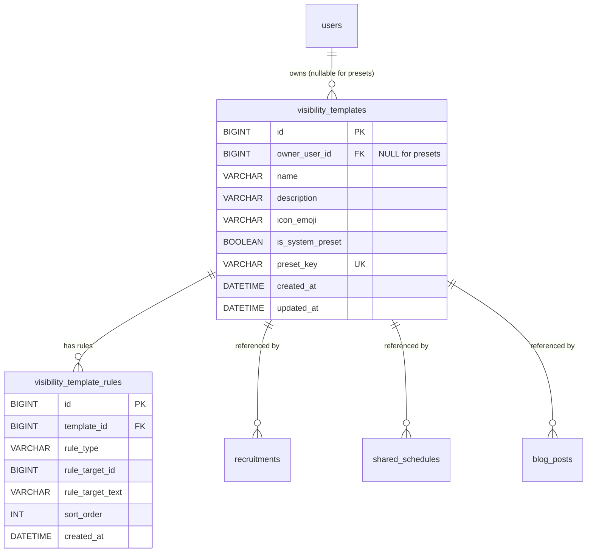

# F01.7 カスタム公開範囲テンプレート

> **ステータス**: 🟢 設計完了
> **作成日**: 2026-04-21
> **最終更新**: 2026-04-21
> **精査履歴**: 2026-04-21 1次精査（33件指摘、P0 10件）/ 2次精査（P0全反映確認）完了
> **関連フィーチャー**: F01.5 フレンドチーム / F03.1 共有スケジュール / F03.11 募集 / F04.1 タイムライン / F04.10 組織委員会

---

## 1. 概要

### 1.1 機能の目的

Mannschaft では各機能（ブログ・募集・スケジュール・委員会等）にそれぞれ独自の `visibility` enum（`PUBLIC` / `MEMBERS_ONLY` / `FRIENDS_ONLY` など）が存在し、かつチーム単位・個別指名での例外指定を都度選ぶ運用になっている。ユーザーからは以下の不満が寄せられている。

- 「毎回同じメンバーを個別指定しているが面倒」
- 「『練習試合を一緒にやってくれる仲間』にだけ見せたいが既存の粒度では不足」
- 「地域のチームにだけ共有したい投稿があるが現状は全フレンド or 非公開の二択」

本機能では、ユーザーが自分専用の **カスタム公開範囲テンプレート (Custom Visibility Template)** を事前に定義・保存し、各機能の visibility 選択時にそのテンプレートを参照できるようにする。1度作ってしまえば使い回せるため、入力摩擦ゼロで細やかな公開コントロールを実現する。

### 1.2 想定ユースケース

| ユースケース | 想定テンプレート |
|-------------|----------------|
| 練習試合募集を「いつも練習を一緒にやるチーム」だけに送る | 🏃 練習仲間（PRESET） |
| 練習会場シェア（駐車場空き情報）を地元チームへ | 🏘️ 地域のチーム（PRESET） |
| 全フレンド向け年賀状風挨拶投稿 | 👥 全フレンド（PRESET） |
| 大会運営委員会で動いているチーム群だけに資料共有 | ユーザー定義「〇〇大会運営メンバー」 |
| 子どもの学年グループに限った連絡（家族チーム連携） | ユーザー定義「小学3年生の親」 |
| 社会人リーグAブロックのチームだけに試合日程共有 | ユーザー定義「社会人リーグA」 |

### 1.3 他の公開範囲との関係

既存の各機能は固有の `visibility` enum を持つ。本機能はそれらを置換するのではなく、**選択肢のひとつ `CUSTOM_TEMPLATE` を追加** する形で併存する。

```
既存 visibility (機能別)
  ├─ PUBLIC          — 誰でも閲覧可
  ├─ MEMBERS_ONLY    — 所属チームメンバーのみ
  ├─ FRIENDS_ONLY    — フレンドチームメンバーまで
  ├─ PRIVATE         — 自分のみ
  └─ CUSTOM_TEMPLATE — テンプレート参照（本機能で追加）★
                          └→ visibility_template_id で参照
```

`CUSTOM_TEMPLATE` が選択された場合、各機能のレコードは `visibility_template_id` FK を通じてテンプレートを参照し、閲覧判定時に共通ヘルパ `VisibilityTemplateEvaluator#canView(userId, templateId)` を呼び出す。

### 1.4 設計思想

- **プライバシー最優先**: 他人のテンプレートは一切覗けない（使用も不可）。evaluate API は自分のテンプレートでのみ呼べる
- **入力摩擦ゼロ**: システムプリセット3つでまず「そこそこの粒度」を即利用可能にする
- **拡張性**: ルール種別を enum で定義し、将来 `TAG_MATCH` 等の追加を容易にする

---

## 2. スコープ

### 2.1 対象ロール × 操作可能な範囲

| ロール | 自分のテンプレ作成・編集・削除 | 自分のテンプレ一覧閲覧 | システムプリセット使用 | 他人のテンプレ閲覧・使用 |
|--------|:--:|:--:|:--:|:--:|
| 一般ユーザー (MEMBER以上) | ○ | ○ | ○ | × |
| GUEST | × | × | × | × |
| ADMIN | 自分のものは○ | 自分のものは○ | ○ | × (※監査目的は別ルート) |
| 未ログイン | × | × | × | × |

### 2.2 全体フェーズ（軍議決定）

本機能は上位軍議「カウント表示拡張 + フォロー可視化 + 公開範囲テンプレート」の一部である。以下の3フェーズ構成で進行する:

| Phase | 内容 | 対象 |
|-------|------|------|
| **Phase 1** | カウント表示拡張 | UserSummary/TeamSummary に `followingCount` / `followerCount` / `teamFriendCount` / `supporterCount` 追加（動的集計）|
| **Phase 2** | フォロー関係の可視化 | F04.4 未実装API完成、自分・他人のフォロー一覧UI |
| **Phase 3** | **カスタム公開範囲テンプレート（F01.7 主題）** | 本設計書の全機能（DB/API/ビジネスロジック/UI/F03.11/F03.1 への適用）を実装 |

※ F03.11/F03.1 等の `visibility_template_id` FK カラム追加・`CUSTOM_TEMPLATE` enum 値追加・判定ロジックは **Phase 3 で一括導入**する。Phase 1/2 ではテーブル変更を行わない。

### 2.3 Phase 3 で適用する機能

| 機能 | テーブル | `visibility_template_id` FK 追加 |
|------|---------|-----|
| 募集一覧 (F03.11) | `recruitments` | ○ |
| 共有スケジュール (F03.1) | `schedules`（user_id IS NULL = 共有）| ○ |
| ブログ投稿 (F06.1) | `blog_posts` | ○ |
| 委員会投稿 (F04.10) | `committee_posts` | △ Phase 4 以降で検討 |
| クイックメモ (F02.5) | `quick_memos` | × 個人用のため非適用 |
| タイムライン (F04.1) | `timeline_posts` | △ Phase 4 以降で検討 |

### 2.4 本設計書の対象外（別軍議扱い）

- 他ユーザーへのテンプレート共有／コピー機能（Phase 4 以降）
- 組織／チーム共通テンプレート（全員で使えるテンプレ、Phase 4 以降）
- テンプレートに対するエイリアス複数付与
- visibility enum 統一（14種以上の機能別 enum の統一は別軍議扱い）

---

## 3. DB設計

### 3.1 テーブル一覧

| テーブル名 | 用途 | 追加タイミング |
|-----------|------|--------------|
| `visibility_templates` | テンプレート本体 | V16.001 |
| `visibility_template_rules` | テンプレートを構成するルール群 | V16.002 |
| 既存機能テーブルへの FK 追加 | 各機能からの参照 | V16.006 |

### 3.2 `visibility_templates` テーブル定義

| カラム | 型 | NULL | 既定値 | 説明 |
|-------|----|------|-------|------|
| `id` | BIGINT | NOT NULL | AUTO_INCREMENT | 主キー |
| `owner_user_id` | BIGINT | NULL | — | 作成者ユーザーID。システムプリセットは NULL |
| `name` | VARCHAR(60) | NOT NULL | — | ユーザーが付ける名前（例: 「練習仲間」）|
| `description` | VARCHAR(240) | NULL | — | 補足説明 |
| `icon_emoji` | VARCHAR(16) | NULL | — | UI表示用絵文字（例: 🏃）|
| `is_system_preset` | BOOLEAN | NOT NULL | FALSE | システムプリセットなら TRUE |
| `preset_key` | VARCHAR(64) | NULL | — | プリセット識別子（例: `PRESET_TRAINING_PARTNERS`）|
| `created_at` | DATETIME(6) | NOT NULL | CURRENT_TIMESTAMP(6) | 作成日時 |
| `updated_at` | DATETIME(6) | NOT NULL | CURRENT_TIMESTAMP(6) ON UPDATE | 更新日時 |

**インデックス**:
- PRIMARY KEY (`id`)
- INDEX `idx_vt_owner` (`owner_user_id`)
- UNIQUE KEY `uk_vt_preset_key` (`preset_key`) — プリセット識別子の一意性
- UNIQUE KEY `uk_vt_owner_name` (`owner_user_id`, `name`) — 同一ユーザー内で名前重複禁止

**FK**:
- `owner_user_id` → `users(id)` ON DELETE CASCADE

**ON DELETE 方針（全機能共通）**:

| 削除対象 | 連鎖動作 | 理由 |
|---------|---------|------|
| ユーザー削除 | そのユーザーのテンプレートが全て CASCADE 削除される → 各機能の `visibility_template_id` は FK の `SET NULL` により NULL になる | テンプレ・関連投稿は残存（投稿本体はユーザーの soft delete / cascaded により別途処理）|
| テンプレート削除（ユーザー操作）| 各機能の `visibility_template_id` が `SET NULL` される。投稿は削除されない | 投稿を保護しつつ公開範囲を失効 |
| `visibility_template_id = NULL` かつ `visibility = 'CUSTOM_TEMPLATE'` の投稿 | アプリ層で `PRIVATE` 相当として扱う（本人のみ閲覧可） | フェイルセーフ — 誰にも見えないより本人には見える方が混乱が少ない |

**各機能テーブルでの FK 統一**: `visibility_template_id` は全機能で `ON DELETE SET NULL` とする（F03.11, F03.1, F06.1 等）。

**CHECK 制約**:
```sql
CONSTRAINT chk_vt_preset_owner CHECK (
  (is_system_preset = TRUE  AND owner_user_id IS NULL  AND preset_key IS NOT NULL)
  OR
  (is_system_preset = FALSE AND owner_user_id IS NOT NULL AND preset_key IS NULL)
)
```

**上限ポリシー**: 1ユーザーあたり `is_system_preset = FALSE` のレコード上限10件（アプリ層で enforce）。

### 3.3 `visibility_template_rules` テーブル定義

| カラム | 型 | NULL | 既定値 | 説明 |
|-------|----|------|-------|------|
| `id` | BIGINT | NOT NULL | AUTO_INCREMENT | 主キー |
| `template_id` | BIGINT | NOT NULL | — | 親テンプレートID |
| `rule_type` | VARCHAR(40) | NOT NULL | — | ルール種別（enum） |
| `rule_target_id` | BIGINT | NULL | — | ルール対象ID（種別により team_id / org_id / user_id / region_id を指す） |
| `rule_target_text` | VARCHAR(120) | NULL | — | テキスト型の対象（予備枠） |
| `sort_order` | INT | NOT NULL | 0 | 表示順 |
| `created_at` | DATETIME(6) | NOT NULL | CURRENT_TIMESTAMP(6) | 作成日時 |

**インデックス**:
- PRIMARY KEY (`id`)
- INDEX `idx_vtr_template` (`template_id`)
- INDEX `idx_vtr_type_target` (`rule_type`, `rule_target_id`)

**FK**:
- `template_id` → `visibility_templates(id)` ON DELETE CASCADE

**rule_type enum（VARCHAR で格納）**:

| 値 | 意味 | `rule_target_id` |
|----|------|-----------------|
| `TEAM_FRIEND_OF` | 指定チームのフレンドチームメンバー全員 | teams.id（通常は @USER_PRIMARY_TEAM を解決したID） |
| `ORGANIZATION_MEMBER_OF` | 指定組織の全メンバー | organizations.id |
| `TEAM_MEMBER_OF` | 指定チームのメンバー | teams.id |
| `REGION_MATCH` | 指定 region と属性合致するチーム所属ユーザー | regions.id |
| `EXPLICIT_TEAM` | 明示指定チームのメンバー | teams.id |
| `EXPLICIT_USER` | 明示指定ユーザー | users.id |
| `EXPLICIT_SOCIAL_PROFILE` | 明示指定 social_profile のユーザー | social_profiles.id |

**上限ポリシー**: 1テンプレートあたりルール最大20件（アプリ層で enforce、DB制約はなし）。

### 3.4 ER図（Mermaid）



### 3.5 マイグレーション注記

- V16.001〜V16.006 の採番で連番追加する（V15 帯の混雑回避。実装時 `flyway_schema_history` で最終確認）
- プリセット seed 投入は `R__seed_visibility_template_presets.sql`（Flyway **repeatable** スクリプト）で管理。プリセット定義変更時にスクリプトのチェックサムが変われば自動再適用される
- 初回投入（V16.003〜V16.005）は固定 SQL、その後の更新は repeatable スクリプトで吸収する二段構え
- 既存機能テーブルへの FK 追加は `ON DELETE SET NULL` を選択（テンプレート削除時は `visibility` を `PRIVATE` にフォールバックする運用）
- 既存レコードには `visibility_template_id IS NULL` で差し支えない（`CUSTOM_TEMPLATE` 以外では使わないため）

---

## 4. API設計

### 4.1 エンドポイント一覧

| Method | Path | 説明 | 認可 |
|--------|------|------|------|
| GET | `/api/v1/visibility-templates` | 自分のテンプレート一覧＋システムプリセット | 認証済み |
| GET | `/api/v1/visibility-templates/{id}` | テンプレート詳細（ルール含む） | 認証済み + オーナー or プリセット |
| POST | `/api/v1/visibility-templates` | 新規作成 | 認証済み、上限10件まで |
| PUT | `/api/v1/visibility-templates/{id}` | 更新（プリセットは 403） | 認証済み + オーナーのみ |
| DELETE | `/api/v1/visibility-templates/{id}` | 削除（プリセットは 403） | 認証済み + オーナーのみ |
| POST | `/api/v1/visibility-templates/{id}/evaluate?targetUserId=X` | 対象ユーザーが範囲内か判定 | 認証済み + オーナー or プリセット |
| GET | `/api/v1/visibility-templates/{id}/resolved-members` | 現在テンプレを適用した場合の対象ユーザー一覧（プレビュー） | 認証済み + オーナーのみ |

### 4.2 リクエスト / レスポンス JSON 仕様

#### 4.2.1 GET `/api/v1/visibility-templates`

**レスポンス 200**:
```json
{
  "userTemplates": [
    {
      "id": 1012,
      "name": "社会人リーグA",
      "description": "Aブロック所属チーム専用",
      "iconEmoji": "⚽",
      "isSystemPreset": false,
      "ruleCount": 5,
      "createdAt": "2026-04-20T09:12:44.123456",
      "updatedAt": "2026-04-20T09:12:44.123456"
    }
  ],
  "systemPresets": [
    {
      "id": 1,
      "presetKey": "PRESET_TRAINING_PARTNERS",
      "name": "練習仲間",
      "description": "自チームのフレンドチーム全員",
      "iconEmoji": "🏃",
      "isSystemPreset": true,
      "ruleCount": 1
    },
    {
      "id": 2,
      "presetKey": "PRESET_LOCAL_TEAMS",
      "name": "地域のチーム",
      "description": "自チーム＋地域属性が合致するチーム",
      "iconEmoji": "🏘️",
      "isSystemPreset": true,
      "ruleCount": 2
    },
    {
      "id": 3,
      "presetKey": "PRESET_ALL_FRIENDS",
      "name": "全フレンド",
      "description": "全フレンドチームのメンバー",
      "iconEmoji": "👥",
      "isSystemPreset": true,
      "ruleCount": 1
    }
  ]
}
```

#### 4.2.2 POST `/api/v1/visibility-templates`

**リクエスト**:
```json
{
  "name": "社会人リーグA",
  "description": "Aブロック所属チーム専用",
  "iconEmoji": "⚽",
  "rules": [
    { "ruleType": "EXPLICIT_TEAM", "ruleTargetId": 201 },
    { "ruleType": "EXPLICIT_TEAM", "ruleTargetId": 202 },
    { "ruleType": "EXPLICIT_TEAM", "ruleTargetId": 203 }
  ]
}
```

**バリデーション**:
- `name`: 必須・1〜60文字
- `description`: 任意・最大240文字
- `iconEmoji`: 任意・最大16文字
- `rules`: 必須・1〜20件
- 同一ユーザー内で `name` 重複禁止（409 Conflict）
- 作成済みテンプレート数が10件以上の場合 403 Forbidden（`TEMPLATE_LIMIT_EXCEEDED`）

**レスポンス 201**:
```json
{
  "id": 1013,
  "name": "社会人リーグA",
  "description": "Aブロック所属チーム専用",
  "iconEmoji": "⚽",
  "isSystemPreset": false,
  "rules": [
    { "id": 5001, "ruleType": "EXPLICIT_TEAM", "ruleTargetId": 201, "sortOrder": 0 },
    { "id": 5002, "ruleType": "EXPLICIT_TEAM", "ruleTargetId": 202, "sortOrder": 1 },
    { "id": 5003, "ruleType": "EXPLICIT_TEAM", "ruleTargetId": 203, "sortOrder": 2 }
  ],
  "createdAt": "2026-04-21T10:00:00.000000"
}
```

#### 4.2.3 POST `/api/v1/visibility-templates/{id}/evaluate?targetUserId=X`

**レスポンス 200**:
```json
{
  "templateId": 1013,
  "targetUserId": 42,
  "canView": true
}
```

※ 意図的に内訳（どのルールがヒットしたか）は返さない。理由はセクション §6 参照。

#### 4.2.4 GET `/api/v1/visibility-templates/{id}/resolved-members`

**レスポンス 200**:
```json
{
  "templateId": 1013,
  "totalUsers": 58,
  "teams": [
    { "id": 201, "name": "FC 武蔵" },
    { "id": 202, "name": "青葉SC" }
  ],
  "users": [
    { "id": 42, "displayName": "山田太郎" }
  ],
  "resolvedAt": "2026-04-21T10:00:00.000000"
}
```

※ オーナー自身が確認するプレビュー用のため返却して良いが、`evaluate` と異なり **明示的にオーナーのみ** に制限する。

### 4.3 エラーレスポンス

| ステータス | コード | 発生条件 |
|-----------|--------|----------|
| 400 | `VALIDATION_ERROR` | 名前過長・ルール0件・ルール21件以上など |
| 403 | `FORBIDDEN_PRESET_MODIFY` | プリセットに対する PUT/DELETE |
| 403 | `TEMPLATE_LIMIT_EXCEEDED` | 10件上限超過 |
| 404 | `TEMPLATE_NOT_FOUND` | 存在しない or 他人のテンプレ（IDOR 対策で 404 統一） |
| 409 | `TEMPLATE_NAME_CONFLICT` | 同一ユーザーで名前重複 |
| 429 | `RATE_LIMIT_EXCEEDED` | レート制限違反 |

---

## 5. ビジネスロジック

### 5.1 主要フロー

#### 5.1.1 テンプレート作成フロー

```
フロント: モーダルで name / description / icon / rules 入力
    │
    ▼
POST /api/v1/visibility-templates
    │
    ├─ [バリデーション] name文字数・ルール件数上限・同名重複
    │
    ├─ [上限チェック] 自ユーザーの既存件数 < 10
    │
    ├─ [rule_target_id 参照整合性] 各 rule の対象が実在・自分にも見える範囲か検証
    │
    ├─ [トランザクション] visibility_templates INSERT → visibility_template_rules 一括INSERT
    │
    └─ [監査ログ] TemplateCreated イベント発行
         │
         ▼
    201 Created
```

#### 5.1.2 テンプレート適用フロー（投稿時）

```
フロント: 投稿作成画面で visibility = CUSTOM_TEMPLATE を選択
    │
    ▼
    テンプレート選択 Picker で自分のテンプレ + プリセットから選択
    │
    ▼
POST /api/v1/recruitments (or shared-schedules, blog-posts)
    body: { visibility: "CUSTOM_TEMPLATE", visibilityTemplateId: 1013, ... }
    │
    ├─ [検証] visibilityTemplateId が自分のテンプレ or プリセットのいずれか
    │
    └─ [保存] recruitments.visibility = 'CUSTOM_TEMPLATE', visibility_template_id = 1013
```

#### 5.1.3 閲覧判定フロー

```
他ユーザー: GET /api/v1/recruitments/{id}
    │
    ▼
RecruitmentAccessPolicy#canView(user, recruitment)
    │
    └─ recruitment.visibility == CUSTOM_TEMPLATE
         │
         ▼
    VisibilityTemplateEvaluator#canView(user.id, recruitment.visibilityTemplateId)
         │
         ├─ テンプレート + ルール fetch（キャッシュ有り）
         ├─ 各ルールを OR 結合で評価（1つでもヒットすれば canView=true）
         └─ プレースホルダを投稿者コンテキストで解決
```

### 5.2 判定ロジック

`VisibilityTemplateEvaluator` サービスクラスの責務を以下に定める。

#### 5.2.1 クラス構成

```java
@Service
public class VisibilityTemplateEvaluator {
    public boolean canView(Long viewerUserId, Long templateId, Long ownerUserId);
    public Set<Long> resolveMemberUserIds(Long templateId, Long ownerUserId);
    private boolean evaluateRule(VisibilityTemplateRule rule, Long viewerUserId, Long ownerUserId);
    private Set<Long> resolveRuleMembers(VisibilityTemplateRule rule, Long ownerUserId);
}
```

#### 5.2.2 ルール評価（OR 結合）

各ルールは独立に評価し、**1つでも true を返した時点で確定** する（short-circuit）。

```
canView(viewer, template, owner):
    for rule in template.rules:
        if evaluateRule(rule, viewer, owner):
            return true
    return false
```

#### 5.2.3 プレースホルダ解決

`rule_target_id` に特別な sentinel 値を置かず、**`rule_type` と `rule_target_text` の組合せで** プレースホルダを扱う方針とする（シンプル化）。

| プレースホルダ | 解決ルール | 備考 |
|--------------|-----------|------|
| `@USER_PRIMARY_TEAM` | owner の `memberships` のうち `is_primary = true` のチーム | owner 視点で解決 |
| `@USER_PRIMARY_REGION` | owner の primary team の `region_id` | owner 視点で解決 |

プリセット定義時は `rule_target_text = '@USER_PRIMARY_TEAM'` のように格納し、`rule_target_id` は NULL とする。評価時に owner のコンテキストで実 ID に解決する。

**解決失敗時の挙動（フェイルセーフ）**:

以下のいずれかが発生した場合、該当ルールの評価結果は **`false`（アクセス拒否）** とする。他のルールが真ならテンプレート全体は真（OR 結合）となるため、テンプレート全体がブロックされるのは**全ルールが解決失敗 or false** のときのみ。

| 失敗ケース | 挙動 |
|----------|------|
| owner が primary team を持たない（`@USER_PRIMARY_TEAM` 解決不可）| 当該ルールのみ `false`、audit_log に `VISIBILITY_TEMPLATE_RESOLUTION_FAILED` を記録 |
| owner が複数 primary team を持つ（データ整合性異常）| 最小 `team_id` を優先解決。警告ログ出力 |
| owner の primary team に `region_id` がない（`@USER_PRIMARY_REGION` 解決不可）| 当該ルールのみ `false`、audit_log に記録 |
| `rule_target_id` が削除済みエンティティを指す | 当該ルールのみ `false`、ログ出力。定期クリーンアップバッチで該当ルール行を削除する（Phase 2 で検討） |

**プレースホルダ一覧管理**: 将来のプレースホルダ追加に備え、Java 側では `PlaceholderResolver` enum で一元管理（`USER_PRIMARY_TEAM` / `USER_PRIMARY_REGION` / 将来追加）。

#### 5.2.4 各 `rule_type` の評価ロジック

| `rule_type` | 評価ロジック |
|------------|------------|
| `TEAM_FRIEND_OF` | viewer が属するチームが、指定チーム（解決後 team_id）の `team_friendships` 関係にあるか |
| `ORGANIZATION_MEMBER_OF` | viewer が指定組織のメンバーか |
| `TEAM_MEMBER_OF` | viewer が指定チームのメンバーか |
| `REGION_MATCH` | viewer の primary team の region が指定 region と **prefix match**（例: `JP-13` は `JP-13-XX` にマッチ）。詳細は F01.2 region 実装仕様に従う |
| `EXPLICIT_TEAM` | viewer が指定チームのメンバーか |
| `EXPLICIT_USER` | viewer.id == rule_target_id |
| `EXPLICIT_SOCIAL_PROFILE` | viewer の social_profile_id == rule_target_id |

#### 5.2.5 キャッシュ

- テンプレート本体＋ルールの読み込みは Valkey に 5 分キャッシュ
- キャッシュキー: `vt:{templateId}`
- 更新・削除時は evict

### 5.3 システムプリセットの扱い

#### 5.3.1 プリセット3種の定義

| preset_key | name | icon | ルール |
|-----------|------|------|-------|
| `PRESET_TRAINING_PARTNERS` | 練習仲間 | 🏃 | `TEAM_FRIEND_OF` (target=@USER_PRIMARY_TEAM) |
| `PRESET_LOCAL_TEAMS` | 地域のチーム | 🏘️ | `TEAM_MEMBER_OF`(@USER_PRIMARY_TEAM) OR `REGION_MATCH`(@USER_PRIMARY_REGION) |
| `PRESET_ALL_FRIENDS` | 全フレンド | 👥 | `TEAM_FRIEND_OF` (target=@USER_PRIMARY_TEAM) ※ 現在は上と同等だが将来複数チーム所属時に区別 |

#### 5.3.2 投入方法

- Flyway seed data として V16.003〜V16.005 で `INSERT ... ON DUPLICATE KEY UPDATE` 形式で冪等投入
- `owner_user_id IS NULL` と `preset_key` で識別
- `name` / `description` は日本語で投入し、UIでは i18n キー `common.visibility_template.preset.{preset_key}.name` でオーバーライド表示する

#### 5.3.3 プリセット改ざん防止

- `VisibilityTemplateService#update/delete` で `is_system_preset = TRUE` の場合は `ForbiddenException` を投げる
- DB レベルでは触れないようにトリガー等は使わない（アプリ層の責務で十分）

### 5.4 各機能への適用インターフェース

#### 5.4.1 共通ヘルパ

各機能側は以下のメソッドを呼ぶだけで済むようにする。

```java
public interface VisibilityTemplateEvaluator {
    /**
     * viewer がこのテンプレートを通じて対象を閲覧可能か判定。
     * @param viewerUserId 閲覧しようとしているユーザーID
     * @param templateId テンプレートID
     * @param ownerUserId テンプレートのオーナー(= 投稿者)
     * @return 閲覧可能なら true
     */
    boolean canView(Long viewerUserId, Long templateId, Long ownerUserId);
}
```

#### 5.4.2 各機能の visibility enum への `CUSTOM_TEMPLATE` 追加

- `RecruitmentVisibility`（F03.11）
- `SharedScheduleVisibility`（F03.1）
- `BlogPostVisibility`（F04.1）

※ 機能別の `visibility` enum 統一は本機能のスコープ外（別軍議）とする。各機能ごとに個別追加する方針。

#### 5.4.3 既存 AccessPolicy への統合例

```java
// RecruitmentAccessPolicy (F03.11)
public boolean canView(AppUser viewer, Recruitment rec) {
    return switch (rec.getVisibility()) {
        case PUBLIC -> true;
        case MEMBERS_ONLY -> membershipService.isMember(viewer.getId(), rec.getTeamId());
        case FRIENDS_ONLY -> friendshipService.isFriendTeamMember(viewer.getId(), rec.getTeamId());
        case CUSTOM_TEMPLATE -> evaluator.canView(viewer.getId(), rec.getVisibilityTemplateId(), rec.getPostedByUserId());
        case PRIVATE -> rec.getPostedByUserId().equals(viewer.getId());
    };
}
```

---

## 6. セキュリティ考慮事項

### 6.1 認可

- **自分のテンプレートのみ CRUD 可**: `owner_user_id = currentUserId` を Service 層で必ず検証する
- **他人のテンプレート使用不可**: 投稿作成時の `visibilityTemplateId` 指定は「自分のテンプレ or システムプリセット」のいずれかに限定
- **プリセットに対する変更禁止**: PUT/DELETE は `is_system_preset = TRUE` で 403

### 6.2 IDOR（Insecure Direct Object Reference）対策

- GET/PUT/DELETE で他人のテンプレート ID を指定した場合は **404 Not Found** を返す（403 と使い分けると ID の存在有無が漏洩するため一律 404）
- プリセット（誰もが読める）のみ 404 ではなく通常レスポンス

### 6.3 システムプリセット改ざん防止

- `is_system_preset = TRUE` のレコードに対する UPDATE/DELETE はアプリ層で一律拒否
- 管理画面からの編集 UI も提供しない（変更は Flyway マイグレーションでのみ）

### 6.4 レート制限

| 操作 | 上限 |
|------|------|
| POST (作成) | 10件 / 1時間 / ユーザー |
| PUT (更新) | 30件 / 1時間 / ユーザー |
| DELETE (削除) | 30件 / 1時間 / ユーザー |
| POST evaluate | 100件 / 1時間 / ユーザー |
| GET resolved-members | 20件 / 1時間 / ユーザー |

Bucket4j で実装、`X-RateLimit-Remaining` ヘッダを返す。

### 6.5 プライバシー

#### 6.5.1 evaluate API のリスク分析

`POST /visibility-templates/{id}/evaluate?targetUserId=X` は「あるユーザーが自分のフレンドチームメンバーか」を間接的に問い合わせる API になりうる。繰り返し叩けば他人の所属関係を推測される懸念がある。

**緩和策**:
1. **evaluate は自分が作ったテンプレートでのみ可能**（プリセット含む。ただしプリセットの評価は既存の所属判定と同等なので推測リスクは追加されない）
2. **レスポンスは `canView: boolean` のみ**。どのルールがヒットしたかの内訳は返さない
3. **レート制限 100/時** により大量推測を抑制
4. **evaluate ログを監査ログに残す**（異常パターンを検出可能に）
5. **監視対象**: 同一 IP / ユーザーから 1時間以内に evaluate が 50回超えた場合は WARN アラートを発火（SRE 通知）。レート制限の 100/時より低い閾値で早期検知
6. **監査ログ保持**: `VISIBILITY_TEMPLATE_EVALUATED` イベントは 90日保持。長期トレンド分析に使用

#### 6.5.2 resolved-members API のリスク分析

`GET /visibility-templates/{id}/resolved-members` は「自分が投稿するときに届く相手」を可視化するためのプレビュー API。他人の所属関係を晒す可能性があるため:

- **オーナーのみ利用可**（プリセット共有ユーザーでも閲覧不可）
- レスポンスは `displayName` のみ、メール等は返さない
- 件数のみを返す簡易モード `?summary=true` をデフォルトにし、詳細表示はオプトインにする検討（Phase 2）

### 6.6 監査ログ

以下のイベントを `audit_logs` テーブルに記録する。

| イベント名 | 発火タイミング |
|-----------|---------------|
| `VISIBILITY_TEMPLATE_CREATED` | POST 成功時 |
| `VISIBILITY_TEMPLATE_UPDATED` | PUT 成功時 |
| `VISIBILITY_TEMPLATE_DELETED` | DELETE 成功時 |
| `VISIBILITY_TEMPLATE_EVALUATED` | evaluate 呼び出し時（DEBUG レベル、分析用） |

---

## 7. Flyway マイグレーション

以下のファイルを V16 帯で追加する（V15 帯は F04.4 等との混雑回避のため避ける）。

| ファイル名 | 種別 | 内容 |
|-----------|------|------|
| `V16.001__create_visibility_templates.sql` | versioned | `visibility_templates` テーブル + インデックス + CHECK 制約 |
| `V16.002__create_visibility_template_rules.sql` | versioned | `visibility_template_rules` テーブル + FK |
| `V16.003__seed_system_preset_training_partners.sql` | versioned | `PRESET_TRAINING_PARTNERS` 初回投入 |
| `V16.004__seed_system_preset_local_teams.sql` | versioned | `PRESET_LOCAL_TEAMS` 初回投入 |
| `V16.005__seed_system_preset_all_friends.sql` | versioned | `PRESET_ALL_FRIENDS` 初回投入 |
| `V16.006__add_visibility_template_id_to_features.sql` | versioned | `recruitments` / `schedules` / `blog_posts` に `visibility_template_id` FK 追加（ON DELETE SET NULL） |
| `R__seed_visibility_template_presets.sql` | **repeatable** | プリセット定義の後続更新（ルール追加・表示名変更等）をチェックサム変更で自動再適用 |

### 7.1 SQL 概形（抜粋）

#### V16.001
```sql
CREATE TABLE visibility_templates (
    id BIGINT NOT NULL AUTO_INCREMENT,
    owner_user_id BIGINT NULL,
    name VARCHAR(60) NOT NULL,
    description VARCHAR(240) NULL,
    icon_emoji VARCHAR(16) NULL,
    is_system_preset BOOLEAN NOT NULL DEFAULT FALSE,
    preset_key VARCHAR(64) NULL,
    created_at DATETIME(6) NOT NULL DEFAULT CURRENT_TIMESTAMP(6),
    updated_at DATETIME(6) NOT NULL DEFAULT CURRENT_TIMESTAMP(6) ON UPDATE CURRENT_TIMESTAMP(6),
    PRIMARY KEY (id),
    INDEX idx_vt_owner (owner_user_id),
    UNIQUE KEY uk_vt_preset_key (preset_key),
    UNIQUE KEY uk_vt_owner_name (owner_user_id, name),
    CONSTRAINT fk_vt_owner FOREIGN KEY (owner_user_id) REFERENCES users(id) ON DELETE CASCADE,
    CONSTRAINT chk_vt_preset_owner CHECK (
        (is_system_preset = TRUE AND owner_user_id IS NULL AND preset_key IS NOT NULL)
        OR
        (is_system_preset = FALSE AND owner_user_id IS NOT NULL AND preset_key IS NULL)
    )
) ENGINE=InnoDB DEFAULT CHARSET=utf8mb4;
```

#### V16.006
```sql
ALTER TABLE recruitments
    ADD COLUMN visibility_template_id BIGINT NULL,
    ADD CONSTRAINT fk_recruitments_vt FOREIGN KEY (visibility_template_id) REFERENCES visibility_templates(id) ON DELETE SET NULL;

ALTER TABLE shared_schedules
    ADD COLUMN visibility_template_id BIGINT NULL,
    ADD CONSTRAINT fk_shared_schedules_vt FOREIGN KEY (visibility_template_id) REFERENCES visibility_templates(id) ON DELETE SET NULL;

ALTER TABLE blog_posts
    ADD COLUMN visibility_template_id BIGINT NULL,
    ADD CONSTRAINT fk_blog_posts_vt FOREIGN KEY (visibility_template_id) REFERENCES visibility_templates(id) ON DELETE SET NULL;
```

### 7.2 マイグレーション注意点

- プリセット seed は `ON DUPLICATE KEY UPDATE preset_key = preset_key` による冪等 INSERT で、再実行しても安全にする
- FK は `ON DELETE SET NULL` にする（テンプレ削除で投稿が消えないように）
- テンプレ削除時、`visibility = CUSTOM_TEMPLATE` かつ `visibility_template_id IS NULL` の状態はアプリ側で `PRIVATE` として扱う（フォールバック）

---

## 8. 決定事項（軍議で確定した論点）

1次・2次精査および殿様裁定（2026-04-21）で、以下を確定した:

| 論点 | 決定 | 根拠 |
|------|------|------|
| `PRESET_LOCAL_TEAMS` 地域属性ロジック | `regions.code` の **prefix match** 採用（例: `JP-13` は `JP-13-XX` にマッチ） | §5.2.4 参照、詳細は F01.2 region 実装仕様に準拠 |
| i18n キー命名規則 | プリセット名: `common.visibility_template.preset.{preset_key}.name` / 説明: `.description`。rule_type 表示名: `common.visibility_template.rule_type.{type}.name` / `.description`。6言語全対応 | 既存 i18n ルール踏襲 |
| 既存レコード移行 | **不要**。Phase 3 では新規投稿でのみ CUSTOM_TEMPLATE を選択可能。既存投稿の visibility は変更しない | データ保護、リリースリスク最小化 |
| テンプレート削除時のユーザー通知 | **UI警告のみ**（削除ダイアログで「N件の投稿で使用中。削除すると PRIVATE 相当になります」を表示）。メール通知は不要 | 過剰通知を避ける。ADHD配慮 |
| ユーザー削除時のテンプレート処理 | **ON DELETE CASCADE 維持**（現行設計通り）。譲渡機能は Phase 4 以降で検討 | シンプル、退会者のデータは残さない原則 |
| `resolved-members` パフォーマンス方針 | JOIN FETCH 採用、500件超は `?summary=true` モードへ誘導。実測は実装時に実施 | N+1 回避 |
| `evaluate` API 監査ログ保持 | **90日**（§6.5.1 で確定） | 長期トレンド分析と容量のバランス |
| クロスチームスケジュール mirror の CUSTOM_TEMPLATE | **SOURCE_DERIVED 方式**: mirror は元スケジュールの visibility 判定を継承、mirror 側は独自テンプレート指定不可。詳細は F03.1 に記載 | 設計簡素化、owner 不整合回避 |
| マイグレーション番号 | **V16.001〜V16.006** に変更（V15 帯の混雑回避）。実装時 `flyway_schema_history` で最終確認 | 衝突リスク排除 |
| プリセット seed 再投入方法 | **Flyway repeatable スクリプト** `R__seed_visibility_template_presets.sql` を使用 | プリセット定義変更を自動反映 |
| フロント UI モーダル詳細 | 設計書スコープ外。**実装時 UX レビュー責務** | ドメイン分離 |

## 9. 将来拡張候補（Phase 4 以降検討）

以下は Phase 3 では扱わず、将来の別軍議で検討する:

- テンプレートの「共有」機能（組織内 / 他ユーザーへの配布）
- ルール種別 `TAG_MATCH`（ユーザータグで絞り込み）の追加
- `NEGATIVE` ルール（「〜を除く」）の導入
- テンプレート名の検索 API（オートコンプリート用）
- ユーザー退会時のテンプレート譲渡メカニズム
- プリセット種類の拡充（例: 「普段よく連絡する相手」等、ML推定系）

---

## 10. 変更履歴

| 日付 | 変更内容 | 担当 |
|------|---------|------|
| 2026-04-21 | 初版作成（足軽A） | 足軽A |
| 2026-04-21 | 1次精査（33件指摘、P0 10件）反映: プレースホルダ解決失敗挙動、ON DELETE 方針統一、Phase 分割明確化、evaluate 監視対象、REGION_MATCH prefix match、未解決事項拡充 | 殿様 |
| 2026-04-21 | 2次精査（P0全反映確認、軽微2件修正）完了。ステータス 🟡→🟢 設計完了 | 殿様 |
| 2026-04-21 | 軍議決着: 未解決事項16件全てを決定事項化。§8 を「決定事項」章に改組、将来拡張候補を §9 に分離。マイグレーション番号 V15→V16 へ変更、プリセット seed は Flyway repeatable 方式採用。F03.1 クロスチーム mirror は SOURCE_DERIVED 方式確定。F04.4 カウント denormalize は Phase 1 動的集計で開始し、条件超過時のみ Phase 2+ で導入 | 殿様 |
