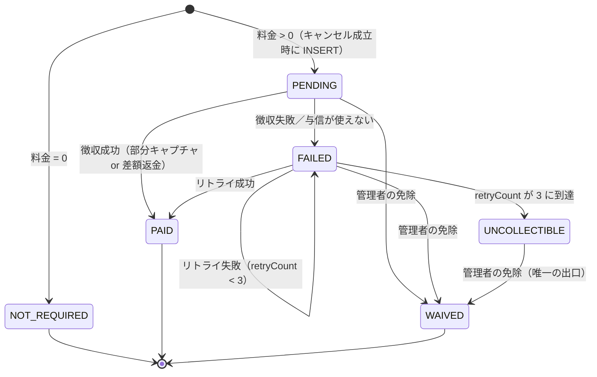

# F03.11.1 募集キャンセル料の徴収（申込時与信からの部分キャプチャ）

> **ステータス**: 🟢 実装完了（BE）。`/試練`（red 作成）→ `/出陣`（green 化）まで完了。FE の免除 UI（§12.1 の文言）は未着手
> **最終更新**: 2026-08-13
> **関連**: [F03.11 募集型予約](F03.11_recruitment_listing.md)（キャンセル料の**算出・記録**の主管。本書はその**徴収**を担う）／ [F22.1 統一決済プラットフォーム](F22.1_market/payment/README.md)（本書が乗る Connect destination charge レール）／ [F20.1 課金・エンタイトルメント基盤](F20.1_entitlement_billing/README.md)（**別系統**・§1.3 で混同禁止を定義）

---

## 0. この設計書が存在する理由

[F03.11](F03.11_recruitment_listing.md) Phase 5a の実装計画に「既存決済システム（F03.4）との連携 — 決済 API 仕様書を別途作成」と書かれたまま、その「別途作成」が行われなかった。結果、origin/main の現状は次のとおりである（すべて実測）。

| 現状（実測） | 根拠 |
|---|---|
| キャンセル料は**算出される** | `RecruitmentCancellationPolicyService.calculateFee`（`backend/src/main/java/com/mannschaft/app/recruitment/service/RecruitmentCancellationPolicyService.java:165-223`） |
| キャンセル料は**記録される**（`payment_status='PENDING'`） | `RecruitmentParticipantService.java:285-299` |
| **徴収する経路が存在しない** | `RecruitmentPaymentRetryBatch.processRetry`（`.../service/RecruitmentPaymentRetryBatch.java:108-130`）は `// TODO: F03.4 決済APIとの統合実装` のスタブで、リトライ回数を増やして常に `false` を返すのみ。Stripe 呼び出しは 1 行も無い |
| **免除する経路も存在しない** | `RecruitmentCancellationRecordEntity.waive`（`.../entity/RecruitmentCancellationRecordEntity.java:108-111`）は定義のみで、main・frontend を通じて呼び出し元ゼロ |

本書はこの穴を埋める。**本書のスコープは「徴収」と「救済」であり、キャンセル料の算出規則（§5.9）・ポリシー編集 UI は F03.11 の主管のまま変更しない。**

> **採番について（F03.11 の「（F03.4）」は誤記である）**: F03.11 が宛先として書いた **F03.4 は「予約」機能に実在する番号**であり（[`F03.4_reservation.md`](F03.4_reservation.md) ＋ サブ番号 `F03.4.1`〜`F03.4.5` の計 6 ファイル）、決済基盤ではない。F03.11 内の「予約ライン (F03.4)」はこちらの正しい参照である。実在の決済基盤は **F22.1**（Connect レール）と **F08.9**（会費）である。
>
> したがって本書は F03.4 を名乗らない。**本書は募集（F03.11）に従属するキャンセル料の決済仕様であり、サブ番号 `F03.11.1` を用いる**（同ディレクトリの `F03.4.1`〜`F03.4.5` が `F03.4_reservation.md` に従属するのと同じ流儀）。独立した空き番号を取ると、F03.11 から独立した機能であるかのように見えてしまうため採らない。

---

## 1. 位置づけと責務範囲

### 1.1 本書の責務（in）

- [ ] キャンセル成立 → キャンセル料の**徴収**。escrow の状態に応じた **2 経路**（与信のみ→部分キャプチャ／確定済み→差額返金・§3.2）
- [ ] キャンセル料を**参加費で丸める**（算出の出口に一度だけ・試算額と徴収額の一致を保証・§6.1）
- [ ] 徴収額の**配分**（利用者の負担を両経路で「キャンセル料ちょうど」に揃え、運営手数料は主催者の取り分から引く・§3.5）
- [ ] 徴収失敗時の**リトライ**（既存 `RecruitmentPaymentRetryBatch` のスタブを実決済に置き換える）
- [ ] リトライ打ち切りを表す**終端状態**の新設（§5）
- [ ] 管理者による**免除（waive）API**（§10）
- [ ] 構造的に徴収できないケースの**明示と逃がし先**（§6）
- [ ] キャンセル時に宙に浮く与信の**始末**（§2.3・現状の欠落を含む）

### 1.2 本書の責務外（out）

- [ ] キャンセル料の算出規則・ティア・境界値 → **F03.11 §5.9**（本書は既存挙動を固定する。**唯一の例外が §6.1 の丸め**で、これは徴収可能性の要件から来るためマスター裁可のうえ本書で定める）
- [ ] ポリシー編集 UI・キャンセル前確認モーダル → F03.11 Phase 5a（実装済）
- [ ] NO_SHOW ペナルティ → F03.11 Phase 5b（**キャンセル料とは別概念**。§8）
- [ ] 参加費そのものの与信・払出 → **F22.1**（本書はそのレールに相乗りする側）
- [ ] 保存カードへの別途請求・請求書発行・督促 → **作らない**（§6.3・マスター裁可）

### 1.3 隣接機能との関係（混同禁止）

| | F20.1 課金 | F22.1 参加費（謝礼） | **本書 F03.11.1 キャンセル料** |
|---|---|---|---|
| 誰が誰に払うか | 団体/個人 → **運営（自社受取）** | 応募者 → **主催者** | 応募者 → **主催者** |
| Stripe の型 | **素の Checkout**（Connect 不使用） | **Connect destination charge** | **同左の与信を部分キャプチャ** |
| 運営の取り分 | 売上そのもの | `application_fee` のみ | **`application_fee` のみ**（参加費と同じ） |
| capture 方式 | `SUBSCRIPTION`（自動） | `CaptureMethod.MANUAL` の与信 → 最終認証で capture | **同じ与信を部分額で capture** |

- **F20.1 とは別系統である。** F20.1 は自社受取ゆえ Connect を使わない（[F20.1 §4.3](F20.1_entitlement_billing/README.md)）。本書は受取先が主催者ゆえ Connect destination charge であり、**テーブル・サービス・用語を混ぜない**。`billing_contracts` / `BillingPaymentGateway` を本書の実装から参照してはならない。
- **F22.1 とは同じレールを共有する。** キャンセル料は「参加費の与信の一部を、参加費の代わりに確定させたもの」であり、**新しい決済経路を一切作らない**（マスター裁可）。受取先・手数料の考え方は参加費と完全に同じ。

---

## 2. 前提となる既存機構の棚卸し（すべて origin/main 実測）

### 2.1 参加費の与信と払出

```
RecruitmentParticipantService.apply()             …申込。確定かつ payment_enabled かつ price 非 null
  └ :205 RecruitmentParticipantConfirmedEvent 発火（個人申込のみ・:203 の条件）
       └ RecruitmentChargeAuthorizationListener:70-72
            @TransactionalEventListener(AFTER_COMMIT) + @Async("event-pool")
            └ :102 第三陣-b 判定（成立〜役務日 > ESCROW_MAX_HOLD_DAYS=7 日 → deferred）
            └ :128 ConnectChargeService.authorize(cmd)
                 ├ deferred=true  → PI を作らず EscrowStatus.DEFERRED で起票（ConnectChargeService.java:149）
                 ├ payee 未 onboarding → PI を作らず HELD（同 :194-202）
                 └ それ以外 → StripePaymentProvider.createDestinationPaymentIntent(..., CaptureMethod.MANUAL, "escrow-{listingId}-{participantId}")
                                → EscrowStatus.PENDING_CONFIRMATION で起票（同 :206-221）
                                → 札主が Stripe.js で confirm し amount_capturable_updated webhook 到達で AUTHORIZED へ昇格
```

払出は最終認証（札 FULL→COMPLETED）で起きる: `MarketChargeCaptureListener.onListingFinalized`（`.../payment/escrow/MarketChargeCaptureListener.java:64-95`）が `AUTHORIZED` を `ConnectChargeService.capture(escrowId)` で確定、`DEFERRED` は `chargeDeferred` で即時払いへ回す。

### 2.2 与信レコードの引き当てキー

- Entity: `EscrowTransactionEntity`（テーブル `escrow_transactions`）
- 一意キー: **三つ組 `(sourceKind=RECRUITMENT, sourceId=listingId, sourceParticipantId=participantId)`**
- 既存メソッド: `EscrowTransactionRepository.findBySourceKindAndSourceIdAndSourceParticipantId(...)`（`ConnectChargeService.java:106` が与信の冪等判定に使用）

**キャンセル記録は `participantId` と `listingId` を保持している**（`RecruitmentCancellationRecordEntity.java:42,44`）ため、この既存メソッドだけで対応する与信を引ける。**新しい引き当て用の列・テーブルは不要**。

### 2.3 `EscrowStatus` と「キャプチャできるか」の対応

| status | PI の有無 | カード上のホールド | 部分キャプチャの可否 |
|---|---|---|---|
| `PENDING_CONFIRMATION` | 有（未 confirm） | **無い** | **不可**（`ConnectChargeService.capture` も `AUTHORIZATION_NOT_CONFIRMED`(409) で拒否・`:687-690`） |
| `DEFERRED` | **無** | 無い | **不可** |
| `HELD` | **無** | 無い | **不可** |
| `AUTHORIZED` | 有 | **有** | **可**（本書の徴収経路） |
| `CAPTURED` | 有 | 確定済 | 不可（既に参加費を全額徴収済・§6.2） |
| `CANCELLED` / `REFUNDED` 等 | — | 無い | 不可 |

（enum 定義: `.../payment/escrow/EscrowStatus.java:16-54`）

### 2.4 現状の欠落 — キャンセルしても与信が始末されない

`RecruitmentParticipantService.cancelMyApplication`（`:234-320`）は**イベントを一切発火せず、escrow に触れない**。したがってキャンセル済み応募の与信は `AUTHORIZED` のまま残り、`MarketChargeCaptureListener` は listing 単位で `AUTHORIZED` を拾う（`:71-81`）ため、**キャンセルした応募者から参加費が全額確定されうる**。

本書の徴収フロー（§3）は、キャンセル時に必ず「部分キャプチャ（＝残額の自動解放）」または「与信取消」のいずれかで与信を終端させるため、**この欠落も同時に塞ぐ**。単独の対症修正は行わない。

---

## 3. 徴収フロー

### 3.1 設計原則

1. **外部 HTTP を `@Transactional` の中に入れない。** 前例: `BillingCheckoutService`（`backend/src/main/java/com/mannschaft/app/billing/BillingCheckoutService.java:13-15` の Javadoc と `:43-64` の実装）が「tx 内で起票 → tx 外で Stripe → 失敗時は補償」の型を確立している。本書もこれに倣う。
2. **キャンセル自体は決済失敗でロールバックしない。** キャンセルは利用者の意思表示であり、主催者側の枠復帰・キャンセル待ち昇格が既に走っている。決済の失敗で巻き戻すと整合が壊れる。失敗は `FAILED` として正直に記録する（症状を隠さない）。
3. **クロスドメイン直接呼び出しをしない。** recruitment → payment はイベント、payment → recruitment もイベントで返す。前例: `RecruitmentParticipantConfirmedEvent` / `ChargeAuthorizationFailedEvent`。

### 3.2 徴収は 2 経路である【マスター御裁可 2026-08-13・R-3】

キャンセル料の徴収方法は、**その時点で参加費の与信が確定済みかどうか**で 2 つに分かれる。**どちらも対等な主要経路であり、片方を例外扱いしてはならない。**

| escrow の状態 | 徴収方法 | 徴収の実体 | 結果 |
|---|---|---|---|
| **与信のみ**（`AUTHORIZED`） | **部分キャプチャ** | キャンセル料の額だけ確定し、残額は Stripe が自動解放（§4.1-1） | `PAID` |
| **確定済み**（`CAPTURED`） | **差額返金** | 参加費は既に主催者へ渡っている。`参加費 − キャンセル料` を支払者へ返金し、**キャンセル料相当だけを主催者に残す**（額の正確な基準は §3.5） | `PAID` |
| **与信が無い**（`DEFERRED` / `HELD` / `PENDING_CONFIRMATION` 等） | 徴収不能 | §6.3 | `FAILED` → 上限到達で `UNCOLLECTIBLE` |

**どちらの経路も「新しい決済経路を作らない」というマスターの裁可の内側にある。** 返金は F22.1 が既に持つ返金機構（`ConnectChargeService.refund` → `StripePaymentProvider.createConnectRefund` / `reverseTransfer`・`ConnectChargeService.java:884-1010`）をそのまま使う。保存カードへの再課金・請求書発行といった新しい経路は**一切作らない**。

**確定済みキャンセルは普通に起こる。** 参加費の払出（capture）は最終認証（札 FULL→COMPLETED）で走り（`MarketChargeCaptureListener.java:64-95`）、これは開催日より前に起こりうる。一方 `cancelMyApplication`（`RecruitmentParticipantService.java:234-300`）は**参加者の状態しか見ておらず、募集の状態によるガードを持たない**。したがって「最終認証が済んだ札の参加者がキャンセルする」ことは常時可能であり、稀なケースではない。

### 3.3 シーケンス（キャンセル成立 → `PAID`）

| # | 実行主体（新設/既存） | 責務 | tx |
|---|---|---|---|
| 1 | `RecruitmentParticipantService.cancelMyApplication`（既存・改修） | 料金算出（**丸め込み後**・§6.1）・参加者 CANCELLED・履歴・**キャンセル記録 INSERT**（`fee>0`→`PENDING`／`=0`→`NOT_REQUIRED`）・枠復帰。末尾で **`RecruitmentCancellationFeeChargeRequestedEvent` を発火**（`fee>0` かつ個人申込のときのみ） | TX-A 内 |
| 2 | `RecruitmentCancellationFeeChargeListener`（**新設**・`payment.escrow` 配置） | `@TransactionalEventListener(AFTER_COMMIT)` + `@Async("event-pool")` で受ける。TX-A のコミット後にのみ動く | tx 外 |
| 3 | **`ConnectChargeService.settleCancellationFee(...)`（新設・§3.4）** | **経路判定はここに閉じる。** 三つ組で escrow を引き当て、状態に応じて 4a / 4b / 不能 へ分岐する | — |
| 4a | `ConnectChargeService` 内・**部分キャプチャ経路**（`REQUIRES_NEW`） | 行ロック（`findByIdForUpdate`）→ 状態再検査 → `StripePaymentProvider.captureManualPaymentIntent(piId, feeMinor, key)`（**新設オーバーロード**・§4.2）→ escrow を `CAPTURED`・複式記帳。既存 `capture(UUID)`（`:673-724`）と同型 | TX-B |
| 4b | `ConnectChargeService` 内・**差額返金経路**（`REQUIRES_NEW`） | 返金額 `R = 主催者手取り − キャンセル料` を算出（§3.5）。`R > 0` のときだけ既存返金処理を呼ぶ。`R == 0` なら **Stripe を呼ばずに成功として返す**（AC-26） | TX-B' |
| 5 | `RecruitmentCancellationFeeChargeListener` | 成否に応じ `RecruitmentCancellationFeeChargedEvent` / `...FailedEvent` を発火 | — |
| 6 | `RecruitmentCancellationFeeResultListener`（**新設**・`recruitment` 配置） | 記録を `markPaid(paymentId)` または `markFailed()` へ。`@Transactional`（自ドメイン内・短命） | TX-C |

- **ステップ 4a/4b の外部呼び出しは `@Transactional` の中にある。** これは §3.1-1 に反するように見えるが、既存 `ConnectChargeService.capture`（`:673-724`）・`refund`（`:884-`）が**まさに同じ構造**であり、行ロック下で「Stripe 確定 → 台帳追記」を一体にすることで台帳欠落を防いでいる。本書はこの既存の型を踏襲する（新旧で流儀を割らない）。ステップ 1〜2 の境界（キャンセル TX-A と決済を分ける）で §3.1-1 の本質＝「業務トランザクションを外部 API の所要時間・失敗に巻き込まない」は達成されている。
- ステップ 4a/4b が例外を投げた場合、TX-B/TX-B' はロールバックする。**キャンセル（TX-A）は AFTER_COMMIT ゆえ巻き戻らない。**

### 3.4 経路判定を置く場所（ドメイン境界）

**経路の判定は payment ドメインの単一入口 `ConnectChargeService.settleCancellationFee(...)` の中で行う。**

```java
// payment.escrow（新設）— recruitment 側はこの 1 本だけを呼ぶ
SettleCancellationFeeResult settleCancellationFee(
        EscrowSourceKind sourceKind, Long sourceId, Long sourceParticipantId,
        long cancellationFeeMinor, String idempotencyRef);
```

- **recruitment 側が `EscrowStatus` を読んで分岐してはならない。** escrow の状態は payment ドメインの内部状態であり、他ドメインが読んで判断すると境界が壊れる（クロスドメイン参照の禁止）。recruitment が渡すのは「どの応募か」と「いくら徴収したいか」だけであり、**どう徴収するかは payment が決める**。
- 戻り値 `SettleCancellationFeeResult` は `{ outcome: CAPTURED_PARTIAL / REFUNDED_DIFFERENCE / NO_OP / NOT_COLLECTIBLE, stripeReference, uncollectedAmount }` とし、**recruitment は `outcome` だけを見て記録の状態を決める**。`EscrowStatus` を戻り値に含めない。
- リトライバッチも**同じ入口を同じ引数で呼ぶ**。初回とリトライで経路判定を二重に持たない。

### 3.5 徴収額の配分（両経路で利用者の負担を揃える）【マスター御裁可 2026-08-13・R-2】

#### 3.5.1 なぜ配分を定める必要があったか

当初案は差額返金の額を「主催者手取り − キャンセル料」としていた。しかしそれでは**経路によって利用者の払う額が変わってしまう**。差額返金では運営手数料が返らない（`refund_application_fee=false`＝「Mannschaft ±0（1.4% keep）」・`ConnectChargeService.java:857-861`）ため、**利用者が参加費全体にかかった運営手数料まで負担する**ことになる。

**参加費 10,000 円・運営手数料 250 円・キャンセル料 3,000 円の例**:

| 経路 | 利用者の負担 | 主催者 | 運営 |
|---|---|---|---|
| **【裁可前】** 部分キャプチャ | 3,000 円 | 2,750 円 | 250 円 |
| **【裁可前】** 差額返金 | **3,250 円** ⚠️ | 3,000 円 | 250 円 |
| **【裁可後】** 部分キャプチャ | **3,000 円** | 2,750 円 | 250 円 |
| **【裁可後】** 差額返金 | **3,000 円** | 2,750 円 | 250 円 |

裁可前の姿は、**同じキャンセルなのに「主催者がいつ最終認証したか」という利用者には見えない事情で払う額が変わる**。しかも利用者が事前に見た見積り画面には 3,000 円と出ている。これは §6.1 で丸めまで入れて保証した AC-25（見積り額と実徴収額の一致）に正面から反する。**経路によって利用者の負担が変わることは受け入れられない**というのがこの裁可の理由である。

#### 3.5.2 配分の原則（両経路共通）

利用者が払う額は、**どちらの経路でも「キャンセル料ちょうど」に揃える**。**運営手数料は主催者の取り分から差し引く**。

記号を次のように置く（すべて既存の列・値）。

| 記号 | 意味 | 出所 |
|---|---|---|
| `C` | 支払者の請求額 | `escrow.amount` |
| `A` | 原取引の運営手数料 | `escrow.applicationFeeAmount` |
| `T` | 主催者の手取り（`= C − A`） | `ConnectChargeService.java:922` |
| `F` | キャンセル料（丸め後・§6.1） | `cancellation_records.fee_amount` |

```
A_eff = min(A, F)        … この徴収に適用する運営手数料
利用者の負担 = F
主催者の取り分 = F − A_eff
運営の取り分   = A_eff
```

- **`A_eff = min(A, F)` とするのは、キャンセル料が運営手数料を下回るときに主催者の取り分が負にならないようにするため**である。この場合は運営がキャンセル料の全額を取り、主催者の取り分は 0 になる。
- **料率の正本は F22.1 の `PaymentFeeCalculator` / FeePolicy である。本書は料率を定義し直さない。** 本書が定めるのは上の**配分**だけであり、`A` の算定は F22.1 に従う（キャンセル料に対しても参加費と同じ料率が当たる前提）。

#### 3.5.3 部分キャプチャ経路での実現

capture 時に `application_fee_amount` を **`A_eff` で明示的に上書きする**（§4.3 で確認した Capture API の挙動どおり。Stripe 側もキャプチャ額を上限に丸めるため二重に安全）。

```
captureManualPaymentIntent(piId, amountToCapture = F, applicationFeeAmount = A_eff, key)
```

#### 3.5.4 差額返金経路での実現

**返金額は「主催者手取り基準」ではなく「支払者の請求額基準」で決める。** これが当初案の誤りの本体であった。

```
R（支払者へ戻す額） = C − F
```

こうすると利用者の負担は `C − R = F` となり、**上乗せの有無にかかわらず必ずキャンセル料ちょうどになる**。各当事者の増減は次のとおり。

| 当事者 | 巻き戻し／返金する額 | 最終的な取り分 |
|---|---|---|
| 支払者 | `C − F` を返金 | 負担 `F` |
| 主催者 | `T − (F − A_eff)` を巻き戻し | `F − A_eff` |
| 運営 | `A − A_eff` を返金 | `A_eff` |

（検算: 支払者へ戻る `C − F` ＝ 主催者からの巻き戻し `T − F + A_eff` ＋ 運営からの返金 `A − A_eff` ＝ `T + A − F` ＝ `C − F`。貸借は一致する。）

**`F ≥ A` の場合（通常のケース）**: `A_eff = A` となり運営からの返金は 0、主催者からの巻き戻しは `T − F + A = C − F` で支払者への返金額と一致する。これは**既存モードA（`FeeBearer.PAYER`）そのもの**であり、`R = C − F` を渡すだけで成立する。既存の `reverseTransfer` → `createConnectRefund(reverse_transfer=false, refund_application_fee=false)` の組み立て（`:958-964`）をそのまま使える。

**`F < A` の場合（キャンセル料が運営手数料を下回る）**: `A_eff = F` となり、主催者の巻き戻しは `T` 全額、運営は `A − F` を返金する必要がある。**既存のモードA は運営手数料を一切返さないため、この配分を表現できない。** 既存モードB は運営手数料を全額返すので、これも一致しない。

- **✅ 実装時に解消（2026-08-13・出陣）**: 「運営手数料の一部返金」という指定は**そもそも不要**であった。`refund_application_fee=false` のまま、**送金の巻き戻し額を `min(R, T)` にするだけで両ケースの配分が成立する**。運営手数料 `A` は返さずプラットフォーム残高に残り、巻き戻しを減らした分がそのまま運営の取り分になるためである。

  ```
  巻き戻し額 X = min(R, T)   … R = C − F、T = C − A
  支払者へ返金 = R（refund_application_fee = false）
  ```

  | | `X` | 主催者 `T − X` | 運営 `A + X − R` | 利用者 `C − R` |
  |---|---|---|---|---|
  | `F ≥ A` | `R`（`R ≤ T`） | `T − R = F − A` | `A = A_eff` | `F` |
  | `F < A` | `T`（`R > T`） | `0 = F − A_eff` | `C − R = F = A_eff` | `F` |

  どちらも `A_eff = min(A, F)` の配分（§3.5.2）に一致する。したがって `createConnectRefund` の真偽値では表現できないという当初の懸念は、**そもそも「運営手数料を返す」必要が無い**ことにより解消した。既存 `refund()` のシグネチャ・挙動も変更していない。
- **残額の検証基準も支払者請求額基準に揃える。** 既存 `refund()` の `transferAmount` 基準では `F < A` のとき `R > T` で必ず弾かれる（下の注記）。キャンセル料の system 経路では残額を `C − 既返金額` で判定する。
- **`F < A` は稀だが起こりうる**（少額のキャンセル料ティアを設定した募集）。稀であることを理由に握りつぶさず、少なくとも「利用者の負担が `F` を超えない」ことは保証する。

> **⚠️ 実装時の落とし穴（既存の残額検証との相性）**: 既存 `refund()` は返金額を **`residualBefore = transferAmount − 既返金額`（＝主催者手取り基準）** で検証し、これを超える額を拒否する（`ConnectChargeService.java:922-936`）。本書の `R = C − F` は**支払者請求額基準**であり、両者の関係は次のとおり。
>
> - `F ≥ A` のとき `R = C − F ≤ C − A = T` → **既存の検証を通る**
> - `F < A` のとき `R = C − F > T` → **既存の検証に弾かれる**（`REFUND_AMOUNT_EXCEEDS`）
>
> つまり `F < A` の分岐は「運営手数料の一部返金を表現できない」だけでなく、**そもそも既存の額検証を通らない**。system 経路（§3.6）で額の検証基準も含めて扱うこと。`R = C − F` をそのまま既存 `refund()` に渡す実装は、`F < A` で必ず失敗する。

**共通の注記**: `R ≤ 0`（`F == C`＝キャンセル料が請求額と同額）のときは**Stripe を呼ばない**（AC-26）。既存 `refund()` は `refundAmount <= 0` を例外にする（`:932`）ため、呼ぶと徴収が失敗扱いになる。

`reason` は `"cancellation"` を渡す。`FeeBearer` は `PAYER`（支払者負担・モードA）を基礎とする——キャンセルは支払者の都合であり、運営が手数料を放棄して中立化するモードB（受取側の落ち度／中止）は当たらない。

> **既存機構の性質（利用者には影響しない）**: destination charge の返金では元取引の Stripe 決済手数料が戻らず、標準フローでは Mannschaft が負担する（`:868-873` に明記）。これは**運営側の負担**であって利用者の負担ではないため、上の配分（利用者 = `F`）は影響を受けない。本書はこの既存の性質を変更しない。

### 3.6 既存 `refund()` をそのまま呼べない理由（実測）

既存 `refund()` は先頭で `authorizePayeeAdmin(escrow, actorUserId)` を無条件に呼ぶ（`ConnectChargeService.java:891`）。これは**人間の操作者を前提**にした経路であり、本書の徴収は操作者のいないイベント駆動である。加えて同メソッドは受取側が個人（`payeeKind == USER`）の escrow を対象外としている（`:1362-1365`）が、募集の受取先は個人でもありうる（`listing.payeeUserId`）。

したがって差額返金は、**既存の返金ロジック本体（額の算定・`reverseTransfer`・`createConnectRefund`・台帳追記）を共有しつつ、操作者認可を通らない system 経路**として実装する。前例は与信側に既にある——`authorize()` はイベント駆動の呼び出しで `actorUserId = null` を受け取り、「system 経路（イベント駆動）: actor 認可はスキップ」として扱っている（`RecruitmentChargeAuthorizationListener.java:121`）。同じ流儀に揃える。

- この system 経路は **HTTP エンドポイントから到達できない**（Controller を持たず、内部リスナとバッチからのみ呼ばれる）。操作者に基づく判断を行わないのは、判断すべき操作者が存在しないためである。
- 既存の `refund()` の**シグネチャと挙動は変更しない**（`/api/v1/.../refund` 系の呼び出し元を壊さない）。共通化はロジックの抽出によって行う。

### 3.7 `payment_id` に何を入れるか

`markPaid(paymentId)` の引数には **Stripe の参照 ID** を入れる。経路によって種別が異なる。

| 経路 | 入れる値 |
|---|---|
| 部分キャプチャ | **PaymentIntent ID（`pi_...`）** |
| 差額返金 | **Refund ID（`re_...`）** |
| 返金額 0 の成立（AC-26） | **PaymentIntent ID（`pi_...`）**（Stripe を呼んでいないため新しい参照が無く、確定済みの元決済を指す） |

理由: 紛争対応時に Stripe ダッシュボードから直接引ける識別子であること。いずれも `VARCHAR(100)` に収まる（`V3.127__create_recruitment_cancellation_records.sql`）。どの経路で徴収したかは `outcome`（§3.4）に対応するため、**値の接頭辞（`pi_` / `re_`）で経路が判別できる**。

### 3.8 イベントの積荷（payload）

クロスドメインのイベントは **ID と素の値のみ**を運ぶ（Entity を載せない・既存 `RecruitmentParticipantConfirmedEvent` と同じ流儀）。

| イベント | フィールド |
|---|---|
| `RecruitmentCancellationFeeChargeRequestedEvent`（recruitment → payment） | `cancellationRecordId`（冪等キーの素）／`listingId`／`participantId`（escrow 引き当ての三つ組）／`payerUserId`／`feeAmount`（円・minor 単位換算は payment 側の責務） |
| `RecruitmentCancellationFeeChargedEvent`（payment → recruitment） | `cancellationRecordId`／`stripeReference`（`pi_...` または `re_...`・§3.7）／`outcome`（§3.4） |
| `RecruitmentCancellationFeeChargeFailedEvent`（payment → recruitment） | `cancellationRecordId`／`reason`（ログ・運用向けの文字列。利用者には出さない） |

### 3.9 エラーコード

| 用途 | コード | HTTP |
|---|---|---|
| 免除対象が `PAID`（免除ではなく返金の話） | `RecruitmentErrorCode` に**新設** `CANCELLATION_FEE_ALREADY_PAID` | 409 |
| 免除対象の記録が存在しない／論理削除済 | 既存の NOT_FOUND 系に合わせる | 404 |
| 徴収失敗（内部・利用者には返さない） | 既存 `ConnectPaymentErrorCode.CAPTURE_FAILED`（`StripePaymentProviderImpl.java:760`）をそのまま流用 | — |

徴収は**非同期（AFTER_COMMIT + `@Async`）で走るため、利用者のキャンセル要求に対する HTTP レスポンスには決済の成否が乗らない**。キャンセル API は従来どおり参加者情報を返し、決済結果は記録の `paymentStatus` として後から反映される。この非同期性は FE の表示（「キャンセル料のお支払い状況」）の前提になる。

---

## 4. 部分キャプチャの扱い（Stripe 仕様の裏取り）

### 4.1 Stripe 公式ドキュメントで確認した事実

出典: [Place a hold on a payment method](https://docs.stripe.com/payments/place-a-hold-on-a-payment-method)（2026-08-13 確認）

1. **部分キャプチャの残額は自動的に解放される。** 「当初の金額より少ない…金額をキャプチャーするには `amount_to_capture` オプションを渡します。**部分的なキャプチャーを行った場合、残額は自動的にリリースされます**」。→ 明示的な取消 API を別途呼ぶ必要は**ない**。
2. **部分キャプチャ後に差額を追加キャプチャすることはできない。** 「決済の一部をキャプチャーした場合、差額分に対して別途キャプチャーを行うことはできません」（マルチキャプチャ対象の一部カードを除く）。→ **キャプチャは 1 回で決め切る**。段階徴収の設計は採れない。
3. **キャプチャできる上限は与信額である。** API リファレンス（[Capture a PaymentIntent](https://docs.stripe.com/api/payment_intents/capture)）は `amount_to_capture` を「**元の金額以下でなければならない**（省略時は `amount_capturable` の全額）」と定義する。与信額超のキャプチャ（overcapture）は別途オプトインが必要な機能であり、本書では**使わない**。→ §6.1 の「料金 > 与信額」問題に直結する。
   なお同 API は `final_capture`（既定 `true`）を持ち、`false` にすると残額を解放せず保持する（マルチキャプチャ対応時のみ）。本書は**既定の `true` のまま**とし、残額は解放させる。
4. **未キャプチャの与信は期限切れで解放され、PaymentIntent は `canceled` になる。** 有効期間はカード非提示・顧客起動取引で **Visa/Mastercard/Amex/Discover ともに 7 日**（Visa の加盟店起動取引は 5 日）。
5. **日本拠点アカウントの JPY 建て取引は最長 30 日**保留できる（Visa/Mastercard/JCB/Diners/Discover。**Amex と JPY 以外は標準の 7 日**）。→ §6.3 で扱う。

### 4.2 既存実装の状態と必要な変更

現在の `StripePaymentProviderImpl.captureManualPaymentIntent`（`backend/src/main/java/com/mannschaft/app/payment/stripe/StripePaymentProviderImpl.java:748-762`）は

```java
PaymentIntent captured = intent.capture(PaymentIntentCaptureParams.builder().build(), options);
```

と**空パラメータ**で呼んでおり、金額引数はシグネチャ（`StripePaymentProvider.java:263`）にも存在しない＝**常に全額キャプチャ**である。よって部分額指定には interface と impl の双方にオーバーロードを追加する必要がある。

```java
// StripePaymentProvider（新設オーバーロード）
PaymentIntentInfo captureManualPaymentIntent(String paymentIntentId, long amountToCaptureMinor, String idempotencyKey);
```

既存の 2 引数版は**シグネチャを変えずに残す**（`ConnectChargeService.capture:703` の呼び出し元を壊さない）。

### 4.3 application_fee の扱い【✅ 御裁可済 R-2 → 配分は §3.5】

destination charge の `application_fee_amount` は **PaymentIntent 作成時**に確定している（`StripePaymentProviderImpl.java:643`）。参加費（例 5,000 円）に対して算出された手数料が、キャンセル料（例 1,500 円）だけを確定するときにそのまま適用されると、主催者の手取りが不当に痩せる。

Stripe の Capture API は **`application_fee_amount` を明示的に受け付ける**（[API リファレンス](https://docs.stripe.com/api/payment_intents/capture)。「アプリケーション手数料として徴収される額は**キャプチャした合計額を上限に丸められる**」と定義）。したがって capture 時に手数料を渡し直すことは仕様上可能であり、**キャプチャ額に対して手数料を再計算して上書きする**のが妥当と考える。

**御裁可（2026-08-13）**: 運営手数料は**主催者の取り分から差し引く**（利用者に上乗せしない）。capture 時に `application_fee_amount = A_eff = min(A, F)` を**明示的に上書きする**。配分の全体像・差額返金経路との揃え方・記号の定義は **§3.5** に集約した。

手数料率の正本は F22.1 の `PaymentFeeCalculator`／FeePolicy であり、**本書は料率を定義し直さない**（キャンセル料に対しても参加費と同じ料率が当たる前提で書く）。なお Stripe 側もキャプチャ額を上限に手数料を丸めるため、上書きと合わせて二重に安全である。**§13 R-2 は解消。**

---

## 5. 状態遷移と終端状態の新設

### 5.1 新設する終端状態

`CancellationPaymentStatus`（`backend/src/main/java/com/mannschaft/app/recruitment/CancellationPaymentStatus.java`）に **`UNCOLLECTIBLE`（回収不能）** を追加する。

- **語感**: 既存値は `NOT_REQUIRED` / `PENDING` / `PAID` / `WAIVED` / `FAILED` と、いずれも「その料金がどうなったか」を形容詞・過去分詞で述べる形である。`UNCOLLECTIBLE` はこれに揃う。「試行が尽きた」ではなく「回収できない」という**結果**を述べている点も既存と同じ語法である。
- **列長**: `payment_status VARCHAR(20)`（`V3.127`）に対し 13 文字。既存 DDL のまま収まり、Flyway での列拡張は不要。

### 5.2 遷移図



### 5.3 各状態の意味と申込ブロックへの効き方

| 状態 | 意味 | 新規申込ブロック（`RecruitmentParticipantService.java:129-134`） |
|---|---|---|
| `NOT_REQUIRED` | 料金 0。徴収対象外 | しない |
| `PENDING` | 料金 > 0・徴収未了 | **する**（現状どおり） |
| `PAID` | 徴収済 | しない |
| `FAILED` | 徴収失敗・リトライ対象 | **する**（現状どおり） |
| **`UNCOLLECTIBLE`** | リトライ打ち切り。**未払いであることに変わりはない** | **する（新規に追加）** |
| `WAIVED` | 管理者が免除した | しない |

`UNCOLLECTIBLE` を申込ブロックの対象に加えるため、`:130-131` の判定は `List.of(PENDING, FAILED, UNCOLLECTIBLE)` へ拡張する。**`UNCOLLECTIBLE` という状態からの出口は免除（`WAIVED`）のみ**とし、自動で状態が変わる経路は設けない。

> **ブロックの判定はユーザー単位であり、記録単位ではない。** `existsByUserIdAndPaymentStatusIn(userId, ...)` は上の 3 状態の記録が **1 件でもあれば** 申込を拒否する。したがって 1 件を `WAIVED` にしても、そのユーザーに他の未払いが残っていればブロックは続く。この性質と運用上の影響は §10.0 に詳述する。

### 5.4 リトライ対象条件と `UNCOLLECTIBLE` の関係

現在のリトライ対象は `paymentStatus = FAILED AND paymentRetryCount < 3`（`RecruitmentCancellationRecordRepository.findFailedForRetryAfterId`）である。**この条件式は変えない。** `retryCount` が 3 に達した行は状態を `UNCOLLECTIBLE` へ遷移させることで、`paymentStatus = FAILED` の条件からも外れる。

これにより、現状の「上限に達した `FAILED` 行がクエリの網からは外れるが、状態としては `FAILED` のまま永久に残り、拾われることも解決されることもない」という宙吊りが解消される。**打ち切りは状態として可視になる。**

### 5.5 リトライバッチの改修

`RecruitmentPaymentRetryBatch`（`.../service/RecruitmentPaymentRetryBatch.java`）について:

- **維持するもの**: キーセットページング（`id > cursor`・`:64-90`）、`@SchedulerLock`（`:57-61`）、`CHUNK_SIZE=50`、`MAX_PAGES=200` の安全弁。**OFFSET ページングへ戻してはならない**（母集合が縮む絞り込みでの読み飛ばし。理由はクラス Javadoc に明記済）。
- **是正するもの**: `processRetry` は `@Transactional` が付いているが、同一クラス内の `run()` から自己呼び出しされている（`:79`）ため **Spring プロキシを経由せず、トランザクション注釈が実際には効いていない**。1 件の失敗が他件を巻き込まないためには、1 件分の処理を**別 Bean**（例 `RecruitmentCancellationFeeRetryProcessor`）へ切り出し `@Transactional(propagation = REQUIRES_NEW)` を効かせる必要がある。自己呼び出しのままでは伝播設定は効かない。
- **実装するもの**: スタブ（`:114-125`）を、§3.2 ステップ 3〜7 と**同じ経路**（同じ引き当て・同じ冪等キー・同じ状態遷移）の呼び出しに置き換える。初回徴収とリトライで別ロジックを持たない。
- **1 レコードあたりの追加クエリを増やさない**: バッチは 1 件につき `settleCancellationFee(...)` を 1 回呼ぶだけでよく、レコードごとの問い合わせを足さない。**escrow の引き当てと経路判定は payment ドメインの内部で完結する**ため（§3.4）、recruitment 側のバッチが escrow をまとめて読む設計は採らない——それは §3.4 のドメイン境界に反する。**1 件につき Stripe 呼び出しが 1 回必要である以上、件数分のラウンドトリップは構造的に不可避**であり、これは N+1 問題ではなく仕事の量そのものである（一括取得しても Stripe 呼び出しは減らない）。

---

## 6. 構造的に徴収できないケース（仕様として受け入れる取りこぼし）

**マスター裁可により、これらに対して別途請求の経路（保存カードへの再課金・請求書発行・督促）は作らない。** すべて `FAILED` を経て `UNCOLLECTIBLE` へ落とし、**その状態を動かせるのは免除だけ**という整理にする（免除が申込ブロックまで外すかどうかは、そのユーザーの他の未払いの有無による・§10.0）。

> **§6.1・§6.2 は R-1・R-3 の御裁可（2026-08-13）により解消済**である。本節に残るのは §6.3 の「与信がそもそも無い」ケースのみ。

### 6.1 【解消済・R-1 御裁可】キャンセル料は参加費を上限に丸める

**問題（実測）**: キャンセル料は必ずしも参加費（`price`）以下ではなかった。

- `PERCENTAGE` は DB CHECK 制約で `1..100` に制限されている（`V3.126__create_recruitment_cancellation_policy_tiers.sql:19-21`）ため、`Math.ceil(price * value / 100.0)` は `price` を超えない。
- **`FIXED` は `fee_value > 0` のみで上限が無い**（同 CHECK）。`calculateFee` も `price` との突き合わせをしていない（`RecruitmentCancellationPolicyService.java:211-212`）。したがって「参加費 3,000 円・固定キャンセル料 5,000 円」というポリシーが現在の実装では作れる。

Stripe は与信額超のキャプチャを標準では受け付けない（§4.1-3）ため、そのままでは徴収が成立しない。

**御裁可（2026-08-13）**: **算出時にキャンセル料を参加費で丸める。**

```
キャンセル料 = min(ティアから算出した額, 参加費)
```

- **適用箇所**: `RecruitmentCancellationPolicyService.calculateFee()`（`:165-223`）。**`FIXED` の分岐だけに置くのではなく、`feeAmount` を確定した最後（`:215` の `CalculatedFee` 生成の直前）に一度だけ丸めを置く。** `PERCENTAGE` は CHECK により理屈上は超えないが、算出の出口に一度だけ置く方が構造として安全であり、将来 CHECK が緩んでも壊れない。分岐ごとに丸めを撒くと、新しい `CancellationFeeType` が増えたときに漏れる。
- **試算 API にも同じ丸めが効く**: `estimateFee()`（`:225-`）は `calculateFee()` を内部で呼んでおり、丸めを `calculateFee()` の出口に置けば **`CancellationFeeEstimateResponse` が返す見積り額にも自動的に効く**。利用者がキャンセル前確認モーダルで見た額と、実際に徴収される額は**必ず一致する**（AC-25）。分岐側に丸めを置くとこの一致が崩れうるため、出口に一度だけ置く方式はこの意味でも要件である。**「見積りより多く取られた」という事態を構造的に起こさせない。**
- **参加費が未設定（`price == null`）の場合**: 丸めの基準が無い。この場合は与信も立たない（`RecruitmentParticipantService.java:204` が `price != null` を条件にしている）ため徴収対象になりえず、丸めは行わない（現行の算出結果をそのまま保つ）。
- **ポリシー登録時に弾く案は採らない。** キャンセルポリシーは**チーム単位のマスタ**であり、それを適用する個々の募集の参加費は**ポリシー登録の時点では決まっていない**。登録時には比較すべき `price` が存在しないため、そもそも判定できない。**丸めは「ポリシーと参加費が出会う瞬間」＝算出時にしか置けない。**

これにより、徴収額が与信額を超えることは構造的になくなる。§13 R-1 は**解消**。

### 6.2 【解消済・R-3 御裁可】最終認証済（`CAPTURED`）は差額返金で徴収する

参加費の払出は「札 FULL→COMPLETED」の最終認証で起きる（`MarketChargeCaptureListener.java:64-95`）。これは**開催日より前に起こりうる**。最終認証後にキャンセルすると、対応する escrow は既に `CAPTURED` であり、そこから部分キャプチャすることはできない（§4.1-2）。

**御裁可（2026-08-13）**: このケースは徴収不能ではなく、**`参加費 − キャンセル料` の差額返金で徴収する**（§3.2・§3.5）。参加費は既に主催者へ渡っているため、差額を支払者へ戻せば**結果としてキャンセル料相当だけが主催者に残る**。既存の返金機構を使うため新しい決済経路は増えない。

**このケースは主要経路の一つであり、例外ではない**（§3.2 末尾）。§13 R-3 は**解消**。

### 6.3 与信がそもそも存在しない／有効でない（**唯一残る取りこぼし**）

| ケース | escrow status | 発生条件 |
|---|---|---|
| 長期先の開催 | `DEFERRED` | 成立〜役務日が **7 日超**。`RecruitmentChargeAuthorizationListener:59,102` が与信を立てず `DEFERRED` で起票する（第三陣-b） |
| 主催者の Connect 未登録 | `HELD` | `payouts_enabled=false`（`ConnectChargeService.java:194-202`）。PI 自体が作られない |
| 応募者が Stripe.js で confirm していない | `PENDING_CONFIRMATION` | カード上のホールドが立っていない（`EscrowStatus.java:17-24`） |
| 与信の期限切れ | `CANCELLED` 等 | §4.1-4/5 の有効期間を過ぎた場合 |
| 与信レコード自体が無い | — | 謝礼無効の札・チーム申込（§8）・与信処理が失敗していた場合 |

**取りこぼしの主因は「開催が先の札」である。原因を正確に述べる。**

- ❌ 誤り: 「与信を立てたが、開催日までに 7 日の有効期間が切れて失効するため取れない」
- ✅ 正しい: **「成立〜役務日が 7 日を超える札には、そもそも与信を立てていない」**（`RecruitmentChargeAuthorizationListener.java:59,102`・`isBeyondHoldWindow`）

既存実装は Stripe の 7 日失効を**見越して先回りしており**、与信を立てる代わりに `DEFERRED` で起票して最終認証時の即時払いへ回している。したがってキャンセル時点で「失効した与信」が転がっているのではなく、**掴むべき与信が最初から存在しない**。

この違いは対処に直結する。失効が原因なら「早く capture する」「与信を延長する」が対策になるが、実際には与信が無いのだから、それらはいずれも効かない。**取りうる手は「与信を立てる条件そのものを変える」か「取りこぼしとして受け入れる」かの二択**であり、前者は F22.1 の裁可事項（下の将来余地）、後者が本書の採る道である。

**将来の改善余地（今回のスコープ外・R-6）**: Stripe の日本拠点アカウントは JPY 建てで最長 30 日の与信保留が可能である（§4.1-5。**Amex と JPY 以外の取引は 7 日のまま**）。`ESCROW_MAX_HOLD_DAYS=7` を引き上げれば `DEFERRED` に落ちる札が減り、本節の取りこぼしは縮む。ただし **本アカウントで 30 日枠が実際に適用されるかは未確認**であり、閾値は F22.1 第三陣-b のマスター裁可事項でもある。**本書ではこの変更を行わず、`ESCROW_MAX_HOLD_DAYS` は現行の 7 のまま設計する。**

いずれのケースも記録は `FAILED` とし、リトライ 3 回で `UNCOLLECTIBLE` へ落ちる。**500 を返してはならない**（AC-11・AC-12）。与信が無いことは異常ではなく想定内の状態である。

### 6.4 与信の始末（§2.3 の欠落への対応）

キャンセル時、escrow は必ずいずれかで終端させる。

| キャンセル料 | escrow が `AUTHORIZED` | escrow が `CAPTURED` | それ以外 |
|---|---|---|---|
| `> 0` | **部分キャプチャ**（残額は Stripe が自動解放・§4.1-1） | **差額返金**（§3.5） | 記録を `FAILED` へ。escrow は既存のライフサイクル（`EscrowLifecycleService`・失効バッチ）に委ねる |
| `= 0` | **与信取消**（`ConnectChargeService.java:899-908` の capture 前経路） | **全額返金**（キャンセル料 0＝主催者に残す額が無い） | 何もしない |

これにより、キャンセル済み応募の escrow が `AUTHORIZED` のまま残って最終認証で全額確定される経路（§2.3）が塞がれる。

---

## 7. 冪等性 — 二重課金を構造的に防ぐ

多層で防ぐ。**どの 1 層が抜けても二重課金が起きない**ことを設計目標とする。

**二重返金は二重課金と同じく実害がある**（主催者から二度金を巻き戻し、支払者へ二度戻す）。返金経路にも捕獲経路と同等の防御を敷く。

### 7.0 二経路で共通する冪等の骨格

| 層 | 部分キャプチャ経路 | 差額返金経路 |
|---|---|---|
| 1. Stripe の Idempotency-Key | `canfee-{recordId}`（§7.1） | `canfee-refund-{recordId}` ／ 送金巻き戻しは `canfee-reversal-{recordId}`（§7.1） |
| 2. 行ロック下の状態再検査 | escrow が `CAPTURED` なら no-op | **返金済み額の再計算で二重返金を弾く**（§7.2） |
| 3. DB の物理制約 | `payment_id` の UNIQUE（§7.3） | 同左（Refund ID が入る） |

### 7.1 第 1 層: Stripe の Idempotency-Key（決定論的キー）

既存の命名規約は `{操作名}-{対象ID}[-{連番}]`（`escrow-{listingId}-{participantId}` / `capture-{escrowId}` / `cancel-{escrowId}` / `billing-cancel-{ref}`（`backend/src/main/java/com/mannschaft/app/billing/StripeBillingPaymentGateway.java:55,63`））。これに揃え、

```
canfee-{cancellationRecordId}
```

を用いる。**キャンセル記録 ID から決定論的に導出される**ため、初回徴収・リトライ 1 回目・リトライ 3 回目のいずれから呼んでも同一キーになる。Stripe は同一キーの再送に対して**最初の結果を返すのみで再課金しない**。これが AC-16・AC-17 の主防御である。

差額返金経路も**同じ原理**で、キャンセル記録 ID から決定論的に導出する。返金は Stripe への呼び出しが最大 2 本（送金巻き戻し → 支払者返金・`ConnectChargeService.java:958,962`）あるため、**それぞれに別のキーを与える**。

```
canfee-reversal-{cancellationRecordId}   … reverseTransfer（受取側からの巻き戻し）
canfee-refund-{cancellationRecordId}     … createConnectRefund（支払者への返金）
```

- **既存の返金キー（`"refund-" + escrowId + "-" + seq`・`:964`）を流用してはならない。** `seq` は「その escrow に紐づく返金行の件数 + 1」で決まる（`:940`）。手動返金が別に 1 件走っただけで `seq` が変わり、キャンセル料の再試行が**別のキー**になって二重返金しうる。キャンセル料の徴収は**キャンセル記録 ID という自分自身の不変な識別子**からキーを導く。
- キーに `retryCount`・時刻・返金件数など**呼び出しのたびに変わりうる値を混ぜてはならない**。混ぜた瞬間にこの層は無効化される。
- 巻き戻しと返金で 2 本に分けるのは、**同一キーを引数の異なる別々の呼び出しに使い回さない**ためである。既存実装も同じ理由で `"reversal-..."` と `"refund-..."` を分けている（`ConnectChargeService.java:958,964`）。この分け方は既存の前例に揃えたものである。
- `RequestOptions` の組み立ては既存と同一（`RequestOptions.builder().setIdempotencyKey(key).build()`・`StripePaymentProviderImpl.java:752`）。

### 7.2 第 2 層: 行ロック下での状態再検査

`settleCancellationFee` は既存 `capture` / `refund` と同じく `findByIdForUpdate`（PESSIMISTIC_WRITE）で escrow を取り、行ロック下で状態を再検査する。

- **部分キャプチャ経路**: escrow が既に `CAPTURED` なら **no-op で返す**（既存 `capture` の `:679` と同じ流儀）。
- **差額返金経路**: 既存 `refund` が持つ 2 つの番人をそのまま活かす。
  1. escrow が `REFUNDED` / `CANCELLED` の終端なら **Stripe を呼ばず no-op**（`:894-897`）
  2. **既返金額を集計して残額を出し、残額を超える返金を拒否する**（`sumRefundedTransferAmount` → `residualBefore`・`:922-936`）。一度 `R` を返金した後の再試行では残額が `R` だけ減っているため、**同じ `R` をもう一度返そうとすると残額超過で弾かれる**。これが二重返金に対する DB 側の実効的な番人である。
- キャンセル記録側も `PAID`/`WAIVED` なら徴収を起動しない（recruitment 側の入口ガード）。

**この第 2 層は第 1 層とは独立に効く。** Idempotency-Key が何らかの理由で効かなかった場合（キーの有効期間切れなど）でも、残額計算が二重返金を止める。

### 7.3 第 3 層: `payment_id` への UNIQUE 制約

`V3.127__create_recruitment_cancellation_records.sql` に `payment_id` の UNIQUE は無い（インデックスすら無い）。**追加する。**

```sql
ALTER TABLE recruitment_cancellation_records
    ADD CONSTRAINT uk_rcr_payment_id UNIQUE (payment_id);
```

- **成立性**: 1 応募につき escrow は 1 件（三つ組で一意）、1 escrow につき PaymentIntent は 1 件。同一 PI が 2 つのキャンセル記録に書かれることは正常系では起こりえない。同一ユーザーが同じ札へ再申込して再びキャンセルした場合は、別の `participantId` → 別 escrow → 別 PI となるため衝突しない。
- **NULL**: MySQL の UNIQUE は NULL を重複とみなさないため、`NOT_REQUIRED`/`PENDING`/`FAILED` の行（`payment_id IS NULL`）は何行でも共存できる。
- **位置づけ**: これは主防御ではなく**最後の物理的な番人**である。上位 2 層が破れて同じ PI を 2 行に書こうとしたとき、DB が拒否して検知可能にする。Flyway 採番は実装時に `date -u '+%Y%m%d%H%M%S'` で採る（`backend/.claudecode.md` §18）。

### 7.4 AC-17（キャプチャ成功後の DB 更新失敗）が守られる筋道

TX-B がロールバックすると escrow は `AUTHORIZED` のまま、記録は `PENDING`/`FAILED` のまま残る。しかし Stripe 側では既にキャプチャ済みである。リトライバッチが同じ `canfee-{recordId}` で再送すると、第 1 層により Stripe は**再課金せず最初のキャプチャ結果を返す**。その結果で記録を `PAID` にすれば、二重課金なく整合が回復する。**そのために「失敗時はキーを変える」ことをしてはならない。**

差額返金経路も同じである。TX-B' がロールバックすれば `refunds` 行も消えるため第 2 層の残額は元に戻るが、**第 1 層のキーは記録 ID 由来で不変**なので、再送しても Stripe は最初の返金結果を返すだけで二度目の返金は起きない。**返金経路では第 1 層が主防御であり、第 2 層は「第 1 層をすり抜けた後に DB 側で気づく」役回りである**（キャプチャ経路と主従が逆になる点に注意）。

---

## 8. チーム申込の扱い

`RecruitmentParticipantService.apply()` の与信発火条件は

```java
if (!isWaitlisted && Boolean.TRUE.equals(listing.getPaymentEnabled())
        && listing.getPrice() != null && isUserApplication) {   // ← :204
```

であり、**`isUserApplication`（個人申込）が条件に入っている**（`:203-204`）。したがって**チーム申込には与信が存在しない**。

一方、キャンセル記録を作る経路も `cancelMyApplication`（個人キャンセル）のみである（§9）。よって**現状は矛盾しない**——チーム申込にはキャンセル料記録も作られず、徴収の必要も生じない。

本書はこれを**前提として明記**し、チーム申込への課金は設計しない。将来チーム申込を有償化する場合、与信（F22.1 側）とキャンセル料徴収（本書）の**両方**を同時に設計しなければならない。片方だけの追加は「記録はされるが徴収できない」という本書が塞いだ穴を再び開けることになる。

---

## 9. キャンセル経路ごとの記録作成（コードで確定させた事実）

`RecruitmentCancellationRecordEntity` の**新規作成は main 全体で 1 箇所のみ**である（`RecruitmentParticipantService.java:285`）。

| キャンセル経路 | 記録を作るか | `cancelSource` | 根拠 |
|---|---|---|---|
| 本人キャンセル `cancelMyApplication` | **作る** | `USER` | `RecruitmentParticipantService.java:285,292` |
| 主催者/管理者の募集枠キャンセル `RecruitmentListingService.cancelByAdmin` | **作らない** | — | `.../service/RecruitmentListingService.java:578-593`。札の状態更新と保存のみで、`calculateFee` も参加者の状態更新も呼ばない |
| 自動キャンセルバッチ `RecruitmentAutoCancelBatch` | **作らない** | — | `.../service/RecruitmentAutoCancelBatch.java:181-193`。参加者を `cancelBySystem()` にして履歴を残すのみ。`CancellationPolicyService` の import 自体が無い |
| NO_SHOW（`RecruitmentNoShowService` / `...DetectBatch` / `...ConfirmBatch`） | **作らない** | — | いずれのファイルにも `RecruitmentCancellationRecord` の参照が無い。扱うのは `RecruitmentNoShowRecordEntity` とペナルティのみ |

**`CancellationSource` の 4 値のうち、main で実際に使われているのは `USER` のみ**である。`ADMIN` / `SYSTEM_AUTO_CANCEL` / `SYSTEM_NO_SHOW` は enum に定義されているだけで、main 側に代入箇所が存在しない。

### 9.1 仕様としての確定

**主催者都合のキャンセルは無料とする。** 主催者が札を取り下げた／最少催行人数に届かず自動キャンセルになった場合、応募者に落ち度は無く、応募者からキャンセル料を取る根拠が無い。記録を作らない現状の挙動は**この仕様と一致している**。

### 9.2 意図的な設計か、漏れか

**「主催者都合は無料」という結論自体は意図的な設計と判断する。** 根拠は、`CancellationSource` に 4 値が用意されている一方で `calculateFee` は**キャンセル主体を引数に取らない**（`calculateFee(listing, cancelAt)`・`:165`）ことである。主体別に料率を変える設計であれば引数に現れるはずで、現れていないのは「本人キャンセルにしか料金が発生しない」前提で組まれた形跡である。

**ただし enum の未使用 3 値は漏れである。** 使われる予定で定義され、結線されないまま残った死に値であり、「`ADMIN` のキャンセルにも記録が作られるのではないか」という誤読を招く。同様に `RecruitmentParticipantEntity.cancelByAdmin(Long)`（`:129`）も main に呼び出し元が無く、参加者単位の管理者キャンセルは未接続である。

**本書の判断**: 未使用 3 値の撤去・`cancelByAdmin` の結線は、いずれも**本書のスコープ外**とする（徴収の穴を塞ぐことと独立で、参加者単位の管理者キャンセルという機能追加を伴うため）。§13 R-4 として別戦役に切り出すことを上申する。

---

## 10. 免除（waive）API

### 10.0 免除という操作の性質【実装者・運用者は必読】

免除は**2 つのことを行う**。ただし 2 つ目は**条件付き**であり、そこが取り違えの温床になる。

1. **債権の放棄（必ず起こる）** — その 1 件のキャンセル料はもう請求しない
2. **申込ブロックの解除（他に未払いが残っていなければ起こる）** — 未払いを理由とするブロックが外れる

#### なぜ 2 が条件付きなのか

ブロックの判定は**記録単位ではなくユーザー単位**である。`existsByUserIdAndPaymentStatusIn(userId, ...)`（`RecruitmentParticipantService.java:130-131`）が、そのユーザーに `PENDING` / `FAILED` / `UNCOLLECTIBLE`（§5.3）の記録が **1 件でもあれば** 申込を拒否する。一方、免除は**記録を 1 件ずつ指定して**行う（§10.1）。したがって:

- 利用者が A チームと B チームの両方に未払いを負っているとき、**A の記録を免除しても B の記録が残るためブロックは継続する**
- ブロックが解除されるのは、**最後の 1 件が免除（または支払い）された瞬間**である
- **免除した本人が、その最後の 1 件を消したのかどうかは、押した時点では分からない**

#### 運用上こうなる（実装者・運用者は知っておくこと）

A チームの主催者から見ると「免除したのに、あの人はまだ申し込めないと言っている」という状況が起こりうる。実際には B チームへの未払いが残っているだけである。**そして A チームの主催者から B チームの記録は見えない**（他の受取先が持つ債権を参照する権限は無く、参照できてはならない・§10.2）。つまり**主催者は自分の操作の結果を自分では確認できない**。

この非対称は問い合わせの種になる。設計としては受け入れる——ブロックの根拠が「未払いがあること」である以上、未払いが 1 件でも残っていればブロックが続くのは筋が通っており、他人の債権を見せるのは論外である。**引き受けるのは UI の文言側**で、免除の確認画面に「他に未払いが残っている場合は申込制限が解除されないことがある」旨を必ず併記する（§12・i18n）。**「申込制限が解除されます」と言い切る文言を置いてはならない。**

また、免除の効果は**免除した主催者の募集に閉じない**。ブロックが実際に外れたときは Mannschaft 上のあらゆる募集に対して外れる。主催者は「自分の債権を放棄する」つもりで操作するが、効果の及ぶ範囲は全体である。この性質も知らずに扱ってよいものではないため、あわせて明記する。

### 10.1 エンドポイント

```
POST /api/v1/recruitment-cancellation-records/{recordId}/waive
```

> 受取先側の管理者も呼ぶため、`/system-admin/` 配下には置かない（R-5 御裁可により当初案から変更）。

| 項目 | 内容 |
|---|---|
| 認可 | **受取先側**（§10.2）**または `SYSTEM_ADMIN`**。それ以外は 403／404 |
| リクエスト | `{ "reason": "..." }`。`reason` は **必須**（`@NotBlank`・最大 500 文字＝`notes VARCHAR(500)` に収まる長さ） |
| 対象状態 | `PENDING` / `FAILED` / `UNCOLLECTIBLE` のいずれか。**`PAID` への免除は 409**（`CANCELLATION_FEE_ALREADY_PAID`・§3.9。既に徴収済のものは免除ではなく返金の話であり、混同させない）。`WAIVED` への再免除は **no-op で 200**（冪等） |
| 効果 | `paymentStatus = WAIVED`・`notes` に理由を保存。債権は放棄される。**申込ブロックが外れるのは、そのユーザーに他の未払いが残っていない場合に限る**（§10.0） |
| 監査 | 必須（§10.4） |

### 10.2 免除できる主体【マスター御裁可 2026-08-13・R-5】

免除できるのは **(1) 受取先側の管理者または受取先本人**、**(2) 運営管理者（`SYSTEM_ADMIN`）** である。運営が全件を都度さばくのは現実的でない、というのが裁可の理由である。

**受取先の判定は escrow の payee に基づかせる。募集の作成者で判定してはならない。** 募集を作った者と謝礼の受取先は一致するとは限らず（`listing.payeeKind` / `payeeUserId` で別に指定できる）、作成者で判定すると**免除できる範囲が受取先と食い違う**。判定の根拠は常に「その金を受け取る側かどうか」に置く。

受取先は 3 通りある。**すべてについて定義する。**

| `payeeKind` | 受取先の実体 | 免除できる者 | 判定 |
|---|---|---|---|
| `TEAM` | `payee.scopeId` のチーム | そのチームで支払い管理の権限を持つ者 ＋ `SYSTEM_ADMIN` | 既存 `authorizePayeeAdmin` の TEAM 分岐と**同一の判定**（`ConnectChargeService.java:1368`・`checkPermission(actor, payee.scopeId, TEAM, PERMISSION_MANAGE_PAYMENT)`） |
| `ORG` | `payee.scopeId` の組織 | その組織の管理者、または支払い管理の権限を持つ者 ＋ `SYSTEM_ADMIN` | 同 ORG 分岐と**同一の判定**（`:1370`・`checkAdminOrHasPermission(...)`） |
| `USER` | `payee.scopeId` の個人 | **その本人**（`payee.scopeId == actorUserId`）＋ `SYSTEM_ADMIN` | 本書で新たに定義（既存 `authorizePayeeAdmin` は個人受領を対象外にしているため・`:1362-1365`） |
| （escrow が引けない） | — | **`SYSTEM_ADMIN` のみ** | 受取先が特定できない以上、受取先側の権限は与えられない |

- **キャンセル料を負っている本人は免除できない。** 債務者が自分の債務を消せてはならない。上表のいずれにも「記録の `userId` 本人」は含まれない（受取先が偶然その本人である場合を除く。それは自分が主催した募集に自分で申し込んだ場合であり、損をするのは本人だけである）。
- **主催者に許すことの実害は薄い。** 免除は自分の債権の放棄であり、自作自演をしても効くのは自分が受取先の募集に限られ、損をするのは本人である。
- **受取先の解決は payment ドメインに委ねる。** recruitment 側から `escrow_transactions` や `connect_accounts` を直接読まない（§3.4 と同じ原則）。payment ドメインに判定用の入口を 1 本置き、recruitment は真偽値だけを受け取る。

```java
// payment.escrow（新設）— 受取先側の権限を持つかを payment 側で判定する
boolean isPayeeSettlementManager(
        EscrowSourceKind sourceKind, Long sourceId, Long sourceParticipantId, Long actorUserId);
```

### 10.3 認可の実装方針

- 新規エンドポイントゆえ、**ArchUnit の認可番人と `addFilters=false` の契約 IT の双方に対応させる**（`@WithMockUser` 必須）。
- 存在しない `recordId`・論理削除済み（`deleted_at IS NOT NULL`。Entity に `@SQLRestriction("deleted_at IS NULL")`）は 404。
- **受取先とも運営とも無関係な呼び出しに対する応答は、既存の payment ドメインの流儀に揃える**（`authorizePayeeAdmin` は認可失敗を 403 に、対象外の受領種別を 404 秘匿に正規化している・`:1374-1380`）。本書もこれに倣い、記録の存在を推測させない側に倒す。

### 10.4 監査ログ

`AuditEventType`（`backend/src/main/java/com/mannschaft/app/auth/AuditEventType.java`）に **募集ドメインの値は現状 1 つも無い**。新設する。

```java
/** F03.11.1 募集キャンセル料が免除された（受取先側の管理者または SYSTEM_ADMIN による）。 */
RECRUITMENT_CANCELLATION_FEE_WAIVED(AuditEventCategory.ADMIN_ACTION),
```

記録する内容: **操作者 ID・操作者の資格（受取先側か `SYSTEM_ADMIN` か）**・`recordId`・対象ユーザー ID・**`feeAmount`（免除した金額）**・免除理由・免除前の `paymentStatus`。

**免除は金銭債権を消す操作であり、誰がいつ何円を消したかを後から追えないまま実行させてはならない。** R-5 により運営以外も実行できるようになったため、監査の重要性は当初案より上がっている（運営が全件を都度見ないぶん、事後に追える記録が唯一の手がかりになる）。

### 10.5 Entity 側の是正

`RecruitmentCancellationRecordEntity.waive(Long adminUserId, String notes)`（`:108-111`）は `adminUserId` を受け取りながら本体で使っていない。監査ログを Service 層で残す設計とするため、引数として受けたまま使わない状態は誤解を招く。**シグネチャは維持し、Javadoc に「操作者の記録は監査ログ側の責務である」旨を明記する**（引数の削除は呼び出し側の情報を落とすため行わない）。

なお引数名 `adminUserId` は R-5 により実態と合わなくなる（運営管理者とは限らず、受取先側の管理者・受取先本人もありうる）。**`operatorUserId` へ改名する**（呼び出し元がゼロのため改名の影響範囲は無い・§0 の表）。

---

## 11. 受け入れ条件（AC）

> `/試練` はこの表から red テストを起こす。番号は本設計内で恒久。

| # | 区分 | 条件 |
|---|---|---|
| AC-1 | 正常 | 料金>0のキャンセルで与信から同額を確定し `PAID`＋`payment_id` 記録 |
| AC-2 | 正常 | 部分キャプチャ後、与信の残額が解放される |
| AC-3 | 境界 | 料金=0 では決済を呼ばず `NOT_REQUIRED` のまま |
| AC-4 | 異常 | 決済は @Transactional の外。Stripe 失敗でキャンセルはロールバックされず `FAILED` |
| AC-5 | 正常 | リトライバッチが実際に決済APIを呼ぶ（スタブでない） |
| AC-6 | 正常 | リトライ成功で `PAID` へ遷移 |
| AC-7 | 境界 | 上限3回到達で終端状態へ遷移し、以後拾われない |
| AC-8 | 異常 | リトライ1件の失敗が他件のコミットを巻き戻さない |
| AC-9 | 正常 | 管理者の免除で `WAIVED` になり申込ブロックが解除される |
| AC-10 | 正常 | 免除は理由必須、監査ログに残る |
| AC-11 | 異常 | 与信レコード不在でも500にせず `FAILED` |
| AC-12 | 異常 | 主催者 Connect 未登録（`HELD`）でも500にせず `FAILED` |
| AC-13 | 境界 | 料金が `price` とちょうど同額で全額キャプチャ成功 |
| AC-14 | 境界 | `hoursBefore == freeUntilHoursBefore` は無料（既存挙動の固定） |
| AC-15 | 境界 | retryCount ちょうど3は対象外、2は対象 |
| AC-16 | 冪等 | 徴収を2回起動しても二重課金しない |
| AC-17 | 冪等 | キャプチャ成功後のDB更新失敗でも、リトライで二重課金しない |
| AC-18 | 異常（R-5 改訂） | 受取先と無関係な者からの免除は 403/404（IDOR）。**キャンセル料を負っている本人も免除できない**。受取先側の管理者は免除できる |
| AC-19 | 異常（R-5 改訂） | 何の権限も持たない一般ユーザーの免除APIは403 |
| AC-20 | 異常 | 別テナントの記録IDは403/404 |
| AC-21 | 性能 | リトライバッチはキーセットページングを維持し（OFFSET ページングによる取りこぼしを起こさない）、**1 レコードあたりの追加クエリを増やさない**（徴収呼び出し 1 回のほかにレコードごとの問い合わせを足さない） |
| AC-22 | 正常（R-3） | escrow が確定済みの記録をキャンセルすると、`参加費 − キャンセル料` が返金され `PAID` になる |
| AC-23 | 冪等（R-3） | 返金を2回起動しても二重に返金されない |
| AC-24 | 境界（R-1） | 固定額のキャンセル料が参加費を超える設定でも、徴収額は参加費と同額に丸められて徴収が成立する |
| AC-25 | 正常（R-1） | 試算APIが返す見積り額と、実際に徴収される額が一致する（丸め後の額で一致すること） |
| AC-26 | 境界（R-3） | キャンセル料と参加費が同額のとき、返金額は 0 となり、返金APIを無駄に呼ばない |
| AC-27 | 認可（R-5） | 受取先が TEAM のとき、その TEAM の管理者は免除でき、無関係な TEAM の管理者は 403/404 |
| AC-28 | 認可（R-5） | 受取先が個人（`payeeKind=USER`）のとき、その本人は免除でき、他人は 403/404 |
| AC-29 | 異常（R-5） | `PAID` の記録への免除は 409 |
| AC-30 | 正常（R-2） | どちらの徴収経路でも、利用者の負担額がキャンセル料と一致する（運営手数料が利用者に上乗せされない） |
| AC-31 | 境界（免除） | 同一利用者が2件の未払いを負っているとき、片方を免除しても申込は依然としてブロックされ、両方が免除された時点で申込できるようになる |

### 11.1 実装との対応（補足）

- **AC-2** の観測点: Stripe は部分キャプチャの残額を自動解放する（§4.1-1）ため、実装側は「解放 API を呼ばないこと」と「`amount_to_capture` に料金額を渡していること」を検証する。テストは `PaymentIntentCaptureParams` の生成内容と、解放 API が呼ばれていないことで見る。
- **AC-13** の境界: 料金 = `price` のとき `amount_to_capture` は与信額と等しく、部分キャプチャではなく全額キャプチャになる。`min(feeAmount, 与信額)` の境界がちょうど一致する点であり、切り上げ（`Math.ceil`）を経た `PERCENTAGE=100` でも同じ結果になることを併せて確認する。
- **AC-18/19/20/27/28** は §10.2 の受取先判定で守る。**3 つの `payeeKind` すべてで肯定側（免除できる）と否定側（できない）を対で起こすこと**——AC-27 が TEAM、AC-28 が USER、ORG は AC-20（別テナント）が担う。肯定側だけを書くと判定が常に true でも緑になる。AC-18 は「キャンセル料を負っている本人が自分の記録を免除できないこと」を必ず含める（債務者が自分の債務を消せてはならない）。`SYSTEM_ADMIN` は全記録に対して正当な権限を持つため、`SYSTEM_ADMIN` 同士の間に記録単位の所有権概念は置かない。
- **AC-30** は本書で最も取り違えやすい。観測点は**利用者の負担額**（`C − 返金額`、または部分キャプチャ額）であって、主催者や運営の取り分ではない。**同一の参加費・運営手数料・キャンセル料の組で 2 経路（`AUTHORIZED` / `CAPTURED`）を走らせ、利用者の負担額が両者で一致し、かつキャンセル料と一致すること**を 1 本のテストで突き合わせる。運営手数料が 0 のケースでは差が出ないため、**運営手数料が正の値のフィクスチャで起こすこと**（0 だと裁可前の実装でも緑になる）。
- **AC-31** は **未払い 1 件のフィクスチャでは緑にならない**。1 件だけだと免除した瞬間に必ずブロックが外れ、「ユーザー単位で判定している」ことと「記録単位で判定している」ことの区別がつかないためである。**必ず 2 件の未払いを別々の受取先に対して作ること**（例: A チーム受取の記録と B チーム受取の記録）。観測点は 3 段階——(1) 2 件とも未払いの状態で申込が拒否される、(2) **片方を免除した後もなお拒否される**、(3) 両方を免除した後に申込が通る。(2) が本 AC の本体であり、ここを落とすと AC-9 と同じものを 2 回書いただけになる。
- **AC-9** は「未払いがその 1 件だけ」の前提での挙動を固定するものであり、複数件のケースは AC-31 が担う。両者は矛盾しない（AC-9 は AC-31 の (3) に相当する）。
- **AC-29** は §10.1 の対象状態表のとおり `CANCELLATION_FEE_ALREADY_PAID`（409）。`WAIVED` への再免除が 200 no-op であることと対で起こし、「終端状態なら何でも 409」にしていないことを示す。
- **AC-22** の観測点: 返金額が **`R = C − F`**（支払者の請求額 `C` からキャンセル料 `F` を引いた額。**支払者請求額基準**・[§3.5.4](#354-差額返金経路での実現) の貸借の検算を参照）であること と、記録が `PAID` かつ `payment_id` に Refund ID（`re_...`）が入ること。**主催者手取り（`transferAmount`）基準ではない**——その基準では利用者の負担が `F` にならず AC-30 が成立しない。
- **AC-23** は 2 系統で起こす。(1) 同一 `canfee-refund-{recordId}` が 2 回とも渡ること＝キーが呼び出しごとに変わっていないこと（第 1 層・§7.1）、(2) 1 回目の返金後に 2 回目を通しても残額超過で拒否されること（第 2 層・§7.2）。**片方だけでは AC-23 を満たしたことにならない。**
- **AC-24** の境界: 参加費 3,000 円・`FIXED` 5,000 円のポリシーで、算出結果が 3,000 円に丸められ、その 3,000 円が全額キャプチャで成立する。AC-13（料金 = `price` で全額キャプチャ）と着地点が同じになるのは正しい——**丸めの目的はまさに AC-13 の状態へ寄せることである**。
- **AC-25** は算出と試算の**両方が同じ `calculateFee()` を通ること**で満たされる（§6.1）。テストは「`estimateFee` の返す額」と「キャンセル実行後に記録へ入った `feeAmount`」の一致で見る。丸めが起きる条件（`FIXED` > `price`）で必ず 1 ケース起こすこと。
- **AC-26** の観測点: キャンセル料 = 主催者手取りのとき `R = 0` となり、**`createConnectRefund` も `reverseTransfer` も呼ばれない**（呼ぶと既存 `refund` の `refundAmount <= 0` 判定（`:932`）で例外になり、徴収が失敗扱いになってしまう）。記録は `PAID` になる。
- **AC-21** の観測点は 2 つある。(1) キーセットページング（`id > cursor`）が維持されていること——母集合が縮む絞り込みで OFFSET ページングに戻すと行を読み飛ばす（§5.5）。(2) レコード 1 件あたりの問い合わせが増えていないこと——1 件につき `settleCancellationFee` を 1 回呼ぶだけでよく、レコードごとの追加クエリを足さない。**escrow の引き当てと経路判定は payment ドメインの内部で完結する**（§3.4）ため、recruitment 側のバッチが escrow をまとめて読む必要は無い。**1 件につき Stripe 呼び出しが 1 回必要である以上、件数分のラウンドトリップは構造的に不可避であり、これは N+1 問題ではなく仕事の量そのものである**（一括取得しても Stripe 呼び出しは減らない）。
- **AC-7 と AC-15** は互いの裏表である。`retryCount=2` の行を処理して失敗すると `retryCount=3` かつ `UNCOLLECTIBLE` になり、次回以降は `paymentStatus=FAILED` の条件からも `retryCount<3` の条件からも外れる（§5.4）。

---

## 12. 実装成果物の一覧

| # | 種別 | 対象 | 内容 |
|---|---|---|---|
| 1 | 新設 enum 値 | `CancellationPaymentStatus` | `UNCOLLECTIBLE` |
| 2 | 新設 enum 値 | `AuditEventType` | `RECRUITMENT_CANCELLATION_FEE_WAIVED` |
| 3 | 新設イベント | `recruitment.event` | `RecruitmentCancellationFeeChargeRequestedEvent` |
| 4 | 新設イベント | `payment.escrow.event` | `RecruitmentCancellationFeeChargedEvent` / `...FailedEvent` |
| 5 | 新設リスナ | `payment.escrow` | `RecruitmentCancellationFeeChargeListener`（AFTER_COMMIT + `@Async("event-pool")`） |
| 6 | 新設リスナ | `recruitment` | `RecruitmentCancellationFeeResultListener`（記録の状態更新） |
| 7 | 新設メソッド | `ConnectChargeService` | **`settleCancellationFee(...)`**（§3.4・経路判定の単一入口）。内部に部分キャプチャ経路と差額返金経路（`REQUIRES_NEW`）を持つ |
| 7b | 抽出 | `ConnectChargeService` | 既存 `refund(...)`（`:884-`）から返金ロジック本体を抽出し、操作者認可を通らない system 経路と共有する（§3.6）。既存 `refund` のシグネチャ・挙動は不変 |
| 7c | 改修 | `RecruitmentCancellationPolicyService` | `calculateFee()` の出口に `min(算出額, price)` の丸めを一度だけ置く（§6.1・AC-24/25） |
| 8 | 新設オーバーロード | `StripePaymentProvider` / `Impl` | `captureManualPaymentIntent(String, long, String)` |
| 9 | 新設 Bean | `recruitment` | `RecruitmentCancellationFeeRetryProcessor`（1 件 = `REQUIRES_NEW`・§5.5） |
| 8b | 新設オーバーロード | `StripePaymentProvider` / `Impl` | capture 時に `application_fee_amount` を明示指定できる形（§3.5.3・`A_eff`） |
| 10 | 新設 API | `recruitment.controller` | `POST /api/v1/recruitment-cancellation-records/{recordId}/waive`（§10.1・`/system-admin/` 配下ではない） |
| 10b | 新設メソッド | `ConnectChargeService` | `isPayeeSettlementManager(...)`（§10.2・受取先側の権限判定を payment に閉じる。`payeeKind=USER` を含む 3 種すべてを扱う） |
| 11 | 改修 | `RecruitmentParticipantService` | キャンセル時のイベント発火（`:320` 付近）・未払いブロックに `UNCOLLECTIBLE` 追加（`:130-131`） |
| 12 | 改修 | `RecruitmentPaymentRetryBatch` | スタブ撤去・別 Bean 委譲（ページング/ロックは維持） |
| 13 | Flyway | 新規 | `payment_id` へ UNIQUE 制約（§7.3）。採番は実装時に `date -u '+%Y%m%d%H%M%S'` で取得 |
| 15 | 新設エラーコード | `RecruitmentErrorCode` | `CANCELLATION_FEE_ALREADY_PAID`（§3.5） |
| 16 | i18n | `common.json` × 6 言語 | 免除操作・`UNCOLLECTIBLE` 表示の文言。**免除の確認 UI の文案は §12.1 に従う（言い切り禁止）** |

### 12.1 免除の確認 UI の文言方針

**「このユーザーの募集への申込制限が解除されます」と言い切る文言を置いてはならない。** 単独の免除でブロックが外れるとは限らない（§10.0）ため、言い切ると操作者に誤った期待を与え、そのまま問い合わせになる。

日本語の文案（`ja` の値。他 5 言語は同義の訳を入れる）:

```
キャンセル料 {amount} 円の請求を取り消します。この操作は取り消せません。
このユーザーに他の未払いのキャンセル料が残っている場合、募集への申込制限は解除されません。
```

- 1 文目で**必ず起こること**（債権の放棄・不可逆）を述べ、2 文目で**条件付きであること**を述べる。順序を入れ替えない。
- 「解除されます」ではなく「**残っている場合は解除されません**」という否定形で書く。操作者が確認できないのは「他に未払いがあるかどうか」であり、そこを断定しない書き方にする。
- キー・ロケールファイルの配置は既存の i18n ルールに従う（`frontend/app/locales/{ja,en,zh,ko,es,de}/common.json`・**6 言語すべてに追加**。未翻訳ならまず日本語と同じ値で可）。UI への直書きは禁止。

---

## 13. 要裁可論点（マスター上申）

| # | 論点 | 選択肢 | 推奨 |
|---|---|---|---|
| **R-1** ✅ | `FIXED` キャンセル料が参加費（`price`）を超えうる（§6.1）。Stripe は与信額超をキャプチャできない | (a) ポリシー保存時に検証／(b) 算出時に `min(設定額, 参加費)` で丸める／(c) 両方 | **✅ (b) で御裁可（2026-08-13）**。`calculateFee()` の**出口に一度だけ**丸めを置き、試算 API にも同じ丸めを効かせて見積りと徴収額を必ず一致させる。**(a) は採らない**——ポリシーはチーム単位のマスタで、適用先の募集の参加費は登録時点で決まっておらず判定できない（§6.1）。**§6.1 で解消済** |
| **R-2** ✅ | 運営手数料を誰が負担するか。差額返金経路では運営手数料が返らず、**利用者の負担が経路によって変わってしまう**（§3.5.1） | (a) 運営手数料を主催者の取り分から引き、利用者の負担を両経路で「キャンセル料ちょうど」に揃える／(b) 参加費時の額のまま（経路で負担が変わる）／(c) キャンセル料からは運営手数料を取らない | **✅ (a) で御裁可（2026-08-13）**。配分は `A_eff = min(A, F)`・利用者 `F`・主催者 `F − A_eff`・運営 `A_eff`。**反映先: §3.5（配分の原則と 2 経路の実現）・§4.3（capture 側）**。料率の正本は F22.1 の FeePolicy であり本書は定義し直さない。**§3.5 で解消済** |
| **R-3** ✅ | 最終認証済（escrow が `CAPTURED`）でのキャンセル（§6.2）。参加費が全額主催者へ渡っており、部分キャプチャでは扱えない | (a) 徴収不能として `UNCOLLECTIBLE`／(b) 既存返金機構で差額を返金し、キャンセル料相当を主催者に残す | **✅ (b) で御裁可（2026-08-13）**。徴収は**2 経路**（与信のみ→部分キャプチャ／確定済み→差額返金）となり、**両者は対等な主要経路**である。既存の返金機構を使うため新しい決済経路は増えない。**§3.2・§6.2 で解消済** |
| **R-4** | `CancellationSource` の未使用 3 値と未結線の `RecruitmentParticipantEntity.cancelByAdmin`（§9.2） | (a) 本書のスコープに含める／(b) 別戦役に切り出す | **(b)**。参加者単位の管理者キャンセルという機能追加を伴い、徴収の穴を塞ぐ本書とは独立 |
| **R-5** ✅ | 免除を行える主体（§10.2） | (a) `SYSTEM_ADMIN` のみ／(b) 受取先側にも許す | **✅ (b) で御裁可（2026-08-13）**。運営が都度管理しきれないため。**受取先に許す実害は薄い**（自分の債権の放棄であり、自作自演も自分が受取先の募集にしか効かず損をするのは本人だけ）。**受取先の判定は escrow の payee に基づかせ、募集の作成者では判定しない。`payeeKind` の 3 種すべてを §10.2 の表で定義した。反映先: §10.0〜§10.5・AC-18/19/27/28/29。§10 で解消済** |
| **R-6** 🕒 | `ESCROW_MAX_HOLD_DAYS=7` の引き上げ（§6.3「将来の改善余地」） | (a) 現行 7 のまま／(b) 日本 JPY の 30 日枠を実測で確認したうえで引き上げる | **🕒 今回のスコープ外**。本書では (a)（変更しない）。(b) は F22.1 第三陣-b の裁可事項であり、**実アカウントでの適用可否が未検証**。将来の改善余地として §6.3 に残すにとどめる |

---

## 14. 変更履歴

| 日付 | 内容 |
|---|---|
| 2026-08-13 | **出陣（実装）完了に伴う設計の是正 2 件**。**(1) §3.5.4 の「`F < A` では運営手数料の一部返金が要るが Stripe の真偽値で表現できるか未確認」を解消**——実装で検算した結果、`refund_application_fee=false` のまま**送金の巻き戻し額を `min(R, T)` にするだけ**で `A_eff = min(A, F)` の配分が両ケースとも成立することが判明した。運営手数料は返さずプラットフォーム残高に残り、巻き戻しを減らした分がそのまま運営の取り分になるため、「運営手数料の一部を返す」という操作自体が不要である。あわせて残額の検証基準を支払者請求額基準（`C − 既返金額`）に揃えた。**(2) 部分キャプチャ後に escrow の `amount` / `application_fee_amount` を実額（`F` / `A_eff`）へ書き換える**ことを明記——書き換えないと escrow は「`C` 円を請求した」と言い続け、以後の返金の残額計算が実態とずれる。とりわけ徴収が再入したとき、確定済み（`CAPTURED`）として差額返金経路へ入り、既に解放済みの残額を「返金すべき差額」と誤認して二重に金を動かそうとする（AC-16 の red で実際に検出した）。実額へ寄せておけば `R = C − F = 0` となり再入は自然に no-op になる |
| 2026-08-13 | **試練（受け入れ条件からの red テスト作成）中に発見した内部矛盾 2 件を是正**。**(1) AC-22 の観測点（§11.1）が R-2 裁可前の記述のまま残っていた**——返金額の基準を「`transferAmount − キャンセル料`（主催者手取りベース）」と書いていたが、これは R-3 時点の記述であり、§3.5.4 と本履歴が定める**支払者請求額基準 `R = C − F`** と矛盾する。主催者手取り基準では利用者の負担が `F` にならず AC-30（両経路で利用者の負担がキャンセル料と一致）が成立しないため、§3.5.4 に揃えて書き改め、誤った補足を削除した。**(2) escrow のチャンク単位一括取得（§5.5 の「N+1 の禁止」・§12 項目 14）が §3.4 のドメイン境界と矛盾していた**——リトライバッチは recruitment ドメインにあり escrow を読んではならない。加えて 1 件につき Stripe 呼び出しが 1 回必要である以上、件数分のラウンドトリップは構造的に不可避であり N+1 問題ではない（一括取得しても Stripe 呼び出しは減らない）。§12 項目 14 を削除し、§5.5 と AC-21 を「キーセットページング維持＋1 レコードあたりの追加クエリを増やさない」という検証可能な表現へ書き改めた |
| 2026-08-13 | **番号衝突の是正（`F03.4` → `F03.11.1` へ改番）**。初版は F03.11 の記述「既存決済システム（F03.4）」の宛先をそのまま踏襲して `F03.4_cancellation_fee_payment.md` を名乗ったが、**F03.4 は予約機能に実在する番号**であり（`F03.4_reservation.md` ＋ `F03.4.1`〜`F03.4.5` の計 6 ファイル）、そのままでは同一番号の設計書が 2 種類並ぶことになる。F03.11 が起こしたのと同種の「番号が指す先が分からない」状態を新たに作らないため、募集に従属するサブ番号 **`F03.11.1`** へ改番した（`F03.4.x` が `F03.4_reservation.md` に従属するのと同じ流儀）。**発端は起草時の前提誤り**——偵察段階で「`docs/features` に F03.4 系は存在しない」という報告があり、これを前提に採番したが、実際には 6 ファイルが存在していた。文書タイトル・自己参照・F03.11 側のリンクをすべて追随させた |
| 2026-08-13 | **免除の性質を精密化**（マスターとのやり取りで判明）。免除は債権の放棄を**必ず**行うが、申込ブロックの解除は**他に未払いが残っていない場合に限る**。ブロックの判定がユーザー単位（`existsByUserIdAndPaymentStatusIn`・1 件でもあれば拒否）である一方、免除は記録を 1 件ずつ指定して行うため。§10.0 を「2 つの効果」から「必ず起こること／条件付きで起こること」の構成へ書き直し、§5.3 のブロック条件と明示的に結線。受取先の主催者は他の受取先の記録を参照できないため自分の操作の結果を自分で確認できない、という運用上の非対称も明記。§12.1（免除の確認 UI の文言方針・言い切り禁止・日本語文案）を新設。AC-31 を追加 |
| 2026-08-13 | **R-2・R-5 御裁可を反映（残る要裁可論点の解消）**。**R-2**: 差額返金経路では運営手数料が返らず**利用者の負担が経路によって変わる**（参加費10,000・手数料250・キャンセル料3,000 で 3,000 円 対 3,250 円）ことが判明。裁可により**運営手数料は主催者の取り分から差し引き、利用者の負担を両経路で「キャンセル料ちょうど」に揃える**。§3.5 を全面改稿し、裁可前後の対比表・記号定義（`C`/`A`/`T`/`F`/`A_eff`）・配分の原則（`A_eff = min(A, F)`）・両経路の実現方法・貸借の検算を追加。**差額返金の額を「主催者手取り基準」から「支払者請求額基準（`R = C − F`）」へ是正**（当初案の誤りの本体）。`F ≥ A` は既存モードA のまま成立し、`F < A` は運営手数料の一部返金が要るため既存モードでは表現できないことを明記し、Stripe の指定方法は**実装時に実測で確定**すべき未確認事項として記載。§4.3 を裁可済みに更新。**R-5**: 免除の主体を**受取先側（TEAM/ORG/個人の 3 種すべてを §10.2 で定義）＋ `SYSTEM_ADMIN`** に拡大。受取先の判定は escrow の payee に基づかせ募集作成者では判定しない旨を明記。エンドポイントを `/system-admin/` 配下から移動。免除が「債権の放棄」と「全体に及ぶ申込ブロック解除」を同時に行う性質を §10.0 に新設。監査に操作者の資格と免除金額を追加。AC-18/19 を改訂、AC-27〜30 を追加 |
| 2026-08-13 | **R-1・R-3 御裁可を反映**（殿が本陣で実体を確認のうえマスターへ上申・2 件とも事実と確認）。**R-3**: 徴収を「与信のみ→部分キャプチャ／確定済み→差額返金／与信なし→徴収不能」の**2 経路＋不能**構成に書き改め（§3.2）。経路判定は payment ドメインの単一入口 `settleCancellationFee` に閉じ、recruitment 側から `EscrowStatus` を読ませない（§3.4）。差額返金の額基準（`transferAmount` ベース・`FeeBearer.PAYER`）を §3.5 に明記。既存 `refund()` が操作者認可を無条件に要求し個人受領を対象外とするため system 経路の抽出が要ることを実測して §3.6 に追記。返金の冪等を §7.0/§7.1/§7.2/§7.4 に設計（記録 ID 由来の不変キー 2 本＋残額計算の二層。既存 `seq` 由来キーの流用禁止を明記）。**R-1**: キャンセル料を `calculateFee()` の出口で `min(算出額, 参加費)` に丸める方針を §6.1 に記載（試算 API と徴収額の一致を保証・ポリシー登録時検証を採らない理由も記載）。AC-22〜26 を追加。§6.3 を「与信が失効する」ではなく「そもそも与信を立てない（`DEFERRED`）」と原因を正して書き改め、R-6（30 日与信）は将来の改善余地としてスコープ外に整理 |
| 2026-08-13 | 初版。F03.11 Phase 5a が「別途作成」として残した決済 API 仕様を起草。マスター裁可（申込時与信からの部分キャプチャ／受取先は主催者／救済策を同梱）を前提に、origin/main の実測（`RecruitmentParticipantService` / `RecruitmentCancellationPolicyService` / `RecruitmentPaymentRetryBatch` / `ConnectChargeService` / `StripePaymentProviderImpl` / `EscrowStatus` / `V3.126`・`V3.127`・`V3.131`）と Stripe 公式ドキュメントの裏取りを一次ソースに設計。終端状態 `UNCOLLECTIBLE` を新設。要裁可論点 R-1〜R-6 を上申 |
