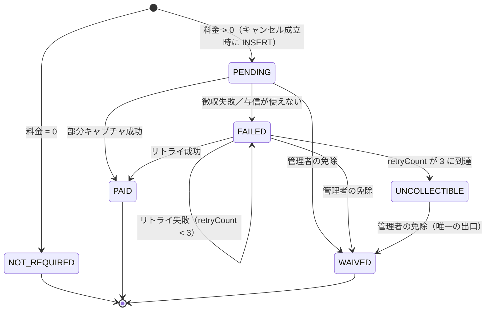

# F03.4 募集キャンセル料の徴収（申込時与信からの部分キャプチャ）

> **ステータス**: 🟡 設計完了・実装未着手（マスター御裁可済 2026-08-13／`/試練`→`/出陣` 待ち）
> **最終更新**: 2026-08-13
> **関連**: [F03.11 募集型予約](F03.11_recruitment_listing.md)（キャンセル料の**算出・記録**の主管。本書はその**徴収**を担う）／ [F22.1 統一決済プラットフォーム](F22.1_market/payment/README.md)（本書が乗る Connect destination charge レール）／ [F20.1 課金・エンタイトルメント基盤](F20.1_entitlement_billing/README.md)（**別系統**・§1.3 で混同禁止を定義）

---

## 0. この設計書が存在する理由

[F03.11](F03.11_recruitment_listing.md) Phase 5a の実装計画に「既存決済システム（F03.4）との連携 — 決済 API 仕様書を別途作成」と書かれたまま、その「別途作成」が行われなかった。結果、origin/main の現状は次のとおりである（すべて実測）。

| 現状（実測） | 根拠 |
|---|---|
| キャンセル料は**算出される** | `RecruitmentCancellationPolicyService.calculateFee`（`backend/src/main/java/com/mannschaft/app/recruitment/service/RecruitmentCancellationPolicyService.java:165-223`） |
| キャンセル料は**記録される**（`payment_status='PENDING'`） | `RecruitmentParticipantService.java:285-299` |
| **徴収する経路が存在しない** | `RecruitmentPaymentRetryBatch.processRetry`（`.../service/RecruitmentPaymentRetryBatch.java:108-130`）は `// TODO: F03.4 決済APIとの統合実装` のスタブで、リトライ回数を増やして常に `false` を返すのみ。Stripe 呼び出しは 1 行も無い |
| **免除する経路も存在しない** | `RecruitmentCancellationRecordEntity.waive`（`.../entity/RecruitmentCancellationRecordEntity.java:108-111`）は定義のみで、main・frontend を通じて呼び出し元ゼロ |

本書はこの穴を埋める。**本書のスコープは「徴収」と「救済」であり、キャンセル料の算出規則（§5.9）・ポリシー編集 UI は F03.11 の主管のまま変更しない。**

> **書名の `F03.4` について（注意）**: この番号は F03.11 の記述「既存決済システム（F03.4）」が指した宛先をそのまま踏襲したものである。ただし **F03.4 は本来「予約」機能の番号**であり（[`F03.4_reservation.md`](F03.4_reservation.md) が既存。F03.11 内の「予約ライン (F03.4)」はこちらを指す）、**F03.11 側の「既存決済システム（F03.4）」という参照は誤記である**。実在の決済基盤は F22.1（Connect レール）と F08.9（会費）である。本書はファイル名の互換のため `F03.4_cancellation_fee_payment.md` を名乗るが、扱うのは**募集キャンセル料の決済**のみであり、予約機能とは無関係である。将来の採番整理で改名する余地を残す。

---

## 1. 位置づけと責務範囲

### 1.1 本書の責務（in）

- [ ] キャンセル成立 → キャンセル料の**徴収**（申込時に立てた与信からの部分キャプチャ）
- [ ] 徴収失敗時の**リトライ**（既存 `RecruitmentPaymentRetryBatch` のスタブを実決済に置き換える）
- [ ] リトライ打ち切りを表す**終端状態**の新設（§5）
- [ ] 管理者による**免除（waive）API**（§10）
- [ ] 構造的に徴収できないケースの**明示と逃がし先**（§6）
- [ ] キャンセル時に宙に浮く与信の**始末**（§2.3・現状の欠落を含む）

### 1.2 本書の責務外（out）

- [ ] キャンセル料の算出規則・ティア・境界値 → **F03.11 §5.9**（本書は既存挙動を固定するだけで変えない）
- [ ] ポリシー編集 UI・キャンセル前確認モーダル → F03.11 Phase 5a（実装済）
- [ ] NO_SHOW ペナルティ → F03.11 Phase 5b（**キャンセル料とは別概念**。§8）
- [ ] 参加費そのものの与信・払出 → **F22.1**（本書はそのレールに相乗りする側）
- [ ] 保存カードへの別途請求・請求書発行・督促 → **作らない**（§6.3・マスター裁可）

### 1.3 隣接機能との関係（混同禁止）

| | F20.1 課金 | F22.1 参加費（謝礼） | **本書 F03.4 キャンセル料** |
|---|---|---|---|
| 誰が誰に払うか | 団体/個人 → **運営（自社受取）** | 応募者 → **主催者** | 応募者 → **主催者** |
| Stripe の型 | **素の Checkout**（Connect 不使用） | **Connect destination charge** | **同左の与信を部分キャプチャ** |
| 運営の取り分 | 売上そのもの | `application_fee` のみ | **`application_fee` のみ**（参加費と同じ） |
| capture 方式 | `SUBSCRIPTION`（自動） | `CaptureMethod.MANUAL` の与信 → 最終認証で capture | **同じ与信を部分額で capture** |

- **F20.1 とは別系統である。** F20.1 は自社受取ゆえ Connect を使わない（[F20.1 §4.3](F20.1_entitlement_billing/README.md)）。本書は受取先が主催者ゆえ Connect destination charge であり、**テーブル・サービス・用語を混ぜない**。`billing_contracts` / `BillingPaymentGateway` を本書の実装から参照してはならない。
- **F22.1 とは同じレールを共有する。** キャンセル料は「参加費の与信の一部を、参加費の代わりに確定させたもの」であり、**新しい決済経路を一切作らない**（マスター裁可）。受取先・手数料の考え方は参加費と完全に同じ。

---

## 2. 前提となる既存機構の棚卸し（すべて origin/main 実測）

### 2.1 参加費の与信と払出

```
RecruitmentParticipantService.apply()             …申込。確定かつ payment_enabled かつ price 非 null
  └ :205 RecruitmentParticipantConfirmedEvent 発火（個人申込のみ・:203 の条件）
       └ RecruitmentChargeAuthorizationListener:70-72
            @TransactionalEventListener(AFTER_COMMIT) + @Async("event-pool")
            └ :102 第三陣-b 判定（成立〜役務日 > ESCROW_MAX_HOLD_DAYS=7 日 → deferred）
            └ :128 ConnectChargeService.authorize(cmd)
                 ├ deferred=true  → PI を作らず EscrowStatus.DEFERRED で起票（ConnectChargeService.java:149）
                 ├ payee 未 onboarding → PI を作らず HELD（同 :194-202）
                 └ それ以外 → StripePaymentProvider.createDestinationPaymentIntent(..., CaptureMethod.MANUAL, "escrow-{listingId}-{participantId}")
                                → EscrowStatus.PENDING_CONFIRMATION で起票（同 :206-221）
                                → 札主が Stripe.js で confirm し amount_capturable_updated webhook 到達で AUTHORIZED へ昇格
```

払出は最終認証（札 FULL→COMPLETED）で起きる: `MarketChargeCaptureListener.onListingFinalized`（`.../payment/escrow/MarketChargeCaptureListener.java:64-95`）が `AUTHORIZED` を `ConnectChargeService.capture(escrowId)` で確定、`DEFERRED` は `chargeDeferred` で即時払いへ回す。

### 2.2 与信レコードの引き当てキー

- Entity: `EscrowTransactionEntity`（テーブル `escrow_transactions`）
- 一意キー: **三つ組 `(sourceKind=RECRUITMENT, sourceId=listingId, sourceParticipantId=participantId)`**
- 既存メソッド: `EscrowTransactionRepository.findBySourceKindAndSourceIdAndSourceParticipantId(...)`（`ConnectChargeService.java:106` が与信の冪等判定に使用）

**キャンセル記録は `participantId` と `listingId` を保持している**（`RecruitmentCancellationRecordEntity.java:42,44`）ため、この既存メソッドだけで対応する与信を引ける。**新しい引き当て用の列・テーブルは不要**。

### 2.3 `EscrowStatus` と「キャプチャできるか」の対応

| status | PI の有無 | カード上のホールド | 部分キャプチャの可否 |
|---|---|---|---|
| `PENDING_CONFIRMATION` | 有（未 confirm） | **無い** | **不可**（`ConnectChargeService.capture` も `AUTHORIZATION_NOT_CONFIRMED`(409) で拒否・`:687-690`） |
| `DEFERRED` | **無** | 無い | **不可** |
| `HELD` | **無** | 無い | **不可** |
| `AUTHORIZED` | 有 | **有** | **可**（本書の徴収経路） |
| `CAPTURED` | 有 | 確定済 | 不可（既に参加費を全額徴収済・§6.2） |
| `CANCELLED` / `REFUNDED` 等 | — | 無い | 不可 |

（enum 定義: `.../payment/escrow/EscrowStatus.java:16-54`）

### 2.4 現状の欠落 — キャンセルしても与信が始末されない

`RecruitmentParticipantService.cancelMyApplication`（`:234-320`）は**イベントを一切発火せず、escrow に触れない**。したがってキャンセル済み応募の与信は `AUTHORIZED` のまま残り、`MarketChargeCaptureListener` は listing 単位で `AUTHORIZED` を拾う（`:71-81`）ため、**キャンセルした応募者から参加費が全額確定されうる**。

本書の徴収フロー（§3）は、キャンセル時に必ず「部分キャプチャ（＝残額の自動解放）」または「与信取消」のいずれかで与信を終端させるため、**この欠落も同時に塞ぐ**。単独の対症修正は行わない。

---

## 3. 徴収フロー

### 3.1 設計原則

1. **外部 HTTP を `@Transactional` の中に入れない。** 前例: `BillingCheckoutService`（`backend/src/main/java/com/mannschaft/app/billing/BillingCheckoutService.java:13-15` の Javadoc と `:43-64` の実装）が「tx 内で起票 → tx 外で Stripe → 失敗時は補償」の型を確立している。本書もこれに倣う。
2. **キャンセル自体は決済失敗でロールバックしない。** キャンセルは利用者の意思表示であり、主催者側の枠復帰・キャンセル待ち昇格が既に走っている。決済の失敗で巻き戻すと整合が壊れる。失敗は `FAILED` として正直に記録する（症状を隠さない）。
3. **クロスドメイン直接呼び出しをしない。** recruitment → payment はイベント、payment → recruitment もイベントで返す。前例: `RecruitmentParticipantConfirmedEvent` / `ChargeAuthorizationFailedEvent`。

### 3.2 シーケンス（キャンセル成立 → `PAID`）

| # | 実行主体（新設/既存） | 責務 | tx |
|---|---|---|---|
| 1 | `RecruitmentParticipantService.cancelMyApplication`（既存・改修） | 料金算出・参加者 CANCELLED・履歴・**キャンセル記録 INSERT**（`fee>0`→`PENDING`／`=0`→`NOT_REQUIRED`）・枠復帰。末尾で **`RecruitmentCancellationFeeChargeRequestedEvent` を発火**（`fee>0` かつ個人申込のときのみ） | TX-A 内 |
| 2 | `RecruitmentCancellationFeeChargeListener`（**新設**・`payment.escrow` 配置） | `@TransactionalEventListener(AFTER_COMMIT)` + `@Async("event-pool")` で受ける。TX-A のコミット後にのみ動く | tx 外 |
| 3 | 同上 | 三つ組で escrow を引き当て（`findBySourceKindAndSourceIdAndSourceParticipantId`）。`AUTHORIZED` 以外は徴収不可 → §6 の分岐へ | — |
| 4 | `ConnectChargeService.capturePartialForCancellationFee(escrowId, feeMinor, idempotencyKey)`（**新設**・`REQUIRES_NEW`） | 行ロック（`findByIdForUpdate`）→ 状態再検査 → **外部呼び出しは 1 回だけ**。DB 更新（escrow を `CAPTURED`・`captured_at`・複式記帳 `ledger_entries`）は既存 `capture(UUID)`（`ConnectChargeService.java:673-724`）と同型 | TX-B |
| 5 | `StripePaymentProvider.captureManualPaymentIntent(piId, amountToCaptureMinor, idempotencyKey)`（**新設オーバーロード**） | `PaymentIntentCaptureParams.builder().setAmountToCapture(...)` で部分額確定（§4） | — |
| 6 | `RecruitmentCancellationFeeChargeListener` | 成否に応じ `RecruitmentCancellationFeeChargedEvent` / `...FailedEvent` を発火 | — |
| 7 | `RecruitmentCancellationFeeResultListener`（**新設**・`recruitment` 配置） | 記録を `markPaid(paymentId)` または `markFailed()` へ。`@Transactional`（自ドメイン内・短命） | TX-C |

- **ステップ 4 の外部呼び出しは `@Transactional` の中にある。** これは §3.1-1 に反するように見えるが、既存 `ConnectChargeService.capture`（`:673-724`）が**まさに同じ構造**であり、行ロック下で「Stripe 確定 → 台帳追記」を一体にすることで台帳欠落を防いでいる。本書はこの既存の型を踏襲する（新旧で流儀を割らない）。ステップ 1〜2 の境界（キャンセル TX-A と決済を分ける）で §3.1-1 の本質＝「業務トランザクションを外部 API の所要時間・失敗に巻き込まない」は達成されている。
- ステップ 5 が例外を投げた場合、TX-B はロールバックする（escrow は `AUTHORIZED` のまま）。**キャンセル（TX-A）は AFTER_COMMIT ゆえ巻き戻らない。**

### 3.3 `payment_id` に何を入れるか

`markPaid(paymentId)` の引数には **Stripe PaymentIntent ID（`pi_...`）** を入れる。理由: 紛争対応時に Stripe ダッシュボードから直接引ける唯一の識別子であり、`escrow_transactions.stripe_payment_intent_id` とも突き合わせられる。列は `VARCHAR(100)` で十分（`V3.127__create_recruitment_cancellation_records.sql`）。

### 3.4 イベントの積荷（payload）

クロスドメインのイベントは **ID と素の値のみ**を運ぶ（Entity を載せない・既存 `RecruitmentParticipantConfirmedEvent` と同じ流儀）。

| イベント | フィールド |
|---|---|
| `RecruitmentCancellationFeeChargeRequestedEvent`（recruitment → payment） | `cancellationRecordId`（冪等キーの素）／`listingId`／`participantId`（escrow 引き当ての三つ組）／`payerUserId`／`feeAmount`（円・minor 単位換算は payment 側の責務） |
| `RecruitmentCancellationFeeChargedEvent`（payment → recruitment） | `cancellationRecordId`／`stripePaymentIntentId` |
| `RecruitmentCancellationFeeChargeFailedEvent`（payment → recruitment） | `cancellationRecordId`／`reason`（ログ・運用向けの文字列。利用者には出さない） |

### 3.5 エラーコード

| 用途 | コード | HTTP |
|---|---|---|
| 免除対象が `PAID`（免除ではなく返金の話） | `RecruitmentErrorCode` に**新設** `CANCELLATION_FEE_ALREADY_PAID` | 409 |
| 免除対象の記録が存在しない／論理削除済 | 既存の NOT_FOUND 系に合わせる | 404 |
| 徴収失敗（内部・利用者には返さない） | 既存 `ConnectPaymentErrorCode.CAPTURE_FAILED`（`StripePaymentProviderImpl.java:760`）をそのまま流用 | — |

徴収は**非同期（AFTER_COMMIT + `@Async`）で走るため、利用者のキャンセル要求に対する HTTP レスポンスには決済の成否が乗らない**。キャンセル API は従来どおり参加者情報を返し、決済結果は記録の `paymentStatus` として後から反映される。この非同期性は FE の表示（「キャンセル料のお支払い状況」）の前提になる。

---

## 4. 部分キャプチャの扱い（Stripe 仕様の裏取り）

### 4.1 Stripe 公式ドキュメントで確認した事実

出典: [Place a hold on a payment method](https://docs.stripe.com/payments/place-a-hold-on-a-payment-method)（2026-08-13 確認）

1. **部分キャプチャの残額は自動的に解放される。** 「当初の金額より少ない…金額をキャプチャーするには `amount_to_capture` オプションを渡します。**部分的なキャプチャーを行った場合、残額は自動的にリリースされます**」。→ 明示的な取消 API を別途呼ぶ必要は**ない**。
2. **部分キャプチャ後に差額を追加キャプチャすることはできない。** 「決済の一部をキャプチャーした場合、差額分に対して別途キャプチャーを行うことはできません」（マルチキャプチャ対象の一部カードを除く）。→ **キャプチャは 1 回で決め切る**。段階徴収の設計は採れない。
3. **キャプチャできる上限は与信額である。** API リファレンス（[Capture a PaymentIntent](https://docs.stripe.com/api/payment_intents/capture)）は `amount_to_capture` を「**元の金額以下でなければならない**（省略時は `amount_capturable` の全額）」と定義する。与信額超のキャプチャ（overcapture）は別途オプトインが必要な機能であり、本書では**使わない**。→ §6.1 の「料金 > 与信額」問題に直結する。
   なお同 API は `final_capture`（既定 `true`）を持ち、`false` にすると残額を解放せず保持する（マルチキャプチャ対応時のみ）。本書は**既定の `true` のまま**とし、残額は解放させる。
4. **未キャプチャの与信は期限切れで解放され、PaymentIntent は `canceled` になる。** 有効期間はカード非提示・顧客起動取引で **Visa/Mastercard/Amex/Discover ともに 7 日**（Visa の加盟店起動取引は 5 日）。
5. **日本拠点アカウントの JPY 建て取引は最長 30 日**保留できる（Visa/Mastercard/JCB/Diners/Discover。**Amex と JPY 以外は標準の 7 日**）。→ §6.3 で扱う。

### 4.2 既存実装の状態と必要な変更

現在の `StripePaymentProviderImpl.captureManualPaymentIntent`（`backend/src/main/java/com/mannschaft/app/payment/stripe/StripePaymentProviderImpl.java:748-762`）は

```java
PaymentIntent captured = intent.capture(PaymentIntentCaptureParams.builder().build(), options);
```

と**空パラメータ**で呼んでおり、金額引数はシグネチャ（`StripePaymentProvider.java:263`）にも存在しない＝**常に全額キャプチャ**である。よって部分額指定には interface と impl の双方にオーバーロードを追加する必要がある。

```java
// StripePaymentProvider（新設オーバーロード）
PaymentIntentInfo captureManualPaymentIntent(String paymentIntentId, long amountToCaptureMinor, String idempotencyKey);
```

既存の 2 引数版は**シグネチャを変えずに残す**（`ConnectChargeService.capture:703` の呼び出し元を壊さない）。

### 4.3 application_fee の扱い【要裁可 R-2】

destination charge の `application_fee_amount` は **PaymentIntent 作成時**に確定している（`StripePaymentProviderImpl.java:643`）。参加費（例 5,000 円）に対して算出された手数料が、キャンセル料（例 1,500 円）だけを確定するときにそのまま適用されると、主催者の手取りが不当に痩せる。

Stripe の Capture API は **`application_fee_amount` を明示的に受け付ける**（[API リファレンス](https://docs.stripe.com/api/payment_intents/capture)。「アプリケーション手数料として徴収される額は**キャプチャした合計額を上限に丸められる**」と定義）。したがって capture 時に手数料を渡し直すことは仕様上可能であり、**キャプチャ額に対して手数料を再計算して上書きする**のが妥当と考える。

ただし手数料率の正本は F22.1 の `PaymentFeeCalculator`／FeePolicy であり、キャンセル料に対して参加費と同じ料率を当てるべきかは料金ポリシーの決定事項である。**§13 R-2 として上申する。** なお上書きを実装しない場合でも、Stripe 側がキャプチャ額を上限に丸めるため主催者の手取りが負になることはない（手数料がキャプチャ額の全部を食い、主催者の手取りが 0 になることはありうる）。

---

## 5. 状態遷移と終端状態の新設

### 5.1 新設する終端状態

`CancellationPaymentStatus`（`backend/src/main/java/com/mannschaft/app/recruitment/CancellationPaymentStatus.java`）に **`UNCOLLECTIBLE`（回収不能）** を追加する。

- **語感**: 既存値は `NOT_REQUIRED` / `PENDING` / `PAID` / `WAIVED` / `FAILED` と、いずれも「その料金がどうなったか」を形容詞・過去分詞で述べる形である。`UNCOLLECTIBLE` はこれに揃う。「試行が尽きた」ではなく「回収できない」という**結果**を述べている点も既存と同じ語法である。
- **列長**: `payment_status VARCHAR(20)`（`V3.127`）に対し 13 文字。既存 DDL のまま収まり、Flyway での列拡張は不要。

### 5.2 遷移図



### 5.3 各状態の意味と申込ブロックへの効き方

| 状態 | 意味 | 新規申込ブロック（`RecruitmentParticipantService.java:129-134`） |
|---|---|---|
| `NOT_REQUIRED` | 料金 0。徴収対象外 | しない |
| `PENDING` | 料金 > 0・徴収未了 | **する**（現状どおり） |
| `PAID` | 徴収済 | しない |
| `FAILED` | 徴収失敗・リトライ対象 | **する**（現状どおり） |
| **`UNCOLLECTIBLE`** | リトライ打ち切り。**未払いであることに変わりはない** | **する（新規に追加）** |
| `WAIVED` | 管理者が免除した | しない |

`UNCOLLECTIBLE` を申込ブロックの対象に加えるため、`:130-131` の判定は `List.of(PENDING, FAILED, UNCOLLECTIBLE)` へ拡張する。**`UNCOLLECTIBLE` からの出口は管理者の免除（`WAIVED`）のみ**とし、自動での解除経路は設けない。

### 5.4 リトライ対象条件と `UNCOLLECTIBLE` の関係

現在のリトライ対象は `paymentStatus = FAILED AND paymentRetryCount < 3`（`RecruitmentCancellationRecordRepository.findFailedForRetryAfterId`）である。**この条件式は変えない。** `retryCount` が 3 に達した行は状態を `UNCOLLECTIBLE` へ遷移させることで、`paymentStatus = FAILED` の条件からも外れる。

これにより、現状の「上限に達した `FAILED` 行がクエリの網からは外れるが、状態としては `FAILED` のまま永久に残り、拾われることも解決されることもない」という宙吊りが解消される。**打ち切りは状態として可視になる。**

### 5.5 リトライバッチの改修

`RecruitmentPaymentRetryBatch`（`.../service/RecruitmentPaymentRetryBatch.java`）について:

- **維持するもの**: キーセットページング（`id > cursor`・`:64-90`）、`@SchedulerLock`（`:57-61`）、`CHUNK_SIZE=50`、`MAX_PAGES=200` の安全弁。**OFFSET ページングへ戻してはならない**（母集合が縮む絞り込みでの読み飛ばし。理由はクラス Javadoc に明記済）。
- **是正するもの**: `processRetry` は `@Transactional` が付いているが、同一クラス内の `run()` から自己呼び出しされている（`:79`）ため **Spring プロキシを経由せず、トランザクション注釈が実際には効いていない**。1 件の失敗が他件を巻き込まないためには、1 件分の処理を**別 Bean**（例 `RecruitmentCancellationFeeRetryProcessor`）へ切り出し `@Transactional(propagation = REQUIRES_NEW)` を効かせる必要がある。自己呼び出しのままでは伝播設定は効かない。
- **実装するもの**: スタブ（`:114-125`）を、§3.2 ステップ 3〜7 と**同じ経路**（同じ引き当て・同じ冪等キー・同じ状態遷移）の呼び出しに置き換える。初回徴収とリトライで別ロジックを持たない。
- **N+1 の禁止**: 1 チャンク 50 件に対し、escrow の引き当てはチャンク単位の一括取得（`participantId` の IN 句）とし、レコード 1 件ごとに個別クエリを撃たない。

---

## 6. 構造的に徴収できないケース（仕様として受け入れる取りこぼし）

**マスター裁可により、これらに対して別途請求の経路（保存カードへの再課金・請求書発行・督促）は作らない。** すべて `FAILED` を経て `UNCOLLECTIBLE` へ落とし、**管理者の免除だけが解除手段**という整理にする。

### 6.1 キャンセル料が与信額を超える

キャンセル料は **必ずしも参加費（`price`）以下ではない**。

- `PERCENTAGE` は DB CHECK 制約で `1..100` に制限されている（`V3.126__create_recruitment_cancellation_policy_tiers.sql:19-21`）ため、`Math.ceil(price * value / 100.0)` は `price` を超えない。
- **`FIXED` は `fee_value > 0` のみで上限が無い**（同 CHECK）。`calculateFee` も `price` との突き合わせをしていない（`RecruitmentCancellationPolicyService.java:211-212`）。したがって「参加費 3,000 円・固定キャンセル料 5,000 円」というポリシーが現在の実装では作れる。

Stripe は与信額超のキャプチャを標準では受け付けない（§4.1-3）。よって徴収は `min(feeAmount, 与信額)` が上限となる。**差額は構造的に取れない。** 扱いは §13 R-1 として上申する（推奨は「ポリシー保存時に `FIXED` を `price` 以下へ制限し、この状態自体を作らせない」）。

### 6.2 最終認証が済んでいて与信が既に確定済（`CAPTURED`）

参加費の払出は「札 FULL→COMPLETED」の最終認証で起きる（`MarketChargeCaptureListener.java:64-95`）。これは**開催日より前に起こりうる**。最終認証後にキャンセルすると、対応する escrow は既に `CAPTURED` であり、そこから部分キャプチャすることはできない（§4.1-2）。

このとき参加費は**全額**が主催者へ渡っている。応募者から見れば「キャンセル料以上を払っている」状態であり、徴収の問題ではなく**返金の問題**に変わる。本書の裁可済み方針（部分キャプチャ）はこのケースを扱えない。**§13 R-3 として上申する。**

### 6.3 与信がそもそも存在しない／有効でない

| ケース | escrow status | 発生条件 |
|---|---|---|
| 長期先の開催 | `DEFERRED` | 成立〜役務日が **7 日超**。`RecruitmentChargeAuthorizationListener:59,102` が与信を立てず `DEFERRED` で起票する（第三陣-b） |
| 主催者の Connect 未登録 | `HELD` | `payouts_enabled=false`（`ConnectChargeService.java:194-202`）。PI 自体が作られない |
| 応募者が Stripe.js で confirm していない | `PENDING_CONFIRMATION` | カード上のホールドが立っていない（`EscrowStatus.java:17-24`） |
| 与信の期限切れ | `CANCELLED` 等 | §4.1-4/5 の有効期間を過ぎた場合 |
| 与信レコード自体が無い | — | 謝礼無効の札・チーム申込（§8）・与信処理が失敗していた場合 |

**「開催日が申込の 7 日超先だと、キャンセル時に与信が生きておらず徴収できない」という構造は実在する。** ただしその形は「与信が失効している」ではなく **「そもそも与信を立てていない（`DEFERRED`）」** である。既存実装が Stripe の 7 日失効を見越して先回りしているためで、結果として**徴収できない点は同じ**である。

> **注記（30 日与信の可能性・未検証）**: Stripe の日本拠点アカウントは JPY 建てで最長 30 日の与信保留が可能である（§4.1-5・Amex と JPY 以外は 7 日のまま）。`ESCROW_MAX_HOLD_DAYS=7` を引き上げれば `DEFERRED` に落ちる札が減り、本節の取りこぼしは縮む。ただし**本アカウントで 30 日枠が実際に適用されるかは未確認**であり、閾値は F22.1 第三陣-b のマスター裁可事項でもある。本書ではこの変更を提案するに留め、`ESCROW_MAX_HOLD_DAYS` は現行の 7 のまま設計する。

いずれのケースも記録は `FAILED` とし、リトライ 3 回で `UNCOLLECTIBLE` へ落ちる。**500 を返してはならない**（AC-11・AC-12）。与信が無いことは異常ではなく想定内の状態である。

### 6.4 与信の始末（§2.3 の欠落への対応）

キャンセル時、escrow は必ずいずれかで終端させる。

| キャンセル料 | escrow が `AUTHORIZED` | それ以外 |
|---|---|---|
| `> 0` | **部分キャプチャ**（残額は Stripe が自動解放・§4.1-1） | 記録を `FAILED` へ。escrow は既存のライフサイクル（`EscrowLifecycleService`・失効バッチ）に委ねる |
| `= 0` | **与信取消**（`ConnectChargeService.refund` の capture 前経路＝`cancelAuthorization`・`ConnectChargeService.java:899-902`） | 何もしない |

これにより、キャンセル済み応募の escrow が `AUTHORIZED` のまま残って最終認証で全額確定される経路（§2.3）が塞がれる。

---

## 7. 冪等性 — 二重課金を構造的に防ぐ

多層で防ぐ。**どの 1 層が抜けても二重課金が起きない**ことを設計目標とする。

### 7.1 第 1 層: Stripe の Idempotency-Key（決定論的キー）

既存の命名規約は `{操作名}-{対象ID}[-{連番}]`（`escrow-{listingId}-{participantId}` / `capture-{escrowId}` / `cancel-{escrowId}` / `billing-cancel-{ref}`（`backend/src/main/java/com/mannschaft/app/billing/StripeBillingPaymentGateway.java:55,63`））。これに揃え、

```
canfee-{cancellationRecordId}
```

を用いる。**キャンセル記録 ID から決定論的に導出される**ため、初回徴収・リトライ 1 回目・リトライ 3 回目のいずれから呼んでも同一キーになる。Stripe は同一キーの再送に対して**最初の結果を返すのみで再課金しない**。これが AC-16・AC-17 の主防御である。

- キーに `retryCount` や時刻を混ぜてはならない。混ぜた瞬間にこの層は無効化される。
- `RequestOptions` の組み立ては既存と同一（`RequestOptions.builder().setIdempotencyKey(key).build()`・`StripePaymentProviderImpl.java:752`）。

### 7.2 第 2 層: 行ロック下での状態再検査

`ConnectChargeService.capturePartialForCancellationFee` は既存 `capture` と同じく `findByIdForUpdate`（PESSIMISTIC_WRITE）で escrow を取り、`CAPTURED` なら **no-op で返す**（既存 `capture` の `:679` と同じ流儀）。同様に、キャンセル記録側も `PAID`/`WAIVED` なら徴収を起動しない。

### 7.3 第 3 層: `payment_id` への UNIQUE 制約

`V3.127__create_recruitment_cancellation_records.sql` に `payment_id` の UNIQUE は無い（インデックスすら無い）。**追加する。**

```sql
ALTER TABLE recruitment_cancellation_records
    ADD CONSTRAINT uk_rcr_payment_id UNIQUE (payment_id);
```

- **成立性**: 1 応募につき escrow は 1 件（三つ組で一意）、1 escrow につき PaymentIntent は 1 件。同一 PI が 2 つのキャンセル記録に書かれることは正常系では起こりえない。同一ユーザーが同じ札へ再申込して再びキャンセルした場合は、別の `participantId` → 別 escrow → 別 PI となるため衝突しない。
- **NULL**: MySQL の UNIQUE は NULL を重複とみなさないため、`NOT_REQUIRED`/`PENDING`/`FAILED` の行（`payment_id IS NULL`）は何行でも共存できる。
- **位置づけ**: これは主防御ではなく**最後の物理的な番人**である。上位 2 層が破れて同じ PI を 2 行に書こうとしたとき、DB が拒否して検知可能にする。Flyway 採番は実装時に `date -u '+%Y%m%d%H%M%S'` で採る（`backend/.claudecode.md` §18）。

### 7.4 AC-17（キャプチャ成功後の DB 更新失敗）が守られる筋道

TX-B がロールバックすると escrow は `AUTHORIZED` のまま、記録は `PENDING`/`FAILED` のまま残る。しかし Stripe 側では既にキャプチャ済みである。リトライバッチが同じ `canfee-{recordId}` で再送すると、第 1 層により Stripe は**再課金せず最初のキャプチャ結果を返す**。その結果で記録を `PAID` にすれば、二重課金なく整合が回復する。**そのために「失敗時はキーを変える」ことをしてはならない。**

---

## 8. チーム申込の扱い

`RecruitmentParticipantService.apply()` の与信発火条件は

```java
if (!isWaitlisted && Boolean.TRUE.equals(listing.getPaymentEnabled())
        && listing.getPrice() != null && isUserApplication) {   // ← :204
```

であり、**`isUserApplication`（個人申込）が条件に入っている**（`:203-204`）。したがって**チーム申込には与信が存在しない**。

一方、キャンセル記録を作る経路も `cancelMyApplication`（個人キャンセル）のみである（§9）。よって**現状は矛盾しない**——チーム申込にはキャンセル料記録も作られず、徴収の必要も生じない。

本書はこれを**前提として明記**し、チーム申込への課金は設計しない。将来チーム申込を有償化する場合、与信（F22.1 側）とキャンセル料徴収（本書）の**両方**を同時に設計しなければならない。片方だけの追加は「記録はされるが徴収できない」という本書が塞いだ穴を再び開けることになる。

---

## 9. キャンセル経路ごとの記録作成（コードで確定させた事実）

`RecruitmentCancellationRecordEntity` の**新規作成は main 全体で 1 箇所のみ**である（`RecruitmentParticipantService.java:285`）。

| キャンセル経路 | 記録を作るか | `cancelSource` | 根拠 |
|---|---|---|---|
| 本人キャンセル `cancelMyApplication` | **作る** | `USER` | `RecruitmentParticipantService.java:285,292` |
| 主催者/管理者の募集枠キャンセル `RecruitmentListingService.cancelByAdmin` | **作らない** | — | `.../service/RecruitmentListingService.java:578-593`。札の状態更新と保存のみで、`calculateFee` も参加者の状態更新も呼ばない |
| 自動キャンセルバッチ `RecruitmentAutoCancelBatch` | **作らない** | — | `.../service/RecruitmentAutoCancelBatch.java:181-193`。参加者を `cancelBySystem()` にして履歴を残すのみ。`CancellationPolicyService` の import 自体が無い |
| NO_SHOW（`RecruitmentNoShowService` / `...DetectBatch` / `...ConfirmBatch`） | **作らない** | — | いずれのファイルにも `RecruitmentCancellationRecord` の参照が無い。扱うのは `RecruitmentNoShowRecordEntity` とペナルティのみ |

**`CancellationSource` の 4 値のうち、main で実際に使われているのは `USER` のみ**である。`ADMIN` / `SYSTEM_AUTO_CANCEL` / `SYSTEM_NO_SHOW` は enum に定義されているだけで、main 側に代入箇所が存在しない。

### 9.1 仕様としての確定

**主催者都合のキャンセルは無料とする。** 主催者が札を取り下げた／最少催行人数に届かず自動キャンセルになった場合、応募者に落ち度は無く、応募者からキャンセル料を取る根拠が無い。記録を作らない現状の挙動は**この仕様と一致している**。

### 9.2 意図的な設計か、漏れか

**「主催者都合は無料」という結論自体は意図的な設計と判断する。** 根拠は、`CancellationSource` に 4 値が用意されている一方で `calculateFee` は**キャンセル主体を引数に取らない**（`calculateFee(listing, cancelAt)`・`:165`）ことである。主体別に料率を変える設計であれば引数に現れるはずで、現れていないのは「本人キャンセルにしか料金が発生しない」前提で組まれた形跡である。

**ただし enum の未使用 3 値は漏れである。** 使われる予定で定義され、結線されないまま残った死に値であり、「`ADMIN` のキャンセルにも記録が作られるのではないか」という誤読を招く。同様に `RecruitmentParticipantEntity.cancelByAdmin(Long)`（`:129`）も main に呼び出し元が無く、参加者単位の管理者キャンセルは未接続である。

**本書の判断**: 未使用 3 値の撤去・`cancelByAdmin` の結線は、いずれも**本書のスコープ外**とする（徴収の穴を塞ぐことと独立で、参加者単位の管理者キャンセルという機能追加を伴うため）。§13 R-4 として別戦役に切り出すことを上申する。

---

## 10. 免除（waive）API

### 10.1 エンドポイント

```
POST /api/v1/system-admin/recruitment-cancellation-records/{recordId}/waive
```

| 項目 | 内容 |
|---|---|
| 認可 | **`SYSTEM_ADMIN` のみ**。それ以外のロールは 403 |
| リクエスト | `{ "reason": "..." }`。`reason` は **必須**（`@NotBlank`・最大 500 文字＝`notes VARCHAR(500)` に収まる長さ） |
| 対象状態 | `PENDING` / `FAILED` / `UNCOLLECTIBLE` のいずれか。`PAID` への免除は 409（既に徴収済のものは免除でなく返金の話であり、混同させない）。`WAIVED` への再免除は **no-op で 200**（冪等） |
| 効果 | `paymentStatus = WAIVED`・`notes` に理由を保存。これにより未払いブロック（`:129-134`）が解除される |
| 監査 | 必須（§10.3） |

### 10.2 認可の実装方針

- 新規エンドポイントゆえ、**ArchUnit の認可番人と `addFilters=false` の契約 IT の双方に対応させる**（`@WithMockUser` 必須）。既存の `/api/v1/system-admin/**` 配下と同じ扱いに揃える。
- `recordId` は全域で一意な BIGINT である。`SYSTEM_ADMIN` は全テナントに跨る権限であるため、テナントによる絞り込みは行わない。**逆に言えば、`SYSTEM_ADMIN` 以外がこの API に到達できないことがすべての防御線である。**
- 存在しない `recordId`・論理削除済み（`deleted_at IS NOT NULL`。Entity に `@SQLRestriction("deleted_at IS NULL")`）の場合は 404。

### 10.3 監査ログ

`AuditEventType`（`backend/src/main/java/com/mannschaft/app/auth/AuditEventType.java`）に **募集ドメインの値は現状 1 つも無い**。新設する。

```java
/** F03.4 SYSTEM_ADMIN が募集キャンセル料を免除した。 */
RECRUITMENT_CANCELLATION_FEE_WAIVED(AuditEventCategory.ADMIN_ACTION),
```

記録する内容: 操作者 ID・`recordId`・対象ユーザー ID・`feeAmount`・免除理由・免除前の `paymentStatus`。**免除は金銭債権を消す操作であり、誰がいつなぜ消したかを後から追えないまま実行させてはならない。**

### 10.4 Entity 側の是正

`RecruitmentCancellationRecordEntity.waive(Long adminUserId, String notes)`（`:108-111`）は `adminUserId` を受け取りながら本体で使っていない。監査ログを Service 層で残す設計とするため、引数として受けたまま使わない状態は誤解を招く。**シグネチャは維持し、Javadoc に「操作者の記録は監査ログ側の責務である」旨を明記する**（引数の削除は呼び出し側の情報を落とすため行わない）。

---

## 11. 受け入れ条件（AC）

> `/試練` はこの表から red テストを起こす。番号は本設計内で恒久。

| # | 区分 | 条件 |
|---|---|---|
| AC-1 | 正常 | 料金>0のキャンセルで与信から同額を確定し `PAID`＋`payment_id` 記録 |
| AC-2 | 正常 | 部分キャプチャ後、与信の残額が解放される |
| AC-3 | 境界 | 料金=0 では決済を呼ばず `NOT_REQUIRED` のまま |
| AC-4 | 異常 | 決済は @Transactional の外。Stripe 失敗でキャンセルはロールバックされず `FAILED` |
| AC-5 | 正常 | リトライバッチが実際に決済APIを呼ぶ（スタブでない） |
| AC-6 | 正常 | リトライ成功で `PAID` へ遷移 |
| AC-7 | 境界 | 上限3回到達で終端状態へ遷移し、以後拾われない |
| AC-8 | 異常 | リトライ1件の失敗が他件のコミットを巻き戻さない |
| AC-9 | 正常 | 管理者の免除で `WAIVED` になり申込ブロックが解除される |
| AC-10 | 正常 | 免除は理由必須、監査ログに残る |
| AC-11 | 異常 | 与信レコード不在でも500にせず `FAILED` |
| AC-12 | 異常 | 主催者 Connect 未登録（`HELD`）でも500にせず `FAILED` |
| AC-13 | 境界 | 料金が `price` とちょうど同額で全額キャプチャ成功 |
| AC-14 | 境界 | `hoursBefore == freeUntilHoursBefore` は無料（既存挙動の固定） |
| AC-15 | 境界 | retryCount ちょうど3は対象外、2は対象 |
| AC-16 | 冪等 | 徴収を2回起動しても二重課金しない |
| AC-17 | 冪等 | キャプチャ成功後のDB更新失敗でも、リトライで二重課金しない |
| AC-18 | 異常 | 他人の記録への免除APIは403（IDOR） |
| AC-19 | 異常 | 一般ユーザーの免除APIは403 |
| AC-20 | 異常 | 別テナントの記録IDは403/404 |
| AC-21 | 性能 | リトライバッチはキーセットページング維持・N+1なし |

### 11.1 実装との対応（補足）

- **AC-2** の観測点: Stripe は部分キャプチャの残額を自動解放する（§4.1-1）ため、実装側は「解放 API を呼ばないこと」と「`amount_to_capture` に料金額を渡していること」を検証する。テストは `PaymentIntentCaptureParams` の生成内容と、解放 API が呼ばれていないことで見る。
- **AC-13** の境界: 料金 = `price` のとき `amount_to_capture` は与信額と等しく、部分キャプチャではなく全額キャプチャになる。`min(feeAmount, 与信額)` の境界がちょうど一致する点であり、切り上げ（`Math.ceil`）を経た `PERCENTAGE=100` でも同じ結果になることを併せて確認する。
- **AC-18/19/20** は §10.2 のとおり `SYSTEM_ADMIN` 単一ロールで守る。AC-18 は「記録の所有者本人を含む非 `SYSTEM_ADMIN` からの免除要求が通らないこと」、AC-20 は「他テナントの管理者ロールでは到達できないこと」として起こす。免除は `SYSTEM_ADMIN` の正当な権限であるため、`SYSTEM_ADMIN` 同士の間に記録単位の所有権概念は置かない。
- **AC-7 と AC-15** は互いの裏表である。`retryCount=2` の行を処理して失敗すると `retryCount=3` かつ `UNCOLLECTIBLE` になり、次回以降は `paymentStatus=FAILED` の条件からも `retryCount<3` の条件からも外れる（§5.4）。

---

## 12. 実装成果物の一覧

| # | 種別 | 対象 | 内容 |
|---|---|---|---|
| 1 | 新設 enum 値 | `CancellationPaymentStatus` | `UNCOLLECTIBLE` |
| 2 | 新設 enum 値 | `AuditEventType` | `RECRUITMENT_CANCELLATION_FEE_WAIVED` |
| 3 | 新設イベント | `recruitment.event` | `RecruitmentCancellationFeeChargeRequestedEvent` |
| 4 | 新設イベント | `payment.escrow.event` | `RecruitmentCancellationFeeChargedEvent` / `...FailedEvent` |
| 5 | 新設リスナ | `payment.escrow` | `RecruitmentCancellationFeeChargeListener`（AFTER_COMMIT + `@Async("event-pool")`） |
| 6 | 新設リスナ | `recruitment` | `RecruitmentCancellationFeeResultListener`（記録の状態更新） |
| 7 | 新設メソッド | `ConnectChargeService` | `capturePartialForCancellationFee(UUID, long, String)`（`REQUIRES_NEW`） |
| 8 | 新設オーバーロード | `StripePaymentProvider` / `Impl` | `captureManualPaymentIntent(String, long, String)` |
| 9 | 新設 Bean | `recruitment` | `RecruitmentCancellationFeeRetryProcessor`（1 件 = `REQUIRES_NEW`・§5.5） |
| 10 | 新設 API | `recruitment.controller` | `POST /api/v1/system-admin/recruitment-cancellation-records/{recordId}/waive` |
| 11 | 改修 | `RecruitmentParticipantService` | キャンセル時のイベント発火（`:320` 付近）・未払いブロックに `UNCOLLECTIBLE` 追加（`:130-131`） |
| 12 | 改修 | `RecruitmentPaymentRetryBatch` | スタブ撤去・別 Bean 委譲（ページング/ロックは維持） |
| 13 | Flyway | 新規 | `payment_id` へ UNIQUE 制約（§7.3）。採番は実装時に `date -u '+%Y%m%d%H%M%S'` で取得 |
| 14 | 新設メソッド | `EscrowTransactionRepository` | `sourceParticipantId` の IN 句による一括取得（リトライバッチの N+1 回避・§5.5・AC-21） |
| 15 | 新設エラーコード | `RecruitmentErrorCode` | `CANCELLATION_FEE_ALREADY_PAID`（§3.5） |
| 16 | i18n | `common.json` × 6 言語 | 免除操作・`UNCOLLECTIBLE` 表示の文言 |

---

## 13. 要裁可論点（マスター上申）

| # | 論点 | 選択肢 | 推奨 |
|---|---|---|---|
| **R-1** | `FIXED` キャンセル料が参加費（`price`）を超えうる（§6.1）。Stripe は与信額超をキャプチャできない | (a) ポリシー保存時に `FIXED ≤ price` を検証し、この状態を作らせない／(b) 徴収時に `min(fee, 与信額)` で丸め、差額は取りこぼしとして `UNCOLLECTIBLE`／(c) 両方 | **(c)**。入口で防ぐのが本筋だが、既存データと `price` 変更の後追いがあるため徴収側の丸めも要る |
| **R-2** | 部分キャプチャ時の `application_fee_amount`（§4.3）。参加費に対して算出済の手数料をそのまま適用すると主催者の手取りが痩せる | (a) キャプチャ額に対し再計算して上書き／(b) 参加費時の額のまま／(c) キャンセル料からは運営手数料を取らない | **(a)**。ただし料率の正本は F22.1 の FeePolicy であり、キャンセル料への適用料率はマスターの料金判断 |
| **R-3** | 最終認証済（escrow が `CAPTURED`）でのキャンセル（§6.2）。参加費が全額主催者へ渡っており、部分キャプチャでは扱えない | (a) 徴収不能として `UNCOLLECTIBLE`／(b) 既存 `ConnectChargeService.refund` で `price - fee` を部分返金し、差額をキャンセル料として主催者に残す | **(b)**。応募者の負担が正しい額になり、**新しい決済経路も作らない**（既存の返金経路の再利用）。ただし裁可事項の「部分キャプチャ」の外側であるため上申する |
| **R-4** | `CancellationSource` の未使用 3 値と未結線の `RecruitmentParticipantEntity.cancelByAdmin`（§9.2） | (a) 本書のスコープに含める／(b) 別戦役に切り出す | **(b)**。参加者単位の管理者キャンセルという機能追加を伴い、徴収の穴を塞ぐ本書とは独立 |
| **R-5** | 免除を行える主体（§10.1） | (a) `SYSTEM_ADMIN` のみ／(b) 主催者（受取人）にも許す | **(a)** から始める。主催者は自分の債権を放棄するだけなので (b) にも理があるが、免除は未払いブロックの解除でもあり、悪用余地を作らない側から始める |
| **R-6** | `ESCROW_MAX_HOLD_DAYS=7` の引き上げ（§6.3 注記） | (a) 現行 7 のまま／(b) 日本 JPY の 30 日枠を実測で確認したうえで引き上げる | **(a)**（本書では変更しない）。(b) は F22.1 第三陣-b の裁可事項であり、実アカウントでの検証が先 |

---

## 14. 変更履歴

| 日付 | 内容 |
|---|---|
| 2026-08-13 | 初版。F03.11 Phase 5a が「別途作成」として残した決済 API 仕様を起草。マスター裁可（申込時与信からの部分キャプチャ／受取先は主催者／救済策を同梱）を前提に、origin/main の実測（`RecruitmentParticipantService` / `RecruitmentCancellationPolicyService` / `RecruitmentPaymentRetryBatch` / `ConnectChargeService` / `StripePaymentProviderImpl` / `EscrowStatus` / `V3.126`・`V3.127`・`V3.131`）と Stripe 公式ドキュメントの裏取りを一次ソースに設計。終端状態 `UNCOLLECTIBLE` を新設。要裁可論点 R-1〜R-6 を上申 |
