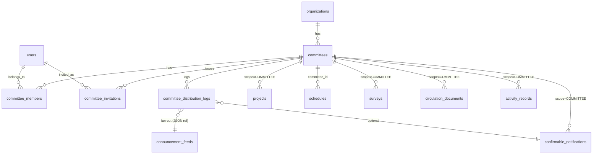

# F04.10: 組織委員会（Committee）

> **ステータス**: 🟢 設計完了
> **実装フェーズ**: Phase 14（F04.9 確認通知 / F01.2 組織構造 / F02.3 TODO / F03.1 スケジュール / F05.2 回覧板 / F05.4 アンケート / F06.4 活動記録 の横断拡張）
> **最終更新**: 2026-04-18

---

## 1. 概要

組織内に「委員会（Committee）」というサブチーム的スコープを新設し、大会実行委員会のように **閉じたメンバーシップ** で迅速に意思決定するための器を提供する。委員会は独自の TODO・カレンダー・出欠確認・アンケート（決議）・回覧板・議事録を持ち、非メンバーからは一切見えない。成果物（議事録・決議結果等）は作成者の選択で組織全体・加盟チーム・下位組織へ伝達でき、伝達時には「お知らせ投下するか」「確認ボタンを付けるか」まで個別に選べる。

### 設計原則

- **軽量実体** — 委員会独自の複雑な意思決定機構は作らず、既存機能（TODO / スケジュール / アンケート / 回覧板 / 確認通知 / お知らせ / 活動記録）を流用する
- **スコープの増設** — 委員会は `scope_type = 'COMMITTEE'` として既存機能のポリモーフィック・スコープに追加される
- **伝達は明示的** — 委員会内のコンテンツが自動的に外へ漏れることはない。伝達は作成者が 3段階選択して明示的に行う

### 主なユースケース

| ユースケース | 優先度 |
|---|---|
| 大会実行委員会（期間限定・組織横断） | 高 |
| 理事会（常設・組織中枢） | 高 |
| 役員選出委員会（任期制・機密性高） | 高 |
| 周年行事準備委員会（プロジェクト型） | 中 |
| クラブハウス建替え検討委員会（長期・資料蓄積型） | 中 |

---

## 2. スコープ

### 対象ロール

#### 組織側ロール（`organization_members.role`）

| ロール | 操作可能な範囲 |
|---|---|
| ORG_ADMIN | 委員会の作成・解散（ARCHIVE）・監査閲覧（全委員会の全コンテンツ閲覧可。監査ログ記録） |
| ORG_DEPUTY_ADMIN | `MANAGE_COMMITTEE` 権限を持つ場合のみ、委員会の作成・解散が可能 |
| ORG_MEMBER | 自分が委員会メンバーの場合のみ、該当委員会にアクセス可 |

#### 委員会内ロール（`committee_members.role`）

| ロール | 操作可能な範囲 |
|---|---|
| CHAIR（委員長） | 委員会内のすべての操作（メンバー招集・解任・解散提案・伝達処理・議事録確定） |
| VICE_CHAIR（副委員長） | CHAIR 不在時の代行。メンバー招集・伝達処理・議事録作成 |
| SECRETARY（書記） | 議事録作成・編集・伝達処理（確定は CHAIR/VICE_CHAIR のみ） |
| MEMBER（一般委員） | 委員会内コンテンツの閲覧・アンケート回答・TODO 操作・回覧板閲覧確認 |

### 対象レベル

- [x] 組織 (Organization) — 委員会は **必ず組織配下** に所属する（v1）
- [ ] チーム (Team) — v1 では扱わない（将来拡張の余地は残す）
- [ ] 個人 (Personal) — 対象外

### バージョン境界（v1 スコープ）

| 項目 | v1 で扱うか |
|---|---|
| 組織配下の委員会 | ✅ 扱う |
| チーム配下の委員会 | ❌ Phase 2 以降 |
| 委員会の入れ子（サブ委員会） | ❌ Phase 2 以降 |
| 組織をまたいだ委員会（連合委員会） | ❌ Phase 2 以降 |
| メンバー招集時の承諾フロー | ✅ 扱う |
| 委員会解散後の読み取り専用アーカイブ | ✅ 扱う |
| 匿名メンバー（名前を伏せた投票） | ❌ Phase 2 以降（F05.4 側の対応範囲） |

---

## 3. 既存機能との流用マトリクス

v1 では委員会独自の機能を最小化し、以下の既存機能を **`scope_type = 'COMMITTEE'` の値追加** で流用する。

| 欲しい機能 | 流用先設計書 | 流用方法 | スキーマ変更 |
|---|---|---|---|
| TODO・プロジェクト共有 | F02.3 | `projects.scope_type` に `'COMMITTEE'` 値を追加 | 値追加のみ（VARCHAR） |
| カレンダー共有 | F03.1 | `schedules` に `committee_id` カラム追加、XOR CHECK 制約再定義 | カラム追加＋制約再定義 |
| 出欠確認 | F03.1（schedule_attendances） | `schedules.committee_id` 経由で自動的に委員会スコープ化 | 追加変更なし |
| 決議（アンケート・投票） | F05.4 | `surveys.scope_type` に `'COMMITTEE'` 値を追加 | 値追加のみ（VARCHAR） |
| 回覧板 | F05.2 | `circulation_documents.scope_type` に `'COMMITTEE'` 値を追加 | 値追加のみ（VARCHAR） |
| 議事録 | F06.4 活動記録 | `activity_templates` に標準テンプレート「議事録」を投入 | マスタ INSERT + scope_type 拡張 |
| 確認通知 | F04.9 | `confirmable_notifications.scope_type` の ENUM を VARCHAR に変換し `'COMMITTEE'` 追加 | ENUM→VARCHAR 変換 |
| お知らせ配信 | F02.6 | `announcement_feeds.scope_type` を VARCHAR 化し、`source_type` に `COMMITTEE_DECISION` / `COMMITTEE_MINUTES` 追加 | ENUM→VARCHAR + 値追加 |

### 新規実装するのは「器」と「伝達処理」のみ

- `committees` テーブル — 委員会本体
- `committee_members` テーブル — メンバーシップ
- `committee_invitations` テーブル — 招集中の承諾待ちレコード
- `committee_distribution_logs` テーブル — 伝達操作の履歴（監査ログ兼用）
- `CommitteeDistributionService` — 委員会内コンテンツを外部スコープへ伝達する処理（お知らせ feed 生成 / 確認通知生成を束ねる）

---

## 4. DB設計

### テーブル一覧

| テーブル名 | 役割 | 論理削除 |
|---|---|---|
| `committees` | 委員会本体 | あり（`deleted_at`） |
| `committee_members` | 委員会メンバーシップ | なし（離脱は `left_at` で履歴保持） |
| `committee_invitations` | 招集トークン・承諾待ち | なし（成立/辞退で `resolved_at` セット） |
| `committee_distribution_logs` | 伝達処理の監査ログ | なし |

### テーブル定義

#### `committees`

委員会本体。組織配下に 1〜N 個。

| カラム名 | 型 | NULL | デフォルト | 説明 |
|---|---|---|---|---|
| `id` | BIGINT UNSIGNED | NO | AUTO_INCREMENT | PK |
| `organization_id` | BIGINT UNSIGNED | NO | — | FK → organizations（ON DELETE CASCADE）親組織 |
| `name` | VARCHAR(100) | NO | — | 委員会名（例: 「2026年度 大会実行委員会」） |
| `description` | TEXT | YES | NULL | 委員会の目的・趣旨 |
| `purpose_tag` | VARCHAR(30) | YES | NULL | 分類タグ（`TOURNAMENT` / `GOVERNANCE` / `ELECTION` / `PROJECT` / `OTHER`） |
| `start_date` | DATE | YES | NULL | 設立日。NULL は未設定 |
| `end_date` | DATE | YES | NULL | 解散予定日。NULL は期限なし |
| `status` | VARCHAR(20) | NO | 'DRAFT' | ライフサイクル状態（DRAFT / ACTIVE / CLOSED / ARCHIVED / CANCELLED_DRAFT） |
| `visibility_to_org` | VARCHAR(20) | NO | 'NAME_ONLY' | 組織内非メンバーからの可視性（`HIDDEN` / `NAME_ONLY` / `NAME_AND_PURPOSE`） |
| `default_confirmation_mode` | VARCHAR(10) | NO | 'OPTIONAL' | 伝達時のデフォルト確認ボタン設定（`NONE` / `OPTIONAL` / `REQUIRED`） |
| `default_announcement_enabled` | BOOLEAN | NO | TRUE | 伝達時にお知らせ投下するかのデフォルト |
| `default_distribution_scope` | VARCHAR(30) | NO | 'COMMITTEE_ONLY' | 伝達時のデフォルト配信先（`COMMITTEE_ONLY` / `PARENT_ORG` / `PARENT_ORG_AND_CHILDREN`） |
| `archived_at` | DATETIME | YES | NULL | ARCHIVED に遷移した日時 |
| `created_by` | BIGINT UNSIGNED | YES | NULL | FK → users（ON DELETE SET NULL）設立者 |
| `deleted_at` | DATETIME | YES | NULL | 論理削除日時（SoftDeletableEntity） |
| `created_at` | DATETIME | NO | CURRENT_TIMESTAMP | |
| `updated_at` | DATETIME | NO | CURRENT_TIMESTAMP ON UPDATE | |

**インデックス**
```sql
INDEX idx_committees_org (organization_id, status, deleted_at)    -- 組織配下の委員会一覧
INDEX idx_committees_status_end (status, end_date)                -- 自動 CLOSED バッチ用
UNIQUE KEY uq_committees_org_name (organization_id, name, deleted_at)  -- 同組織内で名前重複不可（論理削除後は再利用可）
```

**ライフサイクル（status 遷移）**

```
DRAFT ─── ACTIVE ─── CLOSED ─── ARCHIVED
   │         │           │
   │         │           └─→ (CHAIR or ORG_ADMIN が再開する場合のみ ACTIVE に戻せる)
   │         │
   │         └─→ (end_date 経過で日次バッチが CLOSED に遷移)
   │
   ├─→ ACTIVE (メンバー招集を開始した時点で ACTIVE 化。手動でも可)
   │
   └─→ CANCELLED_DRAFT (60日経過しても ACTIVE 化されない場合、日次バッチで自動遷移)
```

- `DRAFT`: 設立直後。メンバーは CHAIR のみ。外部伝達不可
- `ACTIVE`: 通常運用状態。すべての機能が利用可能
- `CLOSED`: 活動終了。新規コンテンツ作成不可。既存閲覧・伝達は可
- `ARCHIVED`: 完全アーカイブ。読み取り専用。非メンバーも visibility 設定次第で閲覧可
- `CANCELLED_DRAFT`: 設立後 60 日放置された DRAFT を自動クローズ。ARCHIVED と同等の読み取り専用扱い（6-6 参照）

---

#### `committee_members`

委員会メンバーシップ。履歴保持のため `left_at` で離脱記録。

| カラム名 | 型 | NULL | デフォルト | 説明 |
|---|---|---|---|---|
| `id` | BIGINT UNSIGNED | NO | AUTO_INCREMENT | PK |
| `committee_id` | BIGINT UNSIGNED | NO | — | FK → committees（ON DELETE CASCADE） |
| `user_id` | BIGINT UNSIGNED | NO | — | FK → users（ON DELETE CASCADE） |
| `role` | VARCHAR(20) | NO | 'MEMBER' | 委員会内ロール（CHAIR / VICE_CHAIR / SECRETARY / MEMBER） |
| `joined_at` | DATETIME | NO | CURRENT_TIMESTAMP | 参加成立日時 |
| `left_at` | DATETIME | YES | NULL | 離脱日時。NULL = 現役メンバー |
| `invited_by` | BIGINT UNSIGNED | YES | NULL | FK → users（ON DELETE SET NULL）招集者 |
| `created_at` | DATETIME | NO | CURRENT_TIMESTAMP | |
| `updated_at` | DATETIME | NO | CURRENT_TIMESTAMP ON UPDATE | |

**インデックス**
```sql
UNIQUE KEY uq_committee_members_active (committee_id, user_id, left_at)  -- 現役は1人1レコード、離脱後は再加入可
INDEX idx_committee_members_user (user_id, left_at)                       -- 自分が所属する委員会一覧
INDEX idx_committee_members_committee_role (committee_id, role, left_at)  -- ロール別メンバー抽出
```

**制約・備考**
- 現役メンバー（`left_at IS NULL`）の一意性は `UNIQUE (committee_id, user_id, left_at)` で保証（MySQL は NULL 同士を重複と見なさないため現役重複は防げる。離脱後の再加入は新レコードとして積む）
- CHAIR は **常に 1 名以上必要**（最小 1、最大無制限）。共同委員長（co-chair）の運用を許容する設計。アプリ層で「CHAIR 数 >= 1」をアサート
- CHAIR 唯一メンバーの解任・離脱時は事前に後任 CHAIR を設定することを強制（後任不在で CHAIR 数 = 0 になる API 呼び出しは 422 を返す）
- CHAIR の VICE_CHAIR/SECRETARY/MEMBER への自己降格も、最低 1 名の CHAIR が残ることを確認してから許可

---

#### `committee_invitations`

招集トークン。招集された人が承諾するまでの承諾待ちレコード。

| カラム名 | 型 | NULL | デフォルト | 説明 |
|---|---|---|---|---|
| `id` | BIGINT UNSIGNED | NO | AUTO_INCREMENT | PK |
| `committee_id` | BIGINT UNSIGNED | NO | — | FK → committees（ON DELETE CASCADE） |
| `invitee_user_id` | BIGINT UNSIGNED | NO | — | FK → users（ON DELETE CASCADE）被招集者 |
| `proposed_role` | VARCHAR(20) | NO | 'MEMBER' | 提案ロール |
| `invite_token` | VARCHAR(36) | NO | — | UUID。承諾 URL で使用 |
| `invited_by` | BIGINT UNSIGNED | YES | NULL | FK → users（ON DELETE SET NULL）招集者 |
| `message` | TEXT | YES | NULL | 招集時のメッセージ |
| `expires_at` | DATETIME | NO | — | 承諾期限（デフォルト 7日後） |
| `resolved_at` | DATETIME | YES | NULL | 承諾/辞退/期限切れが確定した日時 |
| `resolution` | VARCHAR(20) | YES | NULL | `ACCEPTED` / `DECLINED` / `EXPIRED` / `CANCELLED` |
| `created_at` | DATETIME | NO | CURRENT_TIMESTAMP | |
| `updated_at` | DATETIME | NO | CURRENT_TIMESTAMP ON UPDATE | |

**インデックス**
```sql
UNIQUE KEY uq_committee_invitations_token (invite_token)
INDEX idx_committee_invitations_pending (committee_id, resolved_at)     -- 未解決招集の抽出
INDEX idx_committee_invitations_invitee (invitee_user_id, resolved_at)  -- 自分宛て招集一覧
INDEX idx_committee_invitations_expiry (resolved_at, expires_at)        -- 期限切れバッチ
```

**制約・備考**
- 同一ユーザーに対し同時に複数の未解決招集が存在することは許容（想定: v1 では発生しない運用だが、再招集時に古い招集を自動 CANCELLED にするロジックをアプリ層で実装）

---

#### `committee_distribution_logs`

委員会内コンテンツを外部スコープへ伝達した処理の履歴。監査目的も兼ねる。

| カラム名 | 型 | NULL | デフォルト | 説明 |
|---|---|---|---|---|
| `id` | BIGINT UNSIGNED | NO | AUTO_INCREMENT | PK |
| `committee_id` | BIGINT UNSIGNED | NO | — | FK → committees（ON DELETE CASCADE） |
| `content_type` | VARCHAR(30) | NO | — | 伝達対象の種別（`SURVEY_RESULT` / `ACTIVITY_RECORD` / `CIRCULATION_RESULT` / `CUSTOM_MESSAGE`） |
| `content_id` | BIGINT UNSIGNED | YES | NULL | 伝達対象のエンティティ ID（`CUSTOM_MESSAGE` の場合 NULL） |
| `custom_title` | VARCHAR(200) | YES | NULL | CUSTOM_MESSAGE 時のタイトル |
| `custom_body` | TEXT | YES | NULL | CUSTOM_MESSAGE 時の本文 |
| `target_scope` | VARCHAR(30) | NO | — | 配信先（`COMMITTEE_ONLY` / `PARENT_ORG` / `PARENT_ORG_AND_CHILDREN`） |
| `announcement_enabled` | BOOLEAN | NO | — | お知らせ投下したかどうか |
| `confirmation_mode` | VARCHAR(10) | NO | — | 確認ボタン設定（`NONE` / `OPTIONAL` / `REQUIRED`） |
| `confirmable_notification_id` | BIGINT UNSIGNED | YES | NULL | FK → confirmable_notifications（ON DELETE SET NULL）REQUIRED/OPTIONAL 時に生成された確認通知 |
| `announcement_feed_ids` | JSON | YES | NULL | 生成された announcement_feeds レコードの ID 配列 |
| `created_by` | BIGINT UNSIGNED | YES | NULL | FK → users（ON DELETE SET NULL）伝達操作者 |
| `created_at` | DATETIME | NO | CURRENT_TIMESTAMP | |

**インデックス**
```sql
INDEX idx_committee_distribution_logs_committee (committee_id, created_at DESC)
INDEX idx_committee_distribution_logs_content (content_type, content_id)
```

---

### 関連テーブルへのカラム/値追加

| テーブル | 変更内容 | Flyway |
|---|---|---|
| `projects` | `scope_type` VARCHAR の取りうる値に `'COMMITTEE'` を追加（DDL 変更なし、コメント更新のみ） | V9.083 |
| `schedules` | `committee_id BIGINT UNSIGNED NULL` カラム追加、FK 制約、XOR CHECK 制約再定義 | V9.086 |
| `surveys` | `scope_type` に `'COMMITTEE'` 値追加（コメント更新） | V9.084 |
| `circulation_documents` | `scope_type` に `'COMMITTEE'` 値追加（コメント更新） | V9.085 |
| `confirmable_notifications` | `scope_type` を ENUM から VARCHAR(20) に変換、`'COMMITTEE'` 受容 | V9.087 |
| `confirmable_notification_settings` | 同上 | V9.087 |
| `confirmable_notification_templates` | 同上 | V9.087 |
| `announcement_feeds` | `scope_type` を ENUM から VARCHAR(20) に変換、`source_type` に `COMMITTEE_DECISION` / `COMMITTEE_MINUTES` / `COMMITTEE_CIRCULATION` / `COMMITTEE_MESSAGE` を追加 | V9.088 |
| `activity_templates` | 「議事録」標準テンプレート INSERT（`scope_type = 'COMMITTEE'` で利用可能） | V9.089 |
| `activity_records` | `scope_type` に `'COMMITTEE'` 値追加（コメント更新） | V9.089 |

### `schedules.committee_id` の XOR CHECK 再定義

現在の F03.1 は `team_id` / `organization_id` / `user_id` の 3 カラム XOR。v1 では `committee_id` を追加して 4 カラム XOR に変更する。

```sql
ALTER TABLE schedules
  ADD COLUMN committee_id BIGINT UNSIGNED NULL AFTER user_id,
  ADD CONSTRAINT fk_schedules_committee FOREIGN KEY (committee_id) REFERENCES committees(id) ON DELETE CASCADE,
  DROP CHECK ck_schedules_scope_xor,
  ADD CONSTRAINT ck_schedules_scope_xor CHECK (
    (CASE WHEN team_id IS NOT NULL THEN 1 ELSE 0 END)
    + (CASE WHEN organization_id IS NOT NULL THEN 1 ELSE 0 END)
    + (CASE WHEN user_id IS NOT NULL THEN 1 ELSE 0 END)
    + (CASE WHEN committee_id IS NOT NULL THEN 1 ELSE 0 END)
    = 1
  );

CREATE INDEX idx_schedules_committee ON schedules (committee_id, start_at);
```

**既存レコードへの影響**: 既存の `team_id` / `organization_id` / `user_id` 設定済みレコードは `committee_id` が NULL のままで XOR 制約を満たす。後方互換。

---

### ER図



---

## 5. API設計

### エンドポイント一覧

#### 委員会 CRUD（組織スコープ）

| メソッド | パス | 認可 | 説明 |
|---|---|---|---|
| GET | `/api/v1/organizations/{orgId}/committees` | 組織メンバー | 所属組織の委員会一覧（可視性に応じてフィルタ） |
| POST | `/api/v1/organizations/{orgId}/committees` | ORG_ADMIN / MANAGE_COMMITTEE 権限を持つ ORG_DEPUTY_ADMIN | 委員会設立 |
| GET | `/api/v1/committees/{committeeId}` | 委員会メンバー or 可視性が許す組織メンバー | 委員会詳細取得 |
| PATCH | `/api/v1/committees/{committeeId}` | CHAIR / VICE_CHAIR | 委員会情報更新 |
| DELETE | `/api/v1/committees/{committeeId}` | ORG_ADMIN | 論理削除（実運用では ARCHIVED 遷移を推奨） |
| POST | `/api/v1/committees/{committeeId}/status` | CHAIR / ORG_ADMIN | ステータス遷移（ACTIVATE / CLOSE / ARCHIVE / REOPEN） |

#### メンバー管理

| メソッド | パス | 認可 | 説明 |
|---|---|---|---|
| GET | `/api/v1/committees/{committeeId}/members` | 委員会メンバー | メンバー一覧（履歴含むオプション） |
| POST | `/api/v1/committees/{committeeId}/invitations` | CHAIR / VICE_CHAIR | 招集状送付 |
| GET | `/api/v1/committees/{committeeId}/invitations` | CHAIR / VICE_CHAIR | 招集中一覧 |
| DELETE | `/api/v1/committee-invitations/{invitationId}` | 招集者 / CHAIR | 招集取り下げ |
| POST | `/api/v1/committee-invitations/accept-by-token` | 認証済みユーザー | 招集受諾（冪等: 既に ACCEPTED 済みでも 200 を返し既存の `committee_members` を返す） |
| POST | `/api/v1/committee-invitations/decline-by-token` | 認証済みユーザー | 招集辞退（冪等: 既に DECLINED でも 200。EXPIRED/CANCELLED のトークンは 410 Gone） |
| PATCH | `/api/v1/committees/{committeeId}/members/{userId}` | CHAIR | メンバーのロール変更 |
| DELETE | `/api/v1/committees/{committeeId}/members/{userId}` | CHAIR | メンバー解任（`left_at` セット） |
| POST | `/api/v1/committees/{committeeId}/members/me/leave` | 本人 | 自発的離脱（CHAIR の場合は事前に後任設定必須） |

#### 伝達処理

| メソッド | パス | 認可 | 説明 |
|---|---|---|---|
| POST | `/api/v1/committees/{committeeId}/distributions` | CHAIR / VICE_CHAIR / SECRETARY | 委員会内コンテンツの外部伝達 |
| GET | `/api/v1/committees/{committeeId}/distributions` | 委員会メンバー | 伝達履歴一覧 |
| GET | `/api/v1/committees/{committeeId}/distributions/{id}` | 委員会メンバー | 伝達詳細（結果の確認率等） |

#### 既存 API のスコープ拡張

以下は既存エンドポイントのクエリ/ボディで `scope_type=COMMITTEE` を受け入れるだけの対応。設計書本文は各機能側に委ね、本設計書では一覧のみ示す。

| 既存エンドポイント | 必要な対応 |
|---|---|
| `POST /api/v1/projects` | `scope_type: 'COMMITTEE'` 受容 |
| `POST /api/v1/schedules` | `committee_id` フィールド受容 |
| `POST /api/v1/surveys` | `scope_type: 'COMMITTEE'` 受容 |
| `POST /api/v1/circulation-documents` | `scope_type: 'COMMITTEE'` 受容 |
| `POST /api/v1/confirmable-notifications` | `scope_type: 'COMMITTEE'` 受容 |
| `POST /api/v1/activity-records` | `scope_type: 'COMMITTEE'` 受容 |

### リクエスト／レスポンス仕様（抜粋）

#### `POST /api/v1/organizations/{orgId}/committees`

**認可**: ORG_ADMIN または `MANAGE_COMMITTEE` 権限を持つ ORG_DEPUTY_ADMIN

**リクエストボディ**
```json
{
  "name": "2026年度 大会実行委員会",
  "description": "第42回 春季トーナメントの企画・運営を担当する",
  "purpose_tag": "TOURNAMENT",
  "start_date": "2026-05-01",
  "end_date": "2026-08-31",
  "visibility_to_org": "NAME_AND_PURPOSE",
  "default_confirmation_mode": "OPTIONAL",
  "default_announcement_enabled": true,
  "default_distribution_scope": "PARENT_ORG",
  "initial_chair_user_id": 12
}
```

**レスポンス（201 Created）**
```json
{
  "data": {
    "id": 5,
    "organization_id": 1,
    "name": "2026年度 大会実行委員会",
    "status": "DRAFT",
    "member_count": 1,
    "created_at": "2026-04-18T14:00:00"
  }
}
```

**副作用**
- `initial_chair_user_id` で指定されたユーザーが自動的に CHAIR として `committee_members` に INSERT（承諾フローをスキップ。本人が委員会設立に合意している前提）
- もし `initial_chair_user_id` が設立者（`created_by`）と異なる場合、本人に通知して CHAIR 就任の確認を求める（F04.3 プッシュ通知連携）

**エラーレスポンス**
| ステータス | 条件 |
|---|---|
| 400 | `name` 重複（同組織内）/ `end_date < start_date` / `purpose_tag` 無効値 |
| 403 | 組織への権限不足 |
| 404 | 組織 or `initial_chair_user_id` 不存在 |

---

#### `POST /api/v1/committees/{committeeId}/invitations`

**認可**: CHAIR / VICE_CHAIR

**リクエストボディ**
```json
{
  "invitee_user_ids": [10, 11, 13, 14],
  "proposed_role": "MEMBER",
  "message": "大会実行委員会への参加をお願いします。第一回会合は 5/10 を予定しています。",
  "expires_in_days": 7
}
```

**レスポンス（201 Created）**
```json
{
  "data": [
    {
      "id": 101,
      "invitee_user_id": 10,
      "proposed_role": "MEMBER",
      "expires_at": "2026-04-25T14:00:00",
      "status": "PENDING"
    }
  ],
  "meta": {
    "invited_count": 4,
    "skipped_existing_member_count": 0,
    "skipped_pending_invitation_count": 0
  }
}
```

**副作用**
- 招集された人に対して:
  - F04.3 プッシュ通知（「○○委員会から招集されました」）
  - `committees` 配下の通知設定に従いメール送信
- 既に `committee_members` に現役メンバーとして登録済みのユーザーはスキップ（`meta.skipped_existing_member_count` に計上）

---

#### `POST /api/v1/committees/{committeeId}/distributions`

委員会内コンテンツ（アンケート結果・議事録・回覧板結果など）を外部スコープへ伝達する中核エンドポイント。

**認可**: CHAIR / VICE_CHAIR / SECRETARY

**リクエストボディ（3パターン例）**

パターン A: アンケート結果を親組織全体に伝達（確認ボタン付き）
```json
{
  "content_type": "SURVEY_RESULT",
  "content_id": 33,
  "target_scope": "PARENT_ORG",
  "announcement_enabled": true,
  "confirmation_mode": "REQUIRED",
  "confirmation_deadline_at": "2026-05-01T23:59:00",
  "custom_headline": "委員会決議: 2026年度 大会参加費の改定について"
}
```

パターン B: 議事録を組織＋加盟チーム＋下位組織まで展開（確認ボタンなし・お知らせあり）
```json
{
  "content_type": "ACTIVITY_RECORD",
  "content_id": 58,
  "target_scope": "PARENT_ORG_AND_CHILDREN",
  "announcement_enabled": true,
  "confirmation_mode": "NONE"
}
```

パターン C: 単なる連絡（委員会内のみに告知、外部伝達しない）
```json
{
  "content_type": "CUSTOM_MESSAGE",
  "custom_title": "次回会合の議題について",
  "custom_body": "次回 5/20 の議題は以下3点です。...",
  "target_scope": "COMMITTEE_ONLY",
  "announcement_enabled": true,
  "confirmation_mode": "NONE"
}
```

**レスポンス（201 Created）**
```json
{
  "data": {
    "id": 201,
    "committee_id": 5,
    "content_type": "SURVEY_RESULT",
    "content_id": 33,
    "target_scope": "PARENT_ORG",
    "announcement_enabled": true,
    "confirmation_mode": "REQUIRED",
    "confirmable_notification_id": 777,
    "announcement_feed_ids": [1024, 1025],
    "created_at": "2026-04-18T15:00:00"
  }
}
```

**副作用**
- `announcement_enabled = true` の場合、`target_scope` の各スコープに対して `announcement_feeds` レコードを生成（`source_type` は content_type に応じて `COMMITTEE_DECISION` / `COMMITTEE_MINUTES` / `COMMITTEE_CIRCULATION` / `COMMITTEE_MESSAGE`）
- `confirmation_mode != NONE` の場合、F04.9 `confirmable_notifications` を生成（`scope_type = 'COMMITTEE'` ではなく **伝達先スコープ** で生成する点に注意）
- `committee_distribution_logs` に操作履歴を記録

**エラーレスポンス**
| ステータス | 条件 |
|---|---|
| 400 | `content_id` が委員会スコープ外 / `content_type` と `content_id` の不整合 / REQUIRED なのに `confirmation_deadline_at` 未指定 |
| 403 | 権限不足 / 委員会が ARCHIVED |
| 404 | 委員会 or コンテンツが存在しない |
| 429 | レートリミット超過（1委員会あたり 10件/時間） |

---

## 6. ビジネスロジック

### 主要フロー

#### 6-1. 委員会設立フロー

```
1. ORG_ADMIN が POST /organizations/{orgId}/committees
2. committees レコードを DRAFT で作成
3. initial_chair_user_id ユーザーを CHAIR として committee_members に INSERT
   - もし本人でなければ、本人に F04.3 プッシュ通知「CHAIR就任の依頼」
4. CHAIR が招集状を送り、最初のメンバーが1人以上 ACCEPTED になった時点で
   PATCH /committees/{id}/status { to: "ACTIVE" } を呼べるようになる
5. ACTIVE 化以降、すべての機能（TODO/カレンダー/アンケート等）が利用可能
```

#### 6-2. メンバー招集フロー

```
1. CHAIR が POST /committees/{id}/invitations { invitee_user_ids: [...] }
2. 各 invitee に committee_invitations レコード生成（invite_token UUID）
3. invitee に F04.3 プッシュ通知＋メール送信（認証URL つき）
4. invitee がアプリ内 or URL 経由で accept-by-token / decline-by-token
5. ACCEPTED: committee_members に INSERT（joined_at = NOW）
   DECLINED: resolution = 'DECLINED' をセット、CHAIR に通知
   EXPIRED: バッチが日次 AM2:00 に未解決で expires_at < NOW のものを resolution = 'EXPIRED'
```

#### 6-3. 伝達フロー（最重要）

```
入力: content_type / content_id / target_scope / announcement_enabled / confirmation_mode

STEP 1: 事前検証
  - 対象コンテンツが本当にこの委員会スコープに属するか検証
    （例: surveys.scope_type='COMMITTEE' AND surveys.scope_id=committee_id）
  - 委員会が ARCHIVED でないこと（ARCHIVED は伝達不可）
  - target_scope の妥当性（PARENT_ORG / PARENT_ORG_AND_CHILDREN は親組織構造を確認）

STEP 2: 配信先スコープのリスト化
  - COMMITTEE_ONLY: [{scope_type: 'COMMITTEE', scope_id: committee_id}]
  - PARENT_ORG: [{scope_type: 'ORGANIZATION', scope_id: parent_org_id}]
  - PARENT_ORG_AND_CHILDREN:
      [親組織]
      + [親組織に加盟する全チーム]
      + [親組織の下位組織（F01.2 で定義される場合）]

STEP 3: announcement_feeds 生成（announcement_enabled=true の場合のみ）
  - 各配信先スコープに対し INSERT
  - source_type は content_type から決定:
      SURVEY_RESULT → 'COMMITTEE_DECISION'
      ACTIVITY_RECORD → 'COMMITTEE_MINUTES'
      CIRCULATION_RESULT → 'COMMITTEE_CIRCULATION'
      CUSTOM_MESSAGE → 'COMMITTEE_MESSAGE'
  - source_id は content_id（CUSTOM_MESSAGE 時は NULL、custom_title/body を直接 feed に格納）

STEP 4: confirmable_notifications 生成（confirmation_mode != NONE の場合）
  - F04.9 の ConfirmableNotificationService.send() を呼ぶ
  - scope_type / scope_id はそれぞれの配信先
  - priority: REQUIRED → HIGH, OPTIONAL → NORMAL
  - deadline_at: confirmation_deadline_at （REQUIRED の場合必須）

STEP 5: committee_distribution_logs に記録
  - confirmable_notification_id, announcement_feed_ids を格納
```

#### 6-4. 委員会ライフサイクル

```
DRAFT → ACTIVE: CHAIR が最初のメンバー受諾後に手動遷移（自動遷移はしない）
DRAFT → CANCELLED_DRAFT: 60日経過しても ACTIVE 化されない場合、日次バッチが自動遷移（6-6 参照）
ACTIVE → CLOSED:
   - 手動: CHAIR / ORG_ADMIN が明示的にクローズ
   - 自動: end_date < NOW() の日次バッチ（AM3:00）
CLOSED → ARCHIVED: 手動のみ（ORG_ADMIN）。ARCHIVE 後は読み取り専用
CLOSED → ACTIVE: CHAIR / ORG_ADMIN が再開する場合のみ（end_date 延長時等）
ARCHIVED → ACTIVE: ORG_ADMIN のみ可（データ復活）
CANCELLED_DRAFT → ACTIVE: ORG_ADMIN のみ可（誤自動キャンセルの復旧用）
```

**ステータス別の操作制約**

| ステータス | 新規コンテンツ作成 | 既存コンテンツ編集 | メンバー招集 | 伝達処理 | 閲覧（メンバー） | 閲覧（非メンバー） |
|---|---|---|---|---|---|---|
| DRAFT | × | × | ✅ | × | ✅ | × |
| ACTIVE | ✅ | ✅ | ✅ | ✅ | ✅ | visibility 設定次第（NAME_ONLY 以上） |
| CLOSED | × | ✅（議事録のみ） | × | ✅ | ✅ | visibility 設定次第 |
| ARCHIVED | × | × | × | × | ✅ | visibility 設定次第 |
| CANCELLED_DRAFT | × | × | × | × | ✅（設立者・初期CHAIRのみ） | × |

#### 6-5. 解散時の既存コンテンツ扱い

- `committees.deleted_at` が設定されても、配下の `projects` / `schedules` / `surveys` / `circulation_documents` / `activity_records` は **論理削除されない**
- 委員会が ARCHIVED（`deleted_at` 未設定）でも読み取り可能
- 完全削除（DELETE エンドポイント実行時）は物理削除しないが、論理削除フラグが立ちメンバーのタイムライン等からは消える
- v1 では「完全 hard delete」は提供しない（監査目的で履歴保持）

#### 6-6. DRAFT 委員会の放置対策

DRAFT 状態のまま長期間放置される委員会を防ぐ：

- 日次バッチが DRAFT かつ `created_at < NOW() - INTERVAL 30 DAY` の委員会を検出
- 検出された委員会は:
  - 設立者（`created_by`）と初期 CHAIR にリマインド通知（初回）
  - 60 日経過で自動的に `status = 'CANCELLED_DRAFT'` へ遷移（新ステータス値追加）
  - `CANCELLED_DRAFT` 状態の委員会は ARCHIVED 扱いで読み取り専用

#### 6-7. 議事録の DRAFT/CONFIRMED 状態

議事録（`activity_records` with `template_id = <議事録テンプレート>`）には 2 段階ステータスを設ける:

- **DRAFT** — SECRETARY 等が作成中。メンバーから閲覧可能だが、`activity_records.field_values._meta.status = 'DRAFT'` で識別
- **CONFIRMED** — CHAIR / VICE_CHAIR が確定。`_meta.status = 'CONFIRMED'` かつ `_meta.confirmed_at` / `_meta.confirmed_by` をセット
- 確定後の議事録のみが F04.10 伝達処理の対象（`content_type='ACTIVITY_RECORD'`）

確定操作は専用エンドポイント `PATCH /api/v1/committees/{id}/activity-records/{recordId}/confirm` を追加（F06.4 には存在しない委員会限定 API）。

#### 6-8. 通知集約と opt-out

- 委員会内での TODO 作成・アンケート公開・回覧開始等の通知は、F04.3 `notification_type_preferences` に委員会スコープの opt-out 設定を持たせる
- デフォルト: 委員会内メンバーへの通知は **初期 ON**（委員会は閉じた場なので通知頻度が高すぎる問題は発生しにくい前提）
- 委員会で 1 日に 10 件以上の通知が発生する場合、バッチ通知（日次ダイジェスト）への切替を勧めるサジェスト UI を表示（v1 ではサジェスト UI のみ。実際の集約は Phase 2）

### 権限マトリックス

| 操作 | ORG_ADMIN | CHAIR | VICE_CHAIR | SECRETARY | MEMBER | 非メンバー |
|---|---|---|---|---|---|---|
| 委員会作成 | ✅ | — | — | — | — | — |
| 委員会設定変更 | ✅（監査） | ✅ | ✅ | × | × | × |
| 委員会ステータス遷移 | ✅ | ✅ | × | × | × | × |
| メンバー招集 | × | ✅ | ✅ | × | × | × |
| メンバー解任 | ✅（監査） | ✅ | × | × | × | × |
| ロール変更 | × | ✅ | × | × | × | × |
| 自発的離脱 | — | ✅（※後任要） | ✅ | ✅ | ✅ | — |
| TODO・スケジュール作成 | × | ✅ | ✅ | ✅ | ✅ | × |
| アンケート（決議）作成 | × | ✅ | ✅ | ✅ | × | × |
| 回覧板作成 | × | ✅ | ✅ | ✅ | × | × |
| 議事録作成 | × | ✅ | ✅ | ✅ | × | × |
| 議事録確定（公開） | × | ✅ | ✅ | × | × | × |
| 伝達処理 | × | ✅ | ✅ | ✅ | × | × |
| 委員会内コンテンツ閲覧 | ✅（監査） | ✅ | ✅ | ✅ | ✅ | × |
| 監査ログ閲覧 | ✅ | × | × | × | × | × |

**※後任**: CHAIR が自発的に離脱する場合、離脱前に他のメンバーを CHAIR に昇格させないと離脱 API が 400 を返す。

---

## 7. セキュリティ考慮事項

### 7-1. 認可チェック（最重要）

すべての `/api/v1/committees/{committeeId}/**` エンドポイントは `CommitteeAuthorizationInterceptor` で以下を検証：

1. `currentUser` が `committee_members` に `left_at IS NULL` で登録されているか
2. 登録されていれば `role` を取得して操作権限をチェック
3. 登録されていない場合は:
   - GET 系: 委員会の `visibility_to_org` 設定に応じて可否判定
   - それ以外: **404 を返す**（存在の有無すら漏らさない）

既存機能（TODO・スケジュール等）も `scope_type = 'COMMITTEE'` のリクエストを受けた時点で同じチェックを通す。具体的には `ScopeResolver.resolveCommittee(scopeId, currentUser)` を既存の認可ロジックに追加。

### 7-2. スコープリーク防止

- `surveys` / `projects` / `schedules` 等を一覧取得する既存エンドポイントが、 **明示的に scope_type を指定しない限り** `scope_type = 'COMMITTEE'` のレコードを返さないようにする
- 「自分のダッシュボード」等の横断ビューは、ユーザーが現役メンバーである委員会のコンテンツのみを含める
- 検索機能 F04.6 も同様にフィルタ（検索インデックスに `committee_id` を含め、非メンバーのクエリでは除外）

### 7-3. IDOR 対策

- `committee_invitations.invite_token` は UUID v4（122 bit エントロピー）
- 認証なしで叩けるエンドポイントは `accept-by-token` / `decline-by-token` のみ
- トークン URL にはレートリミット（IP あたり 60req/min）

### 7-4. 親組織 ADMIN の監査閲覧

- ORG_ADMIN は全委員会のコンテンツを閲覧可能だが、**閲覧するたびに監査ログ記録**
- 監査ログテーブル: F10.3 `audit_logs` を流用（source_type = 'COMMITTEE_AUDIT_VIEW'）
- ORG_ADMIN が閲覧操作をすると委員会の CHAIR に通知（オプション、デフォルト OFF で設定可能）

### 7-5. レートリミット

| 操作 | 制限 | 理由 |
|---|---|---|
| 伝達処理 (`POST /distributions`) | 10件/時間/委員会 | スパム伝達防止 |
| 招集状送付 | 50人/時間/委員会 | 一度に大量招集を防止 |
| トークン承諾 | 10回/分/IP | ブルートフォース対策 |

実装: `Bucket4j` + Valkey ベースのレートリミッタ（既存パターン踏襲）。

### 7-6. 監査ログ

以下の操作はすべて監査ログに記録：

- 委員会作成・削除・ステータス遷移
- メンバー招集・承諾・辞退・解任・ロール変更
- 伝達処理（`committee_distribution_logs` が実質の監査ログを兼ねる）
- ORG_ADMIN による監査閲覧

### 7-7. 機密性の高い議論への配慮

- 委員会内のコンテンツは **OS レベルの暗号化** 以上の特別な暗号化は施さない（既存の schedules 等と同様）
- ただし委員会の存在自体を隠したい場合は `visibility_to_org = 'HIDDEN'` を選択可能。この場合:
  - 組織メンバーの委員会一覧 API には含まれない
  - 検索にもヒットしない
  - お知らせ feed にも露出しない
  - 本人が現役メンバーの場合のみ可視

### 7-8. モデレーション連携（F04.5）

- 委員会スコープのコンテンツ（TODO コメント・アンケート自由記述・議事録本文など）は既存の F04.5 モデレーション機構の対象
- ただし通報可能者は **委員会メンバーのみ** に限定（非メンバーはコンテンツ閲覧自体ができないため）
- 通報を受けた場合、モデレーション結果の通知先は: (1) 投稿者、(2) 委員会 CHAIR、(3) 組織 ADMIN（監査目的）
- モデレーション済みフラグが立ったコンテンツは F04.10 伝達処理の対象から除外（伝達済み済みの場合はお知らせ feed も削除）

---

## 8. Flyway マイグレーション計画

現在の最大番号は `V9.079__add_icon_banner_url_to_organizations.sql`（2026-04-17）。

| ファイル名 | 内容 |
|---|---|
| `V9.080__create_committees_table.sql` | `committees` テーブル |
| `V9.081__create_committee_members_table.sql` | `committee_members` テーブル |
| `V9.082__create_committee_invitations_table.sql` | `committee_invitations` テーブル |
| `V9.083__extend_projects_scope_type_for_committee.sql` | `projects.scope_type` コメント更新（VARCHAR なので値追加のみ） |
| `V9.084__extend_surveys_scope_type_for_committee.sql` | `surveys.scope_type` コメント更新 |
| `V9.085__extend_circulation_documents_scope_type_for_committee.sql` | `circulation_documents.scope_type` コメント更新 |
| `V9.086__add_committee_id_to_schedules.sql` | `schedules` に `committee_id` 追加＋CHECK再定義＋INDEX |
| `V9.087__convert_confirmable_scope_type_to_varchar.sql` | `confirmable_notifications` / `_settings` / `_templates` の `scope_type` を ENUM→VARCHAR(20) |
| `V9.088__convert_announcement_feeds_scope_and_source_types.sql` | `announcement_feeds.scope_type` を ENUM→VARCHAR(20)、`source_type` に委員会 4 種を追加 |
| `V9.089__seed_activity_template_minutes_and_extend_scope.sql` | `activity_templates` に「議事録」標準 INSERT、`activity_records.scope_type` コメント更新 |
| `V9.090__create_committee_distribution_logs_table.sql` | `committee_distribution_logs` テーブル |

**マイグレーション上の注意点**

- V9.086 の CHECK 制約再定義は既存データに影響しない（既存行は必ず 1 カラムのみ非 NULL のため）
- V9.087 / V9.088 の ENUM→VARCHAR 変換は MySQL 8.0 では `ALTER TABLE ... MODIFY COLUMN` で可能。データはそのまま保持される
- `committees` テーブル作成前に `committee_members` / `committee_invitations` を作ると FK エラーになるため順序厳守
- V9.090 を最後にする理由: `committee_distribution_logs.confirmable_notification_id` が V9.087 適用後の `confirmable_notifications` を参照するため
- V9.083〜V9.085 はコメント更新のみ（実データ変更なし）。実装時はマイグレーション 1 本にまとめるか、Flyway スクリプトを分離するかは実装者判断に委ねる（本設計書は分離前提で記述）

---

## 9. Frontend 設計

### 新規ファイル

| ファイル | 役割 |
|---|---|
| `frontend/app/types/committee.ts` | TypeScript 型定義 |
| `frontend/app/composables/useCommitteeApi.ts` | API Composable |
| `frontend/app/composables/useCommitteeDistribution.ts` | 伝達処理用の専用 Composable |
| `frontend/app/pages/organizations/[orgId]/committees/index.vue` | 委員会一覧 |
| `frontend/app/pages/organizations/[orgId]/committees/new.vue` | 委員会設立フォーム |
| `frontend/app/pages/committees/[committeeId]/index.vue` | 委員会ダッシュボード |
| `frontend/app/pages/committees/[committeeId]/members.vue` | メンバー管理 |
| `frontend/app/pages/committees/[committeeId]/settings.vue` | 委員会設定 |
| `frontend/app/pages/committees/[committeeId]/distributions.vue` | 伝達履歴 |
| `frontend/app/pages/committee-invitations/[token].vue` | 招集受諾画面 |
| `frontend/app/components/committee/CommitteeCard.vue` | 一覧用カード |
| `frontend/app/components/committee/CommitteeMemberList.vue` | メンバー一覧 |
| `frontend/app/components/committee/CommitteeInvitationForm.vue` | 招集フォーム |
| `frontend/app/components/committee/CommitteeDistributionModal.vue` | **伝達3段階選択モーダル**（本機能の中核UI） |
| `frontend/app/components/committee/CommitteeStatusBadge.vue` | ステータスバッジ |

### 既存ファイルの修正

| ファイル | 修正内容 |
|---|---|
| `frontend/app/components/todo/TodoProjectCreateForm.vue` | scope 選択肢に委員会追加 |
| `frontend/app/components/schedule/ScheduleCreateForm.vue` | scope 選択肢に委員会追加、`committee_id` フィールド送信 |
| `frontend/app/components/survey/SurveyCreateForm.vue` | scope 選択肢に委員会追加 |
| `frontend/app/components/circular/CircularCreateForm.vue` | scope 選択肢に委員会追加 |
| `frontend/app/components/activity/ActivityRecordCreateForm.vue` | scope 選択肢に委員会追加、議事録テンプレート表示 |
| `frontend/app/components/announcement/AnnouncementFeedItem.vue` | `source_type = COMMITTEE_*` のアイコン・ラベル追加 |
| `frontend/app/components/dashboard/DashboardSidebar.vue` | 自分の所属委員会をサイドバーに表示 |

### 委員会伝達モーダルの UI 仕様（重要）

委員会内の任意のコンテンツ詳細画面に「外部へ伝達する」ボタンを配置。クリックすると `CommitteeDistributionModal.vue` が開く。

**ADHD 傾向配慮**: 3 択すべてがデフォルト値プリセット済み（委員会設定値）。ユーザーは変更が必要な選択のみ触ればよい。必須入力は「確認期限」（REQUIRED 時のみ）の 1 項目のみ。

```
┌─────────────────────────────────────────────────────┐
│ 「2026年度 大会参加費改定について」を伝達               │
├─────────────────────────────────────────────────────┤
│                                                     │
│ [1] どこまで伝える？                                    │
│  ○ 委員会内のみ                                       │
│  ● 組織全体（← デフォルト）                             │
│  ○ 組織＋加盟チーム＋下位組織                           │
│                                                     │
│ [2] お知らせに投下する？                                │
│  ● する（← デフォルト）  ○ しない                        │
│                                                     │
│ [3] 確認ボタンを付ける？                                │
│  ○ 不要                                              │
│  ● 任意（確認してほしい）（← デフォルト）                  │
│  ○ 必須（確認必要）                                    │
│                                                     │
│ [期限（任意 → 必須になるのは必須のみ）]                   │
│  [                2026-05-01 23:59              ▼] │
│                                                     │
│              [ キャンセル ]   [ 伝達する ]               │
└─────────────────────────────────────────────────────┘
```

### 型定義の主要部分

```typescript
// frontend/app/types/committee.ts

export type CommitteeStatus = 'DRAFT' | 'ACTIVE' | 'CLOSED' | 'ARCHIVED'
export type CommitteeRole = 'CHAIR' | 'VICE_CHAIR' | 'SECRETARY' | 'MEMBER'
export type CommitteePurposeTag = 'TOURNAMENT' | 'GOVERNANCE' | 'ELECTION' | 'PROJECT' | 'OTHER'
export type CommitteeVisibility = 'HIDDEN' | 'NAME_ONLY' | 'NAME_AND_PURPOSE'

export type DistributionScope = 'COMMITTEE_ONLY' | 'PARENT_ORG' | 'PARENT_ORG_AND_CHILDREN'
export type ConfirmationMode = 'NONE' | 'OPTIONAL' | 'REQUIRED'
export type DistributionContentType =
  | 'SURVEY_RESULT'
  | 'ACTIVITY_RECORD'
  | 'CIRCULATION_RESULT'
  | 'CUSTOM_MESSAGE'

export interface CommitteeSummary {
  id: number
  organizationId: number
  name: string
  description: string | null
  purposeTag: CommitteePurposeTag | null
  status: CommitteeStatus
  visibilityToOrg: CommitteeVisibility
  memberCount: number
  startDate: string | null
  endDate: string | null
  myRole: CommitteeRole | null  // null = 非メンバー
  createdAt: string
}

export interface CommitteeMemberItem {
  userId: number
  displayName: string
  avatarUrl: string | null
  role: CommitteeRole
  joinedAt: string
  leftAt: string | null
  invitedBy: { id: number; displayName: string } | null
}

export interface CommitteeDistributionRequest {
  contentType: DistributionContentType
  contentId?: number | null
  customTitle?: string
  customBody?: string
  targetScope: DistributionScope
  announcementEnabled: boolean
  confirmationMode: ConfirmationMode
  confirmationDeadlineAt?: string | null
  customHeadline?: string
}

export interface CommitteeDistributionLog {
  id: number
  committeeId: number
  contentType: DistributionContentType
  contentId: number | null
  customTitle: string | null
  targetScope: DistributionScope
  announcementEnabled: boolean
  confirmationMode: ConfirmationMode
  confirmableNotificationId: number | null
  createdBy: { id: number; displayName: string } | null
  createdAt: string
}
```

---

## 10. i18n キー（6 言語対応）

```json
// frontend/app/locales/ja/common.json への追加（抜粋）
{
  "committee": {
    "title": "委員会",
    "committees": "委員会一覧",
    "my_committees": "所属委員会",
    "create": "委員会を設立",
    "purpose_tag": {
      "TOURNAMENT": "大会運営",
      "GOVERNANCE": "理事会",
      "ELECTION": "選出",
      "PROJECT": "プロジェクト",
      "OTHER": "その他"
    },
    "status": {
      "DRAFT": "準備中",
      "ACTIVE": "活動中",
      "CLOSED": "終了",
      "ARCHIVED": "アーカイブ"
    },
    "role": {
      "CHAIR": "委員長",
      "VICE_CHAIR": "副委員長",
      "SECRETARY": "書記",
      "MEMBER": "一般委員"
    },
    "visibility": {
      "HIDDEN": "非公開",
      "NAME_ONLY": "名前のみ公開",
      "NAME_AND_PURPOSE": "名前と目的を公開"
    },
    "member": {
      "invite": "招集する",
      "invite_message_placeholder": "招集メッセージ（任意）",
      "pending_invitations": "承諾待ち",
      "leave_confirm": "この委員会を離脱しますか？",
      "leave_chair_required": "委員長は後任を指名してから離脱してください"
    },
    "distribution": {
      "title": "伝達",
      "distribute": "外部へ伝達",
      "target_scope": {
        "label": "どこまで伝える？",
        "COMMITTEE_ONLY": "委員会内のみ",
        "PARENT_ORG": "組織全体",
        "PARENT_ORG_AND_CHILDREN": "組織＋加盟チーム＋下位組織"
      },
      "announcement_enabled": {
        "label": "お知らせに投下する？",
        "on": "する",
        "off": "しない"
      },
      "confirmation_mode": {
        "label": "確認ボタンを付ける？",
        "NONE": "不要",
        "OPTIONAL": "任意（確認してほしい）",
        "REQUIRED": "必須"
      },
      "confirmation_deadline": "確認期限",
      "submit": "伝達する",
      "history": "伝達履歴"
    },
    "invitation": {
      "accept": "受諾する",
      "decline": "辞退する",
      "received_title": "{committeeName} から招集されました",
      "expired": "この招集は期限切れです"
    }
  }
}
```

- 翻訳は 6 言語（`ja`/`en`/`zh`/`ko`/`es`/`de`）に追加。初期版は未翻訳であれば日本語と同値で可（CLAUDE.md の i18n ルール準拠）

---

## 11. 横断連携（他機能との接続）

### 11-1. F11.1 PWA / オフライン対応

- 委員会ダッシュボードは Service Worker によりキャッシュされ、オフラインでも **読み取り専用** で閲覧可能
- オフライン時の書き込み操作（TODO ステータス変更・アンケート回答・コメント投稿）は F11.1 の `useOfflineQueue` に積まれ、オンライン復帰時に自動送信
- ただし以下の操作は **オフライン不可**（明示的にエラー表示）:
  - 委員会設立・削除
  - メンバー招集・解任
  - 伝達処理（配信先・確認ボタン選択を含む処理のため）
  - ステータス遷移（ACTIVATE / CLOSE / ARCHIVE）
- Service Worker のキャッシュ戦略:
  - `GET /committees/{id}` — NetworkFirst（5 分 stale 許容）
  - `GET /committees/{id}/members` — StaleWhileRevalidate
  - 委員会 ARCHIVED の場合はキャッシュ期限を 30 日に延長（履歴閲覧需要を想定）

### 11-2. F10.1 管理ダッシュボード連携

SYSTEM_ADMIN 向けの管理ダッシュボードに以下の委員会メトリクスを追加:

| メトリクス | 説明 |
|---|---|
| アクティブ委員会数 | 組織別 `status = 'ACTIVE'` の件数 |
| 委員会メンバー総数 | 現役メンバーの延べ数 |
| 直近 30 日の伝達処理件数 | `committee_distribution_logs` 集計 |
| 期限超過委員会 | `end_date < NOW() AND status = 'ACTIVE'` の件数（自動 CLOSED 遷移の把握） |
| DRAFT 放置委員会 | 30 日以上 DRAFT のままの委員会（6-6 参照） |

既存 `GET /api/v1/admin/dashboard-stats` エンドポイントに `committee` セクションを追加する。

### 11-3. F12.1 PDF 生成連携

- 議事録（CONFIRMED 状態）の PDF エクスポート: `GET /api/v1/committees/{id}/activity-records/{recordId}/pdf`
- 伝達履歴の PDF エクスポート: `GET /api/v1/committees/{id}/distributions/{distId}/pdf`
- PDF には委員会名・発行日時・署名者（CONFIRMED 者）を透かし表示
- 認可は委員会メンバーのみ（ARCHIVED 委員会でも可視性が許せば閲覧可）
- 非同期ジョブ方式は F12.1 の `pdf_generation_jobs` を流用

### 11-4. F04.5 モデレーション連携

7-8 に記載。詳細は F04.5 側を参照。

### 11-5. F04.7 ゲーミフィケーション

- v1 では委員会参加をバッジ・実績として **計測しない**
- 理由: 委員会は機密性が高い場であり、参加自体をゲーミフィケーション要素にすると不適切に可視化されるリスク
- Phase 2 以降、CHAIR/VICE_CHAIR の任期完了時に「委員長経験バッジ」を付与する案は検討対象

### 11-6. F06.3 タイムラインダイジェスト

- 委員会内コンテンツは **タイムライン自動投稿の対象外**（既存機能の `auto_post_to_timeline` オプションが委員会スコープでは常に false に強制）
- 委員会外への発信は F04.10 伝達処理（`CommitteeDistributionService`）のみを経由する

---

## 12. 関連機能への影響一覧（既存設計書への追記要否）

v1 では以下の既存設計書に「委員会スコープ対応」セクションを追記する。追記は軽量（1〜2段落）で、詳細は本設計書に委ねる。

| 設計書 | 追記内容 |
|---|---|
| `F01.2_org_team_member_role.md` | Committee 概念の位置付け（組織配下のサブスコープ）、ORG_ADMIN の監査権限 |
| `F02.3_todo_project.md` | `projects.scope_type='COMMITTEE'` 対応、委員会スコープの TODO は委員会メンバーのみ可視 |
| `F03.1_schedule_shared.md` | `schedules.committee_id` 追加、XOR 制約再定義、出欠確認の委員会スコープ対応 |
| `F05.4_survey_vote.md` | `surveys.scope_type='COMMITTEE'` 対応、委員会決議の代替手段として位置付け |
| `F05.2_circular.md` | `circulation_documents.scope_type='COMMITTEE'` 対応 |
| `F04.9_confirmable_notification.md` | `scope_type` の VARCHAR 化、委員会伝達時の生成パターン |
| `F02.6_announcement_widget.md` | `scope_type` VARCHAR 化、`source_type` への委員会 4 種追加、フィード表示対応 |
| `F06.4_activity_records.md` | 「議事録」標準テンプレート追加、`activity_records.scope_type='COMMITTEE'` 対応 |

---

## 13. 未解決事項

すべての項目は v1 設計完了前に決着済みか Phase 2 以降への明示的な持ち越しとする。

### v1 で確定した事項

- ~~委員会をチーム配下にも置けるか？~~ → **v1 は組織配下のみ。Phase 2 以降で検討**
- ~~委員会の入れ子（サブ委員会）を許すか？~~ → **v1 では不可。Phase 2 以降で検討**
- ~~CHAIR が離脱時の後任指定は自動か手動か？~~ → **手動。事前に後任設定しないと API が 400**
- ~~解散後のコンテンツは物理削除するか？~~ → **しない。ARCHIVED で読み取り専用保持**
- ~~confirmable_notifications.scope_type を ENUM から VARCHAR に変換する影響範囲は？~~ → **既存 Service 層の比較ロジックが文字列比較に変わるのみ。データ損失なし**
- ~~伝達時のレートリミット値は？~~ → **10件/時間/委員会**（スパム防止と実運用の折衷）
- ~~招集状の有効期限デフォルトは？~~ → **7日**（F04.8 Contact の招待と揃える）
- ~~ORG_ADMIN が委員会コンテンツを閲覧時、CHAIR への通知は必須か？~~ → **オプション。デフォルト OFF で委員会側で ON 切替可能**
- ~~匿名アンケートの扱いは？~~ → **F05.4 側の対応範囲。v1 は F05.4 の既存仕様に従う**
- ~~議事録テンプレートのカスタムフィールドは固定か？~~ → **F06.4 の `activity_templates` の仕組みに従い、組織管理者がカスタム可能**
- ~~委員会専用の通知音・色分けは？~~ → **v1 ではデフォルト配色（紫系）を 1 色固定。個別カスタムは Phase 2 以降**
- ~~CHAIR は 1 名固定か複数配置可か？~~ → **複数配置可（共同委員長）。最小 1 名、最大無制限。アプリ層で「CHAIR 数 >= 1」をアサート**
- ~~招集トークンの再使用時の挙動は？~~ → **冪等。ACCEPTED 済みは 200 + 既存レコード返却、EXPIRED/CANCELLED は 410 Gone**
- ~~DRAFT 委員会の放置対策は？~~ → **30日でリマインド、60日で自動 `CANCELLED_DRAFT` 遷移**
- ~~委員会内の通知で opt-out は必要か？~~ → **F04.3 `notification_type_preferences` に委員会スコープ対応を追加。デフォルト ON**
- ~~オフライン時の委員会機能挙動は？~~ → **読み取り専用キャッシュ。書き込みは `useOfflineQueue` 経由。伝達・招集・ステータス遷移はオフライン不可**
- ~~委員会コンテンツのモデレーション連携は？~~ → **F04.5 の既存機構を流用。通報可能者は委員会メンバーに限定**
- ~~ゲーミフィケーション（F04.7）への反映は？~~ → **v1 では計測しない。機密性配慮で Phase 2 検討**
- ~~議事録の PDF エクスポート対応は？~~ → **F12.1 非同期ジョブ基盤を流用。CONFIRMED 状態のみ対象**

### Phase 2 以降への明示的持ち越し

| 項目 | 持ち越し理由 |
|---|---|
| チーム配下の委員会 | v1 では需要調査が不十分。組織配下の運用データを蓄積してから判断 |
| サブ委員会（委員会の入れ子） | スコープチェックロジックが 2 段階になり認可複雑化。実運用で必要性を測る |
| 連合委員会（組織横断） | F08.7 トーナメント／リーグとの関係が未整理 |
| 匿名議論モード | F05.4 匿名アンケートの基盤が未実装 |
| 委員会用のリアルタイムチャット | F04.2 Chat の `scope_type` 拡張が必要。工数大 |
| 議事録の法的電子署名 | F05.3 電子印章との連携が未設計 |
| 予算管理 | F08.6 予算会計との連携を Phase 3 以降で整理 |

---

## 14. 変更履歴

| 日付 | 変更内容 |
|---|---|
| 2026-04-18 | 初版作成（F04.10 組織委員会機能の新規設計書） |
| 2026-04-18 | 精査① 反映: CHAIR 複数配置の明文化、招集トークン冪等性、DRAFT 委員会の自動クリーンアップ（60日 CANCELLED_DRAFT 遷移）、議事録 DRAFT/CONFIRMED 状態の明文化、通知 opt-out 方針、F04.5 モデレーション / F10.1 管理ダッシュボード / F11.1 PWA / F12.1 PDF / F04.7 ゲーミフィケーション / F06.3 タイムラインダイジェスト との横断連携セクションを追加 |
| 2026-04-18 | 精査② 反映: CANCELLED_DRAFT ステータスを committees テーブル定義・ライフサイクル図・操作制約表に反映。6-4 ライフサイクル記述を最新化（DRAFT 無期限→60日自動キャンセル）。未解決事項 9 件を決着させステータスを 🟢 設計完了 に更新 |
