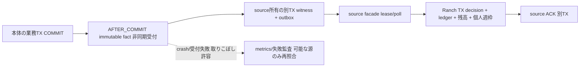
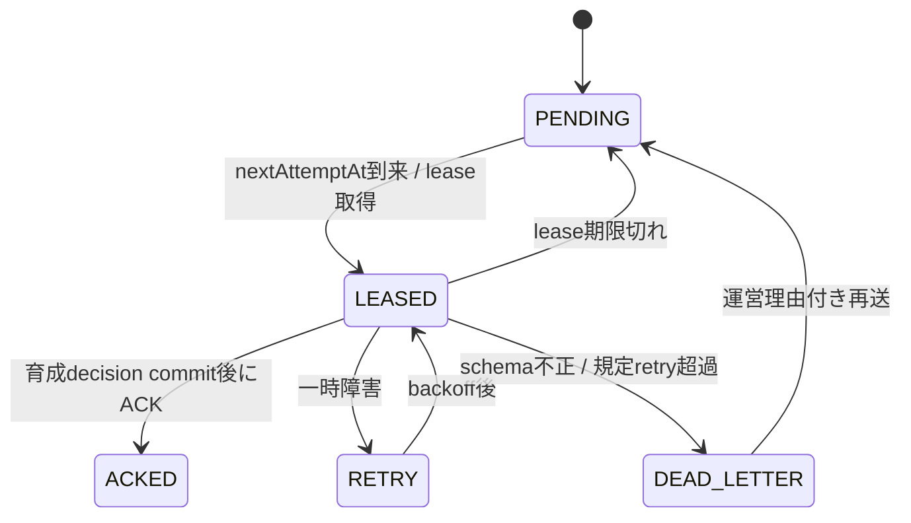
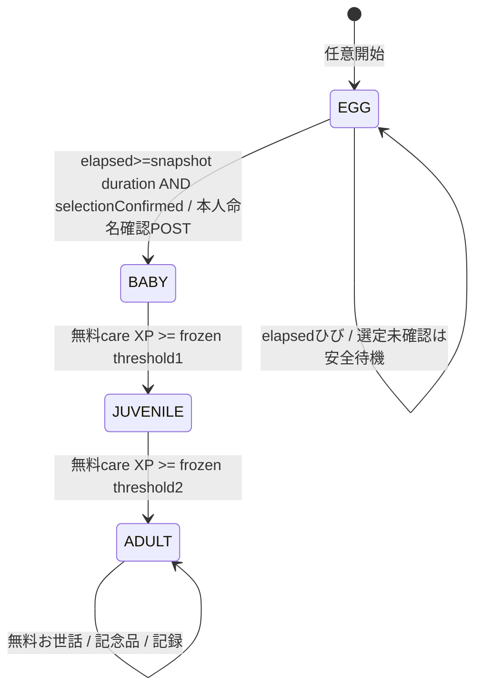

# F04.7-02 報酬・永続配送・データ契約

> **ステータス**: 🟡 Phase 1製造中（仕様採択済み、73AC・実機・公開は未完了）
> **正本入口**: [F04.7](../F04.7_gamification.md)
> **区分**: 採択済み製造契約と未承認商品値を区別する。部分骨格の存在は全体合格を意味しない。

## 1. 四つの報酬源

全源のrecipientは本人のuser ID。チーム/組織のポイントを個人へ換算しない。actor（操作した人）とsubject/author（行為の本人）を別フィールドにする。source facadeが本体の認可/状態を確定した時だけfactを出し、ブラウザから報酬イベントを受け付けない。

| sourceType | 資格を得る瞬間 | canonical identity | 除外と注意 |
|---|---|---|---|
| `ATTENDANCE_RESPONSE` | 今回actor=subject、今回proxy=false、originalAdminId=nullの本人回答が初めてATTENDING/PARTIAL/ABSENTへ確定 | scheduleの正準ID + subject user ID | UNDECIDED、代理、管理者一括、取消、再編集は無報酬。ABSENTも有効な連絡でATとの差なし |
| `TIMELINE_ORIGINAL` | サーバーが通常の本人原投稿と判定して保存完了 | 原投稿の正準ID | コメント、反応、repost、活動記録共有、Blog共有、自動転載などderived originを除外 |
| `BLOG_FIRST_PUBLISH` | 本人著作の記事が初めて有効な公開状態へ確定 | 記事の正準ID | 下書き保存/編集/公開撤回後の再公開は無報酬。公開actorがeditor/SYSTEMでもrecipientはauthor |
| `PERSONAL_RECALL_COMPLETE` | 無料本人entryの新想起sessionがサーバー上でCOMPLETEDへ初遷移 | entryの正準ID + UTC reward week | 開始だけ/中断/既存attempt APIの保存/途中回答/同entryの再session/編集version差は無報酬 |

出欠の `firstRespondedAt` はproxy/UNDECIDEDでも付きうるので資格の証明にしない。当時request contextと信頼できるnative初回履歴証拠で資格をcaptureする。commit後のtransport witness UNIQUE(schedule ID,subject ID)は記録済みfactの配送dedupだけで、witness不在から初回を推定しない。証拠不明は0。過去proxyフラグの残留を今回代理の判定へ流用しない。本人の複数予定を本人一括操作で処理する導線がある場合は一件ごとに同じactor/subject/今回proxy判定を通す。管理者がメンバーへ一括登録するケースは対象外。

Timeline originはクライアント任意入力を信用せず、通常投稿/内部共有それぞれのサーバー入口で確定する。原文本文の文字数や内容の質を報酬条件にしない。同ID再付与に加え、新IDでも同じ本人・同じ機能・同じUTC週の同内容完全一致は最初の一件だけを対象とする（2026-10-04ユーザー裁可、意味AI判定なし）。本文・タイトル・添付の組合せを比較し、Unicode NFC・改行・前後空白を正規化する。源件数/個人上限は併用する。空/無効投稿は本体の既存validationで拒否する。記事共有がTimelineに生まれてもBlog一源だけが対象で二重付与しない。

Blogの手動公開、一括公開、自己承認、承認者による公開、予約公開の**全経路**を共通の初公開witness/fact生成へ収束させる。予約公開ではactor=`SYSTEM`、recipient=author、subject=author。公開失敗/権限拒否ではwitness/outboxを確定しない。公開後削除では授与済みポイントを取り消さず、資料リンクだけ権限を再判定する。

### 1.1 過去データと初公開witness

rolloutAtより前の活動は無報酬。既存公開記事の公開撤回→再公開や既存本人回答の編集を「新規初回」と見なさない。実装migrationではソースデータだけから既存witnessを `HISTORICAL` として埋め、現在DRAFTでも過去公開の痕跡がある記事を含める。既存の初公開痕跡が無い場合は、rollout時点に既存だった記事を保守的にHISTORICAL扱いする。旧データの再解釈で報酬を発行しない。DBの現状調査/リセットは今回行わない。

### 1.2 新想起完了契約

Phase 1 は一session一entry。一entryの問題一覧/方向/required prompt IDを開始時にサーバーがsnapshotする。sessionは `STARTED → COMPLETED` または `CANCELLED`。0prompt/空の自由想起対象は開始時400。本人の他のsessionをIDだけで参照できない。

完了時は全required promptについて `ANSWERED`（非空回答）か `FORGOT`（明示的な忘却申告、answer=null）のいずれかをサーバーが検証する。自由想起には一つの自由回答promptを作る。selfRatingはREMEMBERED/PARTIAL/FORGOT、報酬量に差なし。未回答をFORGOTへ自動補完しない。送信時に最新entryの問題へ差し替えずsnapshotへ照合し、削除/所有権喪失は完了拒否。session完成・attempt保存はreflection本体TX、source outboxはcommit後の独立transport TX。

途中保存から再開可能。STARTEDのsessionは期限を設けず、本人entryが存在して本人所有の間はsnapshotのまま再開できる。削除/所有権喪失で完了不可、アカウント削除時はsessionも削除する。start/answers/complete/cancelはreflection自身の永続command表で冪等化する。完成後の再送は同結果。entryを編集してversionを変えても、sessionを並べ替え/再作成しても UNIQUE(user ID,entry canonical ID,reward week)で一週一回のみ。新しい別entryの作成自体を同一内容と自動判定する仕組みは加えないが、source件数上限と個人全体上限で利益を制限する。人間の意味ある努力・虚偽のFORGOTを完全自動判定できるとは主張しない。

STARTED時のreward_week/completed_atはNULL。初めてCOMPLETEDへ遷移するサーバー時刻をcompleted_at/occurredAtとして、そのUTC週をreward_weekへ同TXで固定する。日曜開始・月曜完了は月曜の週。session/witness/outbox/decisionはこの週に一致し、翌週の再送でも保存済みcompleted_atを再利用する。

## 2. 週上限と無料経路

rewardWeekはサーバーのoccurredAtをUTCで月曜日00:00へ切り下げた `DATE`。`[start,end)`、endは7日後。user TZ変更、夏時間、週の途中で所属追加は枠を増やさない。遅延配送は元occurredAtの週を使い、次週へ移さない。ポイント残高は週を越えて失効しない。上限は「その週に新たに与える量」で、装飾交換で消費しても枠が戻らない。

policyはUTC週境界の `effectiveAt` で有効化する不変version。週行にはその週policy ID/hash、cap、四源enabled/amount/countLimitを保存する。週途中に量を変更せず、次週以降を新versionで予約する。worker処理時の最新policyを過去factへ当てない。

運営は出欠/TL/Blogを個別OFF可能。正のglobalCapで報酬を有効にするpolicyは、無料PERSONAL_RECALL_COMPLETEをONにし、個人想起の量/件数も同じ不変設定へ固定する（全利用者quotaを跨ぐ満額保証のpublish invariantは設けない）。件数とポイント量を混ぜない。sourceCount>=countLimitならSOURCE_COUNT_CAPPEDで0、未達なら `awardedPoints=min(amountPoints,globalCap-awardedTotal)`。残0は正常のCAPPEDで0。異なるcanonical factをterminal decisionにして再送/翌週再解釈を禁止する。

| 判定 | source countの消費 | ポイント |
|---|---|---|
| 既存canonical decisionへの再送 | なし | 既存結果、加算なし |
| derived/historical/rollout前/不適格 | なし | 0 INELIGIBLE |
| 本人休止/運営報酬停止/源OFF | なし | 0 NOT_PARTICIPATING/REWARDS_PAUSED/SOURCE_DISABLED |
| sourceCountが上限済み | なし | 0 SOURCE_COUNT_CAPPED |
| 源資格あり・件数枠あり・global残0 | 一件 | 0 CAPPED |
| 源資格あり・件数枠あり・global残あり | 一件 | min(amountPoints,remaining) AWARDED |

源OFFや停止のterminal0もdedupは残す。後日ON/再開しても同じfactは復活しない。無料capacity計算のcountLimitはこの規則で消費し、源OFFの行動を消費しない。

無料利用者が十分な異なる本人entryを持つ場合は、同日の想起でpoints上限へ到達できる設定例を検証する。entry quota/準備負担/適性差による全員同じ手間や全員満額は保証しない。活動pointsは追加装飾の楽しみで、activity0の成長は独立の無料careで保証する。日待ち/streak/課金を追加しない。

**検証専用fixture**: C=100、個人amount=25、個人countLimit=4、他源amount=10、careAmountXP=1、careWeeklyCapXP=5、成長閾値=[0,5,10]、plant価格10/ball価格20。これは本番初期値ではない。本番は全数値を運営が登録し承認するまで `enabled=false`、0を暗黙に有効な既定値として扱わない。fixtureのstage起点0を除く運営量/価格は正整数、上限はDB signed BIGINT内の安全範囲、乗算/加算はoverflowを検出する。

## 3. 本体保存優先のbest-effort受付と永続配送

**ユーザー裁可済み**: 本体保存を優先し、報酬は後から再処理、復元できない取りこぼしを許容する。sourceゲーム用witness/outboxのINSERT/FK/通信失敗で元業務をrollback/500にしない。業務commit後の安全なcallbackがimmutable factを非同期queueへ渡し、source所有の独立transport TXでwitness/outboxを一括保存する。新Activity中間domain/二重outbox/メールEmailOutbox転用なし。

factは実行時のsource ID/actor/originalAdminId/subject/author/origin/occurredAt/初回資格証拠を不変値としてcaptureし、元業務rollbackでは発行しない。callback/listener/scheduler/queue reject/outbox例外を元API応答へ伝播させない。失敗を握り潰さず、本文なし構造化ログ・metrics・運営失敗監査へ出す（DB障害中の監査INSERTを成功必須にしない）。bounded queue/backpressureで業務threadを待たせない。callback自身に加え、元TX内のgame-only fact capture/builder/aftercommit登録失敗も捕捉してskip/metricsにし、元業務rollback要因にしない。source自身の本来の業務validation/row保存失敗は従来どおり伝播する。非同期受付拒否でCallerRuns等の元thread同期DB処理へfallbackしない。transport workerは別beanのREQUIRES_NEW等でfresh TXを開始し、AFTER_COMMITに残る元TX resourceへ参加しない。

元業務commitからoutbox確定までのcrash/queue喪失はlost factとして許容し、すべての取りこぼしの観測/復元を保証しない。outboxが確定したfactだけを耐久retryし、ranch unique/lockで二重付与を防ぐ。本体成功全factにExactlyOnce/必ず後追い保証を主張しない。reconcileは当時のimmutable資格/時刻/recipientを信頼できる源のみ。現在state/status/author/proxyから初回を推測して再発行しない。証拠UNKNOWNは0、失った報酬を手動捏造しない。

source本体の一回のrow保存へ不変の本来の初回履歴metadataを含める案は下記の**製造契約**で、ゲーム専用追加table書込と区別する。native row自体の通常DB保存失敗は従来同様の業務障害だが、ゲームtransport別TX失敗は業務成功のまま。

### 3.1 状態/lease/retry

複数workerはsourceごとに短い `FOR UPDATE SKIP LOCKED` TXで一batchをlease。lease tokenとexpiresAtでACK/retryを比較更新し、古いworkerが新leaseを消さない。処理中はsourceのロックを保持しない。次pageは `(nextAttemptAt,id)` keyset、失敗一件が他件を止めない。lease時間/batch数/backoff最大/retry上限は運営必須設定で検証後有効化。指数backoffにjitter、schema/対象不整合はpoisonとしてdead-letter。再送は元event ID/occurredAt/canonical keyのまま。過去週policyが保存されているため長期遅延も元週へ反映可能。

定期配送workerは `mannschaft.ranch.delivery.worker.enabled=true` の明示環境だけに登録し、未測定の本番ではOFFを維持する。`interval-ms` と `lock-at-most` は `@PostConstruct` の `getRequiredProperty` で両方必須、正の有限intervalと `lock > interval` を検証し、片方でも欠落すれば起動を拒否する。annotationの `interval-ms:1000` / `lock-at-most:PT30S` は既存 `ScheduledBatchGuardTest` が間隔とlockを静的比較するためのmetadataであり、実環境の設定欠落を補う既定値ではない。実測した最大処理時間に合わせた明示設定と四源の実配送確認を、有効化の条件にする。

auth所有guardで既存users先lock/ACTIVE確認後、Ranch REQUIRES_NEW writerはuser単位にowner行をロックし、当該週budgetをUNIQUEで作成/ロック、同canonical decision存在を検査、参加期間/源enabled/容量を判定、台帳/残高/予算を一括commit。複数source同時配送・複数tabでもglobalCapを超えない。claim済みを示すDB uniqueとrow lockが正本でValkeyだけに依存しない。consumer commit直後・ACK前に停止しても再配送は元decisionを返す。

未参加userにはowner/個体/decisionを自動作成しない。source ACKのterminal_outcome=NOT_ENROLLEDを保存して完了し、源にevent ID/時刻/recipientの最小metadataだけ残す。遅延配送時にownerが作成済みでも、最初の参加時刻より前なら同結果。参加開始/休止/再開はowner participation periodに有効時刻を保存し、`occurredAt >= startsAt && occurredAt < endsAt` の期間で判定。表示OFFとは独立。休止中factはNOT_PARTICIPATINGのterminal0、再開後replayでも変えない。逆にactive期間に発生して配送時だけPAUSEDなら元週へ付与する（現在PAUSEDの給餌は不可）。源OFF/rollout前/historicalもterminal0。運営の配送一時停止は未処理を保留するだけ、報酬停止の有効期間はfact時刻で0判断する。運営停止と本人休止を区別する。

### 3.2 immutable envelope / 源初回の証明

envelope: eventId UUID、schemaVersion int、sourceType enum、sourceIdType LONG/UUID、canonicalSourceId正準string、scopeType PERSONAL/TEAM/ORGANIZATION、scopeIdType/canonicalScopeId nullable(PERSONALのみ)、actorKind USER/SYSTEM、actorUserId Long nullable(SYSTEMのみ)、originalAdminId Long nullable、subjectUserId/recipientUserId Long、occurredAt Instant、origin enum、sourceFactsは下表。actual actorはauth context、originalAdminId非NULLの代理/impersonationは無報酬。通常editor/SYSTEM Blog公開はauthor recipientで区別。clientからfact/量/時刻を受けない。

| sourceType | sourceFacts | origin |
|---|---|---|
| ATTENDANCE_RESPONSE | responseStatus ATTENDING/PARTIAL/ABSENT、isProxy=false、isFirstQualified=true（native履歴証拠） | SELF_RESPONSE |
| TIMELINE_ORIGINAL | postOrigin ORIGINAL、isNewPost=true | ORIGINAL |
| BLOG_FIRST_PUBLISH | publicationKind MANUAL/BULK/SELF_APPROVAL/EDITOR_APPROVAL/SCHEDULED、isFirstPublish=true（native履歴証拠） | FIRST_PUBLISH |
| PERSONAL_RECALL_COMPLETE | sessionId UUID、promptCount int>0、completionWeek DATE、isFirstCompletion=true | PERSONAL_COMPLETION |

LONGは正の十進数・先頭0なし、UUIDは小文字ハイフン形式。canonical ASCII240byte以下=`sourceType:sourceIdType:sourceId:USER:userId`、ARだけ`:WEEK:YYYY-MM-DD`。sourceTypeを含む値の全体をASCIIとして検証する。source-version/sessionIdを含めず、UNIQUE(user_id,source_type,canonical_key_hash)は週を除外。SHA256同hashで実byte不一致はpoison/rollback。同recipientが翌週再公開/再回答しても一生一回、ARだけ同entry週一回。source transport facadeは内部service identityで許可source/scope/shardを検証し、本文/学習回答/名前/DOB/メール/チーム名をpayloadへ複製しない。

canonical_key/acquisition_key/canonical_source_id/canonical_scope_idは完全一致の識別に使うためVARBINARYで保存する。ASCII validation後にASCII（UTF-8と同じbyte列）へ明示encodeし、JPAではbyte[]で扱う。復元も厳格ASCII decode・形式/長さ再検証とし、代替文字へ置換しない。APIの正準値は従来どおりstring（03）で、binaryのbase64表現を返さない。text列は全てutf8mb4_0900_ai_ciの表既定に従い、列単位charset/collation overrideを設けない（domain_db_design_principles原則8/SchemaCollationConsistencyIT）。

**source-owned native metadata契約（製造未完了）**: BlogPostEntityへfirstPublishedAt Instant NULL、firstPublishedAuthorUserId Long NULL、isPublicationHistoryKnown boolean。既存publishの一回の本体row UPDATEで最初だけ固定しunpublishで消さない。資格を確定した当時actor/originalAdminIdが復元できなければreconcileしない。b3efd BlogPostEntity:221–224のunpublishはpublishedAt=NULL、:250–252 publishは毎回上書きなので現在publishedAt/statusは初回証拠にならない。既存履歴不明rowはUNKNOWN/HISTORICALで0、新rowのみ既知の履歴開始を宣言する。

attendance本体rowへfirstQualifiedSelfResponseAt Instant NULL、firstQualifiedSelfResponseStatus enum NULL、isSelfResponseHistoryKnown booleanを提案。新known rowの今回actor=subject/proxy=false/originalAdminId=NULL/ATTENDING・PARTIAL・ABSENTの初回だけ固定。既存履歴不明rowやfirstRespondedAtだけから初回を推定しない。markerが無いupdateは資格UNKNOWNで0。全保存経路のnative metadata統合とITが未完了のため、全初回を保証しない。

ゲーム専用witnessは元業務commit後にtransport TXでINSERT、outboxと一括rollbackしても本体は成功。初回proofの代わりにwitness不在を使わない。witness/outbox喪失後の現在stateからの再公開を初回にしない。AR completionは本体session completedAt/rewardWeekでnative proofを保持し、source outboxはその後の別TX。
## 4. 無料のお世話・永久装飾交換

### 4.1 FREE_BASICと成長

孵化後の基本給餌はcostPoints=0、activity0/残高0/policyなし/活動報酬停止でも利用できる。明示的な給餌成功だけがcare XP対象、ログイン/表示/放置/AI会話回数は0。同じ日に週のcare XP枠まで利用でき、日別gate・待ち・streakなし。枠後も無償触れ合い/反応は使え、XPだけ0。未使用XP枠は繰越しないが既得XPは失効/減少しない。通常rate limitは連打防止のみ、週分の操作を同日利用できる設定を公開gateで検証する。

care ruleはUTC週境界から有効な不変version。amountXp>0、weeklyCapXp>0、0<juvenileXp<adultXp、同じcare量/枠/閾値を全speciesへ適用。成長閾値は個体作成時snapshotで凍結。user+week budgetとowner/dinoを同TXでlockし、gainedXp=min(amountXp,weeklyCapXp-awardedXp)。command uniqueとbodyhash（type/path/If-Match含む）により二tab/retryでもXP超過0。成功result/ledger/budget/XP/stageを原子更新する。再送resultは不変で、FEは別途最新stateを取得する。本人PAUSEDの給餌は409、再開で同個体/XPを維持する。

新規ownerはEGGで作成。species抽選は卵期間の選定確認時serverで一度だけ、catalog version/species/habitatを同TX保存。HABITAT_RANDOMのhabitatはLAND/SEA/AIR、同じ初期16種×4外見をhabitatで絞って候補組均等抽選し、種別で成長量を変えない。同command/既存ownerのretryで乱数を引き直さない。

### 4.2 pointsの装飾交換

初期catalogは少数の永久置物（starter plant/ball等。実素材は別裁可）だけ。SKUは自然key、価格は運営不変price version、全user同額、ポイント購入/送金なし。購入はowner lock→残高/priceVersion/未所有検証→残高減算/台帳/SHOP inventory/command結果を同ranch TX。残高不足409、同SKU既所有は409追加消費なし。同key同bodyは元結果、別body409。refund/売却/譲渡を初期に設けない。reward pause/point policyなしでも既得ポイントで交換可、shop control OFFのみ503。

置物はSHOPまたはLEGACY_BADGE由来。同一user+acquisitionKind+acquisitionKey uniqueで再配送/購入競合を防ぐ。SHOPのkeyはSKU、LEGACY_BADGEは型付きlegacy badge ID+award period。betaのentitlementは装飾とは独立で維持する。

LEGACY_BADGEは本人が記念品取込POSTを明示したときだけ、旧取得行を最大100件ずつ走査して承認済みcatalogへ写す。内部catalog keyは `LEGACY_BADGE:<canonical decimal badgeId>`、元periodは欠損なら空文字、全periodを元UTF-8 bytesの無paddingBase64urlでASCII化した型付きLB1 acquisition keyで一意化する。未承認の行を飛ばしても恒久high-watermarkにはせず、後日承認後のcursor 0再走査を許す。旧名前/説明/icon URLは移さず、元badge可用性と運営承認素材を別に検証する。元earnedOnは日付のみなのでRanchのawardedAtは取込時UTC MICROSとし、元獲得時刻を捏造しない。

## 5. DDL契約（Phase 1のみ）

以下はPhase 1骨格の列/制約契約。診断/確認参照/愛着とcleanup統合も含む実migration照合は未完了で、この一覧だけを完成実装としない。全表に明示 `ENGINE=InnoDB DEFAULT CHARSET=utf8mb4 COLLATE=utf8mb4_0900_ai_ci`。新増加表は `UuidV7Entity` と `id BINARY(16) PK`。この基底はtimestampを持たないためcreated_at/updated_atを各表で明示。user_idは既存usersのBIGINT、クロスドメインFKなし。Instant列はUTC `DATETIME(6)`、EnumはVARCHAR、booleanはis_ prefix。列のnull記載以外はNOT NULL。BIGINT残高・XPは非負CHECK、外部JSONではdecimal string。

| 表 | 列（共通id/created_at/updated_at以外） | 制約/index |
|---|---|---|
| `ranch_owners` | user_id BIGINT、status VARCHAR(20) ACTIVE/PAUSED、balance BIGINT、view_mode VARCHAR(20) ROOM、render_style VARCHAR(20) DEFAULT 'PIXEL'、motion_mode VARCHAR(20) NORMAL/REDUCED/STOPPED、is_sound_enabled BOOLEAN、sound_volume INT、version BIGINT | UNIQUE(user_id)、CHECK(balance>=0,version>=0,0<=sound_volume<=100)、status/mode CHECK、CHECK(render_style IN ('PIXEL','PAINT_2D'))。render_styleはNOT NULL、user_idがシャードキー。isVisibleはdashboard表示設定の投影でこの表に重複保持しない |
| `ranch_dinosaurs` | owner_id BINARY(16)、user_id BIGINT、habitat VARCHAR(8) NULL、species_key VARCHAR(60) NULL、variant_key VARCHAR(32) NULL、species_catalog_version BIGINT NULL、assignment_method VARCHAR(30) NULL、selection_confirmed_at DATETIME(6) NULL、assignment_rule_version VARCHAR(80) NULL、egg_started_at DATETIME(6)、egg_ready_at DATETIME(6)、egg_rule_snapshot JSON、hatched_at DATETIME(6) NULL、name VARCHAR(160) NULL、named_at DATETIME(6) NULL、stage VARCHAR(20)、xp BIGINT、growth_rule_snapshot JSON、version BIGINT | UNIQUE(owner_id)、index(user_id)、owner同domainFK、CHECK(xp>=0/habitat LAND/SEA/AIR/stage EGG/BABY/JUVENILE/ADULT)。EGGはhatched_at/name/named_at全NULL、孵化後は全NOT NULLかつnamed_at=hatched_at。名前のunique制約なし、UTF-8 512byte以下CHECK、抽選結果再作成・確定名更新禁止 |
| `ranch_participation_periods` | owner_id BINARY(16)、user_id BIGINT、starts_at DATETIME(6)、ends_at DATETIME(6) NULL | index(user_id,starts_at)、CHECK(ends_at IS NULL OR ends_at>starts_at)、owner lockで期間の非重複を保証。ownerとの同domainFK可 |
| `ranch_reward_policies` | version_number BIGINT、effective_at DATETIME(6)、schema_version INT、settings_json JSON、content_hash BINARY(32)、published_by BIGINT、published_at DATETIME(6) | UNIQUE(version_number/effective_at)、公開後UPDATE禁止（新versionのみ）、index(effective_at)。全user共通設定だがUUID採番を採用 |
| `ranch_week_budgets` | owner_id BINARY(16)、user_id BIGINT、week_starts_on DATE、policy_id BINARY(16)、rule_snapshot JSON、global_cap BIGINT、awarded_total BIGINT、source_counts JSON、version BIGINT | UNIQUE(user_id,week_starts_on)、CHECK(0<=awarded_total<=global_cap)、index(owner_id,week_starts_on)、owner同domainFK可。global policy IDはopaque参照、物理FKなし |
| `ranch_reward_decisions` | owner_id BINARY(16)、user_id BIGINT、event_id BINARY(16)、source_type VARCHAR(40)、canonical_key_hash BINARY(32)、canonical_key VARBINARY(240)、reward_week DATE、policy_id BINARY(16)、status VARCHAR(40)、requested_points BIGINT、awarded_points BIGINT、occurred_at DATETIME(6)、decided_at DATETIME(6) | UNIQUE(user_id,source_type,canonical_key_hash)、UNIQUE(event_id)、index(user_id,decided_at,id)。status AWARDED/CAPPED/SOURCE_COUNT_CAPPED/SOURCE_DISABLED/NOT_PARTICIPATING/REWARDS_PAUSED/INELIGIBLE、point非負CHECK。policy物理FKなし |
| `ranch_point_ledger` | owner_id BINARY(16)、user_id BIGINT、decision_id BINARY(16) NULL、command_id BINARY(16) NULL、entry_kind VARCHAR(20) REWARD/CARE/PURCHASE、delta_points BIGINT、balance_after BIGINT、delta_xp BIGINT、dinosaur_id BINARY(16) NULL、rule_snapshot JSON、occurred_at DATETIME(6) | UNIQUE(decision_id)、UNIQUE(user_id,command_id)、index(user_id,occurred_at,id)、CHECK(balance_after>=0)。REWARDはdecision/points>0/XP0、CAREはcommand/dino/points0/XP>=0、PURCHASEはcommand/points<0/XP0 |
| `ranch_commands` | owner_id BINARY(16)、user_id BIGINT、idempotency_key BINARY(16)、command_type VARCHAR(30)、body_hash BINARY(32)、result_json JSON、completed_at DATETIME(6) | UNIQUE(user_id,idempotency_key)、index(owner_id,completed_at)、成功のみ同TX保存、失敗では操作IDを消費しない |
| `ranch_collectible_catalog` | collectible_key VARCHAR(80) PK（master自然キー例外）、label_key VARCHAR(120)、asset_key VARCHAR(160)、source_kind VARCHAR(30)、is_active BOOLEAN、created_at/updated_at DATETIME(6) | catalogは運営承認assetのみ。UuidV7Entity対象外理由を番人へ登録 |
| `ranch_collectible_inventory` | owner_id BINARY(16)、user_id BIGINT、collectible_key VARCHAR(80)、acquisition_kind VARCHAR(20) SHOP/LEGACY_BADGE、acquisition_key VARBINARY(160)、legacy_badge_id VARCHAR(80) NULL、legacy_award_period VARCHAR(40) NULL、sku_key VARCHAR(80) NULL、price_version BIGINT NULL、awarded_at DATETIME(6)、is_revoked BOOLEAN | UNIQUE(user_id,acquisition_kind,acquisition_key)、index(owner_id,is_revoked)。SHOPはsku/price必須・legacy両NULL、LEGACY_BADGEはlegacy両必須・sku/price NULLのCHECK。legacy_badge_idは元identityの実値を保持するnullable文字列で、完全一致uniqueはbinary acquisition_keyが保証する。period欠損は空文字 |
| `ranch_room_placements` | owner_id BINARY(16)、user_id BIGINT、slot_key VARCHAR(30)、inventory_id BINARY(16) NULL、version BIGINT | UNIQUE(owner_id,slot_key)、UNIQUE(owner_id,inventory_id)、owner/inventory同domainFK可、index(user_id)。SHELF_1/2/3の三行を開始時NULL/version0で作成。取り外しはNULL化/version+1、行削除禁止 |
| `ranch_operational_controls` | id TINYINT PK CHECK(id=1)、is_care_enabled BOOLEAN、is_shop_enabled BOOLEAN、is_delivery_paused BOOLEAN、version BIGINT、updated_by BIGINT、created_at/updated_at DATETIME(6) | singleton例外、初期care/shop=false。care/shop/活動rewardは独立。変更監査必須 |
| `ranch_reward_pause_periods` | starts_at DATETIME(6)、ends_at DATETIME(6) NULL、reason_code VARCHAR(40)、changed_by BIGINT | index(starts_at)、重複不可をsingleton lockで保証。停止中fact0、配送pauseとは別 |

| 追加表 | 列（共通UUIDv7 id/created_at/updated_at以外） | 制約/index |
|---|---|---|
| `ranch_care_rules` | version_number BIGINT、effective_at DATETIME(6)、amount_xp BIGINT、weekly_cap_xp BIGINT、juvenile_xp BIGINT、adult_xp BIGINT、content_hash BINARY(32)、published_by BIGINT | UNIQUE(version_number)、UNIQUE(effective_at)、全量正/juvenile<adult CHECK、不変。管理shard、user側物理FKなし |
| `ranch_care_week_budgets` | owner_id BINARY(16)、user_id BIGINT、week_starts_on DATE、rule_id BINARY(16)、rule_snapshot JSON、weekly_cap_xp BIGINT、awarded_xp BIGINT、version BIGINT | UNIQUE(user_id,week_starts_on)、CHECK(0<=awarded_xp<=weekly_cap_xp)、owner同domainFK、rule opaque参照 |
| `ranch_species_catalog` | species_key VARCHAR(60)、catalog_version BIGINT、habitat VARCHAR(8)、asset_key VARCHAR(160)、is_active BOOLEAN | UNIQUE(catalog_version,species_key)、index(catalog_version,habitat,is_active)、habitat CHECK。旧is_diagnosis_poolによるrandom除外は撤去する。DIAGNOSIS/HABITAT_RANDOM共通の初期16種×4外見catalogとvariant資格を使う（名簿/素材未裁可） |
| `ranch_shop_items` | sku_key VARCHAR(80)、price_version BIGINT、collectible_key VARCHAR(80)、price_points BIGINT、is_active BOOLEAN | UNIQUE(sku_key,price_version)、CHECK(price_points>0)、catalog同domain参照。不変price行、現行版は運営catalog公開snapshotで指定 |
| `ranch_admin_commands` | actor_user_id BIGINT、idempotency_key BINARY(16)、command_type VARCHAR(30)、body_hash BINARY(32)、result_json JSON、completed_at DATETIME(6) | UNIQUE(actor_user_id,idempotency_key)、owner不要。policy/care rule/controlの管理shardTX内成功保存 |

source retryは各source所有の `{source}_ranch_admin_commands`（同列/unique、ranch owner FKなし）へ保存しoutbox状態変更と同source TX。権限はSYSTEM_ADMINをsource facadeへ伝達・検証、同key/bodyは元結果、別body409。retryをglobal管理TXへ跨がせない。
source側は四ドメインそれぞれ `{source}_ranch_outboxes` と資格witnessを所有する。outbox列: id BINARY(16) PK、schema_version INT、event_type VARCHAR(40)、scope_type VARCHAR(20)、scope_id_type VARCHAR(8) NULL、canonical_scope_id VARBINARY(80) NULL、recipient_user_id BIGINT、canonical_key VARBINARY(240)、payload_json JSON、occurred_at DATETIME(6)、status VARCHAR(20)、terminal_outcome VARCHAR(40) NULL、attempt_count INT、next_attempt_at DATETIME(6)、lease_token BINARY(16) NULL、lease_expires_at DATETIME(6) NULL、last_error_code VARCHAR(80) NULL、acked_at DATETIME(6) NULL、created_at/updated_at DATETIME(6)。UNIQUE(event_type,canonical_key)、index(status,next_attempt_at,id)、index(scope_type,canonical_scope_id,status,next_attempt_at,id)、CHECK(attempt_count>=0)。ACKED時terminal_outcome/acked_at必須、LEASED時token/expiry必須。源所有の物理shardへ置き、他domain FKなし。

各witness共通列はid BINARY(16)、source_id_type VARCHAR(8)、canonical_source_id VARBINARY(80)、recipient_user_id BIGINT、kind VARCHAR(20) HISTORICAL/QUALIFIED、qualifying_at DATETIME(6) NULL（HISTORICALのみNULL可）、event_id BINARY(16) NULL（HISTORICALのみNULL可）、created_at/updated_at DATETIME(6)。源IDの正準値を保存するtransport証跡なのでsourceへの物理FKは付けず、source削除でも上書きしない。

| source内表 | 追加列 | 固定unique/index |
|---|---|---|
| schedule_ranch_witnesses | なし | UNIQUE(source_id_type,canonical_source_id,recipient_user_id)、index(recipient_user_id,qualifying_at) |
| timeline_ranch_witnesses | なし | UNIQUE(source_id_type,canonical_source_id)、index(recipient_user_id,qualifying_at) |
| blog_ranch_witnesses | なし | UNIQUE(source_id_type,canonical_source_id)、index(recipient_user_id,qualifying_at)。全公開経路共用 |
| reflection_ranch_witnesses | reward_week DATE | UNIQUE(recipient_user_id,source_id_type,canonical_source_id,reward_week)、index(recipient_user_id,qualifying_at) |

source outbox keyはARのみentry+user+completionWeek、他源は一生一回。source commit後のtransport TXでwitness勝者だけoutboxを作り、retry時に既存witnessを上書きしない。

reflection側 `reflection_recall_sessions`: id BINARY(16) PK、user_id BIGINT、entry_id_type VARCHAR(8)、entry_source_id VARCHAR(80)、reward_week DATE NULL、status VARCHAR(20)、prompt_snapshot JSON、original_snapshot JSON、answers_json JSON、self_rating VARCHAR(20) NULL、started_at DATETIME(6)、completed_at DATETIME(6) NULL、cancelled_at DATETIME(6) NULL、version BIGINT、created_at/updated_at DATETIME(6)。index(user_id,status,started_at,id)、CHECK(COMPLETEDならcompleted_at/reward_week/self_rating必須、それ以外completed_at/reward_week NULL)。完了時required全件検証。新表からusersへFKなし。entry同domainFKは既存物理ID型と一致する場合のみ追加。

`reflection_recall_commands`: id BINARY(16)、user_id BIGINT、idempotency_key BINARY(16)、session_id BINARY(16)、command_type VARCHAR(20) START/ANSWERS/COMPLETE/CANCEL、body_hash BINARY(32)、result_json JSON、completed_at DATETIME(6)、created_at/updated_at DATETIME(6)。UNIQUE(user_id,idempotency_key)、index(user_id,session_id)、session同reflection内FK。reflection TX内で成功時保存、同key同bodyは元結果/違うbody409。ranch_commandsへ跨ぐTXは行わない。冪等scopeは各ドメイン内user+idempotencyKeyで、type/path/resource/versionもbody正準hashへ含める。ranchの公開commandIdはRanchCommand.id(UUIDv7)で別の入力keyとは同値と仮定しない。

policy masterは管理shard、user shardのbudget/decisionへ物理FKを張らず署名/hash検証済み不変snapshotとopaque UUIDを保持する。配信されていないpolicy週は処理をretryし、最新別policyへfallbackしない。ownerが有効な間、貯蓄/台帳/dedup/commandは失効しない。

最終アカウント削除はsource/ranchの各DomainCleanupServiceがuser ID通知を冪等処理する。まずuser tombstoneで新操作/配送を拒否、ranchはplacements→inventory→ledger/decisions/commands/point budgets/care budgets/periods→dino→ownerを同user shardで削除、reflectionはsession/command/witness/outboxの本人行を削除。他源の本人transport行もそれぞれ削除し、クロスFKなしで孤児を残さない。未処理outboxはACCOUNT_DELETED ACKまたは同source cleanup削除し、workerとの競合はuser tombstone照合で再作成を禁止する。共有記事等の本体存続は各sourceの既存退会契約に従う。既存セキュリティ監査だけは既存保全期間へ従い、本文・学習回答を含む新学習snapshotを監査へ退避しない。削除完了の技術ID件数のみ監査する。ranch休止/非表示をアカウント削除と扱わない。

上記DomainCleanupServiceは最終アカウント削除に追加する契約名であり、既存共通部品の存在を意味しない。ユーザー承認済み: 退会申請中は本人ranchアクセス・操作・新報酬の獲得を停止して恐竜アバター/確定名/XP/残高/置物を保持し、取消で同一userの同じ個体を戻す。申請前の参加状態ACTIVE/PAUSEDを保持し、取消だけで元の休止を勝手に解除しない。WithdrawalRequestedEventを不可逆削除の入口にしない。既存authの取消復帰通知/状態から同じ申請試行IDの復帰を反映し、AccountPurgedEventで最終削除を行う。UserAnonymizedEventは本体で取消不能の最終削除状態と確認できる経路だけを確定cleanupへ接続し、取消可能な退会申請と混同しない。運営の育成/報酬/配送/backgroundがOFFでも停止・復帰・最終cleanupのライフサイクル処理は継続する。申請中の活動を取消後に遡及付与せず、既得の記録と重複防止を保持する。申請取消後の古い通知は既存withdrawalAttemptIdと現在auth状態で拒否する。auth所有guard・PURGING barrier・遅配拒否・再送回復を03の順序で統合し、実MySQL race証明までは未検証。汎用世代表を先行追加しない。保持期間は本体の退会取消期間に従い、ranch独自の永久保存を追加しない。

診断completedAt/確認expiresAtはMICROSへ切り揃えDB/immutable JSON/HMAC/cursorの同じ値を使う。

新日時には裁可済 [UTC瞬間方針](../../architecture/datetime_policy_utc_instant_vs_wallclock.md) §1/4を適用し `Instant`。旧 `.claudecode.md` §20のLocalDateTime/Instant禁止は旧実装保持説明として参照し、新ranchへ採らない。既存entity/serializer/JVM TZは変更しない。Jpaと生SQLとAPIの往復をUTC/JST/非JSTで検証する。生SQLの現在時刻はUTC_TIMESTAMP(6)、migrationもUTC関数。UuidV7Entity実体が要求するBINARY(16)とDDLを一致させる。

Flywayは必須だがこの設計PRではSQLを追加しない。実装時 `V{origin/main全体最大major+1}.{UTCyyyyMMddHHmmss}`、merge直前に再採番。既存migration改変禁止。DDL実schema・UUID物理型・collation・UTC・旧badge/entitlement保全はFlywayFromScratchMigrationTestの既存MySQLに相乗りし検証する。

### 卵・選定adapterの契約

egg_started_atはserver初期化時刻、egg_ready_at=started_at+凍結egg duration、egg_rule_snapshotはdurationSecondsとcrack thresholds/asset keys/version。約7日604800秒と[0,259200,432000,604800]は提案値で、本番既定値ではない。

`ranch-development-v1` は `mannschaft.ranch.development-fixtures=true` の非本番profileだけで読む暫定開発fixture。卵duration=604800秒、small/wide crack=259200/432000秒、無料care=20XP/回、週care cap=100XP、juvenile/adult=60/100XPとし、同じ週・同じ日でも5回で成体へ到達できる。このversionと数値は旧純粋試験fixture（care 1XP等）とは別で、本番運営公開値として未承認。既存個体のegg/growth snapshotをfixture変更で上書きしない。ひび段階/hatchReadyはGETでserverTimeから算出、GET自体でstageを更新しない。hatchReady=`now>=egg_ready_at && selection_confirmed_at!=null`。未確認/未成熟はstage EGGのまま安全待機。

次回部屋アクセスでFEがhatchReadyを確認して命名導線を出し、確認後だけPOST hatchへnameを送る。owner/dino lock下でEGG→BABY/hatched_at/name/named_at/commandを同TX保存する。hatched_at=named_atはserverの同一Instant、名前と孵化の片方だけ保存しない。二tab/retryでも孵化・命名一回、points/care XP増分0。本人PAUSEDでも孵化は可（成長加算なし）、care control OFFなら安全待機/503。孵化後のみ無料care XP対象。EGGのXPは0、BABY起点0、成長閾値とcare量は正。CHECK:未選定はspecies/catalog/method/confirmed NULL、選定済みはspecies/catalog/method/confirmed必須、EGGはhatched_at/name/named_at NULL、BABY以降はhatched_at/name/named_at/confirmed必須。

恐竜名はUnicode前後空白除去→NFC正規化後に、Unicode拡張書記素クラスタ（見た目の一文字）で1〜10文字。FE/serverで同じUnicode segmentation versionと境界fixtureを固定し、Java String.length、SQL CHAR_LENGTH、HTML maxlength=10だけを10文字の判定に使わない。結合文字・ZWJ絵文字は表示の一文字で数える。許可された絵文字連結用ZWJを不可視文字の一括拒否へ巻き込まない。空白/不可視文字だけ/不正不可視文字、改行・制御文字、UTF-8 512byte超または160 code point超を拒否する（異常に長い結合列への保存上限）。通常名の10文字制限と保存上限は別で、上限超を切り捨て保存しない。確定したnameは同個体で不変、名前変更用command/APIなし。診断・出生割当に使う本人氏名とは別フィールドで、名前を報酬outbox/log/auditへ複製しない。

選定adapter method=HABITAT_RANDOM/BIRTH_STYLE/DIAGNOSIS。未承認算法/診断本体は有効化しない。HABITAT_RANDOMは同catalogのhabitat該当species＋variant組を均等抽選し一度保存。BIRTH_STYLEはauth読取facadeから本人氏名/生年月日を取得し承認版の決定的対応表で算出した本人resultを利用する。DIAGNOSISは本人COMPLETED resultのprovider/typeCode/mappingVersionを検証する。ranchには元PIIや回答を複製せずopaque result ID/種/variant/対応表版のみ保存。出生確認は03のauth所有opaque UUID参照・revision・用途・nonce・10分期限・既存HMAC契約を使う。

出生commandは03のauth guard下で本人revisionを照合・派生数計算し、raw PIIをwriterへ渡さない。profile変更時は再確認、成功済み同keyはlive profile検査前に当時のresultを返す。鍵rotation後旧参照はfail closed。表示styleはowner.render_styleだけを更新し、species/assignment/growth snapshotを変更しない。
### 種とバリエーションの保存境界（2026-10-03）

初期診断は16 species×各4 variant。speciesKeyとvariantKeyは別の不変IDで、diagnosisの全64 typeCodeをcatalog/mapping version付きの組へ対応付ける。バリエーションに能力/成長/報酬差はなく、成長/style切替でも同じ組を保持する。将来species数を64へ増やしても、旧個体や旧mappingを勝手に置換しない。EGG未選定のvariant_keyはNULL、選定確認後はspeciesとvariantの両方を必須にする。catalogは初期16種の確定名簿と4デザイン登録後に有効化し、存在しない組を拒否する。

追加catalog契約案: ranch_species_variants（UUIDv7 id、species_key VARCHAR(60)、catalog_version BIGINT、variant_key VARCHAR(32)、appearance_definition JSON、asset_manifest_key VARCHAR(160)、is_active BOOLEAN、created_at/updated_at DATETIME(6)）、UNIQUE(catalog_version,species_key,variant_key)。appearance_definitionは運営承認の色/体型/模様参照だけで、ユーザーuploadや自由URLなし。部位anchor/接地が合わない体型へ単純拡縮だけで流用しない。ranch内のmaster参照、クロスdomainFKなし。ランダムは同じ初期16種×4外見からLAND/SEA/AIRの該当する有効species＋variant組を均等抽選し、catalog/variant資格を版固定する。

### 本人結果を保存する境界（詳細案）

診断ドメインを結果の正本とする。ranchに回答・生年月日・本人氏名を複製しない。完成した結果は不変snapshotとして保存し、新たな診断は新result IDを作る。占いも恐竜の割当だけを残す従前案から、本人が見返せる算出結果と独自説明を残す案へ更新する。生年月日・名前そのものは引き続き計算時のみ利用し、snapshot・本人結果/履歴API・共有・ログ・監査へ出さない。本人入力確認表示は03のauth birth-profile GETに限定する。

結果保存案: diagnosis_resultsにid(UUIDv7)、user_id(BIGINT)、method(DIAGNOSIS/BIRTH_STYLE)、result_schema_version、rule_version、normalization_version(nullable)、questionnaire_version(nullable)、scoring_version(nullable)、mapping_version(NULL可)、source_profile_revision(nullable BIGINT、内部metadata)、completed_at(UTC)、result_snapshot(JSON)を持つ。source_profile_revisionはDIAGNOSIS=null、BIRTH_STYLE>=0。authのConfirmedBirthNumbersは内部の派生数とprofileRevisionを持ち、保存結果のOwnedResult内部metadataへそのrevisionを渡す。公開Summaryに追加しない。snapshotには64 typeCodeと軸結果、または数秘術で得た数、および各6言語の独自説明を置き、入力値/全回答/自由入力を含めない。完成時にschemaで許可fieldとサイズ上限を検証する。PK以外に(user_id,method,completed_at,id) indexを持ち、users/ranchへのクロスドメインFKを作らない。計算結果もprivateとして扱う。結果の作成API・session/command・snapshotの具体JSON schemaは診断モジュール設計で補完し、この記述だけを完成DDLとして実装しない。

ranchの出生選定snapshotには利用したresultのopaque IDと固定した種/variant/対応表版だけを保存する。auth guard callback内の非TX domain facadeは03の単一契約に従い、Ranch成功commandをPRIMARYで先にlookupして、既success再送をlive検査前に返す。初回の出生選定はlive確認ref revision Rを検証した後、診断のPRIMARY SELECT-only独立TX（routingのためreadOnly=false）で本人COMPLETED BIRTH_STYLE resultのsourceProfileRevision=Rを照合し、固定DTOをranch REQUIRES_NEW writerへ渡す。新refで旧プロフィール由来resultを採用すると409。writerからauth/diagnosisを呼ばない。診断の保存とranchの選定確定は別操作・別TX。選定が失敗しても本人resultを失わず、result取得GETから再採点・再抽選・個体作成しない。

再読込/別端末/採点や説明master変更後も過去resultは当時のsnapshotで見られる。原入力なしでも閲覧できるよう、結果表示を再計算に依存させない。本人休止・非表示では保持し、退会申請中はアクセス停止、取消は同じ結果を復帰、最終アカウント削除時には診断自身のcleanupで本人result/session/commandを削除する。workerが削除済みuserへ再作成しない境界も既存cleanup契約に従う。

## 採択済み商品仕様の参照

三方式・独自数秘・本人の分身・同個体維持・96論理ドット/2D・無料成体の正本は[01 商品契約](01_product_phases.md)。

## 6. 愛着・完全一致証跡・配送の製造境界

愛着は非減衰で成長/権利/pointsとは独立。versioned unitはkind(FEED/TOUCH)＋UTC日、初回gain1、band0/1/5は開発fixture。同unitは別key/二tab/連打でも一加算、週care XP枠後も反応可、卵touch XP0、PAUSED/care OFFは反応のみ加算0。公開数値ゲージなし。

TL/Blog完全一致はそれぞれsource-owned、同user・同feature・同UTC週の新ID同内容を最初一件だけとする（2026-10-04ユーザー裁可）。本文・タイトル・添付の組合せにNFC・改行・前後空白の正規化を適用し、報酬記録へ原文を複製しない。実装のnormalizationVersion、length-prefix/HMAC、key rotation、保持期限、同時投稿winnerをfixtureへ対応付けて検証する。cross-source/想起意味比較はしない。製造・試験が未完了の源は公開gateを閉じる。

本体COMMIT→AFTER_COMMIT非blocking bounded queue→source-owned REQUIRES_NEW(witness+outbox原子)→短lease→ranch decision TX→token比較ACK。受付前lossはユーザー採択済み、durable受付後のみretry保証。CallerRuns/同期DB fallbackなし。queue満杯/transport失敗を本体HTTP失敗へ戻さない。queue1000/batch50/lease30s/attempt8/backoff1〜300s+jitterは開発fixture、本番自動採用しない。初回資格はnative履歴とtrusted actorを使い、現在状態/witness不在から捏造しない。

### 新ARの保存・公開境界

本人fresh ACTIVEと所有SQLを照合する。設問はTERM_CARD cue専用（200）とFREE_RECALL kind表示（10000）、合計1〜1501で開始時に凍結する。回答はHtmlSanitizer後のUTF16長、圧縮attemptは実JSON UTF8 65536bytes以下。途中保存と全回答完了を分け、完了・attempt・commandはreflection同一TXで一回保存する。保存ACK比較は私有SHA256/BINARY32、配送用AC67 HMACとは分離し、HTTP/outbox/log/exportに本文やhashを追加しない。原文は開始時ReflectionEntryResponseをCOMPLETED本人にだけ開示する。旧Recall単発へ報酬を追加しない。報酬witness/outboxの接続と実機証明は後続であり、このAPI製造だけで報酬完成とは扱わない。

AR私有2表は `V243.20261004182521__create_private_recall_sessions.sql`。commands→sessionsだけの同domain FK、user_id UNSIGNED、MICROS、7保存enumの許容値を明示する。配送witness/outbox/historical bootstrapは別の後続migrationであり、このschemaから報酬稼働を推定しない。展開は既存persisted_enum_deployment規約に従い読取り可能なバイナリとDDLを先配布し、旧taskの退場を確認してから新AR操作の公開を行う。台帳登録は実展開の証明ではない。

### reflection配送受付の製造checkpoint

V246.20261004191545__create_reflection_ranch_transport.sql は reflection の witness/outbox/admin-command 3表を新設する。V243を再定義しない。V243既存COMPLETEDセッションだけを本人・entry UUID・保存UTC週ごとにHISTORICALへ保守的bootstrapし、既存UuidV7セッションIDを行IDとして使う。旧Recall単発は新ARのsession完了証拠を持たずproducerへ接続しない。

新ARは mandatory ACTIVE/users lock→native独立commit→保護中に本文0の有限payload捕捉→auth正常proxy復帰→有界queue→current lifecycle lock→源独立witness/outbox原子受付の順。PURGING/PURGED/ABSENTで新規INSERTしない。CAPTURE/queue/源保存失敗はlossで、本体成功応答を保持する。CURRENT session読取は不変captureとの整合確認に限り、当時資格の再構成をしない。server設定 ranch.source.transport.queue-capacity は0〜1000、既定0は受付停止、元thread同期DBfallbackを行わない。

このcheckpointは耐久受付までの候補製造で、lease/backoff/consumer/ACK、四源health実Bean、実MySQL/HTTP/移行greenはまだ未証明。source transportの原文・私有hashはHTTP/exportに公開しない。reflection本人purgeの同TXでoutbox/witness/admin commandを削除する。耐久受付IT2は原子性/技術payload限定の試験で、fixture資格をHTTP時点資格の証明へ流用しない。

### ブログnative履歴と保守的cutover（製造済み・未検証）

V242.20261004202135__blog_native_history_and_ranch_transport.sql は既存全記事を履歴不明のHISTORICALとして固定する。新記事のis_publication_history_knownのみnative作成時にtrueとなり、is_ranch_publication_observedは公開flush後に単調trueを保つ。撤回、同PersistenceContextの次TX、再公開で履歴を消さない。early flush後同TX撤回は保守的な喪失を許容し、初公開を再分類しない。

初公開metadataはsource own current-lockでbefore-firstと最終PUBLISHEDを照合し、本人ACTIVE保護を実証したnative境界からのみ固定する。Entityメソッド単独、配送時の現在status、witness不在は資格証拠ではない。公開撤回でmetadataを消さない。既存CMS公開/予約/審査の意味と既イベントを保つ。

同migrationのblog_ranch_witnesses/outboxes/admin_commandsは本文を持たないsource own transport表で、BIGINT UNSIGNEDのuser参照、DATETIME(6)、utf8mb4_0900_ai_ci、他domain FKなしとする。このcheckpointではnative履歴のみ接続、資格保護/公開candidate/AC67原子勝者/consumer lease・ACK/管理health・retryの実接続と実MySQL greenは未完成である。

### CMS本人公開のnative/transport接続境界

- 本人の `changeStatus` / `selfReview` は、既存の同じ純粋遷移規則を使用する。追加auth受付の開始前失敗、非本人、管理者変身、既存外側TXは従来業務へ戻り、ゲーム資格を理由にeditor/SYSTEMの公開可能範囲を狭めない。
- users current lockを保持した本人操作では、別CMS TXで記事を最初のEntity取得前にcurrent lockする。変更前のknown/nonhistorical/notObservedを確定し、最終PUBLISHEDの場合だけ初公開metadataとobservedを同じ記事保存で凍結する。本文由来の有限HMAC captureは私有メモリだけに保持し、本体TXへwitness・winner・outboxを書かない。
- native proxyと外auth proxyの正常commit復帰後だけbounded queueへofferする。callback開始後の業務失敗は再実行せず伝播する。本体commit後に追加auth/記録が失敗した場合は元ACKを保持し、捕捉lossとして報酬受付を行わない。queue容量0は意図的OFF、負値/1000超は固定分類警告を伴う非稼働で、測定済み容量を捏造しない。
- 別CMS transport TX内で、native不変初公開metadataと保護中captureを照合し、witness/AC67完全一致winner/outboxを原子受付する。V242.20261004202135__blog_native_history_and_ranch_transport.sqlの私有content_week/version/key_id/digestは本文を含まず、HTTP/payload/log/exportへ出さない。recipient/UTC週/version/digestのUNIQUEに最初に耐久受付した一件をwinnerとし、後着occurredAtが早くても置換しない。native captureの取りこぼしがあるため最古投稿の保証はしない。
- 同週旧content keyが利用できない場合はUNKNOWN/無報酬とし、新規winnerを推定しない。URLから添付IDを捏造せず、本文・表紙で実利用されたキーについて、CMS所有の唯一の実在・紐付け済みREADYメディア永続IDだけを比較に使用する。未使用uploadは比較せず、実キー未解決・多義はUNKNOWNとする。補助captureの有限性を確定できない場合は元保存を優先する。
- この閉束の実接続は本人公開二経路に限る。他editor/一括/SYSTEM/予約/作成時即公開、TL/出欠、lease/ACK、四源health/retry Bean、CMS purge接続、HTTP故障注入・追加auth commit失敗の実証は未完了。新MySQL fixture6件はprepared/not-runで、receiverのrollback証拠をHTTP/filterの認可証拠へ流用しない。