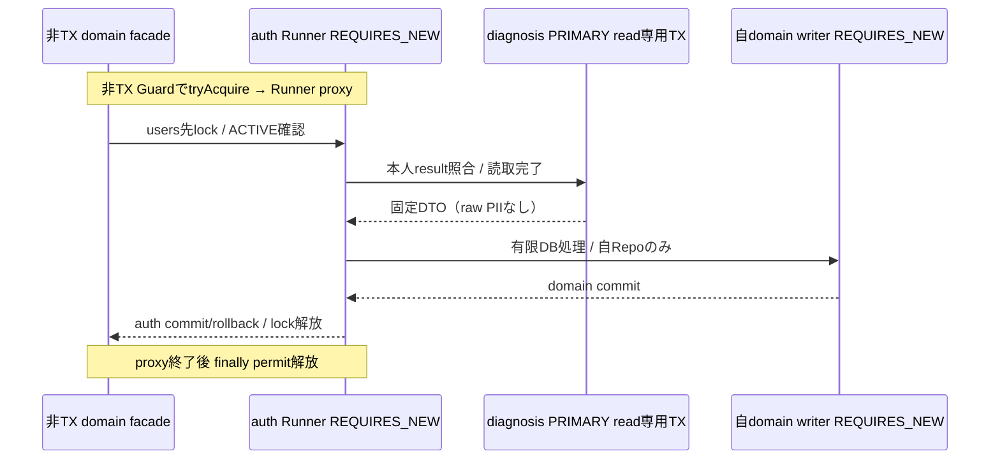

# F04.7-03 API・運営設定・認可

> **ステータス**: 🟡 Phase 1製造中（仕様採択済み、73AC・実機・公開は未完了）
> **正本入口**: [F04.7](../F04.7_gamification.md)
> **区分**: 新API/DTOの採択済み製造契約。HTTP接続・実Security・全体greenは未確認。

## 1. 型・JSON共通契約

新ranchは `/api/v1/me/ranch`。全APIが認証必須、user IDは認証principalだけから取得。mutation.versionはowner aggregate counter、slot.versionは独立counter。ownerId/userId/recipient/points/xp/occurredAtをbodyから受けて状態を書き換えない。JSONフィールドはcamelCase、EnumはUPPER_SNAKE、成功は `{data:T}`、一覧はCursorPagedResponse（`data:[]`,`meta:{nextCursor:string|null,hasNext:boolean,limit:int}`）。空一覧は200。Entityを直接返さず、不変DTOと生成OpenAPI型を使う。

UUIDはcanonical小文字ハイフン形式のstring、Java UUID/MySQL BINARY(16)。既存user IDはJava Long/MySQL BIGINT、APIに露出するときはdecimal string。新ranchのLong残高/XP/versionもdecimal stringで返し、JS Numberへ無制限変換しない（既存APIの全体設定変更なし、ranch DTOだけで明示）。slot数/件数など安全上限内intはJSON number。新日時はInstant/UTC ISO8601 `Z`。診断completedAtと確認expiresAtはInstant.truncatedTo(MICROS)をDB/immutable JSON/HMAC/cursor共通に使い、精度差によるcursor重複・署名不一致を防ぐ。null許容欄以外は必須・null不可。既存source APIのIDは現行契約の型を維持し、envelope/sourceRefではfacadeがtypeを検証・正規化したstringを返す。

内部canonical_key/acquisition_key/canonical_source_id/canonical_scope_idはASCII形式とbyte上限を厳格検証してVARBINARYへ保存する（02）。API/envelope/sourceRefでのstring契約は維持する。sourceTypeを含む正準キー全体をASCIIに限定し、raw source本文/PIIをキーへ含めない。DB binaryのbase64化やtext列collation overrideをJSON契約として持ち込まない。

本人ranch mutationに `Idempotency-Key: UUID` 必須。scopeはranch内user+key、hashはcommandType+normalized body（path resource ID/If-Matchも含む）。同type/bodyは以前の成功結果、異なるtype/bodyは409。同キーをtab/sessionの終了で削除しない。成功keysだけを同TXで永続保存する。bodyに予期しない特権フィールドを入れても権限/量が変わらず、当該APIでは400とする。HTTP retryでポイント二重消費しない。

## 2. 本人向けAPI

| メソッド | パス | Request | Response / status |
|---|---|---|---|
| GET | `/api/v1/me/ranch` | なし | 200 RanchState。未参加はowner/dinosaur=null（GETで作らない） |
| POST | `/api/v1/me/ranch` | `{}`、Idempotency-Key | 卵/owner/部屋201、egg ruleをsnapshot保存、Location同パス。既存なら200同state、別個体を作らない |
| PUT | `/api/v1/me/ranch/settings` | RanchSettingsRequest（全field必須）、Idempotency-Key | 200 settings。version競合409。表示変更は既存widget API |
| POST | `/api/v1/me/ranch/pause` | `{version:string}`、Idempotency-Key | 200 status PAUSED。個体/ポイント保持、休止開始Instant |
| POST | `/api/v1/me/ranch/resume` | `{version:string}`、Idempotency-Key | 200 status ACTIVE。休止中fact遡及なし |
| POST | `/api/v1/me/ranch/feeding` | `{version:string}`、Idempotency-Key | 孵化済み一頭をprincipalのownerから決定（EGGは409）。新給餌201、Location `/api/v1/me/ranch/commands/{commandId}`。再送200同不変結果。FREE_BASIC/cost0、care週枠後XP0でも触れ合い可 |
| GET | `/api/v1/me/ranch/commands/{commandId}` | UUID path | 200 CommandResult。非所有/不在404 |
| GET | `/api/v1/me/ranch/records` | cursor:string?、limit:int=20、1〜100 | 200 CursorPagedResponse<Record>。body/回答内容なし |
| GET | `/api/v1/me/ranch/collectibles` | cursor:string?、limit:int=20、1〜100 | 200 inventory。復元前/0件は[] |
| POST | `/api/v1/me/ranch/collectibles/sync` | `{afterAwardId:string}`、0以上の正準decimal string、Idempotency-Key | 200 `{commandId,nextAfterAwardId,processedCount,importedCount,hasNext,completedAt}`。旧取得を最大100件明示取込。未参加404 |
| PUT | `/api/v1/me/ranch/room/slots/{slotKey}` | `{inventoryId:UUID,version:string}`、Idempotency-Key | 200配置結果。所有/未取消/slot許可を検証 |
| DELETE | `/api/v1/me/ranch/room/slots/{slotKey}` | versionをIf-Matchにdecimal string、Idempotency-Key | 204。置物はinventoryへ戻り消えない。空slotでもversion一致なら204/version+1、同key再送は元204 |

参加POSTの成功command.result_jsonには、取引時serverTime（MICROS）を含む完全なRanchStateを不変snapshotとして保存する。初回は201、既ownerへの別keyは現在の自行状態から200の新成功snapshotを保存する。同key再送は現在の成長・表示設定・rule変更を再評価せず、保存済みsnapshotを200で返す。FEは成功後にGETで最新状態を取得する。Writerは自domain Repoと純粋mapperのみを使用し、Auth Runnerの保持中に独立PRIMARY Readerを呼び直して同時3接続へ増やさない。外domain widget visibility/報酬状態/承認mappingの投影は、auth認可後に正規facadeから得た固定DTOだけを使用し、client値や仮のtrueで補完しない。

| メソッド | パス | Request | Response / status |
|---|---|---|---|
| GET | `/api/v1/me/ranch/shop` | なし | 200 ShopItem[]、運営登録済み永久置物/現行price version。空は[] |
| POST | `/api/v1/me/ranch/purchases` | `{skuKey:string,priceVersion:string,version:string}`、Idempotency-Key | 201 PurchaseResult/Location commands/{commandId}、再送200。同SKU既所有/残高不足409 |
### 2.1 レスポンス/リクエスト型

**RanchState**:

| field | 型/null | 意味 |
|---|---|---|
| featureStatus | AVAILABLE/UNAVAILABLE、必須 | care利用可否（activity reward状態とは独立） |
| deliveryPaused | boolean、必須 | 配送一時停止（報酬停止とは別） |
| rewardsStatus | ENABLED/DISABLED/PAUSED、必須 | 活動pointsの運営状態 |
| shopAvailable | boolean、必須 | 永久装飾交換の運営状態 |
| careBudget | CareBudget/null | 未参加/有効care ruleなしはnull |
| owner | OwnerSummary|null | 未参加はnull |
| dinosaur | DinosaurSummary|null | 未参加はnull、参加済みでownerあり/dinoなしはデータ不整合で500 |
| settings | Settings|null | 未参加はnull |
| weekBudget | WeekBudget|null | 未参加または有効policy未登録はnull |
| roomSlots | Slot[]、null不可 | inventoryが無いslotはinventoryId=null |
| policyVersion | decimal string|null | 有効policyが無いとnull |
| serverTime | Instant string、必須 | 表示確認用。FEの時計で報酬を決めない |

OwnerSummary=`{id:UUID,status:ACTIVE|PAUSED,balance:string,version:string}`。DinosaurSummary=`{id:UUID,speciesKey:string|null,variantKey:string|null,habitat:LAND|SEA|AIR|null,speciesCatalogVersion:string|null,stage:EGG|BABY|JUVENILE|ADULT,name:string|null,namedAt:Instant|null,xp:string,nextStageXp:string|null,version:string}`、EGG/ADULTでnextStageXp=null、未選定EGGのspecies/habitat/catalogVersion=null。Settings=`{isVisible:boolean,viewMode:ROOM,renderStyle:PIXEL|PAINT_2D,motionMode:NORMAL|REDUCED|STOPPED,isSoundEnabled:boolean,soundVolume:int,version:string}`。isVisibleは既存dashboard widget visibility正本の投影。RanchSettingsRequest=`{renderStyle:PIXEL|PAINT_2D,motionMode:NORMAL|REDUCED|STOPPED,isSoundEnabled:boolean,soundVolume:int,version:string}` だけを受け、volume0〜100、null/欠落拒否。renderStyleはownerに永続保存し初期PIXEL。切替はowner version競合/冪等契約に従い、dinosaur ID/選定/成長/残高を変えない。viewModeはROOM固定。ranch TX内で別domain表示Repositoryを更新しない。開始後widget表示を別APIで設定し、失敗時も作成個体を維持して表示更新だけretryする。

WeekBudget=`{weekStartsOn:YYYY-MM-DD,weekEndsAt:Instant,globalCap:string,awardedTotal:string,remaining:string,policyVersion:string,personalRequiredCount:decimal string,personalCompletedCount:int}`。全源/所属数でcapは同じ。personalRequiredCountは非負remainingと正personalAmountから、整数除算のquotient + (remainderが0なら0、他は1)で求めdecimal stringで返す。remaining+amount-1や浮動小数点ceilを使わず、signed BIGINT最大でもoverflow/精度損失を起こさない。remaining=0は"0"。必要件数は残量の理論値で、countLimit残枠/quota不足なら個人想起だけの満額到達を保証しない。UIに毎日やらないと減るような表現を置かない。

FeedingResult=`{commandId:UUID,dinosaurId:UUID,careKind:FREE_BASIC,costPoints:string(常に0),gainedXp:string,isGrowthCapped:boolean,stageBefore:enum,stageAfter:enum,balanceAfter:string,ruleVersion:string,completedAt:Instant}`。resultは不変の取引時点で、現在stateとは別。slot response=`{slotKey:SHELF_1|SHELF_2|SHELF_3,inventoryId:UUID|null,version:string}`。開始時に三slot行をinventoryId=NULL/version=0で作成し、PUT/DELETEごとversion+1。DELETEは行を削除せずNULLへ戻しversionを維持、空slotへの再PUTも同counterで競合検査。Record=`{id:UUID,kind:REWARD|CARE|PURCHASE,sourceType:enum|null,deltaPoints:string,deltaXp:string,occurredAt:Instant,sourceLink:SourceLink|null}`。sourceLinkはF00再判定後にのみ `{kind:enum,id:string,url:string}`、本文/名称は返さない。

Inventory=`{id:UUID,collectibleKey:string,labelKey:string,assetKey:string,acquisitionKind:SHOP|LEGACY_BADGE,awardedAt:Instant,isRevoked:boolean,placedSlotKey:string|null}`。旧team名/旧badge自由説明を非メンバーに返さない。既存system badgeを運営承認label/assetへadapterする。Phase 1はuser uploadした置物asset/URLを受けない。

旧バッジ取込は本人の明示操作だけで行い、GETでは同期しない。source所有の本人取得行を `awardRowId` 昇順で最大101件取得し、先頭100件を処理、101件目があるとき `hasNext=true`。`nextAfterAwardId` は最後に処理したID（空ページでは入力値）で、継続ページは新Idempotency-Keyを使う。同key同bodyはsourceの現在値や承認catalogを再読せず保存済み結果を返し、別bodyは409。source read TXを閉じてからRanch writer TXに入り、成功commandとinventoryを同TXで保存する。未参加ownerを取込で作らない。

内部catalog key `LEGACY_BADGE:<canonical decimal badgeId>` は運営承認済み `source_kind=LEGACY_BADGE` の行だけに対応し、source badgeが取得時点で利用可能な場合だけ保存する。元の名前・自由説明・icon URLは転用しない。取得のbinary同一性は型付きIDと元period UTF-8 bytesを無paddingBase64urlで符号化したASCIIのLB1 keyに固定し、period欠損は空文字。catalog未承認の行はその回に0だが、後日承認後に新keyとcursor `"0"` から再走査して回収できる。旧earnedOnはLocalDateなので実時刻へ変換せず、inventory.awardedAtは取込時のUTC MICROSとする。旧badge授与とbeta entitlementは独立に維持する。

CareBudget=`{weekStartsOn:DATE,weekEndsAt:Instant,weeklyCapXp:string,awardedXp:string,remainingXp:string,amountXp:string,ruleVersion:string}`。activity pointsのWeekBudgetとは別。ShopItem=`{skuKey:string,collectibleKey:string,labelKey:string,assetKey:string,pricePoints:string,priceVersion:string,isOwned:boolean}`、価格/ruleはserver確定。PurchaseResult=`{commandId:UUID,inventoryId:UUID,skuKey:string,costPoints:string,priceVersion:string,balanceAfter:string,completedAt:Instant}`、不変結果。
## 3. 想起session API（新規reflection内契約）

既存 `/api/v1/me/reflections` 配下に追加し、既存recordRecall API自体は挙動を変えない。entryIdは現行ReflectionEntryControllerと同じUUID stringで厳格検証（Long併用なし）。新sessionIdはUUID。

| メソッド | パス | 契約 |
|---|---|---|
| POST | `/api/v1/me/reflections/entries/{entryId}/recall-sessions` | `{}` + Idempotency-Key。201session snapshot。entry本人所有必須、ranch owner不要、0prompt400。sourceRefからuser偽装不可 |
| GET | `/api/v1/me/reflections/recall-sessions/{sessionId}` | 200本人session。resume用。非所有/不在404 |
| PUT | `/api/v1/me/reflections/recall-sessions/{sessionId}/answers` | `{version:string,answers:Answer[]}` + Idempotency-Key。200途中保存。報酬なし |
| POST | `/api/v1/me/reflections/recall-sessions/{sessionId}/complete` | `{version:string,answers:Answer[],selfRating:REMEMBERED\|PARTIAL\|FORGOT}` + Idempotency-Key。200completed session/原文開示。全required回答後だけfact |
| POST | `/api/v1/me/reflections/recall-sessions/{sessionId}/cancel` | `{version:string}` + Idempotency-Key。200cancelled、報酬なし |

Answer=`{promptId:UUID,state:ANSWERED|FORGOT,text:string|null}`。ANSWEREDはtrim後非空で本体上限以下、FORGOTはtext=null、全prompt IDはsnapshot内で一意、重複/追加/欠落400。途中保存では欠落可、completeでは全件必須。Session=`{id:UUID,entryId:string,status:STARTED|COMPLETED|CANCELLED,version:string,prompts:Prompt[],answers:Answer[],selfRating:enum|null,startedAt:Instant,completedAt:Instant|null,rewardWeek:DATE|null,expiresAt:Instant|null,original:ReflectionEntryResponse|null}`。expiresAtはPhase 1では常にnull（期限なし、削除/所有喪失時完了不可）。rewardWeekはSTARTED/CANCELLEDでnull、COMPLETED初遷移のserverTime週を固定し再送で変えない。originalはCOMPLETED後のowner権限でのみ返す、取消時null。selfRatingの高低で報酬は変えない。ranch未参加でもこの学習フローは使える。

## 4. 運営APIとルール

SYSTEM_ADMIN限定。新permissionを使う場合は権限catalog/Flyway/正規ガードを登録し、未登録文字列で許可しない。一般userの `/me` へSYSTEM_ADMINでも他人IDを渡せない。

| メソッド | パス | Request / Response |
|---|---|---|
| GET | `/api/v1/system-admin/ranch/policies` | policy summary一覧、cursor方式 |
| POST | `/api/v1/system-admin/ranch/policies` | 完全policy+effectiveAt。201不変version。次のUTC週境界以降のみ |
| GET | `/api/v1/system-admin/ranch/operational-controls` | fresh SYSTEM_ADMIN+ACTIVE。private,no-store。`{version:string,isCareEnabled:boolean,isShopEnabled:boolean,isDeliveryPaused:boolean,isRewardsPaused:boolean,updatedAt:Instant}`。本人owner生成なし |
| PUT | `/api/v1/system-admin/ranch/operational-controls` | `{version:string,isCareEnabled:boolean,isShopEnabled:boolean,isDeliveryPaused:boolean,isRewardsPaused:boolean,reasonCode:string}`。Idempotency-Key必須、200はGETと同じ6項目の保存ACK。理由1..40文字、trim一致。停止期間は発生時刻の[start,end)で判定 |
| GET | `/api/v1/system-admin/ranch/outbox-health` | `{sources:[{sourceType,pendingCount:string,deadCount:string,oldestAgeSeconds:nullable}],observedAt}`。4源の有限集計、本文なし |
| POST | `/api/v1/system-admin/ranch/outboxes/{sourceType}/{eventId}/retry` | bodyは`{reasonCode:string}`のみ、`[A-Z][A-Z0-9_]{0,79}`。Idempotency-Key UUID。200保存ACKは`{commandId,sourceType,eventId,disposition,completedAt}`。dispositionはRETRY_SCHEDULED/ALREADY_TERMINAL、不在404 |

source管理はfresh SYSTEM_ADMIN+ACTIVEを確認した後、Ranch取引を保持せず源の公開facadeから源自身の独立取引へ渡す。actorは認証主体だけ、未知body項目は400。4源不足/窓口不在/保存ACK照会不能はSOURCEOUTBOX_001/503で、正常ゼロや確定拒否RANCH_004へ変換しない。応答不明のFE再送は同じkey/bodyを保持する。源側が保存済みACKを先に読み、別bodyはSOURCEOUTBOX_003/409、現有効lease中はSOURCEOUTBOX_004/409で命令未保存。報酬配送の完了と再予約ACKの時刻を混同しない。

PolicyRequest=`{effectiveAt:Instant,enabled:boolean,globalWeeklyCap:string,sources:SourceRule[4],delivery:{batchSize:int,leaseSeconds:int,maxAttempts:int,initialBackoffSeconds:int,maxBackoffSeconds:int},reasonCode:string}`。SourceRule=`{sourceType:四enum,enabled:boolean,amountPoints:string,countLimit:int}`。全源を一回ずつ必須、欠落/重複拒否。無効源も量/容量の型を検証。globalCap>0かつenabledならpersonalON。全利用者quotaに対する満額capacity invariantは設けない。care ruleとshop価格はpoint policyから独立。delivery各値は正でinitial<=max、batch<=運営安全上限（実装時負荷測定で値登録）、retry/lease値未登録でenabled拒否。Response=`{id:UUID,version:string,contentHash:string,effectiveAt:Instant,settings:PolicyRequest,publishedAt:Instant,publishedBy:string}`、公開済み変更DELETEなし。

初期policyはenabled=false。数値は運営登録/裁可で決める。金銭購入によるポイント/速度/上限増加、team管理者の任意個人加算/減算APIを設けない。停止/retry/新policyを監査し、event ID、rule ID、reasonCode、時刻、操作主体を残す。本文や学習回答は監査payloadへ複製しない。

運営care rule API: GET `/api/v1/system-admin/ranch/care-rules`、POST同パス。Request=`{effectiveAt:Instant,amountXp:string,weeklyCapXp:string,juvenileXp:string,adultXp:string,reasonCode:string}`、次UTC週以降、不変version/hash、量正・juvenile<adultを検証。care ruleがpoints policyなしでも成体到達を保証する。同日週careを使える回数/通常rate limit設定を公開gateで確認する。species/少数SKUは初期運営承認catalog seedで十分で、巨大catalog管理UIを作らない。SKU価格更新は新priceVersionのcatalog公開、過去purchaseの価格snapshotを変更しない。

adminの冪等scopeは管理shardまたは各source facadeごと（分散共通scopeではない）。clientは操作別新key、同retryだけ同key。別facadeへ同keyを使うことはこの409保証外。reflection commandもreflection内scope。管理mutationはranch_admin_commands（owner不要）でuser+key/hashを保存し、policy/control/care ruleの管理shard TXと一括。source retryのみsource facade内のsource admin commandとoutbox更新を同TX、SYSTEM_ADMIN監査。同じretry key別event/type/bodyも409。未参加adminへ個人ownerを作らない。
## 5. 認可・F00・セキュリティ

`common/security/SelfScopedEndpoint` は実在しmethod対象/value必須。root/本人collectionのIDを受けないendpointだけへ理由を付ける（feedingも一頭をprincipalから決定）。commandId/slotKey/inventoryId等を検索に受けるendpointには一括でself markerを付けず、RanchAccessGuardがresource ID+principal user IDを同時条件にlookupして本人所有を確定し、正規resource-owner例外/EP契約ITを登録する。ARはReflectionAccessGuardとsession owner guardを適用。架空のContentVisibilityResolverを作って本人の残高を公開コンテンツ扱いしない。sourceの資料リンク/記事/投稿の閲覧は既存F00 ContentVisibilityResolver/ContentVisibilityCheckerを必ず経由し、独自role比較をしない。退会・source削除・所属離脱・可視性変更後はリンクをnullにし、元報酬台帳を戻さない。源事実はsourceドメインの本来認可成功後のみ生成する。

他人のdinosaur/inventory/command/session UUIDは404。同じレスポンス形で存在を秘匿する。認証なし401。残高不足409。feature OFFでも予定/出欠/投稿/ブログ/学習へのアクセス制限を追加しない。

記録GETの製造境界は `UserOperationGuard` の本人lock内で `RanchRecordQueryReader.readPage` の独立PRIMARY TXを完了し、その後 `RanchRecordSourceLinkResolver` が源所有の `SourceRewardLinkProvider` へ技術IDだけを渡す。源providerが現在のF00認可と実画面routeを決め、Ranchは本文・名称・slug・所属情報を取得しない。保存済み正準キーの本人/owner/REWARD対応が不一致、ARのUUIDv7または他源のLONG対応が不正、provider欠落/重複、源の不在/拒否/既知の取得不能ではlinkをnullにして元台帳とcursorを維持する。毎回再判定し許可済みリンクをキャッシュしない。源providerの実Bean・実ACL試験が揃うまではリンク機能の完成/合格とは扱わない。

| 状態 | create/free care | shop purchase | settings/置物 | pause/resume | read |
|---|---|---|---|---|---|
| care control ON/有効rule/本人ACTIVE | 可、ポイント不要 | shop ON/残高/価格検証 | 可 | 冪等可 | 可 |
| 本人PAUSED | 既存create200、care409 | 可（休止は獲得/成長停止） | 可 | 再開可 | 可 |
| reward/delivery pause、points policyなし/disabled | care可、元care rule使用 | 既得残高で可 | 可 | 可 | 可、point budgetなしならnull |
| care control OFF/有効care ruleなし | create/care503 | shop ONなら既得残高で可 | 既存ownerは可 | 可 | 可、careBudgetなしならnull |
| shop control OFF | care状態による | 503 | 可 | 可 | 可、shopAvailable=false |

独立global mutation stopは初期に設けない。featureStatusはcare control/ruleの利用可否、rewardsStatusはpoints policy enabled/運営報酬pause、deliveryPausedは配送だけ。三つを混ぜない。care control ONの初期公開gateは有効care rule、占い風の承認済み決定的rule、LAND/SEA/AIR random各pool、server検証の診断question/scoring version、全64 type×species mappingと承認assetが全て揃うこと。共通catalogのrandomだけでは公開を許可しない。shop ONは承認SKU/不変価格存在を検証。初期care/shop=false、points enabled=false、運営明示登録後に独立有効化する。
既存useApi/認証refresh/Cookie方針を再利用し新トークン保管を作らない。認証Cookieは既存SameSite=Strict/HttpOnly、production Secure方針を回帰試験する。現行SecurityはSTATELESS/CSRF無効のため、CSRF token欠落403を実装済みとみなさない。実browser Cookie/refresh/CORS/入力境界でcross-site mutationの拒否を観測し、実401/403/IDORを含む公開gateにする。CSPを広げない。assetsは運営固定の同origin/既存配信許可先だけ、user URL/HTML/SVGアップロードを初期に受けない。恐竜名は孵化時に必須で確定後変更不可。名前はtext bindingでescapeして表示し、HTMLとして描画しない。ログに本文/回答/secretなし。APIはowner単位rate limit、retryの429にRetry-After。rate limitは複数device合算でcapとは独立、二重付与防止はDB。

新ranchはorganization_idを持たずuser IDでシャード。user-owned repositoryは全クエリでuser ID絞込み。organization-scoped後続PhaseはAbstractTenantAwareRepositoryへ分離し、Phase 1のuser rowへorg権限を混ぜない。user退会時のtombstone/DomainCleanupService/源outboxも含む削除順序は02 §5の契約。金銭交換無しなので会計保存義務として誤分類しない。owner有効中は貯蓄/dedupを失効させず、アカウント削除後の同一活動再発行/孤児再作成を禁止する。

## 6. エラー予約案

新prefix `RANCH` を登録し、基準コミットに同prefixが無いことを採番時確認して最大+1（初回001）から予約する。**確定はmerge時に再確認**。旧GAMIFICATION_001〜010は変更/再利用しない。reflectionの新codeは既存reflection最大+1を実装時予約し、下記意味へ対応する。Severity.WARNのclient errorを500へ分類しない。

| 予約 | 意味 | HTTP | Severity |
|---|---|---|---|
| RANCH_001 | 本人所有resource不在/越境 | 404 | WARN |
| RANCH_002 | 残高不足 | 409 | WARN |
| RANCH_003 | 同Idempotency-Key別body | 409 | WARN |
| RANCH_004 | 有効policy/機能の利用停止 | 503（明示mapping） | WARN |
| RANCH_005 | 未所有/取消済み置物（不在と同じ形） | 404 | WARN |
| RANCH_006 | 不正slot/値/care rule/価格 | 400 | WARN |
| RANCH_007 | 設定/個体/価格version競合・既所有SKU | 409 | WARN |
| RANCH_008 | 想定外のowner/個体/台帳不整合 | 500 | ERROR |
| RANCH_009 | ranch本人永続保存不能 | 500 | ERROR |
| RANCH_010 | 所有user mutationのrate超過 | 429 | WARN |

COMMON_001は型/必須/不正JSON（WARN/400）、COMMON_003は共通楽観競合（WARN/409）に再利用可。基準コミットcommon/ErrorResponseの返却は `{error:{code:string,message:string,fieldErrors:[{field:string,message:string}]}}`、fieldErrorsは常に配列（対象なし[]、null/省略なし）。成功common/ApiResponse={data:T}、common/CursorPagedResponse={data:T[],meta:{nextCursor:string|null,hasNext:boolean,limit:int}}。useApiはwrapperをunwrapしないためFEはresponse.data、useErrorHandlerはFetchError.data.errorを扱う。内部SQL/stack/source本文/ID入力値をechoしない。上限到達はAPI errorでなく正常0decision、運営履歴ではCAPPEDとして観測する。

PromptDTO=`{id:UUID,kind:TERM_CARD|FREE_RECALL,heading:string,promptSide:TERM|MEANING|null,promptText:string,maxAnswerLength:number}`。idは開始時サーバー発行、開始時設問を凍結する。TERM_CARDは既存cue側だけを提示して上限200、FREE_RECALLはkindラベルと空promptText/side=null、上限10000。0promptは400、TERM_CARD最大1500とFREE_RECALL最大1で合計1501。回答textは既存HtmlSanitizer後のJava String.length（UTF16）で上限を検証し、ANSWEREDは非空、FORGOTはtext=null。途中保存と完了の全設問回答を区別し、既存attempt圧縮JSONは実UTF8 bytesで65536以下を検証する。Session.originalは開始時ReflectionEntryResponseの凍結snapshot、COMPLETED本人だけへ開示しcurrent entryから再生成しない。

既存ソース型根拠: `backend/src/main/java/com/mannschaft/app/reflection/controller/ReflectionEntryController.java` のGET `/api/v1/me/reflections/entries/{entryId}` とPOST `/entries/{entryId}/recall` は `ReflectionEntryResponse`（`reflection/dto/ReflectionEntryResponse.java`）。資料REFLECTION_ENTRYは既存UUID ReferenceTypeとして `common/visibility/ContentVisibilityChecker.java:336` のcanViewUuid、`:364` filterAccessibleUuid、`:413` decideUuidへ渡す。canViewUuid=falseならsourceLink=null。存在しないassertCanViewUuidは作らない。sourceLink.urlは既存frontendルートhelperから生成し推測URLを返さない。resource Controller→RanchService→RanchAccessGuardの具体的depth2呼出を `AuthzControllerGuardArchTest.java:220-295` とendpoint契約ITで検証する。self markerはIDなしの自己root/settingsだけへvalue理由を付ける。

既知不足: `frontend/app/types/api.ts` の手書き共通型はBE wrapper/errorの実体と差がある。新ranchはBE正本OpenAPI生成型だけを使用し、グローバル手書き型をこの設計で変更した扱いにしない。

### 卵/選定API

RanchState.assignment=`{availableMethods:AssignmentMethod[],selectionConfirmed:boolean,confirmedMethod:AssignmentMethod|null}`（未参加null）。DinosaurSummary.egg=`{startedAt:Instant,readyAt:Instant,crackStage:INTACT|SMALL_CRACK|WIDE_CRACK|READY,hatchReady:boolean,hatchedAt:Instant|null}`、EGG以外egg=null。DinosaurSummary.affinityBand=`NEUTRAL|WARM|CLOSE` は個体保存値と凍結rule閾値からGET時に算出し、EGGでも返す。数値親密度・公開ゲージは返さない。serverTimeによるelapsedだけ、client timestampで進めない。

| メソッド | パス | Request | Response / status |
|---|---|---|---|
| PUT | `/api/v1/me/ranch/assignment` | discriminated request: RANDOM=`{method:HABITAT_RANDOM,habitat,version}`、診断=`{method:DIAGNOSIS,resultId,version}`、出生=`{method:BIRTH_STYLE,resultId,confirmationRef,version}`、Idempotency-Key。birthDate/selectionNameは受け取らない。方式に不要field/null placeholder拒否 | 200確認済みassignment。本人COMPLETED result/profile確認版照合、未承認adapter503、確認後別入力409、保存済み同command再送は元結果 |
| POST | `/api/v1/me/ranch/hatch` | `{version:string,name:string,nameConfirmed:true}`、Idempotency-Key | ready AND selection confirmed AND命名確認のみ200孵化・命名を同TX保存。未成熟/未選定409、名前境界/確認不備400。同key再送同結果、別名再送/改名409、XP0 |

methodごとに不要inputを拒否する。mutation.versionはowner aggregate counter、slot.versionは独立。HABITAT_RANDOMはLAND/SEA/AIRのみで同catalogの該当species＋variant組を均等抽選。BIRTH_STYLEは認証本人のauth読取facadeから氏名/生年月日を取得し本人確認を経る。nickname/恐竜名/任意選定用名の代用やclientのbirthDate/selectionName入力は認めない。DIAGNOSISはserver検証済み本人COMPLETED resultでprovider/type/mappingを確定しclient typeCodeを信用しない。未実装方式は準備中で入力収集しない。プロフィール変更/訂正でも確定済み恐竜アバターを維持する。占いの利用説明は科学的判定と主張しない。

出生プロフィールと確認のAPI/TX境界は§7を正本とする。本人氏名・カナ・DOBはauthだけに暗号化保存し、汎用profileへDOB返却を追加した扱いにしない。成功同keyはliveプロフィール検査前に保存resultを返す。

診断のvalidation境界: server発行本人sessionのquestionnaireVersion/scoringVersionを固定し、完了時の全required回答、question IDの一意性と所属、回答値の型/null/上下限をserverで検証する。空回答、欠落、重複、未知question、範囲外で完了を作らず400。本人COMPLETED resultだけを選定に利用し、他人/不在resultは同形404、client typeCode/scoringVersionの偽装で採点結果を変えない。承認versionの全64 typeCodeに対応species/assetがあることを公開gateで検証し、未対応を別type/別個体へ置換しない。具体API/DTO/値域は§7の製造契約を使う。
### 孵化・命名の追加契約（2026-10-03）

nameは02の正規化・1〜10書記素・保存上限をserverで検証する。nameConfirmedは明示確認の要求で、client trueだけで長さや所有検証を省略しない。欠落/null/空名/11文字/nameConfirmed欠落・falseは400、状態はEGGのまま。command hashには正規化名と確認値を含める。同key同bodyは既存不変result、同key別名は409。別keyの既孵化要求は既存名と同名の場合のみ200同個体、異なる名は409で元名不変。二tabの異なる名前はlock下で先に成功した一件だけを確定する。競合した画面は再取得して確定名を表示する。

DinosaurSummaryはEGGでname/namedAt=null、BABY以降で必須。孵化responseはHatchResponse=`{kind:HATCH_RESULT|CURRENT_STATE,result:HatchResult|null,state:RanchState|null}`。初回/同keyはkind=HATCH_RESULT/result非null/state=null、別key同名はkind=CURRENT_STATE/result=null/state非null。不変HatchResultはcommandId/dinosaur ID/stage/name/namedAt/hatchedAt/versionを含み、同key再送で成長後のstateへ置換しない。現在stateはGETで別取得する。孵化後のnew key同名再要求は最新stateを返し、この成功commandも保存する。Settingsや選定APIにnameを渡すと400、rename endpointなし。表示OFF/style変更/成長/休止再開でも名前は変わらない。GETには書込を追加せず、出生割当用名を恐竜名として自動保存しない。

### 本人の診断結果閲覧API（DiagnosisController・OpenAPI契約）

GET /api/v1/me/diagnoses/results?method=DIAGNOSIS|BIRTH_STYLE&cursor=...&limit=20 を既存DiagnosisControllerの本人結果一覧APIとする。method省略時は両方式、limitは1〜100。認証principalから本人IDを得て診断ドメインの読取Serviceへ渡し、組織ID・userId・result typeをclient入力で指定させない。成功は既存CursorPagedResponse、0件は200 data=[]。completedAt降順・id降順、cursorはopaqueな版付き値で本人とfilterに結び付け、別filter/不正cursorは400。詳細GET /api/v1/me/diagnoses/results/{resultId} は本人完成resultだけを返し、他人/不在/未完了は同形404、未認証401。

一覧Summaryと詳細resultSnapshotは§7の採択済み単一契約を参照する。raw生年月日・名前・全回答を返さず、内部metadataを公開Summaryへ追加しない。誕生に利用したresultの参照を保持しても、本人向けの最新結果と恐竜アバターの確定済み外見を同じ「現在の診断」として上書きしない。

本人PAUSED、widget非表示、動きSTOPPED、care停止、報酬停止、残高0でも既存結果GETは利用可能。退会申請中/最終削除済みはアカウントアクセスガードで拒否する。SYSTEM_ADMIN/チーム管理者/訪問者の他人閲覧用途へ本人APIを転用しない。通常SYSTEM_ADMIN本人の利用は可能。Cache-Control: private, no-store、共有profile/通知/報酬履歴/outbox/監査へ結果を出さない。GETは採点・割当・育成・残高・診断実施数を変更しない。未実施方式の計算や再診断は専用の本人確認操作から行い、GETの副作用にしない。

## 採択済み商品仕様の参照

三方式・独自数秘・本人の分身・同個体維持・96論理ドット/2D・無料成体の正本は[01 商品契約](01_product_phases.md)。

## 7. 本人プロフィール・診断・auth所有の操作境界

新private HTTP APIはtrusted request属性originalAdminIdが存在すれば403。通常SYSTEM_ADMIN本人は可。生client headerだけで本人/変身を判定しない。HTTP変身制約はController/既存HTTP guard、consumer用auth guardに混ぜない。実Security401/403/他人IDテストは未実行。

| domain | 方法/パス | 契約 |
|---|---|---|
| auth | GET/PUT `/api/v1/me/birth-profile` | GET本人限定{lastName,firstName,lastNameKana,firstNameKana,birthDate,revision}。PUT全項目＋revision、競合409、応答は{revision} ACKのみ。command履歴へraw profileを保存しない |
| auth | POST `/api/v1/me/birth-profile/confirmations` | {revision,useConfirmed:true}→{confirmationRef,expiresAt,profileRevision}。opaque UUID、auth行参照、TTL10分。本人/用途/revision/nonce/withdrawalAttemptId/期限を既存HMACで検査 |
| diagnosis | POST `/api/v1/me/diagnoses/birth-style-results` | {confirmationRef}→派生数と説明snapshotを持つ本人resultId。未知/他人ref同形404、期限切れ/版変更409、成功同keyは旧result |
| diagnosis | POST `/api/v1/me/diagnoses/sessions` | {}→201{id,status:STARTED,version,answerRevision,questionnaireVersion,scoringVersion,questions[24],answers:[],tieQuestions:[]}。回答3を自動投入しない |
| diagnosis | GET `/api/v1/me/diagnoses/sessions/{id}` | 本人session snapshotと途中回答、no-store、出生rawなし |
| diagnosis | PUT `/api/v1/me/diagnoses/sessions/{id}/answers` | {version,answers:[{questionId,value:1..5}]}。途中部分回答可、questionId/valueの欠落・未知/重複/null/小数/booleanは不正。answerRevision++で旧tie無効 |
| diagnosis | POST `/api/v1/me/diagnoses/sessions/{id}/complete` | {version,answerRevision,tieAnswers:[{axisId,value:0..1}]}。24required不足400、必要tie不足はTIE_BREAK_REQUIRED/result=null/tieQuestions。全tie後COMPLETED/resultId、非tie/未知/重複400、古いanswerRevision409 |
| diagnosis | POST `/api/v1/me/diagnoses/sessions/{id}/cancel` | {version}→CANCELLED/resultなし/獲得0。保留は別でSTARTED/TIE_BREAK_REQUIRED保持、期限なし |
| ranch | POST `/api/v1/me/ranch/interactions` | {kind:TOUCH,version}→InteractionResult={commandId,dinosaurId,reactionKey,affinityBand,affinityChanged,completedAt}。新command保存201、同key同body成功再送200で保存済み本文不変。EGG可、cost/XP/points0。PAUSED/care OFFは反応のみ/愛着加算0 |

result summaryは{id,method,completedAt,resultSchemaVersion,ruleVersion,questionnaireVersion?,scoringVersion?,normalizationVersion?,mappingVersion?,typeCode?,axes?,numberSummary?,descriptionSnapshot}。raw回答/姓名/カナ/DOB/profile fingerprintなし。6言語説明と質問/採点/正規化版を不変snapshot、mapping未登録NULLでも本人resultを保存可、恐竜割当/公開有効化不可。完成typeCodeはserverの6bit文字列。本人診断開始・result作成・閲覧はranch参加不要。

正式質問catalogのsoftware登録境界: `mannschaft.diagnosis.approved-catalog.resource/version/sha256` を一組で明示し、resourceは `diagnosis/approved/*.json` 配下の実バイトを指定する。全設定欠落は未登録、部分設定・不正path・実バイトSHA不一致は起動拒否。resourceの `approved=true` と `translationsApproved=true`、`catalogs` 配列に含まれる各不変Definitionの既知snapshot schema/scoring版、24問（6軸各4問、sign±1、一意ID）、6軸同点表示、全6言語の質問・説明・同点表示を検証する。DRAFT版を正式版へ読み替えない。明示versionに一致する定義から新sessionを開始し、readinessも同じ登録正本を参照する。恐竜全64mapping/素材の公開gateは引き続き別途必要。

開始済みsessionは保存Definitionを変更・再構成しない。正式resourceを更新する場合は既存sessionが参照する旧承認Definitionを `catalogs` に保持し、保存Definitionとの完全一致で旧snapshotの読取・mutationを許可する。保存APPROVED flagやversionだけでは承認せず、改竄・未知版は拒否する。旧版をcatalogから除去するとその版の操作は不可になるため、保持を登録更新の条件とする。DRAFTの保存読取と開発profileでのmutation制限は維持する。現時点では本物質問・翻訳の承認0、正式resource/設定登録0、全64mapping/素材承認0で公開OFF。合成UTのAPPROVED値は登録機構の試験だけで、実原稿の承認証跡ではない。

mapping未登録時の割当不可は、その時点で互換な承認mappingが存在しないことを指す。後日mappingを承認しても保存済みResultSummaryを改変しない。画面は方式全体の可否を現在のRanchState.assignment.availableMethodsで判断し、saved mappingVersionの有無だけで旧結果を永久に準備中にしない。初回選定時、serverは保存結果のrule/scoring/normalization版に互換な承認mappingを検証し、利用したmapping版を個体へ凍結する。互換mappingがなければ503。同方式が利用可能でも、すべての過去結果の適合を保証するものではない。確定済み個体のmapping/外見は変更しない。

RanchCommand.idはUUIDv7の公開commandId、idempotencyKeyは別UNIQUE(user,idempotency_key)。二重command_uuid列を追加しない。応答喪失は元key/body/versionで同mutationを再送し、成功resultの後GET現在state。commandIdとkeyを同値と仮定しない。各domain/admin/sourceのkey scopeは独立。全mutationの成功lookupを現在version/profile検査より先に置き、別hash409。

auth所有UserOperationGuard.withActiveUser(Long,Supplier<T>)は非TX公開入口とし、TX開始前にauth所有single admissionを取得して別Bean AuthUserOperationRunnerのREQUIRES_NEW proxyを呼ぶ。Runnerは既存users行を先にlockしACTIVE確認、domain commitまで保持する。domain facadeも非TX。callback内でdiagnosis PRIMARYのSELECT-only独立TX（routingのためreadOnly=false）/純粋派生計算を完了し、固定DTOだけを自domain REQUIRES_NEW writerへ渡す。writerは自Repoのみでauth/diagnosis呼出なし。出生は同auth lock下でrevisionを確認し、内部ConfirmedBirthNumbersの派生数とprofileRevisionだけを渡す。PRIMARY readとwriterは順次で同時2接続以内、有限DB/純粋計算のみ、network0。auth→domain順序を固定し、D3T例外/凍結arch baseline変更なし。実MySQLの退会UPDATE待機・競合証明は未実行。

採択済み接続admission: JDK Semaphoreをauth所有singleton一個にし、出生wrapperも共用する。実主Hikari最大容量Pが不明/P<2なら503、P≥2でG=min(serverMax（既定4）,max(1,floor((P−2)/2)))。2G≤P、P2/3はG1で余裕予約なし。tryAcquireのみ、待機queueなし、超過503。ambient TX/再帰呼出は拒否し、Runner proxyのcommit/rollback完了後finallyでpermitを解放する。全domain別semaphore/新DataSourceを先行追加しない。共有pool他経路の完全予約保証ではなく既存3秒connection timeoutが必要。設計採用済みだが製造・試験未実行、P2/3/4/5/50、permit復帰、上限即拒否、TX開始順を復旧後検証する。

全姓名/カナ/DOB更新経路（登録・本人補完・admin訂正等）でrevision++。確認参照はraw PIIをtoken/HMAC/history/logへ含めない。既存HMAC鍵rotation後の旧refは10分内でもfail closedで本人再確認、旧verify-key受理機構を追加しない。constant-time比較、用途/nonce/revision/本人binding。malformed JSONの例外ログにも入力断片/ref/fingerprintを複製しない。出生結果のreplay順序はACTIVEユーザー先lock→PRIMARY独立TXで成功履歴lookup→既successならliveプロフィール検査前に当時result返却→初回だけref/revision検証・派生計算。replayと直後のresult採用はREQUIRES_NEW/readOnly=falseのSELECT-only処理でPRIMARYへ送り、readOnly=trueによるreplica遅延を避ける。既存ReplicaRoutingAspectは変更しない。出生選定はACTIVE auth lock→Ranch成功commandのPRIMARY replay lookupを最優先とし、既successはliveプロフィール検査前に当時resultを返す。初回のみlive確認refのrevision Rを検証し、PRIMARYで本人COMPLETED BIRTH_STYLE resultの内部sourceProfileRevision=Rを照合して固定DTOを独立Ranch writerへ渡す。新refでも旧プロフィール由来resultの採用は409。診断のOwnedResult内部metadataにsourceProfileRevisionを持たせ、DIAGNOSISはnull、BIRTH_STYLEは0以上とする。公開Summaryには追加しない。本人履歴閲覧は維持し、既存guard内でguardを再帰呼出ししない。

退会照合は既存withdrawalAttemptIdと現在auth状態が正本。汎用authgeneration表を先行追加しない。申請は保持・停止、同ID取消で元ACTIVE/PAUSED復帰、再申請後の古通知は無効。最終purge前にPURGING拒否barrierを永続化し、ranch/diagnosis/source/reflection cleanupを既存purge固定list/retry dispatchへ統合する。UserAnonymizedEventを取消可能申請の即削除入口にしない。cleanupは冪等、late配送後再作成0、全control OFFでもALWAYS実行。最終markerの配置/cleanup/consumer競合は後続統合と実MySQL race検証が未完了。

### UI72の源所有公開契約

SourceOutboxAdminFacade（common.ranchsource.api）は非TX公開契約。fresh SYSTEM_ADMIN+ACTIVEの管理窓口がhealth()とretry(actorUserId,sourceType,eventId,key,request)を呼ぶ。四源自身の読取/再予約TXを順次実行し、Ranch管理TXやsourceロックを保持してconsumerを呼ばない。HealthSummary={sources:4rows,observedAt}、row={sourceType,pendingCount:string,deadCount:string,oldestAgeSeconds:nullまたは非負整数}、pendingはPENDING/RETRY、deadはDEAD_LETTER。本文、利用者ID、私有hash、lease tokenは含めない。RetryRequest={reasonCode:[A-Z][A-Z0-9_]{0,79}}のみ。RetryAck={commandId,sourceType,eventId,disposition:RETRY_SCHEDULED|ALREADY_TERMINAL,completedAt}は管理命令の保存応答で、報酬完了の証明ではない。source-own command/key/bodyhash比較→成功ACK→live再予約の順序、不在404/別body409/稼働lease競合409、terminalを復活させない。source SPI実装/Controller認可/lease/ACKは後続製造であり、このinterface/DTOだけで稼働を主張しない。

### 源配送leaseの内部公開値契約

SourceOutboxLeaseRequest(serverTime, batchSize, leaseSeconds, maxAttempts) の4値はCOREが公開policyから検証して渡す。源は既定設定で補完しない。source own短TXのcurrent lockで未配達/期限切れLEASEDだけを回収し、attempt上限到達行をDEAD_LETTERへ遷移する。現在有効な別workerのleaseを終端化しない。DEFERは当token・LEASED・未期限切れ一致時に増算分を一回だけ戻し、公開maxBackoffSeconds内の有限futureへ延期する。真の障害retryだけを失敗budgetに含める。ACK/延期/障害処理はpurge済み・旧token行を再作成しない。

CMS実BeanはBlogRanchOutboxDeliveryService。現checkpointは製造済み/compile・実MySQL未実行で、残三源の配送Bean・管理health/retryは未完成。壊れたpayloadは固定PAYLOAD_INVALIDでdead-letterへ隔離し、本文・cause・私有hashを返さず同batch正常行を続ける。

### 四源管理aggregateの不確実性分類

SourceOutboxAdminServiceは非TX aggregateで、各SourceOutboxAdminProviderの独立PRIMARY短TXを順次呼ぶ。healthは四源のproviderが全て一意に揃うまで SOURCEOUTBOX_001/503 とし、未取得を健康なゼロへ偽装しない。fresh SYSTEM_ADMIN+ACTIVEを保持する本人入口から呼び、source側は認可済みactorの監査命令を保存する。SOURCEOUTBOX_001はprovider不足・保存ACK照会不可等のgeneric unavailableで、同key/bodyを維持する不確実性でありRANCH_004確定拒否へ変換しない。SOURCEOUTBOX_002は対象行不在404、_003は同key別body409、_004はsavedACK照会後の現有効lease処理中409で新命令未保存。

CMS再処理はsource/event/reasonを正準length-prefix SHA256で比較し、同actor/keyの保存ACKを現在行の状態より先に返す。ACKEDはALREADY_TERMINAL、他の再予約可能行だけRETRYへ移し、新event/canonical key/報酬を生成しない。DEAD_LETTERの明示管理再処理はattempt budgetを0へ戻す。私有hash・recipient・payload・tokenはhealth/ACKへ出さない。今回CMS provider一件のみ製造済み/実MySQL未実行、残三源provider・HTTP SYSTEM_ADMIN/filter実証は未完成。

ReflectionRanchOutboxDeliveryService / ReflectionRanchOutboxAdminService は V246 の reflection-own短TXで同じ公開配送・管理契約を実装する。admin保存kindは既CHECKのOUTBOX_RETRY。payloadはReflectionRecallRewardPayloadで厳格復元し、DB技術headerと一致するものだけleaseする。今回までCMS/Reflectionの二源だけ実Bean設置、TL/出欠が未完成なのでaggregate healthは引き続き001/503。各receiver・lease・再処理ITはprepared/not-runで、実HTTP認可・本番availabilityと区別する。

### F00 源所有リンク境界（実ACL Bean未接続）

公開SPIは common.ranchsource.api.SourceRewardLinkProvider#resolve(viewerUserId,SourceRewardReference):Optional<SourceRewardLink>。参照は sourceType/idType/sourceId の正準技術IDのみ。ARはUUIDv7 entry、TL/出欠/CMSは正準正整数LONG。出欠源がresponse IDをschedule IDへ変換し、CMS源が現scope/slugから実画面ルートを決定する。返却kindはTIMELINE/SCHEDULE/BLOG/REFLECTION_ENTRY、本文/名称/recipientを含めない。Ranch TX終了後に呼び、現在のF00認可・削除・実存を通過した時だけリンクを返す。欠落provider、不在、認可拒否、取得不能はnull。現時点は公開型と純粋型試験のみで、四源ACL実Bean/第三接続の閉包/実HTTPは未検証。

TLのSourceOutboxDeliveryFacade/SourceOutboxAdminProvider実BeanはTimelineRanchOutboxDeliveryService/TimelineRanchOutboxAdminService。公開署名変更0。残出欠providerが欠落する間、四源healthはSOURCEOUTBOX_001/503で取得不能を保持し、健康な4件ゼロを捏造しない。TL本人PUBLIC/PERSONAL本文新規以外は従来認可/保存経路を維持し、今回のfallbackに報酬資格を与えない。

### 記録リンクの源所有読取境界（製造中）

台帳読取TX終了後、非TXの SourceRewardLinkProvider が源所有 metadata の短い PRIMARY REQUIRES_NEW を終了し、ContentVisibilityChecker.canViewIsolated / canViewUuidIsolated を Spring proxy 経由で順次呼ぶ。CVC は readOnly=false の独立 PRIMARY TX で既存 resolver の全閲覧条件を再評価する。源TXを保持してCVCへ入り、第三接続を要求する構成は禁止する。静的最大は外auth1＋内1だが実pool2測定は未検証。

出欠は回答LONGから予定LONGへ、想起はエントリUUIDへ解決する。ブログは現在の永続slugと源scopeの実画面経路を使い、本文・タイトルをリンクDTOへ含めない。欠落/現在ACL拒否は空、既知のDB停止は固定分類を記録して空とし、プログラム誤りを無条件に黙殺しない。現実装はブログGLOBAL/PERSONAL/TEAM/ORG、出欠、想起の3provider。TEAM記事は /blog/posts/{encodedSlug}?teamId={現在の内部Long}、ORG記事は同 organizationId 一つだけを渡し、既controllerのscope解決と現在ACLを維持する。FE閲覧pageのquery接続は別担当・未実証。SOCIALブログとTL未登録正準resolverは未対応として保持する。新provider MySQL4ケースは準備済み・未実行であり、HTTP/台帳cursor保持/pool2証明とは分離する。

TL source linkも非TX providerからnative ID metadata PRIMARY読取終了後、ContentVisibilityChecker.canViewTimelineIsolatedの独立proxyへ渡す。既TimelinePostVisibilityAccessGuard.requireVisiblePostが正準で、POST_NOT_FOUNDだけemptyへ対応する。generic TIMELINE_POST resolver/batch登録の完成を意味せず、実pool2・HTTP・membership変更競合は未検証。本文はmetadata読取に含めない。

### 隔離開発の報酬検証候補

既公開 API と SYSTEM_ADMIN/ACTIVE admission を維持する。DEV 新規公開は explicit fixture gate、既成功 replay は先行。OFF mode は保存 DEV/frozen policy の新規 credit・配送設定を拒否し、本人履歴は残す。新 endpoint や承認回避用公開 flag は追加しない。 実測 bounds と実 UI/worker の検証は未実行。
