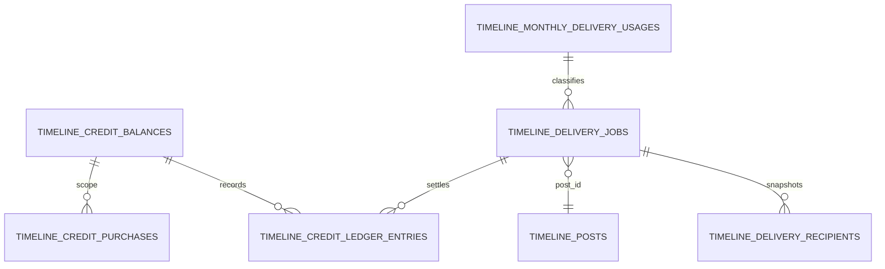

# F09.14 データモデル

> **ステータス**: 🟡 設計精査中

## 1. ドメイン境界と ER

すべて timeline ドメインに置く。TEAM / ORGANIZATION / user / payment への参照は ID だけであり、クロスドメイン FK は作らない。同一 timeline ドメイン内でも、`timeline_posts` は既存設計との後方互換を優先して FK を追加せず、アプリケーションで整合を保証する。`created_at` / `updated_at` は UTC 格納の `DATETIME`、アプリ/API は既存の JST/ユーザーTZ変換規約に従う。

`scope_type` は `TEAM` / `ORGANIZATION`、`scope_id` は既存 BIGINT ID である。scope はポリモーフィックであるため FK を張らない。すべての scope 複合ユニークは `(scope_type, scope_id, ...)` とする。

## 2. 新規テーブル DDL 契約

### `timeline_credit_balances`

scope ごとに一行の財布。行数が scope 数に比例するため UUIDv7 を適用する。

| 列 | 型 / NULL / default | 制約・説明 |
|---|---|---|
| id | BINARY(16) NOT NULL | PK、UUIDv7 |
| scope_type | VARCHAR(20) NOT NULL | CHECK `TEAM` / `ORGANIZATION` |
| scope_id | BIGINT UNSIGNED NOT NULL | cross-domain FKなし |
| available_credits | BIGINT UNSIGNED NOT NULL DEFAULT 0 | 購入済み・未予約・未失効。負数禁止 |
| reserved_credits | BIGINT UNSIGNED NOT NULL DEFAULT 0 | 未完了ジョブの予約。負数禁止 |
| frozen_credits | BIGINT UNSIGNED NOT NULL DEFAULT 0 | dispute / closing / expiry競合で一時的に使用不能な未使用credit |
| status | VARCHAR(20) NOT NULL DEFAULT 'ACTIVE' | `ACTIVE`,`FROZEN`,`SETTLEMENT_BLOCKED`,`CLOSING`,`CLOSED` |
| auto_topup_enabled | BOOLEAN NOT NULL DEFAULT FALSE | 初回手動購入済みでのみ true可 |
| auto_topup_threshold | BIGINT UNSIGNED NULL | enabled時に1以上必須 |
| auto_topup_refill | BIGINT UNSIGNED NULL | enabled時に50以上必須。JPY Stripe 最低額 |
| auto_topup_monthly_cap | BIGINT UNSIGNED NULL | enabled時に refill以上必須 |
| auto_topup_month | DATE NULL | `billing_timezone_id` の月初。cap集計のキー |
| auto_topup_used | BIGINT UNSIGNED NOT NULL DEFAULT 0 | auto_topup_month 内の購入 credit |
| pending_auto_topup_credits | BIGINT UNSIGNED NOT NULL DEFAULT 0 | off-session PaymentIntent 成否待ちのcap予約量 |
| first_manual_purchase_at | DATETIME NULL | auto-topup許可の根拠 |
| billing_timezone_id | VARCHAR(64) NOT NULL | quota / auto-topup capの評価TZ。scope TZ未設定・不正なら`Asia/Tokyo` |
| next_billing_timezone_id | VARCHAR(64) NULL | ADMIN変更時の次period適用待ちTZ |
| version | BIGINT NOT NULL DEFAULT 0 | 楽観ロック補助。残高操作は PESSIMISTIC_WRITE |
| created_at / updated_at | DATETIME NOT NULL | `UuidV7Entity` と同じ監査列契約 |

制約: `available_credits >= 0`、`reserved_credits >= 0`、`frozen_credits >= 0`、`pending_auto_topup_credits >= 0`、`FROZEN` / `SETTLEMENT_BLOCKED` / `CLOSING` / `CLOSED` は有料送信・auto-topup不可。`uq_timeline_credit_balances_scope(scope_type,scope_id)`、`idx_timeline_credit_balances_status(status)`、`idx_timeline_credit_balances_timezone(billing_timezone_id)`。

### `timeline_credit_purchases`

任意額の手動 / 自動補充の支払単位。credit 数と税込JPY額は同一とし、数量割引はない。

| 列 | 型 / NULL / default | 制約・説明 |
|---|---|---|
| id | BINARY(16) NOT NULL | PK、UUIDv7 |
| balance_id | BINARY(16) NOT NULL | 同一timeline domain。FKなしで index |
| scope_type / scope_id | VARCHAR(20) / BIGINT UNSIGNED NOT NULL | 監査・shard用の非正規化 |
| purchase_kind | VARCHAR(20) NOT NULL | `MANUAL`,`AUTO_TOPUP` |
| status | VARCHAR(24) NOT NULL | `PENDING`,`PAID`,`CANCELLED`,`REFUND_PENDING`,`REFUNDED`,`REFUND_LIABILITY`,`EXPIRED`,`DISPUTED` |
| credits_purchased / remaining_credits | BIGINT UNSIGNED NOT NULL | `credits_purchased >= 50`（Stripe購入）。remaining は0以上 |
| amount_yen / tax_yen | BIGINT UNSIGNED NOT NULL | `amount_yen=credits_purchased`、`tax_yen` は内税内訳（会計設定から算出） |
| currency | CHAR(3) NOT NULL DEFAULT 'JPY' | `JPY` のみ |
| stripe_customer_id / stripe_checkout_session_id / stripe_payment_intent_id | VARCHAR(255) NULL | Stripe外部ID。各 non-null 一意 |
| idempotency_key | CHAR(36) NOT NULL | Checkout作成冪等。UNIQUE |
| paid_at / expires_at | DATETIME NULL | paid時 / paid + 2年 |
| cancelled_at / refund_requested_at / refunded_at | DATETIME NULL | 取消・返金遷移の監査 |
| refund_amount_yen | BIGINT UNSIGNED NOT NULL DEFAULT 0 | credit 残高からのみ返金 |
| created_by_user_id | BIGINT UNSIGNED NULL | 操作者。退会後も保持 |
| created_at / updated_at | DATETIME NOT NULL | |

制約: `remaining_credits <= credits_purchased`、`PAID` は `paid_at`,`expires_at`,`stripe_payment_intent_id` 必須。index は `idx_timeline_credit_purchases_fifo(balance_id,status,expires_at,paid_at,id)`、`idx_timeline_credit_purchases_scope(scope_type,scope_id,created_at)`、Stripe外部ID/冪等のUNIQUE。

### `timeline_monthly_delivery_usages`

scope と現地月の投稿枠。月初リセットをバッチで行わず、新月の行を作ることで競合と履歴消失を避ける。

| 列 | 型 / NULL / default | 制約・説明 |
|---|---|---|
| id | BINARY(16) NOT NULL | PK、UUIDv7 |
| scope_type / scope_id | VARCHAR(20) / BIGINT UNSIGNED NOT NULL | |
| period_start | DATE NOT NULL | scope timezone の当月1日。timezone未設定はAsia/Tokyo |
| timezone_id | VARCHAR(64) NOT NULL | 評価時のIANA TZ。fallbackも`Asia/Tokyo`として保存 |
| eligible_post_count | INT UNSIGNED NOT NULL DEFAULT 0 | 受信者>0の実公開トップレベル件数 |
| free_post_count | INT UNSIGNED NOT NULL DEFAULT 0 | 最大100 |
| paid_post_count | INT UNSIGNED NOT NULL DEFAULT 0 | 101件目以降 |
| paid_delivery_count | BIGINT UNSIGNED NOT NULL DEFAULT 0 | 最終capture済通数 |
| version | BIGINT NOT NULL DEFAULT 0 | |
| created_at / updated_at | DATETIME NOT NULL | |

`uq_timeline_monthly_delivery_usages_scope_period(scope_type,scope_id,period_start)` と `idx_timeline_monthly_delivery_usages_period(period_start)`。公開トランザクションではこの行を `PESSIMISTIC_WRITE` で取得または作成し、同一 scope の101件目判定を直列化する。

### `timeline_delivery_jobs`

公開の会計・非同期配信を一意に結び、`timeline_posts.delivery_job_id`（BINARY(16) NULL、FKなし、UNIQUE）で参照する。既存投稿への列追加は後方互換で nullable とする。

| 列 | 型 / NULL / default | 制約・説明 |
|---|---|---|
| id | BINARY(16) NOT NULL | PK、UUIDv7 |
| post_id | BIGINT UNSIGNED NOT NULL | 既存timeline post。UNIQUE、FKなし |
| scope_type / scope_id | VARCHAR(20) / BIGINT UNSIGNED NOT NULL | |
| usage_id | BINARY(16) NULL | 0件投稿ではNULL、FKなし |
| billing_mode | VARCHAR(10) NOT NULL | `FREE`,`PAID`,`NONE` |
| status | VARCHAR(24) NOT NULL | `PREPARING`,`AWAITING_TOPUP`,`PROCESSING`,`COMPLETED`,`FAILURE_RESOLVING`,`PUBLISH_BLOCKED`,`DELETED`。即時・予約とも残高不足は `PUBLISH_BLOCKED` に統一 |
| estimated_recipient_count | INT UNSIGNED NOT NULL | 画面確認時の値、0可 |
| exact_recipient_count | INT UNSIGNED NOT NULL | snapshot件数、0可 |
| reserved_credits / captured_credits / refunded_credits | BIGINT UNSIGNED NOT NULL DEFAULT 0 | `reserved=captured+refunded+未処理予約` をサービスで保証 |
| paid_confirmation_token | CHAR(36) NULL | 見積API発行。PAIDのみ必須、短期TTLとhash照合 |
| attempt_count | SMALLINT UNSIGNED NOT NULL DEFAULT 0 | 最大5。超過で最終失敗 |
| next_attempt_at / started_at / completed_at / failed_at | DATETIME NULL | |
| failure_code / failure_detail | VARCHAR(64) / VARCHAR(500) NULL | PII・Stripe秘密情報を保存しない |
| created_by_user_id | BIGINT UNSIGNED NOT NULL | 操作者 |
| created_at / updated_at | DATETIME NOT NULL | |

index: `uq_timeline_delivery_jobs_post(post_id)`、`idx_timeline_delivery_jobs_queue(status,next_attempt_at,id)`、`idx_timeline_delivery_jobs_scope(scope_type,scope_id,created_at)`、`idx_timeline_delivery_jobs_created_by(created_by_user_id,created_at)`。

### `timeline_delivery_recipients`

公開時に固定した account 別明細。個人フィードへの durable materialization（`DELIVERED`）と精算対象を同一行で扱う。

| 列 | 型 / NULL / default | 制約・説明 |
|---|---|---|
| id | BINARY(16) NOT NULL | PK、UUIDv7 |
| job_id | BINARY(16) NOT NULL | 同一domain、FKなしでindex |
| post_id | BIGINT UNSIGNED NOT NULL | 監査・失効処理用。FKなし |
| recipient_user_id | BIGINT UNSIGNED NOT NULL | account単位、FKなし |
| status | VARCHAR(20) NOT NULL DEFAULT 'PENDING' | `PENDING`,`DELIVERED`,`RETRYING`,`UNDELIVERABLE`,`REFUNDED`,`ANONYMIZED` |
| delivered_at / finalised_at | DATETIME NULL | |
| retry_count | SMALLINT UNSIGNED NOT NULL DEFAULT 0 | 最大5 |
| failure_code | VARCHAR(64) NULL | |
| archived_at | DATETIME NULL | 13か月後の匿名化時刻 |
| created_at / updated_at | DATETIME NOT NULL | |

`uq_timeline_delivery_recipients_job_user(job_id,recipient_user_id)` が重複排除の最終防壁。`idx_timeline_delivery_recipients_job_status_id(job_id,status,id)` は keyset batch、`idx_timeline_delivery_recipients_recipient(recipient_user_id,post_id)` は可視性照合、`idx_timeline_delivery_recipients_archive(archived_at,created_at)` はアーカイブに使う。

### `timeline_credit_ledger_entries`

append-only の会計・監査元帳。account別明細を13か月保持する。

| 列 | 型 / NULL / default | 制約・説明 |
|---|---|---|
| id | BINARY(16) NOT NULL | PK、UUIDv7 |
| balance_id / purchase_id / job_id / recipient_id | BINARY(16) NULL | 全てID参照、cross-domain FKなし |
| scope_type / scope_id | VARCHAR(20) / BIGINT UNSIGNED NOT NULL | |
| entry_type | VARCHAR(24) NOT NULL | `PURCHASE`,`RESERVE`,`CAPTURE`,`REFUND`,`EXPIRE`,`CANCEL`,`SCOPE_DELETE_REFUND`,`DISPUTE_FREEZE`,`DISPUTE_UNFREEZE`,`RECOVERY` |
| credits_delta | BIGINT SIGNED NOT NULL | 例: reserve 0（内訳移動）、capture -1、refund +1 |
| reserved_delta | BIGINT SIGNED NOT NULL | reserve +1、capture -1、refund -1 |
| amount_yen | BIGINT SIGNED NOT NULL | 税込。1 credit=1円 |
| recipient_user_id | BIGINT UNSIGNED NULL | 13か月後NULL化 |
| occurred_at | DATETIME NOT NULL | |
| actor_user_id | BIGINT UNSIGNED NULL | 操作者/システム |
| idempotency_key | VARCHAR(100) NOT NULL | UNIQUE。job/recipient/entry_type由来 |
| metadata_json | JSON NULL | PII・カード情報・Stripe秘密情報禁止 |
| created_at / updated_at | DATETIME NOT NULL | |

index: `uq_timeline_credit_ledger_idempotency(idempotency_key)`、`idx_timeline_credit_ledger_scope_occurred(scope_type,scope_id,occurred_at)`、`idx_timeline_credit_ledger_purchase(purchase_id,occurred_at)`、`idx_timeline_credit_ledger_recipient(recipient_user_id,occurred_at)`。

### `timeline_credit_disputes`

Stripe dispute と回収債務は購入と独立に完全保存する。

| 列 | 型 / NULL / default | 制約・説明 |
|---|---|---|
| id | BINARY(16) NOT NULL | PK、UUIDv7 |
| purchase_id | BINARY(16) NOT NULL | timeline purchase ID、FKなし |
| scope_type / scope_id | VARCHAR(20) / BIGINT UNSIGNED NOT NULL | |
| stripe_dispute_id | VARCHAR(255) NOT NULL | UNIQUE |
| stripe_charge_id | VARCHAR(255) NULL | index。カード情報は保存しない |
| status | VARCHAR(20) NOT NULL | `OPEN`,`WON`,`LOST`,`SETTLED` |
| amount_yen | BIGINT UNSIGNED NOT NULL | dispute対象額（税込） |
| frozen_credits | BIGINT UNSIGNED NOT NULL DEFAULT 0 | 未使用分をfreezeした量 |
| recovery_credits | BIGINT UNSIGNED NOT NULL DEFAULT 0 | 既使用分の回収対象 |
| recovered_credits | BIGINT UNSIGNED NOT NULL DEFAULT 0 | settlement済み回収量 |
| opened_at / resolved_at / settled_at | DATETIME NOT NULL / NULL / NULL | 外部イベント時刻/終結/入金確認 |
| created_at / updated_at | DATETIME NOT NULL | |

制約: `recovered_credits <= recovery_credits`。indexは `uq_timeline_credit_disputes_stripe(stripe_dispute_id)`、`idx_timeline_credit_disputes_scope_status(scope_type,scope_id,status)`、`idx_timeline_credit_disputes_purchase(purchase_id)`。

### `timeline_delivery_archives`

recipient IDを13か月後に匿名化する前の月次集計先。行はscope・月・元帳種別ごとに増えるためUUIDv7を適用する。

| 列 | 型 / NULL / default | 制約・説明 |
|---|---|---|
| id | BINARY(16) NOT NULL | PK、UUIDv7 |
| scope_type / scope_id | VARCHAR(20) / BIGINT UNSIGNED NOT NULL | |
| period_start | DATE NOT NULL | scope timezoneの月初 |
| entry_type | VARCHAR(24) NOT NULL | ledgerと同じ種別 |
| recipient_count | BIGINT UNSIGNED NOT NULL DEFAULT 0 | 匿名化したaccount別行数 |
| credits | BIGINT SIGNED NOT NULL DEFAULT 0 | 月次差分 |
| amount_yen | BIGINT SIGNED NOT NULL DEFAULT 0 | 税込差分 |
| archived_at | DATETIME NOT NULL | |
| created_at / updated_at | DATETIME NOT NULL | |

`uq_timeline_delivery_archives_scope_period_type(scope_type,scope_id,period_start,entry_type)`、`idx_timeline_delivery_archives_scope_period(scope_type,scope_id,period_start)`。

### 既存 `timeline_posts` の追加列

| 列 | 型 / NULL / default | 制約・説明 |
|---|---|---|
| delivery_job_id | BINARY(16) NULL | `timeline_delivery_jobs.id` のID参照（FKなし）。対象外・migration前投稿はNULL。UNIQUE index `uq_timeline_posts_delivery_job_id` |
| publication_status | VARCHAR(20) NULL | 対象TEAM/ORGトップレベルは`PREPARING/PUBLISHED/PUBLISH_BLOCKED`、legacy/対象外はNULL。既存`status`（DRAFT/SCHEDULED/PUBLISHED）を変更しない |

`idx_timeline_posts_publication(scope_type,scope_id,publication_status,deleted_at,created_at DESC)`を追加する。feed/search/detailの通常公開述語は「`delivery_job_id IS NULL`なら既存status判定、non-nullなら`publication_status='PUBLISHED'`」であり、PREPARINGが既存`status=PUBLISHED`のままscope feedへ漏れることを防ぐ。

## 3. Flyway・データ移行・保持

- 実装時に一つの論理変更として上記の CREATE TABLE と `timeline_posts.delivery_job_id` を追加する。新規テーブルの末尾はすべて `ENGINE=InnoDB DEFAULT CHARSET=utf8mb4 COLLATE=utf8mb4_0900_ai_ci` を明記する。
- migration 名は `V{origin/main最大major+1}.{UTC timestamp}__add_timeline_delivery_prepaid_credits.sql`。実装開始・PRマージ直前に最大majorと同名衝突を再確認する。`IF [NOT] EXISTS` は使わない。
- `delivery_job_id` は既存投稿を NULL のまま保つ。backfillしない。feature flag 有効化後の公開だけが新規ジョブを作る。
- 毎日、失効購入の `remaining_credits` を0にして `EXPIRE` 元帳を追記する。毎月のリセットは行削除でなく新 `usage` 行で実現する。
- 毎月、13か月を超えた recipient/ledger の `recipient_user_id` を NULL にし、scope・月・entry_typeごとに `timeline_delivery_archives` へ加算する。原行は会計監査用に残すが個人IDを復元不能にする。
- scope 削除・購入取消・Stripe返金は物理削除しない。ステータス、元帳、Stripe外部IDを保持する。ユーザー退会は同じ匿名化バッチで recipient/actor を匿名化する。

## 4. 第1精査で追加した整合性モデル

### `timeline_delivery_confirmations`

paid送信の一回確認をサーバ永続化する。raw tokenは返却時だけに存在し、DBにはSHA-256 hashのみを保持する。

| 列 | 型 / NULL / default | 制約・説明 |
|---|---|---|
| id | BINARY(16) NOT NULL | PK、UUIDv7 |
| token_hash | BINARY(32) NOT NULL | UNIQUE。raw token不保存 |
| scope_type / scope_id / actor_user_id | VARCHAR(20) / BIGINT / BIGINT NOT NULL | scope/操作者へ束縛、FKなし |
| request_hash | BINARY(32) NOT NULL | content以外のscope/deliveryScope/status/parent等のcanonical hash |
| delivery_scope | VARCHAR(20) NOT NULL | `DIRECT/CHILDREN/DESCENDANTS` |
| estimated_recipient_count / estimated_amount_yen | BIGINT UNSIGNED NOT NULL | 表示時点の概算 |
| issued_at / expires_at / consumed_at | DATETIME NOT NULL / NOT NULL / NULL | TTL5分、consume一回のみ |
| idempotency_key | CHAR(36) NOT NULL | actor+scopeでUNIQUE |
| created_at / updated_at | DATETIME NOT NULL | |

`uq_timeline_delivery_confirmations_token_hash`、`uq_timeline_delivery_confirmations_actor_idempotency(actor_user_id,idempotency_key)`、`idx_timeline_delivery_confirmations_expiry(expires_at)`。予約投稿は confirmation を使わず、下記policyのADMIN承認を保存する。

### `timeline_paid_delivery_policies`

scope ADMINだけが設定する自動投稿用の永続paid consent。`id` UUIDv7、`scope_type/scope_id`、`enabled`、`max_amount_yen_per_post`、`monthly_cap_yen`、`period_start`、`used_amount_yen`、`approved_by_user_id`、`approved_at`、`revoked_at`、監査列を持つ。`uq(scope_type,scope_id)`。自動・予約投稿が実公開時に101件目以降なら、enabledかつmax/monthly cap内でのみ有料予約できる。未許可/上限超過は `PUBLISH_BLOCKED`で非公開に残す。

### `timeline_credit_reservation_allocations`

purchase lotごとの予約残を持たずにcapture/refundすると、期限・取消・disputeと競合する。jobとlotのallocationを先に固定する。

| 列 | 型 / NULL / default | 制約・説明 |
|---|---|---|
| id | BINARY(16) NOT NULL | PK、UUIDv7 |
| job_id / purchase_id / balance_id | BINARY(16) NOT NULL | timeline ID参照、FKなし |
| reserved_credits | BIGINT UNSIGNED NOT NULL | 初期割当 |
| remaining_reserved_credits | BIGINT UNSIGNED NOT NULL | capture/refund未処理分 |
| captured_credits / refunded_credits | BIGINT UNSIGNED NOT NULL DEFAULT 0 | 終端量 |
| frozen_credits | BIGINT UNSIGNED NOT NULL DEFAULT 0 | dispute/closingで使用不能にした予約残 |
| expires_at | DATETIME NOT NULL | lotの期限を固定 |
| status | VARCHAR(20) NOT NULL | `ACTIVE`,`FROZEN`,`SETTLED`,`REFUNDED`,`EXPIRED` |
| created_at / updated_at | DATETIME NOT NULL | |

`uq(job_id,purchase_id)`、`idx(purchase_id,status)`、`idx(job_id,status)`。恒等式は各lotで `purchase.remaining = available_lot + allocated_remaining + frozen_lot`、各allocationで `reserved = remaining + captured + refunded`、balanceで `available_credits + reserved_credits + frozen_credits = sum(PAID purchase remaining_credits not expired/refunded/cancelled) + pending_auto_topup_credits`、累計はledgerで `PURCHASE - CAPTURE - EXPIRE - CANCEL - SCOPE_DELETE_REFUND ± DISPUTE/RECOVERY = balance + archive` と突合する。recipientごとにwallet/purchaseを更新せず、workerはbatchの成功数をlot allocation順に一回のset-based captureで処理する。

競合順序は **CLOSING/dispute freeze → expiry → job capture/refund**。CLOSING/FROZEN allocationはcapture不可で、未配信残はrefund liabilityまたはfrozen bucketへ移す。期限時にACTIVE allocationが残るなら新規配信を止め、既にsnapshot済みの成功分だけcaptureし未達はrefund、expiryはremaining lotだけに適用する。複数disputeはpurchaseごとにfreezeを加算し、wallet statusは最重い未終結状態から導出する。

### Temporal audience projection

recipient snapshotの時間点を固定するため、timeline domain に次のID-only projectionを置く。全テーブルUUIDv7、cross-domain FKなし、`source_event_version`の単調更新、`valid_from`/`valid_to DATETIME`、監査列を持つ。

| projection | 正準行・index |
|---|---|
| `timeline_audience_memberships` | `user_id,scope_type,scope_id,membership_kind(DIRECT_TEAM/DIRECT_ORG/TEAM_ANCHOR),active,valid_from,valid_to,source_event_version`。`idx(scope_type,scope_id,active,valid_from,valid_to,user_id)` |
| `timeline_audience_org_ancestors` | `descendant_org_id,ancestor_org_id,distance,active,valid_from,valid_to,source_event_version`。`uq(descendant,ancestor,valid_from)`、`idx(ancestor,distance,active,valid_from,valid_to,descendant)`。cycle検出済みeventだけを反映 |
| `timeline_audience_team_anchors` | `team_id,anchor_org_id,active,valid_from,valid_to,source_event_version`。`idx(anchor_org_id,active,valid_from,valid_to,team_id)` |
| `timeline_audience_mutes` | `user_id,scope_type,scope_id,active,valid_from,valid_to,source_event_version`。`uq(user,scope_type,scope_id,valid_from)`、`idx(scope_type,scope_id,active,valid_from,valid_to,user_id)` |

Team/Organization membership・hierarchy・muteの各domain eventはsource transaction commit後にprojection inboxへ記録される。public化workerはprojection watermarkが要求event versionを満たすまでPREPARINGのまま待つ。**既存 `TimelineDeliveryScopeResolver` はcaller一人への可視性判定専用でありrecipient列挙には使用しない。** 正準queryはtime `T` でACTIVE direct team memberをTEAM recipientとし、ORGはdirect org member（distance0）、org descendant membership、team anchorのancestor distanceをunionし、`delivery_scope=DIRECT`はdistance0、`CHILDREN`は0..1、`DESCENDANTS`は0..app.org.max-depthに絞る。team anchor経路はCMP-058の+1距離規則を保持する。最後に`DISTINCT user_id`、author除外、`timeline_audience_mutes`のactive anti-joinを行う。

各source domainのoutboxは`aggregate_type,aggregate_id,event_version,occurred_at,payload_hash`を持ち、projection checkpointは`source_name,partition_key,last_event_version,updated_at`（自然複合UNIQUE、UUIDv7監査行）を持つ。jobは`membership_fence_version`,`hierarchy_fence_version`,`mute_fence_version`をPREPARING開始時に保存する。正準queryは各projection行の`source_event_version <= 対応fence`かつ`valid_from <= T < valid_to（NULLは無限）`だけを読む。checkpointが全fenceに達するまでsnapshotを作らない。設定`mannschaft.timeline-delivery.projection-lag-timeout`（初期10分）超過は`PUBLISH_BLOCKED`・ADMIN通知で、usage/creditは0のままにする。

VARCHAR enum安全長: `timeline_delivery_jobs.status VARCHAR(24)`（最長`FAILURE_RESOLVING`=17）、`timeline_posts.publication_status VARCHAR(20)`（最長`PUBLISH_BLOCKED`=15）、balance/purchase/allocation/dispute statusのVARCHAR(20/24)はいずれも最長18未満である。実装FlywayではMySQL 8 `CHECK (status IN (...))`を各新規enum列へ候補として付け、既存`timeline_posts.publication_status`にも同CHECKを付ける。

### Queue・退会・timezone

job tableは唯一の耐久queueである。`lease_owner VARCHAR(100) NULL`,`lease_until DATETIME NULL`,`lease_version BIGINT NOT NULL DEFAULT 0`,`preparation_requested_at`,`snapshot_at`,`publish_committed_at`,`blocked_reason`を追加する。delivery workerは`status in (PREPARING,PROCESSING)`を`FOR UPDATE SKIP LOCKED`で選び、leaseをCASで取得する。`AWAITING_TOPUP`はStripe webhook dispatcherだけが`PREPARING`または`PUBLISH_BLOCKED`へ進める。sweeperは`lease_until < now`を再取得可能にし、Pod crash後も同一jobを再開する。別outboxは作らない。

wallet作成時にscope timezoneを採用し、無ければ`Asia/Tokyo`を固定する。ADMINのtimezone更新APIは`next_billing_timezone_id`を保存し翌period_startからだけ適用する。quotaとauto-topup月capは常にこのtimezoneを使う。

退会event受信時、recipient/actor/purchaserのuser IDを即時NULLまたはHMAC化し、遅くとも30日以内に`anonymized_at`を設定する。これは通常13か月のaccount明細保持より優先する。HMAC key versionのみ監査に残し、PII復元は不可とする。
