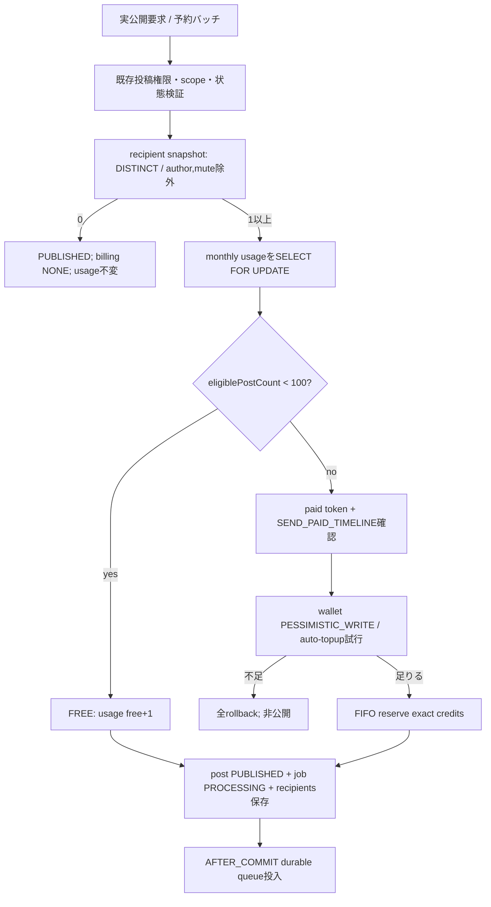
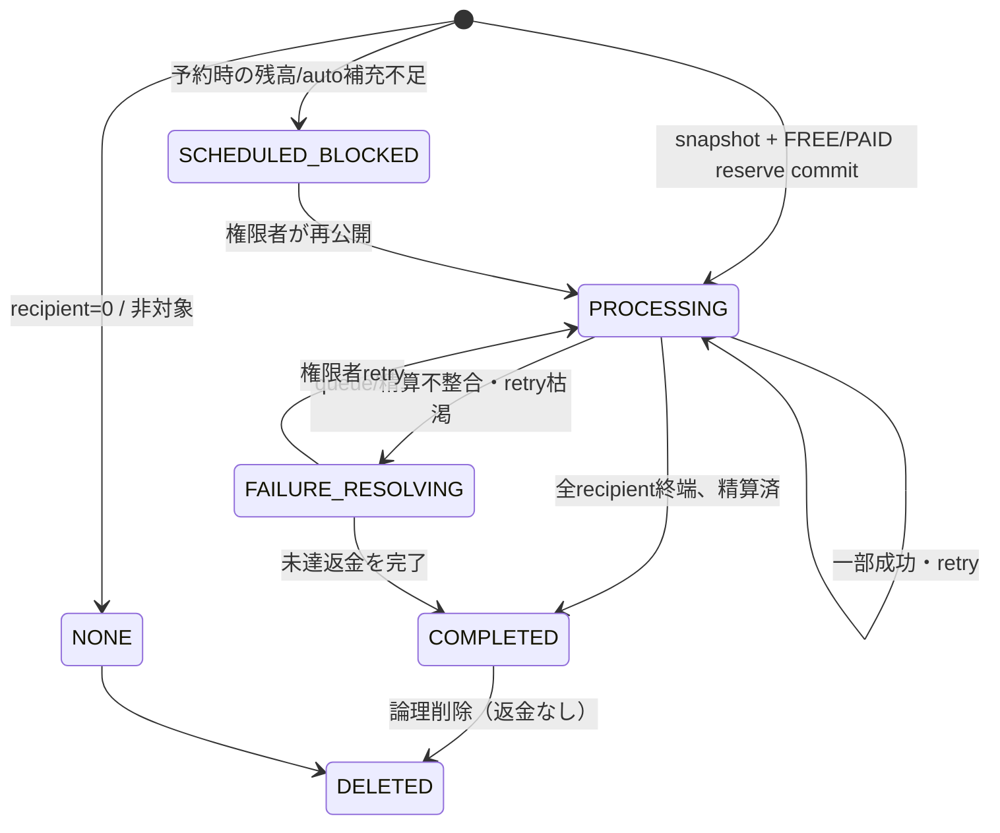

# F09.14 業務ロジック・受け入れ条件

> **ステータス**: 🟡 設計精査中

## 1. 到達対象・無料枠・公開トランザクション

### 1.1 到達対象の確定

`TimelineDeliveryRecipientSnapshotService` が実公開時に一度だけ候補を解決する。TEAM は直接 ACTIVE member、ORGANIZATION は既存 `TimelineDeliveryScopeResolver` の `DIRECT` / `CHILDREN` / `DESCENDANTS` を使う。account (`user_id`) を DISTINCT し、投稿者と公開時ミュートを除く。scopeミュートは feed表示設定だが、明示的に「公開時ミュートなら配信しない」という本機能の契約として snapshot 前に適用する。

snapshotは `timeline_delivery_recipients` に一括 INSERT し、`uq(job_id,recipient_user_id)` を最終重複防壁とする。無料投稿も必ず同じsnapshotを作る。後加入は過去jobに行がないため遡及されず、後脱退は recipient行を消さず、既存 ContentVisibilityResolver が表示時に在籍を再確認して遮断する。scope timeline の browse は従来の入場認可を維持する。個人フィード、詳細、返信、投稿者一覧、検索は同一の snapshot + 動的認可述語を共有する。ミュートだけは feed に限定する。

### 1.2 月次判定と原子公開

対象は `scope_type in (TEAM, ORGANIZATION)`、`parent_id is null`、実公開、snapshot件数>0のみ。自動・予約は公開時、返信・編集・リトライは除外する。scope timezoneは Team/Organization の IANA timezone、未設定・不正なら `Asia/Tokyo`。period_startはそのtimezoneでの月初日である。

usage行とwallet行は昇順の `(scope_type, scope_id)` でロックし、1投稿は1scopeしか扱わない。usage行が無い最初の公開では unique key 衝突をリトライし、その後 `PESSIMISTIC_WRITE` を取得する。これにより同時の99/100/101件目も一意にFREE/FREE/PAIDと決まる。paid confirmationは概算時に取得し、公開時にはscope・actor・deliveryScope・nonce・有効期限だけを検証する。exact受信者数と概算が変わっても、残高が足りれば再確認しない。不足なら投稿も usageも recipientsも残さない。

### 1.3 非同期配信・精算

公開トランザクションは durable job/recipient/ledger を保存し、`AFTER_COMMIT` でqueueへ出す。ワーカーは `status=PROCESSING` のjobを `SKIP LOCKED` 相当または leaseで取得し、recipientを `(job_id,status,id)` keyset batch（初期500、設定化）で処理する。accountごとのfeed materializationは job/recipientの一意キーで冪等にする。

- 配信成功: recipient `DELIVERED`、paidなら購入FIFOから1creditを `CAPTURE`。予約totalを減らす。
- 一時障害: `RETRYING`、指数backoff（1分/5分/30分/2時間/12時間、最大5回）。
- 恒久障害または最大回数: `UNDELIVERABLE`。paid予約のうち未capture 1creditを `REFUND` してavailableへ戻す。
- 全recipientが終端ならjob `COMPLETED`。不整合やワーカー全体障害で未解決なら `FAILURE_RESOLVING` とし、手動retry/refund完了まで編集・削除をロックする。

`PROCESSING` および `FAILURE_RESOLVING` の投稿は編集・削除不可。完了後の編集は本文だけを変更し受信者再計算・再課金なし。削除は論理削除するが、既にcaptureしたcreditは返金しない。投稿本文の削除後も会計・recipient監査は保持する。

## 2. プリペイド、auto-topup、返金・dispute

### 2.1 購入と FIFO

1 credit=税込1円、購入は任意整数50credit以上（Stripe JPYの最低50円）で、presetはUIのショートカットに過ぎない。価格割引はない。Checkoutは PENDING purchaseを作り、webhookの `checkout.session.completed` だけがPAID・available加算を行う。重複webhookは Stripe event ID と purchase status / idempotencyで何度来ても一度だけ処理する。`expires_at=paid_at+2年`、FIFOは `(expires_at,paid_at,id)` の順で最古のremainingから消費する。

auto-topup は ADMIN が初回手動購入後にだけ、threshold/refill/月上限を三つ揃えて有効化できる。公開時の予約前および日次監視で、`available < threshold` のときのみ足りる回数を試みる。月上限を超える購入は作らず、cap到達で停止して通知する。paid senderは設定変更できない。

### 2.2 取消・scope削除・所有移転

- PAIDかつ `remaining_credits=credits_purchased` の完全未使用purchaseだけを、ADMINが通常取消できる。reserved/captured/expired/reversedが1 creditでもあれば取消不可。
- scope削除では、期限内の各purchase remainingをFIFO単位でStripe元paymentへ返金する。used/expired分は返金しない。Stripe返金が失敗・不能でもscope削除は止めず、purchaseを`REFUND_LIABILITY`、元帳を記録しADMIN/SYSTEM_ADMINへ手動対応通知する。
- scope所有権移転ではbalance/purchase/job/auto設定はscopeとともに移る。確定前画面は両当事者に残高・予約・auto設定・disputeを表示し、監査にtransfer前後のownerを記録する。

### 2.3 Chargeback

`charge.dispute.created` または `funds_withdrawn` は該当purchaseとscopeを同定し、未使用 creditをfreeze、既に使用した分を`recovery_credits`として記録、walletを`FROZEN`または`SETTLEMENT_BLOCKED`へ、paid送信・auto-topupを停止する。ADMIN/SYSTEM_ADMINへ即時通知する。`charge.dispute.closed`がwon、または`funds_reinstated`なら未使用freezeを解除する。lostは入金等でsettlement完了までblockを維持する。外部カード会社へのchargebackそのものを技術的に阻止することはしない。

## 3. 通知・監視・スケジュール

以下をscope ADMINへ既存通知基盤で一意キー付き送信する: 無料投稿80/100・100/100、残高がthreshold以下、auto-topup開始/成功/失敗/cap到達、期限30日/7日前/失効、予約投稿blocked、job最終失敗、返金liability、dispute開始/解決。SYSTEM_ADMINはdispute/liabilityも受け取る。

予約投稿は保存時にcreditを予約しない。実公開時のsnapshot/usage/残高を使い、auto-topupを試み、失敗時は timeline post を `SCHEDULED` のまま、delivery job を `SCHEDULED_BLOCKED`（投稿は非公開）としてADMINへ通知する。再実行は ADMIN または許可された送信者が行う。

メトリクス: `timeline_delivery_publish_total{scope_type,billing_mode,outcome}`、`timeline_delivery_job_duration_seconds`、`timeline_delivery_recipient_total{status}`、`timeline_credit_available/reserved`、`timeline_credit_auto_topup_total{outcome}`、`timeline_credit_refund_liability_total`、`timeline_credit_dispute_total{status}`、queue lag、snapshot query latency。ログは jobId/postId/scope/actor を構造化し、recipient ID、本文、Stripe secretは出さない。

## 4. 状態機械

purchase state: `PENDING -> PAID -> {EXPIRED | REFUND_PENDING -> REFUNDED | REFUND_LIABILITY | DISPUTED}`。`PENDING -> CANCELLED`、`PAID -> CANCELLED` は完全未使用取消だけ、`DISPUTED -> PAID` はwon/reinstated、`DISPUTED -> SETTLEMENT_BLOCKED` はlostのscope状態である。

## 5. 受け入れ条件（/試練へ直結）

### 正常系

1. TEAM/ORGANIZATION の実公開トップレベル投稿で一意recipientが1件以上なら、scope・現地月ごとに1〜100件目がFREEとなり、`freePostCount`だけが増える。
2. 101件目以降は exact unique recipient数だけPAIDとなり、1accountあたり1credit・税込1円をFIFO予約する。TEAMとORGANIZATION、および別scopeのusage/財布は相互に影響しない。
3. 同じ account が直属組織・複数team・複数descendant経路にいてもrecipient行は1件、creditも1だけである。
4. TEAMは直接ACTIVE member、ORGANIZATIONはDIRECT/CHILDREN/DESCENDANTSの既存到達規則に従い、DIRECTも課金対象である。
5. 投稿者と公開時点のscopeミュートaccountはsnapshotから除かれる。解除・後加入は過去snapshotを変えず、後脱退は動的認可で個人feed/detailを遮断する。
6. 無料投稿もsnapshotを持ち、後加入者へ遡及しない。検索・投稿者一覧・詳細・返信は配信可視性と対称、muteだけはfeed限定である。
7. 受信者0件の投稿は公開でき、jobはNONE、usage/credit/ledgerは不変である。
8. paid送信者が一度確認して公開すると、exact件数が概算から増減しても、残高があれば再確認なくPROCESSINGとなる。
9. jobはkeyset batchで全recipientを一度ずつ処理し、成功分をcapture、最終未達だけをrefundする。再試行・重複queue・webhookで二重feed/二重消費はない。
10. 完了後の編集はrecipient/usage/creditを変えず、削除は可能で既消費creditを返金しない。
11. 50credit以上の手動購入はCheckout完了webhookでのみPAID化し、2年期限、FIFO、任意額・無割引として財布へ入る。
12. ADMINが初回手動購入後、threshold/refill/月capを設定でき、threshold到達時にcap内だけauto-topupする。
13. 完全未使用purchaseのみ通常取消できる。scope削除は有効かつ未使用部分を元paymentへ返金し、返金不能ならliabilityを残して削除は完了する。
14. 所有移転は財布とauto設定をscopeに追随させ、前後owner双方に事前表示する。
15. recipient/ledgerのaccount IDは13か月後に匿名化され、scope月別集計は保持される。

### 異常・境界・並行

16. paid見込でconfirmation tokenなし、期限切れ、別actor/scope/tokenなら402で投稿・usage・reservationを残さない。
17. `SEND_PAID_TIMELINE`なしは403、十分な既存投稿権限がある無料投稿はそのpermissionなしでも従来どおり公開できる。
18. exact credit不足、wallet FROZEN/CLOSED/SETTLEMENT_BLOCKED、auto-topup失敗/cap到達ではpartial delivery/負残高/72h graceを作らず、全てrollbackまたは予約投稿はBLOCKEDにする。
19. 同一scopeで99件目・100件目・101件目を同時公開すると、PESSIMISTIC lockにより必ず2件FREE・1件PAIDになり、異scope間はブロックしない。
20. 親投稿への返信、編集、retry、自動再配送は月100投稿に含まずcreditも消費しない。予約保存は無料枠もcreditも消費せず、実公開時だけ評価する。
21. PROCESSING/FAILURE_RESOLVING中の編集・削除は409。最終失敗後はretryまたは未達返金が完了するまでlockされる。
22. 一部batch失敗、worker再起動、同job二重取得、Stripe webhook重複、DB一時失敗でもidempotency keyと状態遷移によりcapture/refundは最大1回である。
23. auto-topupを初回手動購入前に有効化、50未満購入、cap<refill、負数/小数/過大数値は400。
24. 使用済みpurchaseの通常取消は409、refund webhook失敗は握りつぶさずREFUND_LIABILITY・監視・通知を残す。
25. dispute開始/withdrawnで未使用credit凍結、paid送信/auto停止、used分recoveryとADMIN/SYSTEM_ADMIN通知を行い、won/reinstatedでのみ解除、lostはsettlementまでblockする。

### 認可・障害・性能・E2E

26. 非所属者・異scope IDは404、未認証は401、ADMIN以外はwallet/purchase/refund/auto設定/dispute明細を読めず、`VIEW_TIMELINE_COST`は概算・usageだけ、`SEND_PAID_TIMELINE`は送信だけを許す。
27. API全fieldのlowerCamelCase、nullable、数値string、enum、202 PROCESSING、402/403/404/409/502の契約をOpenAPI contract testで固定する。
28. 1000万userを前提に、snapshotはDISTINCTをDBで実行、recipient insertと配信をkeyset batchにし、N+1を作らない。1万recipientの公開がHTTP request内で配信を待たず、queue lag/失敗/latencyが観測できる。
29. 実DB integration testでusage/wallet行ロック、FIFO、rollback、期限、recipient unique、アーカイブを検証し、TestcontainersのFlyway全適用でUUIDv7列・index・照合順序・既存timeline_posts列追加を検証する。
30. 実機E2Eで、ADMINの残高補充→有料確認1回→PROCESSING→個人feed到達→dashboard反映、DEPUTYの委任/拒否、残高不足、予約blocked、auto cap、ミュート、脱退、dispute bannerを確認し、Stripeはtest mode webhook署名を通す。
