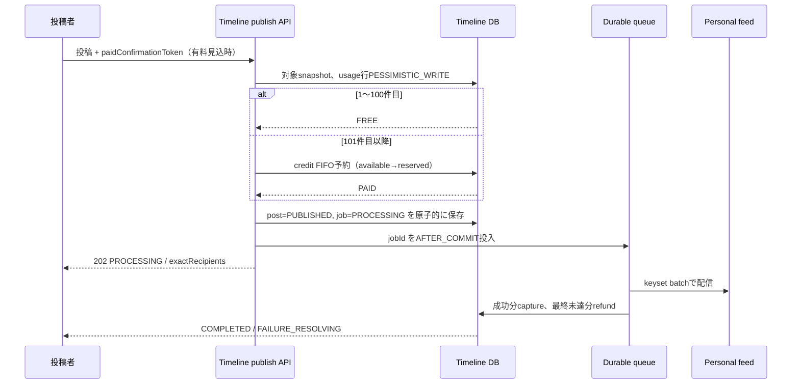

# F09.14 タイムライン配信プリペイドクレジット

> **ステータス**: 🟡 設計精査中
> **対象**: TEAM / ORGANIZATION の配下配信（F04.1 / CMP-058 を前提）
> **最終更新**: 2026-08-23

## 1. 結論と用語

TEAM または ORGANIZATION に投稿したトップレベル投稿を、その到達対象の個人タイムラインへ流す。毎月、**scope ごとに最初の100投稿**を無料とし、101件目以降は、実公開時に確定した**一意な受信 account 1件を1通=1 credit=税込¥1**として、専用プリペイド残高から消費する。

| 用語 | 定義 |
|---|---|
| scope | `TEAM:{teamId}` または `ORGANIZATION:{organizationId}`。両者の無料枠・財布・自動補充・利用履歴は完全に分離する |
| 投稿 | `parent_id IS NULL` で、実公開時に受信者が1件以上ある `PUBLISHED` 投稿。無料枠の単位は通数ではなく投稿数 |
| 通 / delivery | スナップショットされた重複なし `user_id` 1件。1000 account なら1000 credit |
| 概算 | 作成画面・ダッシュボードで返す `asOf` 付き候補数。公開時の確定件数とは増減しうる |
| 予約 / capture | 公開トランザクションで credit を `available` から `reserved` へ移すこと / ジョブ成功分を FIFO 購入残高から確定消費すること |

対象は全 TEAM / ORGANIZATION のトップレベル投稿で、ORGANIZATION は `DIRECT` を含む既存の配下到達規則に従う。返信、編集、リトライは無料投稿数・課金の対象外である。自動投稿と予約投稿は実公開時に評価する。投稿者本人、公開時点で当該 scope をミュートしている account、重複 account は対象外とする。0件なら公開するが計上しない。

通知プリペイド（F09.13）とは財布・無料枠・猶予・パッケージを共有しない。F09.13 から Stripe Checkout / Customer / webhook 署名検証・冪等・FIFO・期限・監査のパターンだけを再利用する。通知の月1万通無料、72時間猶予、組織限定、数量割引は本機能に持ち込まない。

## 2. 利用者体験

1. ADMIN または `VIEW_TIMELINE_COST` を持つ者は、ダッシュボードと投稿フォームで、scope 別の概算受信者数・`asOf`・今月の無料利用/残数を見る。
2. 無料枠内なら、従来の投稿権限だけで投稿できる。従来の MEMBER 等の無料投稿権限を狭めない。
3. 有料になり得る投稿は、`SEND_PAID_TIMELINE` を持つ者だけが送信でき、概算件数・推定税込額・残高を一度だけ明示確認する。公開時に件数が変わっても二重確認しない。
4. 公開時に usage 行を悲観ロックし、100件目までを無料、101件目以降を有料と決定する。十分な残高がなければ、投稿・usage・予約をすべてロールバックし、部分配信・負残高・猶予は発生しない。
5. 成功した公開は直ちに `PROCESSING` と表示し、耐久キューが account ごとへ配信する。最終未達分だけを返金する。完了後は編集できる（再課金なし）。削除はできるが返金しない。

## 3. 権限・責務

| 操作 | ADMIN | DEPUTY 等の permission group | その他 |
|---|---:|---:|---:|
| 無料枠内の通常投稿 | 既存権限 | 既存権限 | 既存権限 |
| 有料投稿の送信 | 可 | `SEND_PAID_TIMELINE` | 不可 |
| 概算・無料利用状況 | 可 | `VIEW_TIMELINE_COST` | 不可 |
| 残高、購入、返金、dispute、auto-topup | 可 | 不可 | 不可 |
| `SEND_PAID_TIMELINE` / `VIEW_TIMELINE_COST` の委任 | 可 | 不可 | 不可 |

SYSTEM_ADMIN は障害対応・監査閲覧を行えるが、scope の財布操作は所有 scope の ADMIN のみとする。すべての scope 解決は team / organization の Service と既存の ContentVisibilityResolver を経由し、IDだけから存在を漏らさない。

## 4. 文書構成

- [01 データモデル](01_data_model.md): DDL、ER、保存期間、Flyway
- [02 API 設計](02_api_design.md): エンドポイント、型、認可、エラー
- [03 業務ロジック](03_business_logic.md): 状態機械、配信、精算、受け入れ条件
- [04 セキュリティ・UI・i18n](04_security_ui_i18n.md): 権限、操作体験、監視、6言語キー

## 5. 実装境界・後方互換

- `timeline_posts` の既存 BIGINT ID を変更しない。新設の課金・ジョブ・受信者明細テーブルは UUIDv7 (`BINARY(16)`) を主キーとする。
- TEAM / ORGANIZATION / user / Stripe payment への参照は ID と index のみで保持し、クロスドメイン FK は作らない。削除・所有移転は domain event で処理する。
- 既存投稿は遡及スナップショットせず、migration 後に実公開された投稿から対象にする。既存クライアントが `paidConfirmed` を送らない場合、無料投稿は従来どおり送信できるが、有料になった時点で402として明示確認を要求する。
- 実装時の Flyway は `V{origin/main の最大major+1}.{UTC yyyyMMddHHmmss}__add_timeline_delivery_prepaid_credits.sql` とする。設計時の番号は予約せず、マージ直前に origin/main を再確認する。

## 6. 設計精査記録

| パス | 観点 | 結果 |
|---|---|---|
| 第1パス | 不備、セキュリティ、UX、既存仕様、保守性、検証可能性 | 精査待ち |
| 第2パス | 独立した状態遷移・会計・E2E観点 | 第1パス後に実施 |
| E2E耐性 | API型、null、認可、非同期の観測点 | 第2パス後に実施 |
