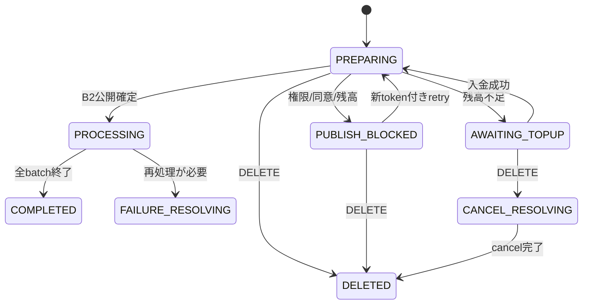

# F09.14 タイムライン配信プリペイドクレジット

> **ステータス**: 🟢 設計完了（Phase 0是正・簡素化・限定検分済み）
> **対象**: TEAM / ORGANIZATION のトップレベル投稿、既存F04.1 timelineを前提
> **正本**: 本READMEが用語・課金・権限・主要状態・flag契約の正本。詳細は01〜04を参照する。

## 1. 結論と利用単位

TEAM財布とORGANIZATION財布は別会計である。各scopeは月100**投稿**を無料とし、100通ではない。101投稿目以降は、実公開時に重複排除した一意の1アカウント到達ごとに1 credit = 1円を、同scopeのプリペイド財布から消費する。1投稿の宛先上限は設けない。0件は公開するが課金しない。

投稿者本人、同一accountの重複、公開時点で対象外（脱退・mute等）のaccountは除外する。概算人数は`asOf`付きで表示するが、最終件数と金額は公開時に確定する。配信は広告機能と同じプリペイド方式で、残高不足なら投稿を壊さず非同期`PUBLISH_BLOCKED`として観測する。

| 用語 | 正本定義 |
|---|---|
| scope | `TEAM:{id}` または `ORGANIZATION:{id}`。無料枠・財布・利用履歴・mandateを共有しない |
| 投稿 | `parent_id IS NULL`のトップレベル投稿。無料枠はscopeの投稿数 |
| delivery | snapshotの重複なしaccount 1件。1件=1 credit |
| estimate | 作成前の候補数と`asOf`。公開時に増減し得る |
| reservation/capture | 不可視snapshot確定後の予約 / 実配信成功分の消費 |

## 2. 利用者体験と主要状態

1. 投稿画面は概算人数、無料利用数、課金見込額をscope単位で表示する。
2. 無料投稿は既存の投稿権限を維持する。有料になり得る送信は`SEND_PAID_TIMELINE`を要求する。
3. `allowPaidAtPublish=true`の予約だけが有料化へのfuture confirmationを保存する。false/省略は実公開時に有料化したら`PUBLISH_BLOCKED(PAID_CONFIRMATION_REQUIRED_ASYNC)`となり、権限を持つactorの新`paidConfirmationToken`付きretryで復帰する。
4. Tx-Aは投稿・scope・権限・confirmationを保存して201を返す。B1でsnapshotを作り、B2でreservationと公開を確定する。巨大な単一TxやHTTP同期配信はしない。
5. 配信成功分だけcaptureし、未達分はreservation releaseする。capture済みcreditは取消・返金しない。顧客返金は別commandで扱う。

`PROCESSING`中のretryとDELETEは409である。`CANCEL_RESOLVING`はユーザー削除による決済解決専用で、`PREPARING`からは直接`DELETED`へ遷移する。削除後にStripe入金が先着しても投稿を復活・再配信せず、入金だけ成立しallocationを解放したまま`DELETED`へ収束しADMINへ通知する。

## 3. 権限と後方互換

| 操作 | 必要権限 |
|---|---|
| 無料投稿・legacy feed | 現行権限 |
| 概算・利用数 | scope ADMIN または`VIEW_TIMELINE_COST` |
| 有料投稿・retry | `SEND_PAID_TIMELINE`（scope内） |
| 財布、購入、mandate、返金、dispute、委任変更 | scope ADMINのみ |
| 監査閲覧 | scope ADMIN、SYSTEM_ADMINはread-onlyのみ |

投稿権限と財布変更権限は分離する。委任はscopeをDBから解決し、`TimelinePostVisibilityAccessGuard`で確認する。非所属・scope横断・IDORは404とする。schedulerや手動scheduled publish APIは公開APIにせずinternal workerだけが実行する。

flag offでは既存の即時POSTとpersonal/team feedを完全維持する。新規mutation、購入、auto-topup設定、retry、paid分岐は403。作成済みjobのGET/poll、既存refund/liability/auditのread GETは認可後200、job IDORは従来どおり404とする。

## 4. 文書構成

- [01 データモデル](01_data_model.md): 財布、購入lot、job、recipient、ledgerの最小DDLと不変条件
- [02 API設計](02_api_design.md): request/response/status、Stripe ingress、同期/非同期エラー
- [03 業務ロジック](03_business_logic.md): 無料判定、snapshot、auto-topup、状態、AC/試験表
- [04 セキュリティ・UI・i18n](04_security_ui_i18n.md): 認可、画面、文言、運用

## 5. 変更しない境界

既存`timeline_posts` IDとlegacy query/feedを変更しない。F09.13の財布・無料枠・猶予は共有せず、Stripe Checkout/Customer/webhook署名・冪等の既存パターンだけを参照する。実装コード・migrationの番号は設計から固定しない。設計比較元は`536b474a6`とする。

## 6. 要件トレーサビリティ（AC1〜32）

| AC | 対応箇所 | AC | 対応箇所 |
|---:|---|---:|---|
| 1–4 | 01 会計/ledger、projection | 17–20 | 03 状態/auto-topup/取消 |
| 5–7 | README利用体験、02 Tx/API | 21–24 | 04 認可/IDOR/flag |
| 8–10 | 01主体匿名化、02 Stripe | 25–28 | 03 可視性/非回帰/境界 |
| 11–13 | 01 partition/保持、04 timezone/UI | 29–32 | 03 試験表、04運用・i18n |

## 7. 設計精査記録

初期設計の独立検分とE2E批評を反映後、過剰な実装詳細を圧縮した。簡素化後は金銭・無料枠・scope分離・重複排除・権限・予約・取消に限定して再検分し、指摘3件（同意token束縛、取消待ちpending、係争lotの消費除外）を閉鎖した。詳細なStripe全イベント順列、lease/fencing、100万件の細粒度lock、RPO/RTO、fixtureの列挙は各文書末尾の「実装時の技術検討事項」に置き、ここでは実装者が迷わない機能契約を正本とする。

## 8. 実装時の技術検討事項

- Stripe event matrix、object/inbox冪等、payment_failed（retryable）とcanceled（終端）の詳細は02末尾を参照する。
- B1/B2のbatch、projection cut、partition、lease、ledgerの厳密ロックは01/03末尾で実装前に確定する。
- 100万宛先や同時10 jobはtested operating pointでありhard maxではない。超過はqueue/backpressureで受け付け、容量・index・retention・alertは運用設計で確定する。
- 既存personal/team timeline E2Eをflag-off回帰資産とし、/試練ではAC1〜32の表から正常・0/null・境界・並行・権限剥奪を選ぶ。
