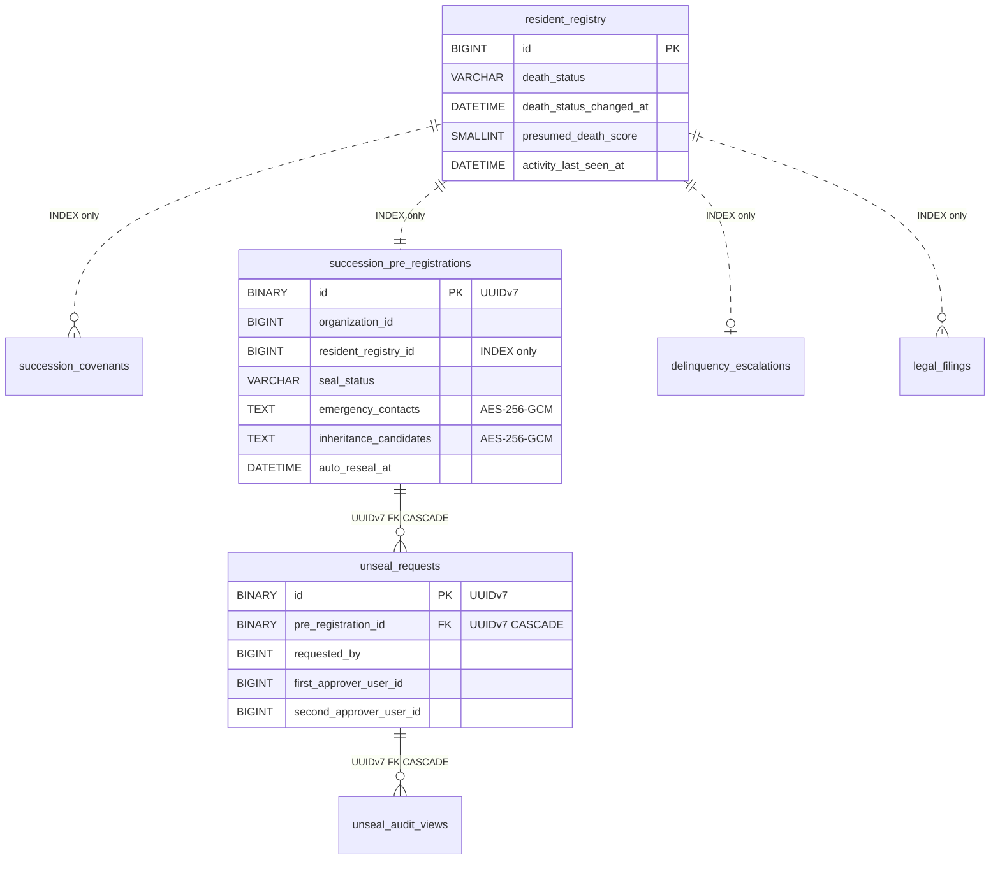

# F09.15: 区分所有者承継支援

> **ステータス**: 🟢 設計完了 + ✅ v1 実装完了（S0〜S6）+ 📘 §6 API 設計を実装に追随済（2026-05-17 第五陣 triage 統合）
> **実装フェーズ**: Phase 9（v1 実装フェーズ完遂 / 残: S6-D 法的監修・v2 国際化・v2 候補 7 件）
> **最終更新**: 2026-05-17
> **モジュール種別**: マンションテンプレート専用拡張モジュール
> **関連ドキュメント**: F09.1 住民台帳 / F09.16 居住実態管理 / F08.2 会費徴収 / F08.6 滞納督促 / F12.1 PDF生成 / F14.2 メンバー情報フォーム / F05.6 承認ワークフロー / F00 ContentVisibilityResolver / F04.3 プッシュ通知 / F03.6 安否確認 / F03.12 ケア対象者見守り

---

## 1. 概要

### 解決する課題

築古マンションで現実に発生している「単身高齢区分所有者の死亡 → 管理費・修繕積立金の長期滞納 → 相続人不明・連絡不能 → 管理組合が法的手続きに進めず管理不全」というシナリオに対し、Mannschaft 上で **生前事前登録（封緘）** と **死亡確認後の二者承認解除** を組み合わせた仕組みで備える。

加えて、滞納と連絡不通の両方が継続する区分所有者に対しては、5 段階の自動エスカレーション（督促 → 緊急連絡先発呼 → 見守り委員確認 → 死亡疑い起票 → 法的手続き準備）を実行し、不在者財産管理人選任申立（家事事件手続法 145 条）/ 相続財産清算人選任申立（民法 952 条）/ 管理費等先取特権実行（区分所有法 8 条）への移行を管理組合がスムーズに行えるように導線を提供する。

### ユーザー価値

| 対象 | 価値 |
|---|---|
| 区分所有者本人 | 「もしものとき」の備えを生前に Mannschaft 上で完結。意思を相続人に確実に伝えられる |
| ご家族・想定相続人 | 死亡時の連絡先が事前に登録されているため、管理組合との手続きが迅速に進む |
| 理事長・副理事長 | 滞納＋連絡不通の事案で 5 段階フローに従えば、法的手続き準備まで自動的にたどり着ける |
| 管理組合全体 | 区分所有法 8 条の証拠保持・申立書テンプレート提供により、法的手続きの心理的コストを下げ管理不全を防ぐ |

### v1 の境界

- **国内居住の区分所有者のみ対応**（海外居住相続人は v2）
- **凍結口座・銀行手続きは汎用テンプレート + FAQ のみ**（銀行別カスタム書類は v2）
- **法的監修なし版（⚠ 弁護士監修は収益化後の v2 で実施）**
- **RFC3161 タイムスタンプは未対応**（内部署名トークン方式。本格 TSA は v2）

---

## 2. スコープ

### 対象ロール

| ロール | 操作可能な範囲 |
|---|---|
| SYSTEM_ADMIN | 全組織の死亡関連監査ログ参照（運用調査目的） |
| ADMIN（理事長） | 入居時誓約テンプレート管理 / 死亡確認入力 / 封緘解除申請 / 二者承認の最終承認 / 法的手続き起票 / 区分所有法 8 条証拠 ZIP のダウンロード / 凍結口座導線提示 |
| DEPUTY_ADMIN（副理事長） | `MANAGE_SUCCESSION_UNSEAL` 権限を持つ場合: 封緘解除の二者承認の片方を担当可能 / 滞納エスカレーションの確認 / 申立書テンプレートのプレビュー |
| MEMBER（区分所有者） | 自分の事前登録の入力・更新 / 入居時誓約への署名 / 「もしもの備え」ポータルの操作 |
| SUPPORTER（代理人・成年後見人等） | 自身が代理人として紐付いた区分所有者の事前登録の閲覧（更新は本人のみ）|
| GUEST | 不可（全 API で 403） |
| WATCHER（見守り委員・F04.10 派生ロール） | 5 段階エスカレーションの D+90 確認依頼受信 / 訪問記録の入力（F09.16 側） |

### 対象レベル

- [x] 組織 (Organization) — 管理組合全体での事前登録・申立準備
- [ ] チーム (Team) — v1 では扱わない（マンション 1 棟＝1 組織前提）
- [x] 個人 (Personal) — 区分所有者本人の事前登録・誓約・閲覧

### テンプレート推奨

| テンプレート | F09.15 | 備考 |
|---|---|---|
| マンション | ○（手動有効化、デフォルトは無効） | 主要ターゲット。「機能を有効化する」操作で初めて起動 |
| その他全テンプレート | — | 対象外（v1） |

> 機能を有効化していないマンション組織では、本設計書の全テーブル・API は休眠状態。誓約 PDF も発行されない。

---

## 3. ユースケース

### UC-A1: 入居時の電子誓約 PDF 同梱保存（生前合意）

新規入居（または機能有効化後の既存区分所有者一斉再同意）時、F14.2 の `COVENANT_BLOCK` フィールドで以下 3 種の誓約に区分所有者本人が同意する:

1. **SUCCESSION_PRE_REGISTRATION 誓約**: 死亡時、事前登録された緊急連絡先・相続人候補・遺言メモが理事長と副理事長の二者承認で開封されることに同意
2. **PRIVACY_CONSENT 誓約**: 死亡疑いが発生した際、緊急連絡先への管理組合からの連絡に同意
3. **MONITORING_CONSENT 誓約**（F09.16 と共用）: 見守り委員会による訪問・推定スコア算定に同意

同意 PDF は F12.1 で生成し、SHA-256 ハッシュ + 内部署名トークンを付与して `succession_covenants` に保存。

### UC-A2: 「もしもの備え」事前登録（生前）

区分所有者本人が「もしもの備え」ポータルから以下を入力する（封緘状態 `SEALED` で保存される）:

- 緊急連絡先（複数登録可・優先順位付き）
- 相続人候補・想定遺言メモ
- 葬儀社・菩提寺等の希望
- 長期不在予定（`expected_absence_periods` 配列・推定スコアから除外する期間）
- 凍結予防口座（任意・銀行口座番号は暗号化保存）

入力内容は本人のみ閲覧可能。管理組合（理事長含む）からは封緘状態のため不可視。

### UC-A3: 死亡疑い起票（自動 or 手動）

- **自動**: 5 段階エスカレーション D+120 で `presumed_death_score >= 80` のとき、`death_status = SUSPECTED` に自動遷移
- **手動**: 理事長が「死亡確認入力」画面から `SUSPECTED` を入力（家族・近隣からの一報を受けた時点）

### UC-A4: 死亡確定と封緘解除（二者承認）

1. 理事長が死亡確認入力で `CONFIRMED` を入力（死亡診断書受領済みが前提）
2. `death_status = CONFIRMED` への遷移時点では封緘は解除されない
3. 別アクションとして「封緘解除申請」を理事長が起票（`unseal_requests` レコード生成）
4. 副理事長（または `MANAGE_SUCCESSION_UNSEAL` 権限保有 DEPUTY_ADMIN）が 1 次承認
5. 起票者・1 次承認者と別の理事会メンバーが 2 次承認
6. 2 次承認時点で `seal_status = UNSEALED` に遷移、72h TTL カウントダウン開始
7. 72h 経過で `@Scheduled` バッチが `RE_SEALED` に自動遷移

### UC-A5: 滞納＋連絡不通の 5 段階エスカレーション

- **D+30**: 督促状（F08.6 委譲）
- **D+60**: 緊急連絡先発呼（事前登録された連絡先へ自動通知メール + 管理組合に発呼指示）
- **D+90**: 見守り委員（WATCHER）に確認依頼（F09.16 訪問記録起票）
- **D+120**: 死亡疑い自動起票（`presumed_death_score` を合成して判定）
- **D+150**: 法的手続き準備（`legal_filings` レコード生成 + テンプレ PDF 出力）

### UC-A6: 法的手続き準備（区分所有法 8 条 / 家事事件手続法 145 / 民法 952）

`legal_filings.filing_type` ごとに以下のテンプレ PDF を生成:

- `ABSENTEE_PROPERTY_MANAGER` — 不在者財産管理人選任申立書（家事事件手続法 145 条）
- `INHERITANCE_LIQUIDATOR` — 相続財産清算人選任申立書（民法 952 条）

加えて区分所有法 8 条の先取特権実行に備えて、`evidence_package_s3_key` に証拠 ZIP を生成:
- 滞納履歴 PDF（F08.2 から自動エクスポート）
- 督促・通知履歴
- 登記事項証明書枠（手動アップロード）
- 5 段階エスカレーションのタイムライン PDF

### UC-A7: 凍結口座導線（生前 + 死亡後）

- 生前: 「もしもの備え」ポータルで凍結予防口座を任意登録
- 死亡確定後: 汎用テンプレ「銀行への死亡通知書例文」+ FAQ（v1）を理事長に提示
- 銀行別カスタム書類は v2 で対応

---

## 4. ドメイン定義

### 死亡状態 enum（`resident_registry.death_status`）

| 値 | 説明 |
|---|---|
| `ALIVE` | 通常状態（デフォルト） |
| `SUSPECTED` | 死亡疑い（家族連絡・自動推定起票・5段階D+120 到達） |
| `CONFIRMED` | 死亡確定（理事長が死亡診断書を確認し入力） |
| `CANCELLED_FALSE_ALARM` | 誤確認の取消（SUSPECTED または CONFIRMED から戻す。監査ログ必須） |

### 誓約区分 enum（`succession_covenants.covenant_type`）

| 値 | 説明 |
|---|---|
| `SUCCESSION_PRE_REGISTRATION` | 事前登録の存在・二者承認による開封への同意 |
| `PRIVACY_CONSENT` | 死亡疑い時に緊急連絡先へ連絡することへの同意 |
| `MONITORING_CONSENT` | 見守り委員会による訪問・推定スコア算定への同意（F09.16 共用） |

### 封緘状態 enum（`succession_pre_registrations.seal_status`）

| 値 | 説明 |
|---|---|
| `SEALED` | 封緘中（本人のみ閲覧可、管理組合からは不可視） |
| `UNSEAL_REQUESTED` | 封緘解除申請中（一次承認待ち or 二次承認待ち） |
| `UNSEALED` | 解除済み（理事長・承認者から閲覧可。72h TTL 適用） |
| `RE_SEALED` | 72h 経過で自動再封 |

### エスカレーション段階 enum（`delinquency_escalations.current_stage`）

| 値 | D+ 日数 | 説明 |
|---|---|---|
| `STAGE_1_REMINDER` | 30 | 督促状送付（F08.6 委譲） |
| `STAGE_2_EMERGENCY_CONTACT` | 60 | 緊急連絡先発呼 |
| `STAGE_3_WATCHER_VISIT` | 90 | 見守り委員確認依頼 |
| `STAGE_4_DEATH_SUSPECTED` | 120 | 死亡疑い自動起票 |
| `STAGE_5_LEGAL_PREP` | 150 | 法的手続き準備 |

### 申立種別 enum（`legal_filings.filing_type`）

| 値 | 説明 |
|---|---|
| `ABSENTEE_PROPERTY_MANAGER` | 不在者財産管理人選任申立（家事事件手続法 145 条） |
| `INHERITANCE_LIQUIDATOR` | 相続財産清算人選任申立（民法 952 条） |

---

## 5. DB 設計

### 5.0 マスタ・シングルトン例外の判定章（CLAUDE.md L372-386 準拠）

CLAUDE.md 原則 6 では、新規テーブルは **UUIDv7 主キー（BINARY(16)）** を必須とする。ただし以下 2 区分は例外として自然キー / 固定値 ID 設計が許容される:

- **マスタ例外**: 全テナント・全ユーザー共通参照データ（書き込みは運用バッチのみ・シャード全コピー運用） → 自然キー
- **シングルトン例外**: `CHECK(id = 1)` 等で 1 行固定の設定/運用状態テーブル → 固定値 ID
- **通常（原則 6 適用）**: テナントごと・ユーザーごとに行が増えていくテーブル → UUIDv7

#### F09.15 新規 6 テーブルの分類

| テーブル | 行増加パターン | 判定 |
|---|---|---|
| `succession_covenants` | 区分所有者×誓約区分ごとに増加 | **通常 → UUIDv7** |
| `succession_pre_registrations` | 区分所有者ごとに 1 行（更新型・行数増加あり） | **通常 → UUIDv7** |
| `unseal_requests` | 解除申請ごとに増加 | **通常 → UUIDv7** |
| `unseal_audit_views` | 閲覧ごとに増加（append-only） | **通常 → UUIDv7** |
| `delinquency_escalations` | 区分所有者ごとに 1 行 | **通常 → UUIDv7** |
| `legal_filings` | 申立ごとに増加 | **通常 → UUIDv7** |

**結論**: F09.15 の 6 テーブルすべてが通常テーブルであり、マスタ例外・シングルトン例外には **該当しない**。全テーブルに原則 6（UUIDv7 BINARY(16)）+ 原則 7（AbstractTenantAwareRepository<T, UUID>）を適用する。

### 5.1 既存テーブル（F09.1 `resident_registry`）への追加カラム

F09.1 と同一ドメイン内なので主キー BIGINT は変更せず、以下 5 カラムを追加する（V9.020 で ALTER TABLE）:

| カラム名 | 型 | NULL | デフォルト | 説明 |
|---|---|---|---|---|
| `death_status` | VARCHAR(30) | NO | 'ALIVE' | 死亡状態 enum |
| `death_status_changed_at` | DATETIME(6) | YES | NULL | 死亡状態の最終変更日時 |
| `death_status_changed_by` | BIGINT UNSIGNED | YES | NULL | 死亡状態を変更した user（FKなし・INDEX のみ） |
| `presumed_death_score` | SMALLINT UNSIGNED | YES | NULL | 推定スコア（0〜100、F09.16 のアクティビティ集計から派生・本人非開示） |
| `activity_last_seen_at` | DATETIME(6) | YES | NULL | 直近アクティビティ日時のキャッシュ（F09.16 ResidentActivityUpdatedEvent で更新） |

**追加 INDEX**:
```sql
INDEX idx_rr_death_status (death_status, deleted_at)            -- 死亡確認画面の一覧用
INDEX idx_rr_death_changed_at (death_status_changed_at DESC)    -- 監査ログ・履歴照会用
```

### 5.2 新規テーブル共通仕様（succession ドメイン）

全 6 新規テーブル共通:

```sql
id                    BINARY(16) NOT NULL,    -- UUIDv7 主キー
organization_id       BIGINT UNSIGNED NOT NULL, -- テナント絞り込み用（FKなし・INDEX 必須）
deleted_at            DATETIME(6) NULL,        -- 論理削除
created_at            DATETIME(6) NOT NULL DEFAULT CURRENT_TIMESTAMP(6),
updated_at            DATETIME(6) NOT NULL DEFAULT CURRENT_TIMESTAMP(6) ON UPDATE CURRENT_TIMESTAMP(6),
PRIMARY KEY (id),
INDEX idx_<table>_org (organization_id, deleted_at)
```

居室・居住者紐付けが必要なテーブルでは以下も追加（**FK なし・INDEX のみ・クロスドメイン弱参照**）:

```sql
dwelling_unit_id      BIGINT UNSIGNED NOT NULL,  -- F09.1 dwelling_units 参照（FK なし）
resident_registry_id  BIGINT UNSIGNED NOT NULL,  -- F09.1 resident_registry 参照（FK なし）
INDEX idx_<table>_dwelling (dwelling_unit_id),
INDEX idx_<table>_resident (resident_registry_id)
```

**Java Entity 宣言（全 6 テーブル共通）**:
```java
@Entity
@Table(name = "succession_xxx")
public class SuccessionXxxEntity extends UuidV7Entity {
    // id (BINARY(16) UUIDv7) は UuidV7Entity 基底クラスが保持
    private Long organizationId;
    private Long dwellingUnitId;        // 該当テーブルのみ
    private Long residentRegistryId;    // 該当テーブルのみ
    ...
}
```

**Repository 宣言（全 6 テーブル共通）**:
```java
public interface SuccessionXxxRepository
    extends AbstractTenantAwareRepository<SuccessionXxxEntity, UUID> { ... }
```

### 5.3 `succession_covenants`（入居時誓約・PDF 同梱保存）

| カラム名 | 型 | NULL | デフォルト | 説明 |
|---|---|---|---|---|
| `id` | BINARY(16) | NO | UUIDv7 | PK |
| `organization_id` | BIGINT UNSIGNED | NO | — | テナント |
| `dwelling_unit_id` | BIGINT UNSIGNED | NO | — | F09.1 dwelling_units（INDEX のみ） |
| `resident_registry_id` | BIGINT UNSIGNED | NO | — | F09.1 resident_registry（INDEX のみ） |
| `signer_user_id` | BIGINT UNSIGNED | NO | — | 誓約者（INDEX のみ） |
| `covenant_type` | VARCHAR(40) | NO | — | 誓約区分 enum |
| `covenant_version` | VARCHAR(20) | NO | — | 誓約テンプレートのバージョン（例: 'v1.0.0'） |
| `pdf_s3_key` | VARCHAR(500) | NO | — | 誓約 PDF の S3 オブジェクトキー |
| `pdf_sha256` | CHAR(64) | NO | — | 誓約 PDF の SHA-256 ハッシュ（改ざん検知用） |
| `internal_signature_token` | VARCHAR(500) | NO | — | F12.1 `signWithInternalToken()` 生成トークン（v1） |
| `signed_at` | DATETIME(6) | NO | — | 誓約日時 |
| `revoked_at` | DATETIME(6) | YES | NULL | 撤回日時（撤回されると即時無効） |
| `deleted_at` | DATETIME(6) | YES | NULL | 論理削除 |
| `created_at` / `updated_at` | DATETIME(6) | NO | — | |

```sql
INDEX idx_sc_resident_type (resident_registry_id, covenant_type)
INDEX idx_sc_signer (signer_user_id, covenant_type, signed_at DESC)
INDEX idx_sc_org (organization_id, deleted_at)
```

### 5.4 `succession_pre_registrations`（事前登録・封緘）

| カラム名 | 型 | NULL | デフォルト | 説明 |
|---|---|---|---|---|
| `id` | BINARY(16) | NO | UUIDv7 | PK |
| `organization_id` | BIGINT UNSIGNED | NO | — | |
| `dwelling_unit_id` | BIGINT UNSIGNED | NO | — | INDEX のみ |
| `resident_registry_id` | BIGINT UNSIGNED | NO | — | INDEX のみ |
| `owner_user_id` | BIGINT UNSIGNED | NO | — | 本人（INDEX のみ） |
| `seal_status` | VARCHAR(20) | NO | 'SEALED' | 封緘状態 enum |
| `emergency_contacts` | TEXT | YES | NULL | **AES-256-GCM 暗号化**: 緊急連絡先 JSON 配列（氏名・続柄・連絡先・優先順位） |
| `inheritance_candidates` | TEXT | YES | NULL | **AES-256-GCM 暗号化**: 想定相続人 JSON 配列 |
| `will_memo` | TEXT | YES | NULL | **AES-256-GCM 暗号化**: 遺言メモ・葬儀社希望 |
| `frozen_account_info` | TEXT | YES | NULL | **AES-256-GCM 暗号化**: 凍結予防口座情報 |
| `expected_absence_periods` | JSON | YES | NULL | 長期不在期間配列（推定スコアから除外用・暗号化不要） |
| `last_updated_by_owner_at` | DATETIME(6) | YES | NULL | 本人最終更新日時（封緘の鮮度確認） |
| `auto_reseal_at` | DATETIME(6) | YES | NULL | 自動再封予定日時（UNSEALED 時のみセット） |
| `deleted_at` | DATETIME(6) | YES | NULL | |
| `created_at` / `updated_at` | DATETIME(6) | NO | — | |

```sql
UNIQUE KEY uq_spr_resident (resident_registry_id, deleted_at)  -- 1 居住者 1 事前登録
INDEX idx_spr_seal (seal_status, auto_reseal_at)               -- 72h 自動再封バッチ用
INDEX idx_spr_owner (owner_user_id)
INDEX idx_spr_org (organization_id, deleted_at)
```

### 5.5 `unseal_requests`（封緘解除二者承認）

| カラム名 | 型 | NULL | デフォルト | 説明 |
|---|---|---|---|---|
| `id` | BINARY(16) | NO | UUIDv7 | PK |
| `organization_id` | BIGINT UNSIGNED | NO | — | |
| `dwelling_unit_id` | BIGINT UNSIGNED | NO | — | INDEX のみ |
| `resident_registry_id` | BIGINT UNSIGNED | NO | — | INDEX のみ |
| `pre_registration_id` | BINARY(16) | NO | — | FK → `succession_pre_registrations.id` ON DELETE CASCADE（同ドメイン内 UUIDv7 FK） |
| `requested_by` | BIGINT UNSIGNED | NO | — | 申請者（理事長等） |
| `request_reason` | TEXT | NO | — | 解除理由（必須・自由記述・監査用） |
| `first_approver_user_id` | BIGINT UNSIGNED | YES | NULL | 一次承認者 |
| `first_approved_at` | DATETIME(6) | YES | NULL | 一次承認日時 |
| `second_approver_user_id` | BIGINT UNSIGNED | YES | NULL | 二次承認者 |
| `second_approved_at` | DATETIME(6) | YES | NULL | 二次承認日時 |
| `unseal_completed_at` | DATETIME(6) | YES | NULL | 解除完了日時（auto_reseal_at = +72h） |
| `auto_reseal_at` | DATETIME(6) | YES | NULL | 自動再封予定日時 |
| `re_sealed_at` | DATETIME(6) | YES | NULL | 実際に再封された日時 |
| `rejected_at` | DATETIME(6) | YES | NULL | 拒否日時（承認プロセス中止） |
| `rejected_by` | BIGINT UNSIGNED | YES | NULL | 拒否者 |
| `deleted_at` | DATETIME(6) | YES | NULL | |
| `created_at` / `updated_at` | DATETIME(6) | NO | — | |

```sql
INDEX idx_ur_pre_reg (pre_registration_id)
INDEX idx_ur_resident (resident_registry_id, unseal_completed_at DESC)
INDEX idx_ur_auto_reseal (auto_reseal_at, re_sealed_at)   -- 72h 自動再封バッチ
INDEX idx_ur_org (organization_id, deleted_at)

-- 3 者別人保証（DB CHECK）
CONSTRAINT chk_ur_three_distinct CHECK (
    first_approver_user_id IS NULL
    OR (
        first_approver_user_id <> requested_by
        AND (second_approver_user_id IS NULL OR (
            second_approver_user_id <> requested_by
            AND second_approver_user_id <> first_approver_user_id
        ))
    )
)
```

> `requested_by` / `first_approver_user_id` / `second_approver_user_id` の **3 者が必ず別人** であることを DB CHECK で物理保証する。Service 層でも同条件を二段で検証する（二段保護）。

### 5.6 `unseal_audit_views`（開封中閲覧履歴・append-only）

| カラム名 | 型 | NULL | デフォルト | 説明 |
|---|---|---|---|---|
| `id` | BINARY(16) | NO | UUIDv7 | PK |
| `organization_id` | BIGINT UNSIGNED | NO | — | unseal_requests から非正規化複写 |
| `unseal_request_id` | BINARY(16) | NO | — | FK → `unseal_requests.id` ON DELETE CASCADE（同ドメイン内） |
| `viewer_user_id` | BIGINT UNSIGNED | NO | — | 閲覧者 |
| `viewed_at` | DATETIME(6) | NO | CURRENT_TIMESTAMP(6) | 閲覧日時 |
| `ip_address` | VARCHAR(45) | YES | NULL | 閲覧元 IP（IPv6対応） |
| `user_agent` | VARCHAR(500) | YES | NULL | UserAgent |
| `request_id` | VARCHAR(64) | YES | NULL | MDC requestId（追跡用） |
| `deleted_at` | DATETIME(6) | YES | NULL | (append-only 想定だが規約上保持) |
| `created_at` | DATETIME(6) | NO | — | |

```sql
INDEX idx_uav_request (unseal_request_id, viewed_at DESC)
INDEX idx_uav_viewer (viewer_user_id, viewed_at DESC)
INDEX idx_uav_org (organization_id)
```

> append-only テーブル。UPDATE / DELETE はアプリ層で禁止。

### 5.7 `delinquency_escalations`（5 段階エスカレーション）

| カラム名 | 型 | NULL | デフォルト | 説明 |
|---|---|---|---|---|
| `id` | BINARY(16) | NO | UUIDv7 | PK |
| `organization_id` | BIGINT UNSIGNED | NO | — | |
| `dwelling_unit_id` | BIGINT UNSIGNED | NO | — | INDEX のみ |
| `resident_registry_id` | BIGINT UNSIGNED | NO | — | INDEX のみ |
| `current_stage` | VARCHAR(30) | NO | 'STAGE_1_REMINDER' | 現在の段階 enum |
| `delinquency_started_at` | DATE | NO | — | 滞納開始日（F08.2 から派生） |
| `last_contact_attempt_at` | DATETIME(6) | YES | NULL | 直近の連絡試行日時 |
| `stage_1_completed_at` | DATETIME(6) | YES | NULL | |
| `stage_2_completed_at` | DATETIME(6) | YES | NULL | |
| `stage_3_completed_at` | DATETIME(6) | YES | NULL | |
| `stage_4_completed_at` | DATETIME(6) | YES | NULL | |
| `stage_5_completed_at` | DATETIME(6) | YES | NULL | |
| `frozen_at` | DATETIME(6) | YES | NULL | エスカレーション凍結（弁護士介入等） |
| `frozen_reason` | TEXT | YES | NULL | 凍結理由 |
| `resolved_at` | DATETIME(6) | YES | NULL | 解決完了日時（支払い・死亡確定など） |
| `resolved_reason` | VARCHAR(50) | YES | NULL | 解決種別（`PAID` / `DEATH_CONFIRMED` / `MANUAL_CLOSE` 等） |
| `deleted_at` | DATETIME(6) | YES | NULL | |
| `created_at` / `updated_at` | DATETIME(6) | NO | — | |

```sql
UNIQUE KEY uq_de_resident (resident_registry_id, deleted_at)   -- 1 居住者 1 エスカ
INDEX idx_de_stage (current_stage, frozen_at, resolved_at)      -- バッチ進行用
INDEX idx_de_org (organization_id, deleted_at)
```

### 5.8 `legal_filings`（不在者財産管理人 / 相続財産清算人 申立準備）

| カラム名 | 型 | NULL | デフォルト | 説明 |
|---|---|---|---|---|
| `id` | BINARY(16) | NO | UUIDv7 | PK |
| `organization_id` | BIGINT UNSIGNED | NO | — | |
| `dwelling_unit_id` | BIGINT UNSIGNED | NO | — | INDEX のみ |
| `resident_registry_id` | BIGINT UNSIGNED | NO | — | INDEX のみ |
| `filing_type` | VARCHAR(40) | NO | — | 申立種別 enum |
| `template_pdf_s3_key` | VARCHAR(500) | YES | NULL | 申立書テンプレ PDF |
| `evidence_package_s3_key` | VARCHAR(500) | YES | NULL | 区分所有法 8 条証拠 ZIP |
| `evidence_built_at` | DATETIME(6) | YES | NULL | 証拠 ZIP 生成日時 |
| `evidence_sha256` | CHAR(64) | YES | NULL | 証拠 ZIP の SHA-256 |
| `filed_externally_at` | DATETIME(6) | YES | NULL | 外部（家庭裁判所等）への提出日時（手動入力） |
| `external_case_number` | VARCHAR(100) | YES | NULL | 外部受理番号（手動入力） |
| `note` | TEXT | YES | NULL | 自由メモ |
| `deleted_at` | DATETIME(6) | YES | NULL | |
| `created_at` / `updated_at` | DATETIME(6) | NO | — | |

```sql
INDEX idx_lf_resident_type (resident_registry_id, filing_type)
INDEX idx_lf_org (organization_id, deleted_at)
```

### 5.9 ER 図



**FK 方針まとめ**:
- クロスドメイン（resident → succession）: FK なし、INDEX のみ
- 同一ドメイン内（succession 内親子）: UUIDv7 FK + CASCADE 許可
- 全テーブルが UUIDv7 主キー + organization_id + deleted_at の共通スキーマ準拠

---

## 6. API 設計

> 🟢 **スコープ移行 + 用語整理 完了注記（2026-05-17 第五陣 triage 統合）**:
> 本設計書 §6.1 は当初フラットパス `/api/v1/succession/...` として設計されたが、S2/S5/S6
> 実装フェーズで以下の整理を実施し、§6.1 表もこれに追随済:
>
> 1. **組織スコープ化**: ADMIN 向け 13 件は `/api/v1/organizations/{orgId}/succession/...`
>    に統一（テナント境界の明示・マルチテナント設計原則準拠）
> 2. **本人 API はフラットパス維持**: MEMBER 自身を対象とする `covenants/sign` /
>    `covenants/{id}/revoke` / `covenants/me` は currentUser から組織を解決するため
>    フラットパスのまま
> 3. **承認操作のリネーム**: `first-approve` → `approve`（二次のみ `second-approve` と
>    区別）/ `reject` → `cancel`（取消ニュアンスも含む統合命名）
> 4. **証拠パッケージのリネーム**: `evidence-zip` → `evidence-package/download-url`
>    （DL URL 取得操作と分離）/ `evidence-rebuild` → `evidence-package`（冪等 POST で
>    新規生成と再生成を同 endpoint で吸収）
>
> 該当 Controller（v1 実装済 18 + 本人 API 2 = 計 20 件）:
> - `SuccessionCovenantController` (4 件): sign / revoke / 組織内 list / 組織内 getById / 本人 me
> - `UnsealRequestController` (6 件): create / approve / second-approve / cancel / list / getById
> - `LegalFilingController` (6 件): list / by-resident / create / getById / evidence-package POST / download-url GET
> - `DelinquencyEscalationController` (4 件): list / getById / freeze / resolve
>
> v2 候補 6 件（🔵 マーカ付与）: covenant-templates / pre-registrations CRUD 3 件 /
> audit-views / death-status / frozen-account-guidance / covenants verify。
> 詳細は `docs/internal/triage_log/succession.md` 参照。

### 6.1 エンドポイント一覧

凡例:
- ✅ v1 実装済（main マージ済）
- 🔵 v2 候補（収益化後の v2 で着工予定。v1 では未実装）

| 状態 | メソッド | パス | 認可 | 用途 |
|---|---|---|---|---|
| 🔵 | GET | `/api/v1/succession/covenant-templates` | ADMIN/MEMBER | 誓約テンプレート一覧（現行 version）— v2: 運用バッチで版数管理中、API 化は v2 |
| ✅ | POST | `/api/v1/succession/covenants/sign` | MEMBER | 入居時誓約への署名（PDF 生成 + SHA-256 + 内部署名トークン） |
| ✅ | POST | `/api/v1/succession/covenants/{id}/revoke` | MEMBER | 誓約の撤回（本人のみ） |
| ✅ | GET | `/api/v1/succession/covenants/me` | MEMBER | 本人の誓約履歴一覧（自分自身のみ） |
| ✅ | GET | `/api/v1/organizations/{orgId}/succession/covenants` | ADMIN | 組織内の誓約一覧（ADMIN のみ） |
| ✅ | GET | `/api/v1/organizations/{orgId}/succession/covenants/{id}` | ADMIN/MEMBER（本人）| 誓約詳細取得（本人 + 組織 ADMIN） |
| 🔵 | POST | `/api/v1/succession/covenants/{id}/verify` | ADMIN | 保存中 PDF を取得し再ハッシュ + token 検証（F12.1 §5.14 由来）— v2: 改ざん検証高度化と一緒に実装 |
| 🔵 | GET | `/api/v1/succession/pre-registrations/me` | MEMBER | 自分の事前登録の取得（封緘状態でも本人は閲覧可）— v2 |
| 🔵 | PUT | `/api/v1/succession/pre-registrations/me` | MEMBER | 自分の事前登録の更新（封緘維持）— v2 |
| 🔵 | GET | `/api/v1/succession/pre-registrations/{id}` | ADMIN（UNSEALED 時のみ）| 事前登録の閲覧（unseal_audit_views に記録）— v2 |
| 🔵 | POST | `/api/v1/succession/residents/{residentId}/death-status` | ADMIN | 死亡状態の手動入力 — v1 では Stage4 到達による自動 SUSPECTED 化のみ（`ResidentRegistryService.markDeathSuspected()` 内部メソッド経由）。ADMIN 手動入力 API 化は v2 |
| ✅ | POST | `/api/v1/organizations/{orgId}/succession/unseal-requests` | ADMIN | 封緘解除申請の起票 |
| ✅ | POST | `/api/v1/organizations/{orgId}/succession/unseal-requests/{id}/approve` | ADMIN/DEPUTY_ADMIN(`MANAGE_SUCCESSION_UNSEAL`)| 一次承認（旧設計: first-approve をリネーム） |
| ✅ | POST | `/api/v1/organizations/{orgId}/succession/unseal-requests/{id}/second-approve` | ADMIN/DEPUTY_ADMIN(`MANAGE_SUCCESSION_UNSEAL`)| 二次承認（72h TTL カウントダウン開始） |
| ✅ | POST | `/api/v1/organizations/{orgId}/succession/unseal-requests/{id}/cancel` | ADMIN/DEPUTY_ADMIN | 承認プロセス取消（旧設計: reject をリネーム / 申請者キャンセルも吸収） |
| ✅ | GET | `/api/v1/organizations/{orgId}/succession/unseal-requests` | ADMIN | 組織内の封緘解除申請一覧 |
| ✅ | GET | `/api/v1/organizations/{orgId}/succession/unseal-requests/{id}` | ADMIN/申請者/承認者 | 封緘解除申請の詳細取得 |
| 🔵 | GET | `/api/v1/succession/unseal-requests/{id}/audit-views` | ADMIN | 開封中閲覧履歴（unseal_audit_views テーブルへの書き込みは S2 で実装済、参照 API 化は v2） |
| ✅ | GET | `/api/v1/organizations/{orgId}/succession/delinquency-escalations` | ADMIN/DEPUTY_ADMIN | 5 段階エスカ進行中の一覧（理事長ダッシュボード） |
| ✅ | GET | `/api/v1/organizations/{orgId}/succession/delinquency-escalations/{id}` | ADMIN/DEPUTY_ADMIN | エスカレーション詳細 |
| ✅ | POST | `/api/v1/organizations/{orgId}/succession/delinquency-escalations/{id}/freeze` | ADMIN | エスカレーション凍結（弁護士介入等） |
| ✅ | POST | `/api/v1/organizations/{orgId}/succession/delinquency-escalations/{id}/resolve` | ADMIN | エスカレーション解決（手動クローズ） |
| ✅ | GET | `/api/v1/organizations/{orgId}/succession/legal-filings` | ADMIN | 組織内の法的手続き一覧 |
| ✅ | GET | `/api/v1/organizations/{orgId}/succession/legal-filings/by-resident/{residentRegistryId}` | ADMIN | 居住者別の法的手続き履歴 |
| ✅ | POST | `/api/v1/organizations/{orgId}/succession/legal-filings` | ADMIN | 法的手続き起票（テンプレ PDF 生成） |
| ✅ | GET | `/api/v1/organizations/{orgId}/succession/legal-filings/{id}` | ADMIN | 法的手続き詳細 |
| ✅ | POST | `/api/v1/organizations/{orgId}/succession/legal-filings/{id}/evidence-package` | ADMIN | 区分所有法 8 条 証拠 ZIP を生成（冪等 POST で新規生成と再生成を吸収。旧設計 evidence-rebuild をリネーム + 統合） |
| ✅ | GET | `/api/v1/organizations/{orgId}/succession/legal-filings/{id}/evidence-package/download-url` | ADMIN | 証拠 ZIP の Pre-signed DL URL（1h・ADMIN のみ・全 DL 監査）|
| 🔵 | GET | `/api/v1/succession/frozen-account-guidance` | ADMIN | 凍結口座汎用テンプレ + FAQ — v2: v1 は静的テンプレ表示のみ |

合計 26 行（v1 実装済 ✅ 20 件 / v2 候補 🔵 6 件 + verify 含む計 7 件）。すべて認可ロールを明記。

### 6.2 主要エンドポイント仕様（抜粋）

#### POST `/api/v1/succession/covenants/sign`

**認可**: MEMBER（本人のみ）

**リクエスト**:
```json
{
  "covenant_type": "SUCCESSION_PRE_REGISTRATION",
  "covenant_version": "v1.0.0",
  "agreement_blocks_acknowledged": [
    { "block_id": "intro", "scrolled_to_end": true, "confirmed": true },
    { "block_id": "two_party_unseal", "scrolled_to_end": true, "confirmed": true },
    { "block_id": "ttl_72h", "scrolled_to_end": true, "confirmed": true }
  ]
}
```

**レスポンス（201 Created）**:
```json
{
  "data": {
    "id": "01928a3e-4b2f-7a8c-9d12-...",
    "pdf_url": "https://cdn.../succession/covenants/01928a3e_signed.pdf?signed=...",
    "signed_at": "2026-05-12T09:00:00+09:00",
    "pdf_sha256": "abc123..."
  }
}
```

**副作用**:
1. F12.1 で誓約 PDF を生成
2. PDF の SHA-256 を計算
3. `signWithInternalToken(pdfBytes)` で内部署名トークン生成
4. `succession_covenants` に INSERT
5. F00 reference_type `SUCCESSION_PRE_REGISTRATION` の可視性 Resolver で本人 + ADMIN 閲覧可

#### POST `/api/v1/organizations/{orgId}/succession/unseal-requests/{id}/second-approve`

**認可**: ADMIN または DEPUTY_ADMIN（`MANAGE_SUCCESSION_UNSEAL`）

**ビジネスルール（二段保護）**:
1. `requested_by != first_approver_user_id != second_approver_user_id` を Service 層で再検証（DB CHECK と二段）
2. `death_status` が `CONFIRMED` または `SUSPECTED` でない場合は 409 を返す（誤確認時暴露防止）
3. 二次承認成功時 `seal_status = UNSEALED`、`auto_reseal_at = NOW() + 72h` をセット

**レスポンス（200 OK）**: unseal_requests 詳細を返却

**エラー**:
| ステータス | 条件 |
|---|---|
| 400 | `request_reason` 未入力 |
| 403 | 承認権限なし / 三者重複 |
| 409 | death_status 不適合 / 既に承認済み |

#### POST `/api/v1/succession/residents/{residentId}/death-status` 🔵 v2 候補

**認可**: ADMIN

> 🔵 **未実装注記**: v1 では Stage4 到達による自動 SUSPECTED 化のみ実装。本エンドポイントは
> ADMIN が手動で死亡状態を入力するための API で、v2 で正式実装予定。
> v1 での Stage4 自動起票は `DelinquencyEscalationBatchService.autoMarkDeathSuspected()` →
> `ResidentRegistryService.markDeathSuspected()` の内部 Service 呼び出しで実現済（PR #668 / S5-C）。

**リクエスト**:
```json
{
  "death_status": "CONFIRMED",
  "evidence_note": "死亡診断書 受領済み（2026-05-10 付）"
}
```

**副作用**:
1. `resident_registry.death_status` を更新
2. `death_status_changed_at` / `death_status_changed_by` を更新
3. 監査ログ `DEATH_STATUS_CHANGED` を発火（10 年保持）
4. **`CONFIRMED` 遷移時点では封緘は解除しない**（別アクションで二者承認必須）

---

## 7. ビジネスロジック

### 7.1 入居時誓約フロー（UC-A1）

```
1. 区分所有者がアプリで「もしもの備え」初回設定を開く
2. F14.2 の COVENANT_BLOCK フィールドに 3 種誓約が並ぶ
3. 各誓約ごとに以下を強制:
   a. 全文をスクロール最下部まで読まないと「同意」ボタンが活性化しない
   b. 同意ボックスは個別チェック（一括チェック禁止）
   c. ダークパターン回避ガイドライン（§8.4）に準拠
4. ユーザーが POST /succession/covenants/sign を呼ぶ
5. PdfGeneratorService が誓約 PDF を生成
6. SHA-256 + 内部署名トークン付与
7. succession_covenants に INSERT
```

### 7.2 二者承認の状態機械（UC-A4）

```
[null] ──(POST unseal-requests)──> CREATED
   ↓
CREATED ──(POST first-approve)──> FIRST_APPROVED
   ↓                                    ↓
   └──(POST reject)──> REJECTED        ↓
                                  (POST second-approve)
                                        ↓
                                   UNSEALED [auto_reseal_at = +72h]
                                        ↓
                              (Scheduled batch at auto_reseal_at)
                                        ↓
                                   RE_SEALED
```

**Service 二段バリデーション**（DB CHECK と併存）:
```java
if (request.getRequestedBy().equals(firstApproverId)) throw new IllegalStateException("起票者は一次承認できない");
if (request.getRequestedBy().equals(secondApproverId)) throw new IllegalStateException("起票者は二次承認できない");
if (firstApproverId.equals(secondApproverId)) throw new IllegalStateException("一次と二次は別人");
```

### 7.3 推定スコア合成ロジック

`presumed_death_score (0-100)` は F09.16 `ResidentActivityAggregator` が算定し、`ResidentActivityUpdatedEvent` で本機能に伝達される:

```
score = base_inactivity_days_score(0-50)
      + delinquency_factor(0-30)
      + age_factor(0-20)
      - expected_absence_offset(0-100, 期間内なら全部減算)
```

詳細式は F09.16 で定義。本機能では受信したスコアを `resident_registry.presumed_death_score` にキャッシュし、`STAGE_4_DEATH_SUSPECTED` 判定（80 以上）に利用する。

### 7.4 5 段階エスカレーション バッチ

```
@Scheduled(cron = "0 0 6 * * *", zone = "Asia/Tokyo")
@SchedulerLock(name = "delinquencyEscalationBatch", lockAtMostFor = "30m")
public void run() {
    // 1. 滞納中（F08.2 PaymentStatusChangedEvent 受信キャッシュ）
    // 2. delinquency_escalations を作成 or 更新
    // 3. D+30, D+60, D+90, D+120, D+150 を超過する度に next stage へ
    // 4. STAGE_4 到達時、presumed_death_score >= 80 なら death_status=SUSPECTED 自動遷移
    // 5. STAGE_5 到達時、legal_filings レコードを生成しテンプレ PDF をプリビルド
}
```

### 7.5 申立テンプレートと証拠 ZIP

`POST /legal-filings` で `filing_type` に応じた申立書 PDF（F12.1 テンプレ 5.10 / 5.11）を生成。
`GET /legal-filings/{id}/evidence-zip` で以下を含む ZIP を生成:

- 滞納履歴 PDF（F08.2 から自動エクスポート）
- 督促・通知履歴一覧（F04.3 / F08.6 から集約）
- 5 段階エスカレーションのタイムライン PDF（F12.1 テンプレ 5.12）
- 登記事項証明書枠（ADMIN が手動でアップロードしたファイルがあれば同梱）
- 表紙 PDF（F12.1 テンプレ 5.13）

ZIP の SHA-256 は `legal_filings.evidence_sha256` に保存し改ざん検知。
Pre-signed URL は **ADMIN のみ・1 時間有効**、ダウンロード全件を監査ログ `EVIDENCE_PACKAGE_DOWNLOADED` で記録。

### 7.6 凍結口座導線

- 生前: `succession_pre_registrations.frozen_account_info`（AES-256-GCM）に任意登録
- 死亡確定後: `GET /frozen-account-guidance` で以下のテンプレを返却
  - 一般的な銀行への死亡通知書例文
  - 凍結解除に必要な書類リスト（除籍謄本・相続人全員の戸籍謄本等）
  - 銀行別カスタムは v2 で実装

---

## 8. UI/UX

### 8.1 オンボーディングウィザード（UC-A1 + UC-A2）

5 ステップ:

1. **イントロ** — 「あなたの大切な情報を、もしものときご家族へ届けるための準備です」
2. **誓約 1: SUCCESSION_PRE_REGISTRATION** — 全文表示 + スクロール検知 + 同意ボックス
3. **誓約 2: PRIVACY_CONSENT** — 同上
4. **誓約 3: MONITORING_CONSENT** — 同上（F09.16 共用）
5. **事前登録入力** — 緊急連絡先・相続人候補・遺言メモ・凍結予防口座

### 8.2 「もしもの備え」ポータル（MEMBER 用）

ホーム導線:
- 「もしもの備え」カード（常に表示）
- 未署名の誓約がある場合は通知バッジ
- 直近 6 ヶ月更新がない場合は「お久しぶりです、内容を確認しませんか？」プロンプト

### 8.3 理事長ダッシュボード（ADMIN 用）

タブ構成:
- **死亡確認**: `death_status` 別の居住者一覧
- **封緘解除中**: UNSEALED / UNSEAL_REQUESTED の事前登録一覧（72h TTL カウントダウン表示）
- **エスカレーション**: 進行中の `delinquency_escalations` 一覧（段階別）
- **法的手続き**: `legal_filings` 一覧 + 申立書 PDF / 証拠 ZIP ダウンロード

### 8.4 ダークパターン回避ガイドライン

- **スクロール必須**: 誓約全文を最下部までスクロールしないと「同意」ボタンを非活性
- **個別チェック**: 「すべて同意」ボタン禁止、誓約 3 種を個別チェック
- **撤回導線**: 「もしもの備え」ポータルから誓約撤回をワンタップで可能（事後撤回の心理的コスト軽減）
- **負の同意の禁止**: 「同意しない場合はチェックを外してください」のような反転設計を禁止
- **デフォルト未チェック**: チェックボックスのデフォルト値は必ず未チェック
- **明示的言語**: 「死亡時に〇〇する」を「もしものときに〇〇する」へぼかすなど誤解を招く表現を禁止し、法的影響をストレートに表示

---

## 9. セキュリティ

### 9.1 三層保護

| レイヤ | 実装 |
|---|---|
| (i) DB レイヤ | `succession_pre_registrations` の `emergency_contacts` / `inheritance_candidates` / `will_memo` / `frozen_account_info` を AES-256-GCM `@Encrypted` で暗号化 |
| (ii) アプリレイヤ | `UnsealedAccessGuard` — Service 入口で `seal_status=UNSEALED && auto_reseal_at>NOW && currentUser ∈ {申請者, 一次承認者, 二次承認者, ADMIN}` を検証 |
| (iii) F00 統合 | F00 reference_type `SUCCESSION_PRE_REGISTRATION` の Resolver が状態遷移ベース可視性を判定 |

### 9.2 二者承認（DB CHECK + Service 二段保護）

- **DB CHECK**: `chk_ur_three_distinct` で起票者・一次承認者・二次承認者が必ず別人
- **Service バリデーション**: 同条件を Java 側で再検証（防御的多重化）

### 9.3 開封 72h TTL（自動再封）

```java
@Scheduled(cron = "0 */5 * * * *")  // 5 分おき
@SchedulerLock(name = "successionAutoResealBatch", lockAtMostFor = "5m")
public void autoReseal() {
    // unseal_requests.auto_reseal_at < NOW() AND re_sealed_at IS NULL を全件取得
    // succession_pre_registrations.seal_status を RE_SEALED に遷移
    // unseal_requests.re_sealed_at = NOW() を更新
    // 監査ログ AUTO_RESEALED を発火
}
```

### 9.4 改ざん防止（誓約 PDF）

- SHA-256 ハッシュを `succession_covenants.pdf_sha256` に保存
- F12.1 `signWithInternalToken(pdfBytes)` で内部署名トークン生成 → `internal_signature_token` 保存
- 検証 API: `POST /api/v1/succession/covenants/{id}/verify` 🔵 v2 — 保存中 PDF を取得し再ハッシュ + トークン検証（v1 は未実装、改ざん検証高度化と一緒に v2 で実装）
- v1 は内部署名のみ（RFC3161 TSA は v2 / 収益化後）
- F12.1 §5.14 `signWithInternalToken` 仕様 ↔ 本機能 §6.1 verify API のクロスリファレンスは 2026-05-17 第五陣 triage で整備済

### 9.5 死亡確認 != 封緘解除（誤確認時の暴露防止）

`death_status = CONFIRMED` への遷移単独では封緘解除されない。**独立した二者承認プロセス** が必須。これにより、死亡誤確認時に取り消し（`CANCELLED_FALSE_ALARM`）すれば封緘は無傷で守られる。

### 9.6 新権限 `MANAGE_SUCCESSION_UNSEAL`

`MANAGE_SUCCESSION_UNSEAL` を `permissions` テーブルに追加。DEPUTY_ADMIN へ理事長が個別付与可能。

### 9.7 賃借人誤通知防止

エスカレーション通知先は `resident_type = OWNER` の連絡先のみに限定。賃借人（RENTER）には送らない。

### 9.8 レート制限（Bucket4j）

| エンドポイント | 制限 |
|---|---|
| 誓約署名 | 1 分 5 件 |
| 事前登録 PUT | 1 分 10 件 |
| 死亡状態入力 | 1 分 5 件 |
| 封緘解除起票 | 1 分 3 件 |
| 一次/二次承認 | 1 分 5 件 |
| 証拠 ZIP DL | 1 分 3 件 |
| 凍結口座案内 | 1 分 10 件 |

### 9.9 Pre-signed URL

- 誓約 PDF: 本人または ADMIN のみ・1 時間有効
- 申立書テンプレ PDF: ADMIN のみ・1 時間有効
- 証拠 ZIP: **ADMIN のみ・1 時間有効** + 全 DL を `EVIDENCE_PACKAGE_DOWNLOADED` 監査ログ記録

---

## 10. 監査・ログ

### 10.1 監査ログイベント（10 年保持）

| イベント | 発火タイミング |
|---|---|
| `COVENANT_SIGNED` | 誓約署名成功時 |
| `COVENANT_REVOKED` | 誓約撤回時 |
| `PRE_REGISTRATION_CREATED` | 事前登録初回作成時 |
| `PRE_REGISTRATION_UPDATED` | 事前登録更新時（差分の暗号化前要約） |
| `DEATH_STATUS_CHANGED` | death_status 遷移時（変更前→後） |
| `UNSEAL_REQUESTED` | 封緘解除起票 |
| `UNSEAL_FIRST_APPROVED` | 一次承認 |
| `UNSEAL_SECOND_APPROVED` | 二次承認（封緘解除完了） |
| `UNSEAL_REJECTED` | 拒否 |
| `UNSEAL_VIEWED` | 開封中の閲覧（unseal_audit_views と二重記録）|
| `AUTO_RESEALED` | 72h バッチによる自動再封 |
| `DELINQUENCY_STAGE_ADVANCED` | エスカレーション段階進行 |
| `LEGAL_FILING_CREATED` | 法的手続き起票 |
| `EVIDENCE_PACKAGE_BUILT` | 証拠 ZIP 生成 |
| `EVIDENCE_PACKAGE_DOWNLOADED` | 証拠 ZIP DL（DL 者・IP・UA・requestId） |

### 10.2 保持期間

死亡関連の監査ログは **10 年保持** とする。相続紛争の時効・遺留分減殺請求権の最長 10 年（民法 1048 条相当）を考慮。

既存の監査ログ基盤との整合は実装フェーズ S1 で確認する（既存基盤が短い保持期間しか持っていない場合は本機能専用のアーカイブストアを別途用意）。

---

## 11. 法的注意事項

### 11.1 ⚠ v1 弁護士監修なし

本機能の DB 設計・API 設計・帳票テンプレートは **2026-05 時点で弁護士監修を受けていない**。アプリ内に以下の注意書きを明示する:

> ⚠ 本機能はマンション管理組合の実務に基づき設計されていますが、弁護士監修は受けておりません。実際の法的手続きに際しては必ず管轄の家庭裁判所 / 弁護士 / 司法書士にご相談ください。

**収益化後の v2 で正式な弁護士監修を実施する**。

### 11.2 参照法令

| 機能 | 根拠条文 |
|---|---|
| 不在者財産管理人選任申立 | 家事事件手続法 145 条 / 民法 25 条 |
| 相続財産清算人選任申立 | 民法 952 条 |
| 管理費等の先取特権実行 | 区分所有法 8 条 |
| 個人情報の取扱い | 個人情報保護法 / GDPR（海外居住者対応時） |
| 改ざん防止（電子文書） | 電子帳簿保存法（参考） |

### 11.3 法令変更追従

v2 以降、法令改正があった場合は誓約 PDF テンプレートを `covenant_version` 単位で更新し、既存ユーザーには再同意フローを提供する。

---

## 12. エッジケース

| ケース | 対応 |
|---|---|
| **事前登録未提出のまま死亡** | 封緘なし状態。緊急連絡先は F09.1 `emergency_contact_phone` を流用。「事前登録の存在しない居住者には封緘解除フロー自体が発生しない」設計 |
| **誤確認取消（CANCELLED_FALSE_ALARM）** | death_status 遷移を ALIVE に戻す。封緘解除中（UNSEALED）の場合は即時 RE_SEALED に遷移し監査ログ `UNSEAL_FORCED_RESEAL` 発火 |
| **理事長交代** | 進行中 unseal_requests の承認者欠落リスク。新理事長就任時に進行中案件をリストアップする画面 + 再起票を促す（v1 は手動対応）|
| **海外居住相続人** | v1 では国内ケースのみ対応。`emergency_contacts` の入力時に国コードバリデーション + UI 注意書き |
| **共有持分の死亡（複数 OWNER のうち 1 名死亡）** | death_status は当該 resident_registry のみ遷移。他の共有持分者の事前登録には影響しない |
| **賃貸化済み区分所有者の死亡** | OWNER（区分所有者）の resident_registry に対してのみ封緘解除フロー。同じ dwelling_unit_id を持つ RENTER（賃借人）には通知しない（賃借人誤通知防止）|
| **事前登録の本人撤回** | 撤回時は revoked_at セット + AES-256-GCM 暗号化フィールドを空文字に上書き（PII 漏洩防止）|

---

## 13. 実装フェーズ

### S0: 共通基盤先行（F00-A 案実施） — 🟢 完了 (2026-05-12 / V66.001)

- ✅ F00 ContentVisibilityResolver に `reference_id_uuid BINARY(16) NULL` 並列カラムを `corkboard_cards` テーブルへ追加 (V66.001)
- ✅ F00 設計書側 §3.4 / §5.1.4 に S0 実装結果を追記
- ✅ ReferenceType enum に `SUCCESSION_PRE_REGISTRATION` / `SUCCESSION_COVENANTS` / `RESIDENT_ACTIVITY_SNAPSHOT` の 3 値を予約追加 + `idKind()` メソッド
- ✅ ContentVisibilityResolver IF / ContentVisibilityChecker に UUID 経路の API (`canViewUuid` / `filterAccessibleUuid` / `decideUuid`) を追加 (経路不一致は fail-closed)
- ✅ CorkboardCardEntity に `referenceIdUuid` フィールド + `@AssertTrue` XOR 検証 (DB CHECK 制約と二重防御)
- ✅ ReferenceTypeTest / ContentVisibilityCheckerTest に UUID 経路の単体テスト追加

### S1: データモデル基盤

- 全 11 UUIDv7 テーブル DDL（V9.020〜V9.026）
- F09.1 `resident_registry` 拡張（V9.020）
- UuidV7Entity 継承 Entity / AbstractTenantAwareRepository 継承 Repository
- F12.1 誓約 PDF テンプレ + signWithInternalToken 実装
- 入居時誓約 API

### S2: 封緘解除コア

- 二者承認 Service + DB CHECK + UnsealedAccessGuard
- F00 新 Resolver（UUIDv7 reference 対応）
- 72h 自動再封バッチ
- 理事長ダッシュボード ADMIN UI

### S3: 居住実態管理（F09.16 連携）

- 並行開発（F09.16 設計書側を参照）

### S4: アクティビティ推定（F09.16 連携）

- 並行開発（F09.16 設計書側を参照）

### S5: 滞納エスカレーション ✅ 完了 (2026-05-15〜16)

- ✅ F08.2 PaymentStatusChangedEvent 購読 — PR #658 (S5-A)
- ✅ 5 段階バッチ — PR #658 (S5-A)
- ✅ F03.6 ORG_WIDE 横展開 — PR #647 (F09.16 S5-A 共通基盤)
- ✅ 死亡疑い自動起票（D+120 trigger） — PR #668 (S5-C)
- ✅ DelinquencyEscalationController + DTO — PR #659 (S5-B)
- ✅ Unit テスト 27 件（DelinquencyEscalationService 11件 / DelinquencyEscalationBatchService 16件） — PR #668

### S6: 法的ナビ + 仕上げ ✅ 完了 (2026-05-16)

- ✅ LegalFilingService（起票・証拠 ZIP 生成・Pre-signed URL） — PR #672 (S6-A)
- ✅ PDF テンプレ 4 種本実装（不在者財産管理人申立 / 相続財産清算人申立 / 区分所有法 8 条証拠表紙 / エスカレーションタイムライン） — PR #672 (S6-A)
- ✅ LegalFilingController（6 エンドポイント）+ DTO 3 種 — PR #673 (S6-B)
- ✅ フロントエンド法的手続き一覧ページ（ADMIN のみ） — PR #673 (S6-B)
- ✅ Unit テスト（LegalFilingServiceTest + LegalFilingControllerTest） — 本 PR (S6-C)
- ✅ 🟢 ステータス更新 — 本 PR (S6-C)
- ⏳ E2E テスト（フロントエンド・将来追加候補）
- ⏳ S6-D: 法的監修（収益化後の v2 で対応）

**クリティカルパス**: S0 → S1 → S2 → S5 → S6。S3/S4 は S1 完了後に並行可能。

---

## 14. Flyway マイグレーション計画

| バージョン | 内容 | 状態 |
|---|---|---|
| ~~V9.020~~ → V9.102 | `resident_registry` 死亡関連 5 カラム拡張（ALTER TABLE）| ✅ S1-C 完了 (2026-05-12) |
| V9.021 | `succession_covenants` テーブル新設 | 仮予約 |
| V9.022 | `succession_pre_registrations` テーブル新設 | 仮予約 |
| V9.023 | `unseal_requests` テーブル新設（DB CHECK 含む）| 仮予約 |
| V9.024 | `unseal_audit_views` テーブル新設 | 仮予約 |
| V9.025 | `delinquency_escalations` テーブル新設 | 仮予約 |
| V9.026 | `legal_filings` テーブル新設 + `MANAGE_SUCCESSION_UNSEAL` permission 追加 | 仮予約 |

> 仮予約 V9.020 は既に他機能（`parking_subleases`）で使用済みだったため S1-C で **V9.102 にシフト** した。V9.021〜V9.026 は **仮予約**。実装着手時に Phase 9 系の他機能（F09.16・その他）との連番衝突を確認し、必要に応じてシフトする。

### F08.2 / F03.6 / F03.12 / F04.10 / F09.1 / F00 への追記スキーマ変更

| 変更 | Flyway |
|---|---|
| F00 `reference_id_uuid BINARY(16) NULL` 並列カラム追加 | ✅ S0 完了 (V66.001 / 2026-05-12) |
| F03.6 `safety_checks.source_type` に `ORG_WIDE` 値追加 | F09.16 側で実施 |
| F03.12 `user_care_links.relationship` に `INHERITANCE_HEIR` / `MONITORING_VOLUNTEER` 追加 | F09.16 側で実施 |
| F04.10 `committees.purpose_tag` に `MONITORING` 追加 + `committee_members.role` に `WATCHER` 値追加 | F09.16 側で実施 |
| F08.2 スキーマ変更なし（PaymentStatusChangedEvent 発行のみ） | — |

---

## 15. 未解決事項

| 項目 | 解決方針 |
|---|---|
| 既存基盤整合 — 監査ログ保持期間 10 年 | S1 実装時に既存基盤の保持上限を調査。既存基盤が短い場合は本機能専用アーカイブストアを別途用意 |
| 銀行別カスタム書類 | **v2 で対応**（収益化後）。v1 は汎用テンプレ + FAQ のみ |
| 海外居住相続人 | **v2 で対応**。v1 は国内ケースのみ |
| RFC3161 TSA 本格契約 | **収益化後**。v1 は内部署名トークンのみ |
| Flyway 連番確定 | 実装着手時に Phase 9 系の予約状況を再確認のうえ確定（仮予約 V9.020〜V9.026） |
| F09.16 との `MONITORING_CONSENT` 共用 | 同一 covenant_type として `succession_covenants` テーブル内で共用。Repository は両ドメインで共有しない（F09.16 側は専用 Service 経由で参照）|

---

## 16. 変更履歴

| 日付 | 変更内容 |
|---|---|
| 2026-05-12 | 初版作成。UUIDv7（原則 6）+ AbstractTenantAwareRepository（原則 7）準拠。マスタ・シングルトン例外の判定章を §5.0 に明記し、6 テーブルすべて「通常（原則 6 適用）」と確認。クロスドメイン FK ゼロ・CASCADE 同一ドメイン内のみ。三層保護 + DB CHECK 二段保護 + 72h TTL + SHA-256 改ざん防止。死亡確認と封緘解除を別アクションに分離（誤確認暴露防止）。`MANAGE_SUCCESSION_UNSEAL` 新権限。賃借人誤通知防止。5 段階エスカレーション（D+30/60/90/120/150）。法的手続き PDF テンプレ 2 種 + 区分所有法 8 条証拠 ZIP（ADMIN のみ・1h・全 DL 監査）。⚠ 弁護士監修なし・収益化後監修明記 |
| 2026-05-17 | 第五陣 API 乖離スキャナ Stage3 triage 統合。§6 を全面リライト: (1) 組織スコープ化（13 件を `/api/v1/organizations/{orgId}/succession/...` へ）(2) 本人 API はフラットパス維持（sign / revoke / covenants/me）(3) 用語整理（first-approve → approve / reject → cancel / evidence-zip → evidence-package/download-url / evidence-rebuild → evidence-package）(4) §6.1 表に未掲載だった getById / by-resident / download-url / 組織内 covenants list/getById / unseal-requests list/getById 6 件追記 (5) v2 候補 7 件に 🔵 マーカ付与（covenant-templates / pre-registrations CRUD 3 件 / audit-views / death-status / frozen-account-guidance / covenants verify）(6) §9.4 verify API への注記追加。詳細は `docs/internal/triage_log/succession.md` |
