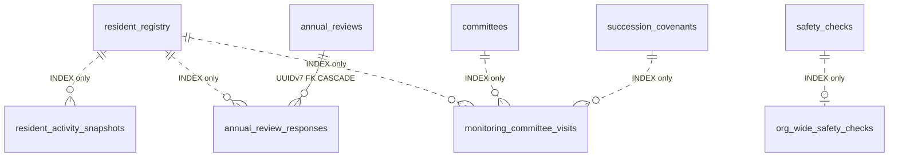

# F09.16: 居住実態管理・見守り

> **ステータス**: 🟢 設計完了
> **実装フェーズ**: Phase 9（v1 設計フェーズ完了 / 実装待ち）
> **最終更新**: 2026-05-12
> **モジュール種別**: マンションテンプレート専用拡張モジュール
> **関連ドキュメント**: F09.15 区分所有者承継支援 / F09.1 住民台帳 / F02.1 投稿 / F04.2 チャット / F02.6 お知らせ既読 / F03.6 安否確認 / F03.12 ケア対象者見守り / F04.10 組織委員会 / F14.2 メンバー情報フォーム / F00 ContentVisibilityResolver

> **F02.11 との境界**: [帰省・滞在予定](F02.11_return_stay_plan.md) は本人が所属チームへ任意公開する行動予定である。F09.15/16の長期不在、封緘見守り、同意、推定スコア、イベント、テーブルとは統合・流用しない。

---

## 1. 概要

### 解決する課題

築古マンションでは「区分所有者の高齢化 + 賃貸化 + 長期不在」により居住実態が不透明化し、管理組合が誰が実際に住んでいるのか・元気なのか把握できない状態が発生する。

本機能は **生前段階** で以下を備える:
- 年次の居住実態申告キャンペーン（賃貸化済みかどうか・連絡先の最新化）
- アプリ内アクティビティ（ログイン・チャット既読・投稿等）を集計した居住実態推定スコア
- 見守り委員会（F04.10 派生 + WATCHER ロール）による訪問・声かけ
- 管理組合横展開の安否確認発動（F03.6 ORG_WIDE）

これらは F09.15（死亡・承継支援）の **早期検知レイヤ** として機能し、`ResidentActivityUpdatedEvent` で F09.15 にスコアを供給する。

### ユーザー価値

| 対象 | 価値 |
|---|---|
| 区分所有者本人 | 年に 1 度の簡単な居住申告で、管理組合との関係が継続。長期不在予定も事前申告で誤通知を回避 |
| 見守り委員 | 訪問記録をアプリで管理。AI 推定スコアにより訪問優先度が明確 |
| 理事長 | 賃貸化率・在住率・連絡可能率がダッシュボード化。管理組合横展開の安否確認をワンクリック発動可能 |
| 管理組合全体 | 居住実態が見える化されることで管理不全の予兆を早期発見 |

### v1 の境界

- 推定スコアは **本人に非開示**（プライバシー保護）。ADMIN / WATCHER のみ可視
- 見守り訪問は **MONITORING_CONSENT 同意者のみ** が対象（F09.15 と共用誓約）
- F03.6 安否確認の組織全体横展開のみ実装（チーム個別はそのまま F03.6 で）

---

## 2. スコープ

### 対象ロール

| ロール | 操作可能な範囲 |
|---|---|
| SYSTEM_ADMIN | 全組織の居住実態統計参照（運用調査目的） |
| ADMIN（理事長） | 年次更新キャンペーンの作成・締切設定 / 推定スコア閲覧 / 訪問結果閲覧 / 管理組合横展開安否確認の発動 |
| DEPUTY_ADMIN（副理事長） | `MANAGE_RESIDENCE_STATUS` 権限を持つ場合: 年次更新キャンペーンの管理 / 推定スコア閲覧 |
| MEMBER（区分所有者） | 自分の年次申告回答 / 自分の長期不在予定の登録（F09.15 `expected_absence_periods` 共用） |
| SUPPORTER | 自身が代理人として紐付いた区分所有者の年次申告閲覧（更新は本人のみ） |
| WATCHER（見守り委員・F04.10 派生ロール） | 訪問記録の入力 / 自分の担当区分所有者の推定スコア閲覧 |
| GUEST | 不可 |

### 対象レベル

- [x] 組織 (Organization) — 管理組合全体での年次キャンペーン・横展開安否確認
- [ ] チーム (Team) — v1 では扱わない（マンション 1 棟＝1 組織前提）
- [x] 個人 (Personal) — 区分所有者本人の申告・閲覧

### テンプレート推奨

| テンプレート | F09.16 | 備考 |
|---|---|---|
| マンション | ○（手動有効化、デフォルト無効） | 主要ターゲット |
| その他全テンプレート | — | 対象外（v1） |

---

## 3. ユースケース

### UC-B1: 年次更新キャンペーン（管理組合発信）

理事長が「年次居住実態更新」キャンペーンを起動。対象区分所有者全員に通知が送信され、以下を回答してもらう:

- 現在も自ら居住しているか / 賃貸に出しているか / 長期不在中か
- 連絡先（電話・メール）の最新性確認
- 緊急連絡先の最新性確認
- 長期不在予定（`expected_absence_periods` 共用）

回答状況は理事長ダッシュボードで一覧表示。

### UC-B2: アプリ内アクティビティ集計（自動）

`ResidentActivityAggregator` バッチが日次実行され、以下のアクティビティから snapshot を作成:

- F02.1 投稿（コルクボード等）
- F04.2 チャット既読
- F02.6 お知らせ既読
- F03.6 安否確認回答
- ログイン
- F14.2 フォーム回答

直近 30 日ローテで `resident_activity_snapshots` に保存。集計結果から推定スコアを算定し `ResidentActivityUpdatedEvent` 発火。

### UC-B3: 見守り委員会による訪問（MONITORING_CONSENT 必須）

理事長が F04.10 で `purpose_tag = MONITORING` の委員会を組成。委員（`committee_members.role = WATCHER`）を任命。

WATCHER が訪問予定を立て、訪問後に `monitoring_committee_visits` に記録:
- 訪問日時 / 担当 WATCHER
- 接触可否（応答あり / 不在 / 確認不能）
- 配慮事項メモ（AES-256-GCM 暗号化）
- 次回訪問推奨日

訪問対象は **MONITORING_CONSENT 同意者のみ**（誓約は F09.15 と共用）。

### UC-B4: 管理組合横展開の安否確認発動

理事長が「管理組合全体への安否確認」をワンクリック発動。F03.6 `safety_checks.source_type = ORG_WIDE` で全居住者対象のセッションを起動。チーム個別の安否確認とは別フローで、組織管理者として一括発呼できる。

### UC-B5: 推定スコアと F09.15 連携

`ResidentActivityAggregator` が算定したスコアは `ResidentActivityUpdatedEvent` で F09.15 に伝達される。F09.15 側で `resident_registry.presumed_death_score` にキャッシュされ、5 段階エスカレーションの D+120（死亡疑い自動起票）判定に利用される。

---

## 4. ドメイン定義

### アクティビティ種別 enum（`resident_activity_snapshots.activity_kind`）

| 値 | 説明 | 重み（推定スコア計算用） |
|---|---|---|
| `LOGIN` | アプリログイン | 1 |
| `POST` | F02.1 投稿（コルクボード等） | 3 |
| `CHAT_READ` | F04.2 チャットメッセージ既読 | 1 |
| `ANNOUNCEMENT_READ` | F02.6 お知らせ既読 | 1 |
| `SAFETY_RESPONSE` | F03.6 安否確認回答 | 5 |
| `FORM_SUBMIT` | F14.2 フォーム回答 | 3 |
| `PAYMENT` | F08.2 支払い完了 | 5 |

### 居住実態状態 enum（`annual_review_responses.residence_state`）

| 値 | 説明 |
|---|---|
| `SELF_RESIDING` | 自ら居住中 |
| `RENTED_OUT` | 賃貸に出している |
| `LONG_TERM_ABSENT` | 長期不在中（施設入所・海外駐在等） |
| `VACANT` | 空室 |
| `UNRESPONDED` | 回答未提出（締切後の暫定値） |

### 訪問結果 enum（`monitoring_committee_visits.contact_result`）

| 値 | 説明 |
|---|---|
| `CONTACTED` | 応答あり |
| `ABSENT` | 不在 |
| `INDETERMINATE` | 確認不能（応答なし・連絡不通） |
| `REFUSED` | 訪問拒否 |

### 推定スコア構成（`presumed_death_score`, 0-100）

```
score = base_inactivity_days_score(0-50)
      + delinquency_factor(0-30)
      + age_factor(0-20)
      - expected_absence_offset(0-100, 期間内は全部減算で最低 0)
```

- `base_inactivity_days_score`: 無アクティビティ日数 × 重み係数（最大 50）
- `delinquency_factor`: 滞納月数 × 5（最大 30）
- `age_factor`: 75 歳以上で +10、85 歳以上で +20
- `expected_absence_offset`: 該当期間内なら大幅減算（誤推定防止）

---

## 5. DB 設計

### 5.0 マスタ・シングルトン例外の判定章（CLAUDE.md L372-386 準拠）

CLAUDE.md 原則 6 では新規テーブルは **UUIDv7 主キー（BINARY(16)）** を必須とする。例外区分の判定基準:

- **マスタ例外**: 全テナント共通参照データ → 自然キー
- **シングルトン例外**: `CHECK(id = 1)` 等で 1 行固定 → 固定値 ID
- **通常（原則 6 適用）**: テナントごと・ユーザーごとに行が増えるテーブル → UUIDv7

#### F09.16 新規 5 テーブルの分類

| テーブル | 行増加パターン | 判定 |
|---|---|---|
| `resident_activity_snapshots` | 居住者×日次で増加（30 日ローテで切り詰め） | **通常 → UUIDv7** |
| `annual_reviews` | 組織×年度で増加 | **通常 → UUIDv7** |
| `annual_review_responses` | 居住者ごとに増加 | **通常 → UUIDv7** |
| `monitoring_committee_visits` | 訪問ごとに増加 | **通常 → UUIDv7** |
| `org_wide_safety_checks` | 安否確認発動ごとに増加 | **通常 → UUIDv7** |

**結論**: F09.16 の 5 テーブルすべてが通常テーブルであり、マスタ例外・シングルトン例外には **該当しない**。全テーブルに原則 6（UUIDv7 BINARY(16)）+ 原則 7（AbstractTenantAwareRepository<T, UUID>）を適用する。

### 5.1 新規テーブル共通仕様（residence-status ドメイン）

全 5 新規テーブル共通:

```sql
id                    BINARY(16) NOT NULL,    -- UUIDv7 主キー
organization_id       BIGINT UNSIGNED NOT NULL, -- テナント絞り込み用（FKなし・INDEX 必須）
deleted_at            DATETIME(6) NULL,
created_at            DATETIME(6) NOT NULL DEFAULT CURRENT_TIMESTAMP(6),
updated_at            DATETIME(6) NOT NULL DEFAULT CURRENT_TIMESTAMP(6) ON UPDATE CURRENT_TIMESTAMP(6),
PRIMARY KEY (id),
INDEX idx_<table>_org (organization_id, deleted_at)
```

居室・居住者紐付けがあるテーブルは以下を追加（**FK なし・INDEX のみ・クロスドメイン弱参照**）:

```sql
dwelling_unit_id      BIGINT UNSIGNED NOT NULL,
resident_registry_id  BIGINT UNSIGNED NOT NULL,
INDEX idx_<table>_dwelling (dwelling_unit_id),
INDEX idx_<table>_resident (resident_registry_id)
```

**Java Entity / Repository 宣言** は F09.15 と同一パターン（`UuidV7Entity` 継承 + `AbstractTenantAwareRepository<T, UUID>` 継承）。

### 5.2 `resident_activity_snapshots`（日次集計・30 日ローテ）

| カラム名 | 型 | NULL | デフォルト | 説明 |
|---|---|---|---|---|
| `id` | BINARY(16) | NO | UUIDv7 | PK |
| `organization_id` | BIGINT UNSIGNED | NO | — | |
| `dwelling_unit_id` | BIGINT UNSIGNED | NO | — | INDEX のみ |
| `resident_registry_id` | BIGINT UNSIGNED | NO | — | INDEX のみ |
| `subject_user_id` | BIGINT UNSIGNED | NO | — | 集計対象ユーザー（INDEX のみ） |
| `snapshot_date` | DATE | NO | — | 集計対象日（日次） |
| `activity_score_total` | SMALLINT UNSIGNED | NO | 0 | 当日合計重み |
| `activity_breakdown_json` | JSON | YES | NULL | 各 activity_kind の発生回数 |
| `deleted_at` | DATETIME(6) | YES | NULL | |
| `created_at` / `updated_at` | DATETIME(6) | NO | — | |

```sql
UNIQUE KEY uq_ras_user_date (subject_user_id, snapshot_date, deleted_at)
INDEX idx_ras_resident_date (resident_registry_id, snapshot_date DESC)
INDEX idx_ras_org (organization_id, deleted_at)
```

**保持**: 30 日ローテ。`@Scheduled` バッチで snapshot_date < NOW() - 30 日 を物理削除（過去分は集約済みのため不要）。

### 5.3 `annual_reviews`（年次更新キャンペーン）

| カラム名 | 型 | NULL | デフォルト | 説明 |
|---|---|---|---|---|
| `id` | BINARY(16) | NO | UUIDv7 | PK |
| `organization_id` | BIGINT UNSIGNED | NO | — | |
| `review_year` | SMALLINT UNSIGNED | NO | — | 対象年度 |
| `started_at` | DATETIME(6) | NO | — | キャンペーン開始日時 |
| `deadline_at` | DATETIME(6) | NO | — | 回答締切日時 |
| `closed_at` | DATETIME(6) | YES | NULL | 締切後のクローズ日時 |
| `target_count` | INT UNSIGNED | NO | 0 | 対象者数（スナップショット） |
| `response_count` | INT UNSIGNED | NO | 0 | 回答済み件数（denormalize） |
| `created_by` | BIGINT UNSIGNED | YES | NULL | 起票理事長 |
| `deleted_at` | DATETIME(6) | YES | NULL | |
| `created_at` / `updated_at` | DATETIME(6) | NO | — | |

```sql
UNIQUE KEY uq_ar_org_year (organization_id, review_year, deleted_at)   -- 1組織1年1キャンペーン
INDEX idx_ar_deadline (deadline_at, closed_at)                          -- 締切バッチ用
```

### 5.4 `annual_review_responses`（各居住者回答メタ）

| カラム名 | 型 | NULL | デフォルト | 説明 |
|---|---|---|---|---|
| `id` | BINARY(16) | NO | UUIDv7 | PK |
| `organization_id` | BIGINT UNSIGNED | NO | — | annual_reviews から非正規化複写 |
| `annual_review_id` | BINARY(16) | NO | — | FK → `annual_reviews.id` ON DELETE CASCADE（同ドメイン）|
| `dwelling_unit_id` | BIGINT UNSIGNED | NO | — | INDEX のみ |
| `resident_registry_id` | BIGINT UNSIGNED | NO | — | INDEX のみ |
| `respondent_user_id` | BIGINT UNSIGNED | NO | — | 回答者（INDEX のみ） |
| `residence_state` | VARCHAR(30) | NO | 'UNRESPONDED' | 居住実態状態 enum |
| `contact_phone_verified` | BOOLEAN | NO | FALSE | 電話番号最新性確認済み |
| `contact_email_verified` | BOOLEAN | NO | FALSE | メール最新性確認済み |
| `emergency_contact_verified` | BOOLEAN | NO | FALSE | 緊急連絡先最新性確認済み |
| `responded_at` | DATETIME(6) | YES | NULL | 回答日時 |
| `note` | TEXT | YES | NULL | 自由記述（暗号化不要・任意） |
| `deleted_at` | DATETIME(6) | YES | NULL | |
| `created_at` / `updated_at` | DATETIME(6) | NO | — | |

```sql
UNIQUE KEY uq_arr_review_resident (annual_review_id, resident_registry_id, deleted_at)
INDEX idx_arr_review_state (annual_review_id, residence_state)
INDEX idx_arr_resident (resident_registry_id, responded_at DESC)
INDEX idx_arr_org (organization_id, deleted_at)
```

### 5.5 `monitoring_committee_visits`（訪問記録）

| カラム名 | 型 | NULL | デフォルト | 説明 |
|---|---|---|---|---|
| `id` | BINARY(16) | NO | UUIDv7 | PK |
| `organization_id` | BIGINT UNSIGNED | NO | — | |
| `dwelling_unit_id` | BIGINT UNSIGNED | NO | — | INDEX のみ |
| `resident_registry_id` | BIGINT UNSIGNED | NO | — | INDEX のみ |
| `subject_user_id` | BIGINT UNSIGNED | NO | — | 訪問対象（INDEX のみ） |
| `committee_id` | BIGINT UNSIGNED | NO | — | F04.10 committees（INDEX のみ・FK なし） |
| `visitor_user_id` | BIGINT UNSIGNED | NO | — | 訪問者（WATCHER）（INDEX のみ） |
| `visited_at` | DATETIME(6) | NO | — | 訪問日時 |
| `contact_result` | VARCHAR(20) | NO | — | 訪問結果 enum |
| `consideration_memo_encrypted` | TEXT | YES | NULL | **AES-256-GCM 暗号化**: 配慮事項メモ |
| `next_visit_recommended_at` | DATE | YES | NULL | 次回訪問推奨日 |
| `consent_covenant_id` | BINARY(16) | YES | NULL | MONITORING_CONSENT 誓約 ID（F09.15 succession_covenants 参照・INDEX のみ・FK なし）|
| `deleted_at` | DATETIME(6) | YES | NULL | |
| `created_at` / `updated_at` | DATETIME(6) | NO | — | |

```sql
INDEX idx_mcv_committee (committee_id, visited_at DESC)
INDEX idx_mcv_subject (subject_user_id, visited_at DESC)
INDEX idx_mcv_resident_result (resident_registry_id, contact_result, visited_at DESC)
INDEX idx_mcv_org (organization_id, deleted_at)
```

### 5.6 `org_wide_safety_checks`（管理組合横展開のラッパ）

| カラム名 | 型 | NULL | デフォルト | 説明 |
|---|---|---|---|---|
| `id` | BINARY(16) | NO | UUIDv7 | PK |
| `organization_id` | BIGINT UNSIGNED | NO | — | |
| `safety_check_id` | BIGINT UNSIGNED | NO | — | F03.6 safety_checks.id（INDEX のみ・FK なし）|
| `triggered_by` | BIGINT UNSIGNED | NO | — | 発動者（理事長） |
| `triggered_at` | DATETIME(6) | NO | — | 発動日時 |
| `trigger_reason` | VARCHAR(200) | YES | NULL | 発動理由（地震・火災・組合判断等） |
| `closed_at` | DATETIME(6) | YES | NULL | F03.6 セッションのクローズに同期 |
| `deleted_at` | DATETIME(6) | YES | NULL | |
| `created_at` / `updated_at` | DATETIME(6) | NO | — | |

```sql
INDEX idx_owsc_safety (safety_check_id)
INDEX idx_owsc_org_triggered (organization_id, triggered_at DESC)
```

> F03.6 側で `safety_checks.source_type` に `ORG_WIDE` 値を追加することで、本テーブルから F03.6 のセッションを区別できる。

### 5.7 ER 図



**FK 方針まとめ**: F09.15 と同方針。クロスドメインは INDEX のみ、同一ドメイン内親子は UUIDv7 FK + CASCADE 許可。

---

## 6. API 設計

> 🟢 **スコープ移行完了（2026-05-17 / Stage3 第四陣 dwelling-units triage）**:
> 本設計書は当初スコープなしの `/api/v1/residence-status/...` として設計されたが、
> 現実装は **組織スコープ** `/api/v1/organizations/{orgId}/residence-status/...` に
> 統一されている。Phase S3〜S5 の実装完了に伴い、**§6.1 表と §6.2 章見出しを
> 実装パスに合わせて全件書き換え済み**。
>
> 該当 Controller:
> - `AnnualReviewController` (4 件: create / list / getReview / closeReview / listMyReviews)
> - `MonitoringCommitteeVisitController` (4 件: create / list / updateVisit / getVisitsByWatcher)
> - `ResidenceStatusController` (2 件: getSnapshots / getDashboard)
> - `AnnualReviewResponseController` (2 件: list / submitMyResponse)
> - `OrgWideSafetyCheckController` (2 件: triggerCheck / getActiveChecks)
>
> 旧スコープなし `/api/v1/residence-status/...` パスは **すべて廃止**。
> triage 詳細: `docs/internal/triage_log/dwelling-units.md` §2.2 参照。

### 6.1 エンドポイント一覧

| メソッド | パス | 認可 | 用途 |
|---|---|---|---|
| POST | `/api/v1/organizations/{orgId}/residence-status/annual-reviews` | ADMIN | 年次更新キャンペーン起動 |
| GET | `/api/v1/organizations/{orgId}/residence-status/annual-reviews` | ADMIN/DEPUTY_ADMIN | キャンペーン一覧 |
| GET | `/api/v1/organizations/{orgId}/residence-status/annual-reviews/{id}` | ADMIN/DEPUTY_ADMIN | キャンペーン詳細（回答状況） |
| POST | `/api/v1/organizations/{orgId}/residence-status/annual-reviews/{id}/close` | ADMIN | キャンペーン手動クローズ |
| GET | `/api/v1/organizations/{orgId}/residence-status/annual-reviews/{reviewId}/responses` | ADMIN/DEPUTY_ADMIN | 全回答一覧 |
| GET | `/api/v1/organizations/{orgId}/residence-status/annual-reviews/my` | MEMBER | 自分の回答対象キャンペーン取得 |
| PUT | `/api/v1/organizations/{orgId}/residence-status/annual-reviews/{reviewId}/responses/me` | MEMBER | 自分の回答送信 |
| GET | `/api/v1/organizations/{orgId}/residence-status/activity-snapshots/{residentRegistryId}` | ADMIN/WATCHER | 推定スコア + アクティビティ集計（本人非開示）|
| POST | `/api/v1/organizations/{orgId}/residence-status/monitoring-visits` | WATCHER | 訪問記録の入力 |
| GET | `/api/v1/organizations/{orgId}/residence-status/monitoring-visits` | WATCHER/ADMIN | 訪問記録一覧 |
| GET | `/api/v1/organizations/{orgId}/residence-status/monitoring-visits/by-watcher/{watcherUserId}` | WATCHER/ADMIN | 訪問担当別の訪問記録一覧 |
| PUT | `/api/v1/organizations/{orgId}/residence-status/monitoring-visits/{id}` | WATCHER | 訪問記録の更新（24h 以内のみ） |
| POST | `/api/v1/organizations/{orgId}/residence-status/org-wide-safety-checks` | ADMIN | 管理組合横展開安否確認の発動 |
| GET | `/api/v1/organizations/{orgId}/residence-status/org-wide-safety-checks/active` | ADMIN/DEPUTY_ADMIN | 進行中の組織横断安否確認の一覧 |
| GET | `/api/v1/organizations/{orgId}/residence-status/dashboard` | ADMIN/DEPUTY_ADMIN | 居住実態ダッシュボード統計 |

### 6.2 主要エンドポイント仕様（抜粋）

#### POST `/api/v1/organizations/{orgId}/residence-status/annual-reviews`

**認可**: ADMIN

**リクエスト**:
```json
{
  "review_year": 2026,
  "deadline_days": 30,
  "message": "年次居住実態の更新をお願いします"
}
```

**副作用**:
1. `annual_reviews` レコード INSERT
2. 対象区分所有者全員にプッシュ通知（F04.3）
3. F02.6 お知らせフィードに投稿（任意）

#### POST `/api/v1/organizations/{orgId}/residence-status/org-wide-safety-checks`

**認可**: ADMIN

**副作用**:
1. F03.6 `safety_checks` に INSERT（`source_type = ORG_WIDE`）
2. `org_wide_safety_checks` に対応レコードを INSERT
3. F03.6 の通常フローでセッション運用（全員に通知 + ブロッキングモーダル）

> 設計初版はフラット URL `/api/v1/residence-status/org-wide-safety-checks` だったが、F09.16 全体で
> 組織スコープを URL パスに明示する方針に揃え、`/api/v1/organizations/{orgId}/residence-status/...`
> に統一した（2026-05-17 設計書更新）。

#### GET `/api/v1/organizations/{orgId}/residence-status/org-wide-safety-checks/active`

**認可**: ADMIN / DEPUTY_ADMIN

未クローズ（status = ACTIVE）の横展開安否確認の一覧を返す。横展開ダッシュボードで「今動いている
横展開安否確認」をリアルタイムに把握するために使用する。

**レスポンス（200 OK）**: 横展開安否確認 DTO の配列（`OrgWideSafetyCheckDto`）。

#### GET `/api/v1/organizations/{orgId}/residence-status/activity-snapshots/{residentRegistryId}`

**認可**: ADMIN または WATCHER（自分の担当者のみ）

**レスポンス（200 OK）**: 直近 30 日の集計 + 推定スコア + 内訳。**本人からのリクエストは 403**（本人非開示）。

---

## 7. ビジネスロジック

### 7.1 ドメインイベント連携

```
F02.1 PostCreatedEvent       ┐
F04.2 ChatMessageReadEvent   ├──> ActivitySnapshotAggregator (Spring Listener)
F02.6 AnnouncementReadEvent  │       │
F03.6 SafetyResponseEvent    │       └──> resident_activity_snapshots に INSERT
F14.2 FormSubmittedEvent     │              │
F08.2 PaymentStatusChangedEvent ┘              └──> ResidentActivityUpdatedEvent 発火
                                                       │
                                                       └──> F09.15 が購読
                                                              ├──> resident_registry.activity_last_seen_at 更新
                                                              └──> resident_registry.presumed_death_score 再計算
```

### 7.2 推定スコア算定式

```java
public int computeScore(ResidentSnapshot snap) {
    int base = Math.min(50, snap.inactiveDays() * 2);  // 25 日無反応で 50 点
    int delinquency = Math.min(30, snap.delinquencyMonths() * 5);
    int age = snap.age() >= 85 ? 20 : (snap.age() >= 75 ? 10 : 0);

    int offset = snap.isWithinExpectedAbsence() ? 100 : 0;

    return Math.max(0, Math.min(100, base + delinquency + age - offset));
}
```

`expected_absence_periods` は F09.15 `succession_pre_registrations.expected_absence_periods` を参照。

### 7.3 見守り委員会（F04.10 派生）

F04.10 の汎用委員会基盤を流用:
- `committees.purpose_tag` に `MONITORING` 値を追加
- `committee_members.role` に `WATCHER` 値を追加
- 訪問記録 `monitoring_committee_visits` は本機能で新設

訪問対象は **MONITORING_CONSENT 同意者のみ**:
- 訪問記録 INSERT 時に `consent_covenant_id` をセット
- 該当 covenant の `revoked_at IS NULL` を Service 層で検証
- 同意撤回時は新規訪問記録の作成不可（既存記録は残す）

### 7.4 推定スコアの可視範囲制限

| ロール | 推定スコア閲覧 |
|---|---|
| ADMIN | ○（全居住者） |
| DEPUTY_ADMIN（MANAGE_RESIDENCE_STATUS）| ○（全居住者） |
| WATCHER | △（自分の担当者のみ） |
| MEMBER | ✗（**本人にも非開示**） |
| SUPPORTER | ✗ |

**本人非開示の理由**: スコアを本人に見せると不安を煽る、または逆に「自分は元気だから安心」と誤認させ実態調査を拒否される懸念があるため、UI に表示しない。

### 7.5 30 日ローテバッチ

```java
@Scheduled(cron = "0 0 3 * * *", zone = "Asia/Tokyo")
@SchedulerLock(name = "activitySnapshotRotationBatch", lockAtMostFor = "30m")
public void rotate() {
    // snapshot_date < NOW() - 30 day を物理削除
    // ※ 集計済み（presumed_death_score にキャッシュ済み）のため snapshot 自体は破棄可
}
```

---

## 8. UI/UX

### 8.1 年次更新キャンペーン UI（MEMBER）

- 起動時にブロッキング通知（モーダル + プッシュ通知）
- 「3 分で完了」を強調
- ラジオボタン主体（自由記述は最小限）
- 「長期不在予定がある」にチェックすると F09.15 の `expected_absence_periods` 入力欄が展開

### 8.2 理事長ダッシュボード（ADMIN）

タブ:
- **居住実態**: residence_state 別の円グラフ + 居住者一覧
- **年次更新**: 進行中・過去のキャンペーン一覧 + 回答率
- **推定スコア**: スコア降順の居住者一覧（80 以上は赤バナー）
- **訪問記録**: 直近 30 日の訪問一覧 + 次回推奨日

### 8.3 WATCHER 用訪問記録 UI

- 自分の担当居住者の推定スコア降順リスト
- ワンタップで訪問記録作成画面に遷移
- contact_result の選択 + メモ入力（最大 2000 文字）

---

## 9. セキュリティ

### 9.1 訪問メモ暗号化

`monitoring_committee_visits.consideration_memo_encrypted` は AES-256-GCM で暗号化保存。WATCHER 自身および ADMIN のみ復号アクセス可能。

### 9.2 推定スコア非開示

§7.4 のとおり本人には推定スコアを返さない。GET API のロール検証で `subjectUserId == currentUserId` の場合は 403 を返す。

### 9.3 MONITORING_CONSENT 撤回時の挙動

- `succession_covenants.revoked_at IS NOT NULL` の場合、新規訪問記録の作成不可（409 を返す）
- 既存訪問記録は履歴として保持（個人情報の最小化は AES-256-GCM 暗号化で担保）

### 9.4 横展開安否確認の認可

`POST /org-wide-safety-checks` は ADMIN のみ。組織全体への発動は管理組合判断（理事長）に限定。

### 9.5 レート制限（Bucket4j）

| エンドポイント | 制限 |
|---|---|
| 年次キャンペーン起動 | 1 分 1 件 |
| 訪問記録作成 | 1 分 10 件 |
| 横展開安否確認発動 | 1 時間 3 件（誤発動防止） |
| 推定スコア取得 | 1 分 30 件 |

### 9.6 ダッシュボード GET の最適化

`GET /dashboard` は集計クエリのため Redis キャッシュを 5 分間 TTL で適用（古さは許容範囲）。キャッシュキー: `residence-status:dashboard:{organizationId}`。

---

## 10. 監査・ログ

### 10.1 監査ログイベント（10 年保持・F09.15 と同方針）

| イベント | 発火タイミング |
|---|---|
| `ANNUAL_REVIEW_STARTED` | 年次キャンペーン起動 |
| `ANNUAL_REVIEW_RESPONSE_SUBMITTED` | 回答送信 |
| `ANNUAL_REVIEW_CLOSED` | 締切到達 or 手動クローズ |
| `ACTIVITY_SCORE_RECOMPUTED` | 推定スコア再計算（ResidentActivityUpdatedEvent 発火時）|
| `MONITORING_VISIT_LOGGED` | 訪問記録 INSERT |
| `MONITORING_VISIT_UPDATED` | 訪問記録更新（24h 以内） |
| `ORG_WIDE_SAFETY_CHECK_TRIGGERED` | 横展開安否確認発動 |

---

## 11. 法的注意事項

### 11.1 ⚠ v1 弁護士監修なし

本機能の DB 設計・API 設計・帳票テンプレートは **2026-05 時点で弁護士監修を受けていない**。実際の運用に際しては必ず管轄の自治体・弁護士・司法書士にご相談ください。

**収益化後の v2 で正式な弁護士監修を実施する**。

### 11.2 参照法令

| 機能 | 根拠 |
|---|---|
| 個人情報の取扱い | 個人情報保護法 / GDPR |
| 見守り訪問の同意取得 | MONITORING_CONSENT 誓約（F09.15 共用）|
| 安否確認の根拠 | マンション標準管理規約 / 管理組合判断 |

### 11.3 民生委員（WATCHER）任命時の独立 MONITORING_CONSENT 誓約

F09.15 と同一の `succession_covenants` テーブルに `covenant_type = MONITORING_CONSENT` で誓約を保存。SUCCESSION_PRE_REGISTRATION 誓約とは独立した同意フローを必須とする（一括同意の禁止・§8.4 ダークパターン回避ガイドライン準拠）。

---

## 12. エッジケース

| ケース | 対応 |
|---|---|
| **賃貸化済み居住者の年次更新** | 区分所有者本人に通知。賃借人には通知しない（賃借人誤通知防止）|
| **MONITORING_CONSENT 撤回後の訪問記録** | 新規訪問記録の作成は 409。既存記録は保持（暗号化済み）|
| **長期不在中の推定スコア誤推定** | `expected_absence_periods` で offset 適用。本人申告がない場合は WATCHER の訪問記録で `INDETERMINATE` を入力→ ADMIN がレビュー |
| **WATCHER のなりすまし** | committee_members.role = WATCHER であることを訪問記録 INSERT 時に検証 |
| **海外居住者の年次更新未回答** | residence_state = UNRESPONDED で締切後にレポート。v1 は手動対応。v2 で海外居住対応 |
| **横展開安否確認の誤発動** | 1 時間 3 件のレート制限。発動者・発動理由を必ず記録 |
| **アクティビティが完全に 0 の若年区分所有者** | age_factor が 0 のため score は base のみ。誤推定リスクは低いが、80 を超えるなら ADMIN がレビュー前提 |

---

## 13. 実装フェーズ

### S0: 共通基盤先行（F09.15 と共通）

- F00 `reference_id_uuid` 並列カラム追加
- Flyway 採番予約調整

### S1: データモデル基盤

- 全 5 UUIDv7 テーブル DDL（V9.102〜V9.106・S1-B 確定）
- F03.6 `source_type=ORG_WIDE` 値追加
- F03.12 relationship enum 追加
- F04.10 `purpose_tag=MONITORING` + `WATCHER` ロール追加（後続予約）
- F14.2 `COVENANT_BLOCK` フィールド型対応
- `MANAGE_RESIDENCE_STATUS` permission 追加（V9.107・S1-B 確定）
- UuidV7Entity / AbstractTenantAwareRepository 適用

### S2: 年次更新キャンペーン

- annual_reviews CRUD API
- 通知配信
- 締切バッチ
- ダッシュボード基本表示

### S3: アクティビティ集計

- ActivitySnapshotAggregator（Spring Listener）
- 推定スコア算定ロジック
- ResidentActivityUpdatedEvent 発火
- 30 日ローテバッチ

### S4: 見守り委員会連携

- F04.10 WATCHER ロール対応
- monitoring_committee_visits CRUD
- MONITORING_CONSENT 検証
- WATCHER 用 UI

### S5: 横展開安否確認 + ダッシュボード仕上げ

- POST /org-wide-safety-checks（F03.6 連携）
- ダッシュボード Redis キャッシュ
- E2E テスト
- 🟢 ステータス更新

**クリティカルパス**: S0 → S1 → S2 → S3 → S5。S4 は S1 完了後に並行可能。

---

## 14. Flyway マイグレーション計画

| バージョン | 内容 | 状態 |
|---|---|---|
| V9.102 | `resident_registry` 死亡関連 5 カラム拡張（`death_status` / `death_status_changed_at` / `death_status_changed_by` / `presumed_death_score` / `activity_last_seen_at`） | ✅ S1-C 完了 (2026-05-12) |
| V9.103 | `resident_registry` 居住実態関連 5 カラム拡張（`occupancy_status` / `last_annual_review_at` / `annual_review_due_at` / `is_secondary_home` / `age_estimated`） | ✅ S1-C 完了 (2026-05-12) |
| V9.104 | `resident_activity_snapshots` テーブル新設（S1-B 確定） | ✅ S1-B 完了予定 |
| V9.105 | `annual_reviews` テーブル新設（S1-B 確定） | ✅ S1-B 完了予定 |
| V9.106 | `annual_review_responses` テーブル新設（S1-B 確定・同ドメイン FK CASCADE） | ✅ S1-B 完了予定 |
| V9.107 | `monitoring_committee_visits` テーブル新設（S1-B 確定・暗号化メモ） | ✅ S1-B 完了予定 |
| V9.108 | `org_wide_safety_checks` テーブル新設（S1-B 確定） | ✅ S1-B 完了予定 |
| V9.109 | `MANAGE_RESIDENCE_STATUS` permission 追加（S1-B 確定） | ✅ S1-B 完了予定 |
| 後続予約 | F03.6 `safety_checks.source_type` に `ORG_WIDE` / F03.12 relationship enum 拡張 / F04.10 `purpose_tag=MONITORING` + `committee_members.role=WATCHER` | 仮予約 |

> 仮予約 V9.030〜V9.036 は実装着手時に Phase 9 系の連番衝突（V9.020 が parking_subleases で既使用、V9.100/101 が my_scope_folder 系で既使用）を確認した結果、S1-B では空き番号 **V9.104〜V9.109** に振り直して確定した。S1-C で `resident_registry` 拡張に V9.102 / V9.103 を消費している。F03.6 / F03.12 / F04.10 への enum 拡張は後続フェーズで個別に番号を取得して実装する。

---

## 15. 未解決事項

| 項目 | 解決方針 |
|---|---|
| 推定スコアの算定式パラメータ | v1 は §4 / §7.2 の素朴な線形式。運用後にフィードバックを集めて v1.1 でチューニング |
| F03.6 横展開安否確認 UI | F03.6 既存 UI を流用しつつ、source_type=ORG_WIDE 識別バナーを追加（実装フェーズで F03.6 軍議）|
| 海外居住者対応 | **v2 で対応** |
| 銀行別カスタム書類 | **v2 で対応**（F09.15 と共通）|
| Flyway 連番確定 | 解決済（S1-B 実装時 V9.102〜V9.107 に確定）|

---

## 16. 変更履歴

| 日付 | 変更内容 |
|---|---|
| 2026-05-12 | 初版作成。UUIDv7（原則 6）+ AbstractTenantAwareRepository（原則 7）準拠。マスタ・シングルトン例外の判定章を §5.0 に明記し、5 テーブルすべて「通常（原則 6 適用）」と確認。クロスドメイン FK ゼロ・CASCADE 同一ドメイン内のみ。F02.1/F04.2/F02.6 → ActivitySnapshotAggregator → ResidentActivityUpdatedEvent → F09.15 のドメインイベント連携。推定スコア = 無アクティビティ日数 × 滞納係数 × 年齢係数 - expected_absence_periods 除外。見守り委員会（F04.10 派生 + WATCHER ロール）+ MONITORING_CONSENT 独立誓約。推定スコアは ADMIN/見守り委員のみ可視・本人非開示。⚠ 弁護士監修なし・収益化後監修明記 |
