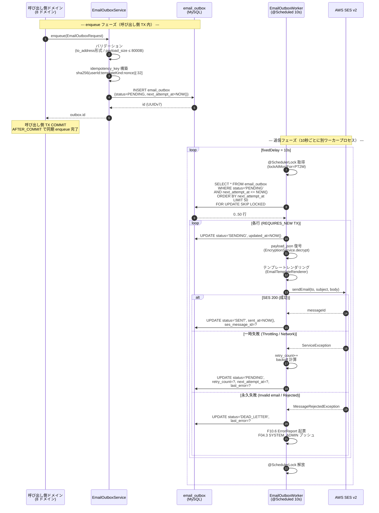
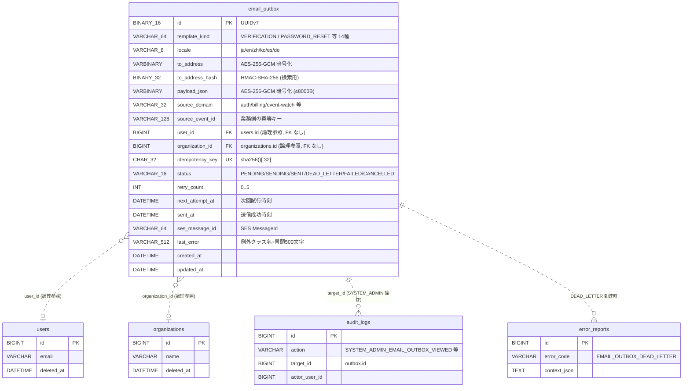
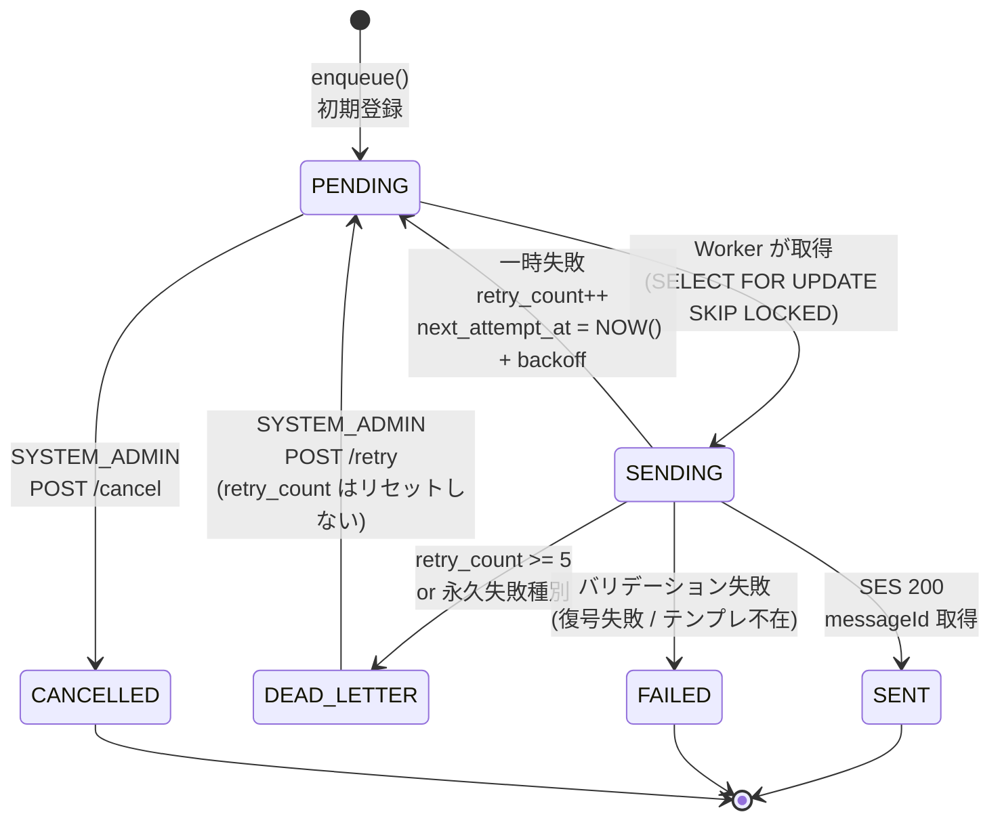

# F09.18: メール配信基盤 (outbox + リトライワーカー)

> **ステータス**: 🟢 設計完了
> **実装フェーズ**: Phase 18（18-a/b/c/d/e に分割、18-f は将来別軍議）
> **最終更新**: 2026-05-18
> **モジュール種別**: 基盤機能（全ドメインのメール送信が依存する横断基盤）
> **関連ドキュメント**: F01.1 認証、F09.6 ダイレクトメール、F09.14 重要事項説明書、F09.17 広告主ターゲット配信、F10.3 監査ログ、F10.5 パフォーマンス監視、F10.6 エラー監視、F12.5 フロントエンドエラー追跡、F13 ストレージクォータ、GDPR 削除権ポリシー

---

## §1 概要

### 1.1 課題

2026-05-18 11:49（JST）、ローカル開発環境での新規ユーザー登録時に発生した認証メール SES 失敗事故（受信者: `hideharu215@yahoo.co.jp`、経路: `AuthEmailEventListener.handleUserRegistered(UserRegisteredEvent)`）が本書起草の直接の発端である。AWS SES 認証情報未設定のため `software.amazon.awssdk.core.exception.SdkClientException` が発生し、`EmailService.sendEmail()` 内部で catch されて log.error() のみ出力されたが、呼び出し側 (`AuthEmailEventListener`) は例外を観測できず正常終了。組み立てた認証 URL (`http://localhost:3000/verify-email?token=<rawToken>`) は SES 失敗とともに永久喪失し、DB には `token_hash` のみ残ったため raw token を復元できず、ユーザーは「再送ボタン」を自力で押すしかない（しかも UI 上は送信成功と見える）状況に陥った。

この事故の根本原因は、`EmailService.sendEmail()` への直接呼び出しが計 14 箇所・8 ドメインに散在し、いずれも以下の構造的欠陥を共有していることである:

1. **SES 同期呼び出し**: API call が成功するまでアプリケーションスレッドをブロックする
2. **失敗時のリトライなし**: SES Throttling / NetworkException / 一時的な可用性低下が即座にメール喪失に直結
3. **失敗時のログ吸収のみ**: 例外を握りつぶし、業務側には成功として見せる（対処療法の典型）
4. **raw token の non-durable な扱い**: 認証メール本文に埋め込まれる raw token がメモリ上にしか存在せず、SES 失敗とともに永久消失

本番環境では SES Sending Quota の超過、SES アカウントの一時停止、リージョン障害、DNS 不調等で同じ事故が必ず再発する。CLAUDE.md「障害対応の原則 — 根治治療を徹底すること」に従い、対処療法（try-catch 拡張やフロント側 retry UI）ではなく、構造的に再発を不可能にする基盤として本機能を設計する。

### 1.2 解決アプローチ

以下 5 つの要素を組み合わせ、メール送信を「ベストエフォート同期処理」から「保証付き非同期処理」へ転換する:

1. **outbox パターン**: 呼び出し側ドメインのトランザクション内で `email_outbox` テーブルに INSERT し、`@TransactionalEventListener(AFTER_COMMIT)` で即終了。SES への送信責務は完全に分離する
2. **指数バックオフ + 最大 5 回リトライ**: 一時失敗時は次回試行時刻を指数的に後退させる（10s → 30s → 2m → 10m → 30m → 2h）
3. **Dead Letter Queue**: 永久失敗 / 最大リトライ超過時は `status=DEAD_LETTER` に遷移し、SYSTEM_ADMIN が再キュー / キャンセルできる管理 API を提供する
4. **監視メトリクス**: Micrometer で queue 深さ・最古滞留時間・成功率・DEAD_LETTER 件数を継続観測し、閾値超過時は F10.6 ErrorReport と F04.3 SYSTEM_ADMIN プッシュで即座にエスカレーション
5. **GDPR 保持期間ポリシー**: 本文 PII (payload_json) は 30 日、宛先 (to_address) は 13 ヶ月で匿名化。集計可能メタは 7 年保持

### 1.3 F09.17 / F09.6 / F01.1 との責任境界

| ドメイン         | 機能の本質                                         | F09.18 との関係                                         |
|------------------|----------------------------------------------------|---------------------------------------------------------|
| F01.1 認証       | 認証 token の生成・検証 (パスリセ / メール確認)    | enqueue 呼び出し元（Phase 18-b 最優先 3 箇所）         |
| F09.6 ダイレクトメール | ユーザー間 DM / SYSTEM_ADMIN → ユーザー 1:1 通知 | enqueue 呼び出し元（Phase 18-c で移行）                |
| F09.14 重要事項説明書 | 不動産取引時の電子書面配布通知                   | enqueue 呼び出し元（Phase 18-c で移行）                |
| F09.17 ターゲット配信 | キャンペーン型一斉配信 (週 3 件キャップ / 4 チャネル) | EMAIL チャネルは Phase 18-f で統合（別軍議、本書は将来パスを §12 で担保） |

責任分離の鍵: F09.18 は「**1 通の確実な配送保証**」、F09.17 は「**配信ポリシー・課金・モデレーション**」。前者は基盤、後者は業務ロジック。

### 1.4 スコープ外

- **SMS 配送基盤**: 別チャネルの outbox 化は将来別設計書として検討（モジュール名 `messaging.outbox` 等の汎用化も含めて）
- **プッシュ通知 outbox 化**: F04.3 / FCM 統合の現行実装はそのまま温存
- **F09.17 EMAIL チャネル統合**: 本書 §12 で将来パスを設計担保するのみ。実装は Phase 18-f（別軍議）
- **SES SNS バウンス Webhook ハンドラ**: F09.17 のバウンス処理と共通化して将来別実装
- **メール本文の HTML 全量保存**: テンプレ参照 + 変数 JSON 方式を採用し、HTML 本文の DB 保持は行わない（プライバシー・ストレージ容量観点）

---

## §2 ユースケース・スコープ

### 2.1 対象ロール

| ロール / 主体             | enqueue 経路                                   | 用途                                                                 |
|---------------------------|------------------------------------------------|----------------------------------------------------------------------|
| auth ドメイン             | `AuthEmailEventListener`                       | 認証メール (新規登録) / 認証メール再送 / パスワードリセット (3 箇所) |
| analytics ドメイン        | `MonthlyKpiSnapshotBatchService` / `AnalyticsAggregationService` | 月次 KPI レポート / 集計サマリーメール (2 箇所)               |
| advertising ドメイン      | `OverdueInvoiceBatchService`                   | 広告主向け請求書期限切れ通知 (1 箇所)                              |
| errorreport ドメイン      | `ErrorReportWeeklySummaryService`              | SYSTEM_ADMIN 向けエラーレポート週次サマリー (1 箇所)                |
| notification ドメイン     | `ConfirmableNotificationEmailEventListener`    | 確認型通知メール (1 箇所、複数受信者ループ)                          |
| gdpr ドメイン             | `DataExportService` / `WithdrawalReminderService` | データエクスポート完了 / 失敗 / 退会リマインダー (3 箇所)         |
| reservation ドメイン      | `EmergencyClosureService` / `EmergencyClosureReminderBatchService` | 臨時休業通知 / 患者リマインド / 未確認リマインド (3 箇所)     |
| **SYSTEM_ADMIN 管理画面** | system-admin Controller                        | 一覧 / 詳細 / 再キュー / キャンセル / メトリクス閲覧                  |
| GDPR 削除フロー           | `UserAccountPurgedEvent`                       | 退会済ユーザーの outbox 行を匿名化                                  |

**enqueue 経路の合計**: 7 ドメイン × 14 箇所（詳細は §11 移行マトリクス参照）

### 2.2 対象システム

| 外部依存                      | 役割                                                              |
|-------------------------------|-------------------------------------------------------------------|
| AWS SES v2 (sesv2-2019-09-27) | 実送信。`SesV2Client.sendEmail()` を Worker が呼ぶ                |
| EncryptionService             | to_address / payload_json の AES-256-GCM 暗号化                  |
| HmacService                   | to_address_hash の HMAC-SHA-256（検索用）                         |
| ShedLock (JDBC)               | `@SchedulerLock` で複数 pod のワーカー重複起動防止                |
| Micrometer + Prometheus       | 6 種類のメトリクス公開                                            |
| F10.3 audit_logs              | SYSTEM_ADMIN 操作の監査記録                                       |
| F10.6 error_reports           | DEAD_LETTER 到達時の自動エラー起票                                |
| F04.3 push notification       | SYSTEM_ADMIN への HIGH 優先度プッシュ通知                         |
| Thymeleaf                     | テンプレートレンダリング（変数置換時の HTML エスケープ）         |

### 2.3 非機能要件

| 指標                          | SLO                                                  | 計測手段                                |
|-------------------------------|------------------------------------------------------|-----------------------------------------|
| 送信遅延 (enqueue → SES 受理) | p95 < 60 秒                                          | `email_outbox_delivery_latency_seconds` |
| 送信成功率                    | ≥ 99.5% (1 時間移動平均)                             | `email_outbox_delivery_success_rate`    |
| キュー最古滞留時間            | < 5 分（status=PENDING の最古 created_at から経過時間） | `email_outbox_oldest_pending_age_seconds` |
| Dead Letter 検知              | ≤ 10 分（DEAD_LETTER 遷移から SYSTEM_ADMIN 通知まで） | `email_outbox_queue_depth_dead_letter`  |
| Worker tick 間隔              | 10 秒（fixedDelay）                                  | `@Scheduled` 設定                       |
| Worker batch size             | 50 件 / tick                                         | `LIMIT 50` クエリ                       |
| ShedLock lockAtMostFor        | 2 分                                                 | `@SchedulerLock(lockAtMostFor="PT2M")`  |
| 暗号化アルゴリズム            | AES-256-GCM (鍵長 256bit)                            | EncryptionService 既存実装             |

---

## §3 アーキテクチャ全体図

### 3.1 シーケンス図



### 3.2 デプロイ構成

- 複数 pod 想定（K8s 環境で minReplicas=2 を維持）
- `@Scheduled(fixedDelay = 10000)` が pod ごとに起動するが、`@SchedulerLock(name="emailOutboxWorker", lockAtMostFor="PT2M", lockAtLeastFor="PT5S")` で同時実行は 1 pod のみに制限
- 万一 ShedLock 失敗（lock holder の pod がクラッシュなど）でも、`SELECT FOR UPDATE SKIP LOCKED` により同じ行は別 pod に取られない（二重防御）
- ワーカー処理は呼び出し側 API スレッドとは完全に分離されており、`enqueue()` の API 応答は INSERT 完了で即返す（数 ms オーダー）

---

## §4 DB 設計

### 4.1 ER 図



### 4.2 email_outbox テーブル DDL

```sql
-- Flyway: V67.x__create_email_outbox.sql
-- (V67.x は F09.17 Phase 11-a の V67.x 系と衝突しない番号を Phase 18-a 起動時に確定する)

CREATE TABLE email_outbox (
    id                  BINARY(16)    NOT NULL          COMMENT 'UUIDv7 主キー',

    -- テンプレート識別
    template_kind       VARCHAR(64)   NOT NULL          COMMENT 'VERIFICATION / PASSWORD_RESET / ANALYTICS_KPI_MONTHLY 等 (§11 マトリクス参照)',
    locale              VARCHAR(8)    NOT NULL          COMMENT 'ja/en/zh/ko/es/de',

    -- 宛先（暗号化）
    to_address          VARBINARY(512) NOT NULL         COMMENT 'AES-256-GCM 暗号化済メールアドレス',
    to_address_hash     BINARY(32)    NOT NULL          COMMENT 'HMAC-SHA-256 (検索用、別鍵)',

    -- 本文変数（暗号化、≤8000B 制約）
    payload_json        VARBINARY(8192) NULL            COMMENT 'AES-256-GCM 暗号化済変数 JSON (Map<String,String> 制約)',

    -- ソース追跡
    source_domain       VARCHAR(32)   NOT NULL          COMMENT 'auth/billing/event-watch/chat/reservation/pointcard/organization/repair-plan/advertising',
    source_event_id     VARCHAR(128)  NULL              COMMENT '業務側の冪等キー (token.id, batch_run_id 等)',
    user_id             BIGINT        NULL              COMMENT '宛先ユーザー (論理参照、FK なし)',
    organization_id     BIGINT        NULL              COMMENT '所属組織 (論理参照、FK なし。認証メールは NULL)',

    -- 冪等性
    idempotency_key     CHAR(32)      NOT NULL          COMMENT 'sha256(user_id:template_kind:nonce)[:32]',

    -- 状態
    status              VARCHAR(16)   NOT NULL DEFAULT 'PENDING'
                                                       COMMENT 'PENDING/SENDING/SENT/DEAD_LETTER/FAILED/CANCELLED',
    retry_count         INT           NOT NULL DEFAULT 0
                                                       COMMENT '0..5',
    next_attempt_at     DATETIME(3)   NOT NULL          COMMENT '次回試行時刻 (enqueue 時=NOW())',
    sent_at             DATETIME(3)   NULL              COMMENT '送信成功時刻',
    ses_message_id      VARCHAR(64)   NULL              COMMENT 'SES MessageId (DEAD_LETTER 調査用)',
    last_error          VARCHAR(512)  NULL              COMMENT '例外クラス名 + メッセージ冒頭500文字',

    -- 監査
    created_at          DATETIME(3)   NOT NULL DEFAULT CURRENT_TIMESTAMP(3),
    updated_at          DATETIME(3)   NOT NULL DEFAULT CURRENT_TIMESTAMP(3)
                                       ON UPDATE CURRENT_TIMESTAMP(3),

    PRIMARY KEY (id),
    UNIQUE KEY uk_email_outbox_idempotency (idempotency_key),
    KEY idx_email_outbox_status_next (status, next_attempt_at)    COMMENT 'Worker のメインクエリ用',
    KEY idx_email_outbox_to_hash (to_address_hash)                COMMENT 'SYSTEM_ADMIN 検索用',
    KEY idx_email_outbox_user_id (user_id)                        COMMENT 'GDPR 匿名化用',
    KEY idx_email_outbox_organization_id (organization_id),
    KEY idx_email_outbox_source (source_domain, source_event_id)  COMMENT '業務側からの逆引き',
    KEY idx_email_outbox_created_at (created_at)                  COMMENT '保持期間バッチ用',
    KEY idx_email_outbox_sent_at (sent_at)                        COMMENT '集計用'
) ENGINE=InnoDB
  DEFAULT CHARSET=utf8mb4
  COLLATE=utf8mb4_unicode_ci
  COMMENT='メール配信 outbox (F09.18)';
```

### 4.3 設計判断

| 項目                       | 採用案                                                     | 根拠                                                                                       |
|----------------------------|------------------------------------------------------------|--------------------------------------------------------------------------------------------|
| 主キー                     | UUIDv7 (BINARY(16))                                        | CLAUDE.md 原則6 (新規テーブルは UUIDv7) に準拠。時刻順ソート可能でインデックス効率良好     |
| organization_id            | NULL 許容                                                  | 認証メール (VERIFICATION / PASSWORD_RESET) は組織未確定でも送信される                      |
| to_address / payload_json  | VARBINARY (AES-256-GCM)                                    | PII 保護。SES 障害時の長時間保持中の漏洩リスク低減                                          |
| to_address_hash            | HMAC-SHA-256 (`mannschaft.encryption.hmac-key`)            | 暗号化済では検索不能。鍵分離で暗号化鍵漏洩時も不可逆性を保つ                              |
| payload_json 上限          | 8000 バイト (VARBINARY(8192) で GCM 認証タグ等のオーバーヘッド込み) | 業務側で HTML 全量を入れさせない強制。変数のみ受け付ける                                  |
| status カラム              | VARCHAR(16) (ENUM ではなく)                                | Flyway マイグレーションでの ALTER 容易性。Java 側で enum 検証                              |
| retry_count                | INT (max 5)                                                | §7.3 の指数バックオフ表に基づく                                                            |
| FK 制約                    | 一切張らない                                                | CLAUDE.md DB設計原則1 (クロスドメイン FK 禁止)。user_id / organization_id はインデックスのみ |
| DATETIME(3)                | ミリ秒精度                                                  | 監視メトリクス (queue 滞留時間) の精度確保                                                  |

### 4.4 ドメイン境界

- **新ドメイン**: `com.mannschaft.app.mail.outbox`
  - パッケージ構成:
    ```
    com.mannschaft.app.mail.outbox/
      ├─ EmailOutboxEntity.java        (UuidV7Entity 継承)
      ├─ EmailOutboxRepository.java    (JpaRepository<EmailOutboxEntity, UUID>)
      ├─ EmailOutboxService.java       (enqueue / markSent / markFailed / markDeadLetter)
      ├─ EmailOutboxWorker.java        (@Scheduled @SchedulerLock)
      ├─ EmailOutboxRequest.java       (DTO)
      ├─ EmailTemplateRenderer.java    (Thymeleaf ラッパー)
      └─ status/
           ├─ EmailOutboxStatus.java (enum)
           └─ EmailOutboxTransitionService.java
    ```
- **クロスドメイン FK なし**: user_id / organization_id はインデックスのみ。整合性はアプリケーション層 + §9.2 の Event 経由匿名化で保証
- **AccountPurgeService の連鎖削除対象外**: memory `AccountPurgeService 越境 DELETE 全廃リファクタ` 方針に沿い、auth → mail-outbox の直接 DELETE は禁止。`UserAccountPurgedEvent` 経由で `EmailOutboxPurgeEventListener` が匿名化する（§9.2 参照）
- **AbstractTenantAwareRepository は適用外**: CLAUDE.md 原則7 (テナントスコープ Repository は AbstractTenantAwareRepository を継承) には該当しない。理由: 認証メール経路で `organization_id IS NULL` の行が存在し、テナント絞り込みクエリでは取りこぼしが発生する。SYSTEM_ADMIN 管理画面では `organization_id` フィルタを別途オプショナルに提供する

---

## §5 状態遷移



### 状態の意味

| 状態          | 意味                                                                                                       | 遷移元                            | 遷移先                                |
|---------------|------------------------------------------------------------------------------------------------------------|-----------------------------------|---------------------------------------|
| `PENDING`     | 送信待ち。Worker がポーリング対象とする                                                                    | 初期 / 一時失敗から戻る / 再キュー  | SENDING / CANCELLED                  |
| `SENDING`     | Worker が取得済。SES 呼び出し中（このフェーズは最大 30 秒以内、SES timeout 含む）                          | PENDING                           | SENT / PENDING / DEAD_LETTER / FAILED |
| `SENT`        | SES が 200 を返した最終成功状態                                                                            | SENDING                           | (終端)                                |
| `DEAD_LETTER` | リトライ尽きた / 永久失敗種別。F10.6 ErrorReport 起票済、SYSTEM_ADMIN 通知済                              | SENDING                           | PENDING (手動再キュー)                |
| `FAILED`      | 復号失敗 / テンプレ不在等のバリデーション失敗。リトライ不可                                              | SENDING                           | (終端)                                |
| `CANCELLED`   | SYSTEM_ADMIN による手動キャンセル（誤投稿対応）                                                            | PENDING                           | (終端)                                |

### 再キューの注意点

- DEAD_LETTER → PENDING への遷移時、`retry_count` はリセットしない（同じ宛先に対して延々と再試行されるループを防止）
- `next_attempt_at = NOW()` にして即座にワーカーが拾うようにする
- 監査ログ `SYSTEM_ADMIN_EMAIL_OUTBOX_RETRIED` を必須記録

---

## §6 API 設計

### 6.1 内部 API (Service Method)

呼び出し側ドメインが使う唯一のエントリポイント:

```java
public interface EmailOutboxService {
    /**
     * メール送信を outbox に enqueue する。
     * 呼び出し側のトランザクション内 (@TransactionalEventListener(AFTER_COMMIT) パターン推奨) で呼ぶこと。
     *
     * @param request 必須項目: templateKind, locale, toAddress, payloadVars, sourceDomain
     *                オプション: idempotencyKey (省略時は自動生成), userId, organizationId
     * @return outbox.id (UUIDv7)
     * @throws EmailOutboxValidationException EMAIL_OUTBOX_001..005
     */
    UUID enqueue(EmailOutboxRequest request);
}
```

`EmailOutboxRequest` 構造:

```java
public record EmailOutboxRequest(
    String templateKind,         // 必須: 例 "VERIFICATION" (§11 マトリクスの 14 種から選択)
    String locale,               // 必須: ja/en/zh/ko/es/de
    String toAddress,            // 必須: RFC 5322 準拠
    Map<String, String> payloadVars,  // 必須: HTML 禁止、構造化変数のみ
    String sourceDomain,         // 必須: 8 ドメインのいずれか
    String sourceEventId,        // 任意: 業務側の冪等キー
    String idempotencyKey,       // 任意: 省略時は sha256(...)[:32] 自動生成
    Long userId,                 // 任意: 受信者 user_id
    Long organizationId          // 任意: 認証メールでは NULL
) {}
```

### 6.2 管理 API (5 本)

すべて `/api/v1/system-admin/email-outbox` 配下、SYSTEM_ADMIN ロール必須:

| Method | Path                                              | 機能                                                      | 監査ログ                             |
|--------|---------------------------------------------------|-----------------------------------------------------------|--------------------------------------|
| GET    | `/api/v1/system-admin/email-outbox`               | 一覧（filter: status, source_domain, date_from/to, recipient_hash） | なし                                 |
| GET    | `/api/v1/system-admin/email-outbox/{id}`          | 詳細（payload 復号して表示）                              | `SYSTEM_ADMIN_EMAIL_OUTBOX_VIEWED`   |
| POST   | `/api/v1/system-admin/email-outbox/{id}/retry`    | DEAD_LETTER → PENDING に再キュー                          | `SYSTEM_ADMIN_EMAIL_OUTBOX_RETRIED`  |
| POST   | `/api/v1/system-admin/email-outbox/{id}/cancel`   | PENDING → CANCELLED に                                    | `SYSTEM_ADMIN_EMAIL_OUTBOX_CANCELLED`|
| GET    | `/api/v1/system-admin/email-outbox/metrics`       | 集計（成功率 / キュー深さ / 最古滞留時間）                | なし                                 |

#### 一覧 API クエリパラメータ

```
GET /api/v1/system-admin/email-outbox
  ?status=PENDING|SENDING|SENT|DEAD_LETTER|FAILED|CANCELLED  (複数指定可)
  &source_domain=auth|billing|event-watch|...
  &date_from=2026-05-18T00:00:00Z
  &date_to=2026-05-18T23:59:59Z
  &recipient_hash=base64url(HMAC-SHA-256(email))            (検索用)
  &page=0&size=50&sort=created_at,DESC
```

#### 詳細レスポンス（PII 復号後）

```json
{
  "id": "01F8MECHZX3TBDSZ7XRADM79XE",
  "templateKind": "VERIFICATION",
  "locale": "ja",
  "toAddress": "hideharu215@yahoo.co.jp",
  "payloadVars": {"userName": "山田太郎", "verifyUrl": "https://..."},
  "sourceDomain": "auth",
  "sourceEventId": "auth-token-uuid",
  "userId": 12345,
  "organizationId": null,
  "status": "DEAD_LETTER",
  "retryCount": 5,
  "nextAttemptAt": null,
  "sentAt": null,
  "sesMessageId": null,
  "lastError": "MessageRejectedException: Email address is not verified...",
  "createdAt": "2026-05-18T11:49:00.123Z",
  "updatedAt": "2026-05-18T14:18:30.456Z"
}
```

### 6.3 エラーコード

| Code              | HTTP | ja メッセージ                                  | en メッセージ                                          |
|-------------------|------|------------------------------------------------|--------------------------------------------------------|
| EMAIL_OUTBOX_001  | 400  | メールアドレスの形式が不正です                  | Invalid email address format                           |
| EMAIL_OUTBOX_002  | 400  | テンプレート種別が認識できません                | Unknown template kind                                  |
| EMAIL_OUTBOX_003  | 400  | ペイロードサイズが上限 (8000 バイト) を超えています | Payload size exceeds the limit (8000 bytes)         |
| EMAIL_OUTBOX_004  | 409  | この冪等キーは既に存在します                    | Duplicate idempotency key                              |
| EMAIL_OUTBOX_005  | 422  | 状態遷移が不正です (例: SENT を CANCELLED に)   | Invalid status transition                              |

---

## §7 ビジネスロジック

### 7.1 enqueue ロジック

呼び出し側ドメインの基本パターン（auth ドメインの例）:

```java
@Component
@RequiredArgsConstructor
public class AuthEmailEventListener {
    private final EmailOutboxService emailOutboxService;

    @Async("event-pool")
    @TransactionalEventListener(phase = TransactionPhase.AFTER_COMMIT)
    public void handleUserRegistered(UserRegisteredEvent event) {
        String verifyUrl = frontendUrl + "/verify-email?token=" + event.getRawToken();
        emailOutboxService.enqueue(new EmailOutboxRequest(
            "VERIFICATION",
            event.getLocale() != null ? event.getLocale() : "ja",
            event.getEmail(),
            Map.of(
                "displayName", event.getDisplayName(),
                "verifyUrl", verifyUrl
            ),
            "auth",
            event.getTokenId().toString(),   // sourceEventId（業務側の冪等キー）
            null,                            // idempotencyKey は自動生成
            event.getUserId(),
            null                             // organizationId（認証時は未確定）
        ));
    }
}
```

#### idempotency_key 生成規則

```
idempotency_key = sha256(user_id + ':' + template_kind + ':' + nonce)[:32]
```

- `nonce` は呼び出し側で必ず一意になるものを指定（`token.id`, `batch_run_id`, `invoice.id` 等）
- `user_id` が NULL の場合は `0` を使う（認証前のアドレス確認メールなど）
- 二重 INSERT 時は UNIQUE KEY 違反 → `EMAIL_OUTBOX_004` 例外（呼び出し側で冪等性チェック済の前提だが、安全網として）

#### 既存 14 箇所の移行方針

§11 のマトリクス参照。Phase 18-b/c で順次置換し、Phase 18-c 完了時に `EmailService.sendEmail()` を package-private に変更して外部呼び出しを禁止する。

### 7.2 EmailOutboxWorker 実装

```java
@Component
@RequiredArgsConstructor
public class EmailOutboxWorker {
    private final EmailOutboxRepository repository;
    private final EmailOutboxService outboxService;
    private final EmailTemplateRenderer renderer;
    private final SesV2Client sesClient;
    private final EncryptionService encryption;
    private final MeterRegistry meterRegistry;

    @Scheduled(fixedDelay = 10_000)  // 10 秒間隔
    @SchedulerLock(name = "emailOutboxWorker",
                   lockAtMostFor = "PT2M",
                   lockAtLeastFor = "PT5S")
    @Transactional(propagation = Propagation.NEVER)  // 各件は別 TX
    public void poll() {
        LockAssert.assertLocked();
        List<EmailOutboxEntity> batch = repository.findReadyForSending(50);
        for (EmailOutboxEntity row : batch) {
            try {
                outboxService.processOne(row.getId());  // REQUIRES_NEW TX
            } catch (Exception ex) {
                meterRegistry.counter("email_outbox.worker.unexpected_error").increment();
                log.error("EmailOutboxWorker unexpected error for {}", row.getId(), ex);
            }
        }
    }
}
```

#### Repository クエリ

```java
public interface EmailOutboxRepository extends JpaRepository<EmailOutboxEntity, UUID> {
    @Query(value = """
        SELECT * FROM email_outbox
         WHERE status = 'PENDING'
           AND next_attempt_at <= NOW(3)
         ORDER BY next_attempt_at
         LIMIT :limit
         FOR UPDATE SKIP LOCKED
        """, nativeQuery = true)
    List<EmailOutboxEntity> findReadyForSending(@Param("limit") int limit);
}
```

#### 1 件処理（EmailOutboxService.processOne）

```java
@Transactional(propagation = Propagation.REQUIRES_NEW)
public void processOne(UUID id) {
    EmailOutboxEntity row = repository.findById(id).orElseThrow();
    if (row.getStatus() != PENDING) return;  // 別 worker に取られた

    // SENDING に更新
    row.markSending();
    repository.save(row);

    try {
        String toAddress = encryption.decryptString(row.getToAddress());
        Map<String, String> payloadVars = decodePayload(row.getPayloadJson());
        EmailContent content = renderer.render(row.getTemplateKind(), row.getLocale(), payloadVars);

        SendEmailResponse response = sesClient.sendEmail(b -> b
            .destination(d -> d.toAddresses(toAddress))
            .content(c -> c.simple(s -> s
                .subject(sub -> sub.data(content.subject()))
                .body(body -> body.html(h -> h.data(content.html())))
            ))
            .fromEmailAddress(properties.getFromAddress())
        );

        row.markSent(response.messageId());
        repository.save(row);
        meterRegistry.counter("email_outbox.sent", "template", row.getTemplateKind()).increment();

    } catch (SesPermanentException ex) {
        row.markDeadLetter(ex);
        repository.save(row);
        notifyDeadLetter(row, ex);

    } catch (SesTransientException ex) {
        row.applyBackoff(ex);  // retry_count++ & next_attempt_at 更新
        repository.save(row);
        meterRegistry.counter("email_outbox.transient_failure").increment();
    }
}
```

#### 失敗種別判定

**一時失敗** (PENDING に戻してリトライ):

- `software.amazon.awssdk.services.sesv2.model.TooManyRequestsException` (Throttling)
- `software.amazon.awssdk.core.exception.SdkClientException` (ネットワーク系)
- HTTP 5xx 系全般
- AWS SDK の retryable 判定で `true` のもの

**永久失敗** (即 DEAD_LETTER):

- `software.amazon.awssdk.services.sesv2.model.MessageRejectedException` (バウンスドメイン / 内容拒否)
- `software.amazon.awssdk.services.sesv2.model.AccountSendingPausedException` (アカウント停止)
- `software.amazon.awssdk.services.sesv2.model.MailFromDomainNotVerifiedException`
- `software.amazon.awssdk.services.sesv2.model.SendingPausedException`

ShedLock 失敗時の挙動: lock を取得できなかった pod は `poll()` を return するだけ。次の `fixedDelay=10s` 後の起動でリトライ。

### 7.3 リトライ・バックオフ戦略

retry_count は **「現在までに失敗した回数」** を表す。`MAX_RETRY_COUNT = 6`（許容試行回数）に対し、`retry_count >= MAX_RETRY_COUNT - 1` で次の試行をスキップして DEAD_LETTER に遷移する（§5 状態遷移図と整合）。

| 試行回数 | 失敗後 retry_count | 次回までの遅延 | 累積経過時間 | 失敗後の状態  |
|----------|---------------------|----------------|--------------|---------------|
| 1 回目    | 0 → 1               | 10 秒          | 10 秒        | PENDING       |
| 2 回目    | 1 → 2               | 30 秒          | 40 秒        | PENDING       |
| 3 回目    | 2 → 3               | 2 分           | 2 分 40 秒   | PENDING       |
| 4 回目    | 3 → 4               | 10 分          | 12 分 40 秒  | PENDING       |
| 5 回目    | 4 → 5               | 30 分          | 42 分 40 秒  | PENDING       |
| 6 回目    | 5 → 5 (固定)        | -              | 約 42 分     | **DEAD_LETTER** |

合計 6 回試行で打ち止め。最大保持期間は約 42 分（6 回目失敗時点）。それ以上の遅延を許容するケース（例: SES アカウント停止が 1 日続く）は SYSTEM_ADMIN が手動で `/retry` API を叩いて再キューする運用とする（`retry_count` はリセットしない、§5 「再キューの注意点」参照）。

実装根拠: `EmailOutboxEntity.applyBackoff()` は `retry_count >= MAX_RETRY_COUNT - 1` の場合に `markDeadLetter(ex)` を呼ぶ。`BACKOFF_SECONDS` 配列は `{10, 30, 120, 600, 1800, 7200}` だが、6 回目試行は遷移前に DEAD_LETTER 化するため最後の `7200` は予備値（参照されない）。

DEAD_LETTER 到達時の付随処理:

1. `F10.6 error_reports` に起票（errorCode=`EMAIL_OUTBOX_DEAD_LETTER`, context_json に outbox.id / template_kind / last_error）
2. `F04.3 push notification` を SYSTEM_ADMIN ロール保有者へ priority=HIGH で送信
3. メトリクス `email_outbox_queue_depth_dead_letter` をインクリメント

### 7.4 冪等性保証

3 段階の冪等性保証で二重送信を完全に防ぐ:

1. **enqueue 段階**: `idempotency_key` UNIQUE 制約。二重 enqueue 時は `EMAIL_OUTBOX_004` で拒否（呼び出し側でハンドリング）
2. **取得段階**: `SELECT FOR UPDATE SKIP LOCKED` で複数 pod が同じ行を取れない
3. **送信段階**: `status=SENDING` への UPDATE が成立してから SES 呼び出し。成功後に `status=SENT` 確定。SENDING 中に Worker がクラッシュした場合、`@SchedulerLock(lockAtMostFor=PT2M)` 超過で別 pod が状態確認可能（残骸対策は §15 参照）

---

## §8 セキュリティ考慮事項

### 8.1 個人情報暗号化

| カラム         | 暗号化方式                                                     | 鍵                                          |
|----------------|----------------------------------------------------------------|---------------------------------------------|
| to_address     | AES-256-GCM (EncryptionService 既存)                          | `mannschaft.encryption.master-key` (既存)   |
| payload_json   | AES-256-GCM (EncryptionService 既存)                          | `mannschaft.encryption.master-key` (既存)   |
| to_address_hash | HMAC-SHA-256                                                  | `mannschaft.encryption.hmac-key` (鍵分離)   |

鍵分離の意義: master-key が漏洩しても、to_address_hash の不可逆性は保たれる（攻撃者は宛先メールアドレスから検索する手段を持てない）。鍵バージョン管理は §15 参照。

### 8.2 認証トークンの取り扱い

本書起草の直接の動機は、認証メール本文に埋め込まれる raw token (verify_token / password_reset_token) が SES 失敗時にメモリ上で消失することにある。本基盤では:

- raw token は payload_json 内に **暗号化保存** される
- SES 失敗時も outbox に保持されるため、リトライで再送可能
- payload_json の復号は **Worker と SYSTEM_ADMIN 詳細 API の 2 経路のみ**
- SYSTEM_ADMIN 詳細閲覧時は **必ず audit_logs に `SYSTEM_ADMIN_EMAIL_OUTBOX_VIEWED` を記録**（viewed_user_id + outbox_id を target に含める）

### 8.3 SQL Injection / XSS 防止

- payload_json は `Map<String, String>` 型のみ受付（HTML 本体は禁止、構造化された変数のみ）
- テンプレートレンダリングは Worker 内で Thymeleaf を通す（HTML エスケープが自動適用される）
- subject は呼び出し側で構築せず、テンプレ種別ごとに `MessageSource.resolveMessage()` で取得
- 一覧 API の `recipient_hash` パラメータは Base64URL 形式バリデーション必須（32 バイト固定）

### 8.4 SES バウンス対応（簡易版）

Phase 18-a 時点では SES 例外種別ベースの判定のみ:

- 永久失敗種別 → 即 DEAD_LETTER → SYSTEM_ADMIN 通知
- バウンス率の集計 / Suppression List 自動投入 / 受信者ブロックリスト連動などは将来 §12.2 で対応

SES SNS Webhook ハンドラ本格実装は F09.17 のバウンス処理と共通化して将来別軍議で対応する（本書スコープ外）。

### 8.5 SYSTEM_ADMIN 権限

- 既存 system-admin Controller 規約に準拠
  - JWT の `roles` クレームに `SYSTEM_ADMIN` を要求
  - DB 上でも該当ロール保持を再確認（JWT 改ざん対策）
- 監査ログ: 以下 3 操作を必須記録
  - `SYSTEM_ADMIN_EMAIL_OUTBOX_VIEWED` (詳細閲覧)
  - `SYSTEM_ADMIN_EMAIL_OUTBOX_RETRIED` (再キュー)
  - `SYSTEM_ADMIN_EMAIL_OUTBOX_CANCELLED` (キャンセル)
- 一覧 API は監査ログ対象外（PII 復号を伴わないため）。ただし `recipient_hash` 検索パラメータの使用は別途レート制限を適用

### 8.6 last_error の取り扱い

- SES 例外の stack trace 全量は保存しない（PII 漏洩リスク + ストレージ容量）
- 保存内容: 例外クラス FQCN + `ex.getMessage()` の冒頭 500 文字
- 構築例:
  ```java
  String safeError = String.format("%s: %s",
      ex.getClass().getName(),
      StringUtils.left(ex.getMessage(), 500));
  ```
- 一覧 API では last_error カラムを表示するが、stack trace の表示は行わない（詳細 API でも同様）

---

## §9 GDPR・個人情報保持期間

### 9.1 保持期間ポリシー

| データ                          | 保持期間 | 削除方式                                                            |
|---------------------------------|----------|---------------------------------------------------------------------|
| payload_json (本文変数 PII)      | 30 日   | `EmailOutboxBodyPurgeBatch` (毎日 03:00 JST) で payload_json=NULL  |
| to_address (暗号化)             | 13 ヶ月  | 月次バッチで to_address=NULL、to_address_hash は 7 年保持           |
| sent_at / status / template_kind / source_domain (集計可能メタ) | 7 年   | 削除しない（会計・監査用途）                                        |
| DEAD_LETTER エラー詳細 (last_error) | 1 年    | last_error 列を NULL 化                                            |
| ses_message_id                   | 7 年    | 残す（SES 側ログとの対応付け用、PII 含まず）                       |

#### バッチ仕様

| バッチ名                            | 実行スケジュール       | 処理内容                                                              |
|-------------------------------------|------------------------|-----------------------------------------------------------------------|
| `EmailOutboxBodyPurgeBatch`        | 毎日 03:00 JST         | `created_at < NOW() - INTERVAL 30 DAY` の行の payload_json を NULL    |
| `EmailOutboxAddressPurgeBatch`     | 毎月 1 日 04:00 JST    | `created_at < NOW() - INTERVAL 13 MONTH` の行の to_address を NULL   |
| `EmailOutboxErrorPurgeBatch`       | 毎月 1 日 04:30 JST    | `created_at < NOW() - INTERVAL 1 YEAR` の行の last_error を NULL    |
| `EmailOutboxMetaPurgeBatch`        | 年次 1 月 5 日 02:00   | `created_at < NOW() - INTERVAL 7 YEAR` の行を物理 DELETE             |

各バッチは ShedLock 適用。バッチ実行は audit_logs に `BATCH_EMAIL_OUTBOX_PURGE_*` として記録。

### 9.2 GDPR 削除権連携

CLAUDE.md DB設計原則 + memory `AccountPurgeService 越境 DELETE 全廃リファクタ` 方針に整合させる:

```
[NG] AccountPurgeService.purgeUser() が直接 DELETE FROM email_outbox WHERE user_id = ?
[OK] AccountPurgeService が UserAccountPurgedEvent を発火
     → EmailOutboxPurgeEventListener (mail.outbox ドメイン側) が listener として消費
     → email_outbox 行を「匿名化」（物理削除ではない）
```

匿名化内容:

```sql
UPDATE email_outbox
   SET to_address = NULL,
       to_address_hash = NULL,
       payload_json = NULL,
       user_id = NULL
 WHERE user_id = :purged_user_id;
```

保持する情報: `id`, `template_kind`, `source_domain`, `status`, `sent_at`, `created_at`, `organization_id`, `retry_count`, `ses_message_id` (個人特定不能なメタのみ集計用に残存)

Listener 実装:

```java
@Component
@RequiredArgsConstructor
public class EmailOutboxPurgeEventListener {
    private final EmailOutboxRepository repository;

    @TransactionalEventListener(phase = TransactionPhase.AFTER_COMMIT)
    public void onUserAccountPurged(UserAccountPurgedEvent event) {
        int anonymized = repository.anonymizeByUserId(event.userId());
        log.info("Anonymized {} email_outbox rows for purged user {}", anonymized, event.userId());
    }
}
```

### 9.3 退会後送信防止

- enqueue 時に `users.deleted_at IS NULL` を確認する責務は **呼び出し側ドメイン**（ビジネスロジックの一部）
- ワーカーは enqueue 後の退会には対応しない（業務側の冪等性で担保）
- §9.2 の `UserAccountPurgedEvent` 経由匿名化が事後保証として機能（送信済の SES ログには宛先が残るが、outbox 上は匿名化される）
- ただし、`status=PENDING` のまま残っている退会ユーザー宛行については、Listener 内で `status=CANCELLED` に強制遷移させる（送信前であれば送信回避できる）

---

## §10 監視メトリクス

Micrometer で以下 6 指標を公開:

| メトリクス名                                     | 種別      | ラベル                            | 用途                                           |
|--------------------------------------------------|-----------|-----------------------------------|------------------------------------------------|
| `email_outbox_sent_total`                        | Counter   | template_kind, source_domain      | 送信成功累計                                   |
| `email_outbox_dead_letter_total`                 | Counter   | template_kind, source_domain      | DEAD_LETTER 遷移累計                          |
| `email_outbox_transient_failure_total`           | Counter   | template_kind, error_class        | 一時失敗 (PENDING に戻った) 累計              |
| `email_outbox_delivery_latency_seconds`          | Timer     | template_kind                     | enqueue → sent_at の所要時間ヒストグラム      |
| `email_outbox_queue_depth_pending`               | Gauge     | -                                 | 現在の PENDING 件数                            |
| `email_outbox_queue_depth_dead_letter`           | Gauge     | -                                 | 現在の DEAD_LETTER 件数                        |
| `email_outbox_oldest_pending_age_seconds`        | Gauge     | -                                 | 最古の PENDING 行の created_at からの経過秒数 |

(計 7 指標。当初 6 指標として記載のうち `transient_failure_total` を独立指標として明示)

### アラート閾値 (F10.5 / F10.6 統合)

| メトリクス                                | WARN 閾値          | CRITICAL 閾値      | アラート種別                                                  |
|-------------------------------------------|--------------------|--------------------|---------------------------------------------------------------|
| `queue_depth_pending`                     | > 1000             | > 5000             | WARN: ダッシュボード警告のみ / CRITICAL: SYSTEM_ADMIN プッシュ |
| `oldest_pending_age_seconds`              | > 300 (5 分)       | > 1800 (30 分)     | WARN: ダッシュボード / CRITICAL: SYSTEM_ADMIN プッシュ        |
| `delivery_success_rate` (1h moving avg)   | < 0.98             | < 0.95             | WARN: ダッシュボード / CRITICAL: SYSTEM_ADMIN プッシュ + ErrorReport |
| `queue_depth_dead_letter`                 | > 5                | > 10               | WARN: ダッシュボード / CRITICAL: SYSTEM_ADMIN プッシュ + ErrorReport |

ダッシュボードは F10.5 既存の Grafana 設定に追加（実装は Phase 18-e）。

---

## §11 既存 14 箇所の移行マトリクス

本マトリクスは Phase 0 偵察（Explore agent によるコードベース全文 grep）の結果に基づく **実コード調査結果**である。各行のファイル名・行番号・ドメインは 2026-05-18 時点のコード状態を反映している。

| #  | ファイル / クラス                                                | 現状の sendEmail() 呼び出し概要              | template_kind                              | 移行 Phase | 補足                                                              |
|----|------------------------------------------------------------------|----------------------------------------------|--------------------------------------------|------------|-------------------------------------------------------------------|
| 1  | `auth/event/AuthEmailEventListener.java:40`                       | 新規登録時の認証メール (raw token 含む)       | `VERIFICATION`                             | **18-b 最優先** | raw token 喪失問題の直接の発端。本書起草の起点                  |
| 2  | `auth/event/AuthEmailEventListener.java:52`                       | 認証メール再送 (raw token 含む)               | `VERIFICATION` (再送、displayName 空)      | **18-b 最優先** | raw token 喪失問題、再送経路も同等の重大度                       |
| 3  | `auth/event/AuthEmailEventListener.java:63`                       | パスワードリセット (raw token 含む)            | `PASSWORD_RESET`                           | **18-b 最優先** | raw token 喪失問題の直接の発端                                  |
| 4  | `analytics/service/MonthlyKpiSnapshotBatchService.java:136`       | 月次 KPI レポート (admin 複数宛)              | `ANALYTICS_KPI_MONTHLY`                    | 18-c       | バッチ再起動で自動リトライあり、本基盤導入後は outbox で一元管理 |
| 5  | `analytics/service/AnalyticsAggregationService.java:479`          | 集計サマリーメール (admin 複数宛)             | `ANALYTICS_SUMMARY`                        | 18-c       | analytics API 経由の同期送信                                     |
| 6  | `advertising/billing/OverdueInvoiceBatchService.java:92`          | 広告主向け請求書期限切れ通知（複数受信者ループ） | `ADVERTISING_INVOICE_OVERDUE`              | 18-c       | 複数受信者 → outbox では 1 record = 1 宛先に展開                |
| 7  | `errorreport/service/ErrorReportWeeklySummaryService.java:84`     | SYSTEM_ADMIN 向けエラー週次サマリー             | `ERROR_REPORT_WEEKLY`                      | 18-c       | 新規 0 件かつ未対応 0 件なら送信スキップ条件あり                  |
| 8  | `notification/confirmable/ConfirmableNotificationEmailEventListener.java:103` | 確認型通知メール (REQUIRES_NEW TX、複数受信者) | `NOTIFICATION_CONFIRM`                     | 18-c       | confirmToken 含む、1 record = 1 宛先に展開                       |
| 9  | `gdpr/service/DataExportService.java:258`                          | データエクスポート完了通知 (ZIP パスワード含む) | `GDPR_EXPORT_READY`                        | 18-c       | 24h 有効期限あり、SES 失敗 = パスワード未通知（GDPR クリティカル）|
| 10 | `gdpr/service/DataExportService.java:269`                          | データエクスポート失敗通知                     | `GDPR_EXPORT_FAILED`                       | 18-c       | リトライ可能、24h 期限内に再送試行                                |
| 11 | `gdpr/service/WithdrawalReminderService.java:66`                   | 退会リマインダー (7日目 / 25日目)              | `GDPR_WITHDRAWAL_REMINDER`                 | 18-c       | `reminderSentAt` フラグで冪等性、outbox の idempotency_key とは別レイヤ |
| 12 | `reservation/service/EmergencyClosureService.java:121`             | 臨時休業通知 (患者ループ送信、予約キャンセル併発) | `RESERVATION_EMERGENCY_CLOSURE`            | **18-b 最優先** | 患者未通知 = 予約漏れ、業務影響重大                              |
| 13 | `reservation/service/EmergencyClosureReminderBatchService.java:119` | 臨時休業患者リマインド (3時間前)               | `RESERVATION_EMERGENCY_REMINDER`           | 18-c       | `markPatientReminderSent()` フラグで冪等性                       |
| 14 | `reservation/service/EmergencyClosureReminderBatchService.java:161` | 臨時休業未確認リマインド (2時間前、操作者向け)  | `RESERVATION_EMERGENCY_UNCONFIRMED`        | 18-c       | `markReminderSent()` フラグで冪等性                              |
| 15 | `advertising/campaign/service/AdEmailChannelService.java` (→ `DirectMailService.sendSystemAdMail`) | 広告キャンペーン メール配信 (F09.17 EMAIL チャネル) | `DIRECT_MAIL_AD`               | **18-f**   | `source_domain='advertising'`、`source_event_id=ad_email_delivery.id` で双方向トレース。`ad_email_deliveries.email_outbox_id` に outbox.id を転記 |

### EmailService の package-private 化

Phase 18-c 完了時点で `EmailService.sendEmail()` を **package-private** に変更し、外部呼び出しを禁止する。同パッケージ内部 (`EmailOutboxWorker` のみ) からの呼び出しは温存。これにより 14 箇所以外で新規に直接呼び出しが追加されるリスクを構造的に排除する。

---

## §12 F09.17 との関係（将来統合パス）

### 12.1 現状

F09.17 §「4 チャネル委譲シーケンス」EMAIL 行は `DirectMailService.sendSystemMail()` を呼び、その内部で `EmailService.sendEmail()` を SES 同期呼び出ししている。すなわち F09.17 EMAIL チャネルは F09.18 を経由していない。

### 12.2 将来統合パス (Phase 18-f、別軍議で実装)

```
[現状]
  AdEmailDeliveryService → DirectMailService.sendSystemMail() → EmailService.sendEmail() → SES (同期)

[Phase 18-f 統合後]
  AdEmailDeliveryService → DirectMailService.sendSystemMail() → EmailOutboxService.enqueue()
                                                              → email_outbox INSERT
                                                              ↓
                                                              EmailOutboxWorker → SES (非同期)
```

統合時の保持事項:

- `ad_email_deliveries` テーブルへの記録は keep（送信実績の一次データとして温存）
- `email_outbox.source_domain='advertising'`, `email_outbox.source_event_id=ad_email_delivery.id` で双方向トレース
- 課金ブリッジは `ad_email_deliveries.sent_at` / `ad_email_deliveries.bounce_type` を引き続き使う
- F09.17 のフリーキャップ・モデレーション・ターゲティングロジックは F09.18 に降ろさない（業務ロジックは F09.17 側で完結）

### 12.3 F09.17 側の修正（本軍議で足軽 2 が同時実施）

- 冒頭「関連ドキュメント」行に F09.18 を追加
- §「4 チャネル委譲シーケンス」EMAIL 行直下に以下の注記を追加:
  > **注記 (2026-05-18 追加)**: EMAIL チャネルの実送信経路は Phase 18-f で F09.18 メール配信基盤 (`EmailOutboxService.enqueue()`) に統合予定。本書では現状の同期呼び出し前提で記述しているが、統合後は `email_outbox.source_domain='advertising'` でトレース可能になる。詳細は F09.18 §12 を参照。

---

## §13 テスト戦略

### 13.1 ユニットテスト

| 対象                                | テストケース                                                            |
|-------------------------------------|-------------------------------------------------------------------------|
| `EmailOutboxService.enqueue()`     | 正常系 / idempotency 重複拒否 / バリデーション失敗 (EMAIL_OUTBOX_001..003) |
| `EmailOutboxWorker` リトライバックオフ計算 | 境界値 retry_count=0/1/2/3/4/5 で next_attempt_at が計画書通りか      |
| `SesExceptionClassifier` 永久失敗判定 | 5 種の SES 例外マッピング (MessageRejected / AccountSendingPaused 等)  |
| `EmailOutboxStatus` 状態遷移検証   | 不正遷移 (例: SENT → CANCELLED) が EMAIL_OUTBOX_005 で拒否されるか    |
| `IdempotencyKeyGenerator`          | nonce 一意性 / sha256 切り詰め (32 chars) / user_id NULL ケース        |

### 13.2 統合テスト

| 対象                                  | テスト方法                                                                            |
|---------------------------------------|---------------------------------------------------------------------------------------|
| 並列ワーカー競合                       | 2 threads + Awaitility で `SELECT FOR UPDATE SKIP LOCKED` が機能するか検証          |
| 指数バックオフの実時計検証              | `Clock` mock で時刻進行 → next_attempt_at が計画通り推移するか                       |
| GDPR 匿名化バッチ                      | `UserAccountPurgedEvent` 発火 → payload_json / to_address NULL化、メタ保持を検証     |
| DEAD_LETTER 連動                       | 永久失敗例外を SES mock で返す → status=DEAD_LETTER + ErrorReport 起票を検証        |
| Worker 起動失敗時の冪等性               | SENDING 中に Worker をキル → ShedLock TTL 経過後に再取得されるか                    |
| 14 箇所の各呼び出し → outbox 経由送信 E2E | Phase 18-b/c で各 caller の TX commit → AFTER_COMMIT → outbox INSERT を検証        |

### 13.3 ShedLock 統合

`TeamMemberCountBackfillBatchServiceIntegrationTest` の LockProvider mock パターンを流用:

```java
@TestConfiguration
static class ShedLockTestConfig {
    @Bean
    @Primary
    LockProvider testLockProvider() {
        return new TestLockProvider();
    }
}
```

### 13.4 監視メトリクス検証

| 検証項目                                  | 方法                                                              |
|-------------------------------------------|-------------------------------------------------------------------|
| Gauge `queue_depth_pending` の正確性      | テスト前に 5 件 PENDING を INSERT → meterRegistry.find().gauge() で取得 |
| Counter `email_outbox_sent_total` ラベル | template_kind 別カウンタが分離されているか                       |
| Timer `delivery_latency_seconds`         | enqueue から markSent までの時間が記録されるか                  |
| アラート閾値の境界値                      | `oldest_pending_age_seconds = 299/300/301` で WARN 判定が切り替わるか |

---

## §14 段階的ロールアウト計画

### Phase 18-a: 基盤構築 (1-2 週間)

- Flyway V67.x で `email_outbox` テーブル作成
  - V67.x の番号は F09.17 Phase 11-a の V67.x 系と衝突しないよう Phase 18-a 起動時に最終確定する
- `EmailOutboxEntity` (`UuidV7Entity` 継承)
- `EmailOutboxRepository` (JpaRepository + nativeQuery)
- `EmailOutboxService.enqueue / markSent / markFailed / markDeadLetter`
- `EmailOutboxWorker` (`@Scheduled fixedDelay=10s` + `@SchedulerLock`)
- `EmailOutboxStuckRecoveryBatch` (`@Scheduled cron="0 0 * * * *"` 毎時実行、§15-付記参照、SENDING 残骸を PENDING に戻す)
- `EmailTemplateRenderer` (Thymeleaf ラッパー)
- `IdempotencyKeyGenerator` ユーティリティ
- `SesExceptionClassifier` (一時失敗 vs 永久失敗の判定、§7.2 の失敗種別判定リストに対応)
- ユニットテスト一式（§13.1）
- 設計書の SecurityConfig / actuator 連携確認

### Phase 18-b: 致命的優先 4 箇所移行 (1 週間)

- #1 `VERIFICATION` (auth, AuthEmailEventListener#40 — 新規登録)
- #2 `VERIFICATION` (auth, AuthEmailEventListener#52 — 再送)
- #3 `PASSWORD_RESET` (auth, AuthEmailEventListener#63)
- #12 `RESERVATION_EMERGENCY_CLOSURE` (reservation, EmergencyClosureService — 複数受信者展開含む)
- 統合テスト IT 4 件（各 caller → outbox 経路）
- 本番環境ステージング検証 (本日 11:49 事故と同一ケースの再現テスト)

### Phase 18-c: 残 10 箇所移行 + GDPR + EmailService 封印 (2 週間)

- #4〜#11, #13, #14 の 10 箇所移行
- `EmailOutboxPurgeEventListener` (UserAccountPurgedEvent 連携)
- 4 種の保持期間バッチ (`Body / Address / Error / MetaPurgeBatch`)
- `EmailService.sendEmail()` を package-private に変更
- 統合テスト IT 14 件 (caller 別 × 1 件)

### Phase 18-d: 管理 API (1 週間)

- `EmailOutboxAdminController` (5 endpoint)
- 監査ログ連携 (`SYSTEM_ADMIN_EMAIL_OUTBOX_VIEWED / RETRIED / CANCELLED`)
- フロントエンド SYSTEM_ADMIN 管理画面 (`/system-admin/email-outbox` ページ)
- API 単体テスト + Controller IT

### Phase 18-e: 監視メトリクス + アラート (1 週間)

- Micrometer の 7 メトリクス実装
- Grafana ダッシュボード追加（F10.5 既存設定に統合）
- アラート閾値設定（F10.5/F10.6 連携、SYSTEM_ADMIN プッシュ通知統合）
- 本番 1 週間運用観察 → SLO 達成確認

### Phase 18-f: F09.17 EMAIL チャネル統合 (別軍議)

- 上記 §12.2 参照
- 工数見積もり: 1 週間程度を想定するが、別軍議で詳細化

**累計見積もり工数**: Phase 18-a 〜 18-e で約 6 週間。Phase 18-f は別軍議。

---

## §15 未解決事項

**本書では未解決事項ゼロで初稿確定する。** 以下の判断を明示する:

| 検討項目                                              | 判断                                          | 根拠                                                                                                  |
|-------------------------------------------------------|-----------------------------------------------|-------------------------------------------------------------------------------------------------------|
| SES バウンス SNS Webhook ハンドラ                     | 本書スコープ外、将来別実装で対応               | F09.17 のバウンス処理と共通化したい。Phase 18-f またはその後の別軍議で同時設計する方が効率的         |
| SMS / プッシュ通知の outbox 化                        | 本書スコープ外、将来別設計書                  | モジュール名を `messaging.outbox` 等の汎用名にして本基盤を拡張するか、別基盤にするかは将来判断する  |
| メール本文の HTML 全量保存                            | 採用せず、テンプレ参照 + 変数 JSON 方式に統一 | プライバシー観点 (本文の DB 滞留期間を最小化) + ストレージ容量 (1 通あたり数 KB 〜 数十 KB の差)    |
| 鍵バージョン管理 (encryption_key_version カラム)     | Phase 18-a では未導入                          | 既存 EncryptionService に鍵ローテーション機構が未実装。将来 F00 鍵ローテーション基盤に合流予定        |
| F09.17 統合の実装時期                                  | 別軍議 (Phase 18-f)                            | 本書 §12 で設計担保のみ。実装は F09.17 Phase 11-b/c の進捗を見て判断                                  |
| 複数受信者ループ送信の outbox 化                       | 呼び出し側で受信者ごとに enqueue 展開          | 1 record = 1 宛先を厳守。これにより SES 失敗時の影響範囲を 1 宛先に局所化できる（§11 補足参照）   |
| SENDING 状態の残骸対策（Worker クラッシュ時）           | ShedLock TTL (PT2M) 経過後に別 pod が拾える設計 | `findReadyForSending()` は status='PENDING' のみ取得するため、SENDING 残骸は別途リカバリバッチが必要 → §15-付記参照 |
| ad-hoc 再送のスケジュール指定 (`schedule_at`)         | 採用せず                                       | enqueue 時に `next_attempt_at = NOW()` 固定。遅延送信は呼び出し側でジョブスケジューラを使う          |

### §15-付記: SENDING 残骸リカバリ

Worker が `status=SENDING` 中にクラッシュした場合の対処として、Phase 18-a に以下を含める:

- `EmailOutboxStuckRecoveryBatch`: 毎時 1 回起動、`status='SENDING' AND updated_at < NOW() - INTERVAL 5 MINUTE` の行を `PENDING` に戻す（retry_count はインクリメントしない）
- ShedLock `lockAtMostFor="PT2M"` よりも長い 5 分を判定閾値とすることで、正常な処理中の行を誤って戻さない

---

## §16 変更履歴

- **2026-05-18 (初稿)**: 本日 11:49 (JST) に発生した認証メール SES 失敗事故（受信者: `hideharu215@yahoo.co.jp`、経路: `AuthEmailEventListener.handleUserRegistered`）を契機に起草。F09.17 既存設計とは独立した基盤として位置付け、将来統合パスを §12 で担保。未解決事項ゼロで設計完了。実装は Phase 18-a 〜 18-e の 5 フェーズに分割、Phase 18-f は別軍議で対応。
- **2026-05-18 (殿ラウンド 1 精査による訂正)**: §2.1 ドメイン一覧と §11 移行マトリクスを Phase 0 偵察（Explore agent によるコードベース全文 grep）の結果に基づく実コード調査結果に置換。具体的には:
  - §2.1: 推測ベースだった `billing / event-watch / chat / pointcard / organization / repair-plan` を実コードベースの `analytics / advertising / errorreport / notification / gdpr / reservation` に修正。auth は据え置き。最終形は **7 ドメイン × 14 箇所**
  - §11: 14 行すべてのファイル名・行番号を実コード調査結果に置換（`AuthEmailEventListener.java:40/52/63` / `EmergencyClosureService.java:121` / `DataExportService.java:258/269` 等）
  - §14 Phase 18-b: 致命的優先 4 箇所の caller 参照を実体名に修正（`EmergencyClosureService` は `reservation` ドメイン）
  - 本文・DDL コメント・ER 図・API レスポンス例の `EMAIL_VERIFICATION_TOKEN` / `PASSWORD_RESET_TOKEN` 表記を §11 マトリクスの `VERIFICATION` / `PASSWORD_RESET` に統一
  - §7.1 enqueue サンプルコードを実コードの `UserRegisteredEvent` シグネチャに合わせて書き換え（`handleUserRegistered` / `getRawToken` / `getDisplayName` / `frontendUrl`）
- **2026-05-18 (殿ラウンド 2 精査による追記)**: §15-付記の `EmailOutboxStuckRecoveryBatch` (SENDING 残骸リカバリ) と `SesExceptionClassifier` (永久 / 一時失敗判定ロジック分離) を §14 Phase 18-a の実装リストに明示追加。ラウンド 2 で他観点（セキュリティ・ユーザビリティ・保守性・複数受信者ループ化）はすべて整合確認済。
- **2026-06-11 (本番移行前修正: 旧 EmailService 除却)**: Phase 18-a〜18-e のすべての呼び出し元移行が完了し、メール送信が `EmailOutboxService.enqueue()` 経由（`EmailOutboxServiceImpl` が `SesV2Client` を直接呼び出す構造）に統一されたことを確認（例外: `DirectMailSendEventListener` のダイレクトメール即時送信ファンアウトのみ `SesV2Client` 直叩き経路が現存する。outbox のリトライ保証が効かない経路として残課題に計上し、統合は別軍議とする）。旧来の `EmailService.java`（`com.mannschaft.app.common.EmailService`）は呼び出し元ゼロの死コードとなったため、2026-06-11 をもって削除した。コードベース全体での参照状況: DI 注入・メソッド呼び出しはゼロ件。残存していた言及は `GuardianshipSealUnsetPasswordBatchService` / `GuardianshipHandoverService` の Javadoc コメント（「直呼びしない」という注意書き）と `AuthEmailEventListenerTest` のコメント（旧実装の記録）のみであり、実コード上の依存は完全に解消済み。`EmailTemplateRenderer`（HTML テンプレート生成）は `EmailOutboxServiceImpl` から引き続き使用されているため、今回の除却対象外とした。
