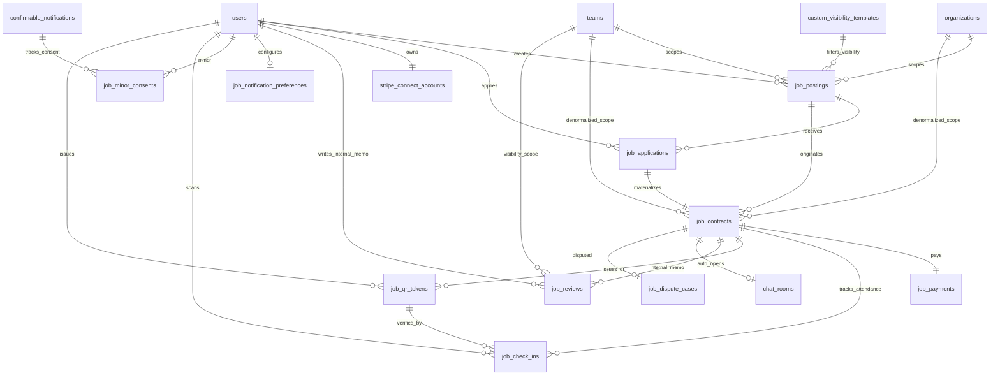
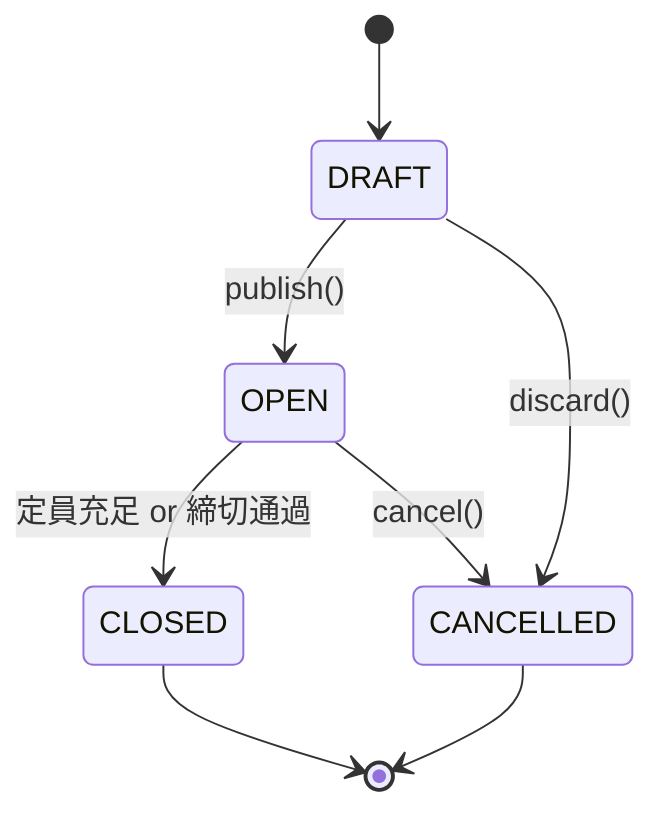
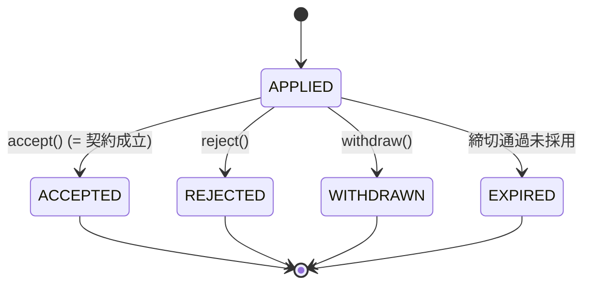
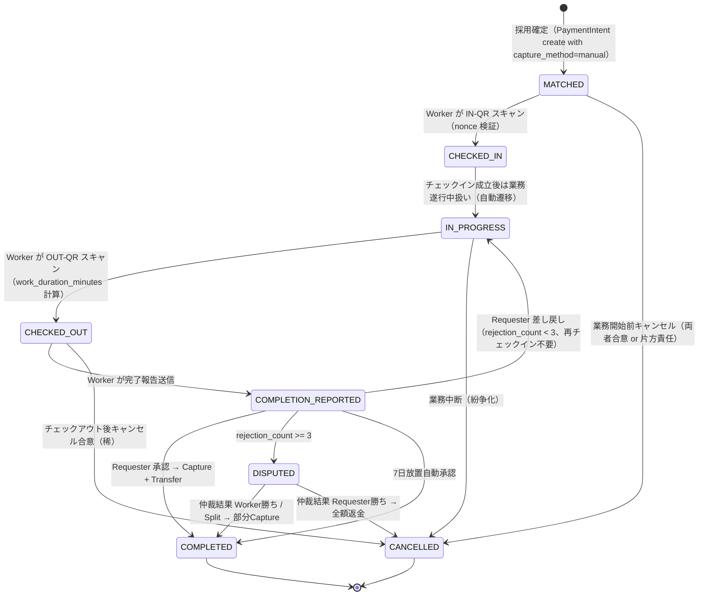
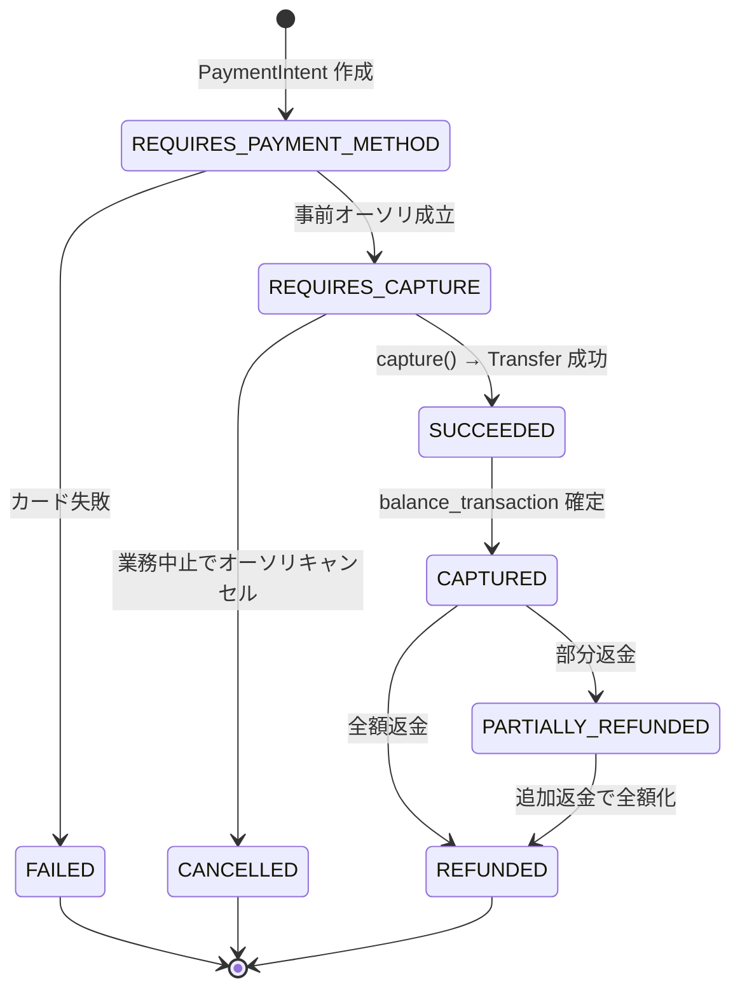

# F13.1: スキマバイト（短期業務マッチング）機能

> **ステータス**: 🟡 設計完了・実装待ち
> **実装フェーズ**: Phase 13
> **最終更新**: 2026-04-21（第二版 — QR チェックイン／アウト方式追加、評価公開を内部記録化、履歴ダッシュボード＆再応募時過去履歴参照追加）
> **モジュール種別**: オプション機能 #13.1（チーム／組織向け業務委託マッチング基盤）
> **関連ドキュメント**: F01.1 認証、F01.2 組織・チーム・メンバー・ロール、F01.7 カスタム公開範囲テンプレート、F03.11 募集型予約、F04.2 チャット、F04.3 プッシュ通知、F04.9 確認通知システム、F08.2 支払い管理・コンテンツアクセス制御、F08.6 予算・会計、F10.3 監査ログ、F11.1 PWA/オフライン（**QR チェックインのオフラインキュー統合**）、F11.3 UI i18n、F12.3 GDPR/個人情報（**位置情報保管ポリシー連携**）

---

## 1. 概要

### 1.1 目的・背景

スキマ時間を活かして短期業務を請け負いたいメンバー／サポーター（以下 **Worker**）と、単発の業務を発注したいチーム管理者・個人オーガナイザー（以下 **Requester**）を、Mannschaft プラットフォーム上でマッチングさせる業務委託マッチング機能。タイミー・シェアフル等の一般公開型スキマバイトアプリと異なり、**チーム所属メンバー＋サポーター限定** で募集が閉じることで、身元が担保された信頼関係の中で単発業務を依頼できる「身内のスキマバイト」を提供する。

### 1.2 ターゲットユーザー

| 分類 | 想定ペルソナ | 代表的ユースケース |
|------|-------------|-------------------|
| Requester | スポーツチーム管理者 | 大会当日の受付係・駐車場係・写真撮影を数時間だけ依頼 |
| Requester | 町内会・PTA の ADMIN | イベント当日の設営・撤収・配布物仕分け |
| Requester | 組織 ADMIN | 単発のデータ入力・翻訳・デザイン作業 |
| Worker | 学生メンバー | 空き時間に短時間の手伝いで報酬を得たい |
| Worker | 社会人サポーター | スキルを活かして副業的に作業を受けたい（翻訳・撮影等） |
| Worker | 高齢メンバー | 体を動かせる軽作業で収入を得たい |

### 1.3 ビジネスモデル

- **資金は Mannschaft で保有しない**。Stripe Connect（Express アカウント）＋ Destination Charges を使い、資金決済法上のライセンサーは Stripe。Mannschaft は業務委託契約の成立・マッチング・評価の場を提供するだけの仲介プラットフォーム。
- プラットフォーム手数料（Requester 側）＋ ワーカー手数料（Worker 側）の両面課金で収益を得る。
- 日本国内ユーザーを想定（通貨 JPY 固定、源泉徴収は原則なし）。

### 1.4 既存機能との関係

| 既存機能 | 関連内容 |
|---|---|
| F01.7 カスタム公開範囲テンプレート | 求人の `visibility` として `CUSTOM_TEMPLATE` を許可 |
| F03.11 募集型予約 | 「募集→申込→確定」フローを踏襲。ただし **決済**・**契約成立**・**評価** を追加した上位互換 |
| F04.2 チャット | Requester⇔Worker の業務中コミュニケーションは既存1対1チャットを再利用 |
| F04.3 プッシュ通知 | 応募通知・契約成立通知・完了承認通知・支払い通知は既存 `notifications` に委譲 |
| F04.9 確認通知システム | Requester が Worker に「確認して下さい」を送る用途で流用可能（任意） |
| F08.2 支払い管理 | Stripe Customer 管理（`stripe_customers`）は共通。Connect 側は新規テーブル |
| F10.3 監査ログ | 金銭移動は全件 `audit_logs` に記録 |

---

## 2. 機能要件

### 2.1 求人投稿（Requester）

- ADMIN / DEPUTY_ADMIN（`MANAGE_JOBS` 権限保持者） / 個人オーガナイザー（将来拡張）が求人を投稿
- 必須入力: タイトル・業務内容・業務日時（開始／終了）・場所（住所 or オンライン）・基本報酬額・募集人数・応募締切
- 任意入力: カテゴリ・必要スキル／資格・持ち物・服装・業務完了条件・交通費支給有無・公開範囲
- 下書き保存・公開予約（`publish_at` 未来日時を指定）
- 公開後の編集は限定的（報酬額・日時の変更は応募発生後は不可、それ以外はOK）
- 公開範囲（`visibility`）:
  - `TEAM_MEMBERS_ONLY` — 当該チームメンバーのみ
  - `TEAM_MEMBERS_AND_SUPPORTERS` — メンバー＋サポーター
  - `ORGANIZATION_SCOPE` — 組織配下の全メンバー
  - `CUSTOM_TEMPLATE` — F01.7 で定義したテンプレート
  - **注: `PUBLIC`（不特定多数）は労働者派遣法・税務コンプライアンスの観点から禁止**

### 2.2 応募・マッチング（Worker）

- Worker（MEMBER / SUPPORTER）が求人一覧から検索・応募
- 応募時に自己 PR（任意、500文字まで）を添付
- 応募締切前であれば応募キャンセル可能
- Requester が応募者一覧から **採用** を決定 → 契約成立（`job_contracts.status = MATCHED`）
- 定員充足すると自動的にクローズ（以後の応募は不可）
- **同時応募時の排他制御**: 採用確定時に DB トランザクション内で `SELECT ... FOR UPDATE` による行ロック。加えて `PostgreSQL advisory lock` / `MySQL GET_LOCK` で job_posting 単位の排他を二重化
- Worker がまだ Stripe Connect Express オンボーディングを完了していない場合、**採用確定前に Worker 側にオンボーディング完了を促す**。オンボーディング未完了で一定期間（72時間）経過した場合は採用を自動キャンセル

### 2.3 業務中コミュニケーション

- 契約成立（`MATCHED`）時点で Requester ⇔ Worker 間に自動で 1 対 1 チャットルームを開設（F04.2 既存機能）
- チャット内で待ち合わせ場所・時間変更・緊急連絡を交換
- 業務完了承認後 90 日間はチャット閲覧可能、以降は論理削除し、ログは監査ログのみ残す
- **個人連絡先（電話番号・LINE等）の直接交換はガイドラインで禁止**（F04.5 モデレーション：自動検出 + 報告）

### 2.3.1 QR コードチェックイン／チェックアウト

- **業務開始時（チェックイン）**: Requester 側デバイスが **チェックイン用 QR コード** を画面表示 → Worker が自分のスマホで読み取って `CHECKED_IN` に遷移
- **業務終了時（チェックアウト）**: Requester 側デバイスが **チェックアウト用 QR コード** を画面表示 → Worker が読み取って `CHECKED_OUT` に遷移
- **QR トークンの設計（リプレイ攻撃対策）**:
  - ペイロード: `contract_id` / `worker_user_id`（採用確定 Worker 以外が読んでも検証失敗）/ `type`（`IN`/`OUT`）/ `nonce`（UUIDv4）/ `issued_at` / `expires_at`
  - 署名: HMAC-SHA256（鍵は環境変数 `JOB_QR_SIGNING_SECRET`、ローテーション対応 `kid` 付き JWT 互換フォーマット）
  - **TTL 60 秒**（デフォルト、設定上限 5 分）。`expires_at` 経過後は検証失敗
  - `nonce` は `job_qr_tokens` に INSERT、一度使った `nonce` は `used_at` を記録し**同一トークンの再スキャン不可**（DB UNIQUE 制約）
  - Requester 画面では 30 秒ごとに自動再発行（QR の見た目が変わる）→ カメラ越しに撮影された古いスクリーンショットで不正チェックインを防止
- **Geolocation（補助記録）**:
  - Worker スキャン時にブラウザ Geolocation API で位置情報を取得（HTTPS 必須、ユーザー同意必須）
  - 業務場所（`job_postings.location_latitude/longitude`）から **500 m 以上乖離** した場合は `job_check_ins.geo_anomaly=TRUE` を立て、Requester にアラート通知。自動拒否はしない（GPS 精度問題の誤検出回避）
  - 位置情報は暗号化保存（アプリ層で AES-256-GCM、鍵は KMS 相当に保管）。参照可能なのは Requester 本人・同一チーム ADMIN（`MANAGE_JOBS`）・SYSTEM_ADMIN のみ
  - 保管期間: 契約完了後 **90 日**で自動削除（`job_check_ins.geolocation_*` カラムを NULL 更新、`geolocation_deleted_at` 記録）
- **オフライン時のフォールバック（F11.1 PWA 連携）**:
  - 電波なし環境で Worker がスキャンした場合、QR トークン生データ + スキャン時刻 + Geolocation を IndexedDB `offlineQueue` に一時保存
  - オンライン復帰で `POST /api/v1/jobs/check-ins` にリプレイ送信。Server 側は `expires_at` 超過していても **スキャン時刻** が有効範囲内であれば受け付ける（`offline_submitted=TRUE` を記録）
  - 手動入力フォールバック: QR 読取に失敗した場合、Requester が 6 桁の短命コード（QR と同じトークンから派生、TTL 60秒）を口頭で Worker に伝え、Worker が画面入力しても同等に検証可能
- **業務時間の自動計算**: `work_duration_minutes = CHECKED_OUT.scanned_at − CHECKED_IN.scanned_at`（将来、時給制プラン導入時に報酬自動算出の根拠として利用）
- **不正防止・アラート**:
  - `CHECKED_IN` から契約上の業務終了時刻（`work_end_at`）+ 2 時間経ってもチェックアウトがない場合、Requester・Worker 双方にアラート通知（`JOB_CHECKOUT_MISSING`）
  - 同一 Worker が同時刻に別契約でチェックインしている場合は拒否（掛け持ち禁止、400 応答）

### 2.4 業務完了承認・評価

- Worker がチェックアウト（`CHECKED_OUT`）後に「完了報告」を送信（`CHECKED_OUT` → `COMPLETION_REPORTED` への遷移リクエスト）
- Requester が完了報告を受けて **承認（ACCEPT）** または **差し戻し（REJECT）**
- 承認で `COMPLETED` に確定し、決済が実行される（Capture / Transfer）
- 差し戻しは理由必須、3回差し戻しまで。それ以降は **紛争モード** に移行（§11.5）
- Requester が 7 日間放置した場合、自動承認（`auto_accepted_at` を記録し `COMPLETED` 確定）
- **評価は内部記録（Public 化なし）**:
  - 評価 `job_reviews` は「内部メモ」扱いとし、**他チームや外部ユーザーに公開しない**
  - 閲覧可能なのは: (1) **同一チームの ADMIN・DEPUTY_ADMIN（`MANAGE_JOBS` 権限保持者）**、(2) **評価を受けた Worker 本人**（ただし自チーム ADMIN のコメントが自分宛てに書かれたものに限る）
  - 星評価の平均値表示・公開レーティング・プロフィール表示は**実装しない**（信頼はチーム内コミュニティが既に担保しているため）
  - 目的: チーム運営の質を上げるための内部記録（次回起用判断・改善フィードバック）

### 2.5 Stripe Connect オンボーディング

- Worker が初回採用確定時に Express アカウント作成（account_links hosted onboarding）
- 本人確認（KYC）・銀行口座登録は Stripe 側で完結（Mannschaft は最低限のID `acct_xxx` のみ保持）
- オンボーディング完了 Webhook（`account.updated` → `charges_enabled=true` ＆ `payouts_enabled=true`）受信でアプリ側ステータスを `READY` に更新
- オンボーディング未完了 Worker は応募は可能だが、採用確定のためには完了が必要

### 2.6 決済・精算フロー

- Requester が採用確定と同時に PaymentIntent を作成（`capture_method=manual` で事前オーソリ）
- 業務完了承認で capture 実行 → 同じ PaymentIntent で `transfer_data.destination` 経由で Worker の Express へ送金
- `application_fee_amount` には Requester 手数料 + Worker 手数料相当分（ただし Stripe 決済手数料を除く）を設定
- Worker の実際の受取額は PaymentIntent の capture 後に Stripe が自動で Worker アカウントへ入金
- Payout スケジュール: Stripe 日本のデフォルト（週次）。Instant Payouts を将来オプション提供

### 2.7 通知システム連携（F04.3）

| イベント | 宛先 | 種別 | 強制配信 |
|---------|------|-----|---------|
| 新規求人公開 | 公開範囲内のWorker候補 | JOB_POSTED | opt-in |
| 応募あり | Requester | JOB_APPLIED | opt-in |
| 採用確定 | Worker | JOB_MATCHED | 強制（業務契約成立のため） |
| 業務開始リマインド | 双方 | JOB_REMINDER | opt-in |
| チェックイン成立 | Requester | JOB_CHECKED_IN | opt-in |
| チェックアウト成立 | Requester | JOB_CHECKED_OUT | opt-in |
| チェックアウト未実施警告 | 双方 | JOB_CHECKOUT_MISSING | 強制（業務時間未確定のため） |
| Geolocation 乖離警告 | Requester | JOB_GEO_ANOMALY | 強制（不正検知のため） |
| 完了報告受信 | Requester | JOB_COMPLETION_REPORTED | 強制 |
| 承認／差し戻し | Worker | JOB_APPROVED / JOB_REJECTED | 強制 |
| 支払い完了 | Worker | JOB_PAID | 強制 |
| 内部評価メモ受領（Worker側は自分宛てのみ） | Worker／同一チーム ADMIN | JOB_REVIEW_LOGGED | opt-in |
| Stripe 決済失敗 | Requester | JOB_PAYMENT_FAILED | 強制 |
| Payout 失敗 | Worker | JOB_PAYOUT_FAILED | 強制 |

### 2.8 履歴管理・再応募時の過去履歴参照

#### 2.8.1 チーム視点の履歴ダッシュボード

- 画面パス: **`/teams/{teamId}/jobs/history`**
- 表示項目:
  - 募集日時 / 募集タイトル / 依頼内容（概要）/ 受注 Worker（氏名・アイコン）/ 業務時間（チェックイン〜アウト実測）/ 支払総額（税込）/ ステータス / 内部評価メモ（ある場合）
- フィルタ: 期間（From/To）/ Worker（ID 選択）/ ステータス（MATCHED / COMPLETED / CANCELLED / DISPUTED 等）/ 金額レンジ（min/max JPY）/ カテゴリ
- ソート: 募集日時 DESC（デフォルト）/ 金額 DESC / 業務時間 DESC
- **CSV エクスポート**: フィルタ条件下の全件を CSV（UTF-8 BOM 付き、Excel 互換）でダウンロード
- ページング: 50 件/ページ、Cursor ベース
- アクセス権限: **当該チーム ADMIN / DEPUTY_ADMIN（`MANAGE_JOBS`）** のみ

#### 2.8.2 再応募時の過去履歴パネル（Requester 側）

- 募集詳細 / 応募者一覧画面のサイドに「**このWorkerの過去依頼履歴**」パネルを表示
- 表示条件: 応募 Worker が同一チーム（または同一組織配下のチーム）で過去に契約履歴がある場合のみ
- 表示内容:
  - 過去契約回数（completed 件数）
  - 総業務時間（時間単位、小数 1 桁）
  - 総支払額（税込、JPY）
  - 前回業務日（`completed_at` の最新）
  - 前回内部評価メモ（直近の `job_reviews.comment`、100 字まで要約）
  - 直近 3 件の業務タイトル（クリックで契約詳細へ）
- 権限: **当該チーム ADMIN / DEPUTY_ADMIN（`MANAGE_JOBS`）+ 募集投稿者本人**（DEPUTY_ADMIN の場合は `MANAGE_JOBS` 必須）

#### 2.8.3 Worker マイページ履歴（プライベート、自分専用）

- 画面パス: **`/me/jobs/history`**
- Worker 本人のみアクセス可。**他人には表示しない**（チーム ADMIN もこの画面は見ない）
- 表示項目: 募集タイトル / チーム名 / 業務日 / 業務時間 / 受取額 / ステータス
- フィルタ: 期間 / チーム / ステータス
- **目的**: Worker が過去の経験を振り返り、次の応募に活かす

#### 2.8.4 チーム切替時の履歴分離（マルチチーム Worker）

- Worker が複数チームに所属している場合、各チームは**自チーム経由の契約履歴のみ**参照可能
- 別チームでの Worker 評価・業務履歴は **絶対に漏出させない**（§2.4 の非公開方針と整合）
- 組織スコープの履歴は、「同一組織配下の ADMIN」のみが組織全体の履歴を見られる（`/organizations/{orgId}/jobs/history`、Phase 13.2 拡張で検討）

#### 2.8.5 集計ビュー

- 集計用ビュー `v_worker_team_history`（初版はアプリ側 SELECT 集計で可、性能問題が出たらマテリアライズド化を検討）
- カラム案: `worker_user_id`, `team_id`, `total_contracts`, `total_work_minutes`, `total_paid_jpy`, `last_contract_at`, `last_review_comment_preview`

---

## 3. 手数料設計

### 3.1 手数料率（マスター決定事項）

- **Requester（募集主）**: 業務報酬の **10%** ＋ **100円** の固定額 をプラットフォーム手数料として徴収
- **Worker（受注者）**: 業務報酬の **2%** ＋ **100円** の固定額 をワーカー手数料として徴収
- **通貨**: JPY 固定
- **端数処理**: 割合計算の結果は `ROUND_HALF_UP`（四捨五入）で整数円に丸め、先に固定額 100円 を足してから合算。常に円単位の整数で扱う（円以下の端数を発生させない）

### 3.2 計算式（`JobFeeCalculator` 集約）

```
base_reward                    := 業務報酬（Workerの基本受取、Requesterが指定する入力値）
requester_fee_percent          := base_reward × 10% （ROUND_HALF_UP → 整数円）
requester_fee                  := requester_fee_percent + 100
requester_fee_tax              := (requester_fee) × 10% （消費税）
requester_total_payment        := base_reward + requester_fee + requester_fee_tax

worker_fee_percent             := base_reward × 2% （ROUND_HALF_UP → 整数円）
worker_fee                     := worker_fee_percent + 100
worker_receipt                 := base_reward - worker_fee

application_fee_amount         := requester_fee + requester_fee_tax + worker_fee  # Stripe PaymentIntent に渡す値（税込粗利）
stripe_processing_fee          := (requester_total_payment) × 3.6% （ROUND_HALF_UP → 整数円）
platform_gross_margin_excl_tax := requester_fee + worker_fee      # マスター提示表の「粗利」はこちら（税別合算）
platform_consumption_tax_hold  := requester_fee_tax               # 預かり消費税（納税義務）
platform_net_margin            := platform_gross_margin_excl_tax - stripe_processing_fee
                                 # ※ Mannschaft が課税事業者の場合、預かり消費税は別途国税に納付。
                                 #    仕入税額控除により Stripe 側支払手数料分の消費税は差し引ける。
                                 #    免税事業者期間中は `fee.tax-enabled=false` で消費税徴収せず、預かりも発生しない。
```

### 3.3 手数料計算例（3パターン必須）

| 業務報酬（Worker基本受取） | Requester支払総額（税抜） | 税込総額 | 内訳（Requester側） | Worker受取額 | Mannschaft粗利（税別・Stripe差引前） |
|---|---|---|---|---|---|
| **3,000円** | **3,400円** | **3,440円**（+消費税40円） | 3000 + (10%×3000=300) + 100 = **400円の手数料** | 3000 - (2%×3000=60) - 100 = **2,840円** | (300+100) + (60+100) = **560円** |
| **5,000円** | **5,600円** | **5,660円**（+消費税60円） | 5000 + 500 + 100 = **600円の手数料** | 5000 - 100 - 100 = **4,800円** | 600 + 200 = **800円** |
| **10,000円** | **11,100円** | **11,210円**（+消費税110円） | 10000 + 1000 + 100 = **1,100円の手数料** | 10000 - 200 - 100 = **9,700円** | 1100 + 300 = **1,400円** |

> **注**:
> - 「Requester支払総額（税抜）」= 業務報酬 + Requester 手数料（%+固定）
> - 「税込総額」= 税抜総額 + 消費税（Requester 手数料に対する 10%）。これが Requester が実際にカード決済で支払う額
> - 「Mannschaft 粗利」はマスター決定に従い税別（消費税を除外した純粋手数料合算）。Stripe 決済手数料 3.6% は税込総額に対して差し引かれ、Mannschaft の純利益（`platform_net_margin`）となる
> - 粗利 560/800/1400 円から Stripe 決済手数料 3.6% を差し引いた Mannschaft 純利益（`platform_net_margin`）は:
>   - base=3,000 → 3,440×3.6% = 124円 → 純利益 560 - 124 = **436円**
>   - base=5,000 → 5,660×3.6% = 204円 → 純利益 800 - 204 = **596円**
>   - base=10,000 → 11,210×3.6% = 404円 → 純利益 1,400 - 404 = **996円**
> - 預かり消費税（40/60/110円）は別途国税に納付義務あり。免税事業者期間は `fee.tax-enabled=false` で徴収せず、この行は 0 になる

### 3.4 消費税の取り扱い

- Mannschaft（プラットフォーム運営法人）が課税事業者となる時点以降、**Requester から徴収する手数料部分（10%+100円）に消費税 10% を加算して請求** する。
- Worker への業務報酬は Requester と Worker の間の業務委託契約の対価であり、Mannschaft は媒介にすぎない。Mannschaft が Worker に支払う扱いではなく、消費税の納付義務は Requester（発注者）と Worker（受注者）のそれぞれの課税区分に従う。
- **インボイス対応（2026年時点）**: Mannschaft 発行の**手数料請求書**はインボイス制度の適格請求書として発行可能にする（登録番号を UI とメール PDF に明記）。Worker への業務報酬部分は当事者間の取引のため、Worker 本人のインボイス登録状況に応じて Requester が適格かどうかを判定する。
- **年間課税売上高 1,000 万円未満の開業初期**: 免税事業者として運営する場合は手数料に消費税を加算しない設定フラグ（`application.properties: mannschaft.fee.tax-enabled=false`）を用意する。

### 3.5 Stripe 決済手数料（3.6%）の帰属

- Stripe 標準レート：JCB/AMEX/国際ブランドは 3.6%、Visa/MasterCard は 3.6%（2026年時点、Stripe Japan 公式レート）
- 決済手数料は **Mannschaft の粗利から引かれる**（Requester・Worker に転嫁しない）
- `application_fee_amount` の計算式（**重要・根治版**）:
  ```
  application_fee_amount = requester_total_payment_incl_tax - worker_receipt
                         = (base_reward + requester_fee + requester_fee_tax) - (base_reward - worker_fee)
                         = requester_fee + requester_fee_tax + worker_fee
  ```
  - **Stripe 決済手数料は application_fee_amount には含めない**。Stripe は platform の Stripe 残高（balance）から別途自動控除するため、application_fee_amount を減じると Worker 受取額が減って契約不整合になる
  - この値を PaymentIntent 作成時に指定すると、Stripe は税込総額から application_fee_amount を差し引いた金額を Worker の Connect アカウントへ transfer する
  - 例（base=5,000）: `application_fee_amount = 600 + 60 + 200 = 860 円`、税込総額 5,660 円から 860 円を platform、4,800 円を Worker に分配
  - Stripe 決済手数料（例 204 円）は platform 側の Stripe balance から差し引かれ、Mannschaft の純利益は 860 - 204 = 656 円となる（内訳: 税別粗利 800 円 + 預かり消費税 60 円 − Stripe 手数料 204 円）
  - Stripe 実手数料の確定値は `charge.balance_transaction` 確定後に `job_payments.stripe_fee_jpy` / `platform_net_margin_jpy` に記録する
- `transfer_data.destination` に Worker の `acct_xxx` を指定し、残額を Worker アカウントへ自動送金

### 3.6 最低報酬額の下限

- **最低 base_reward = 500 円** を下限とする（アプリ側バリデーション）
- 理由: base_reward = 500 の場合、Worker 手数料は 2%×500 + 100 = 110 円、Worker 受取額 390 円と妥当
- 500 円未満だと Worker 手数料が報酬の 20% を超え景表法・独禁法・下請法の観点で不健全
- 上限は **1,000,000 円** とし、それ以上は別途 ADMIN 承認フローを通す（将来拡張）

### 3.7 手数料プレビュー（UI で常時表示必須）

- 求人作成時：Requester 側に「業務報酬 X 円 → あなたの支払総額 Y 円（うち手数料 Z 円、消費税 W 円）」を明示
- 応募時：Worker 側に「報酬 X 円 → あなたの受取額 Y 円（手数料 Z 円）」を明示
- Backend API `POST /api/v1/jobs/fee-preview` が一元計算（フロント計算は禁止）

---

## 4. アクセス権限・募集範囲

### 4.1 対象ロール

| ロール | 操作可能な範囲 |
|--------|---------------|
| SYSTEM_ADMIN | 全求人・契約・決済の参照。紛争仲裁。手数料率マスター管理 |
| ADMIN | 所属チーム／組織内の求人 CRUD。応募者管理・採用確定・完了承認。Worker としても動作可 |
| DEPUTY_ADMIN | `MANAGE_JOBS` 権限を持つ場合: ADMIN と同等（自分が作成した求人 + 委任範囲）|
| MEMBER | Worker として求人閲覧・応募。自分のチーム管理者でない限り Requester としての投稿は不可（ADMIN が DEPUTY 権限付与すれば可） |
| SUPPORTER | Worker として求人閲覧・応募（求人の `visibility` が `TEAM_MEMBERS_AND_SUPPORTERS` 以上で許可された場合のみ） |
| GUEST | 対象外（認証必須） |

### 4.2 DEPUTY_ADMIN の細粒度権限

`deputy_admin_permissions` テーブルに `MANAGE_JOBS` を追加（既存 F01.2 の権限列挙型拡張）。

- `MANAGE_JOBS`: 求人 CRUD・応募者管理・採用確定・完了承認
- ※決済の返金・手数料率変更は ADMIN（場合により SYSTEM_ADMIN）のみ

### 4.3 対象レベル

- [x] 組織 (Organization) — 組織横断求人（組織 ADMIN が発注、配下チーム全メンバー対象）
- [x] チーム (Team) — チーム内求人（チーム ADMIN が発注、チームメンバー対象）
- [ ] 個人 (Personal) — **Phase 13.2 で拡張検討**（当面は法的整理の観点から除外）

### 4.4 未成年者の取り扱い

- **Requester**: 18 歳以上のロール（ADMIN / DEPUTY_ADMIN）のみ投稿可能。18 歳未満が ADMIN の場合は UI 側で投稿ボタンを無効化
- **Worker**: 18 歳未満は原則参加不可。ただし下記条件を満たせば 15 歳以上から参加可能:
  - 親権者同意書の電子提出（F04.9 確認通知システムで取得）
  - 危険作業カテゴリ（`DANGEROUS` フラグあり）は不可
  - 労基法の労働時間制限に抵触しないよう UI で時間帯制限を自動適用（15-17歳は 20:00～5:00 不可）
- 15 歳未満は参加不可（児童労働規制）

---

## 5. データモデル

### 5.1 テーブル一覧

| テーブル名 | 役割 | 論理削除 |
|-----------|------|---------|
| `job_postings` | 求人投稿 | あり（`deleted_at`） |
| `job_applications` | 応募 | なし（status で管理） |
| `job_contracts` | 契約（採用確定以降のライフサイクル） | なし |
| `job_check_ins` | チェックイン／アウト記録（QR スキャン） | なし |
| `job_qr_tokens` | QR コード発行トークン（短命・使い捨て） | なし（TTL で物理削除バッチ） |
| `job_payments` | 決済記録（PaymentIntent 1 対 1） | なし |
| `job_reviews` | 内部評価メモ（同一チーム ADMIN・本人のみ閲覧） | なし |
| `stripe_connect_accounts` | Worker の Stripe Express アカウント管理 | なし |
| `job_notification_preferences` | ユーザーごとの JOB_* 通知 opt-in 設定 | なし |
| `job_minor_consents` | 未成年 Worker の親権者同意記録 | なし |
| `job_dispute_cases` | 紛争ケース記録 | なし |
| （ビュー）`v_worker_team_history` | Worker×Team 履歴集計（再応募時パネル／履歴ダッシュボード用） | — |

### 5.2 テーブル定義

#### `job_postings`

| カラム名 | 型 | NULL | デフォルト | 説明 |
|---------|---|------|-----------|------|
| `id` | BIGINT UNSIGNED | NO | AUTO_INCREMENT | PK |
| `team_id` | BIGINT UNSIGNED | YES | NULL | FK → teams（チーム求人。XOR） |
| `organization_id` | BIGINT UNSIGNED | YES | NULL | FK → organizations（組織求人。XOR） |
| `created_by` | BIGINT UNSIGNED | NO | — | FK → users（Requester。ON DELETE RESTRICT） |
| `title` | VARCHAR(200) | NO | — | タイトル |
| `description` | TEXT | NO | — | 業務内容（Markdown） |
| `category` | VARCHAR(50) | NO | — | カテゴリ（RECEPTION / PHOTO / TRANSLATION / SETUP など） |
| `work_start_at` | DATETIME | NO | — | 業務開始日時（UTC保存） |
| `work_end_at` | DATETIME | NO | — | 業務終了日時（UTC保存） |
| `location_type` | ENUM('ONSITE','ONLINE','HYBRID') | NO | 'ONSITE' | 場所種別 |
| `location_address` | VARCHAR(500) | YES | NULL | 住所（ONSITE/HYBRID の場合） |
| `location_latitude` | DECIMAL(9,6) | YES | NULL | 緯度 |
| `location_longitude` | DECIMAL(9,6) | YES | NULL | 経度 |
| `base_reward_jpy` | INT UNSIGNED | NO | — | 業務報酬（円、500〜1,000,000） |
| `capacity` | SMALLINT UNSIGNED | NO | 1 | 募集人数（1〜50） |
| `application_deadline_at` | DATETIME | NO | — | 応募締切 |
| `visibility` | ENUM('TEAM_MEMBERS_ONLY','TEAM_MEMBERS_AND_SUPPORTERS','ORGANIZATION_SCOPE','CUSTOM_TEMPLATE') | NO | 'TEAM_MEMBERS_ONLY' | 公開範囲 |
| `visibility_template_id` | BIGINT UNSIGNED | YES | NULL | F01.7 の `custom_visibility_templates.id`（`visibility = CUSTOM_TEMPLATE` の場合必須） |
| `required_skills` | JSON | YES | NULL | 必要スキル配列 |
| `equipment_note` | VARCHAR(500) | YES | NULL | 持ち物 |
| `dress_code` | VARCHAR(200) | YES | NULL | 服装 |
| `completion_criteria` | TEXT | YES | NULL | 業務完了条件 |
| `has_transportation_allowance` | BOOLEAN | NO | FALSE | 交通費支給有無 |
| `is_dangerous` | BOOLEAN | NO | FALSE | 危険作業フラグ（未成年不可） |
| `status` | ENUM('DRAFT','OPEN','CLOSED','CANCELLED') | NO | 'DRAFT' | 求人ステータス |
| `publish_at` | DATETIME | YES | NULL | 公開予約日時（NULL = 即時公開） |
| `published_at` | DATETIME | YES | NULL | 実公開日時 |
| `closed_at` | DATETIME | YES | NULL | 募集終了日時（定員充足または締切通過） |
| `cancelled_at` | DATETIME | YES | NULL | キャンセル日時 |
| `cancellation_reason` | VARCHAR(500) | YES | NULL | キャンセル理由 |
| `version` | BIGINT UNSIGNED | NO | 0 | 楽観的ロック |
| `created_at` | DATETIME | NO | CURRENT_TIMESTAMP | |
| `updated_at` | DATETIME | NO | CURRENT_TIMESTAMP ON UPDATE | |
| `deleted_at` | DATETIME | YES | NULL | 論理削除 |

**インデックス**
```sql
INDEX idx_jp_team_status_published (team_id, status, published_at DESC)
INDEX idx_jp_org_status_published (organization_id, status, published_at DESC)
INDEX idx_jp_created_by (created_by)
INDEX idx_jp_work_start (work_start_at)
INDEX idx_jp_application_deadline (application_deadline_at)
INDEX idx_jp_visibility (visibility)
```

**制約**
```sql
CONSTRAINT chk_jp_scope
  CHECK ((team_id IS NOT NULL AND organization_id IS NULL)
      OR (team_id IS NULL AND organization_id IS NOT NULL))
CONSTRAINT chk_jp_reward_range
  CHECK (base_reward_jpy >= 500 AND base_reward_jpy <= 1000000)
CONSTRAINT chk_jp_work_time
  CHECK (work_end_at > work_start_at)
CONSTRAINT chk_jp_deadline
  CHECK (application_deadline_at < work_start_at)
CONSTRAINT chk_jp_custom_template
  CHECK (visibility <> 'CUSTOM_TEMPLATE' OR visibility_template_id IS NOT NULL)
```

#### `job_applications`

| カラム名 | 型 | NULL | デフォルト | 説明 |
|---------|---|------|-----------|------|
| `id` | BIGINT UNSIGNED | NO | AUTO_INCREMENT | PK |
| `job_posting_id` | BIGINT UNSIGNED | NO | — | FK → job_postings |
| `applicant_user_id` | BIGINT UNSIGNED | NO | — | FK → users |
| `self_pr` | VARCHAR(500) | YES | NULL | 自己PR |
| `status` | ENUM('APPLIED','WITHDRAWN','ACCEPTED','REJECTED','EXPIRED') | NO | 'APPLIED' | 状態 |
| `applied_at` | DATETIME | NO | CURRENT_TIMESTAMP | 応募日時 |
| `status_changed_at` | DATETIME | YES | NULL | 状態変更日時 |
| `rejection_reason` | VARCHAR(300) | YES | NULL | 不採用理由 |
| `created_at` | DATETIME | NO | CURRENT_TIMESTAMP | |
| `updated_at` | DATETIME | NO | CURRENT_TIMESTAMP ON UPDATE | |

**インデックス**
```sql
UNIQUE KEY uq_ja_job_applicant (job_posting_id, applicant_user_id)
INDEX idx_ja_status (status)
INDEX idx_ja_applicant (applicant_user_id, status)
```

#### `job_contracts`

| カラム名 | 型 | NULL | デフォルト | 説明 |
|---------|---|------|-----------|------|
| `id` | BIGINT UNSIGNED | NO | AUTO_INCREMENT | PK |
| `job_posting_id` | BIGINT UNSIGNED | NO | — | FK → job_postings |
| `job_application_id` | BIGINT UNSIGNED | NO | — | FK → job_applications |
| `team_id` | BIGINT UNSIGNED | YES | NULL | FK → teams（履歴ダッシュボード高速化・`job_postings.team_id` をデノーマライズ）|
| `organization_id` | BIGINT UNSIGNED | YES | NULL | FK → organizations（同上）|
| `requester_user_id` | BIGINT UNSIGNED | NO | — | FK → users（実質的な Requester） |
| `worker_user_id` | BIGINT UNSIGNED | NO | — | FK → users |
| `status` | ENUM('MATCHED','CHECKED_IN','IN_PROGRESS','CHECKED_OUT','COMPLETION_REPORTED','COMPLETED','CANCELLED','DISPUTED') | NO | 'MATCHED' | ライフサイクル |
| `base_reward_jpy` | INT UNSIGNED | NO | — | 契約時点の報酬（job_postings のスナップショット） |
| `requester_fee_jpy` | INT UNSIGNED | NO | — | Requester 手数料（スナップショット） |
| `requester_fee_tax_jpy` | INT UNSIGNED | NO | — | Requester 手数料消費税 |
| `worker_fee_jpy` | INT UNSIGNED | NO | — | Worker 手数料（スナップショット） |
| `worker_receipt_jpy` | INT UNSIGNED | NO | — | Worker 受取予定額 |
| `requester_total_payment_jpy` | INT UNSIGNED | NO | — | Requester 支払総額（税込） |
| `chat_room_id` | BIGINT UNSIGNED | YES | NULL | FK → chat_rooms（F04.2、自動作成） |
| `matched_at` | DATETIME | NO | CURRENT_TIMESTAMP | 採用確定日時 |
| `checked_in_at` | DATETIME | YES | NULL | Worker チェックイン日時（QR スキャン確定時刻）|
| `checked_out_at` | DATETIME | YES | NULL | Worker チェックアウト日時（QR スキャン確定時刻）|
| `work_duration_minutes` | INT UNSIGNED | YES | NULL | 業務時間（分）= checked_out_at − checked_in_at、CHECKED_OUT 遷移時に計算|
| `work_started_at` | DATETIME | YES | NULL | 業務開始（互換用、通常は `checked_in_at` と同時刻）|
| `completion_reported_at` | DATETIME | YES | NULL | 完了報告日時 |
| `reviewed_by_requester_at` | DATETIME | YES | NULL | 承認/差し戻し日時 |
| `completed_at` | DATETIME | YES | NULL | 確定完了日時 |
| `auto_accepted_at` | DATETIME | YES | NULL | 自動承認日時（7日放置） |
| `cancelled_at` | DATETIME | YES | NULL | キャンセル日時 |
| `cancelled_by_user_id` | BIGINT UNSIGNED | YES | NULL | FK → users |
| `cancellation_reason` | VARCHAR(500) | YES | NULL | キャンセル理由 |
| `rejection_count` | TINYINT UNSIGNED | NO | 0 | 差し戻し回数（3回で紛争モード） |
| `version` | BIGINT UNSIGNED | NO | 0 | 楽観的ロック |
| `created_at` | DATETIME | NO | CURRENT_TIMESTAMP | |
| `updated_at` | DATETIME | NO | CURRENT_TIMESTAMP ON UPDATE | |

**インデックス**
```sql
UNIQUE KEY uq_jc_application (job_application_id)
INDEX idx_jc_posting (job_posting_id)
INDEX idx_jc_requester (requester_user_id, status)
INDEX idx_jc_worker (worker_user_id, status)
INDEX idx_jc_status (status)
INDEX idx_jc_completion_reported (completion_reported_at)  -- 7日自動承認バッチ用
INDEX idx_jc_team_completed (team_id, status, completed_at DESC)     -- 履歴ダッシュボード用
INDEX idx_jc_org_completed (organization_id, status, completed_at DESC)
INDEX idx_jc_team_worker (team_id, worker_user_id, completed_at DESC) -- 再応募時の過去履歴参照
INDEX idx_jc_worker_completed (worker_user_id, status, completed_at DESC) -- Worker マイページ履歴
```

#### `job_check_ins`

| カラム名 | 型 | NULL | デフォルト | 説明 |
|---------|---|------|-----------|------|
| `id` | BIGINT UNSIGNED | NO | AUTO_INCREMENT | PK |
| `job_contract_id` | BIGINT UNSIGNED | NO | — | FK → job_contracts |
| `worker_user_id` | BIGINT UNSIGNED | NO | — | FK → users（冪等性・監査用にデノーマライズ保持） |
| `type` | ENUM('IN','OUT') | NO | — | チェックインかアウトか |
| `qr_token_id` | BIGINT UNSIGNED | NO | — | FK → job_qr_tokens（検証済みトークン）|
| `scanned_at` | DATETIME(3) | NO | — | Worker 端末でスキャン成立時刻（ミリ秒精度、UTC）|
| `server_received_at` | DATETIME(3) | NO | CURRENT_TIMESTAMP(3) | サーバー受信時刻（オフライン時はスキャン時刻と乖離する）|
| `offline_submitted` | BOOLEAN | NO | FALSE | オフラインキュー経由で送信されたか |
| `geolocation_latitude` | DECIMAL(9,6) | YES | NULL | 端末緯度（AES-256-GCM 暗号化、暗号文を BINARY 列でもよい）|
| `geolocation_longitude` | DECIMAL(9,6) | YES | NULL | 端末経度（暗号化）|
| `geolocation_accuracy_m` | FLOAT | YES | NULL | 精度（メートル）|
| `geo_anomaly` | BOOLEAN | NO | FALSE | 業務場所から 500 m 以上乖離 |
| `geolocation_deleted_at` | DATETIME | YES | NULL | 位置情報削除日時（完了 90 日後バッチ）|
| `client_user_agent` | VARCHAR(500) | YES | NULL | スキャン端末 User-Agent（監査用）|
| `manual_code_fallback` | BOOLEAN | NO | FALSE | 手動コード入力で成立したか |
| `created_at` | DATETIME | NO | CURRENT_TIMESTAMP | |

**インデックス**
```sql
UNIQUE KEY uq_jci_contract_type (job_contract_id, type)  -- IN/OUT は各 1 件まで
INDEX idx_jci_worker_scanned (worker_user_id, scanned_at DESC)
INDEX idx_jci_qr_token (qr_token_id)
INDEX idx_jci_geo_anomaly (geo_anomaly)  -- アラート対象抽出用
```

**制約**
```sql
CONSTRAINT chk_jci_out_after_in
  -- OUT 登録時点で同契約の IN が存在することをアプリ層で検証（DB 制約では難しいため Service 層で強制）
```

#### `job_qr_tokens`

| カラム名 | 型 | NULL | デフォルト | 説明 |
|---------|---|------|-----------|------|
| `id` | BIGINT UNSIGNED | NO | AUTO_INCREMENT | PK |
| `job_contract_id` | BIGINT UNSIGNED | NO | — | FK → job_contracts |
| `type` | ENUM('IN','OUT') | NO | — | チェックイン／アウト用 |
| `nonce` | CHAR(36) | NO | — | UUIDv4（`uq_jqt_nonce` で UNIQUE）|
| `kid` | VARCHAR(20) | NO | — | 署名鍵 ID（ローテーション対応）|
| `issued_at` | DATETIME(3) | NO | CURRENT_TIMESTAMP(3) | 発行時刻 |
| `expires_at` | DATETIME(3) | NO | — | 失効時刻（issued_at + TTL、デフォルト 60 秒）|
| `used_at` | DATETIME(3) | YES | NULL | 使用済み時刻（使い捨て、2 回目スキャンは失敗）|
| `short_code` | CHAR(6) | YES | NULL | 手動入力フォールバック用短コード（TTL と連動、UNIQUE within active）|
| `issued_by_user_id` | BIGINT UNSIGNED | NO | — | FK → users（Requester = QR 表示者）|
| `created_at` | DATETIME | NO | CURRENT_TIMESTAMP | |

**インデックス**
```sql
UNIQUE KEY uq_jqt_nonce (nonce)
INDEX idx_jqt_contract_type_expires (job_contract_id, type, expires_at)
INDEX idx_jqt_expires (expires_at)  -- 失効トークン掃除バッチ用
INDEX idx_jqt_short_code (short_code, expires_at)
```

> **保管方針**: `expires_at + 24 時間` 経過で物理削除バッチが走る（`JobQrTokenCleanupJob`、毎時実行）。`used_at IS NOT NULL` のレコードは別途監査目的で 7 日保持してから削除。

#### `job_payments`

| カラム名 | 型 | NULL | デフォルト | 説明 |
|---------|---|------|-----------|------|
| `id` | BIGINT UNSIGNED | NO | AUTO_INCREMENT | PK |
| `job_contract_id` | BIGINT UNSIGNED | NO | — | FK → job_contracts |
| `stripe_payment_intent_id` | VARCHAR(100) | NO | — | pi_xxx（UNIQUE） |
| `stripe_charge_id` | VARCHAR(100) | YES | NULL | ch_xxx |
| `stripe_transfer_id` | VARCHAR(100) | YES | NULL | tr_xxx |
| `stripe_application_fee_id` | VARCHAR(100) | YES | NULL | fee_xxx |
| `stripe_refund_id` | VARCHAR(100) | YES | NULL | re_xxx（UNIQUE、nullable） |
| `stripe_balance_transaction_id` | VARCHAR(100) | YES | NULL | txn_xxx（決済手数料確定後に設定） |
| `status` | ENUM('REQUIRES_PAYMENT_METHOD','REQUIRES_CAPTURE','SUCCEEDED','CAPTURED','PARTIALLY_REFUNDED','REFUNDED','FAILED','CANCELLED') | NO | 'REQUIRES_PAYMENT_METHOD' | Stripe 状態のミラー |
| `amount_jpy` | INT UNSIGNED | NO | — | 請求総額（税込、=requester_total_payment_jpy） |
| `application_fee_amount_jpy` | INT UNSIGNED | NO | — | Stripe 側の application_fee_amount 設定値 |
| `stripe_fee_jpy` | INT UNSIGNED | YES | NULL | Stripe 決済手数料（balance_transaction 確定後） |
| `platform_net_margin_jpy` | INT | YES | NULL | Mannschaft 手取り（Stripe 手数料差し引き後） |
| `worker_receipt_jpy` | INT UNSIGNED | NO | — | Worker 受取額 |
| `authorized_at` | DATETIME | YES | NULL | 事前オーソリ成立日時 |
| `captured_at` | DATETIME | YES | NULL | capture 日時 |
| `transferred_at` | DATETIME | YES | NULL | transfer 作成日時 |
| `refunded_at` | DATETIME | YES | NULL | 返金日時 |
| `refund_reason` | VARCHAR(500) | YES | NULL | 返金理由 |
| `failure_reason` | VARCHAR(500) | YES | NULL | 失敗理由 |
| `webhook_event_ids` | JSON | NO | '[]' | 適用済 Webhook evt_xxx リスト（冪等性） |
| `created_at` | DATETIME | NO | CURRENT_TIMESTAMP | |
| `updated_at` | DATETIME | NO | CURRENT_TIMESTAMP ON UPDATE | |

**インデックス**
```sql
UNIQUE KEY uq_jp_payment_intent (stripe_payment_intent_id)
UNIQUE KEY uq_jp_refund (stripe_refund_id)
INDEX idx_jp_contract (job_contract_id)
INDEX idx_jp_status (status)
INDEX idx_jp_captured_at (captured_at)
```

#### `job_reviews`（**内部記録メモ**・Public 公開なし）

| カラム名 | 型 | NULL | デフォルト | 説明 |
|---------|---|------|-----------|------|
| `id` | BIGINT UNSIGNED | NO | AUTO_INCREMENT | PK |
| `job_contract_id` | BIGINT UNSIGNED | NO | — | FK → job_contracts |
| `team_id` | BIGINT UNSIGNED | YES | NULL | FK → teams（閲覧スコープ判定用にデノーマライズ）|
| `organization_id` | BIGINT UNSIGNED | YES | NULL | FK → organizations（同上）|
| `reviewer_user_id` | BIGINT UNSIGNED | NO | — | FK → users（通常は Requester 側 ADMIN）|
| `reviewee_user_id` | BIGINT UNSIGNED | NO | — | FK → users（評価対象の Worker）|
| `rating` | TINYINT UNSIGNED | YES | NULL | 1〜5（内部参考値、公開平均は計算しない）|
| `comment` | VARCHAR(1000) | YES | NULL | 内部メモ本文（チーム ADMIN・本人のみ閲覧）|
| `visibility_scope` | ENUM('TEAM_ADMIN_ONLY','TEAM_ADMIN_AND_REVIEWEE') | NO | 'TEAM_ADMIN_AND_REVIEWEE' | 閲覧スコープ。初期値は Worker 本人にも見せる設定 |
| `created_at` | DATETIME | NO | CURRENT_TIMESTAMP | |
| `updated_at` | DATETIME | NO | CURRENT_TIMESTAMP ON UPDATE | |

> **設計変更の背景**: マスター決定により、本機能は「チーム内コミュニティの信頼を前提とした業務委託」であり、タイミー型の**公開星評価による信頼醸成は不要**。評価は**内部記録・次回起用判断のメモ**として運用する。`is_published` / `published_at` / 「14 日で自動公開」等の仕組みは廃止。

**インデックス**
```sql
UNIQUE KEY uq_jr_contract_reviewer (job_contract_id, reviewer_user_id)
INDEX idx_jr_team_reviewee (team_id, reviewee_user_id, created_at DESC)     -- 再応募時の過去評価参照用
INDEX idx_jr_reviewee_created (reviewee_user_id, created_at DESC)
```

**制約**
```sql
CONSTRAINT chk_jr_rating CHECK (rating IS NULL OR rating BETWEEN 1 AND 5)
CONSTRAINT chk_jr_not_self CHECK (reviewer_user_id <> reviewee_user_id)
```

#### `stripe_connect_accounts`

| カラム名 | 型 | NULL | デフォルト | 説明 |
|---------|---|------|-----------|------|
| `id` | BIGINT UNSIGNED | NO | AUTO_INCREMENT | PK |
| `user_id` | BIGINT UNSIGNED | NO | — | FK → users（ON DELETE RESTRICT） |
| `stripe_account_id` | VARCHAR(100) | NO | — | acct_xxx（UNIQUE） |
| `account_type` | ENUM('EXPRESS','STANDARD') | NO | 'EXPRESS' | アカウント種別 |
| `status` | ENUM('PENDING','ONBOARDING','READY','RESTRICTED','DISABLED') | NO | 'PENDING' | アプリ側ステータス |
| `charges_enabled` | BOOLEAN | NO | FALSE | Stripe の charges_enabled ミラー |
| `payouts_enabled` | BOOLEAN | NO | FALSE | Stripe の payouts_enabled ミラー |
| `requirements_currently_due` | JSON | YES | NULL | Stripe requirements オブジェクト |
| `details_submitted` | BOOLEAN | NO | FALSE | |
| `country` | CHAR(2) | NO | 'JP' | |
| `default_currency` | CHAR(3) | NO | 'JPY' | |
| `created_at` | DATETIME | NO | CURRENT_TIMESTAMP | |
| `updated_at` | DATETIME | NO | CURRENT_TIMESTAMP ON UPDATE | |

**インデックス**
```sql
UNIQUE KEY uq_sca_user (user_id)
UNIQUE KEY uq_sca_stripe_account (stripe_account_id)
INDEX idx_sca_status (status)
```

#### `job_notification_preferences`

| カラム名 | 型 | NULL | デフォルト | 説明 |
|---------|---|------|-----------|------|
| `id` | BIGINT UNSIGNED | NO | AUTO_INCREMENT | PK |
| `user_id` | BIGINT UNSIGNED | NO | — | FK → users（UNIQUE） |
| `job_posted_enabled` | BOOLEAN | NO | TRUE | 新規求人通知 |
| `job_posted_categories` | JSON | YES | NULL | 通知対象カテゴリフィルター |
| `reminder_enabled` | BOOLEAN | NO | TRUE | 業務開始リマインド |
| `review_received_enabled` | BOOLEAN | NO | TRUE | 評価受領通知 |
| `created_at` | DATETIME | NO | CURRENT_TIMESTAMP | |
| `updated_at` | DATETIME | NO | CURRENT_TIMESTAMP ON UPDATE | |

#### `job_minor_consents`

| カラム名 | 型 | NULL | デフォルト | 説明 |
|---------|---|------|-----------|------|
| `id` | BIGINT UNSIGNED | NO | AUTO_INCREMENT | PK |
| `worker_user_id` | BIGINT UNSIGNED | NO | — | FK → users（未成年Worker） |
| `guardian_name` | VARCHAR(100) | NO | — | 親権者氏名 |
| `guardian_email` | VARCHAR(255) | NO | — | 親権者メールアドレス |
| `guardian_phone` | VARCHAR(30) | YES | NULL | 親権者電話（任意） |
| `consent_confirmable_id` | BIGINT UNSIGNED | YES | NULL | F04.9 confirmable_notifications への参照 |
| `consented_at` | DATETIME | YES | NULL | 確認完了日時 |
| `valid_until` | DATE | NO | — | 同意有効期限（通常 1 年） |
| `revoked_at` | DATETIME | YES | NULL | 撤回日時 |
| `created_at` | DATETIME | NO | CURRENT_TIMESTAMP | |
| `updated_at` | DATETIME | NO | CURRENT_TIMESTAMP ON UPDATE | |

**インデックス**
```sql
INDEX idx_jmc_worker_valid (worker_user_id, valid_until)
```

#### `job_dispute_cases`

| カラム名 | 型 | NULL | デフォルト | 説明 |
|---------|---|------|-----------|------|
| `id` | BIGINT UNSIGNED | NO | AUTO_INCREMENT | PK |
| `job_contract_id` | BIGINT UNSIGNED | NO | — | FK → job_contracts（UNIQUE） |
| `opened_by_user_id` | BIGINT UNSIGNED | NO | — | FK → users |
| `reason` | VARCHAR(500) | NO | — | 紛争理由 |
| `status` | ENUM('OPEN','UNDER_REVIEW','RESOLVED_WORKER_WIN','RESOLVED_REQUESTER_WIN','RESOLVED_SPLIT','WITHDRAWN') | NO | 'OPEN' | |
| `resolver_admin_user_id` | BIGINT UNSIGNED | YES | NULL | FK → users（仲裁ADMIN） |
| `resolution_note` | TEXT | YES | NULL | 仲裁結果メモ |
| `resolution_refund_jpy` | INT UNSIGNED | YES | NULL | 返金額（RESOLVED_SPLIT 時など） |
| `opened_at` | DATETIME | NO | CURRENT_TIMESTAMP | |
| `resolved_at` | DATETIME | YES | NULL | |
| `created_at` | DATETIME | NO | CURRENT_TIMESTAMP | |
| `updated_at` | DATETIME | NO | CURRENT_TIMESTAMP ON UPDATE | |

### 5.3 ER図（mermaid）



### 5.4 状態遷移図

**job_postings.status**:


**job_applications.status**:


**job_contracts.status**:


> **備考**:
> - `MATCHED → CHECKED_IN → IN_PROGRESS` は通常チェックイン成立と同時に `IN_PROGRESS` に自動遷移する（内部的な細分化）。UI 上は CHECKED_IN と IN_PROGRESS を「勤務中」として統合表示してよい。
> - `CHECKED_OUT` 後の完了報告は Worker 側から明示的にボタン押下する必要がある（写真添付・メモ記入の機会を残すため）。
> - チェックイン／アウトをスキップして直接 `COMPLETION_REPORTED` に進むパスは**禁止**（業務時間の根拠が得られないため）。ただし緊急時の ADMIN 代理入力は §19 未解決問題で論点として扱う。

**job_payments.status**（Stripe PaymentIntent のミラー）:


### 5.5 DDL サンプル（抜粋）

```sql
-- V13.001__create_job_postings.sql
CREATE TABLE job_postings (
  id BIGINT UNSIGNED NOT NULL AUTO_INCREMENT,
  team_id BIGINT UNSIGNED NULL,
  organization_id BIGINT UNSIGNED NULL,
  created_by BIGINT UNSIGNED NOT NULL,
  title VARCHAR(200) NOT NULL,
  description TEXT NOT NULL,
  category VARCHAR(50) NOT NULL,
  work_start_at DATETIME NOT NULL,
  work_end_at DATETIME NOT NULL,
  location_type ENUM('ONSITE','ONLINE','HYBRID') NOT NULL DEFAULT 'ONSITE',
  location_address VARCHAR(500) NULL,
  location_latitude DECIMAL(9,6) NULL,
  location_longitude DECIMAL(9,6) NULL,
  base_reward_jpy INT UNSIGNED NOT NULL,
  capacity SMALLINT UNSIGNED NOT NULL DEFAULT 1,
  application_deadline_at DATETIME NOT NULL,
  visibility ENUM('TEAM_MEMBERS_ONLY','TEAM_MEMBERS_AND_SUPPORTERS','ORGANIZATION_SCOPE','CUSTOM_TEMPLATE') NOT NULL DEFAULT 'TEAM_MEMBERS_ONLY',
  visibility_template_id BIGINT UNSIGNED NULL,
  required_skills JSON NULL,
  equipment_note VARCHAR(500) NULL,
  dress_code VARCHAR(200) NULL,
  completion_criteria TEXT NULL,
  has_transportation_allowance BOOLEAN NOT NULL DEFAULT FALSE,
  is_dangerous BOOLEAN NOT NULL DEFAULT FALSE,
  status ENUM('DRAFT','OPEN','CLOSED','CANCELLED') NOT NULL DEFAULT 'DRAFT',
  publish_at DATETIME NULL,
  published_at DATETIME NULL,
  closed_at DATETIME NULL,
  cancelled_at DATETIME NULL,
  cancellation_reason VARCHAR(500) NULL,
  version BIGINT UNSIGNED NOT NULL DEFAULT 0,
  created_at DATETIME NOT NULL DEFAULT CURRENT_TIMESTAMP,
  updated_at DATETIME NOT NULL DEFAULT CURRENT_TIMESTAMP ON UPDATE CURRENT_TIMESTAMP,
  deleted_at DATETIME NULL,
  PRIMARY KEY (id),
  CONSTRAINT fk_jp_team FOREIGN KEY (team_id) REFERENCES teams (id) ON DELETE RESTRICT,
  CONSTRAINT fk_jp_org FOREIGN KEY (organization_id) REFERENCES organizations (id) ON DELETE RESTRICT,
  CONSTRAINT fk_jp_creator FOREIGN KEY (created_by) REFERENCES users (id) ON DELETE RESTRICT,
  CONSTRAINT fk_jp_tpl FOREIGN KEY (visibility_template_id) REFERENCES custom_visibility_templates (id) ON DELETE RESTRICT,
  CONSTRAINT chk_jp_scope CHECK (
    (team_id IS NOT NULL AND organization_id IS NULL)
    OR (team_id IS NULL AND organization_id IS NOT NULL)
  ),
  CONSTRAINT chk_jp_reward CHECK (base_reward_jpy BETWEEN 500 AND 1000000),
  CONSTRAINT chk_jp_work_time CHECK (work_end_at > work_start_at),
  CONSTRAINT chk_jp_deadline CHECK (application_deadline_at < work_start_at),
  CONSTRAINT chk_jp_custom_template CHECK (visibility <> 'CUSTOM_TEMPLATE' OR visibility_template_id IS NOT NULL),
  INDEX idx_jp_team_status_published (team_id, status, published_at),
  INDEX idx_jp_org_status_published (organization_id, status, published_at),
  INDEX idx_jp_created_by (created_by),
  INDEX idx_jp_work_start (work_start_at),
  INDEX idx_jp_application_deadline (application_deadline_at),
  INDEX idx_jp_visibility (visibility)
) ENGINE=InnoDB CHARACTER SET utf8mb4 COLLATE utf8mb4_0900_ai_ci;
```

```sql
-- V13.010__create_job_qr_tokens.sql
CREATE TABLE job_qr_tokens (
  id BIGINT UNSIGNED NOT NULL AUTO_INCREMENT,
  job_contract_id BIGINT UNSIGNED NOT NULL,
  type ENUM('IN','OUT') NOT NULL,
  nonce CHAR(36) NOT NULL,
  kid VARCHAR(20) NOT NULL,
  issued_at DATETIME(3) NOT NULL DEFAULT CURRENT_TIMESTAMP(3),
  expires_at DATETIME(3) NOT NULL,
  used_at DATETIME(3) NULL,
  short_code CHAR(6) NULL,
  issued_by_user_id BIGINT UNSIGNED NOT NULL,
  created_at DATETIME NOT NULL DEFAULT CURRENT_TIMESTAMP,
  PRIMARY KEY (id),
  UNIQUE KEY uq_jqt_nonce (nonce),
  CONSTRAINT fk_jqt_contract FOREIGN KEY (job_contract_id) REFERENCES job_contracts (id) ON DELETE CASCADE,
  CONSTRAINT fk_jqt_issuer FOREIGN KEY (issued_by_user_id) REFERENCES users (id) ON DELETE RESTRICT,
  CONSTRAINT chk_jqt_expiry CHECK (expires_at > issued_at),
  INDEX idx_jqt_contract_type_expires (job_contract_id, type, expires_at),
  INDEX idx_jqt_expires (expires_at),
  INDEX idx_jqt_short_code (short_code, expires_at)
) ENGINE=InnoDB CHARACTER SET utf8mb4 COLLATE utf8mb4_0900_ai_ci;

-- V13.011__create_job_check_ins.sql
CREATE TABLE job_check_ins (
  id BIGINT UNSIGNED NOT NULL AUTO_INCREMENT,
  job_contract_id BIGINT UNSIGNED NOT NULL,
  worker_user_id BIGINT UNSIGNED NOT NULL,
  type ENUM('IN','OUT') NOT NULL,
  qr_token_id BIGINT UNSIGNED NOT NULL,
  scanned_at DATETIME(3) NOT NULL,
  server_received_at DATETIME(3) NOT NULL DEFAULT CURRENT_TIMESTAMP(3),
  offline_submitted BOOLEAN NOT NULL DEFAULT FALSE,
  geolocation_latitude DECIMAL(9,6) NULL,
  geolocation_longitude DECIMAL(9,6) NULL,
  geolocation_accuracy_m FLOAT NULL,
  geo_anomaly BOOLEAN NOT NULL DEFAULT FALSE,
  geolocation_deleted_at DATETIME NULL,
  client_user_agent VARCHAR(500) NULL,
  manual_code_fallback BOOLEAN NOT NULL DEFAULT FALSE,
  created_at DATETIME NOT NULL DEFAULT CURRENT_TIMESTAMP,
  PRIMARY KEY (id),
  UNIQUE KEY uq_jci_contract_type (job_contract_id, type),
  CONSTRAINT fk_jci_contract FOREIGN KEY (job_contract_id) REFERENCES job_contracts (id) ON DELETE CASCADE,
  CONSTRAINT fk_jci_worker FOREIGN KEY (worker_user_id) REFERENCES users (id) ON DELETE RESTRICT,
  CONSTRAINT fk_jci_token FOREIGN KEY (qr_token_id) REFERENCES job_qr_tokens (id) ON DELETE RESTRICT,
  INDEX idx_jci_worker_scanned (worker_user_id, scanned_at),
  INDEX idx_jci_qr_token (qr_token_id),
  INDEX idx_jci_geo_anomaly (geo_anomaly)
) ENGINE=InnoDB CHARACTER SET utf8mb4 COLLATE utf8mb4_0900_ai_ci;

-- V13.012__alter_job_contracts_add_checkin_cols.sql
ALTER TABLE job_contracts
  ADD COLUMN team_id BIGINT UNSIGNED NULL AFTER job_application_id,
  ADD COLUMN organization_id BIGINT UNSIGNED NULL AFTER team_id,
  ADD COLUMN checked_in_at DATETIME NULL AFTER matched_at,
  ADD COLUMN checked_out_at DATETIME NULL AFTER checked_in_at,
  ADD COLUMN work_duration_minutes INT UNSIGNED NULL AFTER checked_out_at,
  MODIFY COLUMN status ENUM('MATCHED','CHECKED_IN','IN_PROGRESS','CHECKED_OUT','COMPLETION_REPORTED','COMPLETED','CANCELLED','DISPUTED') NOT NULL DEFAULT 'MATCHED',
  ADD CONSTRAINT fk_jc_team FOREIGN KEY (team_id) REFERENCES teams (id) ON DELETE SET NULL,
  ADD CONSTRAINT fk_jc_org FOREIGN KEY (organization_id) REFERENCES organizations (id) ON DELETE SET NULL,
  ADD INDEX idx_jc_team_completed (team_id, status, completed_at),
  ADD INDEX idx_jc_org_completed (organization_id, status, completed_at),
  ADD INDEX idx_jc_team_worker (team_id, worker_user_id, completed_at),
  ADD INDEX idx_jc_worker_completed (worker_user_id, status, completed_at);

-- V13.013__create_v_worker_team_history.sql（ビュー）
CREATE OR REPLACE VIEW v_worker_team_history AS
SELECT
  jc.worker_user_id,
  jc.team_id,
  COUNT(*) AS total_contracts,
  COALESCE(SUM(jc.work_duration_minutes), 0) AS total_work_minutes,
  COALESCE(SUM(jp.amount_jpy), 0) AS total_paid_jpy,
  MAX(jc.completed_at) AS last_contract_at
FROM job_contracts jc
LEFT JOIN job_payments jp ON jp.job_contract_id = jc.id AND jp.status IN ('CAPTURED','SUCCEEDED')
WHERE jc.status = 'COMPLETED'
  AND jc.team_id IS NOT NULL
GROUP BY jc.worker_user_id, jc.team_id;
```

（他テーブルも同等の形式で V13.002 〜 V13.013 に分割する。Flyway 命名規約は backend/.claudecode.md に準拠）

---

## 6. API設計

### 6.1 エンドポイント一覧

| メソッド | パス | 認証 | 権限 | 説明 |
|---------|-----|------|------|------|
| GET | `/api/v1/jobs` | 必要 | Worker候補 | 求人一覧（visibility フィルター後） |
| GET | `/api/v1/jobs/{id}` | 必要 | Worker候補 | 求人詳細 |
| POST | `/api/v1/jobs` | 必要 | ADMIN/DEPUTY(MANAGE_JOBS) | 求人作成（DRAFT） |
| PATCH | `/api/v1/jobs/{id}` | 必要 | Requester本人 | 求人更新（応募前に限定変更、応募後は一部項目のみ） |
| POST | `/api/v1/jobs/{id}/publish` | 必要 | Requester本人 | DRAFT → OPEN |
| POST | `/api/v1/jobs/{id}/close` | 必要 | Requester本人 | 募集終了 |
| DELETE | `/api/v1/jobs/{id}` | 必要 | Requester本人 | 論理削除 |
| POST | `/api/v1/jobs/fee-preview` | 必要 | 全認証ユーザー | 手数料試算（`{base_reward}` → 内訳） |
| POST | `/api/v1/jobs/{id}/applications` | 必要 | MEMBER/SUPPORTER | 応募 |
| DELETE | `/api/v1/jobs/{id}/applications/me` | 必要 | 本人 | 応募取消 |
| GET | `/api/v1/jobs/{id}/applications` | 必要 | Requester本人 | 応募者一覧 |
| POST | `/api/v1/jobs/{id}/applications/{appId}/accept` | 必要 | Requester本人 | 採用確定 → 契約成立・PaymentIntent作成 |
| POST | `/api/v1/jobs/{id}/applications/{appId}/reject` | 必要 | Requester本人 | 不採用 |
| GET | `/api/v1/job-contracts` | 必要 | 本人 | 自分の契約一覧（Requester/Worker両面） |
| GET | `/api/v1/job-contracts/{id}` | 必要 | 当事者 | 契約詳細 |
| POST | `/api/v1/job-contracts/{id}/start` | 必要 | Worker | 業務開始マーク（互換用、通常は QR チェックインで代替）|
| POST | `/api/v1/job-contracts/{id}/qr-tokens` | 必要 | Requester | **QR トークン発行**（IN/OUT 種別指定、TTL 60秒デフォルト、自動ローテーション）|
| GET | `/api/v1/job-contracts/{id}/qr-tokens/current` | 必要 | Requester | 現在有効な QR トークン取得（自動再発行含む、SSE or polling）|
| POST | `/api/v1/jobs/check-ins` | 必要 | Worker | **チェックイン／アウト登録**（QR スキャン結果 or 手動コード送信。オフラインキュー経由も対応）|
| POST | `/api/v1/job-contracts/{id}/report-completion` | 必要 | Worker | 完了報告（前提: CHECKED_OUT 済み）|
| POST | `/api/v1/job-contracts/{id}/approve` | 必要 | Requester | 承認 → Capture |
| POST | `/api/v1/job-contracts/{id}/reject-completion` | 必要 | Requester | 差し戻し |
| POST | `/api/v1/job-contracts/{id}/cancel` | 必要 | 当事者 | キャンセル |
| POST | `/api/v1/job-contracts/{id}/reviews` | 必要 | Requester ADMIN/DEPUTY(MANAGE_JOBS) | **内部評価メモ記入**（公開なし、チーム内限定）|
| GET | `/api/v1/job-contracts/{id}/reviews` | 必要 | 同一チーム ADMIN / Reviewee 本人 | 内部評価メモ取得（スコープ外は 403）|
| GET | `/api/v1/teams/{teamId}/jobs/history` | 必要 | 当該チーム ADMIN/DEPUTY(MANAGE_JOBS) | **履歴ダッシュボード**（期間・Worker・ステータス・金額レンジフィルタ、CSV出力対応）|
| GET | `/api/v1/teams/{teamId}/jobs/history/export.csv` | 必要 | 同上 | CSV エクスポート（Content-Disposition: attachment）|
| GET | `/api/v1/teams/{teamId}/workers/{workerId}/history` | 必要 | 当該チーム ADMIN/DEPUTY(MANAGE_JOBS) or 募集投稿者本人 | **再応募時の過去履歴パネル用**（契約回数・総業務時間・総支払額・前回評価メモ・直近3件）|
| GET | `/api/v1/me/jobs/history` | 必要 | Worker 本人 | **Worker マイページ履歴**（自分の過去契約一覧、他人には見えない）|
| POST | `/api/v1/job-contracts/{id}/disputes` | 必要 | 当事者 | 紛争オープン |
| POST | `/api/v1/job-disputes/{id}/resolve` | 必要 | ADMIN/SYSTEM_ADMIN | 紛争仲裁 |
| POST | `/api/v1/stripe/connect/onboarding-link` | 必要 | 本人 | Express onboarding account_link 取得 |
| GET | `/api/v1/stripe/connect/me` | 必要 | 本人 | 自分の Connect 口座状態 |
| POST | `/api/v1/stripe/connect/login-link` | 必要 | 本人 | Express ダッシュボードログインリンク取得 |
| POST | `/api/v1/webhooks/stripe/connect` | 署名検証 | — | Stripe Connect 専用 Webhook 受信 |
| POST | `/api/v1/webhooks/stripe/platform` | 署名検証 | — | Stripe Platform（Destination Charges）Webhook 受信 |
| GET | `/api/v1/users/me/job-notification-preferences` | 必要 | 本人 | 通知設定取得 |
| PUT | `/api/v1/users/me/job-notification-preferences` | 必要 | 本人 | 通知設定更新 |

### 6.2 主要 DTO

#### `POST /api/v1/jobs/fee-preview`

**リクエスト**
```json
{ "base_reward_jpy": 5000 }
```

**レスポンス（200 OK）**
```json
{
  "data": {
    "base_reward_jpy": 5000,
    "requester_fee_jpy": 600,
    "requester_fee_tax_jpy": 60,
    "requester_total_payment_excl_tax_jpy": 5600,
    "requester_total_payment_incl_tax_jpy": 5660,
    "worker_fee_jpy": 200,
    "worker_receipt_jpy": 4800,
    "platform_gross_margin_excl_tax_jpy": 800,
    "platform_consumption_tax_hold_jpy": 60,
    "estimated_stripe_fee_jpy": 204,
    "platform_net_margin_jpy": 596
  }
}
```

> **備考**:
> - `platform_net_margin_jpy` = `platform_gross_margin_excl_tax_jpy` - `estimated_stripe_fee_jpy`（税別粗利からStripe手数料を差し引いた純利益）
> - `platform_consumption_tax_hold_jpy` は預かり消費税で別途納税義務あり（運用ダッシュボードで分離表示）
> - `estimated_stripe_fee_jpy` は税込総額に対する 3.6% の概算値。実確定は `charge.updated` Webhook 受信後に更新

#### `POST /api/v1/jobs/{id}/applications/{appId}/accept`

**前提条件**
- 対応 Worker の `stripe_connect_accounts.status = 'READY'`
- `job_postings.status = 'OPEN'`
- 定員未充足

**トランザクション**
1. `SELECT ... FOR UPDATE` で `job_postings` 行ロック
2. `MySQL GET_LOCK("job_posting_<id>", 10)` でさらに排他
3. `job_applications.status = 'ACCEPTED'` に更新
4. `job_contracts` 新規作成（料金スナップショット）
5. Stripe PaymentIntent 作成（`capture_method=manual`、`application_fee_amount`、`transfer_data.destination`）
6. `job_payments` レコード作成（`status=REQUIRES_PAYMENT_METHOD`）
7. チャットルーム自動作成（F04.2）
8. 通知送信（`JOB_MATCHED`、強制配信）
9. 定員充足なら `job_postings.status = 'CLOSED'`

**レスポンス（201 Created）**
```json
{
  "data": {
    "contract_id": 123,
    "payment_intent_client_secret": "pi_xxx_secret_xxx",
    "chat_room_id": 456
  }
}
```

**エラー**
| ステータス | 条件 |
|-----------|------|
| 400 | Worker の Connect 未準備 / 求人が OPEN でない / 定員充足 |
| 403 | Requester 本人でない |
| 409 | 既に別応募者が採用確定（楽観的ロック） |
| 503 | Stripe API 一時障害（Circuit Breaker） |

#### `POST /api/v1/job-contracts/{id}/qr-tokens`

**リクエスト**
```json
{ "type": "IN", "ttl_seconds": 60 }
```

**レスポンス（201 Created）**
```json
{
  "data": {
    "token": "eyJhbGciOiJIUzI1NiIsImtpZCI6InYxIn0.eyJjaWQiOjEyMywid2lkIjo0NTYsInR5cCI6IklOIiwibm9uY2UiOiJiNGE3YmU4Yi0...","
    "short_code": "384172",
    "type": "IN",
    "expires_at": "2026-04-21T12:01:00Z",
    "nonce": "b4a7be8b-...-..."
  }
}
```

> **備考**: `token` は QR に埋め込まれる署名付き JWT。`short_code` は手動入力用 6 桁数字（TTL 連動）。Requester 画面は `expires_at` - 5 秒前に自動で次のトークンを取得し QR を更新。

#### `POST /api/v1/jobs/check-ins`

**リクエスト（オンライン・スキャン成立）**
```json
{
  "token": "eyJhbGciOiJIUzI1NiIs...",
  "scanned_at": "2026-04-21T12:00:45.123Z",
  "geolocation": {
    "latitude": 35.681236,
    "longitude": 139.767125,
    "accuracy_m": 12.5
  },
  "offline_submitted": false,
  "manual_code_fallback": false
}
```

**リクエスト（手動コード入力フォールバック）**
```json
{
  "short_code": "384172",
  "scanned_at": "2026-04-21T12:00:45.123Z",
  "manual_code_fallback": true
}
```

**サーバー処理**
1. `token` 署名検証（HMAC-SHA256、`kid` で鍵選択）
2. `nonce` を `job_qr_tokens` から SELECT FOR UPDATE、`used_at IS NULL AND expires_at > NOW()` を確認
   - オフライン送信時は `scanned_at` が `issued_at` 〜 `expires_at` 範囲内なら許可
3. `job_qr_tokens.used_at = NOW()` に更新（再利用防止）
4. 契約の Worker 本人（`worker_user_id` 一致）であることを検証
5. `job_check_ins` INSERT
6. `job_contracts.status` を `MATCHED → CHECKED_IN`（IN の場合）または `IN_PROGRESS → CHECKED_OUT`（OUT の場合）に遷移
7. OUT の場合は `work_duration_minutes = (checked_out_at - checked_in_at) / 60` を計算
8. Geolocation が業務場所から 500m 以上乖離していれば `geo_anomaly=TRUE` + `JOB_GEO_ANOMALY` 通知
9. Requester へ `JOB_CHECKED_IN` / `JOB_CHECKED_OUT` 通知

**レスポンス（201 Created）**
```json
{
  "data": {
    "check_in_id": 789,
    "contract_id": 123,
    "type": "IN",
    "new_status": "CHECKED_IN",
    "work_duration_minutes": null,
    "geo_anomaly": false
  }
}
```

**エラー**
| ステータス | 条件 |
|-----------|------|
| 400 | トークン期限切れ / nonce 既使用 / 既に同種チェックイン存在 |
| 401 | 署名検証失敗 |
| 403 | 契約の Worker 本人でない / 同時刻の別契約チェックイン衝突 |
| 409 | OUT 時に IN が未登録 |
| 422 | Geolocation 同意拒否時は警告ログに記録（拒否は成立させるがアラート） |

#### `GET /api/v1/teams/{teamId}/jobs/history`

**クエリパラメータ**
- `from` / `to`（ISO-8601、業務日 DESC フィルタ）
- `worker_user_id` (optional)
- `status` (optional, comma 区切り)
- `amount_min` / `amount_max` (JPY)
- `cursor` / `limit`（最大 100、デフォルト 50）

**レスポンス（200 OK）**
```json
{
  "data": [
    {
      "contract_id": 123,
      "posting_title": "大会受付係",
      "work_date": "2026-04-18",
      "worker": { "user_id": 456, "display_name": "山田花子", "avatar_url": "..." },
      "work_duration_minutes": 240,
      "total_paid_jpy": 5660,
      "status": "COMPLETED",
      "has_internal_review": true
    }
  ],
  "next_cursor": "eyJpZCI6MTAwfQ"
}
```

#### `GET /api/v1/teams/{teamId}/workers/{workerId}/history`

**レスポンス（200 OK）** — 再応募時パネル用
```json
{
  "data": {
    "team_id": 10,
    "worker_user_id": 456,
    "total_contracts": 7,
    "total_work_minutes": 1680,
    "total_paid_jpy": 42350,
    "last_contract_at": "2026-04-18T09:00:00Z",
    "last_review_comment_preview": "段取りが良く、再度お願いしたい",
    "recent_contracts": [
      { "contract_id": 123, "title": "大会受付係", "work_date": "2026-04-18", "status": "COMPLETED" },
      { "contract_id": 118, "title": "駐車場係",   "work_date": "2026-03-30", "status": "COMPLETED" },
      { "contract_id": 112, "title": "設営手伝い", "work_date": "2026-03-15", "status": "COMPLETED" }
    ]
  }
}
```

> **権限**: リクエスト元が当該チーム ADMIN / DEPUTY(MANAGE_JOBS) or 当該 job_posting の `created_by` 本人でない場合は 403。

#### `GET /api/v1/me/jobs/history`

**レスポンス**: 自分視点の契約一覧。他人の情報は含まない。チーム名は `team_public_name` のみ返し、同一チーム内他 Worker の存在は隠す。

---

## 7. UI設計

### 7.1 Requester 側

- **求人投稿フォーム**（`/jobs/new`）: ステップウィザード（基本情報 → 日時場所 → 報酬 → 募集条件 → 公開範囲 → プレビュー）
- **手数料プレビューパネル**（フォーム側面固定）: base_reward 入力で即時 API 呼び出し、支払総額・手数料・税を表示
- **求人管理ダッシュボード**（`/jobs/manage`）: 自分の求人一覧、応募件数、採用状況、完了待ち、支払い確認
- **応募者一覧**（`/jobs/{id}/applications`）:
  - プロフィール・自己PR・採用／不採用ボタン
  - **星評価表示は行わない**（公開評価システム廃止）
  - サイドに「**このWorkerの過去依頼履歴**」パネルを表示（`GET /api/v1/teams/{teamId}/workers/{workerId}/history`、過去履歴がある場合のみ）
- **契約詳細 / 完了承認画面**（`/contracts/{id}`）: 完了報告確認・承認／差し戻しボタン・チャットへのリンク、チェックイン／アウト実測表示
- **QR コード表示ページ**（`/contracts/{id}/qr?type=IN` / `?type=OUT`）:
  - 大きな QR コード（画面中央、80vw 正方形）＋ 手動入力用 6 桁 `short_code` 併記
  - 自動リフレッシュ（SSE or 55 秒 polling で新トークン取得）
  - 残り秒数プログレスバー（`expires_at` カウントダウン）
  - 画面スクリーンショット不推奨の注意書き（「古い画面の撮影不可」）
  - Worker がスキャンした瞬間に Requester 画面に成立 toast 表示（WebSocket or SSE push）
- **履歴ダッシュボード**（`/teams/{teamId}/jobs/history`）:
  - 表形式（sticky ヘッダ）、期間・Worker・ステータス・金額レンジのフィルタサイドバー
  - 各行クリックで契約詳細モーダル
  - 右上「CSV エクスポート」ボタン
- **内部評価メモ記入画面**: 承認画面のモーダルで 1〜5 の内部参考数値（任意）＋ コメント 1000 字まで。「これは内部記録です・Worker 本人または同一チーム ADMIN のみ閲覧可能」と明示
- **返金申請画面**: キャンセル・紛争時の返金理由入力

### 7.2 Worker 側

- **求人検索**（`/jobs`）: カテゴリ・日時・報酬範囲・場所（半径 km）でフィルター
- **求人詳細**（`/jobs/{id}`）: 業務内容・Requester情報・手数料込み受取額・応募ボタン
- **応募ダイアログ**: 自己PR入力・Connect 未準備なら「登録に進む」案内
- **契約一覧**（`/contracts`）: 自分の契約（応募中・進行中・完了）
- **チェックイン／アウト画面**（`/contracts/{id}/scan`）:
  - 画面中央に「カメラで QR を読み取る」ボタン（BarcodeDetector API or `@zxing/browser` フォールバック）
  - カメラ権限リクエスト UI（初回のみ、拒否時の説明ダイアログ）
  - 手動入力タブ: 6 桁コード入力欄（フォールバック）
  - 位置情報権限の説明文（「業務場所の確認のために位置情報を取得します。チーム ADMIN のみ閲覧可、90 日後自動削除」）
  - スキャン成功 → 即座に「✅ チェックイン完了」表示、契約詳細へ戻る
  - オフライン時は「📡 オフラインです。オンライン復帰時に自動送信します」トーストを表示し IndexedDB に保存
- **完了報告画面**: 業務写真アップロード（任意、R2 Storage）・コメント。前提条件: `CHECKED_OUT` 済み
- **Connect オンボーディング UI**: ステッパー「口座登録進捗」、詳細は Stripe Hosted Onboarding に遷移
- **マイページ履歴**（`/me/jobs/history`）: 自分の過去契約一覧（プライベート、他 Worker には見えない）
- **評価確認画面**（自分宛の内部メモのみ）: Worker 本人宛に書かれたコメントを閲覧可能。書き込みは Requester 側のみ

### 7.3 モバイル / PWA 対応

- F11.1 の PWA 基盤を活用し、求人一覧・契約一覧・完了報告画面をオフラインで閲覧可能（IndexedDB キャッシュ）
- オフラインでの応募・完了報告・**チェックイン／アウト**は IndexedDB `offlineQueue` に下書き保存 → オンライン時自動同期
- QR スキャンは Camera API（HTTPS 必須）を使用。F11.1 の既存 Service Worker がカメラ権限・位置情報権限を事前プロンプト
- プッシュ通知（F04.3）で採用確定・チェックイン成立・完了承認を即時通知
- カメラ起動遅延対策: ボタン押下時に `getUserMedia` を先行実行し、ストリームをキャッシュ（§11.1 で詳述）

### 7.4 共通コンポーネント

- `<JobFeePreview :base-reward="n">`: 手数料プレビュー（SSR禁止、API経由）
- `<JobStatusBadge :status="s">`: 状態表示（i18n 対応、CHECKED_IN/CHECKED_OUT 対応）
- `<ConnectStatusIndicator :status="s">`: Connect 口座状態
- `<QrCheckInDisplay :contract-id="n" :type="IN|OUT">`: Requester 画面用 QR 表示コンポーネント（自動ローテーション・short_code 併記）
- `<QrScanner @scanned="onScan">`: Worker 画面用 QR スキャナー（カメラ権限 + 手動入力フォールバック）
- `<WorkerHistoryPanel :team-id="n" :worker-id="m">`: 再応募時の過去履歴パネル
- `<JobHistoryTable :team-id="n">`: 履歴ダッシュボード表
- `<InternalReviewMemoForm :contract-id="n">`: 内部評価メモ記入（星は表示しない、数値入力のみ）
- ※ 旧 `<RatingStars>` は **廃止**（公開評価システム削除）

---

## 8. Stripe Connect 統合

### 8.1 アーキテクチャ

- **プラットフォームアカウント**: Mannschaft の Stripe アカウント（API キーは本番/テストで分離）
- **Connected Express アカウント**: Worker ごとに作成。KYC・銀行口座管理は Stripe が完全に保有
- **課金方式**: **Destination Charges**（プラットフォーム側 PaymentIntent + `transfer_data.destination` で Worker に送金）
- **Stripe API バージョン**: `2025-06-30.clover`（契約時点の最新安定版を固定、環境変数 `STRIPE_API_VERSION` で明示）。`Stripe-Version` ヘッダーを全リクエストに付与。

### 8.2 Express アカウント作成フロー

```
1. Worker が初回採用確定直前にオンボーディング画面へ
2. POST /api/v1/stripe/connect/onboarding-link
   ├─ Stripe.accounts.create(type='express', country='JP', capabilities={card_payments, transfers})
   ├─ DB に stripe_connect_accounts(status=ONBOARDING) を INSERT
   └─ Stripe.accountLinks.create(account=acct_xxx, type='account_onboarding',
                                  return_url=.../connect/return, refresh_url=.../connect/refresh)
3. Worker が Stripe hosted onboarding で本人確認・口座登録
4. 完了後 return_url に戻る
5. Webhook account.updated 受信
   ├─ charges_enabled=true && payouts_enabled=true → status=READY
   └─ それ以外 → status=RESTRICTED（requirements を DB に保存）
```

### 8.3 Destination Charges の PaymentIntent 構造

```python
PaymentIntent.create(
  amount=requester_total_payment_incl_tax_jpy,   # 税込総額（例 5,660）
  currency='jpy',
  capture_method='manual',                       # 事前オーソリ
  payment_method_types=['card'],
  application_fee_amount=(requester_fee_jpy + requester_fee_tax_jpy + worker_fee_jpy),  # 例 860
  transfer_data={'destination': worker_acct_id},
  on_behalf_of=worker_acct_id,                   # 税務上 Worker の売上として扱う
  metadata={
    'job_contract_id': 123,
    'job_posting_id': 456,
    'requester_user_id': 789,
    'worker_user_id': 101
  },
  customer=requester_stripe_customer_id,
  idempotency_key=f'contract-{contract_id}-intent'
)
```

- `application_fee_amount` は **Stripe 決済手数料を減じない純 platform 取り分**（= requester_fee + requester_fee_tax + worker_fee）を指定する。Stripe は platform 側 Stripe balance から決済手数料を別途差し引くため、application_fee_amount を減らすと Worker 送金額が不足して契約不整合になる
- `on_behalf_of` を指定することで、**Stripe ダッシュボード上もこの決済は Worker の売上として扱われる**。税務上の整合性に重要

### 8.4 承認時の capture

```python
PaymentIntent.capture(
  payment_intent_id,
  idempotency_key=f'contract-{contract_id}-capture'
)
```

capture で自動的に transfer が実行され、`application_fee_amount` 差し引き後の金額が Worker の Express アカウントへ送金される。

### 8.5 Webhook ハンドリング

プラットフォーム用と Connect 用で **Webhook エンドポイントを分離**（Stripe 推奨）。両方とも `Stripe-Signature` 検証必須。

| イベント | エンドポイント | 処理 |
|---------|------------|------|
| `payment_intent.succeeded` | platform | `job_payments.status=SUCCEEDED`、`captured_at`記録 |
| `payment_intent.payment_failed` | platform | `FAILED`、Requester へ通知 |
| `payment_intent.canceled` | platform | `CANCELLED` |
| `charge.refunded` | platform | `REFUNDED` or `PARTIALLY_REFUNDED` |
| `charge.updated` | platform | `balance_transaction` 確定時に `stripe_fee_jpy` / `platform_net_margin_jpy` 更新 |
| `transfer.created` | platform | `stripe_transfer_id` 記録 |
| `account.updated` | connect | `stripe_connect_accounts.status` 更新 |
| `account.application.deauthorized` | connect | `status=DISABLED`、将来発注不可 |
| `payout.failed` | connect | Worker へ通知、口座再登録促す |
| `capability.updated` | connect | capabilities 状態のミラー |

**冪等性**:
- `stripe_events` テーブル（evt_xxx, event_type, processed_at, idempotency_key を持つ共通テーブル）を用意し、同一 event_id の再処理を block
- 各 domain テーブル（`job_payments.webhook_event_ids` JSON）にも記録し多重更新を防ぐ

### 8.6 Payout スケジュール

- 日本のデフォルト: 週次（月曜締め、金曜払い出し）
- Stripe Instant Payouts は将来オプション（手数料 1.5%、Worker 希望時のみ有効化）

### 8.7 API バージョン固定ポリシー

- `STRIPE_API_VERSION` を環境変数で明示（例: `2025-06-30.clover`）
- Stripe SDK 初期化時に `Stripe.setApiVersion(STRIPE_API_VERSION)` で固定
- Stripe の API アップグレード時は：
  1. ステージング環境で新バージョンに切替・E2E 全通過
  2. 本番は段階リリース（feature flag `stripe.api-version-new` で新旧切替）
  3. Webhook エンドポイント側は複数バージョン並行対応（Stripe 設定で「複数エンドポイント」方式）

### 8.8 リアルタイム性と整合性

- Webhook が遅延する場合でも、`PaymentIntent.retrieve` で最新状態を DB に同期する「リコンシリエーションバッチ」を 15 分間隔で実行
- 毎日深夜に前日分の balance_transaction を Stripe Reports API から取得し、`job_payments.stripe_fee_jpy` と `platform_net_margin_jpy` を確定する

---

## 9. 非機能要件

### 9.1 パフォーマンス

- 求人一覧 API: 100 件まで 500ms 以内（インデックス活用）
- 手数料プレビュー API: 50ms 以内（キャッシュせず都度計算、JVMの軽量計算）
- **QR トークン発行 API**: 100ms 以内（HMAC 計算 + DB INSERT のみ）
- **チェックイン成立 API**: 200ms 以内（署名検証 + nonce lock + 状態遷移 + 通知発火。Geolocation 暗号化込み）
- **履歴ダッシュボード API**: 1000 件データで 500ms 以内（`idx_jc_team_completed` 活用、ページング 50 件）
- **CSV エクスポート**: 10000 件で 5 秒以内（ストリーミング出力、サーバー側メモリ保持しない）
- 同時応募排他制御:
  - 楽観的ロック（`version` カラム）
  - `SELECT ... FOR UPDATE` 行ロック（採用確定時）
  - `GET_LOCK` による Advisory Lock（job_posting 単位）
  - トランザクション分離レベル `READ_COMMITTED`（MySQL InnoDB デフォルト）

### 9.2 SEO

- 求人ページは **`<meta name="robots" content="noindex, nofollow">`** を付与（クローズドマーケット）
- sitemap.xml に含めない
- 認証ゲート越しのため検索インデックス対象外

### 9.3 アクセシビリティ

- WCAG 2.1 Level AA 準拠
- フォーム要素の `aria-label`・`aria-describedby`
- エラーメッセージは `role="alert"` でスクリーンリーダーに即時通知
- キーボード操作（Tab / Enter / Esc / Arrow）完全対応
- 色のみで状態を区別しない（色弱対応）
- 手数料プレビューは `aria-live="polite"` で読み上げ

### 9.4 i18n

6言語対応（ja/en/zh/ko/es/de）。新規追加キー:

```
frontend/app/locales/{lang}/jobs.json    ← 新規追加ファイル
```

主要キー: `job.title.required`、`job.fee.breakdown.requester_fee`、`job.status.matched`、`job.status.checked_in`、`job.status.checked_out`、`job.qr.scan_prompt`、`job.qr.offline_queued`、`job.history.export_csv`、`job.review.internal_only` 等。通貨表記はユーザーロケールに応じて `¥` or `JPY`。

### 9.5 オフラインチェックイン対応（F11.1 PWA 連携）

- **IndexedDB ストア**: 既存 `offlineQueue`（F11.1）に `jobCheckIn` レコードタイプを追加
  - スキーマ: `{ type: 'jobCheckIn', token | short_code, scanned_at, geolocation, contractId, retryCount }`
- **Service Worker**: オンライン復帰を Background Sync API で検知、キュー先頭から順次 `POST /api/v1/jobs/check-ins` に送信
- **サーバー側の受け入れ判定**:
  - `scanned_at` が `token.issued_at` 〜 `token.expires_at` 範囲内であれば受け付け（オフライン送信前提）
  - `offline_submitted=TRUE` を立てて監査
- **再送制御**: 最大 5 回リトライ、指数バックオフ（1 / 2 / 4 / 8 / 16 秒）
- **重複防止**: `nonce` UNIQUE 制約により 2 回処理は拒否（冪等性保証）
- **ユーザー告知**: オフラインで登録した場合は「📡 オフラインです。復帰後に自動送信します」トースト、復帰後に「✅ チェックインが確定しました」と通知

---

## 10. セキュリティ観点

### 10.1 カード情報の非保持（PCI DSS SAQ-A）

- Stripe Elements / Payment Element を利用（HTML iframe で Stripe ドメイン上にカード番号が入力される）
- Mannschaft サーバーはカード番号・CVC を一切受信しない
- SAQ-A（最小限の対応）で認定可能

### 10.2 Webhook 署名検証

- 全 Webhook エンドポイントで `Stripe-Signature` ヘッダー検証必須
- 検証失敗は即 400 を返し、DB 書き込みせず監査ログのみ残す
- Webhook Secret は環境変数 `STRIPE_WEBHOOK_SECRET_PLATFORM` / `STRIPE_WEBHOOK_SECRET_CONNECT` に分離

### 10.3 承認フロー（誤送金防止）

- 承認ボタン押下後に **確認ダイアログ**（「この金額を確定して支払います」）
- 大口取引（50,000 円超）は 2 段階認証（パスワード / SMS OTP）

### 10.4 SQL インジェクション・XSS 対策

- JPA / MyBatis パラメータ化クエリのみ使用
- Vue テンプレート `{{ }}` 使用でデフォルト XSS 対策
- Rich-text（業務内容 Markdown）は DOMPurify でサニタイズ

### 10.5 CSRF

- Spring Security CSRF トークン（HttpOnly Cookie）
- Stripe Connect Express onboarding return_url は **state=UUID（DB 保存 + TTL 15分）** を検証
- CSRF 対策を回避して呼べる API はなし（GET 以外は全て要トークン）

### 10.6 権限チェック

- `@PreAuthorize` + ポリシーサービスによる多層チェック
  - レベル1: ロール（`@PreAuthorize("hasRole('ADMIN')")`）
  - レベル2: リソース所有権（`JobPolicy.canEdit(currentUser, jobPostingId)`）
  - レベル3: 金額操作（capture / refund）は ADMIN 権限必須、さらに ADMIN 当事者であることを確認
- Controller・Service 両層で二重チェック

### 10.7 個人情報

- 住所・口座情報・マイナンバーは Stripe 側のみ保持（Mannschaft は `acct_xxx` の ID のみ）
- Mannschaft が保持する個人情報最小化:
  - Worker: `stripe_account_id`、`charges_enabled`、`payouts_enabled`
  - 親権者同意（`guardian_name`, `guardian_email`, `guardian_phone`）のみ、マイナンバーは取得しない
- **マイナンバー収集**: 年間 20 万円超の支払いに対する支払調書作成には原則マイナンバーが必要だが、**業務委託の場合は支払調書作成義務者の観点で Requester 側が取得責任を負う**。Mannschaft は仲介の立場に留まり、マイナンバーを取得しない（§12.6 で詳述）。

### 10.8 レートリミット

- `POST /api/v1/jobs/{id}/applications`: **1 ユーザー / 1 分 / 5 回**（スパム応募防止）
- `POST /api/v1/jobs`: 1 ユーザー / 1 時間 / 20 件
- `POST /api/v1/stripe/connect/onboarding-link`: 1 ユーザー / 1 時間 / 10 回
- Webhook: 10000 req/min（Stripe の burst に耐える）
- 実装: Bucket4j + Redis（Valkey）バックエンド

### 10.9 監査ログ

F10.3 `audit_logs` テーブルに以下のイベントを記録（保管期間 7 年）:

| イベント | 重要度 |
|---------|------|
| `JOB_POSTING_CREATED` | 通常 |
| `JOB_APPLICATION_ACCEPTED` | 高 |
| `JOB_QR_TOKEN_ISSUED` | 中（トークン nonce のみ、署名本体は記録しない）|
| `JOB_CHECK_IN_RECORDED` | 中（contract_id, type, scanned_at, geo_anomaly）|
| `JOB_CHECK_IN_REJECTED` | 中（失敗理由: expired / nonce_reused / wrong_worker / signature_invalid）|
| `JOB_PAYMENT_AUTHORIZED` | 高（金額付き） |
| `JOB_PAYMENT_CAPTURED` | 高（金額付き） |
| `JOB_PAYMENT_REFUNDED` | 高（金額・理由付き） |
| `JOB_DISPUTE_OPENED` | 高 |
| `JOB_DISPUTE_RESOLVED` | 高 |
| `JOB_INTERNAL_REVIEW_LOGGED` | 中（comment 本文はハッシュのみ、原文は `job_reviews`）|
| `STRIPE_CONNECT_ACCOUNT_STATUS_CHANGED` | 中 |
| `MINOR_CONSENT_GRANTED` | 高 |
| `JOB_HISTORY_EXPORTED` | 中（CSV エクスポートの actor / teamId / 件数を記録、GDPR 応答用）|

金銭が動く全イベントで `before_state` / `after_state` / `amount_jpy` / `actor_user_id` を記録。

### 10.10 QR トークン・Geolocation のセキュリティ

#### QR トークン署名・リプレイ攻撃対策

- **署名方式**: HMAC-SHA256 / 鍵は環境変数 `JOB_QR_SIGNING_SECRET`（256bit 以上）+ `kid` によるバージョン管理
- **TTL**: デフォルト 60 秒、設定上限 5 分（長すぎるとスクリーンショット撮影による不正のリスク）
- **nonce 使い捨て**: `job_qr_tokens.nonce` UNIQUE + `used_at` 一度のみ有効
- **自動ローテーション**: Requester 画面は `expires_at` - 5 秒前に次トークンを取得、常に最新 QR のみ有効（古いスクリーンショットを無効化）
- **3 層防御**:
  1. 署名検証（改ざん検知）
  2. `expires_at` 確認（時間切れ）
  3. `used_at` 確認（再利用検知）
- **鍵ローテーション**: `JOB_QR_SIGNING_SECRET_V2` を追加 → `kid` を `v2` にして新規発行 → 旧 `v1` は TTL 経過で自然消滅
- **監査**: 署名検証失敗は `JOB_CHECK_IN_REJECTED` で監査ログに記録（ブルートフォース検知）

#### カメラ権限・Geolocation 権限の説明 UI

- 初回スキャン時に**明示的な同意ダイアログ**を表示
  - カメラ: 「業務チェックインのために QR コード読取専用にカメラを使用します。画像は端末外に保存されません」
  - Geolocation: 「業務場所との照合のために位置情報を取得します。同一チーム ADMIN のみ閲覧可能、契約完了 90 日後に自動削除」
- **拒否時のフォールバック**:
  - カメラ拒否 → 手動コード入力タブへ自動切替、ユーザーに説明
  - Geolocation 拒否 → チェックイン自体は成立させるが `geolocation_*` は NULL、Requester に「位置情報なしで成立」と表示（拒否権を認める）
- **個人情報保護法対応**: 同意取得記録を `user_privacy_consents`（既存 F12.3 想定）に保存

#### Geolocation の保管ポリシー

- **暗号化**: AES-256-GCM（アプリ層で暗号化、鍵は KMS / HashiCorp Vault 等で保管）
- **保管期間**: 契約完了後 **90 日**で自動削除（`geolocation_deleted_at` を記録、`_latitude/_longitude/_accuracy_m` を NULL 更新）
- **削除バッチ**: `GeolocationPurgeJob` が毎日深夜実行
- **閲覧権限**: Requester 本人、当該チーム ADMIN（`MANAGE_JOBS`）、SYSTEM_ADMIN のみ
- **乖離検知**:
  - 業務場所と端末位置の Haversine 距離 > 500 m で `geo_anomaly=TRUE`
  - Requester に `JOB_GEO_ANOMALY` 通知（Worker には通知せず、Requester 判断に委ねる）
  - **自動拒否はしない**（GPS 精度低下・屋内誤差・地下等の誤検出を考慮）
- **プライバシーフレンドリー**: Requester 画面では緯度経度を直接表示せず、「業務場所から 800 m」などの距離のみ提示。緯度経度は監査ログ API 経由でのみ取得可能

#### 履歴ダッシュボード・再応募時パネルの権限境界

- **絶対条件**:
  - チーム A の Worker 履歴はチーム A の ADMIN のみ閲覧可
  - チーム B の ADMIN がチーム A の Worker 履歴を参照することは**絶対に不可**（リクエスト時の `teamId` と `X-Actor-User-Id` のメンバーシップを二重検証）
- **Service 層**: `JobHistoryPolicy.canViewTeamHistory(currentUser, teamId)` + `canViewWorkerHistoryInTeam(currentUser, teamId, workerId)` を Controller・Service の両層で呼び出し
- **CSV エクスポート監査**: エクスポート実行時に `JOB_HISTORY_EXPORTED` 監査ログ記録（誰がいつ何件出したか追跡）

---

## 11. ユーザビリティ観点

### 11.1 初回オンボーディング摩擦低減

- 求人閲覧・応募時点では Connect 未登録でも可（気軽さ優先）
- **採用が「確定しそう」な段階で Worker に「支払い口座を登録しましょう」バナー**を出し、72 時間猶予を提示
- Connect 登録完了まで採用確定不可のため、Requester 側にも「この候補者は口座登録中」アイコンを表示し期待値を合わせる
- オンボーディング中に戻れる UI（ブックマーク可能なリンク）

#### 11.1.1 QR チェックインの摩擦低減

- **カメラ起動の遅延対策**:
  - 「スキャン」ボタン押下で即座に `getUserMedia` を呼ぶのではなく、契約詳細画面に入った時点で**権限照会**（`permissions.query({name:'camera'})`）を先行実行し、「許可済み」ならスキャン画面プリロード
  - 初回のみ同意ダイアログ、2 回目以降はタップから 500ms 以内にカメラ映像表示
- **読取成功率向上**:
  - QR 密度は Low/Medium を自動選択（短命トークンのため URL は短い）、エラー訂正率 L で十分
  - Worker 側スキャナーは BarcodeDetector API を優先、非対応ブラウザは `@zxing/browser` にフォールバック
  - 画面輝度を最大化する HTML5 `screen.wakeLock` + `<meta theme-color>` でコントラスト確保
- **失敗時の救済**:
  - スキャン 10 秒経っても成立しない場合、「手動コード入力に切り替える」ボタンを下部に表示
  - Requester 画面の 6 桁コードを口頭で伝える運用を公式にサポート
- **成立フィードバック**:
  - スキャン成功時: 触覚フィードバック（Vibration API、50ms）+ サウンド（`<audio>` beep）+ 画面「✅ チェックイン完了」
  - Requester 画面には WebSocket push で即座に表示（Worker の顔写真 + 時刻）

### 11.2 手数料の透明性

- 求人作成 / 応募 / 契約詳細のすべてで手数料内訳を表示
- 税込総額と手取り額を太字で強調
- 「なぜ手数料が必要か」説明リンク（/help/jobs/fee）
- 景表法観点で「実質無料」等の誤認誘発表現は禁止

### 11.3 業務中コミュニケーション

- 既存 F04.2 チャット流用（業務専用タグ付きルーム）
- チャット内で待ち合わせ・変更連絡
- 個人連絡先交換の検出時は F04.5 モデレーションで警告

### 11.4 キャンセル・返金ポリシー（状態別）

| 状態 | キャンセル可否 | 返金 | Requester 負担 |
|-----|-------------|------|--------------|
| DRAFT | 自由 | — | なし |
| OPEN（応募0件） | 自由 | — | なし |
| OPEN（応募あり） | 可（理由必須、応募者へ通知） | — | なし |
| MATCHED（業務開始 24h 超前） | 両者合意で可 | 全額返金（Stripe 手数料のみ Mannschaft 負担） | なし |
| MATCHED（業務開始 24h 以内） | Requester 責任 → 50% キャンセル料を Worker へ、50% 返金 | 50% 返金 | Stripe 手数料 |
| MATCHED（業務開始 24h 以内） | Worker 責任 → 全額返金 | 全額返金 | Stripe 手数料 |
| IN_PROGRESS | 紛争モードへ | — | — |
| COMPLETION_REPORTED | 差し戻し 3 回まで、以降紛争 | — | — |
| COMPLETED | 不可 | — | — |

### 11.5 紛争解決フロー

```
チャットで当事者解決 → 24h 改善なし
    ↓
サポート報告（ticket + /api/v1/job-contracts/{id}/disputes）
    ↓
ADMIN / SYSTEM_ADMIN が job_dispute_cases UNDER_REVIEW
    ↓
チャット履歴・完了報告・写真等を調査
    ↓
仲裁（Worker 勝ち / Requester 勝ち / Split）
    ↓
job_payments 操作（capture / refund / 部分返金）
    ↓
両者へ結果通知
```

- ADMIN 仲裁は SLA 5 営業日以内
- 仲裁中は PaymentIntent をオーソリ状態で保持（Stripe のオーソリ有効期間 7 日以内に決着しない場合は再オーソリか一時 capture が必要 → **仲裁 SLA 5 営業日を設定する理由**）

### 11.6 内部記録でチーム運営の質を向上（公開評価は廃止）

**設計方針の変更（マスター決定）**: 本機能は**チーム内コミュニティ限定**の業務委託であり、タイミー型の公開星評価による信頼醸成は必要ない。既にチームメンバー・サポーターという関係性で信頼が担保されているため、評価は**内部記録**として運用する。

- **記入主体**: Requester 側 ADMIN / DEPUTY(`MANAGE_JOBS`) のみ（Worker 側からの逆評価は Phase 13.2 で検討、当面なし）
- **閲覧範囲**: 同一チームの ADMIN・DEPUTY(`MANAGE_JOBS`) + 評価対象 Worker 本人（`visibility_scope` で細粒度設定可能）
- **星評価平均値の計算・プロフィール表示は行わない**（`average_rating` API を提供せず、フロントにも平均値コンポーネントを置かない）
- **公開タイミング**: 記入直後にスコープ内ユーザーは即閲覧可能（「14 日経過で自動公開」のロジックは**廃止**）
- **コメント**: 1000 字まで、マークダウン不可（プレーンテキストのみ、XSS リスク低減）
- **再応募時**: §2.8.2 のパネルで前回メモの冒頭 100 字をプレビュー表示（次回起用判断に活用）
- **低評価の扱い**: 連続する低評価（1〜2 評価）はチーム ADMIN のみが把握し、チーム内で対話的に解決。**自動 ADMIN 審査対象化は廃止**（外部プラットフォームでなく内部コミュニティであるため、運営自律に委ねる）
- **目的**: チーム運営のナレッジ蓄積・次回起用判断・改善フィードバックループの構築

> **なぜ公開廃止なのか**（ユーザーへの説明文案、ヘルプページ `/help/jobs/why-no-public-rating` に掲載）:
> 「Mannschaft のスキマバイトは、チームメンバー・サポーターという既に信頼関係のあるコミュニティ内の業務委託です。匿名の公開評価は、関係の浅い不特定多数を前提とする仕組みであり、顔の見える関係では不要です。記録はチーム運営のためだけに使われます。」

---

## 12. 法務・コンプライアンス観点

### 12.1 資金決済法

- **Mannschaft は資金を一切保有しない**。Stripe が資金移動の当事者となるため、資金移動業の登録は不要
- Stripe Japan（Stripe Payments Japan 株式会社）が関東財務局登録の資金移動業者。Destination Charges の資金保有は Stripe が負う
- Mannschaft は「決済代行業者との接続サービス」を提供するに留まる

### 12.2 労働者派遣法

- 雇用契約ではなく **業務委託契約（請負型）** として運用
- Requester から Worker への指揮命令はなく、業務完了条件のみを定義する成果物ベース
- 派遣免許は不要。ただし以下の線引きを明確化:
  - 業務時間中の業務指示（業務完了条件内の範囲）は OK
  - 労働時間管理・勤務態度評価等の指揮命令的運用は禁止（利用規約に明記）
- 偽装請負を防ぐガイドライン（`/legal/job-matching-guideline`）を必須とし、規約同意を求める

### 12.3 下請法

- BtoB 取引（ADMIN ユーザーが法人代表）で **資本金 1,000 万円超の Requester** が **資本金 1,000 万円以下の Worker（法人）** に発注する場合、下請法の対象となる可能性
- 対応:
  - 発注時に発注書面（デジタル）を自動生成（業務内容・報酬・支払期日を明記）
  - 契約成立（MATCHED）で PDF を両者にメール送付（F12.1 PDF 生成機能を利用）
- 個人事業主の Worker は下請法対象外だが、**契約書面整備のため同一フロー** を運用

### 12.4 特定商取引法

- プラットフォーム運営者表示義務: `/legal/tokushoho` に明記（Mannschaft 運営会社名・住所・代表者・連絡先・手数料）
- 求人には Requester 情報の表示義務あり（チーム名・代表者相当・連絡先）
- キャンセル・返金規約の明示（§11.4 を利用規約に転載）

### 12.5 景品表示法

- 手数料は「10% + 100円」「2% + 100円」を明確表記
- 「実質無料」「お得」等の誤認誘発表現禁止
- 料金シミュレーター（`/help/jobs/fee-calculator`）を提供

### 12.6 確定申告・支払調書

- **年間 20 万円超の受取 Worker** に対して、原則として本人確定申告が必要（源泉徴収義務なしの業務委託）
- 支払調書（法定調書）作成義務:
  - 年間 5 万円超を Requester が同一 Worker に支払った場合、Requester が支払調書作成・税務署提出義務
  - Mannschaft は Requester 向けに **年間支払明細 CSV / PDF** を提供（1 月中旬、`/reports/annual-payment` 画面）
  - 支払調書のフォーマットに合わせた出力（氏名・住所・マイナンバーは Requester 側で追記）
- Worker 向けには **年間受取明細 CSV / PDF** を提供（確定申告補助）

### 12.7 マイナンバー

- Mannschaft はマイナンバーを**取得しない**（仲介の立場に留まるため取得根拠がない）
- Requester が支払調書作成時に Worker から直接取得するべき旨を利用規約 / ヘルプに明記
- Worker プロフィールにマイナンバーを保存する UI は提供しない

### 12.8 未成年者

- §4.4 の制限を UI・API でハード実装
- 未成年 Worker の親権者同意は F04.9 確認通知で取得し `job_minor_consents` に記録
- 有効期限 1 年（毎年再同意）
- 15 歳未満は完全禁止（バリデーション）
- 危険作業フラグ（`is_dangerous = TRUE`）の求人は未成年 Worker から非表示

### 12.9 GDPR / 個人情報保護法

- F12.3 GDPR 対応に準拠。ユーザーのデータ削除要求時:
  - Stripe Customer / Connect アカウント情報は Stripe の保持期間に従う（削除は Stripe の別フロー）
  - Mannschaft 側 `stripe_connect_accounts` は `deleted_at` で論理削除 + 個人特定カラムを匿名化
  - 支払記録（`job_payments`）は法人税法で 7 年保持義務あり。削除要求時は明示的に「7年保持」とユーザーに説明
  - **位置情報（`job_check_ins.geolocation_*`）**: 契約完了後 90 日で自動削除、それ以前でも Worker 退会要求時は即時削除。位置情報は「要配慮個人情報」に準じて扱う
  - **内部評価メモ（`job_reviews`）**: Worker 退会時は `reviewee_user_id` を匿名化（別途ダミーユーザー ID に置換）、チーム運営の履歴整合性のために本文は残す
  - **履歴データの Worker 退会時扱い**: `job_contracts` は法人税法保持義務があるため、`worker_user_id` を匿名化し、`worker_display_name_snapshot` は削除（`worker_display_name_snapshot=NULL` + `anonymized_at` を記録）

### 12.10 利用規約・業務委託契約書テンプレート

- プラットフォーム利用規約（一般）
- **業務委託契約テンプレート**（Requester ⇔ Worker 間）: MATCHED 時点で両者同意済みとする（クリックラップ同意）
- 免責条項:
  - Mannschaft は業務委託契約の当事者ではない
  - 業務遂行中の事故・損害について Mannschaft は責任を負わない
  - 紛争調整は提供するが、最終的な法的紛争は当事者間で解決

### 12.11 位置情報取得の同意（個人情報保護法）

- **取得目的の明示**: 「業務場所との照合による不正防止」を利用規約・プライバシーポリシーに明記
- **事前同意**: 初回チェックイン時にブラウザ Geolocation 許諾 + アプリ内同意チェックボックス（二重同意）
- **拒否権の保証**: Geolocation 拒否でもチェックイン自体は成立（§10.10 参照）
- **オプトアウト**: ユーザー設定画面で「今後位置情報を送信しない」スイッチを提供、即座に反映
- **第三者提供なし**: Stripe を含む外部サービスには位置情報を送信しない（Stripe には業務金額・Worker ID のみ送信）
- **本人による参照権**: 自分の `job_check_ins` レコードは API 経由で取得可能（GDPR 15 条・個人情報保護法 28 条準拠）
- **記録媒体**: 個人情報保護委員会ガイドラインに準拠した暗号化（AES-256-GCM）で保存

---

## 13. エラー処理・障害対応

### 13.1 決済失敗時の再試行ポリシー

- カード決済失敗（`payment_intent.payment_failed`）:
  - Requester へ通知
  - 24 時間以内に別カードで再試行可能な UI 提供
  - 24 時間超で未解決なら契約を `CANCELLED`、Worker へ通知・謝罪

### 13.2 Stripe API 障害

- Resilience4j Circuit Breaker を PaymentIntent 作成／capture 経路に適用
- Open 時（連続 5 失敗）は 60 秒遮断し、ユーザーに「決済システムが一時的に不安定です。数分後に再試行下さい」と表示
- 監視: Prometheus でエラーレート・レイテンシを収集、PagerDuty アラート（P1）

### 13.3 Worker 銀行口座が無効

- `payout.failed` 受信 → Worker へ通知、`stripe_connect_accounts.status = 'RESTRICTED'`
- 次回採用確定前に口座再登録を強制
- 既に透過済みの報酬は Stripe の `retry_payout` 設定に従う

### 13.4 Requester 返金要求

- §11.4 のポリシーに従う
- 契約状態別の返金可否・金額を自動計算
- 承認後 `PaymentIntent.cancel()` または `refunds.create()` を実行

### 13.5 整合性破壊の検知

- 日次バッチで `job_payments.amount_jpy` と `job_contracts.requester_total_payment_jpy` の不一致を検出
- Stripe Reports API との週次リコンシリエーション
- 検出時は Slack 通知 + SYSTEM_ADMIN 画面にアラート

---

## 14. 保守性観点

### 14.1 Stripe API バージョン管理

- §8.7 参照
- 3 ヶ月ごとの「Stripe changelog ウォッチ」作業を運用手順書に記載
- アップグレード時のチェックリスト（テスト Webhook / Idempotency / 料金計算）

### 14.2 手数料率変更の影響範囲

- 手数料定数は `application.yml` に記述:
  ```yaml
  mannschaft:
    fee:
      requester-percent: 10
      requester-fixed-jpy: 100
      worker-percent: 2
      worker-fixed-jpy: 100
      tax-enabled: true
      tax-rate-percent: 10
      min-reward-jpy: 500
      max-reward-jpy: 1000000
  ```
- `JobFeeCalculator.java`（Domain Service、単一責任）が唯一の計算入口
- 既存契約の手数料スナップショット（`job_contracts.*_fee_jpy` 列）は変更しない（過去契約は凍結）
- 変更は ADMIN ダッシュボードからではなく、デプロイ（環境変数変更）で行う（監査性確保）

### 14.3 監査ログ完全性

- §10.9 参照。すべての金銭移動を `audit_logs` + `job_payments` + Stripe Event の 3 箇所で冗長記録
- 日次で 3 者の整合性をバッチ検査

### 14.4 データ保持期間

- `job_payments` / `audit_logs`: **7 年**（法人税法第 150 条に基づく帳簿保存義務）
- `job_postings` / `job_applications` / `job_contracts`: **5 年**（民法上の債権消滅時効）
- `job_dispute_cases`: **10 年**（重要案件、参照時間が長期）
- `chat_rooms` 関連（契約紐付け）: 契約完了後 **90 日**、以降アプリから非表示だが DB 保持 5 年（分析・紛争再開用）
- `job_check_ins`: **契約と同じ 5 年保持**。ただし `geolocation_*` 列は契約完了後 **90 日で自動削除**（`GeolocationPurgeJob`）
- `job_qr_tokens`: `expires_at + 24 時間` で物理削除（`JobQrTokenCleanupJob`、毎時実行）。`used_at IS NOT NULL` レコードは 7 日保持してから削除
- `job_reviews`: **契約と同じ 5 年保持**（内部記録は次回起用判断のために中長期保持）

### 14.5 運用ダッシュボード

- SYSTEM_ADMIN 専用画面:
  - 日次取引件数・金額
  - プラットフォーム粗利
  - Stripe 手数料総額
  - 紛争件数・解決 SLA
  - Connect オンボーディング完了率

---

## 15. 実装タスク分解

### 15.1 部隊構成と成果物

| 部隊 | 主タスク | 主要ファイル見込み |
|------|----------|-----------------|
| **Entity / Repository 部隊** | 11 テーブル Entity / JPARepository（job_check_ins・job_qr_tokens 追加） | 22 ファイル（Entity 11 + Repository 11） |
| **Service / Config 部隊** | JobFeeCalculator、JobPostingService、JobContractService、JobPaymentService、StripeConnectService、StripeConfig、**JobQrTokenService**（署名・検証・発行）、**JobCheckInService**（チェックイン成立・状態遷移）、**JobHistoryService**（履歴集計・CSV）、**GeolocationService**（暗号化・距離判定） | 16 ファイル |
| **Controller / DTO 部隊** | 上記 API 一覧のコントローラ、Request / Response DTO、**JobQrTokenController**、**JobCheckInController**、**JobHistoryController** | 11 Controller + 32 DTO = 43 ファイル |
| **Webhook 部隊** | PlatformStripeWebhookController、ConnectStripeWebhookController、StripeEventHandler（per-event） | 12 ファイル |
| **Frontend Requester 部隊** | 投稿フォーム・管理ダッシュボード・応募者管理・完了承認・**QR 表示ページ**・**履歴ダッシュボード**・**内部評価メモ入力** | 14 Vue ファイル + composable 6 |
| **Frontend Worker 部隊** | 検索・詳細・応募・契約・**QR スキャナー**・完了報告・Connect オンボーディング・**マイページ履歴** | 13 Vue ファイル + composable 7 |
| **Frontend 共通部隊** | `<JobFeePreview>`、`<JobStatusBadge>`（CHECKED_IN/OUT 追加）、`<ConnectStatusIndicator>`、**`<QrCheckInDisplay>`**、**`<QrScanner>`**、**`<WorkerHistoryPanel>`**、**`<JobHistoryTable>`**、**`<InternalReviewMemoForm>`**、type 定義 | 共通コンポーネント 10、types 6 |
| **PWA / オフライン部隊** | F11.1 既存 `useOfflineQueue` に `jobCheckIn` タイプ追加、Service Worker 拡張、Background Sync | 4 ファイル |
| **Batch / 運用部隊** | SYSTEM_ADMIN ダッシュボード、リコンシリエーションバッチ、**GeolocationPurgeJob**（90日削除）、**JobQrTokenCleanupJob**（失効掃除）、**CheckoutMissingAlertJob**（未チェックアウト警告） | 10 ファイル |
| **Test 部隊** | Unit / Integration / E2E、Stripe CLI による Webhook テスト、**QR トークン署名検証**、**オフラインチェックイン**、**履歴集計**、**権限境界（他チームの履歴見えないこと）** | 55+ テストファイル |

### 15.2 依存関係・進軍順序

```
Phase 13.1.1: DB・基盤（Flyway 13 ファイル + Entity / Repository、v_worker_team_history ビュー含む）
    ↓
Phase 13.1.2: Stripe Connect 統合（StripeConfig + Connect Service + Webhook）
    ↓
Phase 13.1.3: 求人 CRUD（JobPostingService + Controller + Frontend Requester）
    ↓
Phase 13.1.4: 応募・採用（JobApplicationService + 排他制御）
    ↓
Phase 13.1.5: QR チェックイン／アウト（JobQrTokenService + JobCheckInService + QrCheckInDisplay + QrScanner + オフライン対応）
    ↓
Phase 13.1.6: 決済（JobPaymentService + PaymentIntent フロー）
    ↓
Phase 13.1.7: 完了承認・Capture・Transfer
    ↓
Phase 13.1.8: 内部評価メモ（公開なし版）・紛争
    ↓
Phase 13.1.9: 履歴ダッシュボード・再応募時過去履歴パネル・Worker マイページ履歴・CSV エクスポート
    ↓
Phase 13.1.10: 未成年同意・法定帳票出力
    ↓
Phase 13.1.11: 運用ダッシュボード・リコンシリエーション・Geolocation 削除バッチ
```

各 Phase はそれぞれ PR 化し、main マージ → CI 合格を確認してから次へ進む。

---

## 16. テスト項目

### 16.1 単体テスト（Unit）

- `JobFeeCalculator`: 境界値（500円 / 1,000,000円 / 税込計算 / 四捨五入 / 消費税 OFF）
- State machine（`JobContractStateMachine`）: **新状態 CHECKED_IN / CHECKED_OUT を含む全遷移テーブル**、不正遷移を reject（例: MATCHED → CHECKED_OUT は不可）
- 権限ポリシー（`JobPolicy`, `JobHistoryPolicy`): 各ロール × 操作の全組合せ。**特に「他チーム ADMIN が別チームの履歴を見られないこと」を専用テストケースで検証**
- Webhook ハンドラ: 冪等性（同一 event_id 2 回処理 → 2 回目スキップ）
- **`JobQrTokenService`**:
  - 署名生成 → 検証の正常系
  - 改ざんトークンの検証拒否（署名不一致）
  - 期限切れトークンの拒否（`expires_at` 経過）
  - nonce 再利用の拒否（`used_at IS NOT NULL`）
  - 別契約 Worker が他契約のトークンを使えないことの検証
  - `kid` 指定での鍵ローテーション動作
- **`GeolocationService`**: Haversine 距離計算の精度（東京 – 大阪などの実データ）、500 m 閾値判定、AES-256-GCM 暗号化 / 復号
- **`JobHistoryService`**: 集計の正確性（完了のみカウント、CANCELLED は除外）、`total_work_minutes` の集計

### 16.2 統合テスト（Integration）

- PostgreSQL/MySQL Testcontainers
- `SELECT ... FOR UPDATE` + Advisory Lock の同時応募耐性（JUnit + 複数スレッド）
- Flyway 全マイグレーション適用（V13.001 〜 V13.013）
- Spring REST + @WebMvcTest
- **オフラインチェックイン**:
  - 電波なし状態で `scanned_at` 設定 → 10 分後オンライン復帰 → リプレイ送信 → 成立確認
  - 同一 nonce の 2 回送信 → 2 回目は 409 返却
  - `scanned_at` が `expires_at` を超えている場合の拒否
- **履歴集計**: 1000 件の契約を投入してフィルタ + ページング + CSV エクスポートの性能 (2 秒以内)

### 16.3 E2E（Playwright）

- Requester シナリオ: 求人投稿 → 応募者採用 → **QR 表示** → Worker チェックイン確認 → QR 表示（OUT）→ チェックアウト確認 → 完了承認 → 内部評価メモ記入 の全フロー
- Worker シナリオ: 求人応募 → Connect オンボーディング → **QR スキャン（IN）** → 業務 → **QR スキャン（OUT）** → 完了報告
- **QR チェックインシナリオ**:
  - 正常系: トークン発行 → 読取 → CHECKED_IN 遷移
  - 失効トークン拒否（TTL 経過後）
  - 再利用拒否（同一トークン 2 回目）
  - 手動コード入力フォールバック成立
  - Geolocation 拒否時も成立すること
  - Geolocation 乖離時の Requester 警告通知
- **オフラインチェックインシナリオ**: Playwright の `context.setOffline(true)` → スキャン → オンライン復帰 → 自動送信成立
- **履歴ダッシュボードシナリオ**:
  - チーム A ADMIN がチーム A の履歴を閲覧可能
  - チーム A ADMIN がチーム B の履歴 API を叩くと 403
  - CSV エクスポート → ダウンロード内容を検証
  - 再応募時の過去履歴パネル表示
- **Worker マイページ履歴**: Worker 本人のみアクセス可、他 Worker は 403
- 紛争シナリオ: 3 回差し戻し → 紛争モード → ADMIN 仲裁
- キャンセルシナリオ: MATCHED 24h 以内キャンセル
- Stripe は Stripe Mock / Stripe CLI テストモードを使用

### 16.4 Stripe CLI Webhook テスト

```bash
stripe listen --forward-to localhost:8080/api/v1/webhooks/stripe/platform
stripe trigger payment_intent.succeeded
stripe trigger charge.refunded
```

- 全 Webhook イベントで DB 状態が正しく更新されることを検証
- 不正署名を挿入して 400 応答確認

### 16.5 手数料計算の境界値

| テストケース | 期待結果 |
|-----------|--------|
| base=500 | r_fee=150 (50+100), w_fee=110, worker=390 |
| base=499 | バリデーション 400 |
| base=1,000,000 | r_fee=100100, w_fee=20100, worker=979,900 |
| base=1,000,001 | バリデーション 400 |
| base=1001（税抜割合端数確認） | r_fee_percent=100.1→100 (四捨五入)、fee=200、tax=20 |

---

## 17. 関連ファイル一覧

### 17.1 既存設計書との関係

| 設計書 | 関係 |
|--------|------|
| F01.1 認証 | ユーザー認証基盤（`users` 参照） |
| F01.2 組織・チーム・メンバー・ロール | `teams` / `organizations` / `memberships` 参照、`deputy_admin_permissions.MANAGE_JOBS` 追加 |
| F01.7 カスタム公開範囲テンプレート | `visibility=CUSTOM_TEMPLATE` 時に参照 |
| F03.11 募集型予約 | 募集→申込フローの参考（決済・契約追加） |
| F04.2 チャット | `job_contracts.chat_room_id` 連携 |
| F04.3 プッシュ通知 | JOB_* 通知タイプ追加 |
| F04.5 モデレーション | 個人連絡先交換検出 |
| F04.9 確認通知システム | 親権者同意で流用 |
| F08.2 支払い管理 | `stripe_customers` 共有（チーム年会費とは別テーブル `stripe_connect_accounts`） |
| F08.6 予算会計 | Mannschaft 側収益計上と接続（将来） |
| F10.3 監査ログ | `audit_logs` に JOB_* イベント追加 |
| F11.1 PWA | オフライン応募下書き |
| F11.3 i18n | 新規 `jobs.json` ロケール追加 |
| F12.1 PDF 生成 | 業務委託契約書 PDF |
| F12.3 GDPR | データ削除要求対応 |

### 17.2 新規作成ファイル

```
backend/src/main/java/com/mannschaft/app/jobmatching/
  entity/
    JobPosting.java, JobApplication.java, JobContract.java,
    JobCheckIn.java, JobQrToken.java,                          ← 新規
    JobPayment.java, JobReview.java, StripeConnectAccount.java,
    JobNotificationPreference.java, JobMinorConsent.java, JobDisputeCase.java
  repository/（同上 11 ファイル）
  service/
    JobFeeCalculator.java, JobPostingService.java, JobApplicationService.java,
    JobContractService.java, JobPaymentService.java, StripeConnectService.java,
    JobQrTokenService.java,       ← 新規（署名・検証・発行）
    JobCheckInService.java,       ← 新規（チェックイン成立・状態遷移）
    JobHistoryService.java,       ← 新規（履歴集計・CSV エクスポート）
    GeolocationService.java,      ← 新規（暗号化・Haversine 距離）
    JobReviewService.java, JobDisputeService.java, JobNotificationService.java,
    MinorConsentService.java
  controller/
    JobPostingController.java, JobApplicationController.java,
    JobContractController.java,
    JobQrTokenController.java,    ← 新規
    JobCheckInController.java,    ← 新規
    JobHistoryController.java,    ← 新規
    JobReviewController.java,
    JobDisputeController.java, StripeConnectController.java,
    JobFeeController.java, JobNotificationPreferenceController.java
  webhook/
    PlatformStripeWebhookController.java, ConnectStripeWebhookController.java,
    handler/ … （各イベント個別ハンドラ）
  dto/ … （Request / Response DTO 約 32 ファイル、QR / CheckIn / History 含む）
  config/
    StripeConnectConfig.java, JobQrSigningConfig.java  ← JobQrSigningConfig 新規
  policy/
    JobPolicy.java, JobHistoryPolicy.java              ← JobHistoryPolicy 新規
  batch/
    PaymentReconciliationJob.java, AutoAcceptOverdueContractsJob.java,
    MinorConsentExpiryJob.java,
    JobQrTokenCleanupJob.java,        ← 新規（失効トークン掃除）
    GeolocationPurgeJob.java,         ← 新規（90 日後位置情報削除）
    CheckoutMissingAlertJob.java      ← 新規（未チェックアウト警告）

backend/src/main/resources/db/migration/
  V13.000__create_stripe_events.sql,
  V13.001__create_job_postings.sql  ～  V13.009__create_job_dispute_cases.sql,
  V13.010__create_job_qr_tokens.sql,
  V13.011__create_job_check_ins.sql,
  V13.012__alter_job_contracts_add_checkin_cols.sql,
  V13.013__create_v_worker_team_history.sql

frontend/app/pages/jobs/
  index.vue, [id].vue, new.vue, manage.vue
frontend/app/pages/contracts/
  index.vue, [id].vue,
  [id]/qr.vue,          ← 新規（Requester QR 表示）
  [id]/scan.vue         ← 新規（Worker QR スキャナー）
frontend/app/pages/teams/[teamId]/jobs/
  history.vue                       ← 新規（履歴ダッシュボード）
frontend/app/pages/me/jobs/
  history.vue                       ← 新規（Worker マイページ履歴）
frontend/app/pages/me/stripe-connect/
  index.vue, return.vue, refresh.vue
frontend/app/components/jobs/
  JobFeePreview.vue, JobStatusBadge.vue, JobCard.vue,
  ConnectStatusIndicator.vue, MinorConsentForm.vue,
  JobApplicationForm.vue, JobCompletionReportForm.vue,
  JobDisputePanel.vue,
  QrCheckInDisplay.vue,         ← 新規（Requester 用 QR 表示）
  QrScanner.vue,                ← 新規（Worker 用 スキャナー）
  WorkerHistoryPanel.vue,       ← 新規（再応募時過去履歴パネル）
  JobHistoryTable.vue,          ← 新規（履歴ダッシュボード表）
  InternalReviewMemoForm.vue    ← 新規（内部メモ記入、星なし）
  ※ 旧 RatingStars.vue / JobReviewForm.vue は不採用
frontend/app/composables/
  useJobFee.ts, useJobPostings.ts, useJobApplications.ts,
  useJobContracts.ts, useStripeConnect.ts,
  useJobQrScanner.ts,           ← 新規（BarcodeDetector + zxing フォールバック）
  useJobHistory.ts,             ← 新規
  useJobCheckInOffline.ts       ← 新規（F11.1 offlineQueue 統合）
frontend/app/types/
  jobs.ts, stripeConnect.ts,
  jobCheckIn.ts,                ← 新規
  jobHistory.ts                 ← 新規
frontend/app/locales/{ja,en,zh,ko,es,de}/jobs.json
```

### 17.3 修正ファイル

- `backend/src/main/java/com/mannschaft/app/auth/enum/DeputyPermission.java` — `MANAGE_JOBS` 追加
- `backend/src/main/java/com/mannschaft/app/notification/enum/NotificationType.java` — `JOB_*` タイプ追加（`JOB_CHECKED_IN` / `JOB_CHECKED_OUT` / `JOB_CHECKOUT_MISSING` / `JOB_GEO_ANOMALY` / `JOB_REVIEW_LOGGED` 含む）
- `backend/src/main/resources/application.yml` — `mannschaft.fee.*` / `stripe.api-version` / `stripe.webhook-secret-*` / **`mannschaft.jobs.qr.signing-secret`** / **`mannschaft.jobs.qr.ttl-seconds`** / **`mannschaft.jobs.geolocation.encryption-key`** 追加
- `frontend/app/layouts/default.vue` — ナビゲーションに「スキマバイト」追加
- `frontend/app/types/visibility.ts` — 既存 visibility enum へ `TEAM_MEMBERS_AND_SUPPORTERS` を追加（Visibility 統一軍議の範囲内）
- **`frontend/app/composables/useOfflineQueue.ts`** — F11.1 既存キューに `jobCheckIn` レコードタイプ + dispatcher 追加
- **`frontend/app/sw.ts` / Service Worker エントリ** — Background Sync イベントの `jobCheckIn-sync` タグ登録
- `docs/features/F04.3_push_notification.md` — JOB_* 通知種別追記（チェックイン／アウト関連含む）
- `docs/features/F01.2_org_team_member_role.md` — `MANAGE_JOBS` 権限追記
- `docs/features/F11.1_pwa_offline.md` — `jobCheckIn` オフラインキュータイプ登録の追記
- `docs/features/F12.3_gdpr_privacy.md` — 位置情報（`job_check_ins.geolocation_*`）の取り扱い・90日自動削除を追記

---

## 18. ステータス

🟡 **設計完了・実装待ち**

- マスターの要件確認 ✅（手数料率・決済方式・資金非保有方針）
- マスター追加要件 ✅（QR チェックイン／アウト方式・評価公開削除・履歴ダッシュボード + 再応募時過去履歴参照）
- 設計書フリーズ 🔄（本ドキュメント第二版でフリーズ）
- 軍議未実施
- 実装未着手

---

## 19. 未解決問題

### 19.1 1 回目精査での指摘と解決

| 指摘事項 | 解決策 |
|---------|--------|
| 業務報酬の下限が低すぎて Worker 手数料の比率が大きくならないか | §3.6 で最低 500 円に設定（Worker 受取 390 円確保） |
| 手数料計算の端数処理（小数点切り捨て/四捨五入）が未定義 | §3.1 で `ROUND_HALF_UP` を明示 |
| PaymentIntent の capture_method が未定義 → 業務完了前に資金拘束できるか不明 | §2.6 / §8.3 で `capture_method=manual` を明記、事前オーソリ → 完了承認で capture |
| 同時応募時の排他制御仕様が曖昧 | §6.2 / §9.1 で `SELECT ... FOR UPDATE` + `GET_LOCK` + 楽観的ロック 3 層を明記 |
| Stripe Webhook の冪等性保証が未定義 | §8.5 で `stripe_events` 共通テーブル + `job_payments.webhook_event_ids` の二重管理 |
| 評価の片方のみ送信時の公開タイミング | ~~§2.4 / §11.6 で 14 日後自動公開と定義~~ → **第二版で撤回**: §19.4 の通り公開評価そのものを廃止し、内部記録に一本化（§11.6 参照） |
| 未成年 Worker の親権者同意フロー | §4.4 / §12.8 で F04.9 流用、`job_minor_consents` テーブル新設 |
| 危険作業カテゴリの未成年除外 | §4.4 / §12.8 で `is_dangerous` フラグ + UI フィルタ |
| CSRF 対策（Stripe Connect OAuth リダイレクト） | §10.5 で `state=UUID`（DB+TTL 15 分）検証を明記 |
| アクセシビリティ（WCAG 2.1 AA） | §9.3 で明示、`aria-live` の手数料プレビュー |
| i18n 6 言語対応 | §9.4 で `jobs.json` ロケール追加方針 |

### 19.2 2 回目精査での指摘と解決

| 指摘事項 | 解決策 |
|---------|--------|
| Stripe API バージョン固定方針が曖昧 | §8.7 で環境変数固定 + 段階リリース + Webhook 複数エンドポイント方式 |
| 手数料率変更時の既存契約処理 | §14.2 で `job_contracts` にスナップショット列保持（既存契約は凍結） |
| Stripe 手数料の実確定タイミングと DB 反映 | §3.5 / §8.8 で `balance_transaction` 確定後 `charge.updated` Webhook で更新 |
| Webhook 遅延時のリコンシリエーション | §8.8 で 15 分ごと `PaymentIntent.retrieve` 同期 + 日次バッチ |
| Requester が大口（50k 円超）の場合の 2 段階認証 | §10.3 で追加 |
| 返金ポリシー状態別テーブル | §11.4 で網羅 |
| 紛争時の PaymentIntent オーソリ有効期限 7 日対応 | §11.5 で仲裁 SLA 5 営業日と連動 |
| 監査ログと Stripe Event / job_payments の 3 冗長整合性検査 | §14.3 で日次バッチ |
| データ保持期間（7 年 / 5 年 / 10 年） | §14.4 で法人税法・民法・紛争長期考慮を明示 |
| 資金決済法・労働派遣法・下請法・特商法・景表法の再確認 | §12.1 〜 §12.6 でカバー |
| マイナンバー取得しない方針の明確化 | §10.7 / §12.7 で明示、取得責任は Requester 側へ |
| インボイス制度対応（2026 年時点） | §3.4 で明記、Mannschaft が適格請求書発行事業者登録 |
| 免税事業者時の消費税 OFF スイッチ | §3.4 / §14.2 で `fee.tax-enabled` フラグ化 |
| 業務委託契約書の自動生成（下請法対応） | §12.3 / §12.10 で F12.1 流用 |

### 19.3 3 回目精査（実装構造突合）の指摘と解決

| 指摘事項 | 解決策 |
|---------|--------|
| `stripe_events` 共通テーブルが本設計内で定義されていない | §8.5 で「共通テーブル」とのみ記述 → **このテーブルは F08.2 Phase 4 以降 + F13.1 で共通的に使うため、F13.1 V13.000 番台の前に V13.000 で先に作成する。カラム: `id BIGINT AI`, `stripe_event_id VARCHAR(100) UNIQUE`, `event_type VARCHAR(100)`, `processed_at DATETIME`, `payload_hash VARCHAR(64)`, `created_at DATETIME`。F08.2 既存設計側にも追記義務**（既存の `stripe_customers` と併用で Webhook 冪等基盤を共通化する）|
| `job_postings.visibility` に `PUBLIC` がない理由の参照が曖昧 | §2.1 に「労働者派遣法・税務コンプライアンス観点で禁止」と明記済み。§12.2 と相互参照ラベル追加 |
| `custom_visibility_templates` への FK 方向（F01.7 未マージ時の対応） | §5.2 / §17.3 で F01.7 が先行実装完了していることを前提とする。未完了の場合 Phase 13.1 着手前に F01.7 完了を待つ（軍議時にマイルストーン明記） |
| `chat_rooms` テーブル定義との整合（F04.2 既存） | §5.2 `job_contracts.chat_room_id` は既存 `chat_rooms.id` への FK（ON DELETE SET NULL）。軍議時に F04.2 の ON DELETE 既存制約を確認 |
| `notifications.type` enum への JOB_* 追加時のマイグレーション影響 | §17.3 `NotificationType.java` 修正だが、DB 側は ENUM ではなく VARCHAR(50) 想定（F04.3 で確認済み）のため ALTER 不要。Backend 側に追記のみ |
| `audit_logs` へのイベント追加時のスキーマ影響 | F10.3 `audit_logs.event_type` が VARCHAR のため、アプリ側の enum 追加のみで対応可 |
| Flyway V 番号の衝突確認 | V13.000 〜 V13.010 を予約。既存は V3.x / V4.x / V11.x / V12.x が使用中。V13 系は未使用のため OK。軍議着手前に最新 main で再確認 |
| 消費税計算の算出基準：Requester 手数料部分のみ課税 or Requester 支払総額に課税か | §3.2 で **「Requester 手数料部分」のみ課税** を明示。業務報酬部分は業務委託取引の当事者（Requester→Worker）取引のため Mannschaft の課税取引ではない |
| Stripe `on_behalf_of` 指定の税務整合性 | §8.3 で `on_behalf_of` により Stripe ダッシュボード・税務処理上 Worker 売上として扱う旨明記 |
| 業務委託契約書 PDF 生成タイミング | §12.3 / §17.2 で MATCHED 時に F12.1 を呼び出し。UI: 契約詳細からダウンロード可 |
| 72 時間 Connect 未完了自動キャンセルのジョブ実装 | §15.2 / §17.2 `JobContractService` に `cancelUnonboardedContracts()` + `@Scheduled` バッチ（1 時間毎）で実装 |
| 7 日自動承認バッチ | 同上 `AutoAcceptOverdueContractsJob.java`（§17.2）。`completion_reported_at + 7日` 経過で承認 |
| 未成年親権者同意の有効期限 1 年バッチ | 同上 `MinorConsentExpiryJob.java`（§17.2）。毎日実行 |
| 2 段階認証（50k 円超）の具体実装 | §10.3 で明示。軍議時に SMS OTP 基盤（既存 F01.1 の MFA 基盤）利用決定 |
| `job_payments.webhook_event_ids` の JSON 肥大化対策 | 最大 100 件までに制限し、それを超えたら古い方から削除（監査は `stripe_events` 側で永続） |
| Mannschaft 粗利計算での税抜 / 税込の扱い | §3.5 の `application_fee_amount` は税込手数料 + 消費税預かり分を合わせる。税納付義務分は `platform_consumption_tax_hold_jpy` で別管理（仕訳は F08.6 予算会計で処理、運用ダッシュボードは税込 / 税抜を切替表示） |
| `application_fee_amount` の算出誤り（初版）| **根治**: 初版では `requester_fee + requester_fee_tax + worker_fee - stripe_processing_fee` と記述したが、これは誤り。Stripe は platform の balance から決済手数料を別途差し引くため、`application_fee_amount` から減じると Worker 送金額が不足する。正しくは `requester_fee + requester_fee_tax + worker_fee`（§3.5 / §8.3 を修正済） |
| 粗利の税別 / 税込の定義統一 | マスター提示表との整合を取り、「粗利（税別）」と「粗利（税込、= application_fee_amount）」を両方定義。API レスポンスも `platform_gross_margin_excl_tax_jpy` と `platform_consumption_tax_hold_jpy` を分離出力（§6.2 修正済） |

### 19.4 第二版（2026-04-21 マスター追加指示）で発生した論点と解決

マスター追加指示「QR チェックイン／アウト方式」「評価公開を内部記録化」「履歴管理・再応募時過去履歴参照」の 3 点反映に伴う新規論点と解決。

| 指摘事項 | 解決策 |
|---------|--------|
| **QR トークンのリプレイ攻撃対策は十分か** | §10.10 で **TTL 60 秒（上限 5 分）+ nonce UNIQUE + HMAC-SHA256 署名 + `used_at` 使い捨て + 30 秒ごとの自動ローテーション** の 4 層防御を明記。古いスクリーンショットは自動的に無効化される |
| **署名鍵のローテーション方法** | §10.10 で `kid`（鍵 ID）を JWT 互換で埋め込み、複数鍵を並行検証可能に。新鍵投入 → 旧鍵は TTL 経過で自然消滅 |
| **Geolocation の保管期間・暗号化** | §10.10 / §12.11 で **AES-256-GCM 暗号化 + 契約完了後 90 日自動削除 + Worker 退会時即時削除** を明記。閲覧権限も Requester / 同一チーム ADMIN / SYSTEM_ADMIN のみに限定 |
| **Geolocation 拒否時の挙動（同意しないユーザー）** | §10.10 / §12.11 で **拒否でもチェックイン自体は成立**（位置情報なし運用も可）、Requester に「位置情報なしで成立」と表示する設計を明記。個人情報保護法上の拒否権を尊重 |
| **GPS 偽装への耐性** | Geolocation は補助情報とし、主要な不正防止は QR トークンの TTL + 使い捨てに委ねる。500m 乖離は警告のみで自動拒否しない（GPS 精度問題を考慮）。§10.10 に明記 |
| **複数チーム所属 Worker の履歴分離** | §2.8.4 / §10.10 で「**チーム A の ADMIN はチーム B での Worker 履歴を絶対に見られない**」を厳密に規定。`JobHistoryPolicy.canViewTeamHistory` + `canViewWorkerHistoryInTeam` の 2 段階権限チェック |
| **Worker 退会時の履歴データ扱い** | §12.9 で **`job_contracts` は法人税法 7 年保持のため `worker_user_id` を匿名化 + `worker_display_name_snapshot=NULL`**、位置情報は即時削除、内部評価メモは reviewee を匿名化して本文維持、という段階別ポリシーを明記 |
| **QR 読取失敗時のフォールバック** | §11.1.1 で **10 秒タイムアウト後に「手動コード入力」タブへ誘導** + Requester 画面の 6 桁 `short_code` を口頭伝達可。スキャナー非対応ブラウザは `@zxing/browser` フォールバック |
| **オフラインチェックイン時の TTL 扱い** | §9.5 で `scanned_at` が `issued_at` 〜 `expires_at` 範囲内であれば受け付ける設計。オンライン復帰時にサーバー側で `offline_submitted=TRUE` フラグ + `nonce` UNIQUE で重複弾き |
| **同一 Worker 複数契約の同時刻チェックイン衝突** | §2.3.1 / §6.2 で「掛け持ち禁止（同時刻別契約チェックイン時は 403）」を明記 |
| **再応募時パネルの権限境界（募集投稿者 DEPUTY_ADMIN の取り扱い）** | §2.8.2 で「チーム ADMIN + `MANAGE_JOBS` DEPUTY + 募集投稿者本人」に限定。投稿者が MEMBER 昇格前の DEPUTY だった場合の閲覧権限も `MANAGE_JOBS` に紐付けて統一 |
| **内部評価メモの Worker 本人閲覧範囲** | §5.2 / §2.4 で `visibility_scope` ENUM を追加し、`TEAM_ADMIN_ONLY`（Worker に見せない）/ `TEAM_ADMIN_AND_REVIEWEE`（Worker 本人にも見せる）を Requester が選択可能に。初期値は後者 |
| **CHECKED_IN → IN_PROGRESS 自動遷移のタイミング** | §5.4 備考で「チェックイン成立と同時に自動遷移、UI 上は統合表示」と明記。意味的な細分化として DB 状態は保持するが UX では意識させない |
| **緊急時の ADMIN 代理チェックイン（QR 読めない環境）** | §5.4 備考で論点として明示 → **解決策**: SYSTEM_ADMIN のみ `POST /api/v1/job-contracts/{id}/admin-override-checkin` を使用可（監査ログ `JOB_ADMIN_OVERRIDE_CHECKIN` で記録、レアケース用）。通常運用では使用しない |
| **履歴 CSV の個人情報漏洩対策** | §10.10 で `JOB_HISTORY_EXPORTED` 監査ログ記録必須 + 出力カラムから住所・電話番号等は除外（氏名・契約ID・金額のみ）。GDPR 応答時に「誰が何件出したか」追跡可能 |
| **履歴ダッシュボードのパフォーマンス** | §5.1 で `v_worker_team_history` ビュー + §5.2 で `idx_jc_team_completed` / `idx_jc_team_worker` インデックスを明記。初版は SELECT 集計、1000 件超で遅くなったらマテリアライズド化検討 |
| **Geolocation 暗号鍵の保管先** | §10.10 で KMS / HashiCorp Vault 相当に保管と明記。初期は環境変数（`mannschaft.jobs.geolocation.encryption-key`）で開始し、本番稼働前に Vault 統合を検討（軍議時に決定） |
| **既存 `work_started_at` との整合性** | §5.2 で `checked_in_at` と `work_started_at` を別列として保持（互換性優先）、通常は同時刻を記録。将来のマイグレーションで `work_started_at` 廃止を Phase 13.2 以降で検討 |
| **公開評価廃止による API 互換性** | 設計フリーズ前のため外部互換は考慮不要。旧設計の `is_published` / `published_at` / 「14 日自動公開」ロジックは全て削除（コード化されていないので影響なし） |

### 19.5 未解決問題（残）

**なし**。第二版精査までで全項目に解決策を提示済み。特に以下は根治設計として確定:
- QR トークンの 4 層防御（TTL + nonce + 署名 + 自動ローテーション）によりリプレイ攻撃を物理的に無力化
- Geolocation は補助情報＋暗号化＋90日削除で要配慮個人情報として扱う
- 履歴閲覧はチーム境界を絶対に越えない（`JobHistoryPolicy` で 2 段階検証）
- 評価公開廃止により「同一チーム ADMIN + 本人のみ」の閲覧範囲が完全に閉じる

軍議開始可能。

---

## 20. 変更履歴

| 日付 | 変更内容 |
|------|---------|
| 2026-04-21 | 初版作成（全20章）|
| 2026-04-21 | 1 回目精査実施、11 項目を解決（§19.1） |
| 2026-04-21 | 2 回目精査実施、14 項目を解決（§19.2） |
| 2026-04-21 | 3 回目精査（実装構造突合）実施、14 項目を解決（§19.3）。未解決問題ゼロを確認 |
| 2026-04-21 | 計算検証で Stripe `application_fee_amount` 算出誤りを発見 → 根治修正（§3.2 / §3.3 / §3.5 / §6.2 / §8.3）。粗利の税別 / 税込定義を統一 |
| 2026-04-21 | ステータス「🟡 設計完了・実装待ち」に確定 |
| 2026-04-21 | **第二版**: マスター追加指示 3 点を反映 — (1) **QR コードチェックイン／アウト方式追加**（`job_check_ins` / `job_qr_tokens` 新設、状態遷移に `CHECKED_IN` / `CHECKED_OUT` 追加、オフライン対応、署名トークン）、(2) **評価公開システム削除**（内部記録化、同一チーム ADMIN + 本人のみ閲覧、星平均値削除）、(3) **履歴管理・再応募時過去履歴参照追加**（履歴ダッシュボード `/teams/{teamId}/jobs/history`、再応募時パネル、Worker マイページ履歴、CSV エクスポート、`v_worker_team_history` ビュー）。§2 / §5 / §6 / §7 / §9 / §10 / §11 / §12 / §15 / §16 / §17 を更新、§19.4 に 18 項目の論点と解決を記載 |
