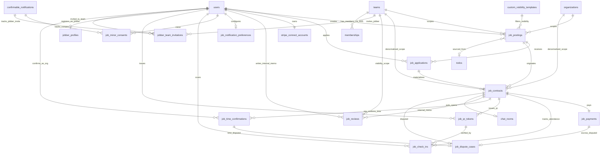
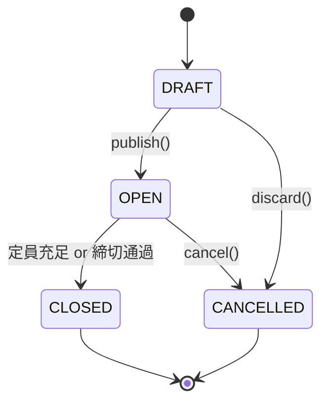
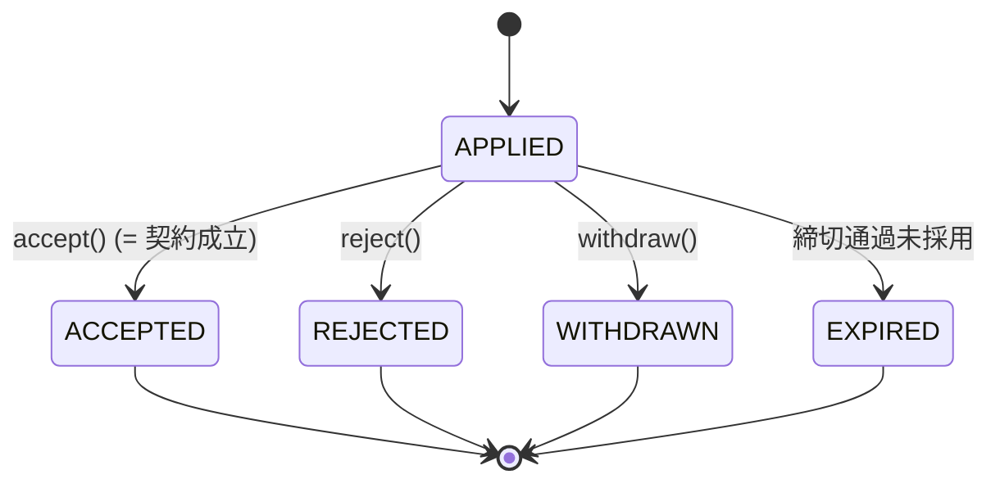
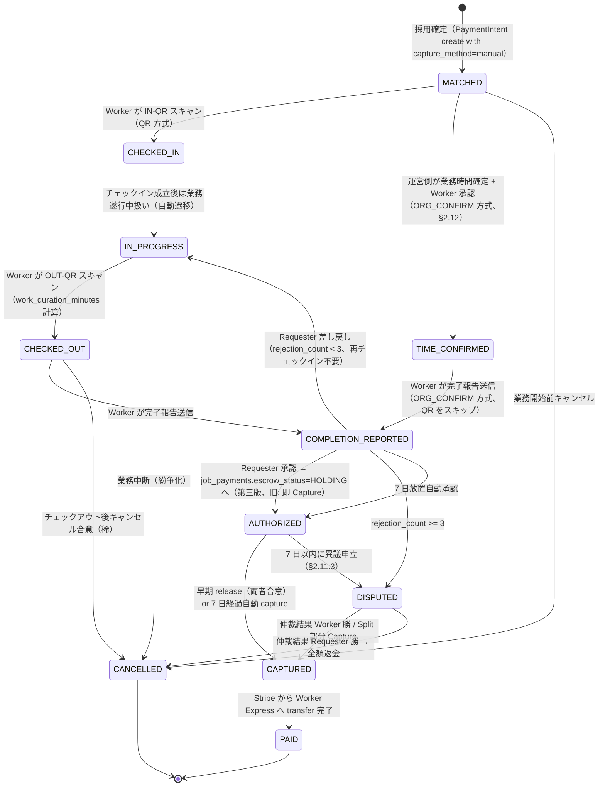
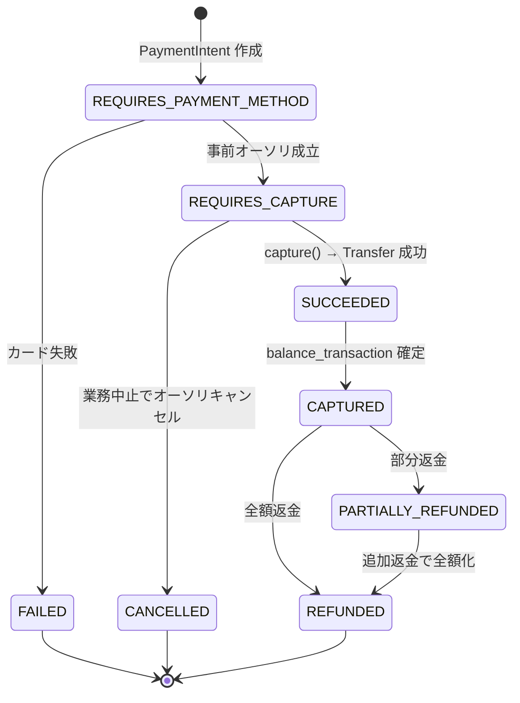

## 5. データモデル

### 5.1 テーブル一覧

| テーブル名 | 役割 | 論理削除 |
|-----------|------|---------|
| `job_postings` | 求人投稿 | あり（`deleted_at`） |
| `job_applications` | 応募 | なし（status で管理） |
| `job_contracts` | 契約（採用確定以降のライフサイクル） | なし |
| `job_check_ins` | チェックイン／アウト記録（QR スキャン） | なし |
| `job_qr_tokens` | QR コード発行トークン（短命・使い捨て） | なし（TTL で物理削除バッチ） |
| `job_payments` | 決済記録（PaymentIntent 1 対 1、**エスクロー状態管理**）| なし |
| `job_reviews` | 内部評価メモ（同一チーム ADMIN・本人のみ閲覧） | なし |
| `stripe_connect_accounts` | Worker の Stripe Express アカウント管理 | なし |
| `job_notification_preferences` | ユーザーごとの JOB_* 通知 opt-in 設定 | なし |
| `job_minor_consents` | 未成年 Worker の親権者同意記録 | なし |
| `job_dispute_cases` | 紛争ケース記録 | なし |
| **`jobber_profiles`** | **JOBBER のプロフィール（スキル・希望条件・通知設定・総合掲示板 opt-in）** | なし（第三版新規） |
| **`job_time_confirmations`** | **運営側が確定した業務時間 + Worker 承認記録** | なし（第三版新規） |
| **`jobber_team_invitations`** | **JOBBER 招待トークン（72 時間 TTL）** | なし（第三版新規、TTL で物理削除） |
| （ビュー）`v_worker_team_history` | Worker×Team 履歴集計（再応募時パネル／履歴ダッシュボード用） | — |
| （既存）`memberships` | **JOBBER の所属管理（F00.5 で新設。role_kind='MEMBER' として管理）** | — |
| （既存、修正）`todos` | **`job_posting_id` FK + `is_jobber_recruiting` BOOLEAN を追加** | — |

### 5.2 テーブル定義

#### `job_postings`

| カラム名 | 型 | NULL | デフォルト | 説明 |
|---------|---|------|-----------|------|
| `id` | BIGINT UNSIGNED | NO | AUTO_INCREMENT | PK |
| `team_id` | BIGINT UNSIGNED | YES | NULL | FK → teams（チーム求人。XOR） |
| `organization_id` | BIGINT UNSIGNED | YES | NULL | FK → organizations（組織求人。XOR） |
| `created_by` | BIGINT UNSIGNED | NO | — | FK → users（Requester。ON DELETE RESTRICT） |
| `title` | VARCHAR(200) | NO | — | タイトル |
| `description` | TEXT | NO | — | 業務内容（Markdown） |
| `category` | VARCHAR(50) | NO | — | カテゴリ（RECEPTION / PHOTO / TRANSLATION / SETUP など） |
| `work_start_at` | DATETIME | NO | — | 業務開始日時（UTC保存） |
| `work_end_at` | DATETIME | NO | — | 業務終了日時（UTC保存） |
| `location_type` | ENUM('ONSITE','ONLINE','HYBRID') | NO | 'ONSITE' | 場所種別 |
| `location_address` | VARCHAR(500) | YES | NULL | 住所（ONSITE/HYBRID の場合） |
| `location_latitude` | DECIMAL(9,6) | YES | NULL | 緯度 |
| `location_longitude` | DECIMAL(9,6) | YES | NULL | 経度 |
| `base_reward_jpy` | INT UNSIGNED | NO | — | 業務報酬（円、500〜1,000,000） |
| `capacity` | SMALLINT UNSIGNED | NO | 1 | 募集人数（1〜50） |
| `application_deadline_at` | DATETIME | NO | — | 応募締切 |
| `visibility_scope` | ENUM('TEAM_MEMBERS','TEAM_MEMBERS_SUPPORTERS','JOBBER_INTERNAL','JOBBER_PUBLIC_BOARD','ORGANIZATION_SCOPE','CUSTOM_TEMPLATE') | NO | 'TEAM_MEMBERS' | **第三版**で ENUM 拡張 + 命名整理（旧 `visibility` からリネーム） |
| `visibility_template_id` | BIGINT UNSIGNED | YES | NULL | F01.7 の `custom_visibility_templates.id`（`visibility_scope = CUSTOM_TEMPLATE` の場合必須） |
| `time_confirmation_method` | ENUM('QR_CHECKIN','ORG_CONFIRM') | NO | 'QR_CHECKIN' | **第三版新規**: 業務時間確定方式。`capacity >= 10` の場合は `ORG_CONFIRM` のみ許容 |
| `use_qr_check_in` | BOOLEAN | NO | TRUE | **第三版新規**: QR チェックイン使用フラグ。`time_confirmation_method = ORG_CONFIRM` の場合は FALSE |
| `source_todo_id` | BIGINT UNSIGNED | YES | NULL | **第三版新規**: TODO 連携元。FK → todos（ON DELETE SET NULL） |
| `auto_join_jobber_on_apply` | BOOLEAN | NO | FALSE | **第三版新規**: `JOBBER_PUBLIC_BOARD` 応募時にチームへ JOBBER として自動加入させるか |
| `required_skills` | JSON | YES | NULL | 必要スキル配列 |
| `equipment_note` | VARCHAR(500) | YES | NULL | 持ち物 |
| `dress_code` | VARCHAR(200) | YES | NULL | 服装 |
| `completion_criteria` | TEXT | YES | NULL | 業務完了条件 |
| `has_transportation_allowance` | BOOLEAN | NO | FALSE | 交通費支給有無 |
| `is_dangerous` | BOOLEAN | NO | FALSE | 危険作業フラグ（未成年不可） |
| `status` | ENUM('DRAFT','OPEN','CLOSED','CANCELLED') | NO | 'DRAFT' | 求人ステータス |
| `publish_at` | DATETIME | YES | NULL | 公開予約日時（NULL = 即時公開） |
| `published_at` | DATETIME | YES | NULL | 実公開日時 |
| `closed_at` | DATETIME | YES | NULL | 募集終了日時（定員充足または締切通過） |
| `cancelled_at` | DATETIME | YES | NULL | キャンセル日時 |
| `cancellation_reason` | VARCHAR(500) | YES | NULL | キャンセル理由 |
| `version` | BIGINT UNSIGNED | NO | 0 | 楽観的ロック |
| `created_at` | DATETIME | NO | CURRENT_TIMESTAMP | |
| `updated_at` | DATETIME | NO | CURRENT_TIMESTAMP ON UPDATE | |
| `deleted_at` | DATETIME | YES | NULL | 論理削除 |

**インデックス**
```sql
INDEX idx_jp_team_status_published (team_id, status, published_at DESC)
INDEX idx_jp_org_status_published (organization_id, status, published_at DESC)
INDEX idx_jp_created_by (created_by)
INDEX idx_jp_work_start (work_start_at)
INDEX idx_jp_application_deadline (application_deadline_at)
INDEX idx_jp_visibility_scope (visibility_scope)
INDEX idx_jp_public_board (visibility_scope, published_at DESC)  -- 総合掲示板一覧用（第三版）
INDEX idx_jp_source_todo (source_todo_id)                         -- TODO 逆引き用（第三版）
```

**制約**
```sql
CONSTRAINT chk_jp_scope
  CHECK ((team_id IS NOT NULL AND organization_id IS NULL)
      OR (team_id IS NULL AND organization_id IS NOT NULL))
CONSTRAINT chk_jp_reward_range
  CHECK (base_reward_jpy >= 500 AND base_reward_jpy <= 1000000)
CONSTRAINT chk_jp_work_time
  CHECK (work_end_at > work_start_at)
CONSTRAINT chk_jp_deadline
  CHECK (application_deadline_at < work_start_at)
CONSTRAINT chk_jp_custom_template
  CHECK (visibility_scope <> 'CUSTOM_TEMPLATE' OR visibility_template_id IS NOT NULL)
-- 第三版追加
CONSTRAINT chk_jp_capacity_method
  CHECK (capacity < 10 OR time_confirmation_method = 'ORG_CONFIRM')
CONSTRAINT chk_jp_method_qr_consistency
  CHECK ((time_confirmation_method = 'QR_CHECKIN' AND use_qr_check_in = TRUE)
      OR (time_confirmation_method = 'ORG_CONFIRM' AND use_qr_check_in = FALSE))
CONSTRAINT chk_jp_jobber_scope_team
  CHECK (visibility_scope NOT IN ('JOBBER_INTERNAL','JOBBER_PUBLIC_BOARD')
      OR team_id IS NOT NULL)  -- Jobber スコープは team_id 必須（組織直下募集での Jobber 運用は Phase 13.2 で検討）
```

#### `job_applications`

| カラム名 | 型 | NULL | デフォルト | 説明 |
|---------|---|------|-----------|------|
| `id` | BIGINT UNSIGNED | NO | AUTO_INCREMENT | PK |
| `job_posting_id` | BIGINT UNSIGNED | NO | — | FK → job_postings |
| `applicant_user_id` | BIGINT UNSIGNED | NO | — | FK → users |
| `self_pr` | VARCHAR(500) | YES | NULL | 自己PR |
| `status` | ENUM('APPLIED','WITHDRAWN','ACCEPTED','REJECTED','EXPIRED') | NO | 'APPLIED' | 状態 |
| `applied_at` | DATETIME | NO | CURRENT_TIMESTAMP | 応募日時 |
| `status_changed_at` | DATETIME | YES | NULL | 状態変更日時 |
| `rejection_reason` | VARCHAR(300) | YES | NULL | 不採用理由 |
| `created_at` | DATETIME | NO | CURRENT_TIMESTAMP | |
| `updated_at` | DATETIME | NO | CURRENT_TIMESTAMP ON UPDATE | |

**インデックス**
```sql
UNIQUE KEY uq_ja_job_applicant (job_posting_id, applicant_user_id)
INDEX idx_ja_status (status)
INDEX idx_ja_applicant (applicant_user_id, status)
```

#### `job_contracts`

| カラム名 | 型 | NULL | デフォルト | 説明 |
|---------|---|------|-----------|------|
| `id` | BIGINT UNSIGNED | NO | AUTO_INCREMENT | PK |
| `job_posting_id` | BIGINT UNSIGNED | NO | — | FK → job_postings |
| `job_application_id` | BIGINT UNSIGNED | NO | — | FK → job_applications |
| `team_id` | BIGINT UNSIGNED | YES | NULL | FK → teams（履歴ダッシュボード高速化・`job_postings.team_id` をデノーマライズ）|
| `organization_id` | BIGINT UNSIGNED | YES | NULL | FK → organizations（同上）|
| `requester_user_id` | BIGINT UNSIGNED | NO | — | FK → users（実質的な Requester） |
| `worker_user_id` | BIGINT UNSIGNED | NO | — | FK → users |
| `status` | ENUM('MATCHED','CHECKED_IN','IN_PROGRESS','CHECKED_OUT','TIME_CONFIRMED','COMPLETION_REPORTED','AUTHORIZED','CAPTURED','PAID','COMPLETED','CANCELLED','DISPUTED') | NO | 'MATCHED' | ライフサイクル（**第三版で `TIME_CONFIRMED` / `AUTHORIZED` / `CAPTURED` / `PAID` を追加、旧 `COMPLETED` は互換維持**） |
| `base_reward_jpy` | INT UNSIGNED | NO | — | 契約時点の報酬（job_postings のスナップショット） |
| `requester_fee_jpy` | INT UNSIGNED | NO | — | Requester 手数料（スナップショット） |
| `requester_fee_tax_jpy` | INT UNSIGNED | NO | — | Requester 手数料消費税 |
| `worker_fee_jpy` | INT UNSIGNED | NO | — | Worker 手数料（スナップショット） |
| `worker_receipt_jpy` | INT UNSIGNED | NO | — | Worker 受取予定額 |
| `requester_total_payment_jpy` | INT UNSIGNED | NO | — | Requester 支払総額（税込） |
| `chat_room_id` | BIGINT UNSIGNED | YES | NULL | FK → chat_rooms（F04.2、自動作成） |
| `matched_at` | DATETIME | NO | CURRENT_TIMESTAMP | 採用確定日時 |
| `checked_in_at` | DATETIME | YES | NULL | Worker チェックイン日時（QR スキャン確定時刻）|
| `checked_out_at` | DATETIME | YES | NULL | Worker チェックアウト日時（QR スキャン確定時刻）|
| `work_duration_minutes` | INT UNSIGNED | YES | NULL | 業務時間（分）= checked_out_at − checked_in_at、CHECKED_OUT 遷移時に計算|
| `work_started_at` | DATETIME | YES | NULL | 業務開始（互換用、通常は `checked_in_at` と同時刻）|
| `completion_reported_at` | DATETIME | YES | NULL | 完了報告日時 |
| `reviewed_by_requester_at` | DATETIME | YES | NULL | 承認/差し戻し日時 |
| `completed_at` | DATETIME | YES | NULL | 確定完了日時 |
| `auto_accepted_at` | DATETIME | YES | NULL | 自動承認日時（7日放置） |
| `cancelled_at` | DATETIME | YES | NULL | キャンセル日時 |
| `cancelled_by_user_id` | BIGINT UNSIGNED | YES | NULL | FK → users |
| `cancellation_reason` | VARCHAR(500) | YES | NULL | キャンセル理由 |
| `rejection_count` | TINYINT UNSIGNED | NO | 0 | 差し戻し回数（3回で紛争モード） |
| `version` | BIGINT UNSIGNED | NO | 0 | 楽観的ロック |
| `created_at` | DATETIME | NO | CURRENT_TIMESTAMP | |
| `updated_at` | DATETIME | NO | CURRENT_TIMESTAMP ON UPDATE | |

**インデックス**
```sql
UNIQUE KEY uq_jc_application (job_application_id)
INDEX idx_jc_posting (job_posting_id)
INDEX idx_jc_requester (requester_user_id, status)
INDEX idx_jc_worker (worker_user_id, status)
INDEX idx_jc_status (status)
INDEX idx_jc_completion_reported (completion_reported_at)  -- 7日自動承認バッチ用
INDEX idx_jc_team_completed (team_id, status, completed_at DESC)     -- 履歴ダッシュボード用
INDEX idx_jc_org_completed (organization_id, status, completed_at DESC)
INDEX idx_jc_team_worker (team_id, worker_user_id, completed_at DESC) -- 再応募時の過去履歴参照
INDEX idx_jc_worker_completed (worker_user_id, status, completed_at DESC) -- Worker マイページ履歴
```

#### `job_check_ins`

| カラム名 | 型 | NULL | デフォルト | 説明 |
|---------|---|------|-----------|------|
| `id` | BIGINT UNSIGNED | NO | AUTO_INCREMENT | PK |
| `job_contract_id` | BIGINT UNSIGNED | NO | — | FK → job_contracts |
| `worker_user_id` | BIGINT UNSIGNED | NO | — | FK → users（冪等性・監査用にデノーマライズ保持） |
| `type` | ENUM('IN','OUT') | NO | — | チェックインかアウトか |
| `qr_token_id` | BIGINT UNSIGNED | NO | — | FK → job_qr_tokens（検証済みトークン）|
| `scanned_at` | DATETIME(3) | NO | — | Worker 端末でスキャン成立時刻（ミリ秒精度、UTC）|
| `server_received_at` | DATETIME(3) | NO | CURRENT_TIMESTAMP(3) | サーバー受信時刻（オフライン時はスキャン時刻と乖離する）|
| `offline_submitted` | BOOLEAN | NO | FALSE | オフラインキュー経由で送信されたか |
| `geolocation_latitude` | DECIMAL(9,6) | YES | NULL | 端末緯度（AES-256-GCM 暗号化、暗号文を BINARY 列でもよい）|
| `geolocation_longitude` | DECIMAL(9,6) | YES | NULL | 端末経度（暗号化）|
| `geolocation_accuracy_m` | FLOAT | YES | NULL | 精度（メートル）|
| `geo_anomaly` | BOOLEAN | NO | FALSE | 業務場所から 500 m 以上乖離 |
| `geolocation_deleted_at` | DATETIME | YES | NULL | 位置情報削除日時（完了 90 日後バッチ）|
| `client_user_agent` | VARCHAR(500) | YES | NULL | スキャン端末 User-Agent（監査用）|
| `manual_code_fallback` | BOOLEAN | NO | FALSE | 手動コード入力で成立したか |
| `created_at` | DATETIME | NO | CURRENT_TIMESTAMP | |

**インデックス**
```sql
UNIQUE KEY uq_jci_contract_type (job_contract_id, type)  -- IN/OUT は各 1 件まで
INDEX idx_jci_worker_scanned (worker_user_id, scanned_at DESC)
INDEX idx_jci_qr_token (qr_token_id)
INDEX idx_jci_geo_anomaly (geo_anomaly)  -- アラート対象抽出用
```

**制約**
```sql
CONSTRAINT chk_jci_out_after_in
  -- OUT 登録時点で同契約の IN が存在することをアプリ層で検証（DB 制約では難しいため Service 層で強制）
```

#### `job_qr_tokens`

| カラム名 | 型 | NULL | デフォルト | 説明 |
|---------|---|------|-----------|------|
| `id` | BIGINT UNSIGNED | NO | AUTO_INCREMENT | PK |
| `job_contract_id` | BIGINT UNSIGNED | NO | — | FK → job_contracts |
| `type` | ENUM('IN','OUT') | NO | — | チェックイン／アウト用 |
| `nonce` | CHAR(36) | NO | — | UUIDv4（`uq_jqt_nonce` で UNIQUE）|
| `kid` | VARCHAR(20) | NO | — | 署名鍵 ID（ローテーション対応）|
| `issued_at` | DATETIME(3) | NO | CURRENT_TIMESTAMP(3) | 発行時刻 |
| `expires_at` | DATETIME(3) | NO | — | 失効時刻（issued_at + TTL、デフォルト 60 秒）|
| `used_at` | DATETIME(3) | YES | NULL | 使用済み時刻（使い捨て、2 回目スキャンは失敗）|
| `short_code` | CHAR(6) | YES | NULL | 手動入力フォールバック用短コード（TTL と連動、UNIQUE within active）|
| `issued_by_user_id` | BIGINT UNSIGNED | NO | — | FK → users（Requester = QR 表示者）|
| `created_at` | DATETIME | NO | CURRENT_TIMESTAMP | |

**インデックス**
```sql
UNIQUE KEY uq_jqt_nonce (nonce)
INDEX idx_jqt_contract_type_expires (job_contract_id, type, expires_at)
INDEX idx_jqt_expires (expires_at)  -- 失効トークン掃除バッチ用
INDEX idx_jqt_short_code (short_code, expires_at)
```

> **保管方針**: `expires_at + 24 時間` 経過で物理削除バッチが走る（`JobQrTokenCleanupJob`、毎時実行）。`used_at IS NOT NULL` のレコードは別途監査目的で 7 日保持してから削除。

#### `job_payments`

| カラム名 | 型 | NULL | デフォルト | 説明 |
|---------|---|------|-----------|------|
| `id` | BIGINT UNSIGNED | NO | AUTO_INCREMENT | PK |
| `job_contract_id` | BIGINT UNSIGNED | NO | — | FK → job_contracts |
| `stripe_payment_intent_id` | VARCHAR(100) | NO | — | pi_xxx（UNIQUE） |
| `stripe_charge_id` | VARCHAR(100) | YES | NULL | ch_xxx |
| `stripe_transfer_id` | VARCHAR(100) | YES | NULL | tr_xxx |
| `stripe_application_fee_id` | VARCHAR(100) | YES | NULL | fee_xxx |
| `stripe_refund_id` | VARCHAR(100) | YES | NULL | re_xxx（UNIQUE、nullable） |
| `stripe_balance_transaction_id` | VARCHAR(100) | YES | NULL | txn_xxx（決済手数料確定後に設定） |
| `status` | ENUM('REQUIRES_PAYMENT_METHOD','REQUIRES_CAPTURE','SUCCEEDED','CAPTURED','PARTIALLY_REFUNDED','REFUNDED','FAILED','CANCELLED') | NO | 'REQUIRES_PAYMENT_METHOD' | Stripe 状態のミラー |
| `escrow_status` | ENUM('NOT_STARTED','HOLDING','RELEASED','DISPUTED','CANCELLED') | NO | 'NOT_STARTED' | **第三版新規**: エスクロー状態。`NOT_STARTED`=業務完了承認前、`HOLDING`=7 日間保留中、`RELEASED`=capture 済、`DISPUTED`=異議申立中、`CANCELLED`=オーソリ失効 |
| `dispute_window_ends_at` | DATETIME | YES | NULL | **第三版新規**: エスクロー終了予定時刻（完了承認時刻 + 7 日）|
| `early_release_requester_approved_at` | DATETIME | YES | NULL | **第三版新規**: Requester が早期 release ボタン押下日時 |
| `early_release_worker_approved_at` | DATETIME | YES | NULL | **第三版新規**: Worker が早期 release ボタン押下日時 |
| `amount_jpy` | INT UNSIGNED | NO | — | 請求総額（税込、=requester_total_payment_jpy） |
| `application_fee_amount_jpy` | INT UNSIGNED | NO | — | Stripe 側の application_fee_amount 設定値 |
| `stripe_fee_jpy` | INT UNSIGNED | YES | NULL | Stripe 決済手数料（balance_transaction 確定後） |
| `platform_net_margin_jpy` | INT | YES | NULL | Mannschaft 手取り（Stripe 手数料差し引き後） |
| `worker_receipt_jpy` | INT UNSIGNED | NO | — | Worker 受取額 |
| `authorized_at` | DATETIME | YES | NULL | 事前オーソリ成立日時 |
| `captured_at` | DATETIME | YES | NULL | capture 日時 |
| `transferred_at` | DATETIME | YES | NULL | transfer 作成日時 |
| `refunded_at` | DATETIME | YES | NULL | 返金日時 |
| `refund_reason` | VARCHAR(500) | YES | NULL | 返金理由 |
| `failure_reason` | VARCHAR(500) | YES | NULL | 失敗理由 |
| `webhook_event_ids` | JSON | NO | '[]' | 適用済 Webhook evt_xxx リスト（冪等性） |
| `created_at` | DATETIME | NO | CURRENT_TIMESTAMP | |
| `updated_at` | DATETIME | NO | CURRENT_TIMESTAMP ON UPDATE | |

**インデックス**
```sql
UNIQUE KEY uq_jp_payment_intent (stripe_payment_intent_id)
UNIQUE KEY uq_jp_refund (stripe_refund_id)
INDEX idx_jp_contract (job_contract_id)
INDEX idx_jp_status (status)
INDEX idx_jp_captured_at (captured_at)
INDEX idx_jp_escrow_window (escrow_status, dispute_window_ends_at)  -- 第三版: 自動 capture バッチ用
```

#### `jobber_profiles`（第三版新規）

| カラム名 | 型 | NULL | デフォルト | 説明 |
|---------|---|------|-----------|------|
| `id` | BIGINT UNSIGNED | NO | AUTO_INCREMENT | PK |
| `user_id` | BIGINT UNSIGNED | NO | — | FK → users（UNIQUE、ON DELETE CASCADE） |
| `display_headline` | VARCHAR(100) | YES | NULL | 「例: 撮影・イベント設営得意な社会人です」|
| `self_introduction` | TEXT | YES | NULL | 自己紹介（最大 2000 字、プレーンテキスト）|
| `preferred_skills` | JSON | YES | NULL | 得意スキル配列（`["PHOTO","TRANSLATION_EN_JA",...]`）|
| `preferred_hourly_wage_min_jpy` | INT UNSIGNED | YES | NULL | 希望最低時給（任意）|
| `preferred_hourly_wage_max_jpy` | INT UNSIGNED | YES | NULL | 希望最高時給（任意）|
| `preferred_categories` | JSON | YES | NULL | 希望カテゴリ配列 |
| `preferred_area_prefecture` | VARCHAR(20) | YES | NULL | 都道府県（任意）|
| `preferred_max_distance_km` | INT UNSIGNED | YES | NULL | 最大通勤距離 km |
| `availability_weekdays` | JSON | YES | NULL | `{"MON":["AM"],"SAT":["AM","PM","EVE"]}` 等の時間帯配列 |
| `is_public_board_opt_in` | BOOLEAN | NO | FALSE | **総合掲示板への掲載同意**。FALSE の場合 `JOBBER_PUBLIC_BOARD` 求人は見えない・応募不可 |
| `notification_filters` | JSON | YES | NULL | `JOB_PUBLIC_BOARD_MATCH` 通知の条件フィルタ |
| `total_completed_contracts` | INT UNSIGNED | NO | 0 | 完了契約数（全チーム横断、集計カラム） |
| `total_dispute_losses` | INT UNSIGNED | NO | 0 | DISPUTED で Worker 敗訴した件数（内部参考値、外部非公開） |
| `created_at` | DATETIME | NO | CURRENT_TIMESTAMP | |
| `updated_at` | DATETIME | NO | CURRENT_TIMESTAMP ON UPDATE | |

**インデックス**
```sql
UNIQUE KEY uq_jbp_user (user_id)
INDEX idx_jbp_public_opt_in (is_public_board_opt_in)  -- 総合掲示板一覧時
INDEX idx_jbp_area (preferred_area_prefecture)
```

#### `jobber_team_invitations`（第三版新規）

| カラム名 | 型 | NULL | デフォルト | 説明 |
|---------|---|------|-----------|------|
| `id` | BIGINT UNSIGNED | NO | AUTO_INCREMENT | PK |
| `team_id` | BIGINT UNSIGNED | NO | — | FK → teams |
| `inviter_user_id` | BIGINT UNSIGNED | NO | — | FK → users（ADMIN or DEPUTY(MANAGE_JOBS)） |
| `invitee_user_id` | BIGINT UNSIGNED | YES | NULL | FK → users（既存ユーザー招待時） |
| `invitee_email` | VARCHAR(255) | YES | NULL | 外部メール招待時（未登録ユーザー） |
| `status` | ENUM('PENDING','ACCEPTED','DECLINED','EXPIRED','REVOKED') | NO | 'PENDING' | |
| `token_hash` | VARCHAR(64) | NO | — | 招待トークンの SHA-256 ハッシュ（平文は発行時のみ URL に埋め込み、DB には残さない） |
| `message` | VARCHAR(500) | YES | NULL | 招待メッセージ（任意） |
| `proposed_hourly_wage_jpy` | INT UNSIGNED | YES | NULL | 推定時給帯（任意、UX 補助） |
| `proposed_categories` | JSON | YES | NULL | 想定業務カテゴリ（任意） |
| `expires_at` | DATETIME | NO | — | 有効期限（issued_at + 72 時間） |
| `accepted_at` | DATETIME | YES | NULL | |
| `declined_at` | DATETIME | YES | NULL | |
| `revoked_at` | DATETIME | YES | NULL | 招待者が取消した場合 |
| `created_at` | DATETIME | NO | CURRENT_TIMESTAMP | |
| `updated_at` | DATETIME | NO | CURRENT_TIMESTAMP ON UPDATE | |

**インデックス**
```sql
UNIQUE KEY uq_jti_token (token_hash)
INDEX idx_jti_team_status (team_id, status, expires_at)
INDEX idx_jti_invitee_user (invitee_user_id, status)
INDEX idx_jti_invitee_email (invitee_email, status)
```

**制約**
```sql
CONSTRAINT chk_jti_invitee CHECK (invitee_user_id IS NOT NULL OR invitee_email IS NOT NULL)
CONSTRAINT chk_jti_expiry CHECK (expires_at > created_at)
```

#### `job_time_confirmations`（第三版新規）

| カラム名 | 型 | NULL | デフォルト | 説明 |
|---------|---|------|-----------|------|
| `id` | BIGINT UNSIGNED | NO | AUTO_INCREMENT | PK |
| `job_contract_id` | BIGINT UNSIGNED | NO | — | FK → job_contracts |
| `version` | SMALLINT UNSIGNED | NO | 1 | 差し戻し後の再登録で +1（履歴保持） |
| `status` | ENUM('PENDING_WORKER_APPROVAL','APPROVED_BY_WORKER','AUTO_APPROVED','DISPUTED','REVOKED') | NO | 'PENDING_WORKER_APPROVAL' | |
| `confirmed_by_user_id` | BIGINT UNSIGNED | NO | — | FK → users（運営側、ADMIN/DEPUTY） |
| `work_start_at` | DATETIME | NO | — | 運営側が入力した業務開始時刻 |
| `work_end_at` | DATETIME | NO | — | 運営側が入力した業務終了時刻 |
| `break_minutes` | INT UNSIGNED | NO | 0 | 休憩時間（分） |
| `calculated_work_minutes` | INT UNSIGNED | NO | — | (work_end_at - work_start_at) - break_minutes |
| `note` | VARCHAR(500) | YES | NULL | 運営側の補足メモ |
| `worker_approved_at` | DATETIME | YES | NULL | Worker が承認した時刻 |
| `worker_disputed_at` | DATETIME | YES | NULL | Worker が異議提起した時刻 |
| `worker_dispute_reason` | VARCHAR(500) | YES | NULL | 異議理由 |
| `auto_approved_at` | DATETIME | YES | NULL | 72 時間タイムアウトで自動承認した時刻 |
| `created_at` | DATETIME | NO | CURRENT_TIMESTAMP | |
| `updated_at` | DATETIME | NO | CURRENT_TIMESTAMP ON UPDATE | |

**インデックス**
```sql
UNIQUE KEY uq_jtc_contract_version (job_contract_id, version)
INDEX idx_jtc_status_created (status, created_at)    -- 自動承認バッチ用
INDEX idx_jtc_contract_status (job_contract_id, status)
```

**制約**
```sql
CONSTRAINT chk_jtc_work_time CHECK (work_end_at > work_start_at)
CONSTRAINT chk_jtc_break CHECK (break_minutes >= 0
    AND break_minutes < TIMESTAMPDIFF(MINUTE, work_start_at, work_end_at))
CONSTRAINT chk_jtc_calc CHECK (calculated_work_minutes > 0)
```

#### `job_reviews`（**内部記録メモ**・Public 公開なし）

| カラム名 | 型 | NULL | デフォルト | 説明 |
|---------|---|------|-----------|------|
| `id` | BIGINT UNSIGNED | NO | AUTO_INCREMENT | PK |
| `job_contract_id` | BIGINT UNSIGNED | NO | — | FK → job_contracts |
| `team_id` | BIGINT UNSIGNED | YES | NULL | FK → teams（閲覧スコープ判定用にデノーマライズ）|
| `organization_id` | BIGINT UNSIGNED | YES | NULL | FK → organizations（同上）|
| `reviewer_user_id` | BIGINT UNSIGNED | NO | — | FK → users（通常は Requester 側 ADMIN）|
| `reviewee_user_id` | BIGINT UNSIGNED | NO | — | FK → users（評価対象の Worker）|
| `rating` | TINYINT UNSIGNED | YES | NULL | 1〜5（内部参考値、公開平均は計算しない）|
| `comment` | VARCHAR(1000) | YES | NULL | 内部メモ本文（チーム ADMIN・本人のみ閲覧）|
| `visibility_scope` | ENUM('TEAM_ADMIN_ONLY','TEAM_ADMIN_AND_REVIEWEE') | NO | 'TEAM_ADMIN_AND_REVIEWEE' | 閲覧スコープ。初期値は Worker 本人にも見せる設定 |
| `created_at` | DATETIME | NO | CURRENT_TIMESTAMP | |
| `updated_at` | DATETIME | NO | CURRENT_TIMESTAMP ON UPDATE | |

> **設計変更の背景**: マスター決定により、本機能は「チーム内コミュニティの信頼を前提とした業務委託」であり、タイミー型の**公開星評価による信頼醸成は不要**。評価は**内部記録・次回起用判断のメモ**として運用する。`is_published` / `published_at` / 「14 日で自動公開」等の仕組みは廃止。

**インデックス**
```sql
UNIQUE KEY uq_jr_contract_reviewer (job_contract_id, reviewer_user_id)
INDEX idx_jr_team_reviewee (team_id, reviewee_user_id, created_at DESC)     -- 再応募時の過去評価参照用
INDEX idx_jr_reviewee_created (reviewee_user_id, created_at DESC)
```

**制約**
```sql
CONSTRAINT chk_jr_rating CHECK (rating IS NULL OR rating BETWEEN 1 AND 5)
CONSTRAINT chk_jr_not_self CHECK (reviewer_user_id <> reviewee_user_id)
```

#### `stripe_connect_accounts`

| カラム名 | 型 | NULL | デフォルト | 説明 |
|---------|---|------|-----------|------|
| `id` | BIGINT UNSIGNED | NO | AUTO_INCREMENT | PK |
| `user_id` | BIGINT UNSIGNED | NO | — | FK → users（ON DELETE RESTRICT） |
| `stripe_account_id` | VARCHAR(100) | NO | — | acct_xxx（UNIQUE） |
| `account_type` | ENUM('EXPRESS','STANDARD') | NO | 'EXPRESS' | アカウント種別 |
| `status` | ENUM('PENDING','ONBOARDING','READY','RESTRICTED','DISABLED') | NO | 'PENDING' | アプリ側ステータス |
| `charges_enabled` | BOOLEAN | NO | FALSE | Stripe の charges_enabled ミラー |
| `payouts_enabled` | BOOLEAN | NO | FALSE | Stripe の payouts_enabled ミラー |
| `requirements_currently_due` | JSON | YES | NULL | Stripe requirements オブジェクト |
| `details_submitted` | BOOLEAN | NO | FALSE | |
| `country` | CHAR(2) | NO | 'JP' | |
| `default_currency` | CHAR(3) | NO | 'JPY' | |
| `created_at` | DATETIME | NO | CURRENT_TIMESTAMP | |
| `updated_at` | DATETIME | NO | CURRENT_TIMESTAMP ON UPDATE | |

**インデックス**
```sql
UNIQUE KEY uq_sca_user (user_id)
UNIQUE KEY uq_sca_stripe_account (stripe_account_id)
INDEX idx_sca_status (status)
```

#### `job_notification_preferences`

| カラム名 | 型 | NULL | デフォルト | 説明 |
|---------|---|------|-----------|------|
| `id` | BIGINT UNSIGNED | NO | AUTO_INCREMENT | PK |
| `user_id` | BIGINT UNSIGNED | NO | — | FK → users（UNIQUE） |
| `job_posted_enabled` | BOOLEAN | NO | TRUE | 新規求人通知 |
| `job_posted_categories` | JSON | YES | NULL | 通知対象カテゴリフィルター |
| `reminder_enabled` | BOOLEAN | NO | TRUE | 業務開始リマインド |
| `review_received_enabled` | BOOLEAN | NO | TRUE | 評価受領通知 |
| `created_at` | DATETIME | NO | CURRENT_TIMESTAMP | |
| `updated_at` | DATETIME | NO | CURRENT_TIMESTAMP ON UPDATE | |

#### `job_minor_consents`

| カラム名 | 型 | NULL | デフォルト | 説明 |
|---------|---|------|-----------|------|
| `id` | BIGINT UNSIGNED | NO | AUTO_INCREMENT | PK |
| `worker_user_id` | BIGINT UNSIGNED | NO | — | FK → users（未成年Worker） |
| `guardian_name` | VARCHAR(100) | NO | — | 親権者氏名 |
| `guardian_email` | VARCHAR(255) | NO | — | 親権者メールアドレス |
| `guardian_phone` | VARCHAR(30) | YES | NULL | 親権者電話（任意） |
| `consent_confirmable_id` | BIGINT UNSIGNED | YES | NULL | F04.9 confirmable_notifications への参照 |
| `consented_at` | DATETIME | YES | NULL | 確認完了日時 |
| `valid_until` | DATE | NO | — | 同意有効期限（通常 1 年） |
| `revoked_at` | DATETIME | YES | NULL | 撤回日時 |
| `created_at` | DATETIME | NO | CURRENT_TIMESTAMP | |
| `updated_at` | DATETIME | NO | CURRENT_TIMESTAMP ON UPDATE | |

**インデックス**
```sql
INDEX idx_jmc_worker_valid (worker_user_id, valid_until)
```

#### `job_dispute_cases`

| カラム名 | 型 | NULL | デフォルト | 説明 |
|---------|---|------|-----------|------|
| `id` | BIGINT UNSIGNED | NO | AUTO_INCREMENT | PK |
| `job_contract_id` | BIGINT UNSIGNED | NO | — | FK → job_contracts（UNIQUE） |
| `opened_by_user_id` | BIGINT UNSIGNED | NO | — | FK → users |
| `reason` | VARCHAR(500) | NO | — | 紛争理由 |
| `status` | ENUM('OPEN','UNDER_REVIEW','RESOLVED_WORKER_WIN','RESOLVED_REQUESTER_WIN','RESOLVED_SPLIT','WITHDRAWN') | NO | 'OPEN' | |
| `dispute_source` | ENUM('COMPLETION_REJECTION','ESCROW_WINDOW','TIME_CONFIRMATION') | NO | 'COMPLETION_REJECTION' | **第三版新規**: 紛争発生元 |
| `escrow_payment_id` | BIGINT UNSIGNED | YES | NULL | **第三版新規**: エスクロー経由で発生した紛争の場合 FK → job_payments |
| `time_confirmation_id` | BIGINT UNSIGNED | YES | NULL | **第三版新規**: 運営確定方式で発生した紛争の場合 FK → job_time_confirmations |
| `resolver_admin_user_id` | BIGINT UNSIGNED | YES | NULL | FK → users（仲裁ADMIN） |
| `resolution_note` | TEXT | YES | NULL | 仲裁結果メモ |
| `resolution_refund_jpy` | INT UNSIGNED | YES | NULL | 返金額（RESOLVED_SPLIT 時など） |
| `opened_at` | DATETIME | NO | CURRENT_TIMESTAMP | |
| `resolved_at` | DATETIME | YES | NULL | |
| `created_at` | DATETIME | NO | CURRENT_TIMESTAMP | |
| `updated_at` | DATETIME | NO | CURRENT_TIMESTAMP ON UPDATE | |

#### 既存テーブルへの変更（第三版）

##### `memberships`（F00.5 / F01.2 所管）

- JOBBER は `memberships.role_kind = 'MEMBER'` として管理し、`jobber_profiles` テーブルでジョブ固有情報（is_public_board_opt_in 等）を保持する方針。
- `memberships.role_kind` ENUM への `JOBBER` 追加は F00.5 の OQ-5 検討事項（Phase 8 以降）として分離。
- 旧 `team_members.role` に JOBBER を追加するマイグレーション（V13.020）は F00.5 Phase 4 の旧行削除完了後に改めて memberships ベースの設計に読み替えること（F01.2 設計書にも連動追記、§17.3 参照）

##### `todos`（F02.5 所管）

- 以下のカラムを追加:
  - `job_posting_id BIGINT UNSIGNED NULL` — FK → job_postings（ON DELETE SET NULL）
  - `is_jobber_recruiting BOOLEAN NOT NULL DEFAULT FALSE` — Jobber 募集フラグ
- インデックス: `INDEX idx_todos_job_posting (job_posting_id)` — 求人からの逆引き用
- F02.5 設計書にも連動追記（§17.3 参照）

### 5.3 ER図（mermaid）



> **第三版で新たに加わった関係**:
> - `users ↔ jobber_profiles` — 1 対 1。Jobber 登録時に自動作成
> - `teams ↔ memberships (scope_type='TEAM', role_kind='MEMBER')` — チームと JOBBER は多対多（F00.5 以降は memberships テーブルで管理）
> - `job_postings ↔ todos` — 1 対 1 オプショナル（TODO 連携）
> - `job_payments ↔ job_dispute_cases` — エスクロー DISPUTED 時の紐付け
> - `job_time_confirmations ↔ job_dispute_cases` — 運営確定方式での異議申立

### 5.4 状態遷移図

**job_postings.status**:


**job_applications.status**:


**job_contracts.status**（第三版で `TIME_CONFIRMED` を追加）:


> **第三版の遷移拡張ポイント**:
> - **`TIME_CONFIRMED`**: 大規模募集の運営確定方式（§2.12）で、Worker が運営提示の業務時間を承認した時に遷移する新状態。QR の `CHECKED_IN/OUT` をスキップする
> - **`AUTHORIZED`**: Requester が完了承認した直後の中間状態。**まだ capture していない** (`escrow_status = HOLDING`)。従来は即 `COMPLETED` だったが、7 日間のエスクローを挟むため追加
> - **`CAPTURED`**: Stripe 側で capture が完了した状態。早期 release or 7 日経過で到達
> - **`PAID`**: Stripe Express への transfer 完了（Worker 口座入金確定、balance_transaction 確定後）
> - 旧 `COMPLETED` は廃止し、エスクロー完了後の「支払完了」を `PAID` として明確化。ただし既存履歴画面では「完了」として統合表示する互換対応あり（`PAID` or `CAPTURED` を「完了扱い」とする View 関数 `JobContractStatusView.isCompleted()`）

> **備考**:
> - `MATCHED → CHECKED_IN → IN_PROGRESS` は通常チェックイン成立と同時に `IN_PROGRESS` に自動遷移する（内部的な細分化）。UI 上は CHECKED_IN と IN_PROGRESS を「勤務中」として統合表示してよい。
> - `CHECKED_OUT` 後の完了報告は Worker 側から明示的にボタン押下する必要がある（写真添付・メモ記入の機会を残すため）。
> - チェックイン／アウトをスキップして直接 `COMPLETION_REPORTED` に進むパスは**禁止**（業務時間の根拠が得られないため）。ただし緊急時の ADMIN 代理入力は §19 未解決問題で論点として扱う。

**job_payments.status**（Stripe PaymentIntent のミラー）:


### 5.5 DDL サンプル（抜粋）

```sql
-- V13.001__create_job_postings.sql
CREATE TABLE job_postings (
  id BIGINT UNSIGNED NOT NULL AUTO_INCREMENT,
  team_id BIGINT UNSIGNED NULL,
  organization_id BIGINT UNSIGNED NULL,
  created_by BIGINT UNSIGNED NOT NULL,
  title VARCHAR(200) NOT NULL,
  description TEXT NOT NULL,
  category VARCHAR(50) NOT NULL,
  work_start_at DATETIME NOT NULL,
  work_end_at DATETIME NOT NULL,
  location_type ENUM('ONSITE','ONLINE','HYBRID') NOT NULL DEFAULT 'ONSITE',
  location_address VARCHAR(500) NULL,
  location_latitude DECIMAL(9,6) NULL,
  location_longitude DECIMAL(9,6) NULL,
  base_reward_jpy INT UNSIGNED NOT NULL,
  capacity SMALLINT UNSIGNED NOT NULL DEFAULT 1,
  application_deadline_at DATETIME NOT NULL,
  visibility ENUM('TEAM_MEMBERS_ONLY','TEAM_MEMBERS_AND_SUPPORTERS','ORGANIZATION_SCOPE','CUSTOM_TEMPLATE') NOT NULL DEFAULT 'TEAM_MEMBERS_ONLY',
  visibility_template_id BIGINT UNSIGNED NULL,
  required_skills JSON NULL,
  equipment_note VARCHAR(500) NULL,
  dress_code VARCHAR(200) NULL,
  completion_criteria TEXT NULL,
  has_transportation_allowance BOOLEAN NOT NULL DEFAULT FALSE,
  is_dangerous BOOLEAN NOT NULL DEFAULT FALSE,
  status ENUM('DRAFT','OPEN','CLOSED','CANCELLED') NOT NULL DEFAULT 'DRAFT',
  publish_at DATETIME NULL,
  published_at DATETIME NULL,
  closed_at DATETIME NULL,
  cancelled_at DATETIME NULL,
  cancellation_reason VARCHAR(500) NULL,
  version BIGINT UNSIGNED NOT NULL DEFAULT 0,
  created_at DATETIME NOT NULL DEFAULT CURRENT_TIMESTAMP,
  updated_at DATETIME NOT NULL DEFAULT CURRENT_TIMESTAMP ON UPDATE CURRENT_TIMESTAMP,
  deleted_at DATETIME NULL,
  PRIMARY KEY (id),
  CONSTRAINT fk_jp_team FOREIGN KEY (team_id) REFERENCES teams (id) ON DELETE RESTRICT,
  CONSTRAINT fk_jp_org FOREIGN KEY (organization_id) REFERENCES organizations (id) ON DELETE RESTRICT,
  CONSTRAINT fk_jp_creator FOREIGN KEY (created_by) REFERENCES users (id) ON DELETE RESTRICT,
  CONSTRAINT fk_jp_tpl FOREIGN KEY (visibility_template_id) REFERENCES custom_visibility_templates (id) ON DELETE RESTRICT,
  CONSTRAINT chk_jp_scope CHECK (
    (team_id IS NOT NULL AND organization_id IS NULL)
    OR (team_id IS NULL AND organization_id IS NOT NULL)
  ),
  CONSTRAINT chk_jp_reward CHECK (base_reward_jpy BETWEEN 500 AND 1000000),
  CONSTRAINT chk_jp_work_time CHECK (work_end_at > work_start_at),
  CONSTRAINT chk_jp_deadline CHECK (application_deadline_at < work_start_at),
  CONSTRAINT chk_jp_custom_template CHECK (visibility <> 'CUSTOM_TEMPLATE' OR visibility_template_id IS NOT NULL),
  INDEX idx_jp_team_status_published (team_id, status, published_at),
  INDEX idx_jp_org_status_published (organization_id, status, published_at),
  INDEX idx_jp_created_by (created_by),
  INDEX idx_jp_work_start (work_start_at),
  INDEX idx_jp_application_deadline (application_deadline_at),
  INDEX idx_jp_visibility (visibility)
) ENGINE=InnoDB CHARACTER SET utf8mb4 COLLATE utf8mb4_0900_ai_ci;
```

```sql
-- V13.010__create_job_qr_tokens.sql
CREATE TABLE job_qr_tokens (
  id BIGINT UNSIGNED NOT NULL AUTO_INCREMENT,
  job_contract_id BIGINT UNSIGNED NOT NULL,
  type ENUM('IN','OUT') NOT NULL,
  nonce CHAR(36) NOT NULL,
  kid VARCHAR(20) NOT NULL,
  issued_at DATETIME(3) NOT NULL DEFAULT CURRENT_TIMESTAMP(3),
  expires_at DATETIME(3) NOT NULL,
  used_at DATETIME(3) NULL,
  short_code CHAR(6) NULL,
  issued_by_user_id BIGINT UNSIGNED NOT NULL,
  created_at DATETIME NOT NULL DEFAULT CURRENT_TIMESTAMP,
  PRIMARY KEY (id),
  UNIQUE KEY uq_jqt_nonce (nonce),
  CONSTRAINT fk_jqt_contract FOREIGN KEY (job_contract_id) REFERENCES job_contracts (id) ON DELETE CASCADE,
  CONSTRAINT fk_jqt_issuer FOREIGN KEY (issued_by_user_id) REFERENCES users (id) ON DELETE RESTRICT,
  CONSTRAINT chk_jqt_expiry CHECK (expires_at > issued_at),
  INDEX idx_jqt_contract_type_expires (job_contract_id, type, expires_at),
  INDEX idx_jqt_expires (expires_at),
  INDEX idx_jqt_short_code (short_code, expires_at)
) ENGINE=InnoDB CHARACTER SET utf8mb4 COLLATE utf8mb4_0900_ai_ci;

-- V13.011__create_job_check_ins.sql
CREATE TABLE job_check_ins (
  id BIGINT UNSIGNED NOT NULL AUTO_INCREMENT,
  job_contract_id BIGINT UNSIGNED NOT NULL,
  worker_user_id BIGINT UNSIGNED NOT NULL,
  type ENUM('IN','OUT') NOT NULL,
  qr_token_id BIGINT UNSIGNED NOT NULL,
  scanned_at DATETIME(3) NOT NULL,
  server_received_at DATETIME(3) NOT NULL DEFAULT CURRENT_TIMESTAMP(3),
  offline_submitted BOOLEAN NOT NULL DEFAULT FALSE,
  geolocation_latitude DECIMAL(9,6) NULL,
  geolocation_longitude DECIMAL(9,6) NULL,
  geolocation_accuracy_m FLOAT NULL,
  geo_anomaly BOOLEAN NOT NULL DEFAULT FALSE,
  geolocation_deleted_at DATETIME NULL,
  client_user_agent VARCHAR(500) NULL,
  manual_code_fallback BOOLEAN NOT NULL DEFAULT FALSE,
  created_at DATETIME NOT NULL DEFAULT CURRENT_TIMESTAMP,
  PRIMARY KEY (id),
  UNIQUE KEY uq_jci_contract_type (job_contract_id, type),
  CONSTRAINT fk_jci_contract FOREIGN KEY (job_contract_id) REFERENCES job_contracts (id) ON DELETE CASCADE,
  CONSTRAINT fk_jci_worker FOREIGN KEY (worker_user_id) REFERENCES users (id) ON DELETE RESTRICT,
  CONSTRAINT fk_jci_token FOREIGN KEY (qr_token_id) REFERENCES job_qr_tokens (id) ON DELETE RESTRICT,
  INDEX idx_jci_worker_scanned (worker_user_id, scanned_at),
  INDEX idx_jci_qr_token (qr_token_id),
  INDEX idx_jci_geo_anomaly (geo_anomaly)
) ENGINE=InnoDB CHARACTER SET utf8mb4 COLLATE utf8mb4_0900_ai_ci;

-- V13.012__alter_job_contracts_add_checkin_cols.sql
ALTER TABLE job_contracts
  ADD COLUMN team_id BIGINT UNSIGNED NULL AFTER job_application_id,
  ADD COLUMN organization_id BIGINT UNSIGNED NULL AFTER team_id,
  ADD COLUMN checked_in_at DATETIME NULL AFTER matched_at,
  ADD COLUMN checked_out_at DATETIME NULL AFTER checked_in_at,
  ADD COLUMN work_duration_minutes INT UNSIGNED NULL AFTER checked_out_at,
  MODIFY COLUMN status ENUM('MATCHED','CHECKED_IN','IN_PROGRESS','CHECKED_OUT','TIME_CONFIRMED','COMPLETION_REPORTED','AUTHORIZED','CAPTURED','PAID','COMPLETED','CANCELLED','DISPUTED') NOT NULL DEFAULT 'MATCHED',
  ADD CONSTRAINT fk_jc_team FOREIGN KEY (team_id) REFERENCES teams (id) ON DELETE SET NULL,
  ADD CONSTRAINT fk_jc_org FOREIGN KEY (organization_id) REFERENCES organizations (id) ON DELETE SET NULL,
  ADD INDEX idx_jc_team_completed (team_id, status, completed_at),
  ADD INDEX idx_jc_org_completed (organization_id, status, completed_at),
  ADD INDEX idx_jc_team_worker (team_id, worker_user_id, completed_at),
  ADD INDEX idx_jc_worker_completed (worker_user_id, status, completed_at);

-- ===== 第三版追加 =====

-- V13.020: JOBBER ロール基盤
-- ⚠️ F00.5 Phase 4 完了（旧 team_members 廃止）後は、JOBBER の所属は
--    memberships (scope_type='TEAM', role_kind='MEMBER') + jobber_profiles で管理する。
--    team_members への ENUM 追加は F00.5 移行完了後に不要となるため、実装時は F00.5 設計書を参照すること。
-- (旧) ALTER TABLE team_members MODIFY COLUMN role ENUM(...,'JOBBER',...) NOT NULL;

-- V13.021__create_jobber_profiles.sql
CREATE TABLE jobber_profiles (
  id BIGINT UNSIGNED NOT NULL AUTO_INCREMENT,
  user_id BIGINT UNSIGNED NOT NULL,
  display_headline VARCHAR(100) NULL,
  self_introduction TEXT NULL,
  preferred_skills JSON NULL,
  preferred_hourly_wage_min_jpy INT UNSIGNED NULL,
  preferred_hourly_wage_max_jpy INT UNSIGNED NULL,
  preferred_categories JSON NULL,
  preferred_area_prefecture VARCHAR(20) NULL,
  preferred_max_distance_km INT UNSIGNED NULL,
  availability_weekdays JSON NULL,
  is_public_board_opt_in BOOLEAN NOT NULL DEFAULT FALSE,
  notification_filters JSON NULL,
  total_completed_contracts INT UNSIGNED NOT NULL DEFAULT 0,
  total_dispute_losses INT UNSIGNED NOT NULL DEFAULT 0,
  created_at DATETIME NOT NULL DEFAULT CURRENT_TIMESTAMP,
  updated_at DATETIME NOT NULL DEFAULT CURRENT_TIMESTAMP ON UPDATE CURRENT_TIMESTAMP,
  PRIMARY KEY (id),
  UNIQUE KEY uq_jbp_user (user_id),
  CONSTRAINT fk_jbp_user FOREIGN KEY (user_id) REFERENCES users (id) ON DELETE CASCADE,
  INDEX idx_jbp_public_opt_in (is_public_board_opt_in),
  INDEX idx_jbp_area (preferred_area_prefecture)
) ENGINE=InnoDB CHARACTER SET utf8mb4 COLLATE utf8mb4_0900_ai_ci;

-- V13.022__create_jobber_team_invitations.sql
CREATE TABLE jobber_team_invitations (
  id BIGINT UNSIGNED NOT NULL AUTO_INCREMENT,
  team_id BIGINT UNSIGNED NOT NULL,
  inviter_user_id BIGINT UNSIGNED NOT NULL,
  invitee_user_id BIGINT UNSIGNED NULL,
  invitee_email VARCHAR(255) NULL,
  status ENUM('PENDING','ACCEPTED','DECLINED','EXPIRED','REVOKED') NOT NULL DEFAULT 'PENDING',
  token_hash VARCHAR(64) NOT NULL,
  message VARCHAR(500) NULL,
  proposed_hourly_wage_jpy INT UNSIGNED NULL,
  proposed_categories JSON NULL,
  expires_at DATETIME NOT NULL,
  accepted_at DATETIME NULL,
  declined_at DATETIME NULL,
  revoked_at DATETIME NULL,
  created_at DATETIME NOT NULL DEFAULT CURRENT_TIMESTAMP,
  updated_at DATETIME NOT NULL DEFAULT CURRENT_TIMESTAMP ON UPDATE CURRENT_TIMESTAMP,
  PRIMARY KEY (id),
  UNIQUE KEY uq_jti_token (token_hash),
  CONSTRAINT fk_jti_team FOREIGN KEY (team_id) REFERENCES teams (id) ON DELETE CASCADE,
  CONSTRAINT fk_jti_inviter FOREIGN KEY (inviter_user_id) REFERENCES users (id) ON DELETE RESTRICT,
  CONSTRAINT fk_jti_invitee_user FOREIGN KEY (invitee_user_id) REFERENCES users (id) ON DELETE CASCADE,
  CONSTRAINT chk_jti_invitee CHECK (invitee_user_id IS NOT NULL OR invitee_email IS NOT NULL),
  CONSTRAINT chk_jti_expiry CHECK (expires_at > created_at),
  INDEX idx_jti_team_status (team_id, status, expires_at),
  INDEX idx_jti_invitee_user (invitee_user_id, status),
  INDEX idx_jti_invitee_email (invitee_email, status)
) ENGINE=InnoDB CHARACTER SET utf8mb4 COLLATE utf8mb4_0900_ai_ci;

-- V13.023__create_job_time_confirmations.sql
CREATE TABLE job_time_confirmations (
  id BIGINT UNSIGNED NOT NULL AUTO_INCREMENT,
  job_contract_id BIGINT UNSIGNED NOT NULL,
  version SMALLINT UNSIGNED NOT NULL DEFAULT 1,
  status ENUM('PENDING_WORKER_APPROVAL','APPROVED_BY_WORKER','AUTO_APPROVED','DISPUTED','REVOKED')
    NOT NULL DEFAULT 'PENDING_WORKER_APPROVAL',
  confirmed_by_user_id BIGINT UNSIGNED NOT NULL,
  work_start_at DATETIME NOT NULL,
  work_end_at DATETIME NOT NULL,
  break_minutes INT UNSIGNED NOT NULL DEFAULT 0,
  calculated_work_minutes INT UNSIGNED NOT NULL,
  note VARCHAR(500) NULL,
  worker_approved_at DATETIME NULL,
  worker_disputed_at DATETIME NULL,
  worker_dispute_reason VARCHAR(500) NULL,
  auto_approved_at DATETIME NULL,
  created_at DATETIME NOT NULL DEFAULT CURRENT_TIMESTAMP,
  updated_at DATETIME NOT NULL DEFAULT CURRENT_TIMESTAMP ON UPDATE CURRENT_TIMESTAMP,
  PRIMARY KEY (id),
  UNIQUE KEY uq_jtc_contract_version (job_contract_id, version),
  CONSTRAINT fk_jtc_contract FOREIGN KEY (job_contract_id) REFERENCES job_contracts (id) ON DELETE CASCADE,
  CONSTRAINT fk_jtc_confirmer FOREIGN KEY (confirmed_by_user_id) REFERENCES users (id) ON DELETE RESTRICT,
  CONSTRAINT chk_jtc_work_time CHECK (work_end_at > work_start_at),
  CONSTRAINT chk_jtc_calc CHECK (calculated_work_minutes > 0),
  INDEX idx_jtc_status_created (status, created_at),
  INDEX idx_jtc_contract_status (job_contract_id, status)
) ENGINE=InnoDB CHARACTER SET utf8mb4 COLLATE utf8mb4_0900_ai_ci;

-- V13.024__alter_job_payments_add_escrow.sql
ALTER TABLE job_payments
  ADD COLUMN escrow_status ENUM('NOT_STARTED','HOLDING','RELEASED','DISPUTED','CANCELLED')
    NOT NULL DEFAULT 'NOT_STARTED' AFTER status,
  ADD COLUMN dispute_window_ends_at DATETIME NULL AFTER authorized_at,
  ADD COLUMN early_release_requester_approved_at DATETIME NULL AFTER dispute_window_ends_at,
  ADD COLUMN early_release_worker_approved_at DATETIME NULL AFTER early_release_requester_approved_at,
  ADD INDEX idx_jp_escrow_window (escrow_status, dispute_window_ends_at);

-- V13.025__alter_job_postings_v3.sql
ALTER TABLE job_postings
  CHANGE COLUMN visibility visibility_scope
    ENUM('TEAM_MEMBERS','TEAM_MEMBERS_SUPPORTERS','JOBBER_INTERNAL','JOBBER_PUBLIC_BOARD','ORGANIZATION_SCOPE','CUSTOM_TEMPLATE')
    NOT NULL DEFAULT 'TEAM_MEMBERS',
  ADD COLUMN time_confirmation_method ENUM('QR_CHECKIN','ORG_CONFIRM') NOT NULL DEFAULT 'QR_CHECKIN'
    AFTER visibility_template_id,
  ADD COLUMN use_qr_check_in BOOLEAN NOT NULL DEFAULT TRUE AFTER time_confirmation_method,
  ADD COLUMN source_todo_id BIGINT UNSIGNED NULL AFTER use_qr_check_in,
  ADD COLUMN auto_join_jobber_on_apply BOOLEAN NOT NULL DEFAULT FALSE AFTER source_todo_id,
  ADD CONSTRAINT fk_jp_source_todo FOREIGN KEY (source_todo_id) REFERENCES todos (id) ON DELETE SET NULL,
  ADD CONSTRAINT chk_jp_capacity_method
    CHECK (capacity < 10 OR time_confirmation_method = 'ORG_CONFIRM'),
  ADD CONSTRAINT chk_jp_method_qr_consistency
    CHECK ((time_confirmation_method = 'QR_CHECKIN' AND use_qr_check_in = TRUE)
        OR (time_confirmation_method = 'ORG_CONFIRM' AND use_qr_check_in = FALSE)),
  ADD CONSTRAINT chk_jp_jobber_scope_team
    CHECK (visibility_scope NOT IN ('JOBBER_INTERNAL','JOBBER_PUBLIC_BOARD') OR team_id IS NOT NULL),
  DROP INDEX idx_jp_visibility,
  ADD INDEX idx_jp_visibility_scope (visibility_scope),
  ADD INDEX idx_jp_public_board (visibility_scope, published_at),
  ADD INDEX idx_jp_source_todo (source_todo_id);

-- V13.026__alter_todos_add_job_flag.sql
ALTER TABLE todos
  ADD COLUMN job_posting_id BIGINT UNSIGNED NULL,
  ADD COLUMN is_jobber_recruiting BOOLEAN NOT NULL DEFAULT FALSE,
  ADD CONSTRAINT fk_todos_job_posting FOREIGN KEY (job_posting_id) REFERENCES job_postings (id) ON DELETE SET NULL,
  ADD INDEX idx_todos_job_posting (job_posting_id);

-- V13.027__alter_job_dispute_cases_v3.sql
ALTER TABLE job_dispute_cases
  ADD COLUMN dispute_source ENUM('COMPLETION_REJECTION','ESCROW_WINDOW','TIME_CONFIRMATION')
    NOT NULL DEFAULT 'COMPLETION_REJECTION' AFTER status,
  ADD COLUMN escrow_payment_id BIGINT UNSIGNED NULL AFTER dispute_source,
  ADD COLUMN time_confirmation_id BIGINT UNSIGNED NULL AFTER escrow_payment_id,
  ADD CONSTRAINT fk_jdc_escrow_payment FOREIGN KEY (escrow_payment_id) REFERENCES job_payments (id) ON DELETE SET NULL,
  ADD CONSTRAINT fk_jdc_time_confirmation FOREIGN KEY (time_confirmation_id) REFERENCES job_time_confirmations (id) ON DELETE SET NULL,
  ADD INDEX idx_jdc_dispute_source (dispute_source);

-- V13.013__create_v_worker_team_history.sql（ビュー）
CREATE OR REPLACE VIEW v_worker_team_history AS
SELECT
  jc.worker_user_id,
  jc.team_id,
  COUNT(*) AS total_contracts,
  COALESCE(SUM(jc.work_duration_minutes), 0) AS total_work_minutes,
  COALESCE(SUM(jp.amount_jpy), 0) AS total_paid_jpy,
  MAX(jc.completed_at) AS last_contract_at
FROM job_contracts jc
LEFT JOIN job_payments jp ON jp.job_contract_id = jc.id AND jp.status IN ('CAPTURED','SUCCEEDED')
WHERE jc.status = 'COMPLETED'
  AND jc.team_id IS NOT NULL
GROUP BY jc.worker_user_id, jc.team_id;
```

（他テーブルも同等の形式で V13.002 〜 V13.013 に分割する。Flyway 命名規約は backend/.claudecode.md に準拠）

---

