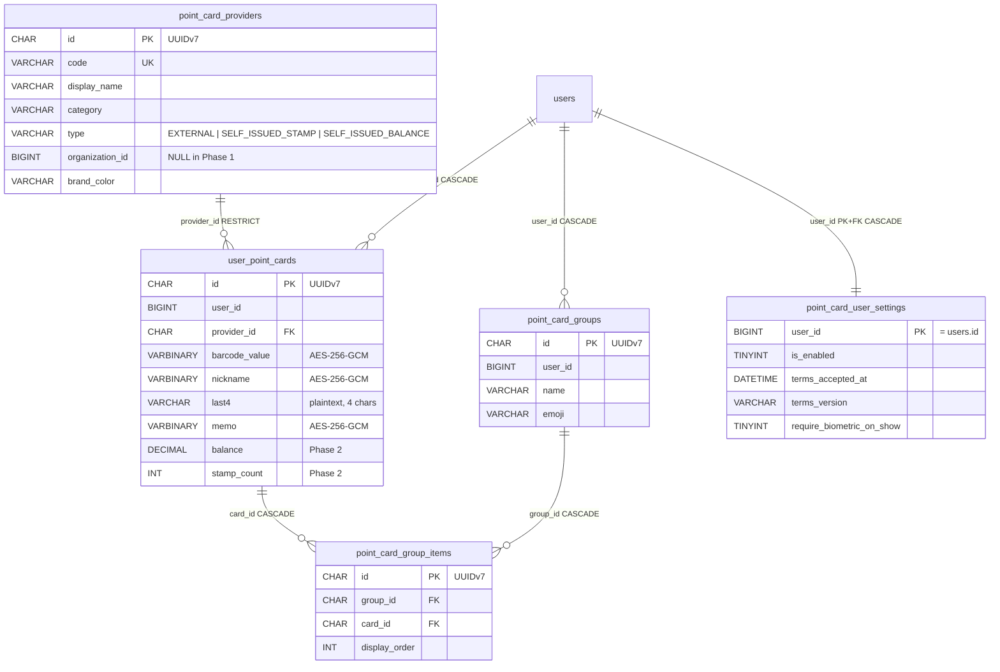

# F18: 個人ポイントカードウォレット

> **ステータス**: 🟢 設計確定
> **実装フェーズ**: Phase 1（MVP: 他社カード保管・グループ提示）/ Phase 2（拡張: organization 自店発行カード）
> **最終更新**: 2026-05-14
> **モジュール種別**: 個人ユーザー向け汎用機能
> **関連ドキュメント**: F01.6 プロフィールメディア / F10.3 監査ログ / F12.3 GDPR・個人情報管理 / F13 ストレージ統合 / F00 ContentVisibilityResolver（Phase 2 で参照可能性あり）

---

## 1. 概要

### 解決する課題

東急ハンズや大型量販店のレジで「東急ポイント / dポイント / 楽天ポイント / PayPay / Vポイント / Pontaポイント …」など複数のポイントカードを順次提示する手間がユーザーの体験を大きく損ねている。各社の公式アプリを 1 つずつ起動して画面遷移し、店員に見せ、次のカードへ切り替える操作はレジ前で焦りやすく、後ろの行列のプレッシャーも相まって ADHD 傾向のあるユーザーや高齢者には極めて困難である。

「複数のアプリ間を跳ね回って 1 枚ずつ提示する」状況を、**1 つの Mannschaft アプリ内で順番にスワイプするだけ**で完結できるようにする。これは「個人ポイントカードを 1 つの場所に集約し、シーン別（コンビニ・ドラッグストア・家電量販店など）にグループ化して一括提示できる」電子ウォレット機能である。

### ユーザー価値

| 対象 | 価値 |
|---|---|
| 一般ユーザー（個人） | 複数のポイントカードを 1 つのアプリにまとめ、レジ前で焦らずスワイプ提示。物理カードを財布から探す・各社アプリを切り替える手間ゼロ |
| ADHD 傾向のユーザー | 入力摩擦ゼロ・並び順自由・グループ別呼び出し対応で、レジ前パニックを回避 |
| 高齢者ユーザー | バーコード下に大きい数字番号表示・スクリーンリーダー対応で、視認性と聴覚アクセシビリティを担保 |
| organization 管理者（Phase 2） | 美容室・整骨院・カフェ等の自店ポイントカードを Mannschaft 内で発行・配布できる。顧客が「Mannschaft のウォレットに追加」するだけで運用開始 |

### v1 (Phase 1) の境界

- **対象は他社（外部事業者）のポイントカード**のみ。バーコード/QR を再描画して画面提示する**補助ツール**
- 公式アプリではないため、ポイント残高同期・付与申請・利用履歴取得は**しない**
- Phase 2 で organization が自店ポイントカードを発行する余地を**スキーマ・enum・カラムで先行確保**
- 個人スコープ専用（team / organization スコープでの共有はなし。Phase 2 でも自店発行プロバイダーの管理だけが organization スコープに乗る）
- iOS/Android のネイティブウォレットアプリ（Apple Wallet / Google Wallet）との連携は**v1 では行わない**

### 法的・規約上の前提

本機能はあくまで「ユーザーが自分で入力したバーコード/カード番号を画面再描画するもの」であり、各ポイント事業者の公式機能・契約に基づくものではない。利用に伴う一切の責任はユーザー本人にある旨を規約・ヘルプ・初回利用時モーダルで明示する（§9 セキュリティ・規約4項目参照）。

---

## 2. スコープ

### 対象ロール

| ロール | 操作可能な範囲 |
|---|---|
| SYSTEM_ADMIN | プロバイダーマスタの管理（CRUD）。個別ユーザーのカード内容は閲覧不可（暗号化のため SYSTEM_ADMIN も復号鍵を直接扱わない運用） |
| ADMIN（organization） | Phase 1: なし / Phase 2: 自組織の自店ポイントカードプロバイダーの発行・管理、スタンプ押印 |
| DEPUTY_ADMIN | Phase 2 で自店発行カードのスタンプ押印権限のみ（ADMIN 委任）|
| MEMBER（一般ユーザー） | 自分のウォレットの全操作（カード追加・編集・削除・グループ化・提示）|
| SUPPORTER | 自身のウォレット操作のみ（MEMBER と同等）|
| GUEST | 利用不可（全 API で 403） |

### 対象レベル

- [ ] 組織 (Organization) — Phase 1 では使用しない（Phase 2 で自店プロバイダー発行の文脈でのみ使用）
- [ ] チーム (Team) — 使用しない
- [x] 個人 (Personal) — Phase 1 の主スコープ。すべてのカードは `user_id` 単位で保管・参照される

### テンプレート推奨

| テンプレート | F18 | 備考 |
|---|---|---|
| 全テンプレート共通 | ○（個人設定でオプトイン） | Phase 1 はユーザー個人がトグルで有効化（規約同意必須）|
| 美容室・整骨院・カフェなどサービス業組織（Phase 2）| ○（自店発行を組織側で有効化）| Phase 2 で organization 側にスイッチを追加 |

> ウォレット機能の利用は `point_card_user_settings.is_enabled = TRUE` のオプトイン制。デフォルトは OFF。初回有効化時に規約同意（§9.2）と利用規約バージョンの記録を必須とする。

---

## 3. ユースケース

### UC-1: 初回利用・規約同意

1. ユーザーが「マイページ」→「ポイントカード」を開く
2. 初回はオンボーディング画面が表示される（4項目規約 §9.2 を全文スクロール + 個別チェック）
3. 同意ボタン押下で `PUT /api/v1/point-cards/settings` が `is_enabled=true, terms_accepted_at, terms_version` を保存
4. ウォレットホーム（カード一覧）に遷移

### UC-2: 他社カード追加（バーコードスキャン）

1. ウォレットホームから「+ 追加」ボタン
2. プロバイダー選択画面（`GET /api/v1/point-cards/providers` でカテゴリ別ピッカー表示）
3. プロバイダー選択後、「カメラで読み取り」または「手入力」を選択
4. カメラ読み取り（`@zxing/browser` ライブラリ使用）でバーコード/QR を 1 回スキャン
5. 確認画面で `barcode_value` / `barcode_format` / `last4` の確認、`nickname` / `memo` を任意入力
6. 「保存」で `POST /api/v1/point-cards` を呼び出し、サーバーで暗号化保存

### UC-3: 通常提示（個別カード）

1. ウォレットホームでお気に入りのカードタイル（`is_favorite=true` 優先表示）をタップ
2. 提示モード（全画面）に遷移
3. バーコードが大きく再描画される（`jsbarcode` 使用）
4. 画面下に大きい数字でカード番号（`last4` だけ大きく強調表示）
5. 自動的に Wake Lock API（フォールバック: `nosleep.js`）で画面が暗くならないようにする
6. スワイプで前後のカードに移動可能
7. 「使用済み」ボタンで `POST /api/v1/point-cards/{id}/used`、`last_used_at` を更新

### UC-4: グループ提示（東急ハンズ用 / コンビニ用 など）

1. ユーザーが「グループ」タブで「東急ハンズ用」グループを作成
2. グループに「東急ポイント / dポイント / 楽天ポイント / PayPay」など複数枚を追加（順序ドラッグ可）
3. 店頭で「東急ハンズ用」グループをタップ → 提示モード（連続スワイプ）に入る
4. 1 枚目（東急ポイント）を店員に見せる → スワイプで 2 枚目（dポイント）に切り替え → 順次
5. グループ提示開始時に `POINT_CARD_VIEWED` 監査ログを 1 件記録（カードごとではなくグループ単位で記録）

### UC-5: オフライン利用（圏外でも提示可能）

1. ウォレットを開くたびに IndexedDB へカード詳細（復号後の `barcode_value` / `nickname`）を保存
2. ローカル保存時に Web Crypto API（AES-GCM）で二重暗号化（鍵はメモリ上のみ、ログアウト時破棄）
3. 圏外でも IndexedDB から読み出して提示可能（7 日 TTL）
4. ログアウト時に IndexedDB を完全クリア

### UC-6: カード削除（永久削除）

1. カード詳細画面で「削除」ボタン
2. 確認モーダル「このカードを完全に削除します。元には戻せません」
3. `DELETE /api/v1/point-cards/{id}` を呼ぶ
4. サーバー側で物理削除（論理削除なし。個人機密のため）
5. `POINT_CARD_DELETED` 監査ログを記録（metadata: `provider_code`, `card_id` のみ。`barcode_value` は含めない）

### UC-7: 退会時の自動消去

1. ユーザーが GDPR 退会フローを実行（F12.3）
2. 30 日猶予期間終了後、`AccountPurgeService` が `users` を物理削除
3. `users` ON DELETE CASCADE で `user_point_cards` / `point_card_groups` / `point_card_group_items` / `point_card_user_settings` が自動連鎖削除

### UC-8（Phase 2）: organization が自店ポイントカードを発行

1. 美容室の ADMIN が「自店ポイントカード発行」画面を開く
2. プロバイダー基本情報（display_name, category, brand_color, logo, type=SELF_ISSUED_STAMP）を入力
3. `point_card_providers` に `organization_id = <店ID>, type = 'SELF_ISSUED_STAMP'` でレコード作成
4. 「お客様用 QR コード」を生成（ディープリンク `mannschaft://wallet/add?providerId={uuid}`）
5. 顧客が QR を読み取り → 自分のウォレットにカードが追加される（`user_point_cards.provider_id` にひも付け）
6. 店主が来店時にスタンプ押印 API を叩く → `stamp_count` がインクリメント

### UC-9（Phase 2）: 自店スタンプの押印

1. 顧客が来店時、店主がスマホで顧客のバーコードを読み取る（Phase 2 で店主向け押印画面実装）
2. `POST /api/v1/orgs/{orgId}/point-cards/{cardId}/stamps` を実行
3. `user_point_cards.stamp_count` が +1、`point_card_stamp_events` に履歴を記録（Phase 2 拡張テーブル）

---

## 4. ドメイン定義

### 4.1 カード種別 enum（`point_card_providers.type`）

| 値 | 説明 | Phase |
|---|---|---|
| `EXTERNAL` | 他社（外部事業者）が発行するポイントカード。Mannschaft はバーコードを再描画するだけで、残高・履歴は管理しない | Phase 1 |
| `SELF_ISSUED_STAMP` | organization が自店発行するスタンプカード（10 個押すと 1 杯無料など）| Phase 2 |
| `SELF_ISSUED_BALANCE` | organization が自店発行するチャージ型残高カード（プリペイド・電子マネー風）| Phase 2 |

### 4.2 カテゴリ enum（`point_card_providers.category`）

| 値 | 説明 |
|---|---|
| `RETAIL` | 家電・量販店（ヨドバシ・ビックカメラ・東急ハンズ等） |
| `CONVENIENCE` | コンビニ（セブン-イレブン・ファミマ・ローソン等） |
| `FOOD` | 飲食・カフェ・ファストフード |
| `TRANSPORT` | 交通系（Suica・PASMO 等は外部 IC のため対象外。あくまでポイント面のみ） |
| `OTHER` | その他（マイレージ・通販・サブスク等） |

### 4.3 バーコード形式 enum（`user_point_cards.barcode_format`）

| 値 | 説明 | レンダリングライブラリ |
|---|---|---|
| `CODE128` | 1 次元バーコード。最も汎用 | `jsbarcode` |
| `CODE39` | 1 次元バーコード | `jsbarcode` |
| `EAN13` | 13 桁の商業バーコード | `jsbarcode` |
| `EAN8` | 8 桁バーコード | `jsbarcode` |
| `JAN13` | 日本の JAN コード（EAN13 互換）| `jsbarcode` |
| `QR` | 2 次元 QR コード | `qrcode` |
| `PDF417` | 2 次元バーコード（航空券・運転免許証等） | `jsbarcode` 拡張 / 別途検討 |
| `ITF` | Interleaved 2 of 5 | `jsbarcode` |
| `NONE` | バーコードなし（カード番号のみ手書き提示する想定）| なし |

### 4.4 用語

| 用語 | 定義 |
|---|---|
| **プロバイダー** | カード発行事業者（東急ポイント・dポイント・楽天ポイント等。Phase 2 では organization も発行者になる） |
| **カード** | ユーザーが追加した個別のカードレコード（同じプロバイダーでも複数枚保持可。例: 家族用 / 自分用） |
| **グループ** | 「東急ハンズ用」「コンビニ用」のようなシーン単位のカード束。提示モードで連続スワイプ可能 |
| **提示モード** | フルスクリーン + Wake Lock + バーコード大表示 + スワイプの専用 UI |
| **last4** | カード番号の下 4 桁。識別用 UI 表示にのみ使用し、暗号化対象外（4 桁単独では特定不可） |

---

## 5. DB 設計

### 5.0 マスタ・シングルトン例外の判定章（CLAUDE.md 原則 6 準拠）

CLAUDE.md 原則 6 では、新規テーブルは **UUIDv7 主キー（CHAR(36) または BINARY(16)）** を必須とする。マスタ例外・シングルトン例外に該当するかを以下で判定する。

#### F18 新規 5 テーブルの分類

| テーブル | 行増加パターン | 判定 |
|---|---|---|
| `point_card_providers` | プロバイダーごとに 1 行（マスタ起動投入 + Phase 2 で自店発行が増加）| **通常 → UUIDv7**（運営マスタ + 自店発行で全テナント共通ではない）|
| `user_point_cards` | ユーザー × カードごとに増加 | **通常 → UUIDv7** |
| `point_card_groups` | ユーザー × グループごとに増加 | **通常 → UUIDv7** |
| `point_card_group_items` | ユーザー × グループ × カードごとに増加 | **通常 → UUIDv7** |
| `point_card_user_settings` | ユーザーごとに 1 行（PK = user_id）| **PK 自然キー（user_id）採用 — 例外**（既存 `users.id` BIGINT を 1:1 共有する設定テーブル）|

**結論**:
- `point_card_user_settings` は「ユーザー 1 人につき 1 行で必ず `users.id` と 1:1 対応する設定テーブル」であり、独立した UUID 主キーを持つ意味がない。`user_id` を PK 兼 FK として使う（シャーディング時も user_id と一緒に同じシャードに乗る前提）。
- 残り 4 テーブルは行が単調増加するため UUIDv7（CHAR(36)）+ `UuidV7Entity` 継承を適用する。

### 5.0.1 原則 7（AbstractTenantAwareRepository）適用判定

原則 7 は `organization_id` カラムを持つテーブル向け。F18 は **個人スコープ**（`user_id` 軸）のため原則 7 は不採用。代わりに**プロジェクト内独自の `AbstractUserOwnedRepository<T, ID>` パターン**を導入する（既存に同名インターフェースがなければ本機能で新設）:

```java
public interface AbstractUserOwnedRepository<T, ID> extends JpaRepository<T, ID> {
    List<T> findByUserId(Long userId);
    List<T> findByUserId(Long userId, Sort sort);
    Optional<T> findByIdAndUserId(ID id, Long userId);
    long countByUserId(Long userId);
}
```

> 既存に `AbstractUserOwnedRepository` パターンがプロジェクトに存在しない場合、本機能の S1 で導入する（先行する個人スコープ機能 F02.5 / F03.15 等で類似のメソッドを各 Repository が個別実装しているなら、共通基底に集約する余地）。実装着手時に既存基盤を再確認し、共通インフラとして抽出する判断は実装フェーズで行う。

### 5.0.2 暗号化方針

`user_point_cards` の `barcode_value` / `nickname` / `memo` を **AES-256-GCM** で暗号化する。実装には既存の `EncryptedStringConverter`（F09.15・F14.2 等で使用済み）を再利用する:

```java
@Convert(converter = EncryptedStringConverter.class)
@Column(name = "barcode_value", columnDefinition = "VARBINARY(1024)")
private String barcodeValue;
```

- 鍵管理は環境変数 `MANNSCHAFT_ENCRYPTION_KEY_VERSION_1` を用いる既存方式に従う
- DB 上の型は **VARBINARY**（暗号化済み IV + ciphertext + auth tag のバイナリ）
- **Blind Index は作らない**（カード番号で検索する機能を作らない方針）
- `last4` は平文 VARCHAR(4) として別カラムで保持（UI 識別用。4 桁では特定不可）

### 5.1 `point_card_providers`（プロバイダーマスタ + Phase 2 自店発行）

| カラム名 | 型 | NULL | デフォルト | 説明 |
|---|---|---|---|---|
| `id` | CHAR(36) | NO | UUIDv7 | PK |
| `code` | VARCHAR(50) | NO | — | 一意コード（`tokyu_point`, `dpoint`, `rakuten` 等。Phase 2 では `org_{orgId}_xxx` 命名）|
| `display_name` | VARCHAR(100) | NO | — | 表示名（例: 「東急ポイント」） |
| `category` | VARCHAR(20) | NO | — | カテゴリ enum（`RETAIL` / `CONVENIENCE` / `FOOD` / `TRANSPORT` / `OTHER`）|
| `type` | VARCHAR(30) | NO | 'EXTERNAL' | カード種別 enum（`EXTERNAL` / `SELF_ISSUED_STAMP` / `SELF_ISSUED_BALANCE`）|
| `organization_id` | BIGINT UNSIGNED | YES | NULL | Phase 1 では常に NULL。Phase 2 で自店発行プロバイダーの所属組織を設定 |
| `logo_url` | VARCHAR(500) | YES | NULL | R2 オブジェクトキー（Cloudflare R2、F13 連携） |
| `brand_color` | CHAR(7) | YES | NULL | ブランドカラー（`#E60012` 等）。UI のカードタイル背景に使用 |
| `default_barcode_format` | VARCHAR(20) | YES | NULL | 既定のバーコード形式（`CODE128` 等）。手入力時のフォーム初期値 |
| `card_number_regex` | VARCHAR(200) | YES | NULL | カード番号の正規表現（例: `^[0-9]{13}$`）。手入力バリデーション用 |
| `card_number_length_hint` | VARCHAR(50) | YES | NULL | UI に表示するヒント（例: 「13 桁の数字」） |
| `is_active` | TINYINT(1) | NO | 1 | プロバイダーが利用可能か（運営側で停止可能） |
| `legal_notice` | TEXT | YES | NULL | 各プロバイダー固有の注意書き（多言語キー or 日本語デフォルト）。Phase 1.1 で i18n 化検討 |
| `created_at` | DATETIME(6) | NO | CURRENT_TIMESTAMP(6) | |
| `updated_at` | DATETIME(6) | NO | CURRENT_TIMESTAMP(6) ON UPDATE | |

**インデックス**

```sql
UNIQUE KEY uq_pcp_code (code)
INDEX idx_pcp_category_active (category, is_active)
INDEX idx_pcp_type_org (type, organization_id)            -- Phase 2 自店発行検索用
```

**制約**

```sql
CONSTRAINT chk_pcp_type_org_consistency CHECK (
    (type = 'EXTERNAL' AND organization_id IS NULL)
    OR (type IN ('SELF_ISSUED_STAMP', 'SELF_ISSUED_BALANCE') AND organization_id IS NOT NULL)
)
```

> Phase 1 では `type='EXTERNAL'` 行のみが Seed 投入される（V9.141）。`organization_id` カラムを最初から用意することで、Phase 2 で organization が自店発行する際に**スキーマ破壊的変更なし**で受け入れられる。

**FK 方針**

- `organization_id` は **クロスドメイン弱参照**。FK は張らず INDEX のみ（CLAUDE.md 原則 1 準拠）
- Phase 2 で organization が削除されたときの自店プロバイダーの扱いは「`is_active = 0` に強制 + 親 organization 行に `ON DELETE CASCADE` 相当のアプリ層削除イベント」で対応する（クロスドメイン CASCADE は禁止のため、`OrganizationDeletedEvent` を購読して S6 で対応）

### 5.2 `user_point_cards`（ユーザー保有カード）

| カラム名 | 型 | NULL | デフォルト | 説明 |
|---|---|---|---|---|
| `id` | CHAR(36) | NO | UUIDv7 | PK |
| `user_id` | BIGINT UNSIGNED | NO | — | カード所有者（FK → users.id ON DELETE CASCADE）|
| `provider_id` | CHAR(36) | NO | — | プロバイダー（FK → point_card_providers.id ON DELETE RESTRICT）|
| `nickname` | VARBINARY(1024) | YES | NULL | **AES-256-GCM 暗号化**: 任意ニックネーム（例: 「ヨドバシ家族用」） |
| `barcode_value` | VARBINARY(1024) | NO | — | **AES-256-GCM 暗号化**: バーコードの数値文字列（カード番号） |
| `barcode_format` | VARCHAR(20) | NO | 'CODE128' | バーコード形式 enum |
| `last4` | VARCHAR(4) | YES | NULL | カード番号下 4 桁（平文、UI 識別用。4 桁単独では特定不可、INDEX なし）|
| `memo` | VARBINARY(2048) | YES | NULL | **AES-256-GCM 暗号化**: 任意メモ |
| `is_favorite` | TINYINT(1) | NO | 0 | お気に入り（一覧で上位表示） |
| `display_order` | INT UNSIGNED | NO | 0 | 表示順序（ユーザーがドラッグで設定） |
| `balance` | DECIMAL(12,2) | YES | NULL | **Phase 2 用**: チャージ型残高（Phase 1 では常に NULL）|
| `stamp_count` | INT UNSIGNED | YES | NULL | **Phase 2 用**: スタンプ数（Phase 1 では常に NULL）|
| `last_used_at` | DATETIME(6) | YES | NULL | 直近使用日時（`POST /used` で更新） |
| `created_at` | DATETIME(6) | NO | CURRENT_TIMESTAMP(6) | |
| `updated_at` | DATETIME(6) | NO | CURRENT_TIMESTAMP(6) ON UPDATE | |

**インデックス**

```sql
INDEX idx_upc_user_favorite (user_id, is_favorite, display_order)   -- お気に入り優先一覧
INDEX idx_upc_user_last_used (user_id, last_used_at DESC)            -- 直近使った順
INDEX idx_upc_provider (provider_id)                                 -- プロバイダー削除前の参照件数チェック用
```

**制約**

- 物理削除のみ（論理削除なし）— カード番号は個人機密のため、`deleted_at` で残しておく価値がない（F12.3 ポリシー準拠）
- `last4` には INDEX を作らない（検索する機能を作らない方針 = 攻撃面減少）

**FK 方針**

- `user_id` → `users.id` **ON DELETE CASCADE**（同一「個人スコープ」ドメイン内とみなす — CLAUDE.md 原則 2 の判定で、退会時にユーザー個人データが連鎖削除されるべきテーブルとして許可される）
- `provider_id` → `point_card_providers.id` **ON DELETE RESTRICT**（プロバイダーが消えるとカードが孤立するため、運営側はプロバイダー削除前にカード数を確認）

**Java Entity**

```java
@PersonalData(category = "point_cards")    // F12.3 GDPR 連携
@Entity
@Table(name = "user_point_cards")
public class UserPointCardEntity extends UuidV7Entity {
    @Column(name = "user_id", nullable = false)
    private Long userId;

    @Column(name = "provider_id", nullable = false, columnDefinition = "CHAR(36)")
    private UUID providerId;

    @Convert(converter = EncryptedStringConverter.class)
    @Column(name = "nickname", columnDefinition = "VARBINARY(1024)")
    private String nickname;

    @Convert(converter = EncryptedStringConverter.class)
    @Column(name = "barcode_value", nullable = false, columnDefinition = "VARBINARY(1024)")
    private String barcodeValue;

    @Column(name = "barcode_format", nullable = false, length = 20)
    @Enumerated(EnumType.STRING)
    private BarcodeFormat barcodeFormat;

    @Column(name = "last4", length = 4)
    private String last4;

    @Convert(converter = EncryptedStringConverter.class)
    @Column(name = "memo", columnDefinition = "VARBINARY(2048)")
    private String memo;

    @Column(name = "is_favorite", nullable = false)
    private boolean favorite;

    @Column(name = "display_order", nullable = false)
    private int displayOrder;

    // Phase 2 用（Phase 1 は常に null）
    @Column(name = "balance", precision = 12, scale = 2)
    private BigDecimal balance;

    @Column(name = "stamp_count")
    private Integer stampCount;

    @Column(name = "last_used_at")
    private OffsetDateTime lastUsedAt;
}
```

**Repository**

```java
public interface UserPointCardRepository
    extends AbstractUserOwnedRepository<UserPointCardEntity, UUID> {

    @Query("SELECT c FROM UserPointCardEntity c WHERE c.userId = :userId "
         + "ORDER BY c.favorite DESC, c.displayOrder ASC, c.createdAt DESC")
    List<UserPointCardEntity> findAllOrdered(@Param("userId") Long userId);

    long countByUserId(Long userId);   // 上限 200 件チェック用
}
```

### 5.3 `point_card_groups`（カードグループ）

| カラム名 | 型 | NULL | デフォルト | 説明 |
|---|---|---|---|---|
| `id` | CHAR(36) | NO | UUIDv7 | PK |
| `user_id` | BIGINT UNSIGNED | NO | — | グループ所有者（FK → users.id ON DELETE CASCADE）|
| `name` | VARCHAR(64) | NO | — | グループ名（例: 「東急ハンズ用」） |
| `emoji` | VARCHAR(8) | YES | NULL | 絵文字 1 文字（UTF-8 で 4 バイト想定。表示装飾用） |
| `display_order` | INT UNSIGNED | NO | 0 | グループ一覧の表示順 |
| `created_at` | DATETIME(6) | NO | CURRENT_TIMESTAMP(6) | |
| `updated_at` | DATETIME(6) | NO | CURRENT_TIMESTAMP(6) ON UPDATE | |

**インデックス**

```sql
INDEX idx_pcg_user (user_id, display_order)
```

> グループ名・絵文字は暗号化対象外（PII ではなくシーン名のため）。`name` 上限 64 文字 / `emoji` 上限 8 バイト。

### 5.4 `point_card_group_items`（グループ ↔ カードの中間テーブル）

| カラム名 | 型 | NULL | デフォルト | 説明 |
|---|---|---|---|---|
| `id` | CHAR(36) | NO | UUIDv7 | PK |
| `group_id` | CHAR(36) | NO | — | FK → point_card_groups.id **ON DELETE CASCADE**（同ドメイン内）|
| `card_id` | CHAR(36) | NO | — | FK → user_point_cards.id **ON DELETE CASCADE**（同ドメイン内）|
| `display_order` | INT UNSIGNED | NO | 0 | グループ内の提示順 |
| `created_at` | DATETIME(6) | NO | CURRENT_TIMESTAMP(6) | |

**インデックス・制約**

```sql
UNIQUE KEY uq_pcgi_group_card (group_id, card_id)   -- 同じカードは同グループ内に 1 回のみ
INDEX idx_pcgi_group_order (group_id, display_order)
INDEX idx_pcgi_card (card_id)                        -- カード削除時の中間テーブル整理用
```

### 5.5 `point_card_user_settings`（ユーザー設定）

| カラム名 | 型 | NULL | デフォルト | 説明 |
|---|---|---|---|---|
| `user_id` | BIGINT UNSIGNED | NO | — | PK 兼 FK（→ users.id ON DELETE CASCADE）|
| `is_enabled` | TINYINT(1) | NO | 0 | 機能の有効化（オプトイン） |
| `terms_accepted_at` | DATETIME(6) | YES | NULL | 規約同意日時 |
| `terms_version` | VARCHAR(20) | YES | NULL | 同意した規約のバージョン（`v1.0.0` 等） |
| `require_biometric_on_show` | TINYINT(1) | NO | 0 | 提示モード起動前に WebAuthn 再認証を要求するか |
| `created_at` | DATETIME(6) | NO | CURRENT_TIMESTAMP(6) | |
| `updated_at` | DATETIME(6) | NO | CURRENT_TIMESTAMP(6) ON UPDATE | |

> 主キーが `user_id` の 1:1 設定テーブルなので **§5.0 例外区分（PK 自然キー）** を適用。UUIDv7 主キーは持たない。

### 5.6 ER 図



**FK 方針まとめ**

| FK 関係 | 種別 | ON DELETE | 根拠 |
|---|---|---|---|
| `user_point_cards.user_id → users.id` | クロスドメイン弱参照に見えるが、退会時の連鎖削除を物理保証する必要がある | CASCADE | F12.3 GDPR 物理削除ポリシー準拠。ユーザー個人機密として連鎖削除 |
| `user_point_cards.provider_id → point_card_providers.id` | 同一機能内（共にウォレットドメイン）| RESTRICT | プロバイダー孤児防止。運営側は事前にカード数を確認 |
| `point_card_groups.user_id → users.id` | 同上 | CASCADE | 同上 |
| `point_card_group_items.group_id → point_card_groups.id` | 同一機能内 | CASCADE | 同ドメイン内 CASCADE 許可 |
| `point_card_group_items.card_id → user_point_cards.id` | 同一機能内 | CASCADE | 同ドメイン内 CASCADE 許可 |
| `point_card_user_settings.user_id → users.id` | 同上 | CASCADE | 1:1 設定の連鎖削除 |
| `point_card_providers.organization_id → organizations.id` | クロスドメイン | **FK なし**（INDEX のみ）| CLAUDE.md 原則 1。Phase 2 で `OrganizationDeletedEvent` で対応 |

---

## 6. API 設計

### 6.1 エンドポイント一覧（14 本）

| メソッド | パス | 認可 | 用途 |
|---|---|---|---|
| GET | `/api/v1/point-cards/providers` | MEMBER | プロバイダー一覧（category フィルタ、is_active=true のみ）|
| GET | `/api/v1/point-cards` | MEMBER | 自分のカード一覧（last4 のみ返却、barcode_value は返さない）|
| POST | `/api/v1/point-cards` | MEMBER | カード追加 |
| GET | `/api/v1/point-cards/{id}` | MEMBER | カード詳細（復号値を含む。提示時に呼ばれる）|
| PATCH | `/api/v1/point-cards/{id}` | MEMBER | カード更新（nickname / memo / is_favorite / display_order 等）|
| DELETE | `/api/v1/point-cards/{id}` | MEMBER | カード削除（物理削除）|
| POST | `/api/v1/point-cards/{id}/used` | MEMBER | 「使用済み」記録（last_used_at 更新）|
| GET | `/api/v1/point-cards/groups` | MEMBER | グループ一覧（カード ID リストのみ）|
| POST | `/api/v1/point-cards/groups` | MEMBER | グループ作成 |
| GET | `/api/v1/point-cards/groups/{id}` | MEMBER | グループ詳細（カード復号値を JOIN FETCH で 1 回 SQL で返却）|
| PATCH | `/api/v1/point-cards/groups/{id}` | MEMBER | グループ更新（name / emoji / カード並び替え・追加・削除）|
| DELETE | `/api/v1/point-cards/groups/{id}` | MEMBER | グループ削除（中間テーブルが CASCADE で消える）|
| GET | `/api/v1/point-cards/settings` | MEMBER | ユーザー設定取得（is_enabled / terms_accepted_at 等）|
| PUT | `/api/v1/point-cards/settings` | MEMBER | ユーザー設定更新（オプトイン・規約同意・WebAuthn 要求設定）|

> **Phase 2 で追加予定の API**: `POST /api/v1/orgs/{orgId}/point-cards` (organization が自店プロバイダー発行), `POST /api/v1/orgs/{orgId}/point-cards/{cardId}/stamps` (スタンプ押印), `POST /api/v1/orgs/{orgId}/point-cards/{cardId}/balance-events` (チャージ・引き落とし) など。

### 6.2 主要エンドポイント仕様

#### GET `/api/v1/point-cards/providers`

**認可**: 認証済みユーザー（MEMBER 以上）

**クエリパラメータ**

| パラメータ | 型 | 説明 |
|---|---|---|
| `category` | String | カテゴリで絞り込み（`RETAIL` 等。省略時は全件） |
| `q` | String | display_name の部分一致検索（任意。最大 50 文字） |

**レスポンス（200 OK）**

```json
{
  "data": [
    {
      "id": "01928a3e-4b2f-7a8c-9d12-...",
      "code": "tokyu_point",
      "display_name": "東急ポイント",
      "category": "RETAIL",
      "type": "EXTERNAL",
      "logo_url": "https://r2-cdn.../providers/tokyu_point.png?sig=...",
      "brand_color": "#E60012",
      "default_barcode_format": "CODE128",
      "card_number_length_hint": "16 桁の数字",
      "legal_notice": "本機能は東急株式会社の公式アプリではありません..."
    }
  ]
}
```

> `is_active=false` のレコードは返さない。`type='SELF_ISSUED_*'` のレコードも Phase 1 ではフィルタアウト（Phase 2 で `organization_id` でフィルタするバリアントを追加）。

#### POST `/api/v1/point-cards`

**認可**: MEMBER（本人のみ。`point_card_user_settings.is_enabled = true` 必須）

**リクエスト**

```json
{
  "provider_id": "01928a3e-4b2f-7a8c-9d12-...",
  "barcode_value": "1234567890123",
  "barcode_format": "CODE128",
  "nickname": "ヨドバシ家族用",
  "memo": "妻と共用",
  "is_favorite": false
}
```

**バリデーション**

- `barcode_value`: 必須、1〜100 文字
- `provider_id`: 必須、`point_card_providers` に存在し `is_active=true`
- プロバイダーに `card_number_regex` がある場合はそれで `barcode_value` を検証
- 同一 user の既存カード数が **200 件未満**（GDPR_009 相当の上限超過エラーを返却）
- `nickname`: 任意、1〜100 文字
- `memo`: 任意、1〜500 文字

**副作用**

1. `barcode_value` の下 4 桁を抽出して `last4` に格納
2. `nickname` / `barcode_value` / `memo` を `EncryptedStringConverter` 経由で暗号化保存
3. 監査ログ `POINT_CARD_CREATED` 発火（metadata: `{"provider_code": "tokyu_point", "card_id": "<uuid>"}`）— `barcode_value` は含めない

**レスポンス（201 Created）**

```json
{
  "data": {
    "id": "01928a3e-...",
    "provider_id": "01928a3e-4b2f-...",
    "provider_code": "tokyu_point",
    "provider_display_name": "東急ポイント",
    "last4": "0123",
    "barcode_format": "CODE128",
    "nickname": "ヨドバシ家族用",
    "is_favorite": false,
    "created_at": "2026-05-14T09:00:00+09:00"
  }
}
```

> 201 レスポンスには `barcode_value` の平文は返さない（DRY: 詳細 API で再取得させる方針）。

#### GET `/api/v1/point-cards`

**認可**: MEMBER

**クエリパラメータ**

| パラメータ | 型 | 説明 |
|---|---|---|
| `group_id` | UUID | 指定すると当該グループに属するカードのみ返す（任意）|
| `favorite` | Boolean | true で `is_favorite=true` のみ |

**レスポンス（200 OK）**

```json
{
  "data": [
    {
      "id": "01928a3e-...",
      "provider_id": "01928a3e-4b2f-...",
      "provider_code": "tokyu_point",
      "provider_display_name": "東急ポイント",
      "provider_logo_url": "https://r2-cdn.../...",
      "provider_brand_color": "#E60012",
      "last4": "0123",
      "barcode_format": "CODE128",
      "nickname": "ヨドバシ家族用",
      "is_favorite": true,
      "display_order": 0,
      "last_used_at": "2026-05-13T12:30:00+09:00"
    }
  ]
}
```

> **重要**: `barcode_value` および `memo` は一覧では**返さない**（漏洩リスク最小化）。詳細 API で初めて復号して返す。

#### GET `/api/v1/point-cards/{id}`

**認可**: MEMBER（`currentUser.id == card.user_id` 必須）

**レスポンス（200 OK）**

```json
{
  "data": {
    "id": "01928a3e-...",
    "provider": { /* プロバイダー情報フル */ },
    "barcode_value": "1234567890123",
    "barcode_format": "CODE128",
    "last4": "0123",
    "nickname": "ヨドバシ家族用",
    "memo": "妻と共用",
    "is_favorite": true,
    "display_order": 0,
    "last_used_at": "2026-05-13T12:30:00+09:00",
    "created_at": "2026-05-01T10:00:00+09:00"
  }
}
```

> **IDOR 防御**: Repository 層では `findByIdAndUserId(id, userId)` のみ使用。Service 層も `currentUser.id == card.user_id` を二重チェック。他人のカードに到達できない。

#### GET `/api/v1/point-cards/groups/{id}`

**認可**: MEMBER（自分のグループのみ）

**レスポンス（200 OK）**

```json
{
  "data": {
    "id": "01928a3e-...",
    "name": "東急ハンズ用",
    "emoji": "🛍️",
    "items": [
      {
        "card_id": "01928a3e-...",
        "display_order": 0,
        "provider_code": "tokyu_point",
        "provider_display_name": "東急ポイント",
        "provider_logo_url": "...",
        "provider_brand_color": "#E60012",
        "barcode_value": "1234567890123",
        "barcode_format": "CODE128",
        "last4": "0123",
        "nickname": "ヨドバシ家族用"
      }
    ]
  }
}
```

**N+1 回避**: 実装は以下の 1 SQL で取得する。

```java
@Query("""
    SELECT NEW com.mannschaft.app.pointcard.dto.GroupItemView(
        gi.cardId, gi.displayOrder,
        c.barcodeValue, c.barcodeFormat, c.last4, c.nickname,
        p.code, p.displayName, p.logoUrl, p.brandColor
    )
    FROM PointCardGroupItemEntity gi
    JOIN UserPointCardEntity c ON gi.cardId = c.id
    JOIN PointCardProviderEntity p ON c.providerId = p.id
    WHERE gi.groupId = :groupId
      AND c.userId = :userId
    ORDER BY gi.displayOrder ASC
    """)
List<GroupItemView> findGroupItemsJoined(@Param("groupId") UUID groupId, @Param("userId") Long userId);
```

> JOIN FETCH 相当を JPQL コンストラクタ式で実現し、暗号化フィールドは `EncryptedStringConverter` が個別行ロード時に透過的に復号する。グループ単位での監査ログ `POINT_CARD_VIEWED` は **Controller の入口で 1 件のみ記録**（カード件数を metadata に持つ。グループ全カード分の N 件記録は爆発防止のため行わない）。

#### POST `/api/v1/point-cards/{id}/used`

**認可**: MEMBER（自分のカードのみ）

**リクエストボディ**: 空

**副作用**

- `user_point_cards.last_used_at = NOW()` を更新
- 監査ログは**記録しない**（呼び出し頻度が高いため。`POINT_CARD_VIEWED` で代替）
- レートリミット 600 req/h（10 件/分）

**レスポンス（204 No Content）**

#### バリデーション上限・レートリミット一覧

| 操作 | 上限 / レート |
|---|---|
| カード総数 | 200 / user |
| グループ総数 | 50 / user |
| グループ内カード数 | 20 / group |
| カード作成 | 30 / hour |
| グループ作成 | 30 / hour |
| `/used` | 600 / hour（10 / min）|
| `/providers` 取得 | 60 / min |
| `/point-cards/{id}` 詳細取得 | 120 / min |

### 6.3 エラーコード

| コード | HTTP | メッセージ | 発生条件 |
|---|---|---|---|
| `POINT_CARD_001` | 403 | ウォレット機能が有効化されていません | `is_enabled=false` または規約未同意 |
| `POINT_CARD_002` | 400 | カード番号がプロバイダーの形式と一致しません | `card_number_regex` 不一致 |
| `POINT_CARD_003` | 409 | カード保有上限（200 枚）に達しています | 上限超過 |
| `POINT_CARD_004` | 409 | グループ作成上限（50 個）に達しています | 上限超過 |
| `POINT_CARD_005` | 409 | グループ内カード数上限（20 枚）に達しています | 上限超過 |
| `POINT_CARD_006` | 404 | カードが見つかりません | 他人のカード ID または存在しない ID |
| `POINT_CARD_007` | 404 | プロバイダーが見つかりません | `provider_id` 不正または `is_active=false` |
| `POINT_CARD_008` | 429 | レートリミット超過 | Bucket4j |
| `POINT_CARD_009` | 401 | 生体認証が必要です | `require_biometric_on_show=true` で WebAuthn 未通過 |

---

## 7. ビジネスロジック

### 7.1 オプトイン状態機械（規約同意フロー）

```
[初回アクセス] is_enabled=false, terms_accepted_at=null
    ↓ ユーザーが「ウォレットを有効化」をタップ
[規約 4 項目を全文スクロール + 個別チェック]
    ↓ 同意ボタン押下
PUT /settings { is_enabled: true, terms_version: "v1.0.0" }
    ↓
[有効化済み] is_enabled=true, terms_accepted_at=NOW(), terms_version="v1.0.0"
    ↓ ユーザーが「ウォレットを無効化」を選択（任意）
PUT /settings { is_enabled: false }
    ↓
[無効化済み — カード/グループはサーバー上に残るがアクセス不可]
```

> 無効化された状態でも `user_point_cards` レコードは物理削除しない（再度有効化すれば復元される）。完全削除したい場合は退会か個別カード削除 API を使う。

### 7.2 カード追加フロー（バーコードスキャン）

```
1. ユーザーがカメラを起動（フロント @zxing/browser）
2. バーコードを 1 回スキャン → barcode_value + barcode_format 取得
3. プロバイダーピッカーで対応する provider_id を選択
4. 確認画面で nickname / memo を任意入力
5. POST /api/v1/point-cards
6. サーバー: provider.card_number_regex で barcode_value 検証
7. サーバー: AES-256-GCM で暗号化 → INSERT
8. last4 = barcode_value.slice(-4) を平文で別途格納
9. AuditLogService.record(POINT_CARD_CREATED, ...)
```

### 7.3 グループ提示モード（連続スワイプ）

```
1. ユーザーが「東急ハンズ用」グループをタップ
2. GET /api/v1/point-cards/groups/{id} で全カードを 1 回 SQL で取得
3. Controller 入口で AuditLogService.record(POINT_CARD_VIEWED,
       metadata={"group_id": "...", "card_count": 4})
4. クライアント: ProvideView 全画面遷移、Wake Lock 取得
5. 1 枚目バーコード描画（jsbarcode）
6. ユーザーがスワイプ → 2 枚目に切り替え（クライアント側のみで切り替え。サーバーアクセスなし）
7. 最終カードまで進めた後、「終了」で全画面解除、Wake Lock 解放
```

> グループ単位での監査ログ記録は 1 件で十分（カードごとに記録するとログ爆発する）。`POINT_CARD_VIEWED` の metadata に `card_count` を入れて「○ 枚を一括提示した」事実を記録する。

### 7.4 オフライン対応（IndexedDB 二重暗号化）

```
1. ユーザーが GET /api/v1/point-cards/groups/{id} を呼ぶたびに、
   レスポンスを IndexedDB に保存
2. 保存時に Web Crypto API（AES-GCM）で二重暗号化
   - 鍵はログイン時にメモリ上で生成（PBKDF2(userId + sessionSecret)）
   - ログアウト時に鍵を破棄 + IndexedDB の全レコードを削除
3. 保存期限 7 日（TTL）。期限切れレコードは取得時にスキップ
4. 圏外でも IndexedDB からカード詳細を取り出して提示可能
5. オンライン復帰時に再フェッチして上書き更新
```

> IndexedDB の鍵管理はメモリ上のみで揮発させる。端末紛失時にブラウザストレージが取り出されても、鍵がメモリにないため復号不可能（実用上の改ざん耐性は限定的だが、即時アクセス制限としては有効）。リモートワイプは v1 範囲外。

### 7.5 Phase 2 拡張時のシミュレーション

Phase 2 で organization が自店ポイントカードを発行する際の流れ:

1. ADMIN が `POST /api/v1/orgs/{orgId}/point-cards` を叩く
   ```json
   { "display_name": "サロン○○ ポイント",
     "category": "OTHER",
     "type": "SELF_ISSUED_STAMP",
     "logo_url": "...",
     "brand_color": "#FF6699" }
   ```
2. サーバーは `point_card_providers` に
   `organization_id=<orgId>, type='SELF_ISSUED_STAMP'`
   で INSERT。`code` は `org_<orgId>_<slug>` で自動生成。
3. ADMIN は「お客様用 QR コード」を取得（ディープリンク `mannschaft://wallet/add?providerId=<uuid>`）
4. 顧客がアプリで QR 読み取り → `POST /api/v1/point-cards` を内部的に呼ぶ
   （Phase 1 の API がそのまま動作する。`provider_id` が `SELF_ISSUED_STAMP` でも問題なく動く）
5. 店主がスタンプ押印 API（Phase 2 新規）を叩く
   ```
   POST /api/v1/orgs/{orgId}/point-cards/{cardId}/stamps
   { "delta": 1 }
   ```
   → `user_point_cards.stamp_count += 1`、`point_card_stamp_events` に履歴記録
6. 顧客側 UI: `stamp_count` の値を見て「○/10 個」表示

**Phase 1 設計が Phase 2 を破壊しないことの検証**:

| 項目 | Phase 1 状態 | Phase 2 で追加されるもの | 既存 Phase 1 データへの影響 |
|---|---|---|---|
| `point_card_providers.type` | `EXTERNAL` のみ | `SELF_ISSUED_STAMP` / `SELF_ISSUED_BALANCE` 値追加 | enum 値が増えるのみ。既存行は EXTERNAL のまま |
| `point_card_providers.organization_id` | 常に NULL | NOT NULL 制約は付けない（EXTERNAL 行があるため）。CHECK で type と整合 | Phase 1 行は NULL のまま |
| `user_point_cards.balance` / `stamp_count` | 常に NULL | Phase 2 で値が入る | Phase 1 行は NULL のまま |
| API `POST /point-cards` | EXTERNAL のみ受け入れ | SELF_ISSUED_* の `provider_id` でも動作 | 既存 API シグネチャ無変更 |
| 新規 API（スタンプ押印・残高チャージ）| 存在しない | Phase 2 で追加 | Phase 1 API 無変更 |

結論: **Phase 1 のスキーマ・API は Phase 2 で破壊的変更なし**。

---

## 8. UI / UX 設計

### 8.1 ページ構成

```
app/pages/wallet/
├── index.vue                 # ウォレットホーム（カード一覧・お気に入り・グループ入口）
├── cards/
│   ├── new.vue               # カード追加（プロバイダー選択 → スキャン or 手入力）
│   └── [id].vue              # カード詳細（編集・削除・提示）
├── groups/
│   ├── [id].vue              # グループ編集（メンバー追加・並び替え）
│   └── [id]/show.vue         # グループ提示モード（全画面スワイプ）
└── settings.vue              # 有効化トグル・規約同意・WebAuthn 設定
```

### 8.2 コンポーネント構成

```
app/components/wallet/
├── ProviderPicker.vue          # プロバイダー選択（カテゴリ別・検索可能）
├── BarcodeCapture.vue          # カメラスキャン（@zxing/browser）
├── BarcodePreview.vue          # バーコード描画（jsbarcode / qrcode）
├── CardTile.vue                # ウォレットホームの個別カードタイル
├── GroupTile.vue               # グループタイル
├── PresentationView.vue        # 全画面提示モード（Wake Lock + スワイプ）
└── TermsAcceptModal.vue        # 規約同意モーダル（4 項目・スクロール検知）
```

### 8.3 採用ライブラリ

| ライブラリ | バージョン | 用途 |
|---|---|---|
| `jsbarcode` | `^3.x` | 1D バーコード描画（CODE128 / CODE39 / EAN13 / EAN8 / JAN13 / ITF）|
| `qrcode` | `^1.5.4` | QR コード描画（既存導入済み）|
| `@zxing/browser` | `^0.1.5` | カメラからのバーコード/QR 読み取り（既存導入済み）|
| `nosleep.js` | `^0.12.x` | Wake Lock API フォールバック（iOS Safari 等で Wake Lock API 未サポートのため）|

> PDF417 は `jsbarcode` 単体では対応しない。Phase 1 では事実上の利用例が少ないため後回し可。S1 で実装着手時に対応ライブラリを選定する。

### 8.4 提示モードの UX 要件

| 要件 | 実装 |
|---|---|
| 画面を暗くしない | Wake Lock API（Chrome / 一部 Safari）+ `nosleep.js` フォールバック |
| バーコード下に大きい数字 | `last4` だけ大きく強調 + 全桁を 1 段下に小さく表示 |
| スワイプで前後カード切替 | `vue-touch` 系で左右スワイプ検知 |
| 連続提示の進捗表示 | 「2 / 4」のページインジケータ |
| スクリーンキャプチャ警告 | 提示モード入る前に「スクリーンショット撮影は OS の制約により完全には防げません。撮影しないでください」と注意モーダル |
| 戻る | 左上 × ボタン or システム戻るボタンで終了 |
| 提示終了で `last_used_at` 更新 | 全画面終了時に `POST /point-cards/{id}/used` を背景で送信 |

### 8.5 アクセシビリティ

- バーコード SVG に `aria-label` でカード番号を読み上げ可能化
- 高コントラスト: `brand_color` の WCAG AA コントラスト自動判定（背景色から文字色を黒/白に自動切替）
- カード番号は最低 32 px のフォントサイズで表示
- スクリーンリーダー向けに「東急ポイント、カード番号 1234567890 0123、お気に入り」のような完全読み上げ対応
- 色覚多様性: プロバイダー識別はロゴ・名前で行い、`brand_color` のみに依存しない

### 8.6 ダークパターン回避

- 「すべて同意」ボタンを設けず、4 項目を個別チェック
- デフォルト未チェック・ボタン非活性は同意確認できるまで維持
- 「機能を無効化する」リンクを設定画面の上部に常設（隠さない）
- 規約変更時は再同意フローを強制（`terms_version` 不一致で `POINT_CARD_001` を返却）

### 8.7 i18n

- ロケールファイル `frontend/app/locales/{ja,en,zh,ko,es,de}/wallet.json` を新設
- 主要キー: `wallet.welcome` / `wallet.add_card` / `wallet.present` / `wallet.groups` / `wallet.terms.*` / `wallet.errors.*`
- 全 6 言語対応。Phase 1.0 は日本語完全 + 英語完全、他言語は日本語フォールバック
- Phase 1.1 で `point_card_providers.legal_notice` の多言語化対応

---

## 9. セキュリティ

### 9.1 脅威モデル

| 脅威 | 対策 |
|---|---|
| DB 侵害でカード番号流出 | AES-256-GCM at-rest 暗号化（`barcode_value` / `nickname` / `memo`）|
| 第三者の肩越し閲覧 | `require_biometric_on_show=true` で WebAuthn 再認証を提示モード起動前に要求 |
| 端末紛失 | リモートワイプは v1 範囲外。ログアウトで IndexedDB の鍵がメモリから消えるため即時アクセス不可になる |
| スクリーンショット流出 | OS 制約で完全抑止不可。利用前に警告表示と規約明記でカバー（ユーザー自己責任）|
| API で他人のカード取得（IDOR）| Service 入口で `currentUser.id == card.user_id` を必ず検証。Repository は `findByIdAndUserId` のみ使用 |
| SQL インジェクション | JPA の名前付きパラメータのみ使用。生 SQL 禁止 |
| MITM | TLS 強制（既存基盤） |
| バーコード偽装による詐欺利用 | ユーザー自己責任を規約 §9.2 に明記 |
| プロバイダー削除によるカード孤立 | `provider_id` ON DELETE RESTRICT で物理保証 |
| Phase 2 で organization 退会時の自店プロバイダー残骸 | `OrganizationDeletedEvent` を購読し `is_active=0` に強制 + ユーザー通知 |
| 監査ログへの暗号化データ混入 | metadata には `provider_code` と `card_id` のみ記録。`barcode_value` / `nickname` / `memo` は絶対に含めない |

### 9.2 規約（4 項目）

ユーザーがウォレット機能を初回有効化する際に、以下 4 項目を**全文スクロール + 個別チェック**で同意させる。同意時に `point_card_user_settings.terms_accepted_at` と `terms_version` を記録する。

1. **本機能は他社カードのバーコードを再描画して提示する補助ツールであり、各事業者の公式アプリではありません。**
2. **各ポイント事業者の利用規約・約款に従ってカードを利用する責任はユーザーにあります。**
3. **店舗側がアプリ表示のバーコードを受け付けない場合、本機能では何ら保証しません。**
4. **不正利用・カード番号漏洩について Mannschaft は責任を負いません。**

> 規約バージョンを更新した場合（`terms_version` 変更）、既存ユーザーには再同意フローを強制する。`terms_version` 不一致時は API 側で `POINT_CARD_001` を返却し、フロントは再同意画面に誘導する。

### 9.3 暗号化フィールドと検索可能性

| フィールド | 暗号化 | 検索可能 | 備考 |
|---|---|---|---|
| `barcode_value` | AES-256-GCM | 不可（INDEX 作らない）| カード番号で検索する機能を実装しない方針 |
| `nickname` | AES-256-GCM | 不可 | 「ヨドバシ家族用」等は一覧では `nickname` 復号して表示するが、検索 API は提供しない |
| `memo` | AES-256-GCM | 不可 | 任意メモ |
| `last4` | 平文 | INDEX なし | 4 桁単独では特定不可、UI 識別用 |
| `provider_id` | 平文 | INDEX あり | プロバイダー削除前カウント用 |

> Blind Index（HMAC-SHA256 でハッシュ化した検索用カラム）は作らない。本機能では検索ユースケースが薄く、攻撃面を減らすために最小実装に留める。

### 9.4 認可制御

- **入口で必ず `currentUser.id == card.user_id` を検証**: `PointCardService` の全メソッドで先頭に `requireOwner(cardId)` を呼ぶ
- Repository は `findByIdAndUserId(id, userId)` 系のみ使用。素の `findById(id)` を Service 層から呼ぶことを禁止（リンター or レビュアーで検知）
- グループ詳細 API も同様: `findByGroupIdAndUserId` を経由

### 9.5 レート制限（Bucket4j）

| エンドポイント | 制限 |
|---|---|
| `POST /point-cards` | 30 / hour |
| `POST /point-cards/groups` | 30 / hour |
| `POST /point-cards/{id}/used` | 600 / hour（10 / min）|
| `GET /point-cards/providers` | 60 / min |
| `GET /point-cards/{id}` | 120 / min |
| `PUT /settings` | 10 / hour |

### 9.6 提示モードの追加保護

- `require_biometric_on_show=true` の場合、`GET /point-cards/{id}` 呼び出し時に直前の WebAuthn 認証完了を確認（5 分以内）
- WebAuthn 未完了なら `POINT_CARD_009` を返却し、フロントは再認証画面に誘導
- グループ提示モードの場合は、提示モード入口で一度だけ WebAuthn 認証

---

## 10. GDPR / F12.3 連携

### 10.1 個人データカテゴリ追加

`UserPointCardEntity` に `@PersonalData(category = "point_cards")` を付与する。これにより `PersonalDataCoverageValidator` が起動時にカテゴリ網羅性を検証する。

```java
@PersonalData(category = "point_cards")
@Entity
@Table(name = "user_point_cards")
public class UserPointCardEntity extends UuidV7Entity { ... }
```

> `PointCardGroupEntity` / `PointCardGroupItemEntity` / `PointCardUserSettingsEntity` には個人氏名・連絡先のような直接的 PII はないが、ウォレット利用の事実自体が個人情報のため、エクスポート時には同時に出力する。`@PersonalData` は `UserPointCardEntity` のみに付与し、Collector で関連テーブルを join で集める実装とする。

### 10.2 エクスポート対象（F12.3 §3.2 へ追記）

| カテゴリキー | カテゴリ名 | データソース | ファイル名 |
|---|---|---|---|
| `point_cards` | ポイントカード | `user_point_cards` (barcode_value/nickname/memo を復号), `point_card_user_settings` | `point_cards.json` |
| `point_cards` | ポイントカードグループ | `point_card_groups`, `point_card_group_items` | `point_card_groups.json` |

> `point_card_user_settings` は `point_cards.json` 内のオブジェクトとして同梱する（規約同意日時・WebAuthn 設定も含めて 1 ファイル）。

### 10.3 物理削除バッチへの追記（F12.3 §4.2 Phase 2 拡張）

退会後 30 日経過時の `AccountPurgeService.purgeUser()` で以下 4 テーブルが自動連鎖削除される（`users` ON DELETE CASCADE 設定済みのため明示削除は不要だが、設計書には明記する）:

```
Phase 2 追記:
  ├─ user_point_cards (user_id) → CASCADE
  ├─ point_card_groups (user_id) → CASCADE
  │  └─ point_card_group_items (group_id) → CASCADE（更に連鎖）
  └─ point_card_user_settings (user_id) → CASCADE
```

> `point_card_group_items.card_id → user_point_cards.id` も CASCADE のため、`user_point_cards` 削除時に同時に消える。**両親から CASCADE が来ても問題ない**（同じレコードを 2 回 DELETE しようとするわけではなく、最初の CASCADE で消えた後は対象がないため 2 度目の参照は no-op）。

### 10.4 PersonalDataCollector への分岐追加

```java
// PersonalDataCollector.java に追加
private String collectPointCards(Long userId) {
    List<UserPointCardEntity> cards = userPointCardRepository.findByUserId(userId);
    // EncryptedStringConverter が読み込み時に復号するため、そのまま JSON 化すれば平文で出力される
    PointCardUserSettingsEntity settings = pointCardUserSettingsRepository.findById(userId).orElse(null);
    return objectMapper.writeValueAsString(Map.of(
        "settings", settings,
        "cards", cards.stream().map(PointCardExportDto::from).toList()
    ));
}

private String collectPointCardGroups(Long userId) {
    List<PointCardGroupEntity> groups = pointCardGroupRepository.findByUserId(userId);
    return objectMapper.writeValueAsString(groups);
}

// CATEGORY_FILES に追加
Map.entry("point_cards", "point_cards.json"),
// 別カテゴリキーとして groups を持つか、point_cards.json に統合するかは実装時判断。
// 設計上は別ファイル `point_card_groups.json` として分離する（DB テーブル境界に揃える）。
```

---

## 11. 監査ログ / F10.3 連携

### 11.1 新規イベント種別（6 種）

| event_type | トリガー | metadata 例 |
|---|---|---|
| `POINT_CARD_CREATED` | `POST /point-cards` 成功時 | `{"provider_code": "tokyu_point", "card_id": "01928a3e-..."}` |
| `POINT_CARD_DELETED` | `DELETE /point-cards/{id}` 成功時 | `{"provider_code": "tokyu_point", "card_id": "01928a3e-..."}` |
| `POINT_CARD_VIEWED` | グループ提示モード開始時のみ（個別カード提示は記録しない）| `{"group_id": "01928a3e-...", "card_count": 4}` |
| `POINT_CARD_GROUP_CREATED` | `POST /point-cards/groups` 成功時 | `{"group_id": "01928a3e-...", "card_count": 0}` |
| `POINT_CARD_GROUP_DELETED` | `DELETE /point-cards/groups/{id}` 成功時 | `{"group_id": "01928a3e-..."}` |
| `POINT_CARD_SETTINGS_UPDATED` | `PUT /point-cards/settings` 成功時 | `{"is_enabled": true, "terms_version": "v1.0.0"}` |

### 11.2 イベントカテゴリ

新規カテゴリ `POINT_CARD` を `AuditEventCategory` enum に追加し、上記 6 イベントを所属させる。

### 11.3 metadata 取り扱い注意（重要）

- **絶対に含めない**: `barcode_value` / `nickname` / `memo`（暗号化対象データ）、`last4` も含めない（識別力があるため）
- **含めてよい**: `provider_code`（プロバイダー識別子、PII ではない）、`card_id`（UUIDv7、それ単体では特定不可）、`group_id`、`card_count`、`is_enabled`、`terms_version`
- 個別カード提示（`/point-cards/{id}` 詳細取得）は `POINT_CARD_VIEWED` を記録**しない**。理由は呼び出し頻度が高く、監査ログ爆発を招くため。グループ提示モードという「意図的な提示行為」だけを記録する

### 11.4 保持期間

既存の監査ログ基盤（F10.3）の標準保持期間（2 年）に従う。F18 専用の長期保持は不要（個人ウォレットの調査ニーズは 2 年で十分カバーされる）。

### 11.5 参照方針

- SYSTEM_ADMIN は `GET /admin/audit-logs?event_category=POINT_CARD` で全件参照可能
- 一般ユーザーは `GET /users/me/audit-logs?event_category=POINT_CARD` で自分の操作履歴を参照可能（Phase 3 以降）
- ADMIN（organization）スコープのログ参照: Phase 1 では POINT_CARD イベントは organization_id を持たない（個人スコープのため）。Phase 2 で `POINT_CARD_STAMP_ISSUED` 等を追加する際に organization_id を埋める

---

## 12. Phase 2 拡張シミュレーション（自店発行カード）

§7.5 と重複するが、Phase 2 の全体像を明示する。

### 12.1 Phase 2 で追加されるテーブル概要

```sql
-- スタンプ履歴
CREATE TABLE point_card_stamp_events (
    id CHAR(36) NOT NULL,
    card_id CHAR(36) NOT NULL,
    delta INT NOT NULL,              -- 通常 +1、訂正時 -1 等
    pressed_by_user_id BIGINT UNSIGNED NOT NULL,  -- 店主・ADMIN
    pressed_at DATETIME(6) NOT NULL,
    organization_id BIGINT UNSIGNED NOT NULL,
    note VARCHAR(200) NULL,
    created_at DATETIME(6) NOT NULL,
    PRIMARY KEY (id),
    INDEX idx_pcse_card (card_id, pressed_at DESC),
    INDEX idx_pcse_org (organization_id, pressed_at DESC),
    INDEX idx_pcse_presser (pressed_by_user_id)
    -- FK は user_point_cards.id にのみ張る（CASCADE）
);

-- チャージ・引き落とし履歴
CREATE TABLE point_card_balance_events (
    id CHAR(36) NOT NULL,
    card_id CHAR(36) NOT NULL,
    delta DECIMAL(12,2) NOT NULL,    -- 正なら入金、負なら出金
    operation_type VARCHAR(30) NOT NULL,  -- CHARGE / PURCHASE / REFUND
    operated_by_user_id BIGINT UNSIGNED NOT NULL,
    operated_at DATETIME(6) NOT NULL,
    organization_id BIGINT UNSIGNED NOT NULL,
    note VARCHAR(200) NULL,
    created_at DATETIME(6) NOT NULL,
    PRIMARY KEY (id),
    INDEX idx_pcbe_card (card_id, operated_at DESC),
    INDEX idx_pcbe_org (organization_id, operated_at DESC)
);
```

### 12.2 Phase 2 追加 API

| メソッド | パス | 認可 | 用途 |
|---|---|---|---|
| GET | `/api/v1/orgs/{orgId}/point-cards/providers` | ADMIN | 自組織の自店プロバイダー一覧 |
| POST | `/api/v1/orgs/{orgId}/point-cards/providers` | ADMIN | 自店プロバイダー新規発行 |
| PATCH | `/api/v1/orgs/{orgId}/point-cards/providers/{id}` | ADMIN | プロバイダー編集 |
| DELETE | `/api/v1/orgs/{orgId}/point-cards/providers/{id}` | ADMIN | プロバイダー停止（is_active=false） |
| GET | `/api/v1/orgs/{orgId}/point-cards/providers/{id}/qr` | ADMIN | 顧客追加用 QR コード生成 |
| POST | `/api/v1/orgs/{orgId}/point-cards/{cardId}/stamps` | ADMIN/DEPUTY_ADMIN | スタンプ押印（+1） |
| POST | `/api/v1/orgs/{orgId}/point-cards/{cardId}/balance-events` | ADMIN/DEPUTY_ADMIN | チャージ・引き落とし |

### 12.3 organization 退会時の自店プロバイダー処理

Phase 2 では organization が退会する際の自店プロバイダーの扱いを以下とする:

1. `OrganizationDeletedEvent`（既存基盤）を購読
2. 該当 `organization_id` の `point_card_providers` を `is_active=0` に強制更新
3. 当該プロバイダーを `provider_id` として持つすべての `user_point_cards` のユーザーに通知（プッシュ通知 + メール）「○○ 店のポイントカードは店舗閉店により利用停止になりました。残ポイントは紙の控えに記録するなどして店舗にお問い合わせください」
4. カードレコード自体は削除しない（ユーザーのウォレットには「閉店」ラベル付きで残す）
5. クロスドメイン CASCADE は禁止のため、`organization_id` FK は引き続き張らない

### 12.4 Phase 1 → Phase 2 スキーマ移行の差分

| 変更箇所 | Phase 1 → Phase 2 移行内容 |
|---|---|
| `point_card_providers.type` | enum 値追加（`SELF_ISSUED_STAMP` / `SELF_ISSUED_BALANCE`）。既存行に影響なし |
| `point_card_providers.organization_id` | Phase 1 から NULL 許容で存在。Phase 2 で初めて値が入る |
| `user_point_cards.balance` / `stamp_count` | Phase 1 から NULL 許容で存在。Phase 2 で初めて値が入る |
| `point_card_stamp_events` / `point_card_balance_events` | Phase 2 で新設 |
| API | Phase 1 API は無変更、Phase 2 で `/orgs/{orgId}/point-cards/*` を追加 |
| Flyway | Phase 2 用に V9.143 以降を予約 |

**検算**: Phase 1 設計のテーブル定義のままで Phase 2 の自店発行が実現できる。Phase 1 リリース後に「スキーマを直さないと Phase 2 に進めない」事態は発生しない。

---

## 13. Flyway マイグレーション

### 13.1 マイグレーションファイル一覧（Phase 1）

```
V9.136__create_point_card_providers.sql
V9.137__create_user_point_cards.sql
V9.138__create_point_card_groups.sql
V9.139__create_point_card_group_items.sql
V9.140__create_point_card_user_settings.sql
V9.141__seed_point_card_providers_phase1.sql
V9.142__add_point_card_audit_event_types.sql
```

> 連番 V9.136〜V9.142 は**仮予約**。実装着手時に Phase 9 系の最新番号を確認し、衝突する場合は +1 ずつシフトする。

### 13.2 V9.141 シード（Phase 1 リリース対象プロバイダー例）

実装着手時に運営が確定する最終リストは別途。設計上の代表サンプル（先頭 10 社程度を以下に明示し、残り約 40 社は実装着手時に確定）:

```sql
INSERT INTO point_card_providers
  (id, code, display_name, category, type, brand_color, default_barcode_format, is_active, created_at, updated_at)
VALUES
  (UUID_TO_BIN(UUID(), 1), 'tokyu_point',  '東急ポイント',                 'RETAIL',      'EXTERNAL', '#E60012', 'CODE128', 1, NOW(6), NOW(6)),
  (UUID_TO_BIN(UUID(), 1), 'dpoint',       'dポイント',                    'OTHER',       'EXTERNAL', '#CC0000', 'CODE128', 1, NOW(6), NOW(6)),
  (UUID_TO_BIN(UUID(), 1), 'rakuten',      '楽天ポイント',                 'OTHER',       'EXTERNAL', '#BF0000', 'CODE128', 1, NOW(6), NOW(6)),
  (UUID_TO_BIN(UUID(), 1), 'paypay',       'PayPayポイント',               'OTHER',       'EXTERNAL', '#FF0033', 'QR',      1, NOW(6), NOW(6)),
  (UUID_TO_BIN(UUID(), 1), 'tpoint',       'Vポイント',                    'OTHER',       'EXTERNAL', '#1E88E5', 'CODE128', 1, NOW(6), NOW(6)),
  (UUID_TO_BIN(UUID(), 1), 'ponta',        'Pontaポイント',                'OTHER',       'EXTERNAL', '#F39800', 'CODE128', 1, NOW(6), NOW(6)),
  (UUID_TO_BIN(UUID(), 1), 'yodobashi',    'ヨドバシゴールドポイント',     'RETAIL',      'EXTERNAL', '#000000', 'EAN13',   1, NOW(6), NOW(6)),
  (UUID_TO_BIN(UUID(), 1), 'biccamera',    'ビックカメラポイント',         'RETAIL',      'EXTERNAL', '#D31C24', 'CODE128', 1, NOW(6), NOW(6)),
  (UUID_TO_BIN(UUID(), 1), 'tsutaya',      'TSUTAYA',                      'RETAIL',      'EXTERNAL', '#003D78', 'CODE128', 1, NOW(6), NOW(6)),
  (UUID_TO_BIN(UUID(), 1), 'matsukiyo',    'マツモトキヨシ',               'RETAIL',      'EXTERNAL', '#FAB237', 'CODE128', 1, NOW(6), NOW(6));
  -- 残り約 40 社は実装着手時に確定（運営側マスタ管理）
```

> 上記の `UUID_TO_BIN(UUID(), 1)` は MySQL 8 の UUIDv1→BIN(16) 変換。実装時は **UUIDv7** を CHAR(36) で `gen_random_uuid()` 相当（または Java 側で UuidV7Util を呼んで PREPARED で INSERT）に置き換える。シード用 SQL は決定論性のため固定 UUID 文字列をハードコードする方針でも可。

### 13.3 V9.142 — AuditEventType enum 値追加

監査ログ基盤側で `event_type` は VARCHAR(100) のため DDL 変更は不要。アプリ層の `AuditEventType` enum 値追加と、`AuditEventCategory.POINT_CARD` の追加を反映するためのマイグレーションだが、実体は Seed/コード変更のみのため**空の Flyway（または管理上のマーカー）**として扱ってもよい。実装時の整理に委ねる。

### 13.4 マイグレーション上の注意

- `users` テーブルが先に存在していること（FK 依存）
- `EncryptedStringConverter` のキーバージョンは Phase 1 時点で **v1** を使用。鍵ローテーション時の再暗号化バッチは別タスク（既存基盤に従う）
- Phase 2 用カラム（`organization_id` / `balance` / `stamp_count`）は Phase 1 から最初に存在させる（後付け ALTER は技術的負債）

---

## 14. テスト戦略

| テスト | 対象 | 検証内容 |
|---|---|---|
| `PointCardProviderRepositoryTest` | リポジトリ | カテゴリ別検索、`is_active=true` フィルタ、`type='EXTERNAL'` フィルタ |
| `UserPointCardRepositoryTest` | リポジトリ | `findByIdAndUserId` の IDOR 防御、暗号化フィールドの保存/復号、ソート順、上限カウント |
| `PointCardServiceTest` | サービス | 認可（他人カードへのアクセスで NotFound）、上限超過、`card_number_regex` 検証、規約未同意で 403 |
| `PointCardControllerTest` | コントローラ | 全 14 エンドポイントの認可・バリデーション・レスポンス形式 |
| `PointCardGroupServiceTest` | グループ操作 | 1 SQL での JOIN FETCH 取得（N+1 防止）、グループ内カード数上限、所有者検証 |
| `PointCardEncryptionTest` | 暗号化 | `EncryptedStringConverter` が `barcode_value` / `nickname` / `memo` を透過的に暗号化・復号、`last4` は平文 |
| `PointCardAuditLogTest` | 監査ログ | 6 イベント種別が正しく発火、metadata に暗号化対象が含まれない、グループ提示で `card_count` が正しく入る |
| `PointCardSettingsServiceTest` | 設定 | 規約同意フロー、`terms_version` 不一致で 403、`require_biometric_on_show` 動作 |
| `PointCardGdprIntegrationTest` | GDPR 連携 | `PersonalDataCollector` が `point_cards.json` / `point_card_groups.json` を生成、退会時の CASCADE 削除 |
| `PointCardE2eTest` (Playwright) | UI | オンボーディング規約同意、カード追加（手入力）、グループ提示モード（スワイプ + Wake Lock）、オフライン IndexedDB 取得 |

---

## 15. 実装フェーズ

### S1: DB 基盤 + Repository 共通基底

- 5 テーブル DDL（V9.136〜V9.140）
- Seed プロバイダー約 50 社（V9.141、運営確定後に確定数）
- `UuidV7Entity` 継承 Entity 4 種 + `point_card_user_settings` Entity（user_id PK）
- `AbstractUserOwnedRepository` 基底インターフェース新設（既存に同等品がなければ）
- `EncryptedStringConverter` 適用確認

### S2: コア CRUD API

- `PointCardProviderService` + Controller（`GET /providers`）
- `PointCardService` + Controller（カード CRUD 全 7 本）
- `PointCardSettingsService` + Controller（settings 2 本）
- Bucket4j レート制限設定

### S3: グループ機能 + JOIN FETCH 最適化

- `PointCardGroupService` + Controller（グループ CRUD 4 本）
- グループ詳細の 1-SQL 取得（JPQL コンストラクタ式）
- 提示モード `POINT_CARD_VIEWED` 監査ログ発火

### S4: フロントエンド（カード CRUD・グループ）

- ページ `wallet/index.vue` / `cards/new.vue` / `cards/[id].vue` / `groups/[id].vue` / `settings.vue`
- コンポーネント `ProviderPicker` / `BarcodeCapture` / `BarcodePreview` / `CardTile` / `GroupTile` / `TermsAcceptModal`
- i18n 6 言語の `wallet.json`

### S5: 提示モード（Wake Lock・スワイプ・WebAuthn）

- `PresentationView.vue` 全画面 UI
- Wake Lock API + `nosleep.js` フォールバック
- スクリーンキャプチャ警告モーダル
- WebAuthn 再認証（`require_biometric_on_show=true` 時）
- iOS Safari 実機での Wake Lock 挙動確認

### S6: オフライン対応（IndexedDB 二重暗号化）

- Web Crypto API での AES-GCM 二重暗号化
- 7 日 TTL
- ログアウト時の鍵破棄 + IndexedDB クリア
- 圏外時のフォールバック描画

### S7: GDPR + 監査ログ統合

- `@PersonalData("point_cards")` 付与
- `PersonalDataCollector` に分岐追加（`point_cards.json` / `point_card_groups.json`）
- F12.3 設計書追記（§3.2 カテゴリ追加、§4.2 物理削除バッチ追記）
- `AuditEventType` enum + `AuditEventCategory.POINT_CARD` 追加
- F10.3 設計書追記（イベント 6 種・metadata 注意事項）

### S8: テスト + 仕上げ

- ユニットテスト全 10 種
- E2E テスト（Playwright）
- アクセシビリティ監査（WCAG AA）
- 🟢 ステータス更新

**クリティカルパス**: S1 → S2 → S3 → S4 → S5 → S7 → S8。S6（オフライン）と S7 は並行可能。

### Phase 2（参考・別軍議）

- 自店発行プロバイダー CRUD（`/orgs/{orgId}/point-cards/providers`）
- スタンプ押印・チャージ API
- `point_card_stamp_events` / `point_card_balance_events` テーブル新設
- `OrganizationDeletedEvent` 購読
- 顧客追加用 QR コード生成 + ディープリンク

---

## 16. 未解決事項

| 項目 | 解決方針 |
|---|---|
| Flyway 連番 V9.136〜V9.142 | 実装着手時の最新番号に応じて確定。衝突時 +1 ずつシフト |
| Phase 1 リリース対象プロバイダー 50 社の最終リスト | 実装着手時に運営が確定（運営マスタ管理）。設計上は V9.141 の枠を確保するのみ |
| nosleep.js vs Wake Lock API のフォールバック実装 | S5 で iOS Safari 実機検証。Wake Lock API 未サポート機種では nosleep.js を自動有効化 |
| プロバイダーロゴ画像の権利確認手順 | 運営 SOP として整備。設計上は `logo_url` 列を持つだけで、商標利用はプロバイダー個別交渉に委ねる |

> いずれも軽微で、実装着手時に解決できれば設計確定には影響しない。

---

## 17. 変更履歴

| 日付 | 変更内容 |
|---|---|
| 2026-05-14 | 初版作成。Phase 1 MVP（他社カード保管・グループ提示・規約・オフライン対応）+ Phase 2 拡張余地（organization 自店発行カード・スタンプ・残高）。CLAUDE.md 原則 6（UUIDv7）採用、原則 7（AbstractTenantAwareRepository）不採用＝個人スコープのため `AbstractUserOwnedRepository` パターン代替。論理削除不採用（個人機密のため物理削除、F12.3 ポリシー準拠）。`barcode_value` / `nickname` / `memo` を AES-256-GCM 暗号化、`last4` のみ平文（4 桁では特定不可）。Phase 2 用カラム（`organization_id` / `balance` / `stamp_count`）を最初から NULL 許容で投入し破壊的変更を回避。F12.3 / F10.3 連携を §10 / §11 で明記 |
