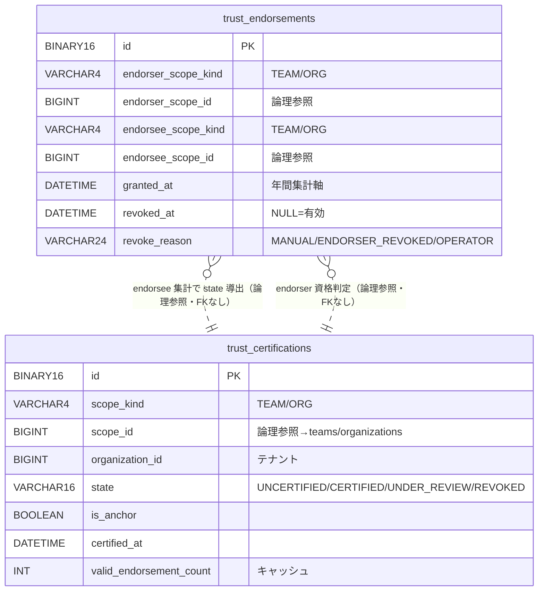

# F20.2 信任（信頼の輪）— 01. データモデル

> **ステータス**: 🟡 設計中（精査待ち）
> 親: [README.md](README.md) ／ 関連: [02_api_design.md](02_api_design.md) / [03_security.md](03_security.md)

---

## 1. 方針

- **新規ドメイン `com.mannschaft.app.trust` に閉じる**。`team`/`organization`/`membership` からは **ID 論理参照のみ**（`scope_kind`＋`scope_id`）。**クロスドメイン FK は張らない**（CLAUDE.md 原則 1）。
- **新規テーブルは全て `UuidV7Entity` 継承（`id BINARY(16)`）**（CLAUDE.md 原則 6）。
- **CASCADE は trust ドメイン内のみ**。本設計では 2 テーブル間に FK/CASCADE を張らない（`trust_endorsements` は監査証跡として `trust_certifications` の状態に依存せず不変保持する。集計は論理参照 SELECT で行う）。
- **テナントスコープ**: `trust_certifications`/`trust_endorsements` は `organization_id` を保持し `AbstractTenantAwareRepository` を実装（CLAUDE.md 原則 7・シャードキー候補）。TEAM/ORG 両対応のため `scope_kind`＋`scope_id` 派生 finder（`escrow_transactions` 前例と同型）を採る。
- **スコープ種別**: payment `ScopeKind{USER,TEAM,ORG}` 準拠。本機能は **TEAM/ORG のみ**（`scope_kind` の CHECK で USER を拒否・§3.1/§3.2）。membership カウント時の `TEAM/ORG → TEAM/ORGANIZATION` マッピングは [README §1.4](README.md) を厳守。
- **enum は DB 側 VARCHAR + CHECK 制約**（既存 payment/visibility ドメインと整合・拡張容易性）。Java 側は enum で表現し `@Enumerated(EnumType.STRING)` または VARCHAR マッピング。
- **`@Query` 内コメント厳禁**（JPQL/native query 内に SQL コメントを書かない・パース不整合回避）。

---

## 2. テーブル一覧

| テーブル名 | 役割 | ドメイン | 論理削除 | 主キー |
|---|---|---|---|---|
| `trust_certifications` | 団体（TEAM/ORG）の認証状態（`state`・`is_anchor`・`certified_at`）を 1 団体 1 行で保持 | `trust` | なし（`state` 管理・`REVOKED` は状態値） | UUIDv7 |
| `trust_endorsements` | 信任関係（endorser → endorsee・`granted_at`・`revoked_at`）。有効信任件数・年間発行数の真実源 | `trust` | なし（`revoked_at` で無効化・監査証跡は物理保持） | UUIDv7 |

> `trust_certifications` は「団体ごとの認証状態のマテリアライズ行」（1 団体 1 行・upsert）。`trust_endorsements` は「信任のイベント台帳」（追記・`revoked_at` で無効化）。認証状態（`state`）は `trust_endorsements` の有効件数から導出されるが、読み取り高速化のため `trust_certifications.state` にマテリアライズし、状態遷移トランザクション内で更新する（[README §9](README.md)）。

---

## 3. テーブル定義

### 3.1 `trust_certifications`（団体の認証状態）

団体（TEAM/ORG）ごとに 1 行。信任を受けていない団体でも、初回に信任を受けた時点／アンカー付与時点で行を作る（遅延作成・upsert）。

| カラム名 | 型 | NULL | デフォルト | 説明 |
|---|---|---|---|---|
| `id` | BINARY(16) | NO | (UUIDv7) | PK |
| `scope_kind` | VARCHAR(4) | NO | — | `TEAM` / `ORG`（認証対象の種別・payment `ScopeKind` 準拠・USER 不可） |
| `scope_id` | BIGINT UNSIGNED | NO | — | 対象団体 ID（TEAM=teams.id / ORG=organizations.id）。**論理参照（FK なし）** |
| `organization_id` | BIGINT UNSIGNED | YES | NULL | テナント絞り込み用（ORG は自 org、TEAM は所属組織を記録・シャードキー候補） |
| `state` | VARCHAR(16) | NO | `'UNCERTIFIED'` | `UNCERTIFIED` / `CERTIFIED` / `UNDER_REVIEW` / `REVOKED`（§4・状態機械 README §5） |
| `is_anchor` | BOOLEAN | NO | FALSE | 運営付与のアンカー（初期認証・信任数非依存で `CERTIFIED` 維持・README §3.6） |
| `certified_at` | DATETIME | YES | NULL | 初回に `CERTIFIED` へ到達した日時（UTC）。回復（`UNDER_REVIEW→CERTIFIED`）では上書きしない（初回到達を保持） |
| `under_review_since` | DATETIME | YES | NULL | `UNDER_REVIEW` に入った日時（UTC・運営キューのソート/滞留把握用）。`CERTIFIED` 復帰時に NULL クリア |
| `revoked_at` | DATETIME | YES | NULL | 運営 REVOKE の日時（UTC）。`state=REVOKED` のとき NOT NULL |
| `revoked_by_user_id` | BIGINT UNSIGNED | YES | NULL | REVOKE を実行した運営ユーザー（論理参照・監査） |
| `revoke_reason` | VARCHAR(500) | YES | NULL | REVOKE 理由（運営記録・PII 非含意） |
| `valid_endorsement_count` | INT UNSIGNED | NO | 0 | 現在の有効な incoming 信任件数のキャッシュ（`trust_endorsements` の `revoked_at IS NULL` 件数と同期）。**真実源は `trust_endorsements`**・本列は表示/降格判定の高速化用で状態遷移 tx 内で再計算・整合バッチで検算 |
| `created_at` | DATETIME | NO | CURRENT_TIMESTAMP | |
| `updated_at` | DATETIME | NO | CURRENT_TIMESTAMP ON UPDATE | |

**制約・インデックス**
```sql
CONSTRAINT chk_tc_scope_kind CHECK (scope_kind IN ('TEAM','ORG'))
CONSTRAINT chk_tc_state CHECK (state IN ('UNCERTIFIED','CERTIFIED','UNDER_REVIEW','REVOKED'))
-- 1 団体につき 1 行（scope_kind + scope_id で一意）
UNIQUE KEY uk_tc_scope (scope_kind, scope_id)
INDEX idx_tc_org (organization_id)
INDEX idx_tc_state (state)                          -- 再審査キュー（state='UNDER_REVIEW'）列挙用
INDEX idx_tc_under_review (state, under_review_since) -- キューのソート（滞留の長い順）
```

> - **`valid_endorsement_count` は非正規化キャッシュ**。真実源は `trust_endorsements`（`revoked_at IS NULL` の incoming 件数）。状態遷移トランザクション内で `SELECT COUNT(*)` して同期し、整合バッチで日次検算する（ドリフトはアラート・症状を隠さない）。降格判定（T6）はこの列でなく tx 内で再計算した件数で行い、列は表示・キュー用に持つ。
> - **`state=REVOKED` 不変条件**: `revoked_at IS NOT NULL`（アプリ層 + 整合バッチで保証）。
> - **`is_anchor=TRUE` は `state=CERTIFIED` を含意**（アンカー付与時に両方セット・アプリ層で保証）。

### 3.2 `trust_endorsements`（信任関係・イベント台帳）

「A（endorser）が B（endorsee）を信任する」1 件 1 行。有効信任件数・年間発行数の**真実源**。

| カラム名 | 型 | NULL | デフォルト | 説明 |
|---|---|---|---|---|
| `id` | BINARY(16) | NO | (UUIDv7) | PK |
| `endorser_scope_kind` | VARCHAR(4) | NO | — | 信任元の種別 `TEAM` / `ORG`（USER 不可） |
| `endorser_scope_id` | BIGINT UNSIGNED | NO | — | 信任元団体 ID（論理参照） |
| `endorsee_scope_kind` | VARCHAR(4) | NO | — | 信任先の種別 `TEAM` / `ORG`（USER 不可） |
| `endorsee_scope_id` | BIGINT UNSIGNED | NO | — | 信任先団体 ID（論理参照） |
| `organization_id` | BIGINT UNSIGNED | YES | NULL | テナント絞り込み（信任元の組織・シャードキー候補） |
| `granted_at` | DATETIME | NO | CURRENT_TIMESTAMP | 信任付与日時（UTC）。年間発行数の集計軸 |
| `granted_by_user_id` | BIGINT UNSIGNED | YES | NULL | 付与操作者（endorser 団体の管理者・論理参照・監査） |
| `revoked_at` | DATETIME | YES | NULL | 無効化日時（UTC）。NULL = **有効な信任**。取消／信任元 REVOKE で set |
| `revoked_by_user_id` | BIGINT UNSIGNED | YES | NULL | 取消操作者（endorser 管理者 or 運営・論理参照・監査） |
| `revoke_reason` | VARCHAR(24) | YES | NULL | `MANUAL`（endorser の任意取消）/ `ENDORSER_REVOKED`（信任元が REVOKED になった連鎖・README §3.7）/ `OPERATOR`（運営操作） |
| `created_at` | DATETIME | NO | CURRENT_TIMESTAMP | |
| `updated_at` | DATETIME | NO | CURRENT_TIMESTAMP ON UPDATE | |

**制約・インデックス**
```sql
CONSTRAINT chk_te_endorser_kind CHECK (endorser_scope_kind IN ('TEAM','ORG'))
CONSTRAINT chk_te_endorsee_kind CHECK (endorsee_scope_kind IN ('TEAM','ORG'))
-- 自己信任の禁止（同種別・同 ID を弾く）。README §3.1 / AC-05
CONSTRAINT chk_te_no_self CHECK (
    NOT (endorser_scope_kind = endorsee_scope_kind AND endorser_scope_id = endorsee_scope_id))
CONSTRAINT chk_te_revoke_reason CHECK (
    revoke_reason IS NULL OR revoke_reason IN ('MANUAL','ENDORSER_REVOKED','OPERATOR'))

-- 重複信任の禁止（有効な endorser→endorsee は 1 件のみ）。README §3.1 / AC-06
-- MySQL は filtered unique 非対応のため、生成列で「有効時のみ一意・無効化後は再付与可」を表現する。
-- active_key = revoked_at IS NULL のとき固定値、無効化後は id を混ぜて一意衝突を回避する。
active_uniq_key BINARY(16) AS (IF(revoked_at IS NULL, UNHEX('00000000000000000000000000000000'), id)) STORED
UNIQUE KEY uk_te_active (endorser_scope_kind, endorser_scope_id,
                         endorsee_scope_kind, endorsee_scope_id, active_uniq_key)

INDEX idx_te_endorsee (endorsee_scope_kind, endorsee_scope_id, revoked_at)  -- 有効 incoming 件数の集計
INDEX idx_te_endorser_granted (endorser_scope_kind, endorser_scope_id, granted_at, revoked_at) -- 年間発行数の集計
INDEX idx_te_org (organization_id)
```

> - **重複防止の生成列（`active_uniq_key`）方式**: MySQL 8.0 は部分/フィルタ付き UNIQUE を持たないため、`revoked_at IS NULL`（有効）の行は全て同一の固定値（ゼロ）を `active_uniq_key` に持たせ、`(endorser, endorsee, active_uniq_key)` UNIQUE で「有効な信任は 1 組 1 件」を強制する。無効化（`revoked_at` セット）後は `active_uniq_key = id`（行ごとに一意）となり UNIQUE 衝突しないため、**取消後に同一 endorser→endorsee を再付与できる**（履歴は複数行残る）。
>   - 生成列が扱いづらい環境向けの代替: `active_uniq_key` を持たず、重複チェックをアプリ層（`existsByEndorserAndEndorseeAndRevokedAtIsNull`）＋ `SELECT ... FOR UPDATE` の悲観ロックで担保する案もある（**要裁入不要の実装判断**・[02 §4.2](02_api_design.md)）。DB での二重防御を優先し生成列 UNIQUE を推奨。
> - **`revoked_at IS NULL` = 有効信任**。有効 incoming 件数 `n` は `idx_te_endorsee` で `COUNT(*) WHERE endorsee=... AND revoked_at IS NULL`。年間発行数は `idx_te_endorser_granted` で `COUNT(*) WHERE endorser=... AND revoked_at IS NULL AND granted_at >= now-12ヶ月`（[README §3.5](README.md) 案 B）。
> - **FK は張らない**（`trust_certifications` とも `teams`/`organizations` とも）。信任台帳は監査証跡として団体ライフサイクルに CASCADE で巻き込まれない（不変性優先）。

---

## 4. enum 定義（全値列挙）

### 4.1 `TrustState`（`trust_certifications.state`）

| 値 | 意味 | 認証マーク |
|---|---|---|
| `UNCERTIFIED` | 未認証（初期・`CERTIFIED` 未到達） | 非表示 |
| `CERTIFIED` | 認証済み（有効信任 3 件到達 or アンカー） | 表示 |
| `UNDER_REVIEW` | 再審査中（`CERTIFIED` 到達後に有効信任 3 未満へ低下） | 表示維持 |
| `REVOKED` | 運営取消 | 非表示 |

### 4.2 `TrustScopeKind`（`scope_kind` / `endorser_scope_kind` / `endorsee_scope_kind`）

| 値 | 意味 | membership `scope_type` 対応 |
|---|---|---|
| `TEAM` | チーム | `TEAM` |
| `ORG` | 組織 | `ORGANIZATION`（**文字列不一致・要マッピング**） |

> USER は本 enum に含めない（payment `ScopeKind` は USER を持つが、本機能では CHECK 制約で拒否し `TRUST_006` を返す）。

### 4.3 `TrustEndorsementRevokeReason`（`trust_endorsements.revoke_reason`）

| 値 | 意味 |
|---|---|
| `MANUAL` | endorser 団体管理者による任意取消（AC-14） |
| `ENDORSER_REVOKED` | 信任元が `REVOKED` になった連鎖での無効化（README §3.7・AC-15） |
| `OPERATOR` | 運営による直接無効化 |

---

## 5. Flyway マイグレーション（仮採番）

> **版番号の鉄則**（memory `feedback_flyway_version_sort_after_global_max`・`feedback_migration_version_collision`）: major は「origin/main 全体の最大 major + 1」。minor は**タイムスタンプ必須**（連番 `.001` は番人テスト `FlywayTimestampNamingGuardTest` が拒否）。

- **現状の最大 major（2026-07-08 実測）**: `V145`（`V145.20260707153053__alter_reservations_add_group_and_menu.sql`）。したがって本機能は **`V146`** を仮採番する。
- **⚠️ 並行 PR 衝突注意**: F20.1（entitlement_billing）・F20.3 等が並行作成中で `V146`/`V147` を取り合う可能性がある。**着手時に必ず `git fetch origin && ls db/migration | 最大 major 再確認` し、衝突しない次番号へ確定する**。タイムスタンプは `date -u '+%Y%m%d%H%M%S'` で採る。

| 版番号（着手時再確認） | 内容 |
|---|---|
| `V146.<yyyyMMddHHmmss>` | `trust_certifications` CREATE（UUIDv7・`state`/`is_anchor`/`certified_at`/`valid_endorsement_count` 等・CHECK・UNIQUE `uk_tc_scope`・INDEX） |
| `V146.<yyyyMMddHHmmss+1>` | `trust_endorsements` CREATE（UUIDv7・endorser/endorsee scope・`granted_at`/`revoked_at`・生成列 `active_uniq_key`・CHECK `chk_te_no_self`・UNIQUE `uk_te_active`・INDEX） |

> 2 テーブル間に FK を張らないため作成順序の依存はない（どちらが先でもよい）。`teams`/`organizations`/`memberships` への FK も張らない（原則 1）。生成列 `active_uniq_key` は MySQL 8.0 の `GENERATED ALWAYS AS (...) STORED` で定義する。

### 5.1 CREATE TABLE（完全形・参考 DDL）

```sql
-- V146.<ts>__create_trust_certifications.sql
CREATE TABLE trust_certifications (
    id                       BINARY(16)      NOT NULL,
    scope_kind               VARCHAR(4)      NOT NULL COMMENT '認証対象種別 TEAM/ORG（payment ScopeKind準拠・USER不可）',
    scope_id                 BIGINT UNSIGNED NOT NULL COMMENT '対象団体ID（論理参照・FKなし）',
    organization_id          BIGINT UNSIGNED NULL     COMMENT 'テナント絞り込み（シャードキー候補）',
    state                    VARCHAR(16)     NOT NULL DEFAULT 'UNCERTIFIED' COMMENT 'UNCERTIFIED/CERTIFIED/UNDER_REVIEW/REVOKED',
    is_anchor                BOOLEAN         NOT NULL DEFAULT FALSE COMMENT '運営付与アンカー（信任数非依存でCERTIFIED維持）',
    certified_at             DATETIME        NULL     COMMENT '初回CERTIFIED到達日時（回復で上書きしない）',
    under_review_since       DATETIME        NULL     COMMENT 'UNDER_REVIEW突入日時（キュー滞留把握）',
    revoked_at               DATETIME        NULL     COMMENT '運営REVOKE日時（state=REVOKEDでNOT NULL）',
    revoked_by_user_id       BIGINT UNSIGNED NULL     COMMENT 'REVOKE実行運営（論理参照）',
    revoke_reason            VARCHAR(500)    NULL     COMMENT 'REVOKE理由',
    valid_endorsement_count  INT UNSIGNED    NOT NULL DEFAULT 0 COMMENT '有効incoming信任件数キャッシュ（真実源はtrust_endorsements）',
    created_at               DATETIME        NOT NULL DEFAULT CURRENT_TIMESTAMP,
    updated_at               DATETIME        NOT NULL DEFAULT CURRENT_TIMESTAMP ON UPDATE CURRENT_TIMESTAMP,
    PRIMARY KEY (id),
    CONSTRAINT chk_tc_scope_kind CHECK (scope_kind IN ('TEAM','ORG')),
    CONSTRAINT chk_tc_state CHECK (state IN ('UNCERTIFIED','CERTIFIED','UNDER_REVIEW','REVOKED')),
    UNIQUE KEY uk_tc_scope (scope_kind, scope_id),
    INDEX idx_tc_org (organization_id),
    INDEX idx_tc_state (state),
    INDEX idx_tc_under_review (state, under_review_since)
) ENGINE=InnoDB DEFAULT CHARSET=utf8mb4 COLLATE=utf8mb4_unicode_ci
  COMMENT='団体（TEAM/ORG）の信任認証状態（信頼の輪・F20.2）';

-- V146.<ts+1>__create_trust_endorsements.sql
CREATE TABLE trust_endorsements (
    id                    BINARY(16)      NOT NULL,
    endorser_scope_kind   VARCHAR(4)      NOT NULL COMMENT '信任元種別 TEAM/ORG',
    endorser_scope_id     BIGINT UNSIGNED NOT NULL COMMENT '信任元団体ID（論理参照）',
    endorsee_scope_kind   VARCHAR(4)      NOT NULL COMMENT '信任先種別 TEAM/ORG',
    endorsee_scope_id     BIGINT UNSIGNED NOT NULL COMMENT '信任先団体ID（論理参照）',
    organization_id       BIGINT UNSIGNED NULL     COMMENT 'テナント絞り込み（信任元組織・シャードキー候補）',
    granted_at            DATETIME        NOT NULL DEFAULT CURRENT_TIMESTAMP COMMENT '信任付与日時（年間発行数の集計軸）',
    granted_by_user_id    BIGINT UNSIGNED NULL     COMMENT '付与操作者（endorser管理者・論理参照）',
    revoked_at            DATETIME        NULL     COMMENT '無効化日時（NULL=有効な信任）',
    revoked_by_user_id    BIGINT UNSIGNED NULL     COMMENT '取消操作者（論理参照）',
    revoke_reason         VARCHAR(24)     NULL     COMMENT 'MANUAL/ENDORSER_REVOKED/OPERATOR',
    active_uniq_key       BINARY(16) AS (IF(revoked_at IS NULL,
                              UNHEX('00000000000000000000000000000000'), id)) STORED
                          COMMENT '有効信任の一意化キー（有効時は固定値・無効化後はidで衝突回避）',
    created_at            DATETIME        NOT NULL DEFAULT CURRENT_TIMESTAMP,
    updated_at            DATETIME        NOT NULL DEFAULT CURRENT_TIMESTAMP ON UPDATE CURRENT_TIMESTAMP,
    PRIMARY KEY (id),
    CONSTRAINT chk_te_endorser_kind CHECK (endorser_scope_kind IN ('TEAM','ORG')),
    CONSTRAINT chk_te_endorsee_kind CHECK (endorsee_scope_kind IN ('TEAM','ORG')),
    CONSTRAINT chk_te_no_self CHECK (
        NOT (endorser_scope_kind = endorsee_scope_kind AND endorser_scope_id = endorsee_scope_id)),
    CONSTRAINT chk_te_revoke_reason CHECK (
        revoke_reason IS NULL OR revoke_reason IN ('MANUAL','ENDORSER_REVOKED','OPERATOR')),
    UNIQUE KEY uk_te_active (endorser_scope_kind, endorser_scope_id,
                            endorsee_scope_kind, endorsee_scope_id, active_uniq_key),
    INDEX idx_te_endorsee (endorsee_scope_kind, endorsee_scope_id, revoked_at),
    INDEX idx_te_endorser_granted (endorser_scope_kind, endorser_scope_id, granted_at, revoked_at),
    INDEX idx_te_org (organization_id)
) ENGINE=InnoDB DEFAULT CHARSET=utf8mb4 COLLATE=utf8mb4_unicode_ci
  COMMENT='信任関係（endorser→endorsee・信頼の輪・F20.2）';
```

---

## 6. Entity 骨子（Java）

```java
// com.mannschaft.app.trust.entity.TrustCertificationEntity
@Entity @Table(name = "trust_certifications")
public class TrustCertificationEntity extends UuidV7Entity {
    private String scopeKind;         // "TEAM" / "ORG"（TrustScopeKind）
    private Long scopeId;
    private Long organizationId;
    @Enumerated(EnumType.STRING) private TrustState state;   // VARCHAR(16)
    private boolean anchor;           // is_anchor
    private LocalDateTime certifiedAt;
    private LocalDateTime underReviewSince;
    private LocalDateTime revokedAt;
    private Long revokedByUserId;
    private String revokeReason;
    private int validEndorsementCount;
    // created_at / updated_at
}

// com.mannschaft.app.trust.entity.TrustEndorsementEntity
@Entity @Table(name = "trust_endorsements")
public class TrustEndorsementEntity extends UuidV7Entity {
    private String endorserScopeKind; private Long endorserScopeId;
    private String endorseeScopeKind; private Long endorseeScopeId;
    private Long organizationId;
    private LocalDateTime grantedAt; private Long grantedByUserId;
    private LocalDateTime revokedAt; private Long revokedByUserId;
    private String revokeReason;      // TrustEndorsementRevokeReason
    // active_uniq_key は生成列（insertable=false, updatable=false でマップするか非マップ）
}
```

Repository（テナント対応・原則 7）:

```java
// organization_id を持つため AbstractTenantAwareRepository を継承
public interface TrustCertificationRepository
        extends AbstractTenantAwareRepository<TrustCertificationEntity, UUID> {
    Optional<TrustCertificationEntity> findByScopeKindAndScopeId(String scopeKind, Long scopeId);
    List<TrustCertificationEntity> findByStateOrderByUnderReviewSinceAsc(String state); // 再審査キュー
}

public interface TrustEndorsementRepository
        extends AbstractTenantAwareRepository<TrustEndorsementEntity, UUID> {
    long countByEndorseeScopeKindAndEndorseeScopeIdAndRevokedAtIsNull(String kind, Long id); // 有効 n
    long countByEndorserScopeKindAndEndorserScopeIdAndRevokedAtIsNullAndGrantedAtAfter(
        String kind, Long id, LocalDateTime since);                                        // 年間発行数
    boolean existsByEndorserScopeKindAndEndorserScopeIdAndEndorseeScopeKindAndEndorseeScopeIdAndRevokedAtIsNull(
        String ek, Long ei, String dk, Long di);                                           // 重複チェック
    List<TrustEndorsementEntity> findByEndorserScopeKindAndEndorserScopeIdAndRevokedAtIsNull(
        String kind, Long id);   // REVOKE 連鎖で無効化する対象（outgoing 有効信任）
    List<TrustEndorsementEntity> findByEndorseeScopeKindAndEndorseeScopeIdAndRevokedAtIsNull(
        String kind, Long id);   // incoming 公開一覧
}
```

---

## 7. ER 図



> FK は張らない（点線＝論理参照・Service 集計）。`trust_endorsements` の有効 incoming 件数から `trust_certifications.state` を導出しマテリアライズする。`teams`/`organizations`/`memberships` への参照もすべて論理参照（クロスドメイン FK 禁止・原則 1）。

---

## 8. DB 原則への適合チェック（CLAUDE.md）

| 原則 | 適合 |
|---|---|
| 1. クロスドメイン FK 禁止 | ✅ `teams`/`organizations`/`memberships` への参照はすべて論理参照。trust 2 テーブル間も FK なし（台帳の不変性優先） |
| 2. CASCADE は同一ドメイン内のみ | ✅ CASCADE を一切使わない（`revoked_at` の論理無効化で表現） |
| 3. コアエンティティ論理削除 | ✅（該当なし。trust は状態機械・監査台帳で物理保持） |
| 4. 退会時匿名化 | ✅ `granted_by_user_id`/`revoked_by_user_id` は論理参照（退会時 user 側匿名化で PII は消える）・信任台帳は統計/監査価値のため保持（[03 §5](03_security.md)） |
| 5. @Transactional ドメイン内 | ✅ `trust` ドメイン内に閉じる。membership カウント・team/org 存在確認は読み取り Service 経由・通知は ApplicationEvent（[02 §7](02_api_design.md)） |
| 6. 新規テーブル UUIDv7 | ✅ `trust_certifications`/`trust_endorsements` とも `UuidV7Entity`（BINARY(16)） |
| 7. テナント Repository | ✅ 両テーブル `organization_id` 保持・`AbstractTenantAwareRepository` 実装（シャードキー候補） |

> **マスタ例外・シングルトン例外には該当しない**: 両テーブルとも団体ごと・信任ごとに行が増える運用データ（テナントスコープ）であり、原則 6（UUIDv7）を適用する。
