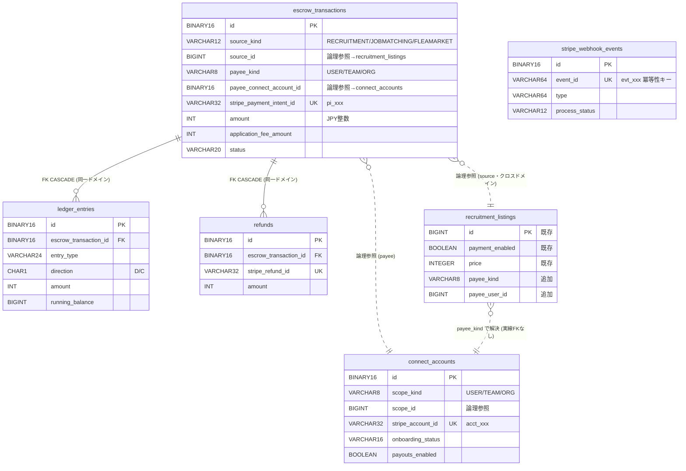

# F22.1 市（Market）謝礼決済 — 01. データモデル

> 親: [README.md](README.md) ／ 関連: [02_api_design.md](02_api_design.md) / [03_security.md](03_security.md)

---

## 1. 方針

- **新規ドメイン `payment.escrow` / `payment.connect` に閉じる**。`market`/`recruitment`/`team` からは ID 論理参照のみ。**クロスドメインFKは張らない**（CLAUDE.md 原則1）。
- **新規テーブルは全て `UuidV7Entity` 継承（`id BINARY(16)`）**（CLAUDE.md 原則6）。F13.1 の BIGINT テーブルは流用しない。
- **CASCADE は payment ドメイン内のみ**（`escrow_transactions` → `ledger_entries`/`refunds`）。外部（recruitment/team/user）は論理参照（CLAUDE.md 原則2）。
- **テナントスコープ**: `organization_id` を持つテーブルは `AbstractTenantAwareRepository` を実装（CLAUDE.md 原則7）。`connect_accounts`/`escrow_transactions` は `organization_id` を保持。
- **通貨**: JPY はゼロデシマル通貨。`amount` 系は**円そのもの（最小単位）の整数**で保持し、`currency CHAR(3)` で明示。Stripe へは円整数で渡す。
- **暗号化**: `connect_accounts.stripe_account_id`・`escrow_transactions.stripe_payment_intent_id` は識別子であり PII ではないが、Connect の `requirements_due`（KYC 要件）は個人特定に繋がりうるため JSON で最小化保持し、内容は Stripe を正典とする（自社は鏡像最小化）。

---

## 2. テーブル一覧

| テーブル名 | 役割 | ドメイン | 論理削除 | 主キー |
|---|---|---|---|---|
| `connect_accounts` | 受領者（個人/チーム/組織）の Stripe Connect Express アカウント管理 | `payment.connect` | あり（`deleted_at`） | UUIDv7 |
| `escrow_transactions` | エスクロー取引（PaymentIntent 1:1・与信→capture→払出/返金の状態管理） | `payment.escrow` | なし（status 管理） | UUIDv7 |
| `ledger_entries` | 複式記帳台帳（取引ごとの借方/貸方・残高） | `payment.escrow` | なし（追記専用） | UUIDv7 |
| `refunds` | 返金記録（部分/全額） | `payment.escrow` | なし | UUIDv7 |
| `stripe_webhook_events` | Webhook 冪等性キー（event_id 一意） | `payment`（共通） | なし（TTL 物理削除） | UUIDv7 |

> `source_kind` で RECRUITMENT（市）/ JOBMATCHING（F13.1 将来）/ FLEAMARKET（フリマ将来）を**1テーブルで束ねる**。Phase 2 後半が接続するのは RECRUITMENT のみ。他は値だけ確保（転用点）。

---

## 3. テーブル定義

### 3.1 `connect_accounts`（受領者の Connect アカウント）

札ごとの受領主体（個人/チーム/組織）が**それぞれ独立した Connect アカウント**を持てるよう、`scope_kind` ＋ `scope_id` で抽象化する。

| カラム名 | 型 | NULL | デフォルト | 説明 |
|---|---|---|---|---|
| `id` | BINARY(16) | NO | (UUIDv7) | PK |
| `scope_kind` | VARCHAR(8) | NO | — | `USER` / `TEAM` / `ORG`（受領主体の種別） |
| `scope_id` | BIGINT UNSIGNED | NO | — | 主体ID（USER=users.id / TEAM=teams.id / ORG=organizations.id）。**論理参照（FKなし）** |
| `organization_id` | BIGINT UNSIGNED | YES | NULL | テナント絞り込み用（TEAM/ORG は所属組織、USER は主所属組織を記録。シャードキー候補） |
| `stripe_account_id` | VARCHAR(32) | NO | — | Stripe Connect アカウントID（`acct_xxx`）。一意 |
| `onboarding_status` | VARCHAR(16) | NO | `'PENDING'` | `PENDING`（リンク発行前）/ `ONBOARDING`（hosted 中）/ `READY` / `RESTRICTED`（要件不足）/ `DISABLED`（deauthorized） |
| `charges_enabled` | BOOLEAN | NO | FALSE | Stripe `charges_enabled` の鏡像 |
| `payouts_enabled` | BOOLEAN | NO | FALSE | Stripe `payouts_enabled` の鏡像（**払出可否の判定軸**） |
| `requirements_due` | JSON | YES | NULL | Stripe `requirements.currently_due`（不足項目）の鏡像（最小化） |
| `country` | CHAR(2) | NO | `'JP'` | アカウント国（当面 JP 固定） |
| `default_currency` | CHAR(3) | NO | `'JPY'` | 既定通貨 |
| `created_at` | DATETIME | NO | CURRENT_TIMESTAMP | |
| `updated_at` | DATETIME | NO | CURRENT_TIMESTAMP ON UPDATE | |
| `deleted_at` | DATETIME | YES | NULL | 論理削除（退会/解約時の切離し。§GDPR） |

**制約・インデックス**
```sql
CONSTRAINT chk_ca_scope_kind CHECK (scope_kind IN ('USER','TEAM','ORG'))
CONSTRAINT chk_ca_onboarding CHECK (onboarding_status IN ('PENDING','ONBOARDING','READY','RESTRICTED','DISABLED'))
UNIQUE KEY uk_ca_stripe_account (stripe_account_id)
-- 1 主体につき 1 アカウント（論理削除を除く）。アプリ層で deleted_at IS NULL を加味
UNIQUE KEY uk_ca_scope (scope_kind, scope_id, deleted_at)
INDEX idx_ca_org (organization_id)
INDEX idx_ca_payouts (payouts_enabled)
```
> `uk_ca_scope` に `deleted_at` を含めるのは、退会で論理削除後に同一主体が再 onboarding できるようにするため（NULL 同士は MySQL UNIQUE で重複許容＝1アクティブ行＋複数削除済を許す）。

---

### 3.2 `escrow_transactions`（エスクロー取引・PaymentIntent 1:1）

| カラム名 | 型 | NULL | デフォルト | 説明 |
|---|---|---|---|---|
| `id` | BINARY(16) | NO | (UUIDv7) | PK |
| `source_kind` | VARCHAR(12) | NO | — | `RECRUITMENT` / `JOBMATCHING` / `FLEAMARKET`（出所種別・転用点） |
| `source_id` | BIGINT UNSIGNED | NO | — | 出所ID（RECRUITMENT=recruitment_listings.id）。**論理参照（FKなし）** |
| `source_participant_id` | BIGINT UNSIGNED | YES | NULL | 個別応募の特定用（recruitment_participants.id 論理参照・1札に複数払出があり得る場合） |
| `payer_scope_kind` | VARCHAR(8) | NO | — | 支払者種別 `USER` / `TEAM` / `ORG` |
| `payer_scope_id` | BIGINT UNSIGNED | NO | — | 支払者ID（論理参照） |
| `payer_stripe_customer_id` | VARCHAR(32) | YES | NULL | 支払者の Stripe Customer（`cus_xxx`・既存 `stripe_customers` 再利用可） |
| `payee_kind` | VARCHAR(8) | NO | — | **受領者種別 `USER` / `TEAM` / `ORG`（札ごとの受領主体）** |
| `payee_connect_account_id` | BINARY(16) | NO | — | **`connect_accounts.id`（payment ドメイン内・論理参照）**。受領先 |
| `organization_id` | BIGINT UNSIGNED | YES | NULL | テナント絞り込み（札主の組織・シャードキー候補） |
| `stripe_payment_intent_id` | VARCHAR(32) | YES | NULL | `pi_xxx`（与信作成後にセット）。一意 |
| `amount` | INT UNSIGNED | NO | — | 支払総額（**JPY＝円整数**・最小単位） |
| `currency` | CHAR(3) | NO | `'JPY'` | ISO 4217 |
| `application_fee_amount` | INT UNSIGNED | NO | 0 | プラットフォーム手数料（確定額・円整数）。受領者送金額 = `amount - application_fee_amount` |
| `status` | VARCHAR(20) | NO | `'AUTHORIZED'` | 状態（下表）。**ENUM ではなく VARCHAR**（拡張容易性・既存 payment と整合） |
| `authorized_at` | DATETIME | YES | NULL | 与信成立日時（UTC） |
| `captured_at` | DATETIME | YES | NULL | capture（払出確定）日時（UTC） |
| `cancelled_at` | DATETIME | YES | NULL | 与信取消日時（UTC） |
| `hold_expires_at` | DATETIME | YES | NULL | authorization hold 失効予定（最大7日・自動 capture バッチの基準） |
| `created_at` | DATETIME | NO | CURRENT_TIMESTAMP | |
| `updated_at` | DATETIME | NO | CURRENT_TIMESTAMP ON UPDATE | |

**status 値（状態遷移）**
| 値 | 意味 |
|---|---|
| `AUTHORIZED` | 与信済（資金未移動・エスクロー保持中） |
| `HELD` | 払出保留（受領者 onboarding 未完了で capture 待ち。§02 §5） |
| `CAPTURED` | capture 済（払出確定・受領者へ transfer 完了） |
| `PARTIALLY_REFUNDED` | 部分返金済 |
| `REFUNDED` | 全額返金済 |
| `CANCELLED` | 与信取消（capture 前の札下げ/期限切れ/hold 失効） |
| `DISPUTED` | 係争中（最終認証未了で hold 失効回避のため先 capture が必要になりうる。F13.1 §8.9 戦略） |

```
                ┌─ HELD ──(onboarding完了)──┐
AUTHORIZED ─────┤                            ├──▶ CAPTURED ──▶ PARTIALLY_REFUNDED / REFUNDED
                └─(payouts_enabled)──────────┘
AUTHORIZED ──(札下げ/期限切れ/hold失効)──▶ CANCELLED
AUTHORIZED ──(最終認証未了でhold接近)──▶ DISPUTED ──(先capture)──▶ CAPTURED ──(仲裁結果)──▶ REFUNDED/確定
```

**制約・インデックス**
```sql
CONSTRAINT chk_et_source_kind CHECK (source_kind IN ('RECRUITMENT','JOBMATCHING','FLEAMARKET'))
CONSTRAINT chk_et_payee_kind  CHECK (payee_kind IN ('USER','TEAM','ORG'))
CONSTRAINT chk_et_payer_kind  CHECK (payer_scope_kind IN ('USER','TEAM','ORG'))
CONSTRAINT chk_et_status CHECK (status IN
  ('AUTHORIZED','HELD','CAPTURED','PARTIALLY_REFUNDED','REFUNDED','CANCELLED','DISPUTED'))
CONSTRAINT chk_et_fee CHECK (application_fee_amount <= amount)
UNIQUE KEY uk_et_pi (stripe_payment_intent_id)
INDEX idx_et_source (source_kind, source_id)
INDEX idx_et_payee (payee_connect_account_id)
INDEX idx_et_org (organization_id)
INDEX idx_et_status_hold (status, hold_expires_at)   -- 自動 capture バッチ用
```
> `payee_connect_account_id` は `connect_accounts.id`（同一 payment ドメイン）への参照。**ドメイン内なので FK を張ってもよい**が、エスクロー取引は監査証跡として永続保持し Connect アカウント論理削除でも消えてはならないため、**FKは張らず論理参照とし `ON DELETE` 連鎖を発生させない**（台帳の不変性優先）。

---

### 3.3 `ledger_entries`（複式記帳台帳・追記専用）

エスクロー取引の資金移動を**借方/貸方の複式**で記録し、整合性監査（Stripe balance との突合）に用いる。

| カラム名 | 型 | NULL | デフォルト | 説明 |
|---|---|---|---|---|
| `id` | BINARY(16) | NO | (UUIDv7) | PK |
| `escrow_transaction_id` | BINARY(16) | NO | — | `escrow_transactions.id`（payment ドメイン内 FK・CASCADE 可） |
| `entry_type` | VARCHAR(24) | NO | — | `AUTHORIZE` / `CAPTURE` / `TRANSFER_OUT` / `FEE` / `REFUND` / `CANCEL`（記帳種別） |
| `account` | VARCHAR(16) | NO | — | 勘定 `ESCROW` / `PAYEE` / `PLATFORM_FEE` / `PAYER`（複式の相手勘定） |
| `direction` | CHAR(1) | NO | — | `D`（借方 Debit）/ `C`（貸方 Credit） |
| `amount` | INT UNSIGNED | NO | — | 金額（円整数・最小単位） |
| `currency` | CHAR(3) | NO | `'JPY'` | |
| `running_balance` | BIGINT | NO | — | 当該取引の累積残高（署名付き・整合検算用） |
| `stripe_object_id` | VARCHAR(48) | YES | NULL | 対応する Stripe オブジェクト（`tr_xxx`/`re_xxx`/`txn_xxx` 等・突合キー） |
| `created_at` | DATETIME | NO | CURRENT_TIMESTAMP | 追記時刻（不変） |

**制約・インデックス**
```sql
CONSTRAINT fk_le_escrow FOREIGN KEY (escrow_transaction_id)
  REFERENCES escrow_transactions(id) ON DELETE CASCADE   -- 同一ドメイン内のみ CASCADE 許可（CLAUDE.md 原則2）
CONSTRAINT chk_le_direction CHECK (direction IN ('D','C'))
CONSTRAINT chk_le_entry_type CHECK (entry_type IN
  ('AUTHORIZE','CAPTURE','TRANSFER_OUT','FEE','REFUND','CANCEL'))
INDEX idx_le_escrow (escrow_transaction_id, created_at)
INDEX idx_le_stripe_obj (stripe_object_id)
```
> 追記専用（UPDATE/DELETE しない）。1 取引の借方合計＝貸方合計が常に成立することを整合バッチで検算する（Stripe balance_transaction との突合・02 §6 リコンシリエーション）。

---

### 3.4 `refunds`（返金記録）

| カラム名 | 型 | NULL | デフォルト | 説明 |
|---|---|---|---|---|
| `id` | BINARY(16) | NO | (UUIDv7) | PK |
| `escrow_transaction_id` | BINARY(16) | NO | — | `escrow_transactions.id`（payment 内 FK・CASCADE 可） |
| `stripe_refund_id` | VARCHAR(32) | NO | — | `re_xxx`（一意） |
| `amount` | INT UNSIGNED | NO | — | 返金額（円整数・最小単位。部分返金で `< escrow.amount`） |
| `currency` | CHAR(3) | NO | `'JPY'` | |
| `reason` | VARCHAR(32) | NO | — | `requested_by_customer` / `duplicate` / `dispute_resolution` / `cancellation` 等 |
| `reason_detail` | VARCHAR(500) | YES | NULL | 運営・札主の補足（PII 非含意） |
| `refunded_by_user_id` | BIGINT UNSIGNED | YES | NULL | 返金操作者（論理参照・監査） |
| `status` | VARCHAR(12) | NO | `'PENDING'` | `PENDING` / `SUCCEEDED` / `FAILED`（Stripe `charge.refunded` Webhook で確定） |
| `created_at` | DATETIME | NO | CURRENT_TIMESTAMP | |
| `updated_at` | DATETIME | NO | CURRENT_TIMESTAMP ON UPDATE | |

**制約・インデックス**
```sql
CONSTRAINT fk_rf_escrow FOREIGN KEY (escrow_transaction_id)
  REFERENCES escrow_transactions(id) ON DELETE CASCADE   -- 同一ドメイン内
CONSTRAINT chk_rf_status CHECK (status IN ('PENDING','SUCCEEDED','FAILED'))
UNIQUE KEY uk_rf_stripe (stripe_refund_id)
INDEX idx_rf_escrow (escrow_transaction_id)
```

---

### 3.5 `stripe_webhook_events`（Webhook 冪等性キー）

Connect/Platform 両 Webhook の**再送（at-least-once）を冪等化**する共通テーブル。同一 `event_id` の二重処理を一意制約で物理拒否する。

| カラム名 | 型 | NULL | デフォルト | 説明 |
|---|---|---|---|---|
| `id` | BINARY(16) | NO | (UUIDv7) | PK |
| `event_id` | VARCHAR(64) | NO | — | Stripe イベントID（`evt_xxx`）。**冪等性キー（UNIQUE）** |
| `type` | VARCHAR(64) | NO | — | イベント種別（`account.updated` / `payment_intent.succeeded` 等） |
| `livemode` | BOOLEAN | NO | FALSE | 本番/テスト区分 |
| `received_at` | DATETIME | NO | CURRENT_TIMESTAMP | 受信時刻 |
| `processed_at` | DATETIME | YES | NULL | 処理完了時刻（NULL=受信のみ・処理未完／再試行対象） |
| `process_status` | VARCHAR(12) | NO | `'RECEIVED'` | `RECEIVED` / `PROCESSED` / `IGNORED` / `FAILED` |

**制約・インデックス**
```sql
CONSTRAINT chk_swe_status CHECK (process_status IN ('RECEIVED','PROCESSED','IGNORED','FAILED'))
UNIQUE KEY uk_swe_event (event_id)   -- 冪等性の要。INSERT 競合＝既処理として安全にスキップ
INDEX idx_swe_type (type)
INDEX idx_swe_received (received_at)  -- TTL 物理削除バッチ用（保持期間後に古行を削除）
```
> 処理フロー: Webhook 受信→`INSERT ... event_id`（重複なら ON DUPLICATE で no-op＝既処理）→ハンドラ実行→`process_status=PROCESSED`。**INSERT を冪等ゲートに使う**ことで、同一 event の同時並行処理も一意制約で直列化される（02 §4）。

---

## 4. 既存テーブルへの最小拡張

### 4.1 `recruitment_listings`（札ごとの受領主体）

既存列 `payment_enabled BOOLEAN` / `price INTEGER` を活用しつつ、**札ごとの受領主体**を表現する列を追加する（市の決済の中核）。

| カラム名 | 型 | NULL | デフォルト | 説明 |
|---|---|---|---|---|
| `payee_kind` | VARCHAR(8) | YES | NULL | **受領主体 `USER` / `TEAM` / `ORG`（札ごと選択）**。`payment_enabled=TRUE` 時に必須 |
| `payee_user_id` | BIGINT UNSIGNED | YES | NULL | `payee_kind=USER` の受領者（論理参照）。審判/助っ人個人など |

```sql
ALTER TABLE recruitment_listings
  ADD COLUMN payee_kind VARCHAR(8) NULL,
  ADD COLUMN payee_user_id BIGINT UNSIGNED NULL;

-- payment_enabled=TRUE のとき payee_kind と price は必須（既存 PRICE_REQUIRED 検証を拡張）
ALTER TABLE recruitment_listings
  ADD CONSTRAINT chk_rl_payee
    CHECK (payment_enabled = FALSE
        OR (payee_kind IN ('USER','TEAM','ORG') AND price IS NOT NULL));
-- payee_user_id は payee_kind=USER のとき必須、それ以外（TEAM/ORG/NULL）では NULL でなければならない
-- （TEAM/ORG は札主 scope_type/scope_id を受領主体に流用するため個人ID列は持たない）
ALTER TABLE recruitment_listings
  ADD CONSTRAINT chk_rl_payee_user
    CHECK ((payee_kind = 'USER' AND payee_user_id IS NOT NULL)
        OR (payee_kind <> 'USER' AND payee_user_id IS NULL)
        OR (payee_kind IS NULL  AND payee_user_id IS NULL));
INDEX idx_rl_payee_user (payee_user_id);
```
> - `payee_kind=TEAM/ORG` の場合、受領主体ID は**札主の `scope_type`/`scope_id`（`recruitment_listings` 既存列・TEAM なら teams.id、ORG なら organizations.id）をそのまま使う**ため専用列は不要（札主＝受領者）。
> - `payee_kind=USER` の場合のみ `payee_user_id` で個人受領者を保持（札主はチーム/組織だが、謝礼の受け手は個人）。
> - 既存の `payment_enabled && price==null → PRICE_REQUIRED` 検証を、`payee_kind` 必須も含むよう Service 側で拡張（02 §3・エラー `PAYMENT_010`）。
> - `escrow_transactions` 作成時、`payee_kind`/受領主体ID から `connect_accounts`（READY かつ payouts_enabled）を解決する。未 onboarding なら `HELD`（02 §5）。

> ⚠️ **実装注意 — `payee_kind` 値と `RecruitmentScopeType` のマッピング**
> 本設計の `payee_kind` は `USER` / `TEAM` / `ORG` の3値を想定しているが、実在 enum `com.mannschaft.app.recruitment.RecruitmentScopeType` は **`TEAM` / `ORGANIZATION`** の2値のみ（`USER` は持たない）。実装時は以下のマッピングで変換すること:
> - `payee_kind = 'TEAM'` → `RecruitmentScopeType.TEAM`（1:1 対応）
> - `payee_kind = 'ORG'` → `RecruitmentScopeType.ORGANIZATION`（文字列不一致に注意）
> - `payee_kind = 'USER'` → `RecruitmentScopeType` には対応値なし。個人受領は `payee_user_id` カラムで表現し、scope 解決時に `RecruitmentScopeType` を介さず直接 `users.id` を参照する（独立パス）。
> 変換ロジックは `ConnectAccountService` 等に一箇所集約し、文字列直比較が散在しないようにすること。

> **既存値は不変**: 既存行は `payee_kind=NULL`（決済無効札）で後方互換。`payment_enabled=FALSE` の既存札は CHECK を満たす。

### 4.2 `stripe_customers`（既存・変更なし）
支払者の Stripe Customer は既存 `payment/entity/StripeCustomerEntity`（`stripe_customers` 想定）を**再利用**。新規列は追加しない。

---

## 5. Flyway マイグレーション

> **版番号の鉄則**（memory `feedback_flyway_version_sort_after_global_max`）: 全体最大の**次の major** を採る。`V9.<timestamp>` 形式は V10〜V72 より前にソートされ from-scratch を壊す**罠＝採用禁止**。

- **現状の最大版番号は `V72.003`**（2026-06-02 時点・`db/migration` 実測）。
- 本設計の新規 DDL は **`V72.004` 以降**を前提に記述する（同一 major V72 系列の末尾に積む。次 major V73 でも可）。
- **着手時に必ず `origin/main` の最大版番号を再確認し、衝突しない番号へリネームする**（並行PRでズレるため。from-scratch 番人テストが検知）。

| 版番号（着手時再確認） | 内容 |
|---|---|
| `V72.004`（仮） | `CREATE TABLE connect_accounts` |
| `V72.005`（仮） | `CREATE TABLE escrow_transactions` |
| `V72.006`（仮） | `CREATE TABLE ledger_entries`（escrow への FK） |
| `V72.007`（仮） | `CREATE TABLE refunds`（escrow への FK） |
| `V72.008`（仮） | `CREATE TABLE stripe_webhook_events` |
| `V72.009`（仮） | `ALTER TABLE recruitment_listings ADD payee_kind / payee_user_id + CHECK + INDEX` |

> テーブル作成順は FK 依存順（`escrow_transactions` → `ledger_entries`/`refunds`）。`connect_accounts`・`stripe_webhook_events` は独立。

---

## 6. ER 図



> 実線 FK は payment ドメイン内（`escrow_transactions`→`ledger_entries`/`refunds`）のみ。点線は論理参照（クロスドメイン・Service 検証）。

---

## 7. DB 原則への適合チェック（CLAUDE.md）

| 原則 | 適合 |
|---|---|
| 1. クロスドメインFK禁止 | ✅ recruitment/team/user への参照はすべて論理参照（FKなし） |
| 2. CASCADE は同一ドメイン内のみ | ✅ `escrow_transactions`→`ledger_entries`/`refunds` の payment 内 CASCADE のみ |
| 3. コアエンティティ論理削除 | ✅ `connect_accounts.deleted_at`。escrow/ledger/refund は監査証跡で物理保持 |
| 4. 退会時匿名化 | ✅ Connect 切離しは払出/返金完了後・強匿名化30日猶予側（03 §5） |
| 5. @Transactional ドメイン内 | ✅ `payment.escrow` 内に閉じる。recruitment 連携は ApplicationEvent（README §7） |
| 6. 新規テーブル UUIDv7 | ✅ 全新規テーブル `UuidV7Entity`（BINARY(16)） |
| 7. テナント Repository | ✅ `connect_accounts`/`escrow_transactions` は `organization_id` 保持・`AbstractTenantAwareRepository` 実装 |
