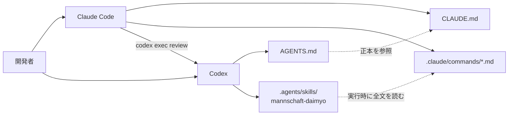
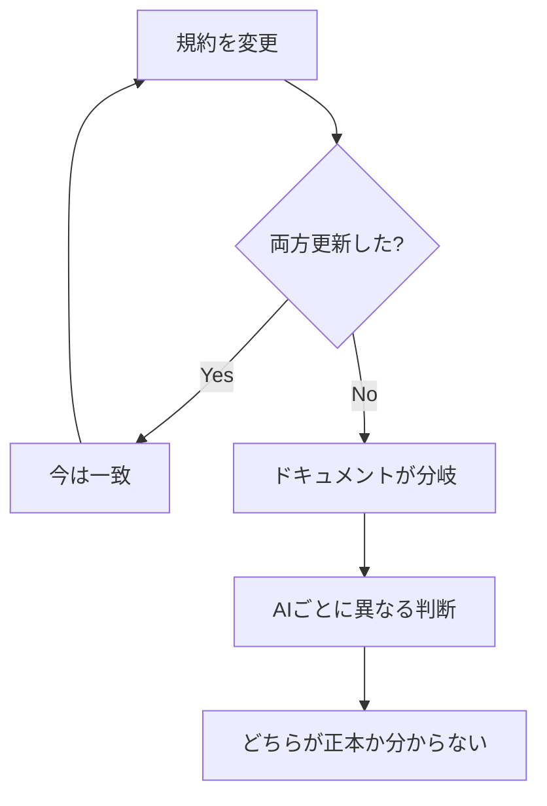
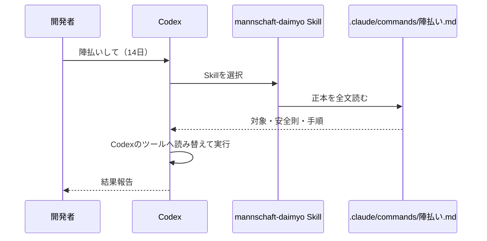
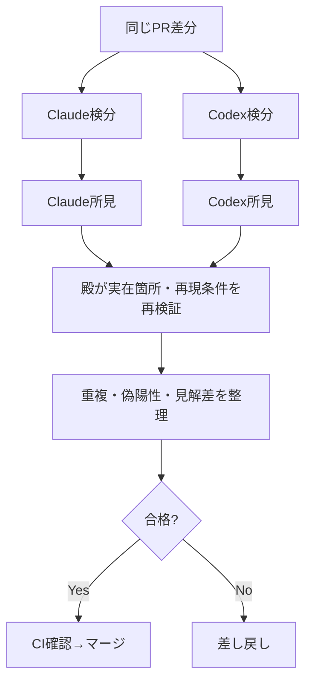
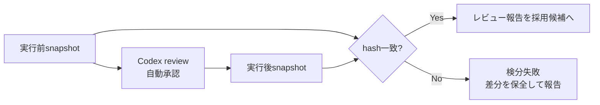
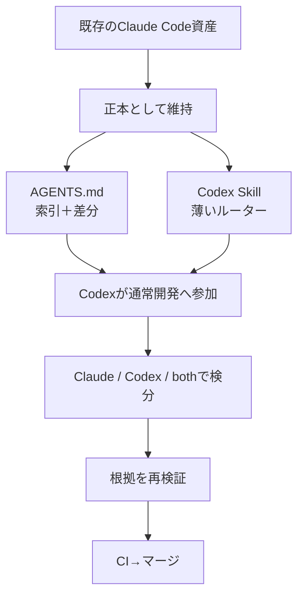

# Claude Codeで育てた資産を捨てずにCodexを参加させる — AGENTS.mdとSkillで「二重管理しない」橋渡し

> タグ候補: `ClaudeCode` `Codex` `生成AI` `AI駆動開発` `コードレビュー`

## はじめに

長くClaude Codeで開発していると、リポジトリにはコード以外の資産も育っていきます。

- `CLAUDE.md` に蓄積したプロジェクト規約
- `.claude/commands/*.md` に作ったスラッシュコマンド
- 設計書、テスト規約、セキュリティ方針
- worktreeを使った並列開発フロー
- レビューで見るべき観点や、過去の失敗から生まれたチェックリスト

ここへOpenAI Codexも参加させたい。

しかし、Claude Code用の文書をCodex用にコピーし始めると、すぐに次の問題が起きます。

> Claude側の規約を直したが、Codex側を直し忘れた

> 2つのレビュー手順が少しずつ違い、どちらが正しいか分からない

> 同じ長文を2か所に置いたため、コンテキストも保守コストも増えた

そこで今回は、Claude Codeの資産をCodexへ「移植」するのではなく、**Claude側を正本としてCodexから参照する橋を作る**ことにしました。

この記事では、その設計と実装、Claude Codeの検分（コードレビュー）からCodexを非対話で呼び出す方法、実際に詰まった自動承認の制約まで紹介します。

---

## TL;DR

やったことは4つです。

1. ルートに`AGENTS.md`を置き、Codexへ「既存文書を読め」と伝える
2. `.agents/skills/`に薄いルータースキルを置く
3. 詳細な手順は`.claude/commands/*.md`だけを正本にする
4. Claude Codeの`/検分`から`codex exec review`を呼べるようにする



重要なのは、**矢印は増やしても正本は増やさない**ことです。

---

## 1. これは「移行」ではなく「共存のためのブリッジ」

最初は「Claude CodeからCodexへ資産を移行する」と考えていました。

しかし、実際にはClaude Codeも使い続けます。Codexにはレビューだけでなく、設計・調査・実装・修正も担当してもらいます。そのため、片方を廃止する移行ではありません。

より正確には、次の状態を目指しています。

| 項目 | 方針 |
|---|---|
| Claude Code | 既存の大名システムとスラッシュコマンドを継続利用 |
| Codex | 通常開発へ参加。特に独立レビューを頼む機会が多い |
| プロジェクト規約 | `CLAUDE.md`など既存文書を正本にする |
| Codex固有指示 | `AGENTS.md`には差分だけを書く |
| ワークフロー | `.claude/commands/*.md`を正本として両者から参照 |

つまり「引っ越し」ではなく、**同じ城の設計図を2人のAIが読むための通訳を置く**イメージです。

---

## 2. 失敗しやすい設計：全文コピー

一番簡単なのは、`CLAUDE.md`を`AGENTS.md`へコピーする方法です。

```text
CLAUDE.md  ──コピー──>  AGENTS.md
```

導入直後は動きます。しかし、運用を続けるほど差分が生まれます。



AI向け文書は更新頻度が高くなりがちです。新しい事故が起きるたびに禁止事項や検証手順が増えるからです。

そこで、Codex用文書には全文を持たせず、次の2点だけを書きます。

- 何が正本か
- Codex固有の差分は何か

---

## 3. `AGENTS.md`を「索引＋差分」にする

Codexはリポジトリ内の`AGENTS.md`をプロジェクト指示として読みます。ここを既存資産への入口にしました。

最小構成は次のようになります。

```markdown
# AGENTS.md — Codex向け入口

このファイルはCodex固有の差分だけを定める。
プロジェクト規約を二重管理しない。

## 正本

- 全体規約は `CLAUDE.md`。作業開始時に全文を読む
- Backendを扱う場合は `backend/.claudecode.md` を読む
- Frontendを扱う場合は `frontend/FRONTEND_CODING_CONVENTION.md` を読む
- テストを扱う場合は `TEST_CONVENTION.md` を読む
- セキュリティ変更時は `docs/security/README.md` から該当文書を読む

## Codex固有の担当

- 設計、調査、実装、修正、テスト、文書更新を担当する
- レビュー依頼では原則読み取り専用で調査する
- 指摘は重大度順、ファイルと行、発生条件、影響を示す
- 実装時は既存のworktree隔離規則に従う
```

### なぜ単なるリンク集では足りないのか

ファイル名だけ並べても、AIは「いつ読むのか」を判断できません。

そのため、次のように**トリガー条件まで書く**のがポイントです。

```text
Backendを扱う場合       → Backend規約
テストを扱う場合        → テスト規約
認証・認可を扱う場合    → セキュリティ方針
レビューを依頼された場合 → 検分コマンド
```

`AGENTS.md`は規約本文ではなく、**状況から正本へ案内するルーティングテーブル**として使います。

---

## 4. Claude CodeのスラッシュコマンドをCodex Skillから参照する

このプロジェクトには、次のようなClaude Code用コマンドがありました。

```text
.claude/commands/
├── 軍議.md      # 設計・タスク分解・受け入れ条件
├── 試練.md      # テスト先行
├── 出陣.md      # 実装
├── 検分.md      # レビュー
├── 実機.md      # E2E
├── 凱旋.md      # CI確認・マージ
└── 陣払い.md    # 古いworktreeの掃除
```

これらをCodex用に21個コピーするのは避けたい。そこで、Codex側には1つだけ薄いSkillを置きました。

```text
.agents/skills/
└── mannschaft-daimyo/
    ├── SKILL.md
    └── agents/
        └── openai.yaml
```

`SKILL.md`の仕事は、コマンド本文を持つことではありません。

```markdown
---
name: mannschaft-daimyo
description: Use when the user invokes /軍議, /出陣, /検分,
  /陣払い or another Mannschaft Daimyo workflow.
---

# Mannschaft Daimyo

1. ルートの `CLAUDE.md` と `AGENTS.md` を全文読む
2. 指定名から `.claude/commands/<名前>.md` を解決する
3. 対象コマンドを必ず全文読む
4. Claude固有のツール名だけCodexの同等手段へ読み替える
5. 安全則・品質ゲート・報告項目は省略しない
```

これなら、たとえば「陣払いして」と頼まれたとき、Codexは次のように動けます。



### 新コマンド追加時も基本は変更不要

ルーターが`.claude/commands/<名前>.md`を一般規則で解決するため、新しいコマンドを追加してもSkill本文は原則変更不要です。

Codexの自動選択対象へ積極的に載せたい場合だけ、Skillの`description`へ名前を足します。

---

## 5. Claude Codeの「検分」からCodexを呼ぶ

資産を読めるだけでなく、Claude Codeのワークフロー中からCodexへ独立レビューを頼めるようにしました。

利用者は検分者を選べます。

```text
/検分 claude   # 従来どおりClaude Codeで検分
/検分 codex    # Codexへ独立検分を依頼
/検分 both     # 両者が独立検分し、最後に照合
```

無指定の`/検分`は、導入当初は後方互換のためClaude Codeにしていました（現在は既定を`codex`に変更し、Claude検分は`/検分 claude`と明示する運用にしています）。

### `both`では先に相手の答えを見せない

ClaudeとCodexを併用する価値は、モデルを2つ使うこと自体ではありません。**異なる見落とし方をする2者を独立に走らせること**にあります。



Claudeの所見をCodexのプロンプトへ先に入れると、Codexが同じ方向へ引っ張られます。`both`では双方の検分が終わるまで相手の報告を見せません。

---

## 6. `codex exec review`で非対話レビューする

Claude CodeからCodex CLIを呼ぶ部分は、`codex exec review`を使います。

Windows環境ではPowerShellの実行ポリシーにより`codex.ps1`が拒否される場合があるため、ここでは`codex.cmd`を使っています。

```bash
CODEX_REVIEW_REPORT="$(mktemp "${TMPDIR:-/tmp}/codex-review.XXXXXX.md")"
CODEX_SCOPE=(--base origin/main)

codex.cmd exec \
  --approve-for-me \
  --cd "$(pwd -W 2>/dev/null || pwd)" \
  --ephemeral \
  --output-last-message "$CODEX_REVIEW_REPORT" \
  review "${CODEX_SCOPE[@]}" \
  "AGENTS.mdと既存のレビュー手順を読み、対象差分を独立レビューせよ。
   ファイルは変更しない。指摘には重大度、ファイル:行、発生条件、
   影響、根拠を含めること。"
```

### 対象の指定

Codex CLIのレビュー対象は、状況に応じて切り替えます。

```bash
# 未コミット変更
CODEX_SCOPE=(--uncommitted)

# mainとの差分
CODEX_SCOPE=(--base origin/main)

# 単一commit
CODEX_SCOPE=(--commit <SHA>)
```

commit済み差分と未コミット差分が混在している場合は、片方を黙って無視せず2回に分けます。

### `--ephemeral`と最終報告ファイル

- `--ephemeral`: レビュー用セッションを継続用に残さない
- `--output-last-message`: Codexの最終回答をClaude Codeが読めるファイルへ出す

Codexの終了コードが非0、または報告ファイルが空なら、Claudeレビューへ黙って切り替えません。「Codex検分は未完了」として扱います。フォールバックを成功扱いすると、誰が何を確認したか分からなくなるためです。

---

## 7. 自動承認とread-onlyは同時に使えなかった

検分中にCodexから承認を求められるたび、人間が操作するのは避けたい。そこで`--approve-for-me`を使いました。

当初は、さらに読み取り専用sandboxを付けようとしました。

```bash
codex.cmd exec \
  --approve-for-me \
  --sandbox read-only \
  ...
```

しかし、使用したCodex CLIでは次のエラーになりました。

```text
the argument '--approve-for-me' cannot be used with '--sandbox <SANDBOX_MODE>'
```

つまり、このバージョンでは次の2つを同時指定できませんでした。

- 承認判断を自動化する
- CLI引数でread-only sandboxを固定する

そこで、自動承認を優先しつつ、次の三重策を取りました。

1. 通常実行ではなくネイティブの`review`サブコマンドを使う
2. プロンプトでも「変更禁止」を明記する
3. 実行前後でworktree内容のhashを比較する

### `git status`の比較だけでは不十分

最初は実行前後の`git status --porcelain`を比較していました。しかし、これは弱い方法です。

もともと`M`だったファイルをさらに書き換えても、表示は前後とも`M`のままだからです。

そこで、tracked差分とuntrackedファイル内容を合わせてhash化します。

```bash
snapshot_worktree() {
  {
    git diff --no-ext-diff --binary HEAD
    git ls-files --others --exclude-standard -z |
      while IFS= read -r -d '' file; do
        printf 'untracked:%s\0' "$file"
        git hash-object -- "$file"
      done
  } | git hash-object --stdin
}

BEFORE="$(snapshot_worktree)"

# codex exec reviewを実行

AFTER="$(snapshot_worktree)"

if [ "$BEFORE" != "$AFTER" ]; then
  echo "Codex検分中にworktreeが変化したため検分失敗"
fi
```



不一致時に自動で`git reset`してはいけません。変更がCodex由来か、並行作業中の別エージェント由来かを判断できないためです。差分を保全し、人間へ報告します。

> CLIオプションの互換性はバージョンで変わる可能性があります。導入時は`codex exec --help`を確認し、短いスモークテストを通してください。

---

## 8. 導入手順まとめ

### Step 1: 既存資産を棚卸しする

```text
CLAUDE.md
.claude/commands/*.md
各種コーディング規約
テスト規約
セキュリティ方針
設計書・引継書
```

最初に「どれを正本にするか」を決めます。Codex対応を理由に文書をコピーしないことが重要です。

### Step 2: ルートへ`AGENTS.md`を置く

既存文書へのルーティングとCodex固有差分だけを書きます。

### Step 3: プロジェクトSkillをGit管理する

```text
.agents/skills/<skill-name>/SKILL.md
```

Skill本文は短く保ち、既存コマンドの場所と読み替え規則だけを記載します。

### Step 4: CLI認証を確認する

```powershell
codex.cmd login status
```

Claude Codeを起動しているWindowsユーザーと、Codexへログインしたユーザーを揃えます。

### Step 5: 短いスモークテストをする

いきなり大きなPRをレビューさせず、まず応答経路だけ確認します。

```powershell
codex.cmd exec `
  --approve-for-me `
  --ephemeral `
  "Reply with exactly CODEX_BRIDGE_OK. Do not modify files."
```

### Step 6: 検分へ組み込む

最初は`codex`を明示指定したときだけ起動するオプトインにします。`claude` / `codex` / `both`を見える形で残しておけば、運用が固まった段階で既定だけを差し替えられます（本記事の環境では、その後 Codex の検出実績を踏まえて既定を`codex`へ切り替え、Claude検分は`/検分 claude`と明示する運用にしました）。

---

## 9. 導入後のディレクトリ構成

```text
repository/
├── CLAUDE.md                         # 既存の全体規約（正本）
├── AGENTS.md                         # Codex用の索引＋差分
├── TEST_CONVENTION.md                # 既存のテスト規約（正本）
├── .claude/
│   └── commands/
│       ├── 検分.md                   # レビュー手順（正本）
│       ├── 出陣.md
│       └── 陣払い.md
└── .agents/
    └── skills/
        └── mannschaft-daimyo/
            ├── SKILL.md              # 薄いルーター
            └── agents/
                └── openai.yaml       # UI表示情報
```

文章量が多いのは既存の正本側です。Codex側で新たに保守するのは、短い`AGENTS.md`とルーターだけです。

---

## 10. 実際にやって分かったこと

### ① AIを増やす前に「正本」を決める

Claude、Codex、別モデルと参加者を増やすほど、モデルごとの指示書を作りたくなります。しかし、複製した瞬間から同期問題が始まります。

モデルごとに必要なのは全文ではなく、**共通知識への入口と差分**でした。

### ② 異種モデル併用は、独立レビューで効く

同じ指摘を2回出しても価値は増えません。先入観を共有させず、最後に根拠を照合することで初めて「別モデルを使う意味」が出ます。

### ③ 自動承認はサンドボックス無効化と同義ではない

承認を減らしたいからといって、`dangerously-bypass`系オプションを使う必要はありません。使える範囲で最小権限を選び、変更検知や実行モードで補強します。

### ④ ヘルプ表示だけでなく実動テストが必要

オプションが`--help`に載っていても、組み合わせが実行時に拒否される場合があります。今回の`--approve-for-me`と`--sandbox read-only`がその例でした。

「構文上ありそう」ではなく、短いスモークテストで実環境の挙動を確認することが大切です。

---

## まとめ

Claude Codeで育てた資産をCodexでも使うために、全文移植は必要ありませんでした。

- `CLAUDE.md`と`.claude/commands/*.md`を正本として残す
- `AGENTS.md`は索引とCodex固有差分に絞る
- Codex Skillは既存コマンドを読む薄いルーターにする
- Claude Codeからは`codex exec review`で独立検分を呼ぶ
- `claude` / `codex` / `both`を明示的に選べるようにする
- 自動承認を使う場合も、危険なsandbox無効化は避ける
- 実行前後の内容hashで、レビュー中の変更を検知する



AIツールを乗り換えるたびに過去の資産を捨てるのではなく、**正本を保ったまま新しいエージェントへ参照させる**。

この形なら、Claude Codeで積み上げたチームの知恵を失わず、Codexの得意な調査・実装・レビューも同じ開発フローへ参加させられます。
